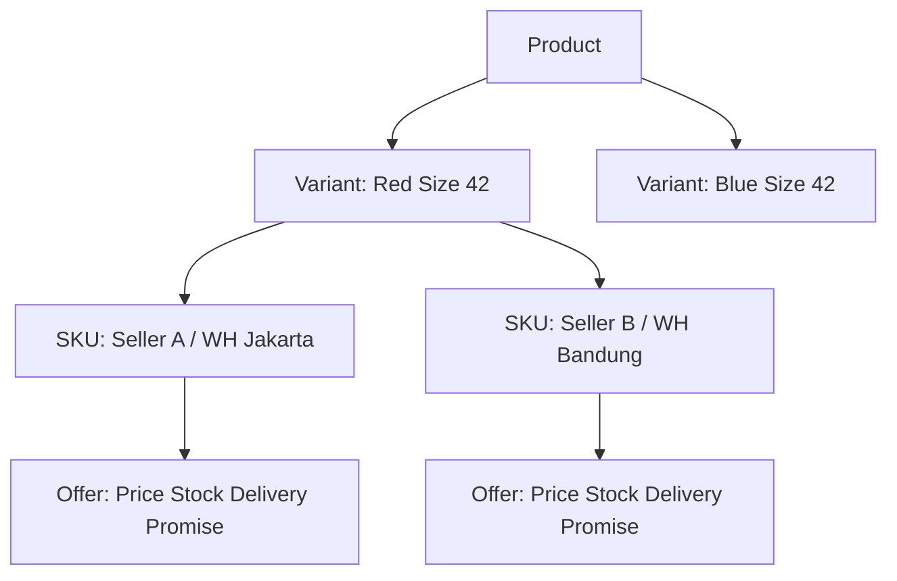
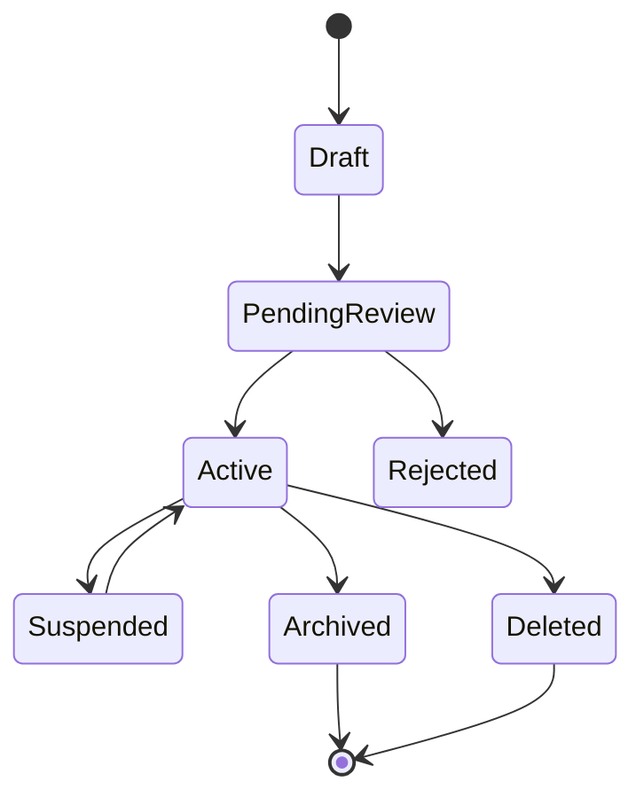
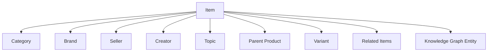
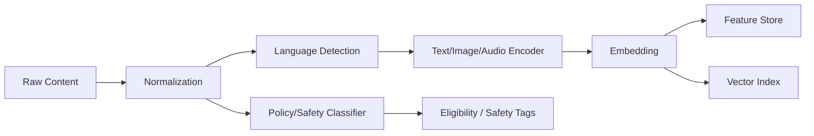
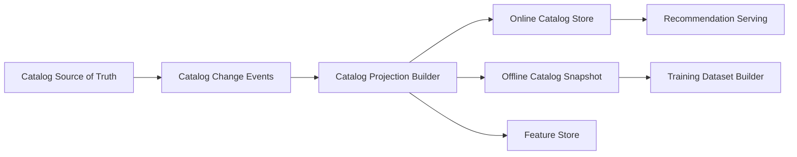

------
title: Build From Scratch Recommendations System - Part 009
description: Membangun item catalog dan content entity model untuk recommendation system production-grade: item identity, SKU, variant, lifecycle, eligibility, metadata, content features, quality signals, dan catalog versioning.
series: learn-build-from-scratch-recommendations-system
seriesTitle: Build From Scratch: Enterprise Recommendations System
order: 9
partTitle: Item Catalog & Content Entity Modeling
tags:
  - recommendation-system
  - recsys
  - catalog
  - content-modeling
  - entity-modeling
  - data-modeling
  - series
date: 2026-07-02
---

# Part 009 — Item Catalog & Content Entity Modeling

Recommendation system tidak hanya memilih “item”.

Ia memilih **entity yang valid, tersedia, aman, relevan, dan layak ditampilkan** pada konteks tertentu.

Di sistem kecil, item sering dianggap satu tabel:

```sql
items(id, title, category, created_at)
```

Untuk demo, cukup.

Untuk production, tidak cukup.

Satu produk bisa punya banyak SKU. Satu SKU bisa punya stock berbeda per warehouse. Satu artikel bisa punya versi editorial. Satu video bisa punya policy restriction per region. Satu job posting bisa expired. Satu knowledge article bisa hanya boleh dilihat role tertentu. Satu regulatory case bisa punya access boundary. Satu creator bisa diblokir user. Satu seller bisa sedang under review. Satu item bisa valid untuk homepage tetapi tidak valid untuk checkout. Satu item bisa relevan secara model tetapi tidak boleh ditampilkan secara policy.

Jika item catalog salah, recommendation system akan melakukan kesalahan yang terlihat “bodoh”:

- merekomendasikan produk out of stock,
- menampilkan item yang sudah dihapus,
- menampilkan konten tidak sesuai umur,
- merekomendasikan item yang tidak tersedia di region user,
- menampilkan item duplikat karena variant tidak dimodelkan,
- menampilkan produk dengan harga lama,
- menyarankan artikel yang sudah deprecated,
- menampilkan case/knowledge item yang tidak boleh diakses actor,
- membuat model belajar dari metadata yang berubah setelah event terjadi.

Part ini membahas item catalog dan content entity modeling sebagai fondasi recommendation system production-grade.

---

## 1. Mental Model: Item Bukan Sekadar Row

Recommendation item adalah **decision candidate**.

Sebuah candidate harus bisa menjawab:

1. Apa identity-nya?
2. Apa jenis entity-nya?
3. Apakah eligible untuk user/context/surface ini?
4. Apa metadata yang menjelaskannya?
5. Apa signal kualitasnya?
6. Apa lifecycle state-nya?
7. Apa relationship-nya dengan entity lain?
8. Apa versi data yang dipakai saat rekomendasi dibuat?
9. Bagaimana ia di-feature-kan untuk retrieval/ranking?
10. Apakah boleh ditampilkan secara policy?

Jadi, item catalog bukan hanya sumber title dan category. Ia adalah **source of truth untuk recommendability**.

---

## 2. Item Identity

Mulai dari identity.

Contoh buruk:

```json
{
  "id": "123"
}
```

Tidak jelas:

- 123 itu product?
- SKU?
- variant?
- article?
- seller?
- campaign?
- knowledge article?
- case?
- content version?
- tenant-specific item?

Lebih sehat:

```json
{
  "item_key": {
    "item_id": "prod_123",
    "item_type": "product",
    "item_version": "v17",
    "tenant_id": "tenant_001",
    "catalog_version": "2026-07-02T00:00:00Z"
  }
}
```

Minimal item key production:

- `item_id`
- `item_type`
- `catalog_version` atau `item_version`
- tenant/market jika multi-tenant atau multi-region

Jika item bisa berubah makna besar, versioning menjadi wajib.

---

## 3. Item Type

Recommendation system yang sehat tidak mengasumsikan semua item sama.

Contoh item type:

```text
product
sku
product_variant
video
article
song
playlist
creator
seller
job
course
restaurant
hotel
flight_offer
case
knowledge_article
next_action
policy_rule
agent_task
document
```

Setiap item type punya:

- identity berbeda,
- metadata berbeda,
- eligibility berbeda,
- lifecycle berbeda,
- objective berbeda,
- feature berbeda,
- ranking meaning berbeda.

Jangan memaksakan semua menjadi `item`.

Lebih baik gunakan model:

```json
{
  "item_id": "ka_123",
  "item_type": "knowledge_article",
  "attributes": {
    "title": "How to escalate suspicious transaction cases",
    "topic": "aml_escalation",
    "jurisdiction": "ID",
    "audience_role": ["case_investigator", "supervisor"]
  }
}
```

Untuk API, tetap bisa memakai generic `item_id`, tetapi internal semantic harus typed.

---

## 4. Product, SKU, dan Variant

Di e-commerce, item modeling sering salah karena produk, SKU, dan variant dicampur.

Contoh:

```text
Product: Nike Air Example
Variant: Red / Size 42
SKU: warehouse-specific sellable unit
Offer: seller-specific price and availability
```

Model sederhana:



Pertanyaan recommendation:

- Apakah kita merekomendasikan product-level atau SKU-level?
- Jika product-level, variant mana yang ditampilkan?
- Jika SKU-level, bagaimana menghindari duplikat produk?
- Jika offer-level, bagaimana menangani seller fairness dan price competitiveness?

Homepage biasanya product-level. Checkout upsell bisa SKU/offer-level. Marketplace ads bisa offer-level. Similar product bisa product-level tetapi stock-aware.

Salah modeling akan menyebabkan:

- banyak variant produk sama memenuhi feed,
- produk direkomendasikan padahal tidak ada stock,
- harga yang tampil tidak sesuai,
- seller tertentu mendapat exposure berlebihan,
- feature training tidak konsisten dengan serving.

---

## 5. Content Entity: Video, Article, Music, Course

Untuk content platform, entity tidak hanya item tunggal.

Contoh video:

```json
{
  "item_id": "vid_123",
  "item_type": "video",
  "creator_id": "creator_55",
  "channel_id": "channel_10",
  "duration_seconds": 642,
  "language": "id",
  "topics": ["distributed_systems", "java"],
  "content_rating": "general",
  "published_at": "2026-06-20T08:00:00Z",
  "policy_state": "approved"
}
```

Content recommendation perlu memikirkan:

- creator affinity,
- topic affinity,
- duration fit,
- freshness,
- language,
- content safety,
- duplicate/syndicated content,
- series/episode order,
- already consumed state,
- completion likelihood,
- quality signal,
- production value,
- thumbnail/title effect.

Untuk article:

- publication time,
- editorial section,
- author,
- topic,
- paywall status,
- article length,
- evergreen vs breaking news,
- update/correction status,
- sensitivity.

Untuk course:

- prerequisite,
- difficulty,
- duration,
- completion path,
- certification,
- cohort availability,
- learner goal.

Jadi item model harus menangkap “apa yang membuat entity ini layak direkomendasikan”.

---

## 6. Enterprise Entity: Case, Knowledge Article, Next Action

Untuk sistem enterprise/regulatory/case management, recommendation item bisa berupa tindakan atau entity internal.

Contoh:

```json
{
  "item_id": "action_escalate_to_level_2",
  "item_type": "next_action",
  "domain": "enforcement_case",
  "attributes": {
    "action_code": "ESCALATE_L2",
    "requires_permission": "case:escalate",
    "jurisdiction": "ID",
    "applicable_case_states": ["UNDER_REVIEW", "PENDING_EVIDENCE"],
    "risk_level_min": "medium"
  }
}
```

Atau knowledge article:

```json
{
  "item_id": "ka_aml_047",
  "item_type": "knowledge_article",
  "attributes": {
    "topic": "suspicious_transaction_review",
    "jurisdiction": "ID",
    "audience_roles": ["investigator", "supervisor"],
    "valid_from": "2026-01-01",
    "valid_until": null,
    "policy_version": "aml-policy-2026-v2"
  }
}
```

Di sini recommendation bukan hanya relevansi. Ia harus defensible:

- actor boleh melihat?
- case state cocok?
- jurisdiction cocok?
- SOP masih valid?
- recommendation bisa dijelaskan?
- audit trail cukup?
- apakah tindakan berisiko tinggi perlu human confirmation?

Untuk domain seperti ini, catalog modeling harus sangat eksplisit.

---

## 7. Item Lifecycle

Item punya lifecycle.

Contoh lifecycle umum:



Untuk recommendation, state memengaruhi eligibility.

Contoh:

| State | Recommendable? | Notes |
|---|---:|---|
| draft | no | belum public |
| pending_review | no | belum approved |
| active | yes | default eligible |
| suspended | no | policy/quality issue |
| archived | usually no | bisa untuk internal search |
| deleted | no | tidak boleh tampil |
| expired | no | kecuali historical view |
| out_of_stock | context-dependent | bisa show alternative |
| coming_soon | context-dependent | bisa untuk waitlist |

State harus versioned dan event-driven.

```json
{
  "event_name": "item_lifecycle_changed",
  "item_id": "item_123",
  "old_state": "active",
  "new_state": "suspended",
  "changed_at": "2026-07-02T10:00:00Z",
  "reason": "policy_violation",
  "policy_version": "policy-20260701"
}
```

Recommendation serving harus cepat mengetahui state change. Jangan menunggu batch update harian untuk item yang harus disembunyikan sekarang.

---

## 8. Recommendability vs Availability vs Visibility

Bedakan tiga konsep.

### 8.1 Recommendability

Apakah item layak masuk recommendation system?

Contoh tidak recommendable:

- item low quality,
- item banned,
- item internal-only,
- item duplicate,
- item terlalu baru dan belum divalidasi,
- item tidak punya metadata minimal.

### 8.2 Availability

Apakah item tersedia untuk user/context?

Contoh:

- stock ada,
- wilayah delivery mendukung,
- subscription user punya akses,
- content tersedia di region,
- job posting masih open,
- course enrollment masih available.

### 8.3 Visibility

Apakah actor boleh melihat item?

Contoh:

- role permission,
- tenant boundary,
- age restriction,
- safety filter,
- block/mute,
- privacy setting.

Satu item bisa recommendable secara umum tetapi tidak available atau tidak visible untuk request tertentu.

Formula:

```text
candidate_eligible =
  recommendable(item)
  AND available(item, context)
  AND visible(item, actor)
  AND not_suppressed(user, item)
```

Jangan mencampur semua ke satu boolean `is_active`.

---

## 9. Eligibility Contract

Eligibility sebaiknya dimodelkan eksplisit.

```json
{
  "eligibility": {
    "recommendable": true,
    "active": true,
    "policy_approved": true,
    "available_regions": ["ID", "MY", "SG"],
    "allowed_surfaces": ["home_feed", "product_detail_related"],
    "min_age": 13,
    "required_entitlements": [],
    "blocked_user_segments": ["child_profile"],
    "valid_from": "2026-07-01T00:00:00Z",
    "valid_until": null
  }
}
```

Untuk B2B:

```json
{
  "visibility": {
    "tenant_id": "bank_001",
    "required_permissions": ["case:read"],
    "allowed_roles": ["investigator", "supervisor"],
    "jurisdictions": ["ID"],
    "data_classification": "confidential"
  }
}
```

Eligibility harus bisa dievaluasi cepat di serving path.

---

## 10. Metadata Taxonomy

Item metadata bisa dibagi:

### 10.1 Descriptive Metadata

Menjelaskan item.

- title,
- description,
- category,
- tags,
- brand,
- author,
- creator,
- language,
- duration,
- price,
- location,
- difficulty.

### 10.2 Operational Metadata

Menentukan availability.

- stock,
- status,
- region,
- delivery promise,
- subscription tier,
- valid_from,
- valid_until,
- expiry time.

### 10.3 Policy Metadata

Menentukan safety/visibility.

- content rating,
- moderation state,
- age gate,
- sensitive category,
- compliance tags,
- blocked regions,
- legal restriction.

### 10.4 Quality Metadata

Menentukan confidence dan ranking.

- rating,
- return rate,
- complaint rate,
- creator trust,
- seller quality,
- freshness,
- editorial score,
- content completeness,
- image quality.

### 10.5 Behavioral Metadata

Diturunkan dari interaction.

- views,
- clicks,
- purchases,
- completion rate,
- dwell time,
- skip rate,
- hide rate,
- repeat engagement,
- conversion rate.

Jangan mencampur metadata static dan behavioral tanpa versioning/freshness. Behavioral metadata berubah cepat.

---

## 11. Item Quality Signals

Ranking tidak boleh hanya mengejar user affinity. Item quality penting.

Contoh quality signals:

- average rating,
- review count,
- return/refund rate,
- complaint rate,
- report rate,
- seller/creator trust score,
- content completeness,
- policy safety score,
- freshness score,
- availability reliability,
- delivery performance,
- duplicate likelihood,
- spam score,
- editorial score,
- expert score,
- knowledge article validity.

Quality signal bisa menjadi:

- hard filter,
- ranking feature,
- reranking constraint,
- guardrail metric,
- monitoring dimension.

Contoh:

```text
if policy_safety_score < threshold:
    exclude
elif quality_score low:
    demote
else:
    allow ranker to decide
```

Jangan membuat ranker sendirian mempelajari semua hal safety/quality. Beberapa hal harus hard constraint.

---

## 12. Item Relationship Graph

Item sering terkait entity lain.



Relationship penting untuk:

- content-based recommendation,
- graph recommendation,
- diversity,
- deduplication,
- explainability,
- fairness,
- cold start,
- category exposure,
- policy propagation.

Contoh relationship:

```json
{
  "item_id": "item_101",
  "relationships": [
    {
      "type": "belongs_to_category",
      "target_type": "category",
      "target_id": "camera",
      "confidence": 1.0
    },
    {
      "type": "created_by",
      "target_type": "creator",
      "target_id": "creator_55",
      "confidence": 1.0
    },
    {
      "type": "similar_to",
      "target_type": "item",
      "target_id": "item_202",
      "confidence": 0.83,
      "source": "embedding_similarity"
    }
  ]
}
```

Relationship juga harus versioned. Category taxonomy bisa berubah.

---

## 13. Category Taxonomy

Category bukan sekadar label.

Taxonomy memengaruhi:

- feature engineering,
- diversity,
- filtering,
- navigation,
- reporting,
- fairness,
- exploration,
- cold start,
- business rules.

Contoh taxonomy:

```text
Electronics
  Cameras
    Mirrorless Cameras
      Full Frame
      APS-C
```

Pertanyaan desain:

- Apakah item bisa punya multi-category?
- Apakah category human-curated atau model-generated?
- Apakah taxonomy global atau per market?
- Apakah taxonomy berubah seiring waktu?
- Bagaimana migration historical data?
- Apakah category leaf dan ancestor disimpan?

Lebih baik simpan path:

```json
{
  "primary_category": {
    "category_id": "mirrorless_camera",
    "path": ["electronics", "cameras", "mirrorless_camera"],
    "taxonomy_version": "tax-20260701"
  }
}
```

Jika taxonomy berubah tanpa versioning, historical feature dan metric menjadi sulit dibandingkan.

---

## 14. Text, Image, Audio, dan Multimodal Features

Item catalog tidak selalu hanya structured metadata. Banyak item butuh content understanding.

Feature sources:

- title text,
- description,
- reviews,
- transcript,
- image,
- thumbnail,
- audio,
- video frames,
- document body,
- code/content snippets,
- policy text,
- case notes.

Pipeline umum:



Beberapa feature hasil ekstraksi:

- text embedding,
- image embedding,
- topic classification,
- language,
- sentiment,
- safety category,
- brand/entity extraction,
- duplicate detection,
- semantic cluster.

Production issue:

- model extraction version,
- content update trigger,
- large payload handling,
- fallback jika extraction gagal,
- sensitive text redaction,
- embedding refresh,
- cost.

---

## 15. Item Embedding Lifecycle

Item embedding bukan nilai statis selamanya.

Embedding bisa berubah karena:

- model encoder baru,
- metadata item berubah,
- description diperbarui,
- thumbnail diganti,
- interaction signal bertambah,
- taxonomy berubah,
- item quality berubah.

Simpan metadata embedding:

```json
{
  "embedding": {
    "vector_id": "emb_item_101_v5",
    "item_id": "item_101",
    "model": "item_encoder_20260701",
    "dimension": 256,
    "created_at": "2026-07-02T02:00:00Z",
    "source_fields": ["title", "description", "category", "image"],
    "content_version": "item_v17"
  }
}
```

Serving harus tahu embedding version mana yang dipakai oleh vector index.

Jangan mencampur embedding dari model berbeda dalam index yang sama kecuali memang compatible.

---

## 16. Item Freshness

Freshness punya dua makna:

1. item baru,
2. metadata/availability terbaru.

Contoh freshness features:

```text
age_since_published
age_since_catalog_created
age_since_last_stock_update
age_since_last_price_update
age_since_last_quality_review
age_since_embedding_refresh
```

Freshness penting untuk:

- news,
- social/content feed,
- marketplace stock,
- job postings,
- regulatory policy article,
- case next-action recommendation.

Namun freshness bukan selalu lebih baik. Untuk evergreen content, item lama bisa tetap bernilai.

Ranking harus membedakan:

```text
freshness relevance
vs
freshness requirement
```

Contoh:

- Breaking news: freshness requirement tinggi.
- Knowledge article SOP: validitas lebih penting daripada publish time.
- Product recommendation: stock/price freshness penting, created_at belum tentu.
- Course recommendation: evergreen bisa tetap bagus.

---

## 17. Catalog Events

Recommendation system harus bereaksi terhadap catalog changes.

Event penting:

```text
item_created
item_updated
item_deleted
item_lifecycle_changed
item_price_changed
item_stock_changed
item_policy_status_changed
item_quality_score_updated
item_embedding_updated
item_category_changed
item_availability_changed
seller_status_changed
creator_status_changed
```

Contoh:

```json
{
  "event_name": "item_stock_changed",
  "event_time": "2026-07-02T10:00:00Z",
  "item_id": "sku_123",
  "old_stock": 12,
  "new_stock": 0,
  "warehouse_id": "wh_jakarta",
  "region": "ID-JK"
}
```

Stock change bisa harus memengaruhi serving dalam detik, bukan jam.

Tidak semua catalog event punya urgency sama.

| Event | Serving urgency |
|---|---|
| policy banned | immediate |
| deleted | immediate |
| out of stock | high |
| price changed | medium/high |
| description updated | medium |
| category changed | medium |
| embedding refresh | batch/nearline |
| quality score update | nearline |

---

## 18. Catalog Snapshot for Training

Training data butuh metadata item sesuai waktu event.

Jika user melihat produk pada 1 Juli dengan harga 100 ribu, lalu harga 150 ribu pada 5 Juli, training example 1 Juli tidak boleh memakai harga 150 ribu.

Rule:

```text
item_features = item_state_at(impression_time)
```

Ini point-in-time correctness.

Simpan item snapshot atau event-sourced catalog.

Approach:

1. **Snapshot table per day/hour**  
   Sederhana, storage besar, granularitas terbatas.

2. **Event-sourced catalog**  
   Fleksibel, reconstruct lebih kompleks.

3. **Slowly Changing Dimension Type 2**  
   Cocok untuk warehouse analytics.

Contoh SCD2:

```text
item_id | price | category | valid_from | valid_to
item_1  | 100   | camera   | Jul 1      | Jul 5
item_1  | 150   | camera   | Jul 5      | null
```

Training builder harus join berdasarkan `event_time`.

---

## 19. Duplicate and Near-Duplicate Items

Duplicate merusak user experience dan metrics.

Jenis duplicate:

- exact duplicate,
- same product different seller,
- same article syndicated,
- same video reupload,
- same job reposted,
- variant duplicate,
- semantic duplicate,
- near-identical image/title.

Duplicate handling:

1. Identify duplicate group.
2. Choose canonical item.
3. Keep variants/offers if business requires.
4. Suppress duplicates in same slate.
5. Diversify across creators/sellers.
6. Preserve attribution.

Contoh:

```json
{
  "dedup": {
    "dedup_group_id": "product_family_123",
    "canonical_item_id": "prod_123",
    "dedup_strategy": "one_per_group_per_slate"
  }
}
```

Dedup bukan hanya data cleaning. Ia bagian dari slate construction.

---

## 20. Item Cold Start

Item baru belum punya interaction history.

Solusi:

- content-based features,
- category/brand/creator priors,
- seller/creator quality,
- editorial boost,
- controlled exploration,
- semantic similarity,
- onboarding metadata completeness,
- new item quota,
- uncertainty-aware ranking.

Item catalog harus menyediakan metadata awal yang cukup.

Checklist item baru:

```text
[ ] title tersedia
[ ] description cukup
[ ] category valid
[ ] image/thumbnail valid
[ ] policy approved
[ ] availability valid
[ ] quality minimum satisfied
[ ] content embedding generated
[ ] item eligible for exploration
```

Kalau metadata awal buruk, cold-start recommendation akan buruk.

---

## 21. Item Feature Contract

Untuk setiap item type, definisikan feature contract.

Contoh product:

```yaml
item_type: product
required_features:
  - category_id
  - brand_id
  - price_bucket
  - availability_state
  - policy_state
  - quality_score
optional_features:
  - text_embedding
  - image_embedding
  - seller_quality_score
  - historical_ctr_7d
  - conversion_rate_30d
freshness_sla:
  availability_state: 60s
  price_bucket: 5m
  quality_score: 24h
  embedding: 24h
```

Contoh knowledge article:

```yaml
item_type: knowledge_article
required_features:
  - topic
  - jurisdiction
  - valid_from
  - valid_until
  - allowed_roles
  - policy_version
optional_features:
  - text_embedding
  - usage_success_rate
  - expert_quality_score
freshness_sla:
  validity_state: 5m
  embedding: 24h
```

Feature contract membantu feature store, ranking, eligibility, dan monitoring.

---

## 22. Multi-Tenant Catalog

Untuk enterprise atau SaaS, catalog bisa multi-tenant.

Pertanyaan:

- Apakah item global atau tenant-specific?
- Apakah tenant bisa override metadata?
- Apakah item dari tenant A boleh memengaruhi model tenant B?
- Apakah taxonomy sama untuk semua tenant?
- Apakah quality signal dihitung global atau tenant-local?
- Apakah model shared atau per tenant?

Contoh:

```json
{
  "item_id": "ka_123",
  "global_item_id": "global_ka_aml_047",
  "tenant_id": "bank_001",
  "overrides": {
    "title": "Internal AML Escalation Procedure",
    "allowed_roles": ["investigator_l2"]
  }
}
```

Multi-tenant recommendation harus hati-hati terhadap leakage.

Jangan training model tenant B menggunakan interaction tenant A jika data isolation melarang.

---

## 23. Item Access Control

Untuk enterprise, access control harus masuk catalog model.

Contoh:

```json
{
  "access_control": {
    "visibility": "restricted",
    "required_permissions": ["case:read_sensitive"],
    "allowed_roles": ["supervisor"],
    "allowed_tenants": ["bank_001"],
    "data_classification": "confidential",
    "jurisdiction": "ID"
  }
}
```

Retrieval harus aware terhadap access boundary.

Anti-pattern:

```text
retrieve all semantically similar documents
then filter unauthorized documents at the end
```

Kenapa riskan?

- debug trace bisa membocorkan judul item,
- logs bisa menyimpan unauthorized candidates,
- latency terbuang,
- side-channel bisa muncul,
- policy reasoning sulit diaudit.

Lebih baik:

```text
authorization-aware retrieval
+ final policy filter
```

---

## 24. Item Explainability Fields

Jika ingin menjelaskan rekomendasi, catalog perlu data yang dapat dijelaskan.

Contoh reason:

- “Karena Anda melihat kamera mirrorless”
- “Populer di kategori Java backend”
- “Sering digunakan pada case dengan risiko serupa”
- “Artikel ini berlaku untuk jurisdiction ID”
- “Produk ini cocok dengan item di cart”

Untuk itu, item harus punya:

- category label,
- topic label,
- creator/brand,
- relationship,
- applicability,
- quality reason,
- source provenance.

Jangan menjelaskan berdasarkan embedding mentah. Embedding similarity bisa menjadi sumber, tetapi explanation harus memakai semantic fields yang stabil.

---

## 25. Catalog Serving Store

Recommendation API butuh subset catalog dengan latency rendah.

Tidak semua metadata perlu online.

Online fields:

- item_id,
- item_type,
- title/thumb minimal,
- active state,
- availability,
- policy state,
- region,
- allowed surface,
- dedup group,
- quality score,
- key features,
- display payload.

Offline fields:

- long description,
- raw content,
- historical snapshots,
- full audit metadata,
- extraction artifacts,
- training-only features.

Pattern:



Catalog projection harus versioned dan observable.

---

## 26. Catalog Consistency

Distributed recommendation system sering punya beberapa store:

- catalog DB,
- search index,
- vector index,
- feature store,
- online cache,
- training snapshot,
- analytics warehouse.

Masalah:

```text
item active in vector index
but deleted in catalog DB
```

Maka serving harus punya final truth check.

Pattern:

1. Retrieval boleh mengembalikan stale candidates.
2. Eligibility service/catalog projection melakukan final validation.
3. Invalid candidates difilter.
4. Metrics mencatat stale candidate rate.
5. Index refresh memperbaiki akar masalah.

Metric penting:

```text
stale_candidate_rate
invalid_candidate_rate
out_of_stock_candidate_rate
policy_filtered_candidate_rate
catalog_lookup_latency
catalog_projection_lag
```

---

## 27. Anti-Patterns

### 27.1 One Boolean `active`

`active = true` tidak cukup untuk region, surface, stock, policy, entitlement, age gate, tenant, dan validity window.

### 27.2 Product and SKU Mixed

Membuat duplicate, wrong price, dan stock mismatch.

### 27.3 No Catalog Version

Training memakai metadata masa depan.

### 27.4 Eligibility Only at UI

Backend tetap mengembalikan item tidak valid. Logs, metrics, dan model training tercemar.

### 27.5 Raw Metadata as Features Without Contract

Field berubah format, model silent failure.

### 27.6 No Dedup Group

Feed penuh item yang sama dalam variant berbeda.

### 27.7 No Policy State in Catalog

Recommendation menampilkan item sebelum moderation selesai.

### 27.8 Embedding Without Version

Vector index berisi campuran embedding incompatible.

### 27.9 Treating Item Type as Display Detail

Padahal item type memengaruhi objective, feature, lifecycle, eligibility, dan ranking.

### 27.10 Authorization After Retrieval Only

Untuk enterprise, ini bisa membocorkan keberadaan entity.

---

## 28. Minimal Production Catalog Model

Untuk build pertama, gunakan model ini:

```json
{
  "item_id": "item_101",
  "item_type": "product",
  "item_version": "v17",
  "catalog_version": "2026-07-02T00:00:00Z",
  "tenant_id": null,
  "display": {
    "title": "Mirrorless Camera X",
    "subtitle": "Compact camera for creators",
    "image_url": "..."
  },
  "taxonomy": {
    "primary_category_id": "mirrorless_camera",
    "category_path": ["electronics", "camera", "mirrorless_camera"],
    "taxonomy_version": "tax-20260701"
  },
  "availability": {
    "state": "available",
    "regions": ["ID"],
    "valid_from": "2026-07-01T00:00:00Z",
    "valid_until": null
  },
  "eligibility": {
    "recommendable": true,
    "allowed_surfaces": ["home_feed", "product_detail_related"],
    "policy_state": "approved",
    "min_age": null
  },
  "quality": {
    "quality_score": 0.82,
    "rating": 4.6,
    "complaint_rate_30d": 0.01
  },
  "dedup": {
    "dedup_group_id": "product_family_101",
    "canonical_item_id": "item_101"
  },
  "features": {
    "price_bucket": "mid",
    "brand_id": "brand_88",
    "text_embedding_id": "emb_text_item_101_v5",
    "image_embedding_id": "emb_img_item_101_v2"
  },
  "updated_at": "2026-07-02T08:00:00Z"
}
```

Untuk enterprise item, tambahkan access control.

---

## 29. Checklist Item Catalog Readiness

```text
[ ] Item punya typed identity.
[ ] Item punya version/catalog snapshot.
[ ] Product, SKU, variant, offer tidak dicampur.
[ ] Item type memengaruhi feature/eligibility/ranking.
[ ] Lifecycle state eksplisit.
[ ] Recommendability, availability, dan visibility dibedakan.
[ ] Eligibility bisa dievaluasi di serving path.
[ ] Policy state tersedia dan fresh.
[ ] Region/surface/entitlement constraints tersedia.
[ ] Dedup group tersedia.
[ ] Category taxonomy versioned.
[ ] Item relationship graph tersedia minimal.
[ ] Quality signals tersedia.
[ ] Content embeddings punya model/version.
[ ] Catalog change events tersedia.
[ ] Training bisa join item state point-in-time.
[ ] Multi-tenant/access boundary jelas.
[ ] Catalog projection lag dimonitor.
[ ] Invalid/stale candidate rate dimonitor.
```

---

## 30. Kesimpulan

Recommendation system tidak memilih item abstrak. Ia memilih entity yang hidup di catalog dengan identity, type, lifecycle, policy, quality, relationship, dan availability.

Prinsip penting:

1. Item adalah decision candidate, bukan sekadar row.
2. Product, SKU, variant, offer, content, dan enterprise entity harus dimodelkan berbeda.
3. Recommendability, availability, dan visibility harus dipisahkan.
4. Catalog harus versioned untuk training yang benar.
5. Eligibility harus masuk serving path.
6. Policy dan access control bukan tambahan UI.
7. Content features dan embeddings harus punya lifecycle.
8. Duplicate handling adalah bagian dari recommendation quality.
9. Multi-tenant catalog harus mencegah data leakage.
10. Catalog projection harus observable.

Di Part 010, kita akan membahas **Context Modeling: Time, Location, Surface, Intent**. User dan item yang sama bisa menghasilkan recommendation yang benar-benar berbeda tergantung konteks request.
