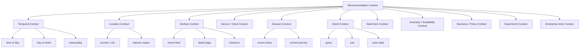
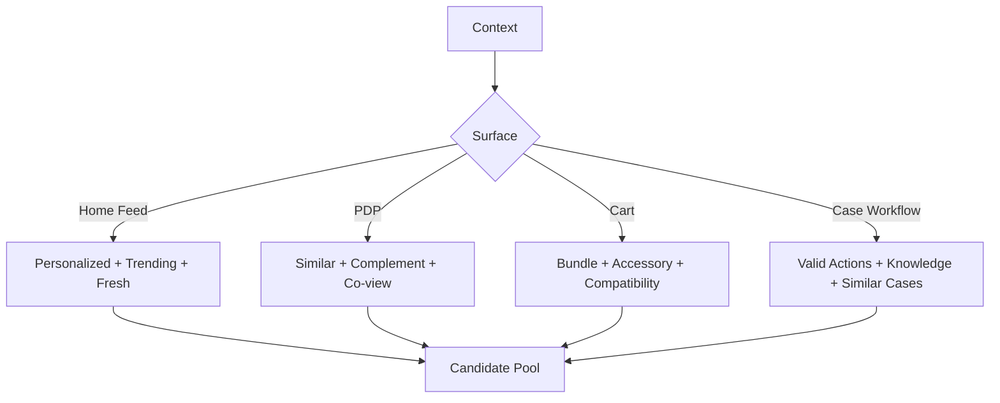
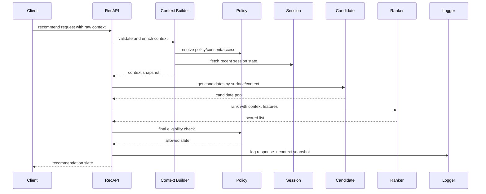

------
title: Build From Scratch Recommendations System - Part 010
description: Mendesain context modeling untuk recommendation system production-grade: time, location, surface, device, session intent, query intent, inventory, tenant, role, request constraints, dan context-aware serving.
series: learn-build-from-scratch-recommendations-system
seriesTitle: Build From Scratch: Enterprise Recommendations System
order: 10
partTitle: Context Modeling: Time, Location, Surface, Intent
tags:
  - recommendation-system
  - recsys
  - context-aware
  - personalization
  - ranking
  - system-design
  - series
date: 2026-07-02
---

# Part 010 — Context Modeling: Time, Location, Surface, Intent

User yang sama. Item yang sama. Model yang sama.

Tetapi hasil recommendation yang benar bisa berbeda total karena konteksnya berbeda.

Contoh:

- Pagi hari user butuh berita cepat, malam hari user menonton video panjang.
- Di homepage user ingin discovery, di checkout user ingin pelengkap cart.
- Di mobile user mungkin browsing ringan, di desktop user membandingkan detail.
- Di Jakarta item tersedia, di kota lain tidak.
- Di session ini user mencari kamera, walau long-term profile-nya suka buku software.
- Dalam case management, actor yang sama bisa bertindak sebagai investigator di satu case dan supervisor di case lain.
- Pada surface “related items”, item seed jauh lebih penting daripada long-term profile.
- Pada feed anak, safety context lebih kuat daripada engagement objective.

Jika recommendation system mengabaikan context, ia akan terlihat seperti sistem yang “personalized tapi tidak mengerti situasi”.

Part ini membahas context modeling sebagai first-class input dalam recommendation system.

---

## 1. Mental Model: Recommendation = Decision Under Context

Rekomendasi bukan fungsi sederhana:

```text
recommend(user) -> items
```

Production recommendation lebih tepat:

```text
recommend(subject, context, surface, constraints, policy) -> ranked slate
```

Atau:

```text
score(user, item, context) -> utility
```

Context menjawab:

- user sedang di mana dalam journey?
- apa intent saat ini?
- surface apa yang meminta rekomendasi?
- waktu dan lokasi apa?
- device apa?
- item seed apa?
- inventory apa yang tersedia?
- policy apa yang berlaku?
- experiment apa yang aktif?
- latency budget berapa?
- apa yang boleh dan tidak boleh dimunculkan?

Context bukan dekorasi. Context mengubah objective, candidate sources, feature, ranking weight, policy, layout, dan fallback.

---

## 2. Context Taxonomy

Kita pecah context menjadi beberapa kelompok.



Tidak semua context diperlukan untuk semua request. Tetapi taxonomy membantu kita tidak mencampur semuanya ke satu map bebas.

---

## 3. Context Envelope

Recommendation API perlu context envelope yang eksplisit.

Contoh:

```json
{
  "request_id": "req_001",
  "surface": "home_feed",
  "subject": {
    "user_id": "u123",
    "anonymous_id": "anon_789",
    "session_id": "sess_abc"
  },
  "context": {
    "time": {
      "request_time": "2026-07-02T10:00:00Z",
      "timezone": "Asia/Jakarta",
      "local_hour": 17,
      "day_of_week": "Thursday"
    },
    "location": {
      "country": "ID",
      "city": "Jakarta",
      "delivery_region": "ID-JK"
    },
    "device": {
      "type": "mobile",
      "os": "android",
      "app_version": "5.8.1",
      "network_type": "wifi"
    },
    "surface_context": {
      "surface": "home_feed",
      "placement": "main_feed",
      "page_index": 0
    },
    "session": {
      "recent_item_ids": ["item_1", "item_2"],
      "recent_search_terms": ["mirrorless camera"]
    }
  }
}
```

Jangan membiarkan client mengirim context bebas tanpa contract. Context harus typed dan versioned.

---

## 4. Surface Context

Surface adalah salah satu context paling penting.

Surface memengaruhi:

- objective,
- candidate source,
- latency budget,
- item type,
- layout,
- number of items,
- diversity rule,
- freshness requirement,
- logging,
- experiment unit,
- fallback.

Contoh surface:

| Surface | Primary intent | Candidate source |
|---|---|---|
| home_feed | discovery | multi-source personalized |
| product_detail_related | similarity/complement | item-to-item, graph, embedding |
| cart_cross_sell | complement purchase | bundle, co-buy, compatibility |
| checkout_upsell | final conversion | high-confidence, low-friction |
| search_zero_result | recover intent | query semantic match |
| video_next_up | continue watching | sequence/session |
| email_digest | re-engagement | batch personalized |
| notification | timely trigger | event-based |
| knowledge_article_sidebar | task support | case context semantic |
| case_next_action | workflow decision | rules + historical outcome |

Same user/item pair bisa punya score berbeda per surface.

Contoh:

```text
homepage:
  novelty and diversity matter

checkout:
  confidence and availability matter more

case next action:
  policy validity and state transition correctness matter most
```

Jadi jangan gunakan satu global ranker tanpa surface awareness kecuali sistem masih sangat awal.

---

## 5. Surface Contract

Definisikan contract per surface.

Contoh:

```yaml
surface: cart_cross_sell
allowed_item_types:
  - product
  - sku
objective:
  primary: add_to_order_rate
  secondary:
    - gross_margin
    - low_return_rate
constraints:
  max_items: 8
  must_be_in_stock: true
  must_deliver_to_region: true
  exclude_items_already_in_cart: true
candidate_sources:
  - frequently_bought_together
  - compatible_accessories
  - category_complements
ranking_features:
  - cart_item_similarity
  - price_ratio_to_cart
  - delivery_promise
  - historical_attach_rate
latency_budget_ms: 120
fallback:
  - popular_accessories_by_category
```

Surface contract mencegah recommendation API menjadi endpoint generik yang tidak jelas.

---

## 6. Temporal Context

Time matters.

Contoh temporal features:

- hour of day,
- day of week,
- weekend/weekday,
- holiday,
- season,
- payday,
- campaign period,
- product launch period,
- freshness age,
- event recency,
- session recency,
- local time vs UTC.

Time bisa memengaruhi:

- what user wants,
- item availability,
- inventory,
- price,
- news freshness,
- delivery promise,
- conversion likelihood,
- exploration policy.

Contoh:

```json
"time_context": {
  "request_time_utc": "2026-07-02T10:00:00Z",
  "timezone": "Asia/Jakarta",
  "local_date": "2026-07-02",
  "local_hour": 17,
  "day_of_week": "Thursday",
  "is_weekend": false,
  "seasonal_context": ["mid_year_sale"]
}
```

Jangan hanya menyimpan UTC timestamp. Untuk user behavior, local time sering lebih bermakna.

---

## 7. Time Window Features

Recommendation banyak memakai rolling windows.

Contoh:

```text
user_click_count_category_1h
user_click_count_category_24h
item_ctr_1h
item_ctr_7d
seller_order_count_30d
session_view_count_10m
topic_trend_score_3h
```

Window berbeda menjawab pertanyaan berbeda.

- 5 menit: real-time intent.
- 1 jam: session/topic burst.
- 24 jam: daily interest.
- 7 hari: short-term preference.
- 30/90 hari: long-term preference.

Jangan asal memilih window. Tentukan berdasarkan behavioral half-life.

Contoh:

```text
breaking news interest: minutes/hours
shopping intent: hours/days
professional skill interest: weeks/months
music taste: months/years
case workflow state: current case only
```

---

## 8. Recency Decay

Kadang lebih baik memakai decay daripada hard window.

Contoh:

```text
weight = exp(-lambda * age)
```

Interpretasi:

- event terbaru lebih berat,
- event lama masih berkontribusi,
- tidak ada cutoff kasar.

Praktisnya, kamu bisa memakai bucket:

```text
last_10_minutes
last_1_hour
last_24_hours
last_7_days
last_30_days
```

atau decay score:

```text
category_affinity_decayed_7d
```

Pilih yang mudah dijelaskan dan dioperasikan terlebih dahulu. Production system sering memakai kombinasi.

---

## 9. Location Context

Location memengaruhi:

- availability,
- legal restriction,
- language,
- shipping,
- local trend,
- currency,
- local seasonality,
- store proximity,
- jurisdiction,
- content rights,
- regulatory rules.

Contoh:

```json
"location_context": {
  "country": "ID",
  "region": "DKI Jakarta",
  "city": "Jakarta",
  "delivery_region": "ID-JK",
  "currency": "IDR",
  "locale": "id-ID",
  "jurisdiction": "ID"
}
```

Location harus punya granularity sesuai purpose.

Untuk recommendation umum, city/region cukup. Jangan menyimpan GPS presisi jika tidak perlu. Data minimization penting.

---

## 10. Location vs Jurisdiction

Location dan jurisdiction berbeda.

User bisa berada di Singapura tetapi menangani case Indonesia. User bisa bepergian tetapi account region tetap Indonesia. Produk bisa dikirim ke alamat Jakarta walau user browsing dari Bali.

Bedakan:

- current physical location,
- delivery location,
- account region,
- content rights region,
- legal jurisdiction,
- tenant jurisdiction,
- case jurisdiction.

Contoh B2B:

```json
{
  "actor_location": "SG",
  "tenant_region": "ID",
  "case_jurisdiction": "ID",
  "policy_jurisdiction": "ID"
}
```

Untuk regulatory recommendation, jurisdiction sering lebih penting daripada physical location.

---

## 11. Device and Client Context

Device memengaruhi behavior dan layout.

Fields:

```json
"device_context": {
  "device_type": "mobile",
  "os": "android",
  "app_version": "5.8.1",
  "screen_width": 390,
  "screen_height": 844,
  "network_type": "wifi",
  "client_capabilities": ["video_autoplay", "infinite_scroll"]
}
```

Pengaruh:

- mobile feed butuh item visual cepat,
- desktop bisa menampilkan tabel/comparison,
- low bandwidth perlu lightweight content,
- old app version mungkin tidak mendukung item type baru,
- screen size memengaruhi visible impression,
- notification context berbeda dari in-app context.

Device context juga penting untuk logging consistency. Impression definition bisa berbeda antara web/mobile jika tidak distandarkan.

---

## 12. Session Context

Session context adalah short-term memory.

Contoh:

```json
"session_context": {
  "session_id": "sess_abc",
  "started_at": "2026-07-02T09:40:00Z",
  "recent_item_views": ["item_1", "item_2"],
  "recent_clicks": ["item_2"],
  "recent_categories": ["camera", "lens"],
  "recent_search_terms": ["mirrorless camera"],
  "cart_item_ids": ["item_9"],
  "last_surface": "product_detail",
  "last_action": "add_to_cart"
}
```

Session context membantu sistem menangkap intent saat ini.

Namun session context rawan noise:

- user window shopping,
- user mencari hadiah untuk orang lain,
- shared device,
- accidental click,
- bot,
- multi-tab.

Jangan langsung memasukkan semua session event ke long-term profile.

---

## 13. Intent Context

Intent adalah dugaan tentang apa yang user sedang coba lakukan.

Intent bisa berasal dari:

- search query,
- current item seed,
- cart contents,
- page type,
- navigation path,
- case state,
- user action,
- campaign source,
- onboarding answer,
- explicit filter.

Contoh intent:

```json
"intent_context": {
  "intent_type": "shopping_research",
  "confidence": 0.78,
  "evidence": [
    "recent_search: mirrorless camera",
    "viewed_category: camera",
    "compared_products: 3"
  ]
}
```

Atau untuk enterprise:

```json
"intent_context": {
  "intent_type": "case_escalation_support",
  "confidence": 0.91,
  "evidence": [
    "case_state: PENDING_EVIDENCE",
    "risk_score: high",
    "actor_role: investigator"
  ]
}
```

Intent bisa explicit atau inferred. Jika inferred, simpan confidence dan version.

---

## 14. Query Context

Untuk search-aware recommendation, query sangat kuat.

Contoh surfaces:

- search results recommendation,
- zero-result recovery,
- related searches,
- query-based product suggestions,
- semantic document recommendation.

Query context:

```json
"query_context": {
  "raw_query": "kamera mirrorless untuk pemula",
  "normalized_query": "kamera mirrorless pemula",
  "language": "id",
  "detected_intents": ["beginner", "mirrorless_camera"],
  "filters": {
    "price_max": 10000000,
    "brand": null
  }
}
```

Caution:

- raw query bisa sensitif,
- query normalization harus versioned,
- query intent model bisa salah,
- query bisa multi-intent,
- query context sering harus mengalahkan long-term profile.

Jika user mencari “laptop gaming”, jangan homepage profile “buku java” mendominasi search recommendation.

---

## 15. Seed Item Context

Banyak rekomendasi dimulai dari item tertentu.

Contoh:

- similar products,
- related articles,
- next video,
- frequently bought together,
- compatible accessories,
- knowledge article related to current case.

Seed context:

```json
"seed_context": {
  "seed_item_id": "item_101",
  "seed_item_type": "product",
  "relationship_goal": "complement",
  "exclude_same_dedup_group": true
}
```

Relationship goal penting.

Untuk product detail page, recommendation bisa:

- similar items,
- alternatives,
- complements,
- bundles,
- upgrades,
- replacement parts.

Semua berbeda.

```text
similar != complement
alternative != accessory
upgrade != replacement
```

Jika goal tidak eksplisit, candidate generation akan campur aduk.

---

## 16. Cart Context

Cart context sangat kuat untuk e-commerce.

```json
"cart_context": {
  "cart_id": "cart_123",
  "items": [
    {
      "item_id": "camera_1",
      "quantity": 1,
      "category": "camera",
      "price": 8500000
    }
  ],
  "cart_total": 8500000,
  "currency": "IDR"
}
```

Cart recommendation harus memperhatikan:

- compatibility,
- attach rate,
- price ratio,
- delivery promise,
- already in cart,
- bundle discount,
- stock,
- return risk,
- user budget,
- checkout friction.

Contoh rule:

```text
Do not recommend accessory more expensive than main cart item unless explicitly upgrade-oriented.
```

Cart context adalah contoh di mana business logic dan model harus bekerja bersama.

---

## 17. Inventory and Availability Context

Recommendation harus aware terhadap inventory.

Contoh:

```json
"availability_context": {
  "delivery_region": "ID-JK",
  "delivery_date_target": "2026-07-04",
  "currency": "IDR",
  "stock_policy": "must_be_available_now",
  "seller_constraints": {
    "preferred_seller_ids": [],
    "blocked_seller_ids": ["seller_bad_1"]
  }
}
```

Untuk marketplace:

- stock bisa berubah cepat,
- seller quality berbeda,
- shipping time penting,
- price berbeda per region,
- item yang sama punya offer berbeda.

Candidate yang tidak available membuang latency dan merusak trust.

Serving path harus punya final availability check.

---

## 18. Policy Context

Policy context menentukan apa yang boleh ditampilkan.

Contoh:

```json
"policy_context": {
  "user_age_band": "adult",
  "child_profile": false,
  "content_safety_mode": "standard",
  "regulated_category_allowed": false,
  "jurisdiction": "ID",
  "surface_policy": "home_feed_policy_v7"
}
```

Untuk enterprise:

```json
"policy_context": {
  "tenant_id": "bank_001",
  "actor_role": "investigator",
  "permissions": ["case:read", "case:update"],
  "case_jurisdiction": "ID",
  "data_access_scope": "assigned_cases_only"
}
```

Policy context harus tersedia sebelum retrieval jika retrieval bisa mengakses restricted corpus.

---

## 19. Business Context

Business context tidak selalu sama dengan policy.

Contoh:

- campaign active,
- margin target,
- sponsored slot,
- seller boost,
- inventory clearance,
- new creator exposure,
- subscription tier,
- loyalty status,
- promotion eligibility.

Business context harus transparan dan terkontrol.

```json
"business_context": {
  "campaign_ids": ["mid_year_sale_2026"],
  "allow_sponsored": true,
  "sponsored_slots": [3, 7],
  "margin_strategy": "balanced",
  "promotion_eligible": true
}
```

Jangan menyembunyikan business rules sebagai magic weight di ranker. Simpan policy/version agar bisa diaudit.

---

## 20. Experiment Context

Experiment context memengaruhi:

- model version,
- feature set,
- candidate sources,
- reranking policy,
- layout,
- exploration rate,
- fallback behavior.

Contoh:

```json
"experiment_context": {
  "assignment_id": "assign_123",
  "variants": [
    {
      "experiment_key": "ranker_v3_home",
      "variant": "treatment"
    },
    {
      "experiment_key": "diversity_policy_test",
      "variant": "control"
    }
  ]
}
```

Event harus membawa experiment context agar metrics dan training bisa diatribusikan.

Jangan membuat model memilih variant tanpa logging.

---

## 21. Enterprise Workflow Context

Untuk regulatory/case management, context bisa berupa workflow state.

Contoh:

```json
"workflow_context": {
  "case_id": "case_789",
  "case_state": "UNDER_REVIEW",
  "risk_level": "high",
  "sla_remaining_hours": 6,
  "jurisdiction": "ID",
  "business_unit": "retail_banking",
  "current_task": "review_evidence",
  "actor_role": "investigator"
}
```

Recommendation possibilities:

- next action,
- similar case,
- knowledge article,
- escalation path,
- missing evidence,
- reviewer assignment,
- risk explanation.

Constraints:

- only recommend actions valid for current state,
- only show cases actor can access,
- use jurisdiction-specific policy,
- explain decision,
- avoid automating high-risk action without confirmation.

Context modeling di enterprise lebih dekat ke state machine dan policy reasoning daripada feed ranking murni.

---

## 22. Context Feature Store

Context bisa menjadi online feature.

Contoh feature groups:

```text
session_features: session_id
  - recent_category_counts_30m
  - recent_item_embedding_avg
  - last_action
  - session_depth

surface_features: surface
  - average_ctr_7d
  - position_bias_curve
  - default_candidate_mix

location_features: region
  - trending_items_1h
  - available_item_count
  - regional_conversion_rate

workflow_features: case_id
  - risk_score
  - case_age
  - pending_evidence_count
  - similar_case_cluster
```

Context features sering memiliki freshness SLA tinggi.

Misal:

- session recent clicks: seconds,
- stock: seconds/minutes,
- trending: minutes,
- case state: immediate,
- timezone/local hour: request-time computed.

---

## 23. Context-Aware Candidate Generation

Candidate source dipilih berdasarkan context.

Contoh:

```text
home_feed:
  two_tower personalized
  trending in region
  fresh content
  editorial picks

product_detail_related:
  item-to-item similarity
  co-view
  co-buy
  same category alternatives
  compatible accessories

cart:
  frequently bought together
  bundle candidates
  complementary categories

case_next_action:
  state-machine valid actions
  historical successful actions
  policy-required next steps
```

Candidate generation tidak boleh selalu sama untuk semua surface.

Diagram:



---

## 24. Context-Aware Ranking

Ranking model bisa memakai context dalam beberapa cara:

1. Context as feature.
2. Context-specific model.
3. Shared model with surface embedding.
4. Multi-task model per objective/surface.
5. Rule-based score composition per surface.
6. Separate re-ranker per context.

Awal yang sehat:

```text
one baseline ranker
+ surface feature
+ surface-specific candidate source mix
+ surface-specific reranking policy
```

Lalu berkembang ke:

```text
shared representation
+ task/surface-specific heads
```

Untuk enterprise deterministic workflow, ranking bisa hybrid:

```text
valid action rules
+ priority scoring
+ historical outcome model
+ explanation template
```

---

## 25. Context Freshness and Staleness

Context bisa stale.

Contoh:

- user location berubah,
- item stock habis,
- cart berubah,
- session state belum update,
- case state berubah,
- consent revoked,
- experiment assignment updated,
- app sends old page context.

Setiap context field perlu freshness expectation.

```yaml
context_field_sla:
  consent_state: immediate
  case_state: immediate
  stock_state: 60s
  session_recent_clicks: 5s
  trending_region: 5m
  user_long_term_profile: 24h
```

Serving harus tahu apakah stale acceptable.

Contoh:

```text
if case_state stale:
    fail closed or refresh synchronously

if trending stale:
    use stale with warning metric

if user profile stale:
    allow fallback
```

---

## 26. Context Validation

Context dari client tidak boleh dipercaya mentah.

Validasi:

- surface dikenal?
- item seed valid?
- cart item benar milik user/session?
- location plausible?
- app version mendukung response?
- tenant/role valid?
- permissions sesuai?
- query tidak kosong/abusive?
- pagination cursor valid?
- experiment assignment valid?

Client bisa salah, outdated, dimanipulasi, atau race dengan server state.

Untuk security/policy context, server-side source of truth harus menang.

---

## 27. Context and Cache Key

Context memengaruhi cache.

Contoh cache key buruk:

```text
home_feed:u123
```

Context yang hilang:

- locale,
- region,
- experiment,
- device,
- session intent,
- cursor,
- policy,
- consent,
- model version.

Cache key lebih aman:

```text
surface
+ subject_id
+ region
+ locale
+ experiment_hash
+ policy_version
+ model_version
+ session_intent_bucket
+ cursor
```

Tetapi terlalu spesifik menurunkan hit rate.

Strategi:

- cache non-personalized fallback per region/surface,
- cache candidate pool,
- cache feature values,
- cache final slate dengan TTL pendek,
- separate cache by context sensitivity.

Rule:

> Context yang bisa mengubah eligibility atau privacy boundary wajib masuk cache key atau bypass cache.

---

## 28. Context in Event Logging

Event harus mencatat context yang dipakai saat decision, bukan hanya context saat click.

Recommendation response event:

```json
{
  "request_id": "req_001",
  "surface": "home_feed",
  "context_snapshot": {
    "region": "ID-JK",
    "locale": "id-ID",
    "device_type": "mobile",
    "local_hour": 17,
    "session_intent": "camera_research",
    "policy_version": "home-policy-v7"
  }
}
```

Kenapa?

- training membutuhkan feature context,
- A/B metric segmented by context,
- debugging membutuhkan request situation,
- offline evaluation harus merekonstruksi decision,
- policy audit perlu tahu rule mana yang aktif.

Jangan hanya log context terbaru di warehouse. Simpan snapshot atau reference version.

---

## 29. Context and Position Bias

Position bias berbeda per surface/device/layout.

Contoh:

- item posisi 5 di mobile feed mungkin jauh lebih terlihat daripada posisi 5 di desktop grid,
- carousel row kedua punya exposure lebih rendah,
- push notification hanya satu slot,
- checkout upsell punya intent tinggi tetapi slot sedikit.

Maka context harus masuk evaluation.

CTR mentah:

```text
click / impression
```

belum cukup jika posisi/layout berbeda.

Tambahkan:

- surface,
- position,
- container,
- device,
- viewport,
- impression definition,
- scroll depth.

Ranking evaluation harus context-aware.

---

## 30. Context Anti-Patterns

### 30.1 Global Recommender for All Surfaces

Satu model dan candidate mix untuk homepage, PDP, checkout, feed, dan email. Biasanya cepat mentok.

### 30.2 Context as Unstructured Map

`Map<String, Object> context` tanpa schema membuat feature pipeline rapuh.

### 30.3 Trusting Client Context for Policy

Client bilang user boleh akses item. Ini tidak boleh menjadi source of truth.

### 30.4 Ignoring Local Time

UTC hour dipakai untuk behavior user. Model kehilangan pola harian lokal.

### 30.5 Treating Location as GPS Only

Recommendation sering butuh delivery region, jurisdiction, locale, atau content rights region, bukan GPS presisi.

### 30.6 Cart Context Ignored

Checkout rekomendasi tetap berdasarkan long-term profile, bukan isi cart.

### 30.7 Session Signal Pollutes Long-Term Profile

User membeli hadiah sekali lalu profil permanen berubah.

### 30.8 Stale Context Invisible

Feature/session/cart/case state stale tetapi tidak ada metric.

### 30.9 Missing Context in Logs

Model buruk tidak bisa didebug karena context decision tidak tersimpan.

### 30.10 Cache Without Context Boundary

Personalized response dari context lama disajikan di context baru.

---

## 31. Minimal Production Context Model

Mulai dengan context ini:

```json
{
  "surface": "home_feed",
  "request_time": "2026-07-02T10:00:00Z",
  "timezone": "Asia/Jakarta",
  "locale": "id-ID",
  "region": "ID-JK",
  "device_type": "mobile",
  "app_version": "5.8.1",
  "session_id": "sess_abc",
  "seed_item_id": null,
  "query": null,
  "cart_id": null,
  "experiment_assignment_id": "assign_123",
  "policy_version": "home-policy-v7"
}
```

Lalu per surface tambahkan:

- PDP: seed item + relationship goal.
- Cart: cart item summary.
- Search: query + filters.
- Video next-up: current video + watch progress.
- B2B case: case state + actor role + permissions + jurisdiction.
- Email/push: trigger event + send time + channel.

---

## 32. Context Contract Example

```yaml
surface: product_detail_related
context_schema_version: 1
required_context:
  - request_time
  - timezone
  - locale
  - region
  - device_type
  - seed_item_id
  - relationship_goal
optional_context:
  - recent_session_items
  - user_price_sensitivity
  - current_inventory_region
constraints:
  seed_item_must_be_visible: true
  relationship_goal_allowed_values:
    - similar
    - complement
    - alternative
    - upgrade
candidate_sources:
  similar:
    - item_embedding_similarity
    - co_view
    - same_category
  complement:
    - co_buy
    - accessory_graph
    - bundle_rules
fallback:
  - popular_in_seed_category
logging:
  include_context_snapshot: true
  include_seed_item_version: true
```

Surface contract seperti ini menjadi spesifikasi antara product, backend, ML, data, dan QA.

---

## 33. Context-Aware Serving Flow



Context builder adalah komponen penting. Ia mencegah logic context tersebar liar di banyak service.

---

## 34. Checklist Context Readiness

```text
[ ] Surface punya contract.
[ ] Context schema typed dan versioned.
[ ] Request time dan local time tersedia.
[ ] Region/locale/jurisdiction dibedakan.
[ ] Device/client capability tersedia.
[ ] Session context tersedia dengan TTL.
[ ] Query/seed/cart/workflow context dimodelkan eksplisit.
[ ] Policy context server-side resolved.
[ ] Business context versioned.
[ ] Experiment context tercatat.
[ ] Candidate sources dipilih berdasarkan surface/context.
[ ] Ranking memakai context sebagai feature.
[ ] Eligibility context dievaluasi sebelum/final serving.
[ ] Context freshness SLA jelas.
[ ] Stale context dimonitor.
[ ] Context masuk cache key jika memengaruhi eligibility/privacy.
[ ] Context snapshot dilog untuk training/debugging.
[ ] B2B actor/role/tenant/case context didukung jika domain enterprise.
```

---

## 35. Kesimpulan

Context adalah alasan mengapa recommendation system tidak bisa hanya berupa `getRecommendations(userId)`.

Prinsip utama:

1. Recommendation adalah decision under context.
2. Surface adalah context paling penting.
3. Context mengubah objective, candidates, ranker, policy, layout, dan fallback.
4. Time harus local-aware dan window-aware.
5. Location harus dibedakan dari jurisdiction, delivery region, dan account region.
6. Session context menangkap short-term intent tetapi tidak boleh mencemari long-term profile sembarangan.
7. Seed item, query, cart, dan workflow state harus first-class.
8. Context harus typed, versioned, validated, dan logged.
9. Context yang memengaruhi privacy/eligibility wajib masuk cache boundary.
10. Enterprise recommendation membutuhkan actor-role-tenant-case context yang defensible.

Di Part 011, kita akan membahas **Implicit Feedback Semantics**: bagaimana membaca click, skip, dwell, purchase, hide, dan non-action tanpa membuat model belajar kesimpulan yang salah.
