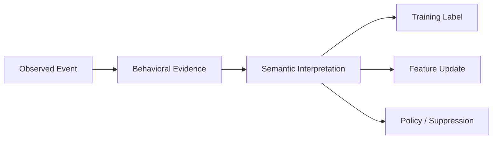

------
title: Build From Scratch Recommendations System - Part 011
description: Membaca implicit feedback secara benar untuk recommendation system production-grade: impression, click, skip, dwell, add-to-cart, purchase, hide, report, non-action, bias, noise, dan confidence weighting.
series: learn-build-from-scratch-recommendations-system
seriesTitle: Build From Scratch: Enterprise Recommendations System
order: 11
partTitle: Implicit Feedback Semantics
tags:
  - recommendation-system
  - recsys
  - implicit-feedback
  - data-modeling
  - machine-learning
  - ranking
  - series
date: 2026-07-02
---

# Part 011 — Implicit Feedback Semantics

Recommendation system belajar dari perilaku user.

Tetapi perilaku user bukan label kebenaran yang bersih.

Click bukan selalu suka. Tidak klik bukan selalu tidak suka. Dwell time tinggi bukan selalu puas. Purchase bukan selalu item terbaik. Skip bukan selalu benci. Hide lebih kuat daripada skip. Report berbeda dari dislike. Add-to-cart bukan purchase. Purchase bisa diikuti return. Watch complete bisa karena autoplay. Share bisa karena lucu, marah, atau kontroversial. Search bisa menunjukkan intent kuat, tetapi query bisa ambiguous.

Kalau kita salah membaca feedback, model akan belajar hal yang salah dengan sangat percaya diri.

Part ini membahas semantics dari implicit feedback: bagaimana memahami sinyal user, bagaimana membedakan fakta dan interpretasi, bagaimana mengukur kekuatan sinyal, bagaimana menghindari bias, dan bagaimana menyiapkan feedback untuk label construction di Part 012.

---

## 1. Mental Model: Feedback Adalah Evidence, Bukan Truth

Recommendation system tidak pernah benar-benar melihat preference user secara langsung.

Yang kita lihat adalah evidence:

```text
user saw item
user clicked item
user spent time on item
user added item to cart
user bought item
user returned item
user hid item
user reported item
```

Dari evidence itu, kita membuat inferensi:

```text
user may be interested
user may be satisfied
user may dislike this item
user may want similar items
user may be in shopping mode
user may be tired of this topic
```

Jangan membalik urutannya.

Event adalah observasi. Preference adalah inferensi. Label training adalah konstruksi.



Prinsip:

> Treat user behavior as noisy evidence with context, not as absolute truth.

---

## 2. Explicit Feedback vs Implicit Feedback

### 2.1 Explicit Feedback

User secara langsung memberi penilaian.

Contoh:

- rating 1–5,
- like,
- dislike,
- not interested,
- hide,
- report,
- follow,
- block creator,
- save for later,
- thumbs up/down.

Kelebihan:

- lebih jelas secara semantic,
- bisa kuat untuk preference,
- berguna untuk suppression dan personalization.

Kekurangan:

- sparse,
- bias ke user yang aktif memberi feedback,
- bisa dipakai secara berbeda oleh user berbeda,
- tidak selalu tersedia di semua surface.

### 2.2 Implicit Feedback

User tidak secara eksplisit menilai, tetapi perilakunya memberi sinyal.

Contoh:

- impression,
- click,
- dwell,
- scroll,
- watch time,
- add to cart,
- purchase,
- repeat purchase,
- skip,
- search,
- page depth,
- session continuation,
- abandonment.

Kelebihan:

- banyak,
- natural,
- tersedia hampir semua surface,
- cocok untuk online learning dan ranking.

Kekurangan:

- noisy,
- context-dependent,
- position-biased,
- affected by UI,
- affected by availability,
- tidak selalu menunjukkan satisfaction.

Production recommendation biasanya didominasi implicit feedback. Karena itu semantics-nya harus matang.

---

## 3. Feedback Strength Ladder

Tidak semua event punya kekuatan sinyal sama.

Contoh ladder umum untuk e-commerce:

```text
report / hide              strong negative
return / refund             strong negative after conversion
not interested              explicit negative
skip / quick bounce          weak-medium negative
impression only             weak ambiguous
click                       weak-medium positive
dwell meaningful            medium positive
add to cart                 strong positive intent
purchase                    strong positive conversion
repeat purchase             very strong positive satisfaction
positive review             very strong explicit positive
```

Untuk content/video:

```text
report                      strong negative
hide / not interested        strong negative
skip immediately             medium negative
short dwell                  weak negative
impression only              ambiguous
click/open                   weak positive
watch 50%                    medium positive
watch complete               strong positive
like/save/share              strong explicit positive
follow creator               strong long-term positive
return to similar content    strong preference signal
```

Untuk enterprise workflow:

```text
recommended action ignored                  ambiguous
recommended action dismissed with reason     explicit negative
knowledge article opened                     weak positive
article used in case                         strong positive
case outcome improved after action           delayed strong positive
supervisor approved recommended action       strong positive
regulatory exception raised                  strong negative/policy signal
```

Feedback strength harus domain-aware.

---

## 4. Impression: Denominator Utama, Bukan Preference

Impression berarti item terlihat oleh user sesuai definisi tertentu.

Impression tidak berarti user tertarik.

Namun impression sangat penting karena ia adalah exposure denominator.

Tanpa impression, kita tidak tahu apakah user tidak klik karena tidak suka atau karena tidak pernah melihat.

Contoh:

```text
item A: 100 clicks, 100 impressions => CTR 100%
item B: 100 clicks, 10,000 impressions => CTR 1%
```

Click count saja menipu.

Impression berguna untuk:

- CTR,
- CVR denominator,
- negative sampling,
- exposure fairness,
- frequency capping,
- position bias correction,
- training examples,
- experiment attribution.

Tetapi impression-only sebagai negative label harus hati-hati.

Tidak klik setelah impression bisa berarti:

- item tidak relevan,
- item terlalu bawah,
- user scroll cepat,
- user sudah puas dengan item atas,
- user sedang tidak ingin klik,
- item relevan tetapi thumbnail buruk,
- user akan kembali nanti,
- item terlihat terlalu singkat.

Jadi:

```text
impression + no click != dislike
```

Lebih tepat:

```text
impression + no click = weak non-positive evidence under context
```

---

## 5. Click: Interest, Curiosity, atau UI Artifact

Click adalah sinyal yang populer karena mudah dan banyak.

Tetapi click bukan satisfaction.

Click bisa berarti:

- user tertarik,
- thumbnail/title menarik,
- user penasaran,
- user salah klik,
- item berada di posisi atas,
- UI mendorong klik,
- item clickbait,
- user ingin membaca detail untuk memastikan tidak cocok.

Click harus dibaca bersama:

- impression position,
- surface,
- dwell after click,
- bounce,
- conversion,
- hide/report after click,
- historical user behavior,
- item type,
- device.

Click kuat untuk objective awal seperti CTR, tetapi bisa berbahaya jika menjadi satu-satunya metric. Model bisa belajar clickbait.

Formula mental:

```text
click = entry signal
satisfaction requires post-click evidence
```

---

## 6. Dwell Time: Sinyal Kaya tapi Licin

Dwell time sering dianggap satisfaction proxy.

Tetapi dwell time tinggi bisa berarti:

- user membaca dengan serius,
- user menonton video sampai selesai,
- user bingung,
- tab dibiarkan terbuka,
- app di-background,
- user distracted,
- halaman lambat,
- konten panjang,
- proses checkout lama.

Dwell time rendah bisa berarti:

- item buruk,
- user menemukan jawaban cepat,
- user sudah tahu item itu,
- konten pendek,
- network issue,
- accidental open.

Gunakan dwell dengan konteks.

Contoh normalisasi:

```text
normalized_dwell = active_dwell / expected_content_duration
```

Untuk video:

```text
completion_ratio = watched_seconds / video_duration_seconds
```

Untuk artikel:

```text
read_depth + active_time lebih baik daripada total time
```

Untuk produk:

```text
dwell on product detail without add-to-cart bisa ambiguous
```

Dwell lebih kuat jika digabung:

```text
click + long active dwell + no immediate hide = positive evidence
click + short dwell + back immediately = weak negative evidence
```

---

## 7. Scroll dan Viewport Behavior

Scroll memberi sinyal exposure dan intent.

Contoh:

- user scroll lambat,
- user berhenti di item,
- item masuk viewport,
- user scroll balik,
- user melewati item cepat,
- user membuka carousel,
- user mencapai bagian bawah.

Namun scroll behavior sangat dipengaruhi UI.

Mobile infinite feed berbeda dari desktop grid. Carousel horizontal berbeda dari vertical list.

Sinyal yang bisa dihitung:

```text
visible_duration_ms
visible_ratio
scroll_velocity
pause_near_item
return_to_item
viewport_rank
container_position
```

Interpretasi:

- pause near item bisa interest,
- fast skip bisa weak negative,
- repeated exposure tanpa click bisa fatigue,
- scroll depth tinggi bisa session engagement.

Tetapi jangan terlalu cepat menjadikan fast scroll sebagai dislike. User bisa mencari item tertentu.

---

## 8. Skip

Skip bisa berarti user tidak tertarik, tetapi definisinya harus jelas.

Untuk video:

- skip after 2 seconds,
- skip before 10% completion,
- swipe away,
- next video button,
- close player.

Untuk feed:

- item terlihat cukup lama tetapi user scroll lewat,
- carousel item dilewati,
- story skipped.

Skip lebih kuat daripada non-click biasa jika item benar-benar terlihat dan user melakukan action melewati item.

Contoh semantic:

```text
impression visible 1s + no click = weak non-positive
visible 5s + scroll past = weak negative
video autoplay 3s + swipe away = medium negative
user taps "not interested" = strong negative
```

Jangan menyamakan skip dengan hide.

---

## 9. Hide, Not Interested, Dislike

Explicit negative feedback sangat penting.

Bedakan:

### Hide

User tidak mau melihat item ini lagi.

Scope:

- item only?
- creator?
- category?
- topic?
- seller?
- campaign?

### Not Interested

User memberi preference negative terhadap item/topic.

Bisa dipakai untuk:

- suppress item,
- reduce category affinity,
- reduce similar candidate,
- feedback to ranker.

### Dislike

Tergantung domain. Bisa berarti:

- kualitas buruk,
- tidak sesuai selera,
- tidak setuju,
- konten ofensif,
- rating negatif.

Event harus menyimpan reason jika tersedia.

```json
{
  "event_name": "not_interested",
  "item_id": "item_123",
  "reason_code": "seen_too_often",
  "scope": "item"
}
```

Reason mengubah treatment:

```text
seen_too_often -> frequency cap
not_relevant -> reduce similarity/preference
offensive -> policy/safety signal
already_bought -> suppression
```

---

## 10. Report

Report bukan preference biasa. Report adalah safety/policy signal.

Report bisa berarti:

- spam,
- scam,
- offensive,
- illegal,
- misinformation,
- adult content,
- harassment,
- regulatory violation,
- low quality,
- wrong category.

Report harus masuk moderation/policy pipeline, bukan hanya model ranking.

Jika item banyak direport:

- suppress sementara,
- reduce exposure,
- send for review,
- block from sensitive surfaces,
- update item quality score.

Jangan treat report hanya sebagai `negative_rating = 1`. Ia punya operational consequence.

---

## 11. Save, Like, Share, Follow

Positive explicit/semi-explicit events juga perlu semantics.

### Save / Bookmark

Bisa berarti:

- user tertarik,
- user ingin kembali nanti,
- item butuh waktu,
- high intent tetapi delayed consumption.

Untuk e-commerce, wishlist/save bisa strong positive, tetapi belum conversion.

### Like

Bisa preference positif, tetapi meaning berbeda per platform. Kadang like digunakan sebagai acknowledgement, bukan deep satisfaction.

### Share

Share bisa tricky.

User bisa share karena:

- berguna,
- lucu,
- kontroversial,
- membuat marah,
- ingin mengkritik,
- viral/clickbait.

Share adalah engagement kuat, tetapi tidak selalu satisfaction. Untuk safety-sensitive ranking, share tidak boleh otomatis dianggap positive.

### Follow

Follow creator/seller/topic adalah long-term preference signal kuat.

Tetapi follow bisa stale. User bisa follow creator bertahun-tahun lalu dan tidak lagi tertarik. Butuh decay.

---

## 12. Add-to-Cart

Add-to-cart adalah intent kuat di e-commerce.

Tetapi bukan purchase.

Add-to-cart bisa berarti:

- user mempertimbangkan,
- user membandingkan,
- user menyimpan sementara,
- user ingin melihat shipping cost,
- user accidentally tapped,
- user abandoned because price/shipping.

Interpretasi add-to-cart harus dipasangkan dengan:

- checkout started,
- purchase,
- remove from cart,
- cart abandonment,
- price change,
- stock issue,
- shipping cost,
- return/refund.

Untuk recommendation:

```text
add_to_cart = strong short-term shopping intent
purchase = stronger conversion
return/refund = post-conversion negative correction
```

Add-to-cart bisa sangat berguna untuk cart cross-sell dan session intent.

---

## 13. Purchase

Purchase sering dianggap positive label paling kuat.

Tetapi purchase tidak selalu berarti user puas atau item terbaik.

Masalah:

- user membeli karena diskon,
- user membeli untuk orang lain,
- user terpaksa karena availability,
- item dibeli lalu dikembalikan,
- user salah beli,
- corporate procurement bukan personal preference,
- marketplace manipulation,
- recommendation mungkin hanya menangkap demand yang sudah ada.

Purchase tetap sinyal kuat untuk conversion objective, tetapi untuk satisfaction gunakan post-purchase signals:

- return/refund,
- review,
- repeat purchase,
- support complaint,
- usage/activation,
- retention.

Untuk e-commerce:

```text
purchase_without_return_after_30d
```

lebih kuat daripada purchase langsung jika objective adalah satisfaction.

Namun delayed label memperlambat training.

Trade-off:

```text
early conversion label = cepat tapi noisy
delayed satisfaction label = lebih akurat tapi lambat
```

---

## 14. Return, Refund, Complaint

Post-conversion negative signals sangat penting.

Jika model hanya belajar purchase, ia bisa merekomendasikan item yang banyak dibeli tetapi juga banyak dikembalikan.

Signals:

- return,
- refund,
- cancellation,
- complaint,
- low rating,
- warranty claim,
- support ticket,
- uninstall,
- unsubscribe,
- churn.

Gunakan sebagai:

- item quality signal,
- seller quality signal,
- user satisfaction label,
- guardrail metric,
- rank demotion,
- policy trigger.

Contoh:

```text
net_purchase_value = purchase_value - expected_return_cost - complaint_risk
```

Jangan optimalkan gross conversion sambil mengabaikan downstream harm.

---

## 15. Search Behavior

Search adalah sinyal intent kuat.

Event:

- query submitted,
- result impression,
- result click,
- filter applied,
- sort changed,
- zero result,
- query reformulated,
- search abandoned.

Interpretasi:

- query menunjukkan current intent,
- reformulation menunjukkan hasil kurang cocok,
- filter menunjukkan constraints,
- zero-result menunjukkan unmet demand,
- search after recommendation bisa berarti recommendation gagal memenuhi intent.

Search query bisa menjadi feature, candidate source, atau label evidence.

Contoh:

```text
user clicked recommended item
then immediately searched same category
```

Bisa berarti item menginspirasi intent, atau recommendation tidak cukup.

Context penting.

---

## 16. Non-Action

Non-action adalah yang paling sering disalahgunakan.

Tidak klik setelah impression bukan negative mutlak.

Tidak membeli setelah click bukan berarti item buruk.

Tidak membuka email bukan berarti tidak suka produk.

Non-action bisa disebabkan oleh:

- user tidak melihat,
- user sibuk,
- position rendah,
- item terlalu mahal,
- decision cycle panjang,
- timing salah,
- network issue,
- UI broken,
- recommendation sudah cukup sebagai awareness,
- user butuh approval,
- conversion offline.

Non-action bisa menjadi label negatif hanya jika exposure dan opportunity cukup jelas.

Contoh lebih aman:

```text
item visible >= 1s and no click within 30m -> weak negative for CTR
product clicked but no add_to_cart within session -> weak negative for ATC
cart item not purchased within 7d -> medium negative for purchase intent
```

Selalu sebut objective dan window.

---

## 17. Repeated Exposure and Fatigue

Feedback berubah dengan exposure count.

Item yang awalnya tidak diklik mungkin masih relevan. Tetapi jika ditampilkan 20 kali dan tidak pernah diklik, kemungkinan user tidak tertarik atau fatigue.

Features:

```text
user_item_impression_count_7d
user_item_last_impression_age
user_topic_impression_count_24h
creator_exposure_count_7d
campaign_exposure_count_30d
```

Interpretasi:

- repeated no-click increases negative evidence,
- repeated click can mean strong interest,
- repeated skip means stronger negative,
- repeated exposure can harm user experience.

Suppression/frequency cap harus memakai exposure history.

---

## 18. Position Bias

Item di posisi atas lebih sering dilihat dan diklik.

Click probability bukan hanya relevance:

```text
P(click) = P(examined) * P(attractive/relevant | examined)
```

Jika model belajar dari click mentah, ia akan memperkuat item yang sering ditempatkan atas.

Bias ini menciptakan feedback loop:

```text
popular item shown more
shown more -> gets more clicks
more clicks -> model thinks more relevant
model shows it more
```

Mitigasi:

- log impression position,
- randomization/exploration,
- propensity correction,
- counterfactual evaluation,
- position-aware features,
- separate examination modeling,
- diversify candidate exposure.

Position bias bukan teori sampingan. Ini inti dari recommendation learning.

---

## 19. Selection Bias

Kita hanya melihat feedback untuk item yang sistem tampilkan.

Untuk item yang tidak pernah direkomendasikan, kita tidak tahu apakah user akan suka.

Ini selection bias.

Akibat:

- model terlalu yakin pada known popular items,
- new/long-tail items sulit mendapat exposure,
- offline evaluation menilai hanya pada historical policy,
- candidate generator sulit berkembang.

Mitigasi:

- exploration bucket,
- random candidate injection kecil,
- cold-start quota,
- candidate source diversity,
- off-policy evaluation,
- separate discovery metrics.

---

## 20. Popularity Bias

Popular items mendapat exposure lebih banyak. Model belajar bahwa popular berarti relevan.

Kadang benar. Popularity adalah baseline kuat.

Tetapi jika terlalu dominan:

- personalization lemah,
- long-tail mati,
- creator/seller baru sulit naik,
- catalog homogen,
- user bosan,
- ecosystem tidak sehat.

Feedback semantics harus membedakan:

```text
item is globally popular
vs
item is personally relevant
```

Feature harus mencakup keduanya, tetapi ranking/reranking harus mengontrol dampaknya.

---

## 21. Presentation Bias

UI memengaruhi feedback.

Contoh:

- thumbnail lebih menarik,
- title clickbait,
- badge discount,
- autoplay,
- larger card,
- sponsored label,
- row position,
- carousel collapsed,
- lazy loading,
- button placement.

Event feedback tidak hanya mengukur item. Ia juga mengukur presentation.

Maka log:

- layout,
- card type,
- thumbnail variant,
- badge,
- position,
- surface,
- UI experiment,
- viewport.

Jika tidak, model bisa menganggap item lebih bagus padahal card design yang lebih agresif.

---

## 22. Delayed Feedback

Beberapa feedback muncul lambat.

Contoh:

- purchase after 3 days,
- return after 14 days,
- subscription churn after 30 days,
- case outcome after weeks,
- user satisfaction survey later,
- repeat usage after months.

Training harus menentukan label window.

```text
clicked within 30 minutes
add_to_cart within 2 hours
purchase within 7 days
return within 30 days
case resolved within SLA
```

Window terlalu pendek: positive hilang.

Window terlalu panjang: training lambat dan attribution noisy.

Delayed feedback juga butuh late event handling.

---

## 23. Feedback Loop and Model-Induced Data

Recommendation system memengaruhi data yang kemudian dipakai untuk training.

Data bukan natural behavior murni. Ia hasil dari policy/model sebelumnya.

```text
model_t recommends items
users interact
events become training data
model_t+1 trained on those events
```

Ini bisa memperkuat:

- popularity,
- bias,
- narrow preference,
- clickbait,
- unsafe engagement,
- low diversity,
- filter bubble.

Karena itu feedback harus selalu dibaca sebagai:

```text
behavior under a logging policy
```

Event harus menyimpan:

- model version,
- candidate source,
- rank,
- experiment variant,
- policy version.

Tanpa logging policy, sulit melakukan counterfactual reasoning.

---

## 24. Confidence Weighting

Implicit feedback sering diberi bobot confidence.

Contoh:

```text
impression only: 0.1
click: 1.0
long dwell: 2.0
add_to_cart: 3.0
purchase: 5.0
return: -5.0
hide: -4.0
report: policy signal, not just -10
```

Namun jangan menganggap angka ini universal. Bobot harus sesuai objective.

Untuk CTR model, click adalah label utama.

Untuk satisfaction model, click saja lemah.

Untuk policy safety, report lebih penting daripada purchase.

Lebih baik definisikan per objective:

```yaml
objective: purchase_intent
positive_evidence:
  add_to_cart: high
  purchase: very_high
  click: low
negative_evidence:
  hide: high
  repeated_no_click: medium
  return_after_purchase: high

objective: content_satisfaction
positive_evidence:
  completion_ratio_high: high
  like: high
  follow_creator: high
negative_evidence:
  skip_early: medium
  not_interested: high
  report: safety
```

---

## 25. Domain-Specific Semantics

### 25.1 E-commerce

```text
view -> click -> detail dwell -> add_to_cart -> checkout -> purchase -> no_return -> positive satisfaction
```

Important negative:

- remove from cart,
- return,
- refund,
- complaint,
- bad review.

### 25.2 Video Feed

```text
impression -> watch_start -> watch_progress -> complete -> like/share/follow
```

Important negative:

- swipe away,
- not interested,
- report,
- block creator.

### 25.3 News/Article

```text
headline impression -> open -> active read -> scroll depth -> subscription/return
```

Caution:

- outrage click,
- doomscrolling,
- controversial share.

### 25.4 Music

```text
play -> skip within 5s/30s -> completion -> replay -> add to playlist
```

Skip timing sangat penting.

### 25.5 Job Recommendation

```text
impression -> view -> save -> apply -> interview -> hire
```

Need bidirectional matching: user likes job and employer likes candidate.

### 25.6 Enterprise Case Recommendation

```text
recommend action -> user accepts/ignores/dismisses -> action executed -> case outcome -> supervisor approval
```

Feedback harus defensible dan audit-aware. Tidak semua ignored action berarti buruk. User mungkin tidak punya permission atau sudah tahu langkah lain.

---

## 26. Feedback Semantics Matrix

Contoh matrix sederhana:

| Event | Positive? | Negative? | Strength | Notes |
|---|---:|---:|---:|---|
| impression | no | weak ambiguous | low | denominator |
| click | yes | no | low/medium | interest, not satisfaction |
| long active dwell | yes | no | medium | normalize by item type |
| short bounce | no | yes weak | low/medium | context-dependent |
| add_to_cart | yes | no | high | strong purchase intent |
| purchase | yes | no | high | conversion, not always satisfaction |
| return/refund | no | yes | high | post-conversion negative |
| save | yes | no | medium/high | delayed intent |
| like | yes | no | medium/high | explicit positive |
| share | maybe | maybe | medium | can be controversial |
| hide | no | yes | high | suppression |
| not_interested | no | yes | high | preference negative |
| report | policy | policy | high | safety pipeline |
| no click | no | weak | low | only if valid exposure |

Matrix ini harus dikustomisasi per domain/surface.

---

## 27. Turning Feedback Into State

Feedback tidak hanya menjadi label training. Ia juga mengubah online state.

Examples:

### Click

- update session intent,
- maybe update recent user history,
- log for CTR label.

### Add to cart

- update cart context,
- trigger cross-sell candidates,
- strengthen category/product affinity.

### Hide

- add suppression rule,
- reduce item/topic affinity,
- avoid similar items depending on scope.

### Report

- trigger moderation,
- suppress item from user,
- maybe reduce item global quality pending review.

### Purchase

- suppress identical item,
- recommend complements,
- update long-term profile,
- wait for return window for satisfaction label.

State update harus memperhatikan scope dan TTL.

```text
session intent TTL: minutes/hours
topic affinity TTL: days/weeks
purchased item suppression: long
not interested item suppression: long
seen exposure cooldown: hours/days
```

---

## 28. Ambiguous Feedback Handling

Beberapa event ambiguous. Jangan memaksakan satu interpretasi.

Contoh:

```text
share = positive engagement?
```

Jawaban: tergantung.

Solusi:

1. Simpan event sebagai feature, bukan label langsung.
2. Gunakan downstream outcome untuk menentukan makna.
3. Segmentasi berdasarkan content type/surface.
4. Gunakan multi-task objective.
5. Tambahkan guardrail metric.
6. Gunakan human/product judgment untuk safety-sensitive cases.

Contoh:

```text
share + report by receivers -> harmful virality
share + saves + follows -> positive discovery
```

---

## 29. Feedback Quality Monitoring

Monitor feedback stream.

Metrics:

```text
impression_count_by_surface
click_rate_by_surface
dwell_distribution_by_item_type
add_to_cart_rate
purchase_delay_distribution
hide_rate
report_rate
no_impression_click_rate
click_without_impression_rate
duplicate_event_rate
late_event_rate
bot_suspected_rate
client_version_event_drop
position_distribution
```

Alert examples:

- click rate jumps after UI release,
- impression volume drops for Android v5.9,
- dwell time becomes zero due to client bug,
- report rate spikes for item category,
- no-impression clicks increase,
- event delay increases,
- hide event missing on one platform.

Feedback semantics is only as good as feedback quality.

---

## 30. Anti-Patterns

### 30.1 Click = Like

Click is entry, not satisfaction.

### 30.2 No Click = Dislike

No action is weak and context-dependent.

### 30.3 Purchase = Perfect Recommendation

Purchase can be followed by return, complaint, or regret.

### 30.4 Share Always Positive

Share can amplify harmful or controversial content.

### 30.5 Dwell Time Always Good

Long dwell can mean confusion, background tab, or slow process.

### 30.6 Ignoring Position Bias

Model learns historical placement, not pure relevance.

### 30.7 Treating Report as Ranking Feature Only

Report is policy/safety signal.

### 30.8 Same Semantics Across Surfaces

Click on checkout upsell differs from click on article feed.

### 30.9 No Delayed Feedback Window

Training labels become premature.

### 30.10 No Logging Policy

Historical feedback cannot be interpreted without knowing what system showed.

---

## 31. Minimal Production Feedback Semantics

Untuk build pertama, definisikan semantics table per surface.

Contoh e-commerce homepage:

```yaml
surface: home_feed
events:
  item_impression:
    meaning: exposure denominator
    label_use: negative candidate only with low weight
  item_click:
    meaning: interest
    label_use: positive for CTR
  item_dwell_long:
    meaning: stronger interest
    label_use: auxiliary positive
  add_to_cart:
    meaning: purchase intent
    label_use: positive for ATC/CVR
  purchase:
    meaning: conversion
    label_use: positive for purchase model
  return:
    meaning: post-purchase dissatisfaction
    label_use: negative for satisfaction/quality
  hide:
    meaning: explicit negative preference
    label_use: suppression + negative
  report:
    meaning: safety/policy signal
    label_use: moderation + suppression
```

Untuk video feed:

```yaml
surface: video_feed
events:
  item_impression:
    meaning: exposure
  watch_start:
    meaning: weak interest
  watch_50_percent:
    meaning: medium engagement
  watch_complete:
    meaning: strong engagement normalized by duration
  skip_early:
    meaning: weak/medium negative
  like:
    meaning: explicit positive
  not_interested:
    meaning: explicit negative
  report:
    meaning: safety signal
```

---

## 32. Checklist Feedback Semantics

```text
[ ] Setiap event punya semantic definition.
[ ] Impression dipakai sebagai denominator.
[ ] Click tidak dianggap satisfaction mutlak.
[ ] Non-click tidak dianggap negative mutlak.
[ ] Dwell dinormalisasi per item type/surface.
[ ] Explicit negative punya scope.
[ ] Report masuk safety/policy pipeline.
[ ] Purchase dikoreksi dengan return/refund/complaint.
[ ] Delayed feedback window jelas.
[ ] Position/surface/device/layout dicatat.
[ ] Candidate source/model/policy version dicatat.
[ ] Feedback semantics berbeda per domain/surface.
[ ] Ambiguous event tidak dipaksa menjadi label tunggal.
[ ] Feedback quality dimonitor.
[ ] Bot/internal/test traffic difilter.
[ ] Repeated exposure/fatigue diperhitungkan.
```

---

## 33. Kesimpulan

Implicit feedback adalah bahan bakar recommendation system, tetapi bahan bakar ini penuh noise, bias, dan konteks.

Prinsip utama:

1. Feedback adalah evidence, bukan truth.
2. Event mentah harus dipisahkan dari interpretasi dan label.
3. Impression adalah denominator utama.
4. Click adalah interest signal, bukan satisfaction.
5. Dwell, share, skip, dan non-action harus dibaca hati-hati.
6. Explicit negative jauh lebih kuat daripada non-click.
7. Report adalah safety/policy signal.
8. Purchase perlu dikoreksi dengan post-conversion outcome.
9. Position, selection, popularity, dan presentation bias harus diakui.
10. Semantics harus domain-aware dan surface-aware.

Di Part 012, kita akan mengubah feedback menjadi **label construction dan training examples**: bagaimana membangun dataset yang point-in-time correct, objective-aware, dan tidak diam-diam mengandung leakage.
