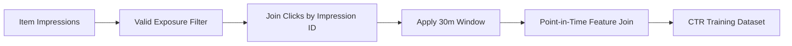
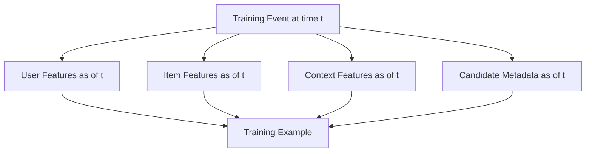
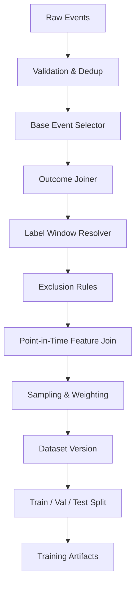

------
title: Build From Scratch Recommendations System - Part 012
description: Membangun label dan training examples untuk recommendation system production-grade: CTR, CVR, watch completion, satisfaction, next-item prediction, label window, attribution, negative examples, point-in-time correctness, dan leakage control.
series: learn-build-from-scratch-recommendations-system
seriesTitle: Build From Scratch: Enterprise Recommendations System
order: 12
partTitle: Label Construction & Training Examples
tags:
  - recommendation-system
  - recsys
  - machine-learning
  - training-data
  - label-construction
  - mlops
  - series
date: 2026-07-02
---

# Part 012 — Label Construction & Training Examples

Model tidak belajar dari event mentah.

Model belajar dari training examples.

Training example adalah hasil konstruksi:

```text
context + user/item features + candidate item + label + weight + metadata
```

Label adalah jawaban yang kita minta model prediksi.

Kesalahan label construction lebih berbahaya daripada model sederhana. Model sederhana dengan label benar sering lebih berguna daripada model canggih dengan label rusak.

Part ini membahas bagaimana membangun label dan training examples untuk recommendation system production-grade: CTR, CVR, watch completion, satisfaction, next-item prediction, repeat usage, long-term value, delayed labels, attribution window, negative examples, point-in-time correctness, dan leakage control.

---

## 1. Mental Model: Label Adalah Pertanyaan yang Dijadikan Data

Sebelum membuat label, tanyakan:

> “Apa pertanyaan yang harus dijawab model?”

Contoh:

```text
Will user click this item if shown now?
Will user add this product to cart?
Will user buy this product within 7 days?
Will user watch at least 80% of this video?
Will user be satisfied after consuming this item?
Will this action help resolve the case within SLA?
What item is likely to be consumed next in this session?
```

Setiap pertanyaan menghasilkan label berbeda.

Jangan membuat generic label:

```text
engaged = click OR dwell OR purchase OR share
```

tanpa definisi objective. Label campuran seperti itu sering membuat model tidak jelas optimasinya.

Label harus punya:

- event source,
- positive condition,
- negative condition,
- attribution rule,
- time window,
- exclusion rule,
- weight,
- objective,
- version.

---

## 2. Anatomy of a Training Example

Training example ranking biasanya berbentuk:

```json
{
  "example_id": "ex_001",
  "event_time": "2026-07-02T10:00:01Z",
  "surface": "home_feed",
  "user_key": {
    "user_id": "u123",
    "session_id": "sess_abc"
  },
  "context": {
    "region": "ID-JK",
    "device_type": "mobile",
    "local_hour": 17
  },
  "candidate": {
    "item_id": "item_101",
    "position": 3,
    "candidate_sources": ["two_tower", "trending"]
  },
  "features": {
    "user_category_affinity_camera": 0.72,
    "item_quality_score": 0.83,
    "user_item_similarity": 0.66
  },
  "label": {
    "clicked_within_30m": 1
  },
  "weight": 1.0,
  "metadata": {
    "modeling_task": "ctr_prediction",
    "label_version": "ctr-v1",
    "feature_snapshot_time": "2026-07-02T10:00:00Z",
    "logging_policy": "ranker-v2-treatment"
  }
}
```

Training example harus cukup untuk:

- training,
- evaluation,
- debugging,
- reproducibility,
- bias analysis,
- experiment analysis,
- future relabeling.

---

## 3. Unit of Training Example

Pilih unit dengan sadar.

### 3.1 Impression-Level Example

Satu row per item impression.

```text
(user, context, item shown) -> clicked?
```

Cocok untuk:

- CTR prediction,
- ranking,
- exposure-aware training,
- position bias analysis.

### 3.2 Request-Level Example

Satu row per recommendation request.

```text
(request, slate) -> any click?
```

Cocok untuk:

- slate-level objective,
- session continuation,
- page-level conversion.

### 3.3 Slate-Level Example

Satu row berisi list item.

```text
(user, context, slate) -> utility
```

Cocok untuk:

- listwise ranking,
- diversity/fairness objective,
- slate optimization.

Lebih kompleks.

### 3.4 Session-Level Example

Satu row per session.

```text
(session history) -> next item / conversion
```

Cocok untuk:

- sequence model,
- next-item prediction,
- session recommendation.

### 3.5 User-Item Aggregate Example

Satu row per user-item pair dari historical interactions.

```text
(user, item) -> preference
```

Cocok untuk:

- matrix factorization,
- collaborative filtering,
- retrieval training.

Tetapi kurang context-aware.

Production system biasanya memakai beberapa jenis example untuk stage berbeda.

---

## 4. Label Window

Label window menentukan berapa lama kita menunggu outcome.

Contoh:

```text
clicked within 30 minutes after impression
add_to_cart within 2 hours after click/impression
purchase within 7 days after impression
return within 30 days after purchase
watch_complete within same playback session
case_resolved_within_sla after recommended action
```

Window terlalu pendek:

- positive delayed tidak terhitung,
- label false negative meningkat,
- model bias ke impulsive behavior.

Window terlalu panjang:

- attribution noisy,
- training lambat,
- lebih banyak confounder,
- sulit operational.

Pilih window berdasarkan domain dan objective.

| Objective | Typical window idea |
|---|---|
| CTR | minutes/hours |
| video watch | same session |
| add-to-cart | session/hours |
| purchase | days |
| subscription retention | weeks/months |
| return/refund | days/weeks |
| case resolution | SLA-specific |
| long-term satisfaction | weeks/months |

Window harus versioned.

---

## 5. Positive Label Construction

Positive label harus eksplisit.

### 5.1 CTR Label

```text
positive if:
  item_impression occurred
  AND item_click occurred
  AND click.impression_id = impression.impression_id
  AND click_time <= impression_time + 30m
```

SQL-ish:

```sql
CASE
  WHEN click.event_time BETWEEN impression.event_time
       AND impression.event_time + INTERVAL '30 minutes'
  THEN 1 ELSE 0
END AS clicked_within_30m
```

CTR label harus berbasis impression, bukan response item yang belum terlihat.

### 5.2 Add-to-Cart Label

```text
positive if:
  item impressed/clicked
  AND add_to_cart for same item
  AND within 2h or same session
```

Bisa berbasis impression atau click. Pilih sesuai objective.

```text
P(add_to_cart | impression)
```

berbeda dari:

```text
P(add_to_cart | click)
```

Yang pertama cocok untuk ranking full slate. Yang kedua cocok untuk product-detail conversion model.

### 5.3 Purchase Label

```text
positive if:
  item exposure/click
  AND purchase includes item or related SKU/offer
  AND within attribution window
  AND not cancelled immediately
```

Perhatikan product/SKU mapping.

User melihat product-level `prod_123`, lalu membeli SKU `sku_123_red_42`. Label harus tahu relation.

### 5.4 Watch Completion Label

```text
positive if:
  watch_duration / video_duration >= threshold
```

Threshold bisa:

- >= 50%,
- >= 80%,
- completed,
- watched >= N seconds for long-form.

Untuk video pendek, threshold harus berbeda.

### 5.5 Satisfaction Label

Satisfaction lebih sulit.

Contoh e-commerce:

```text
purchase
AND no return within 30d
AND no complaint within 30d
AND rating >= 4 if rating exists
```

Contoh content:

```text
watch_complete
AND no hide/report
AND user returns to similar content later
```

Contoh enterprise:

```text
recommended action accepted
AND case moved to expected state
AND no supervisor rejection
AND resolved within SLA
```

Satisfaction label biasanya delayed dan sparse, tetapi lebih sehat daripada click-only objective.

---

## 6. Negative Label Construction

Negative label lebih sulit daripada positive.

### 6.1 Impression Without Click

Untuk CTR:

```text
negative if:
  valid item impression
  AND no click within 30m
```

Tetapi beri bobot rendah atau gunakan debiasing karena no-click lemah.

### 6.2 Click Without Conversion

Untuk conversion model:

```text
negative if:
  click occurred
  AND no add_to_cart/purchase within window
```

Tergantung objective.

### 6.3 Explicit Negative

```text
hide/not_interested/dislike/report
```

Ini strong negative, tetapi semantics berbeda.

- hide: suppress item/scope,
- not interested: preference negative,
- report: safety/policy,
- dislike: depends domain.

Jangan semua digabung buta sebagai `label = 0`.

### 6.4 Post-Conversion Negative

```text
purchase followed by return/refund/complaint
```

Untuk satisfaction model, ini negative kuat.

### 6.5 Repeated Exposure No Engagement

```text
N impressions over T days with no click
```

Bisa menjadi stronger negative daripada single no-click.

Namun jangan terlalu agresif untuk low-frequency users.

---

## 7. Unobserved Is Not Negative

Dalam collaborative filtering, kita sering punya matrix user-item sparse.

Jika user tidak berinteraksi dengan item, bukan berarti user tidak suka. Mungkin user tidak pernah melihat.

```text
unobserved != negative
```

Treatment:

1. Sample unobserved as weak negative.
2. Use confidence weighting.
3. Use exposure-aware negatives only.
4. Use in-batch negatives for retrieval training.
5. Use popularity-adjusted sampling.
6. Use hard negatives from shown-but-not-clicked items.

Untuk ranking, impression-based negatives lebih baik daripada random catalog negatives karena ada exposure.

Untuk retrieval, random/in-batch negatives sering dipakai tetapi harus sadar popularity bias.

---

## 8. Attribution

Attribution menjawab: outcome ini disebabkan oleh exposure mana?

Contoh:

User melihat item di homepage, lalu search, lalu klik item dari search, lalu beli.

Apakah homepage recommendation mendapat credit?

Attribution policies:

### 8.1 Last Click

Credit ke click terakhir sebelum conversion.

Sederhana, tetapi mengabaikan discovery.

### 8.2 Last Impression

Credit ke impression terakhir sebelum conversion.

Lebih luas, tetapi noisy.

### 8.3 First Touch

Credit ke exposure pertama.

Cocok untuk discovery, tetapi bisa over-credit.

### 8.4 Multi-Touch

Credit dibagi antara beberapa exposure/click.

Lebih kaya, lebih kompleks.

### 8.5 Session-Based

Credit hanya dalam session yang sama.

Lebih ketat.

### 8.6 Surface-Specific

Attribution berbeda per surface.

Contoh:

- checkout upsell: short window, direct credit.
- homepage discovery: longer window, multi-touch.
- email: send/open/click attribution.

Attribution rule harus versioned dan disimpan di label metadata.

---

## 9. Label Example: CTR Dataset

Pipeline:



Rules:

```yaml
label_name: clicked_within_30m
base_event: item_impression
positive_event: item_click
join_key: impression_id
window: 30m
positive_value: 1
negative_value: 0
exclude:
  - bot_traffic
  - internal_users
  - invalid_impression
  - item_not_visible
  - test_surface
weight:
  impression_no_click: 0.2
  click: 1.0
```

Example row:

```json
{
  "impression_id": "imp_001",
  "user_id": "u123",
  "item_id": "item_101",
  "surface": "home_feed",
  "position": 4,
  "event_time": "2026-07-02T10:00:00Z",
  "label_clicked_30m": 1
}
```

---

## 10. Label Example: CVR Dataset

CVR bisa memiliki denominator berbeda.

### P(purchase | impression)

Cocok untuk final ranking langsung.

```text
base = impression
label = purchase within 7d
```

### P(purchase | click)

Cocok untuk product-detail conversion.

```text
base = click
label = purchase within 7d
```

### P(purchase | add_to_cart)

Cocok untuk checkout/cart optimization.

```text
base = add_to_cart
label = purchase
```

Jangan campur ketiganya tanpa menyebut denominator. Model akan sulit diinterpretasi.

Example:

```yaml
label_name: purchase_within_7d_from_impression
base_event: item_impression
positive_event: purchase
join_logic:
  - same_user
  - purchased_sku maps to impressed_product
window: 7d
exclude:
  - cancelled_orders
  - test_orders
  - fraud_orders
delayed_correction:
  - return_within_30d can produce satisfaction label
```

---

## 11. Label Example: Watch Completion

```yaml
label_name: completed_video
base_event: watch_start
positive_condition:
  completion_ratio >= 0.8
  OR watch_duration >= 1800s for very long content
negative_condition:
  skip_before_10_percent
window: same_playback_session
normalization:
  by_video_duration: true
exclude:
  - autoplay_without_view
  - background_play
  - muted_autoplay_if_not_counted
```

Watch labels must handle:

- autoplay,
- background play,
- replay,
- partial sessions,
- short videos,
- long videos,
- network interruptions.

---

## 12. Label Example: Next-Item Prediction

Sequence models often use:

```text
given events up to time t, predict item at t+1
```

Example:

```text
history: [item_A, item_B, item_C]
target: item_D
```

Important decisions:

- what event counts as sequence item?
- click only? watch? purchase?
- max history length?
- session boundary?
- time gaps?
- repeated items?
- item types mixed?
- negative sampling?

Example training record:

```json
{
  "session_id": "sess_001",
  "history_item_ids": ["item_A", "item_B", "item_C"],
  "history_event_times": ["10:00", "10:02", "10:05"],
  "target_item_id": "item_D",
  "target_event_time": "10:07",
  "surface": "video_next_up"
}
```

Do not include target item features that were unavailable before target time if training retrieval/ranking.

---

## 13. Label Example: Enterprise Next Action

For case management:

```yaml
label_name: action_helped_case_progress
base_event: action_recommendation_impression
positive_condition:
  - user_accepted_recommended_action
  - action_executed
  - case_transitioned_to_expected_state
  - no_supervisor_rejection
  - within_sla
negative_condition:
  - user_dismissed_with_reason_invalid
  - action_reversed
  - supervisor_rejected
  - case_sla_breached_after_action
window: case_sla_window
mandatory_context:
  - case_state
  - actor_role
  - jurisdiction
  - policy_version
```

Enterprise labels are not just behavior. They must reflect workflow validity and outcome quality.

Ignored recommendation might be ambiguous:

- actor did not see it,
- actor lacked permission,
- actor knew better,
- case context changed,
- recommendation arrived too late.

Do not treat ignore as strong negative without evidence.

---

## 14. Point-in-Time Correctness

This is non-negotiable.

Feature values must be computed as of the prediction time.

```text
feature_time <= impression_time
```

Bad example:

User clicked item at 10:05. Training example for impression at 10:00 uses feature:

```text
user_clicked_item_category_today = 1
```

If computed at end of day, it includes future click. Leakage.

Correct:

```text
user_clicked_item_category_before_10_00
```

Training builder must do point-in-time joins:



---

## 15. Feature Snapshot Time

Every example should record:

```json
{
  "feature_snapshot_time": "2026-07-02T10:00:00Z",
  "feature_view_versions": {
    "user_features": "user-fv-v12",
    "item_features": "item-fv-v9",
    "context_features": "context-fv-v3"
  }
}
```

This supports:

- reproducibility,
- debugging,
- model comparison,
- backfill,
- audit,
- leakage analysis.

If you cannot reproduce training data, you cannot trust model changes.

---

## 16. Exclusion Rules

Not all events should become examples.

Exclude:

- bot traffic,
- internal users,
- QA/test traffic,
- invalid impressions,
- impressions below visibility threshold,
- policy-blocked items,
- deleted/suspended item if not valid at event time,
- duplicate events,
- corrupted event payload,
- unsupported client versions,
- experiment variants not intended for training,
- users without required consent,
- events from outage windows,
- fraud orders.

Exclusion rules must be versioned.

```yaml
exclusion_policy: training-exclusion-v4
rules:
  - exclude_internal_users
  - exclude_bot_suspected
  - exclude_invalid_impressions
  - exclude_click_without_impression
  - exclude_events_during_tracking_incident_20260701
```

Do not silently filter without metadata. You need to know why data volume changed.

---

## 17. Label Correction

Labels can change.

Example:

- purchase label positive today,
- return event arrives 10 days later,
- satisfaction label becomes negative.

Approaches:

1. **Immutable early label + later corrected label**  
   Keep both.

2. **Delayed dataset generation**  
   Wait until window closes.

3. **Incremental correction dataset**  
   Update examples when delayed events arrive.

4. **Multi-stage training**  
   Train CTR fast, satisfaction slower.

Example:

```json
"labels": {
  "purchased_within_7d": 1,
  "returned_within_30d": 1,
  "satisfied_purchase": 0
}
```

Do not overwrite history in a way that destroys reproducibility.

---

## 18. Label Weighting

Weights control importance/confidence.

Example:

```yaml
weights:
  clicked_positive: 1.0
  no_click_negative: 0.2
  add_to_cart_positive: 2.0
  purchase_positive: 4.0
  explicit_hide_negative: 3.0
```

Weights can account for:

- feedback strength,
- position bias,
- sampling probability,
- class imbalance,
- label confidence,
- business value,
- freshness,
- segment importance.

But weights are dangerous if arbitrary. Track weight version.

```json
"weight_metadata": {
  "weight": 0.2,
  "weight_policy": "ctr-weight-v3",
  "reason": "impression_no_click_weak_negative"
}
```

---

## 19. Sampling

Dataset can be huge and imbalanced.

CTR:

- many impressions,
- few clicks.

Purchase:

- many impressions/clicks,
- very few purchases.

Sampling strategies:

### 19.1 Downsample Negatives

Keep all positives, sample negatives.

Need sampling weight correction.

### 19.2 Stratified Sampling

Sample by surface, position, category, user segment.

Prevents dataset dominated by biggest surface/category.

### 19.3 Hard Negative Sampling

Use items shown but not clicked, or semantically similar but not selected.

Useful for retrieval/ranking.

### 19.4 In-Batch Negatives

For two-tower retrieval, other items in batch act as negatives.

Efficient, but can introduce false negatives.

### 19.5 Popularity-Aware Sampling

Avoid all negatives being obscure items or all positives being popular items.

Sampling policy must be logged.

---

## 20. Class Imbalance

If click rate is 2%, naive model can predict no click for everything and be 98% accurate.

Do not optimize raw accuracy.

Use metrics:

- AUC,
- log loss,
- PR-AUC,
- NDCG,
- Recall@K,
- calibration,
- lift by decile,
- business metrics.

Training techniques:

- weighting,
- negative downsampling,
- focal loss style ideas,
- balanced batches,
- objective-specific loss.

But remember: offline metric is not product truth.

---

## 21. Multi-Label and Multi-Task Labels

Production rankers often predict multiple outcomes:

```text
P(click)
P(add_to_cart)
P(purchase)
P(long_dwell)
P(hide)
P(return)
P(report)
```

Then combine into utility:

```text
utility =
  w_click * P(click)
  + w_purchase * P(purchase)
  + w_margin * expected_margin
  - w_return * P(return)
  - w_hide * P(hide)
  - w_report * P(report)
```

Multi-task labels need separate windows and definitions.

Example:

```json
"labels": {
  "clicked_30m": 1,
  "add_to_cart_2h": 1,
  "purchase_7d": 0,
  "hide_7d": 0,
  "return_30d": null
}
```

`null` means label not yet observed/window not closed, not zero.

---

## 22. Missing Labels

Sometimes label unavailable.

Examples:

- return window not closed,
- user offline,
- event tracking broken,
- conversion happens offline,
- app version lacks event,
- item type does not support event.

Do not encode unknown as zero.

Use:

```text
label_value = null
label_observed = false
```

For multi-task model, mask missing labels in loss.

---

## 23. Label Leakage Patterns

Common leakage:

### 23.1 Future Feature Leakage

Using events after impression time.

### 23.2 Item Popularity Leakage

Computing item CTR using full day including label period.

### 23.3 Target Encoding Leakage

Category conversion rate computed including current example.

### 23.4 Identity Leakage

Using identity resolution from future login.

### 23.5 Catalog Leakage

Using item metadata updated after event.

### 23.6 Experiment Leakage

Training on treatment data then evaluating as if control comparable.

### 23.7 Position Leakage Misuse

Position feature can make offline score high but encode old ranker policy. Use carefully.

### 23.8 Duplicate Leakage

Same user-item event appears in train and validation.

Leakage makes offline metrics look good and online performance disappoint.

---

## 24. Temporal Splits

Random split is usually wrong for recommendation.

Bad:

```text
randomly split impressions into train/test
```

Why?

- same user behavior leaks across split,
- future popularity leaks,
- item lifecycle leaks,
- repeated impressions leak,
- session examples split across time.

Better:

```text
train: events before T
validation: T to T+7d
test: T+7d to T+14d
```

For sequence models, ensure history before target time only.

Temporal split will be discussed deeper in Part 013, but label construction must already support it.

---

## 25. Training Dataset Builder Architecture



Each stage must be deterministic and versioned.

---

## 26. Dataset Versioning

Dataset is an artifact.

Version metadata:

```json
{
  "dataset_name": "home_feed_ctr_training",
  "dataset_version": "20260702_001",
  "label_version": "ctr-v2",
  "feature_set_version": "ranker-features-v12",
  "exclusion_policy": "training-exclusion-v4",
  "sampling_policy": "negative-sampling-v3",
  "time_range": {
    "start": "2026-06-01T00:00:00Z",
    "end": "2026-07-01T00:00:00Z"
  },
  "created_at": "2026-07-02T02:00:00Z"
}
```

Without dataset versioning, model registry is incomplete.

---

## 27. Dataset Quality Checks

Before training, validate:

```text
row count
positive rate
label distribution by surface
label distribution by position
feature null rate
event time range
late event rate
duplicate example rate
user/item coverage
item type coverage
category distribution
bot/internal traffic rate
experiment distribution
position distribution
sampling rate
weight distribution
```

Example checks:

```text
CTR positive rate should not jump from 3% to 12% unless explained.
Feature item_quality_score null rate should be < 0.5%.
No examples should have feature_timestamp > label_base_time.
```

Fail dataset build if critical invariants break.

---

## 28. Training Example Debuggability

Every example should be explainable.

Given example ID, engineer should answer:

- what impression/request produced it?
- what item was shown?
- what context?
- what outcome events joined?
- why label is 1/0/null?
- what features were used?
- why example included/excluded?
- what sampling weight?
- what model/policy generated original exposure?
- what experiment variant?

This requires lineage fields.

Example:

```json
"lineage": {
  "base_event_id": "evt_imp_001",
  "positive_event_ids": ["evt_click_001"],
  "outcome_event_ids": [],
  "source_tables": ["events.item_impression", "events.item_click"],
  "builder_version": "dataset-builder-1.8.0"
}
```

---

## 29. Label Store

For larger systems, maintain a label store.

A label store records reusable labels:

```text
entity_key
base_event_time
label_name
label_value
label_window
label_version
computed_at
```

Benefits:

- consistency across teams,
- easier backfill,
- shared definitions,
- auditability,
- avoids duplicated label logic.

But do not overbuild too early. Start with dataset builder modules, then extract label store when repeated definitions appear.

---

## 30. Online vs Offline Label Gap

Offline labels often differ from online objective.

Example:

- offline CTR label improves,
- online user satisfaction drops.

Reasons:

- clickbait,
- delayed harm,
- diversity loss,
- fatigue,
- selection bias,
- stale item availability,
- experiment interference,
- offline metric not aligned.

This is why production systems use:

- offline evaluation,
- online A/B testing,
- guardrail metrics,
- long-term metrics,
- qualitative review,
- safety monitoring.

Label construction must not claim more than it measures.

---

## 31. End-to-End Example: Homepage Ranking Dataset

Spec:

```yaml
dataset: homepage_ranker_v1
base_unit: item_impression
surface: home_feed
time_range: 2026-06-01 to 2026-07-01
labels:
  clicked_30m:
    positive: click same impression within 30m
    negative: no click within 30m
  add_to_cart_2h:
    positive: same product/SKU added to cart within 2h
    missing: if item_type not product
  purchase_7d:
    positive: same product family purchased within 7d
    correction: exclude cancelled/fraud orders
  hide_7d:
    positive: hide/not_interested within 7d
features:
  user: as of impression_time
  item: as of impression_time
  context: request context snapshot
  candidate: candidate provenance
exclusions:
  - invalid impressions
  - bot/internal/test traffic
  - missing consent
  - policy-blocked item
  - outage windows
sampling:
  keep all clicked/add_to_cart/purchase/hide
  downsample pure negatives by 10x
weights:
  negative_no_click: 0.2 adjusted by sampling probability
splits:
  temporal
```

This dataset can train a multi-task ranker.

---

## 32. End-to-End Example: Two-Tower Retrieval Dataset

Retrieval training needs positive pairs and negatives.

Positive pairs:

```text
(user/session context, item clicked/purchased/watched)
```

For e-commerce:

```yaml
positive_events:
  - purchase
  - add_to_cart
  - meaningful_click
negative_sampling:
  - in_batch_negatives
  - sampled_catalog_negatives
  - hard_negatives_from_impressed_not_clicked
```

Important:

- use event time,
- user history before positive event only,
- remove target item from history if present after target,
- avoid false negatives from items user also liked,
- control popularity distribution.

Example:

```json
{
  "query_entity": {
    "user_id": "u123",
    "history_before_t": ["item_A", "item_B"]
  },
  "positive_item_id": "item_C",
  "event_time": "2026-07-02T10:00:00Z",
  "positive_event": "purchase",
  "weight": 3.0
}
```

---

## 33. End-to-End Example: Case Next Action Dataset

```yaml
dataset: case_next_action_v1
base_unit: action_recommendation
positive:
  action_accepted_and_executed
  AND case_transition_valid
  AND no_supervisor_rejection
  AND within_sla
negative:
  action_dismissed_with_reason_invalid
  OR action_reversed
  OR supervisor_rejected
ambiguous:
  ignored_without_view
  no_permission
  case_reassigned
features:
  actor_role_features_as_of_recommendation
  case_state_features_as_of_recommendation
  policy_features_as_of_recommendation
  historical_outcome_features_as_of_recommendation
exclusions:
  policy_version_deprecated_without_mapping
  incomplete_audit_trail
  unauthorized_actor
```

Enterprise labels must separate:

- user preference,
- workflow correctness,
- outcome quality,
- policy compliance.

---

## 34. Anti-Patterns

### 34.1 Generic Engagement Label

`engaged = click OR share OR dwell OR purchase` without objective. Model learns mixed signal.

### 34.2 No Label Window

Outcome joined forever or inconsistently.

### 34.3 No Attribution Rule

Conversion credit assigned arbitrarily.

### 34.4 Random Train/Test Split

Future behavior leaks into validation.

### 34.5 Unknown as Negative

Missing delayed label encoded as zero.

### 34.6 Future Feature Leakage

Features computed after outcome.

### 34.7 Ignoring Exposure

Random unobserved item treated as strong negative.

### 34.8 No Dataset Version

Model cannot be reproduced.

### 34.9 Silent Exclusion

Data drops but no one knows why.

### 34.10 Training on Broken Tracking Period

Client bug enters dataset and model learns artifact.

---

## 35. Minimal Production Labeling Plan

Start with three datasets:

### 35.1 CTR Ranking Dataset

- base: valid item impressions,
- label: click within 30m,
- negatives: no click with low weight,
- use: first ranker baseline.

### 35.2 Conversion Dataset

- base: click or impression depending surface,
- label: add-to-cart within 2h / purchase within 7d,
- use: e-commerce ranking or utility composition.

### 35.3 Retrieval Dataset

- base: positive interactions,
- positives: purchase/add-to-cart/meaningful click,
- negatives: in-batch + sampled + hard negatives,
- use: two-tower candidate generation.

Add later:

- satisfaction dataset,
- hide/report model,
- long-term retention dataset,
- slate-level dataset,
- enterprise workflow outcome dataset.

---

## 36. Checklist Label Construction

```text
[ ] Modeling question jelas.
[ ] Base event jelas.
[ ] Positive event/condition jelas.
[ ] Negative condition jelas.
[ ] Unknown/missing label tidak dijadikan zero.
[ ] Label window jelas dan versioned.
[ ] Attribution rule jelas.
[ ] Event join key jelas.
[ ] Product/SKU/item mapping jelas.
[ ] Exclusion rules versioned.
[ ] Bot/internal/test traffic difilter.
[ ] Consent/privacy respected.
[ ] Features point-in-time correct.
[ ] Identity resolution point-in-time correct.
[ ] Catalog metadata point-in-time correct.
[ ] Sampling policy versioned.
[ ] Weighting policy versioned.
[ ] Dataset quality checks tersedia.
[ ] Dataset version metadata lengkap.
[ ] Lineage dari example ke event tersedia.
[ ] Temporal split dipakai untuk validation/test.
[ ] Known leakage checks dilakukan.
```

---

## 37. Kesimpulan

Label construction adalah tempat event berubah menjadi learning signal. Di sinilah banyak recommendation system menang atau kalah sebelum model dilatih.

Prinsip utama:

1. Label adalah pertanyaan yang dijadikan data.
2. Satu event bisa menghasilkan label berbeda untuk objective berbeda.
3. Base unit harus jelas: impression, click, session, slate, atau user-item.
4. Positive, negative, unknown, dan ambiguous harus dibedakan.
5. Label window dan attribution rule wajib eksplisit.
6. Unobserved bukan negative.
7. Delayed feedback butuh correction strategy.
8. Feature join harus point-in-time correct.
9. Dataset harus versioned, tested, dan debuggable.
10. Offline label tidak boleh dianggap sama dengan product truth.

Di Part 013, kita akan mendalami **Temporal Splits & Leakage Control**: bagaimana membuat train/validation/test yang benar-benar menguji generalisasi masa depan, bukan mengukur kebocoran masa lalu.
