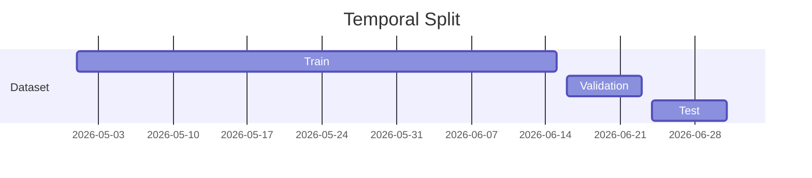
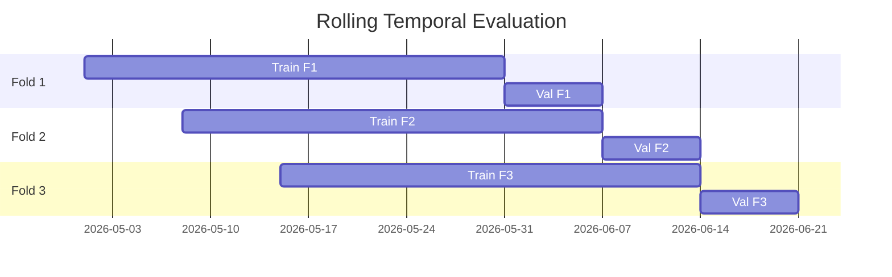

------
title: Build From Scratch Recommendations System - Part 013
description: Mendesain temporal splits dan leakage control untuk recommendation system production-grade: train/validation/test berbasis waktu, future leakage, identity leakage, catalog leakage, popularity leakage, position leakage, dan reproducible evaluation.
series: learn-build-from-scratch-recommendations-system
seriesTitle: Build From Scratch: Enterprise Recommendations System
order: 13
partTitle: Temporal Splits & Leakage Control
tags:
  - recommendation-system
  - recsys
  - machine-learning
  - evaluation
  - data-leakage
  - training-data
  - series
date: 2026-07-02
---

# Part 013 — Temporal Splits & Leakage Control

Recommendation model harus bekerja di masa depan.

Tetapi banyak offline evaluation diam-diam menguji masa lalu.

Model terlihat bagus di notebook, metric naik, AUC tinggi, NDCG bagus, Recall@K meningkat. Lalu saat online A/B test, hasilnya biasa saja, bahkan turun.

Salah satu penyebab paling umum: **leakage**.

Leakage terjadi ketika training atau evaluation memakai informasi yang seharusnya belum tersedia pada waktu rekomendasi dibuat.

Di recommendation system, leakage lebih licin daripada supervised ML biasa karena data dipengaruhi waktu, user behavior, catalog state, model lama, position, experiment, identity graph, dan feedback loop.

Part ini membahas bagaimana mendesain split data berbasis waktu dan mengontrol leakage agar offline evaluation benar-benar mengukur kemampuan sistem merekomendasikan masa depan.

---

## 1. Mental Model: Offline Evaluation Harus Meniru Online Time

Dalam production, rekomendasi dibuat pada waktu `t`.

Pada waktu itu, sistem hanya boleh tahu:

```text
events before t
features materialized before t
catalog state as of t
identity graph as of t
policy as of t
model/index version deployed at t
```

Sistem tidak boleh tahu:

```text
click after t
purchase after t
future popularity
future catalog update
future identity merge
future item quality score
future experiment result
future moderation decision
```

Offline dataset harus meniru constraint ini.

Prinsip:

> Every training example is a time-travel problem. You must stand at prediction time and only use what was knowable then.

---

## 2. Kenapa Random Split Salah

Random split terlihat natural:

```text
shuffle all examples
80% train
10% validation
10% test
```

Untuk recommendation, ini sering salah.

Contoh:

User `u123` melihat item A pada Senin, Selasa, Rabu. Random split bisa menaruh Senin/Rabu di train dan Selasa di test. Model “mengenal” future behavior user saat menguji masa lalu.

Masalah random split:

- repeated user-item exposure bocor,
- session terpecah,
- future item popularity masuk train,
- item metadata masa depan masuk feature,
- user preference masa depan masuk train,
- temporal trend hilang,
- cold-start tidak realistis,
- experiment policy tercampur,
- evaluation terlalu optimistis.

Random split bisa berguna untuk debugging pipeline atau sanity check, tetapi bukan evaluation utama untuk production recommendation.

---

## 3. Temporal Split Dasar

Split berbasis waktu:

```text
train:      2026-05-01 .. 2026-06-15
validation: 2026-06-16 .. 2026-06-23
test:       2026-06-24 .. 2026-07-01
```

Diagram:



Ini lebih realistis karena model dilatih pada masa lalu dan diuji pada masa depan.

Namun temporal split saja belum cukup. Feature join, label window, identity resolution, item metadata, dan negative sampling juga harus temporal.

---

## 4. Train Time, Prediction Time, Label Time

Bedakan tiga waktu.

```text
prediction_time = waktu rekomendasi dibuat / impression terjadi
label_time      = waktu outcome terjadi
training_time   = waktu dataset/model dibangun
```

Contoh:

```text
impression at Jul 1 10:00
click at Jul 1 10:02
purchase at Jul 4 09:00
dataset built at Jul 10
```

Untuk example impression:

- features harus dari sebelum Jul 1 10:00,
- click label boleh melihat sampai Jul 1 10:30 jika CTR window 30m,
- purchase label boleh melihat sampai Jul 8 jika purchase window 7d,
- dataset build Jul 10 tidak boleh membuat feature memakai data Jul 2–Jul 10.

Rule:

```text
feature_time <= prediction_time
label_time within [prediction_time, prediction_time + label_window]
```

---

## 5. Label Window and Split Boundary

Label window memengaruhi split.

Jika test period berakhir Jul 1 dan purchase window 7 hari, kamu butuh outcome sampai Jul 8 untuk menutup label.

```text
test base events: Jul 1
label observation until: Jul 8
```

Jangan memasukkan base events yang label window-nya belum selesai, kecuali label marked as pending.

Contoh:

```text
dataset built Jul 2
purchase_7d label untuk Jul 1 belum matang
```

Jika langsung diberi label 0, false negative besar.

Gunakan cutoff:

```text
base_event_time <= dataset_build_time - label_window
```

Untuk purchase 7d dan return 30d:

```text
satisfaction label maturity = 37d or more
```

Maturity membuat training lambat, tetapi label lebih benar.

---

## 6. Feature Time Travel

Feature store production harus mendukung point-in-time join.

Bad:

```sql
SELECT latest_user_features
```

Good:

```sql
SELECT user_features
WHERE feature_timestamp <= prediction_time
ORDER BY feature_timestamp DESC
LIMIT 1
```

Untuk batch training, ini dilakukan besar-besaran.

Contoh feature leakage:

```text
user_purchased_camera_last_7d
```

Jika dihitung dari end-of-day setelah user purchase, maka impression sebelum purchase bisa memakai feature yang mengandung outcome.

Correct version:

```text
user_purchased_camera_last_7d_as_of_impression_time
```

Feature harus punya:

- entity key,
- feature timestamp,
- created/materialized timestamp,
- version,
- TTL/freshness.

---

## 7. Event-Time vs Processing-Time Leakage

Streaming pipeline punya dua waktu:

- event time: kapan event terjadi,
- processing time: kapan pipeline memproses.

Leakage bisa muncul jika training memakai processing-time snapshot yang sudah mengandung event masa depan relatif terhadap prediction_time.

Contoh:

- event click terjadi 10:05,
- late impression event dari 10:00 diproses 10:10,
- feature aggregate pada 10:10 sudah berisi click,
- training example untuk impression 10:00 memakai aggregate 10:10.

Solusi:

- gunakan event-time windows,
- watermark,
- point-in-time feature join,
- jangan pakai latest aggregate tanpa cutoff,
- simpan historical feature snapshots.

---

## 8. Identity Leakage

Identity graph berubah seiring waktu.

Contoh:

- Jul 1: anonymous user `anon_a` melihat item.
- Jul 5: login dan linked ke `user_123`.
- Jul 10: training dataset dibangun.

Jika training example Jul 1 memakai user profile `user_123` yang baru diketahui Jul 5, model mendapat informasi masa depan.

Untuk serving Jul 1, sistem belum tahu anon_a adalah user_123.

Solusi:

```text
resolve_identity(user_key, as_of = prediction_time)
```

Identity resolution harus temporal:

```json
{
  "edge": "anon_a -> user_123",
  "valid_from": "2026-07-05T09:00:00Z"
}
```

Untuk beberapa use case, backfilling anonymous history ke user profile bisa legitimate setelah login. Tetapi untuk offline evaluation yang meniru online decision, gunakan identity as-of prediction time.

---

## 9. Account Merge Leakage

Account merge bisa membuat data masa lalu terlihat seperti milik satu user.

Contoh:

- akun A dan B digabung Jul 10.
- test event Jul 1 untuk akun A dievaluasi dengan history akun B.
- Padahal Jul 1 sistem belum tahu A dan B sama.

Ini membuat model terlihat lebih personal.

Solusi:

- jangan rewrite historical event identity destruktif,
- simpan canonical mapping temporal,
- dataset builder menggunakan identity resolution version + as_of time,
- account merge event punya valid_from.

---

## 10. Catalog Leakage

Item metadata berubah.

Contoh:

- item dikategorikan ulang Jul 5 dari `misc` ke `camera`.
- impression Jul 1 dievaluasi dengan category `camera`.
- Model tampak lebih pintar karena category masa depan.

Atau:

- item quality score dihitung setelah banyak return.
- training example sebelum return memakai quality score yang sudah tahu return.

Solusi:

```text
item_state_at(prediction_time)
```

Catalog harus punya:

- item version,
- valid_from/valid_to,
- event-sourced changes,
- historical snapshots,
- feature timestamp.

Jangan join training example ke current catalog table.

---

## 11. Availability Leakage

E-commerce availability sangat temporal.

Jika item out of stock pada test time tetapi current snapshot sudah restocked, model evaluation bisa menganggap item valid.

Atau sebaliknya, item available saat direkomendasikan tetapi current snapshot out of stock.

Serving eligibility dan evaluation harus memakai availability at prediction_time.

Fields:

```text
stock_state_as_of_t
price_as_of_t
delivery_region_as_of_t
seller_status_as_of_t
offer_validity_as_of_t
```

Availability leakage menyebabkan offline evaluation tidak merepresentasikan candidate pool nyata.

---

## 12. Policy and Moderation Leakage

Moderation state bisa berubah setelah item tampil.

Contoh:

- item ditampilkan Jul 1,
- dilaporkan Jul 2,
- banned Jul 3,
- training built Jul 5 memakai policy_state=banned untuk Jul 1.

Jika objective ranking biasa, ini bisa mengubah historical example. Untuk safety modeling, banned future state bisa menjadi delayed label, bukan feature.

Bedakan:

```text
policy_state_as_feature_at_prediction_time
future_policy_action_as_label
```

Jangan memakai future moderation decision sebagai feature untuk prediksi masa lalu.

---

## 13. Popularity Leakage

Popularity feature sering bocor.

Bad:

```text
item_click_count_today
item_ctr_7d computed using full period including current/future events
trending_score computed after outcome
```

Correct:

```text
item_click_count_24h_before_prediction_time
item_ctr_7d_as_of_prediction_time
trending_score_as_of_prediction_time
```

Popularity leakage sangat umum karena aggregate sering dihitung per hari dan join ke semua event pada hari itu.

Contoh:

```text
impression at 09:00
item becomes viral at 18:00
daily popularity feature includes 18:00 viral events
model at 09:00 "knows" item will be viral
```

Solusi:

- compute aggregates with lag,
- use hourly snapshots,
- use event-time cutoff,
- avoid same-day full aggregates for training unless lagged.

---

## 14. Target Encoding Leakage

Target encoding mengubah category/seller/creator menjadi average label.

Contoh:

```text
category_ctr = clicks / impressions
seller_cvr = purchases / impressions
creator_watch_rate = completions / plays
```

Jika dihitung memakai full dataset, current example label masuk feature.

Solusi:

- out-of-fold target encoding,
- temporal target encoding,
- leave-one-out,
- prior smoothing,
- compute only from past data.

Temporal target encoding:

```text
seller_cvr_as_of_t = purchases before t / impressions before t
```

Jangan memakai test labels untuk menghitung feature test.

---

## 15. Duplicate Leakage

Same logical event bisa muncul di train dan test karena:

- duplicate event ingestion,
- retry dengan new event_id,
- same impression logged twice,
- same user-item exposure repeated very close,
- session split random,
- data backfill duplicated.

Dedup sebelum split.

Dedup keys:

```text
event_id
impression_id
request_id + item_id + position
user_id + item_id + event_time bucket + surface
```

Jangan dedup terlalu agresif. User bisa melihat item yang sama berkali-kali. Yang ingin dihapus adalah duplicate event, bukan valid repeated exposure.

---

## 16. Session Leakage

Untuk sequence models, session split harus utuh.

Bad:

```text
session events:
A B C D E

train: A C E
test: B D
```

Model melihat future item E saat memprediksi B/D.

Correct:

- split by time,
- or split whole sessions,
- ensure history only before target.

For next-item prediction:

```text
history = events before target_event_time
target = next event after history
```

Do not include events after target in user/session features.

---

## 17. User Leakage

Jika goal evaluation adalah general recommendation for known users, temporal split cukup.

Jika goal adalah cold-user generalization, perlu user-based split.

Jenis evaluation:

### 17.1 Warm User Evaluation

User pernah ada di train, diuji behavior masa depan.

Realistis untuk daily recommendation.

### 17.2 Cold User Evaluation

User tidak ada di train.

Mengukur onboarding/anonymous/cold-start.

### 17.3 New Item Evaluation

Item tidak ada di train.

Mengukur item cold-start.

### 17.4 New User-New Item

Paling sulit.

Jangan mencampur semua dalam satu metric. Buat slices.

---

## 18. Item Leakage

Item yang sama bisa muncul di train dan test. Itu normal untuk warm-item evaluation.

Tetapi untuk cold-start item evaluation, test items harus tidak punya historical interactions di train.

Cek:

```text
test_item.created_at > train_end
```

atau:

```text
item not observed in training interactions
```

Namun item metadata mungkin tersedia sebelum interaction. Untuk cold-start content-based, model boleh memakai metadata yang tersedia saat item created, tetapi tidak boleh memakai future engagement.

---

## 19. Experiment Leakage

Training data berasal dari historical recommendation policy.

Jika ada experiment:

- control memakai ranker lama,
- treatment memakai ranker baru,
- different candidate sources,
- different UI.

Feedback dari keduanya tidak identik.

Leakage/misinterpretation:

- train di treatment, evaluate di control without awareness,
- labels dipengaruhi exploration variant,
- position bias berbeda,
- UI variant memengaruhi click.

Dataset harus menyimpan:

```text
experiment_key
variant
logging_policy
model_version
candidate_source_policy
layout_variant
```

Evaluation bisa:

- restrict to stable policy,
- include policy as feature,
- stratify by experiment,
- use counterfactual methods,
- exclude broken/experimental periods.

---

## 20. Position Feature Leakage

Position adalah tricky.

Jika model dilatih dengan feature `position`, offline CTR prediction bisa bagus karena position sangat memprediksi click. Tetapi saat serving, model memilih rank sebelum final position diketahui.

Untuk ranker that scores candidate before ordering, final position is not available.

Jangan memasukkan final position sebagai feature untuk model yang menentukan position.

Position bisa dipakai untuk:

- debiasing,
- evaluation analysis,
- click propensity modeling,
- calibration after placement,
- slate-level model if position assigned externally.

Tetapi untuk candidate scoring ranker:

```text
final_position is label-side/logging context, not serving feature
```

Ini bentuk leakage dari historical ranker policy.

---

## 21. Candidate Set Leakage

Training ranker sering memakai items yang sudah melewati historical candidate generation.

Jika candidate generator lama tidak pernah menghasilkan item tertentu, ranker tidak belajar membedakan item itu.

Ketika candidate generator baru lebih luas, ranker bisa buruk pada new candidate distribution.

Ini bukan leakage klasik, tapi distribution shift.

Mitigasi:

- log candidate source and pre-rank candidate pool,
- train on broader candidate pool if possible,
- include hard negatives,
- evaluate by candidate source,
- simulate new candidate generator on historical requests,
- shadow logging.

---

## 22. Evaluation Candidate Leakage

Offline ranking evaluation sering salah dengan membuat candidate set dari:

```text
positive item + random negatives
```

Jika random negatives mudah, metric tinggi tetapi tidak realistis.

Real serving candidate set berisi items yang sudah cukup plausible. Ranker harus membedakan kandidat sulit.

Better candidate sets:

- historical candidates shown,
- candidates generated by current retrieval model as of time,
- in-category negatives,
- semantically similar negatives,
- popular negatives,
- hard negatives from impressions not clicked.

Pastikan candidate generation simulation tidak memakai future embeddings/popularity.

---

## 23. Embedding Leakage

Item/user embeddings bisa dilatih dari seluruh dataset termasuk validation/test period.

Contoh:

- train ranker menggunakan item embedding trained on interactions through Jul 10,
- evaluate on Jul 1–Jul 7.

Embedding sudah mengandung future behavior.

Solusi:

- train embeddings only on data before split,
- version embeddings by training cutoff,
- use content-only embeddings if content existed before prediction,
- separate representation training cutoff from ranker cutoff.

Embedding artifact harus punya:

```text
training_data_start
training_data_end
model_version
created_at
```

---

## 24. Vector Index Leakage

ANN index bisa berisi items not available at prediction time or embeddings built from future data.

For offline simulation:

```text
index_version_as_of_prediction_time
```

At minimum, filter:

- item created_at <= prediction_time,
- item eligible at prediction_time,
- embedding model trained before prediction_time.

Untuk large-scale offline retrieval evaluation, exact historical index reconstruction mahal. Bisa gunakan approximation, tetapi sebut keterbatasannya.

---

## 25. Data Backfill Leakage

Backfill sering memperbaiki data lama dengan informasi baru.

Contoh:

- missing category backfilled using current taxonomy,
- user identity backfilled after merge,
- item quality recomputed using future returns,
- bot labels assigned after investigation.

Backfill bisa berguna, tetapi harus diberi semantic:

```text
event_time truth
processing_time correction
prediction-time availability
```

Untuk training feature, gunakan yang available as-of prediction time. Untuk label correction, future outcome boleh digunakan dalam label window. Untuk audit/safety, correction bisa menjadi separate label.

---

## 26. Leakage Detection Checks

Tambahkan automated checks.

### 26.1 Feature Timestamp Check

```text
assert feature_timestamp <= prediction_time
```

### 26.2 Identity Edge Check

```text
assert identity_edge.valid_from <= prediction_time
```

### 26.3 Catalog Validity Check

```text
assert item_feature.valid_from <= prediction_time < valid_to
```

### 26.4 Label Window Check

```text
assert label_event_time <= prediction_time + label_window
```

### 26.5 Split Boundary Check

```text
assert train.max_prediction_time < validation.min_prediction_time
```

### 26.6 Entity Overlap Slice

Report overlap:

```text
users in train/test
items in train/test
sessions crossing boundary
dedup groups crossing boundary
```

Overlap is not always wrong, but must be known.

### 26.7 Suspicious Metric Check

If offline metric jumps too much, suspect leakage before celebrating.

---

## 27. Dataset Split Variants

Use multiple splits for different questions.

### 27.1 Standard Temporal Split

Main production proxy.

### 27.2 Rolling Window Split

Evaluate stability over time.

```text
train 30d -> validate 7d
slide by 7d
```

### 27.3 Cold User Split

Hold out users first seen after train period.

### 27.4 Cold Item Split

Hold out new items.

### 27.5 Segment Split

Evaluate underrepresented segments.

### 27.6 Surface-Specific Split

Each surface has different behavior.

### 27.7 Experiment-Restricted Split

Only stable logging policy periods.

No single split answers all questions.

---

## 28. Rolling Evaluation

Rolling evaluation catches time instability.



Useful for:

- seasonality,
- campaigns,
- catalog shifts,
- tracking bugs,
- changing user behavior,
- concept drift.

If model only works in one fold, be careful.

---

## 29. Offline Replay

Offline replay simulates historical requests.

Input:

- request context as of time,
- candidate generator as of or simulated,
- item catalog as of time,
- user/session features as of time,
- model to evaluate,
- logged outcomes.

Replay is stronger than static example evaluation but harder.

Limitations:

- cannot know outcomes for items not shown historically,
- counterfactual issue,
- candidate generator changes hard to evaluate,
- logging policy bias remains.

Still valuable for:

- latency/candidate count simulation,
- eligibility correctness,
- fallback behavior,
- debug traces,
- model score distribution.

---

## 30. Reproducibility

Every split must be reproducible.

Store:

```json
{
  "split_name": "home_feed_temporal_v1",
  "train_start": "2026-05-01T00:00:00Z",
  "train_end": "2026-06-15T00:00:00Z",
  "validation_start": "2026-06-16T00:00:00Z",
  "validation_end": "2026-06-23T00:00:00Z",
  "test_start": "2026-06-24T00:00:00Z",
  "test_end": "2026-07-01T00:00:00Z",
  "label_maturity_cutoff": "2026-07-08T00:00:00Z",
  "identity_resolution_version": "idres-20260701",
  "catalog_snapshot_policy": "scd2-v3",
  "feature_join_policy": "point-in-time-v4"
}
```

Without split metadata, model comparison becomes unreliable.

---

## 31. Evaluation Slices

Overall metric hides leakage and weaknesses.

Evaluate by:

- surface,
- device,
- region,
- user segment,
- cold/warm user,
- cold/warm item,
- item category,
- candidate source,
- position bucket,
- session depth,
- traffic source,
- experiment variant,
- tenant,
- role,
- item quality bucket,
- popularity bucket.

Example:

```text
NDCG@10 overall improved +2%
cold items dropped -8%
long-tail coverage dropped -15%
mobile checkout dropped -3%
```

This is common. Topline metric alone is not enough.

---

## 32. Leakage Control in Code Review

For any new feature, ask:

```text
At serving time, is this feature available before prediction?
How is feature timestamp defined?
Can this feature include label event?
Does this feature use future catalog state?
Does this aggregate include current example?
Does identity resolution use future merge?
Is it computed from all data including validation/test?
Can online serving compute the same value?
What is fallback if feature is stale?
```

If answer is unclear, block production use.

---

## 33. Anti-Patterns

### 33.1 Random Split as Main Metric

Optimistic and misleading.

### 33.2 Current Catalog Join

Historical examples get future metadata.

### 33.3 Full-Day Aggregates

Morning examples know evening behavior.

### 33.4 Future Identity Merge

Anonymous event gets logged-in profile before login occurred.

### 33.5 Embeddings Trained on Test Period

Representation contains future interactions.

### 33.6 Final Position as Ranker Feature

Model learns historical ranker placement.

### 33.7 Unknown Label as Zero Before Window Closes

Delayed positives become false negatives.

### 33.8 Ignoring Experiment Variants

Different logging policies mixed.

### 33.9 Evaluating on Easy Random Negatives

Metric high, serving weak.

### 33.10 No Dataset Version

Cannot reproduce or audit.

---

## 34. Minimal Production Split Policy

For first production-grade setup:

```yaml
split_policy: temporal-v1
base_time: impression_time
train:
  duration: 60d
validation:
  duration: 7d
test:
  duration: 7d
gap:
  duration: label_window_max
feature_join:
  mode: point_in_time
identity_resolution:
  mode: as_of_prediction_time
catalog_join:
  mode: as_of_prediction_time
popularity_features:
  mode: aggregates_before_prediction_time
negative_examples:
  mode: exposure_aware
evaluation_slices:
  - surface
  - device
  - region
  - category
  - warm_vs_cold_user
  - warm_vs_cold_item
```

If label window is 7 days, do not finalize test labels until 7 days after test base events.

---

## 35. Checklist Temporal Split & Leakage Control

```text
[ ] Main split is temporal, not random.
[ ] Prediction time is explicit for every example.
[ ] Label window is explicit and closed before final labeling.
[ ] Features are joined as-of prediction time.
[ ] Feature timestamps are validated.
[ ] Identity resolution is temporal.
[ ] Catalog state is temporal.
[ ] Availability state is temporal.
[ ] Policy/moderation feature uses state as-of prediction time.
[ ] Future moderation/return can only be label, not feature.
[ ] Popularity aggregates exclude future events.
[ ] Target encoding uses past-only or out-of-fold logic.
[ ] Sessions are not split incorrectly.
[ ] Duplicate event leakage checked.
[ ] Embeddings are trained with correct cutoff.
[ ] Vector index simulation avoids future items.
[ ] Experiment/logging policy is recorded.
[ ] Position feature is not misused as serving feature.
[ ] Candidate sets are realistic.
[ ] Dataset version and split metadata stored.
[ ] Evaluation slices include cold/warm and surface-level metrics.
```

---

## 36. Kesimpulan

Recommendation system hidup dalam waktu. Karena itu evaluation yang tidak menghormati waktu hampir pasti menipu.

Prinsip utama:

1. Offline evaluation harus meniru online time.
2. Random split bukan main production metric.
3. Feature harus point-in-time correct.
4. Label window harus matang.
5. Identity, catalog, availability, policy, dan popularity harus temporal.
6. Future outcomes boleh menjadi label, bukan feature.
7. Embeddings dan vector index juga bisa leak.
8. Position dan logging policy harus diperlakukan hati-hati.
9. Split harus reproducible dan versioned.
10. Evaluation harus dilihat per slice, bukan hanya overall metric.

Di Part 014, kita akan membahas **Negative Sampling & Exposure Bias**: bagaimana memilih negative examples tanpa membuat model belajar bahwa semua hal yang tidak pernah terlihat user berarti tidak disukai.
