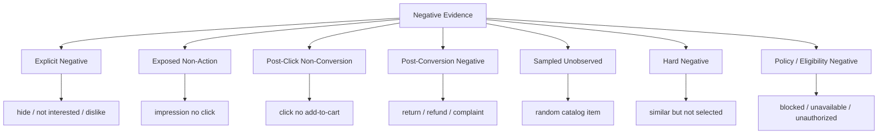
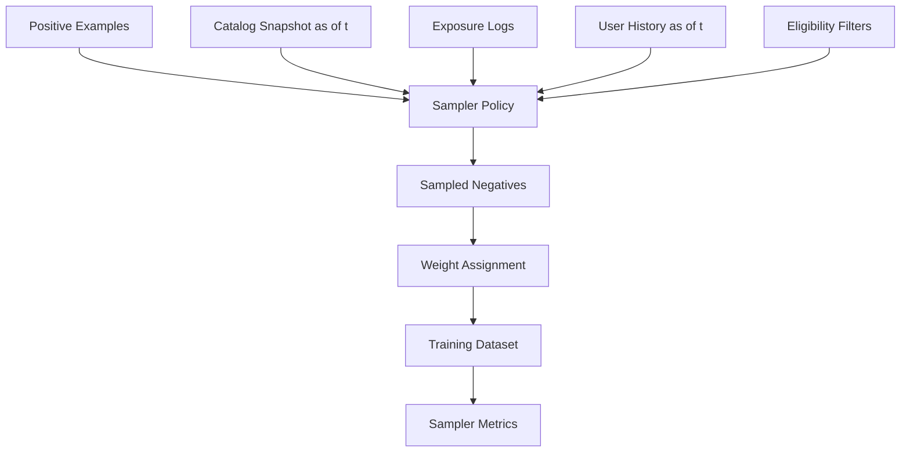

------
title: Build From Scratch Recommendations System - Part 014
description: Mendesain negative sampling dan exposure bias handling untuk recommendation system production-grade: unobserved vs negative, impression negatives, sampled negatives, hard negatives, in-batch negatives, propensity, popularity bias, dan exploration.
series: learn-build-from-scratch-recommendations-system
seriesTitle: Build From Scratch: Enterprise Recommendations System
order: 14
partTitle: Negative Sampling & Exposure Bias
tags:
  - recommendation-system
  - recsys
  - negative-sampling
  - exposure-bias
  - machine-learning
  - retrieval
  - ranking
  - series
date: 2026-07-02
---

# Part 014 — Negative Sampling & Exposure Bias

Recommendation data jarang memiliki negative label yang bersih.

Kita tahu beberapa item yang user klik, beli, tonton, simpan, atau hide. Tetapi untuk jutaan item lain, kita tidak tahu apa-apa.

Apakah user tidak suka item itu?

Belum tentu.

Mungkin user tidak pernah melihatnya. Mungkin item tidak tersedia. Mungkin candidate generator tidak pernah mengambilnya. Mungkin item ada di posisi bawah. Mungkin user akan suka jika ditampilkan pada konteks yang tepat.

Ini inti masalah:

```text
unobserved != negative
```

Namun model tetap butuh negative examples. Retrieval model butuh membedakan item positif dari item lain. Ranking model butuh belajar bahwa beberapa exposed items tidak dipilih. Training dataset terlalu besar jika memakai semua item. Positive labels sangat sparse. Negative sampling menjadi wajib.

Part ini membahas bagaimana memilih negative examples secara benar dan bagaimana exposure bias memengaruhi training recommendation system.

---

## 1. Mental Model: Negative Ada Banyak Jenis

Jangan menyebut semua `0` sebagai hal yang sama.

Jenis negative:

```text
explicit negative        user bilang tidak suka
exposed non-click        user melihat tapi tidak klik
clicked non-conversion   user klik tapi tidak beli
post-conversion negative user beli lalu return/complain
sampled unobserved       item tidak diketahui, disample sebagai negative
hard negative            item mirip/relevan tapi tidak dipilih
policy negative          item tidak boleh ditampilkan
```

Masing-masing punya semantics, weight, dan use case berbeda.



Negative sampling yang baik dimulai dari membedakan kategori ini.

---

## 2. Exposure Bias

Kita hanya punya feedback untuk item yang diekspos.

Historical exposure ditentukan oleh:

- candidate generator lama,
- ranker lama,
- business rules,
- UI layout,
- policy,
- availability,
- experiment,
- popularity,
- editorial decisions,
- sponsored placements.

Karena itu observed data bukan sample acak dari semua possible item. Ia adalah hasil dari logging policy.

```text
observed_feedback = user_behavior_under_old_system
```

Exposure bias menyebabkan model belajar:

- item populer lebih relevan,
- item posisi atas lebih bagus,
- candidate source lama lebih benar,
- long-tail tidak menarik,
- item baru tidak penting,
- UI-biased click pattern.

Untuk mengurangi bias, kita perlu negative sampling dan evaluation yang sadar exposure.

---

## 3. Unobserved Is Not Negative

Misal katalog punya 10 juta item. User membeli 3 item.

Naif:

```text
positive = 3 purchased items
negative = 9,999,997 other items
```

Ini salah.

Sebagian besar item lain:

- tidak pernah dilihat user,
- tidak tersedia di region,
- tidak sesuai surface,
- tidak eligible,
- bukan candidate,
- mungkin relevan tetapi tidak terekspos.

Jika semua unobserved dianggap negative, model akan belajar terlalu banyak “tidak suka” palsu dan sangat bias ke item populer.

Lebih benar:

```text
observed positive = strong evidence
observed explicit negative = strong negative
exposed non-action = weak negative
unobserved sampled = low-confidence negative
```

---

## 4. Exposure-Aware Negatives

Negative terbaik untuk ranking biasanya berasal dari impression yang valid tetapi tidak menghasilkan positive outcome.

Contoh CTR:

```text
base: item_impression
positive: clicked within 30m
negative: no click within 30m
```

Ini exposure-aware karena user punya opportunity melihat item.

Namun tetap weak negative karena no-click ambiguous.

Weight:

```text
clicked positive weight = 1.0
impression no-click weight = 0.1 - 0.3
explicit hide weight = 2.0+
```

Untuk conversion:

```text
base: clicked item
positive: purchase within 7d
negative: click but no purchase within 7d
```

Denominator harus sesuai objective.

Exposure-aware negative lebih realistis untuk ranking daripada random catalog negative.

---

## 5. Impression Negative Quality

Tidak semua impression negative sama.

Lebih kuat negative jika:

- item benar-benar terlihat,
- visible duration cukup,
- position atas,
- user aktif,
- repeated exposures,
- same context,
- user memilih item lain di slate,
- user explicitly skipped.

Lebih lemah negative jika:

- posisi bawah,
- visible duration rendah,
- user bounce dari page,
- network issue,
- client tracking unreliable,
- item in collapsed carousel,
- user tidak aktif.

Feature/weight bisa memperhitungkan:

```text
visibility_weight
position_weight
session_activity_weight
repeat_exposure_weight
```

Example:

```yaml
negative_weight:
  visible_duration_ms < 1000: 0.0
  visible_duration_ms >= 1000 and position > 20: 0.05
  position <= 5 and no_click: 0.2
  repeated_no_click_5_times: 0.5
```

Jangan membuat semua no-click setara.

---

## 6. Sampled Unobserved Negatives

Untuk retrieval model, kita sering tidak punya impression negatives yang cukup atau terlalu mahal. Kita sample unobserved items.

Contoh:

```text
positive pair: (user u, purchased item i)
negative items: random items j1, j2, ..., jk
```

Jenis sampling:

1. uniform random,
2. popularity-based,
3. category-aware,
4. user-segment-aware,
5. hard negative,
6. in-batch negative,
7. mixed sampling.

Sampled unobserved negatives harus diberi confidence rendah karena bisa false negative.

False negative: item yang disample sebagai negative sebenarnya akan disukai user jika ditampilkan.

---

## 7. Uniform Random Negatives

Uniform random memilih item dari katalog secara acak.

Kelebihan:

- sederhana,
- murah,
- coverage katalog luas,
- baik untuk belajar pemisahan kasar.

Kekurangan:

- terlalu mudah,
- kebanyakan item jelas tidak relevan,
- model bisa mendapat metric bagus tanpa kemampuan fine ranking,
- tidak mencerminkan serving candidate set,
- rare items terlalu sering dibanding exposure nyata.

Contoh:

User beli kamera. Random negative bisa berupa popok bayi, sparepart mobil, novel Rusia, alat pancing. Model mudah membedakan.

Uniform random berguna untuk retrieval awal, tetapi tidak cukup untuk ranker.

---

## 8. Popularity-Based Negatives

Sample negatives berdasarkan popularity distribution.

Kelebihan:

- lebih mirip exposure nyata,
- mengajarkan model membedakan positive dari popular alternatives,
- mengurangi overconfidence terhadap popularity.

Kekurangan:

- bisa memperkuat popularity bias,
- long-tail kurang dipelajari,
- popular item yang belum dilihat user bisa false negative.

Sampling distribution:

```text
P(item) ∝ popularity(item)^alpha
```

Dengan `alpha`:

- 0 = uniform,
- 1 = pure popularity,
- antara 0 dan 1 = smoothed popularity.

Praktis:

```text
alpha = 0.5 or 0.75
```

sering lebih sehat daripada pure popularity.

---

## 9. Category-Aware Negatives

Sample negative dari category yang sama atau related.

Contoh:

Positive: mirrorless camera A.  
Negative: mirrorless camera B, DSLR C, lens D.

Kelebihan:

- lebih sulit,
- relevan untuk ranking,
- membantu model belajar preference halus,
- cocok untuk similar item / product ranking.

Kekurangan:

- bisa terlalu sempit,
- false negative lebih tinggi,
- butuh taxonomy baik,
- tidak cocok untuk broad discovery saja.

Category-aware negative bagus untuk:

- product alternatives,
- related content,
- semantic retrieval,
- learning fine-grained taste.

---

## 10. Hard Negatives

Hard negative adalah item yang tampak plausible tetapi bukan positive.

Contoh:

- item ditampilkan posisi atas tetapi tidak diklik,
- item sangat mirip positive tetapi tidak dipilih,
- item di cart alternatives tetapi user membeli item lain,
- search result high-rank not clicked,
- retrieved by current model but no engagement,
- same category and popular.

Hard negatives sangat berguna karena mengajarkan model membedakan kandidat sulit.

Namun risiko false negative tinggi.

Example:

```text
User did not click camera B today, but might buy it tomorrow.
```

Gunakan hard negative dengan:

- weight moderat,
- exposure evidence jika ada,
- time window,
- repeated non-engagement,
- explicit preference jika tersedia.

---

## 11. In-Batch Negatives

Untuk retrieval/two-tower model, training batch berisi pasangan positif:

```text
(u1, i1), (u2, i2), (u3, i3)
```

Untuk `u1`, item `i2` dan `i3` dianggap negatives.

Kelebihan:

- efisien,
- tidak perlu sample explicit banyak,
- cocok untuk contrastive learning,
- scalable.

Kekurangan:

- false negative: u1 mungkin juga suka i2,
- popularity bias,
- batch composition memengaruhi training,
- perlu large batch untuk variasi.

Mitigasi:

- remove known positives from negatives,
- category-aware batch construction,
- use sampled softmax correction,
- downweight potential false negatives,
- use cross-batch memory carefully.

---

## 12. Sampled Softmax and Candidate Correction

Saat item space sangat besar, full softmax mahal.

Sampled softmax memakai subset negatives.

Masalah: jika sampling distribution tidak uniform, logits/loss perlu correction agar estimasi tidak bias.

Prinsip sederhana:

```text
if item is sampled more often as negative, adjust for sampling probability
```

Dalam praktik framework/model bisa menyediakan sampled softmax/NCE variants, tetapi engineer harus memahami bahwa sampling distribution memengaruhi learned score.

Jangan mengubah negative sampler tanpa mengevaluasi calibration dan retrieval quality.

---

## 13. Negative Sampling for Matrix Factorization

Implicit matrix factorization sering memakai confidence:

```text
preference p_ui = 1 if interaction observed else 0
confidence c_ui = 1 + alpha * interaction_strength
```

Unobserved entries tidak sama dengan strong negative. Mereka punya low confidence.

Mental model:

```text
observed positive: high confidence user likes/interacted
unobserved: low confidence unknown/assume weak negative for optimization
```

Ini berbeda dari explicit rating matrix.

Jangan menafsirkan score sebagai pure dislike untuk unobserved items.

---

## 14. Negative Sampling for Ranking

Ranker biasanya dilatih pada exposed candidates.

Dataset:

```text
positive: impressed and clicked/purchased
negative: impressed and not clicked/purchased
```

Jika ranker dilatih dengan random catalog negatives, ia bisa gagal saat serving karena serving candidates sudah disaring oleh retrieval dan semuanya relatif plausible.

Ranking negative sebaiknya:

- same request/slate negatives,
- same candidate pool negatives,
- shown but not clicked,
- clicked but not converted,
- high retrieval score but no engagement,
- explicit negatives.

Request-level negatives sangat berguna karena context sama.

Example:

```text
Request R shows items [A, B, C, D]
User clicks C
For CTR:
  C positive
  A/B/D negatives with position-aware weights
```

---

## 15. Negative Sampling for Retrieval

Retrieval model bertujuan high recall dari jutaan item.

Negative types:

- random catalog negatives,
- popularity negatives,
- in-batch negatives,
- hard negatives from ranker/candidate logs,
- same-category negatives,
- recently exposed not engaged.

Good mix:

```yaml
negative_mix:
  random_uniform: 30%
  popularity_smoothed: 30%
  same_category: 20%
  hard_exposed: 20%
```

Mix berubah sesuai maturity.

Awal: lebih banyak random/popularity.  
Mature: tambah hard negatives.

---

## 16. False Negatives

False negative adalah item yang dilabel negative tetapi sebenarnya user akan suka.

Sumber:

- unobserved sampled negatives,
- in-batch negatives,
- no-click impressions,
- delayed positive after window,
- item unavailable at time but relevant,
- user bought alternative due to stock/price.

Dampak:

- model belajar menjauhkan item relevan,
- recall turun,
- long-tail dirugikan,
- embedding space kacau.

Mitigasi:

- lower weight for uncertain negatives,
- exclude known positives from user history,
- use repeated exposure before strong negative,
- use explicit negatives as high confidence,
- use label windows,
- use soft labels,
- use debiasing/exploration.

---

## 17. Negative Weights

Not all negatives equal.

Example weight table:

| Negative type | Suggested confidence |
|---|---:|
| random unobserved | very low |
| popularity sampled unobserved | low |
| same-category sampled | low-medium |
| impression no-click low position | low |
| impression no-click top position | medium |
| repeated no-click | medium |
| click no purchase | medium |
| hide/not interested | high |
| report | policy/safety, separate |
| return/refund | high post-conversion negative |

Weights are objective-specific.

For CTR, no-click is direct negative.  
For satisfaction, no-click may be irrelevant.  
For retrieval, random negatives can be useful but low-confidence.

---

## 18. Position Bias and Negative Sampling

If item shown at position 20 and not clicked, negative evidence is weak because user may not examine it.

If item shown at position 1 and not clicked, negative evidence is stronger.

But position itself is created by old ranker.

Handling:

1. Use visible impression, not just response.
2. Include position in debiasing analysis.
3. Weight negatives by examination probability.
4. Avoid using final position as serving feature.
5. Use randomized exploration to estimate position effects.
6. Evaluate by position buckets.

Simple weighting:

```text
negative_weight = base_weight * estimated_examination_probability(position, surface, device)
```

But be careful: position bias correction is approximate unless you run randomized interventions.

---

## 19. Propensity and Inverse Propensity Weighting

Propensity is probability that item was shown under logging policy.

If known:

```text
propensity = P(item shown at position k | user, context, logging_policy)
```

Inverse propensity weighting corrects bias:

```text
weight = outcome / propensity
```

Intuition: if an item had low chance to be shown but got shown and clicked, it carries more information.

Challenges:

- propensity often unknown,
- logging policy complex,
- high variance when propensity small,
- requires exploration/randomization,
- hard in deterministic ranking systems.

Practical approach:

- log enough policy data,
- add controlled exploration buckets,
- estimate propensities for position/exposure,
- use clipping to avoid huge weights.

Example:

```text
weight = min(1 / propensity, max_weight)
```

---

## 20. Exploration for Better Negatives

Without exploration, model only learns from old policy.

Controlled exploration provides data about items that would not normally be shown.

Methods:

- random slot,
- epsilon-greedy candidate injection,
- Thompson sampling,
- UCB,
- new item quota,
- long-tail exposure quota,
- interleaving,
- randomized position swaps.

Exploration must be safe:

- apply eligibility/policy filters,
- cap exposure,
- avoid sensitive surfaces,
- monitor guardrails,
- start small,
- log exploration reason and probability.

Exploration improves:

- negative quality,
- counterfactual evaluation,
- cold-start,
- long-tail learning,
- propensity estimation.

---

## 21. Exposure Bias in Candidate Generation

Candidate generation creates a severe selection boundary.

If retrieval never returns item, ranker never sees it.

Training ranker only on retrieved items means ranker cannot fix retrieval blind spots.

Candidate generator training also biased by historical exposures.

Mitigation:

- train retrieval on diverse positives,
- include content-based cold-start candidates,
- add exploration candidate sources,
- log generated-but-not-shown candidates when feasible,
- evaluate recall against multiple positive definitions,
- monitor source contribution and coverage.

Candidate source diversity is not just UX; it is learning infrastructure.

---

## 22. Generated-but-Not-Shown Candidates

If possible, log pre-rank candidate pool.

Example:

```json
{
  "request_id": "req_001",
  "candidate_pool": [
    {"item_id": "A", "source": "two_tower", "rank": 1},
    {"item_id": "B", "source": "trending", "rank": 4}
  ],
  "shown_items": ["A"]
}
```

Generated but not shown is not user negative. User never saw it.

But it is useful for:

- ranker training as model-choice candidates,
- candidate source diagnostics,
- recall analysis,
- offline replay,
- hard negative mining if later exposed.

Do not label generated-not-shown as user dislike.

---

## 23. Sample Ratio and Calibration

Negative downsampling changes class balance.

Example:

Original CTR:

```text
1 click per 100 impressions
```

After downsampling negatives:

```text
1 click per 10 examples
```

Model trained on sampled data may output uncalibrated probabilities unless corrected.

For ranking order, calibration may be less critical. For score composition and business utility, calibration matters.

Solutions:

- use sample weights,
- calibrate model on unbiased validation set,
- adjust intercept/logit,
- evaluate calibration by surface/segment,
- keep validation distribution closer to production.

Do not compare raw predicted probability from differently sampled models without calibration.

---

## 24. Negative Sampling and Diversity

If negatives mostly popular items, model may push niche items weirdly.

If negatives mostly random long-tail, model may over-promote popular items.

If negatives mostly same-category, model may overfit category boundaries.

Sampling distribution affects embedding geometry and ranking behavior.

Monitor:

- item popularity distribution in negatives,
- category distribution,
- seller/creator distribution,
- item age distribution,
- quality distribution,
- surface distribution,
- region distribution.

Dataset is policy. Negative sampler shapes model worldview.

---

## 25. Segment-Aware Negative Sampling

User segments differ.

Examples:

- new users,
- power users,
- anonymous users,
- high-value customers,
- child profiles,
- enterprise roles,
- regions,
- tenants,
- language groups.

If training negatives dominated by majority segment, minority segment quality suffers.

Strategies:

- stratified sampling,
- per-segment evaluation,
- per-surface sampler,
- segment weights,
- tenant-aware sampling for enterprise.

For B2B, never sample unauthorized items as normal negatives for an actor if those items would never be eligible. They should be excluded by access control, not used as preference negatives.

---

## 26. Policy Negatives Are Not Preference Negatives

Item blocked by policy is not something user dislikes. It is invalid.

Examples:

- unauthorized document,
- out-of-region content,
- age-restricted item,
- out-of-stock product,
- banned seller,
- deleted item.

Do not train preference model with:

```text
user does not like unauthorized item
```

Instead:

- exclude from candidate set,
- train eligibility/policy model separately if needed,
- log filter reason,
- monitor filtered candidate rate.

Preference model should not learn access control.

---

## 27. Out-of-Stock and Unavailable Items

If user does not buy an out-of-stock item, that is not preference negative.

Availability affects opportunity.

For e-commerce:

- item impressed while in stock -> valid outcome.
- item out of stock before user could buy -> conversion negative is invalid/ambiguous.
- item unavailable in region -> should not be candidate.

Training should include availability context.

Example:

```text
exclude conversion negatives where item became unavailable during label window
or mark as censored
```

Censored means outcome unobservable because opportunity disappeared.

---

## 28. Censored Labels

Censoring occurs when label cannot be observed.

Examples:

- item removed before click window ends,
- stock out before purchase window ends,
- user loses access,
- account deleted,
- tracking outage,
- app version missing event,
- case reassigned before outcome.

Do not encode censored examples as negative.

Represent:

```json
{
  "label_value": null,
  "label_observed": false,
  "censor_reason": "item_out_of_stock_during_window"
}
```

Censoring is common in production and should be explicit.

---

## 29. Negative Sampling for Multi-Objective Models

If model predicts multiple labels, each task has different negatives.

Example:

```text
CTR task:
  impression no click = negative

Purchase task:
  impression no purchase = weak negative
  click no purchase = stronger negative

Hide task:
  impression no hide = usually negative but highly imbalanced

Return task:
  purchase no return after window = negative
```

Do not reuse one negative set for all tasks blindly.

Multi-task dataset needs label masks and task-specific weights.

---

## 30. Negative Sampling in Enterprise Recommendation

For next-action recommendation:

Positive:

- recommended action accepted,
- executed,
- valid transition,
- good case outcome.

Negative:

- action dismissed as irrelevant,
- action reversed,
- supervisor rejected,
- action led to SLA breach,
- explicit “not applicable”.

Ambiguous:

- action ignored,
- user lacked permission,
- case context changed,
- action not visible,
- recommendation arrived after decision.

Invalid:

- action not allowed by state machine,
- action not permitted for actor,
- action not valid in jurisdiction.

Invalid actions should be excluded or used for policy validation, not preference negative.

Hard negatives:

- valid actions for same case state that were not chosen,
- actions chosen in similar cases but not this one,
- knowledge articles semantically similar but not used.

Enterprise negative sampling must respect workflow invariants.

---

## 31. Practical Negative Sampler Design

Create sampler interface.

```java
interface NegativeSampler {
    List<NegativeExample> sample(
        TrainingContext context,
        PositiveExample positive,
        SamplingPolicy policy
    );
}
```

Conceptual policies:

```yaml
sampler_policy: retrieval-negatives-v1
mix:
  uniform_catalog:
    ratio: 0.25
    weight: 0.05
  popularity_smoothed:
    ratio: 0.25
    alpha: 0.75
    weight: 0.1
  same_category:
    ratio: 0.25
    weight: 0.2
  exposed_no_click:
    ratio: 0.25
    weight: 0.3
filters:
  - eligible_at_prediction_time
  - visible_to_user
  - not_known_positive_for_user
  - not_same_dedup_group_as_positive
  - not_policy_blocked
version: retrieval-negatives-v1
```

The sampler must be versioned.

---

## 32. Negative Sampler Data Flow



Important: sampler must use catalog/user state as-of prediction time, not current state.

---

## 33. Sampler Metrics

Monitor sampler output:

```text
negative_count_per_positive
negative_type_distribution
negative_weight_distribution
category_distribution
popularity_distribution
item_age_distribution
false_negative_estimate
known_positive_collision_rate
eligibility_filter_rate
same_dedup_group_filter_rate
segment_distribution
surface_distribution
```

If sampler silently changes, model behavior changes.

Example alert:

```text
same_category negatives dropped from 25% to 2%
```

Could mean taxonomy join broke.

---

## 34. Evaluating Negative Sampling Choices

Compare samplers not only by offline loss.

Evaluate:

- Recall@K for retrieval,
- NDCG@K for ranking,
- calibration,
- long-tail coverage,
- category diversity,
- cold-item performance,
- online CTR/CVR,
- hide/report guardrails,
- source contribution,
- score distribution.

A sampler that improves offline AUC might reduce discovery diversity or cold-start recall.

Negative sampling is a product/system decision, not purely ML trick.

---

## 35. Anti-Patterns

### 35.1 Treat All Unobserved as Strong Negative

Destroys recommendation quality and creates false negatives.

### 35.2 Random Negatives Only

Too easy; model does not learn fine ranking.

### 35.3 Hard Negatives Only

Too many false negatives; training unstable.

### 35.4 No Sampling Version

Cannot reproduce model.

### 35.5 Sampling from Current Catalog

Future/new/ineligible items leak into historical training.

### 35.6 Ignoring Eligibility

Unauthorized or unavailable items become fake preference negatives.

### 35.7 Same Negative Set for All Objectives

CTR, CVR, satisfaction, and hide need different denominators.

### 35.8 Downsampling Without Calibration

Predicted probabilities become misleading.

### 35.9 Ignoring Position/Exposure

No-click at position 50 treated same as no-click at position 1.

### 35.10 No Exploration

System learns only from old policy and reinforces bias.

---

## 36. Minimal Production Negative Sampling Plan

For first production-grade system:

### Ranking CTR

```yaml
base: valid item impressions
positive: clicked within 30m
negative: no click within 30m
negative_weight:
  default: 0.2
  low_visibility: 0.0
  repeated_no_click: 0.4
exclude:
  - invalid impression
  - bot/internal/test
  - tracking outage
```

### Retrieval Two-Tower

```yaml
positive:
  - purchase
  - add_to_cart
  - meaningful_click
negative_mix:
  - in_batch_negatives
  - popularity_smoothed_catalog
  - same_category
  - exposed_no_click
filters:
  - eligible_as_of_prediction_time
  - not_known_positive
  - not_same_dedup_group
weights:
  random: low
  same_category: medium
  exposed_no_click: medium
```

### Conversion Model

```yaml
base: click or impression depending surface
positive: purchase within 7d
negative:
  - no purchase within 7d if item remained available
censored:
  - item unavailable during window
  - tracking outage
```

### Enterprise Next Action

```yaml
positive:
  - accepted and valid outcome
negative:
  - explicitly dismissed/rejected/reversed
ambiguous:
  - ignored without evidence
invalid:
  - not allowed by state machine, excluded
```

---

## 37. Checklist Negative Sampling & Exposure Bias

```text
[ ] Unobserved items are not treated as strong negatives.
[ ] Negative types are separated.
[ ] Impression negatives require valid exposure.
[ ] No-click negatives are weighted by confidence.
[ ] Explicit negatives have higher confidence and scope.
[ ] Report/policy events are not mixed as preference negatives.
[ ] Random negatives are filtered by eligibility as-of time.
[ ] Hard negatives are used but controlled.
[ ] In-batch false negatives are mitigated.
[ ] Negative sampler is versioned.
[ ] Sampling distribution is monitored.
[ ] Downsampling correction/calibration is handled.
[ ] Position/examination bias is considered.
[ ] Candidate source/logging policy is recorded.
[ ] Exploration exists or is planned.
[ ] Censored labels are not forced to zero.
[ ] Multi-task labels use task-specific negative logic.
[ ] Enterprise invalid actions are not preference negatives.
[ ] Evaluation includes coverage/diversity/cold-start, not only loss.
```

---

## 38. Kesimpulan

Negative sampling adalah salah satu tempat recommendation system paling mudah salah.

Prinsip utama:

1. Unobserved bukan negative.
2. Exposure-aware negatives lebih kuat daripada random unknowns.
3. No-click adalah weak negative, bukan dislike.
4. Explicit negative punya semantics dan scope.
5. Policy/eligibility invalid bukan preference negative.
6. Hard negatives penting tetapi rawan false negative.
7. Sampling distribution membentuk worldview model.
8. Downsampling mengubah calibration.
9. Exposure bias berasal dari logging policy lama.
10. Exploration adalah investasi untuk data masa depan.

Di Part 015, kita akan membahas **Data Quality, Deduplication, and Late Events**: bagaimana menjaga event dan training data tetap bersih ketika dunia nyata penuh retry, duplicate, bot traffic, clock skew, dan delayed conversion.
