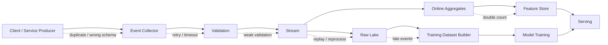
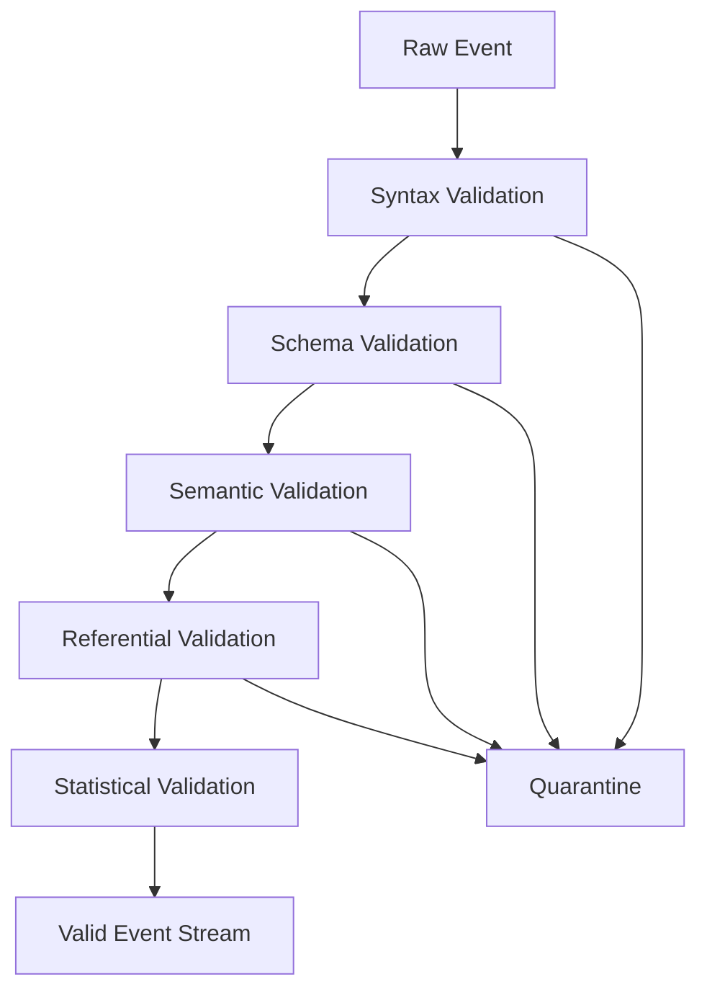
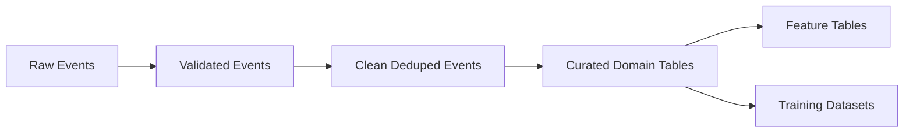

------
title: Build From Scratch Recommendations System - Part 015
description: Mendesain data quality layer untuk recommendation system production-grade: deduplication, late events, out-of-order events, idempotency, bot/internal traffic, clock skew, quarantine, reconciliation, dan data quality monitoring.
series: learn-build-from-scratch-recommendations-system
seriesTitle: Build From Scratch: Enterprise Recommendations System
order: 15
partTitle: Data Quality, Deduplication, and Late Events
tags:
  - recommendation-system
  - recsys
  - data-quality
  - event-driven
  - streaming
  - mlops
  - series
date: 2026-07-02
---

# Part 015 — Data Quality, Deduplication, and Late Events

Recommendation system belajar dari feedback loop.

Feedback loop itu hidup di atas event.

Dan event di dunia nyata tidak pernah sebersih diagram.

Client retry. Event duplicate. App offline lalu flush belakangan. Clock device salah. Bot traffic masuk. Internal QA melakukan pembelian test. User klik sebelum impression sampai ke pipeline. Purchase datang beberapa hari kemudian. Refund datang setelah model sudah dilatih. Catalog update terlambat. Event schema berubah. Satu platform mengirim `position = 0`, platform lain mulai dari `1`. Web melog impression saat render, mobile saat viewport. Kafka consumer restart dan memproses ulang. Batch backfill menggandakan data. Feature aggregate terhitung dua kali.

Jika data quality layer lemah, model akan belajar dari realitas yang rusak.

Part ini membahas data quality untuk recommendation system production-grade: deduplication, idempotency, late events, out-of-order events, clock skew, quarantine, reconciliation, bot/internal filtering, data quality monitoring, dan data incident handling.

---

## 1. Mental Model: Data Quality Adalah Product Safety Layer

Data quality bukan kerja “ETL hygiene” di belakang layar.

Dalam recommendation system, data quality memengaruhi:

- item yang direkomendasikan,
- user profile,
- training labels,
- offline metric,
- A/B test,
- popularity/trending,
- fairness exposure,
- policy monitoring,
- debugging,
- auditability.

Satu bug tracking bisa membuat sistem berpikir:

```text
CTR naik 10x
```

Padahal click event duplicate.

Atau:

```text
item X trending
```

Padahal internal QA mengulang test.

Atau:

```text
user tidak suka kategori Y
```

Padahal impression event dikirim tanpa visibility valid.

Prinsip:

> Treat data quality failures as production incidents, not analytics inconveniences.

---

## 2. Where Data Breaks

Event bisa rusak di banyak titik.



Breakpoints:

- producer bug,
- network retry,
- collector timeout,
- schema mismatch,
- invalid payload,
- duplicate event,
- out-of-order delivery,
- late arrival,
- partition skew,
- consumer reprocessing,
- warehouse backfill,
- feature aggregation bug,
- training join bug,
- experiment attribution bug.

Quality control harus berlapis.

---

## 3. Canonical Data Quality Dimensions

Untuk recommendation event, kualitas data bisa dievaluasi dengan dimensi berikut.

### 3.1 Completeness

Apakah field penting ada?

Contoh:

- `impression_id` missing,
- `item_id` null,
- `surface` kosong,
- `position` missing,
- `experiment_assignment_id` hilang.

### 3.2 Validity

Apakah value masuk domain valid?

- `visible_ratio` antara 0 dan 1,
- `position >= 1`,
- `event_time` valid timestamp,
- `surface` enum dikenal,
- `item_type` valid.

### 3.3 Consistency

Apakah event saling cocok?

- click item_id sama dengan impression item_id,
- response_id ada sebelum impression,
- purchase item mapping valid,
- position tidak duplikat dalam slate.

### 3.4 Timeliness

Apakah event datang cukup cepat?

- impression delay < 5 menit,
- click delay < 5 menit,
- purchase delay sesuai domain,
- catalog change delay < SLA.

### 3.5 Uniqueness

Apakah event duplicate?

- same event_id,
- same impression_id,
- same logical click repeated karena retry.

### 3.6 Accuracy

Apakah event merepresentasikan kenyataan?

Ini paling sulit. Misal impression dilog saat render, bukan terlihat.

Accuracy membutuhkan contract test dan client instrumentation review.

### 3.7 Lineage

Apakah event bisa ditelusuri ke producer, schema, version, source, dan processing pipeline?

Tanpa lineage, debugging sulit.

---

## 4. Validation Layer

Event validation harus bertingkat.



### 4.1 Syntax Validation

Apakah payload bisa diparse?

### 4.2 Schema Validation

Apakah field required ada dan tipe benar?

### 4.3 Semantic Validation

Apakah value masuk akal?

```text
event_time not too far in future
visible_duration_ms >= 0
position >= 1
currency valid
```

### 4.4 Referential Validation

Apakah reference ada?

```text
click.impression_id exists
item_id exists in catalog
request_id exists
experiment assignment valid
```

Referential validation kadang asynchronous karena event bisa out-of-order.

### 4.5 Statistical Validation

Apakah distribusi mendadak berubah?

```text
impression count drops 70%
click rate jumps 5x
position null rate increases
Android v6 sends duplicate clicks
```

---

## 5. Quarantine, Jangan Drop Diam-Diam

Invalid event jangan selalu langsung dibuang tanpa jejak.

Gunakan quarantine.

```json
{
  "event_id": "evt_123",
  "event_name": "item_click",
  "received_at": "2026-07-02T10:00:00Z",
  "validation_errors": [
    {
      "code": "missing_impression_id",
      "severity": "high"
    }
  ],
  "raw_payload_ref": "s3://raw-quarantine/..."
}
```

Quarantine berguna untuk:

- debugging producer,
- menghitung data loss,
- backfill setelah bug diperbaiki,
- audit,
- monitoring schema evolution.

Severity:

| Severity | Action |
|---|---|
| low | allow with warning |
| medium | allow but flag |
| high | quarantine |
| critical | quarantine + alert |

Jangan membuat validation terlalu strict sehingga production event massal hilang karena field minor. Tetapi untuk field penting seperti `item_id`, `event_time`, dan `impression_id`, strictness lebih tinggi.

---

## 6. Event Idempotency

Event pipeline harus menerima retry tanpa double count.

Producer bisa retry karena:

- network timeout,
- collector 5xx,
- mobile offline flush,
- app restart,
- backend retry policy.

Idempotency rule:

```text
same logical event must have same event_id across retries
```

Client harus menyimpan event_id sampai event berhasil terkirim.

Backend event juga harus menggunakan deterministic event_id atau UUID yang tidak berubah saat retry.

Ingestion dedup:

```text
if event_id already seen within dedup horizon:
    drop duplicate or mark duplicate
else:
    accept
```

Dedup horizon tergantung domain:

- click/impression: days,
- purchase: months,
- catalog lifecycle event: long,
- compliance event: effectively permanent.

---

## 7. Deduplication Strategies

### 7.1 Exact Dedup by Event ID

Paling kuat jika event_id reliable.

```text
dedup_key = event_id
```

### 7.2 Logical Dedup

Jika event_id tidak reliable.

```text
dedup_key = hash(event_name, user/session, item_id, impression_id, event_time_bucket)
```

Contoh:

```text
item_click + impression_id = click unique
```

Tetapi hati-hati: user bisa click item sama dua kali. Jangan dedup valid repeated behavior.

### 7.3 Hierarchical Dedup

Gunakan beberapa level:

```text
1. event_id exact duplicate
2. impression_id duplicate
3. request_id + item_id + position duplicate
4. suspicious duplicate pattern
```

### 7.4 Dedup by Producer Sequence

Untuk client:

```text
client_boot_id + client_event_sequence
```

Membantu mendeteksi retry dan missing sequence.

---

## 8. Duplicate Semantics by Event Type

Dedup tidak sama untuk semua event.

### Impression

Satu item impression harus unik untuk satu actual exposure.

Jika event retry, duplicate. Jika user scroll balik dan item terlihat lagi setelah beberapa waktu, bisa valid new impression atau repeated exposure tergantung definition.

### Click

Double tap bisa dua click events, tetapi biasanya untuk CTR satu click per impression cukup.

Policy:

```text
first click per impression counts for CTR
multiple clicks can be kept for UX analysis
```

### Dwell

Dwell bisa update incremental. Jangan dedup semua dwell events.

Gunakan session/page lifecycle:

```text
dwell_start
dwell_update
dwell_end
```

atau aggregate by page view.

### Purchase

Purchase dedup harus berdasarkan order_id/payment_id, bukan event_id saja.

### Catalog Update

Catalog event bisa idempotent by item_id + version.

---

## 9. Late Events

Late event adalah event yang terjadi di masa lalu tetapi baru sampai pipeline sekarang.

Penyebab:

- mobile offline,
- network issue,
- client queue flush,
- server backlog,
- stream replay,
- batch import,
- partner system delay,
- payment settlement delay,
- refund delay.

Late event tidak selalu buruk. Purchase/refund secara natural delayed.

Butuh policy per event type.

```yaml
lateness_policy:
  item_impression:
    allowed_lateness: 24h
  item_click:
    allowed_lateness: 24h
  purchase:
    allowed_lateness: 14d
  return:
    allowed_lateness: 45d
  catalog_policy_ban:
    allowed_lateness: immediate_priority
```

---

## 10. Event Time vs Ingestion Time

Simpan dua-duanya.

```json
{
  "event_time": "2026-07-02T10:00:00Z",
  "ingestion_time": "2026-07-02T10:05:12Z"
}
```

Gunakan:

- event_time untuk business behavior,
- ingestion_time untuk pipeline monitoring,
- processing_time untuk job execution.

Metric penting:

```text
event_lag = ingestion_time - event_time
```

Monitor distribution:

- p50,
- p95,
- p99,
- max,
- by platform,
- by event type.

Late event spike sering menunjukkan client/network/collector issue.

---

## 11. Out-of-Order Events

Click bisa tiba sebelum impression karena network/order.

Example:

```text
click event arrives at 10:00:05
impression event arrives at 10:00:20
```

Jika referential validation langsung strict, click masuk quarantine salah.

Solusi:

1. temporary holding buffer,
2. watermark,
3. delayed referential validation,
4. reconciliation job,
5. allow orphan event with pending status.

Pattern:

```text
accept click as pending
if matching impression arrives within T:
    mark linked
else:
    mark orphan_click
```

Orphan click rate harus dimonitor.

---

## 12. Watermarking

Streaming aggregation memakai watermark untuk menentukan kapan window dianggap selesai.

Example:

```text
allow events up to 10 minutes late
```

Window CTR 10:00–10:05 tidak final sampai watermark lewat.

Trade-off:

- longer lateness tolerance = more complete, higher delay,
- shorter tolerance = faster metrics, more corrections.

Untuk recommendation online features, kadang lebih baik cepat dengan correction later.

Untuk training labels, completeness lebih penting.

---

## 13. Corrections and Reprocessing

Late events bisa mengubah aggregate dan label.

Contoh:

- purchase event datang setelah daily dataset build,
- return event datang setelah satisfaction label positive,
- duplicate discovered after model training,
- bot traffic identified later.

Butuh correction strategy.

### 13.1 Append-Only with Correction Events

Jangan mutate raw event. Tambahkan correction.

```json
{
  "event_name": "event_correction",
  "target_event_id": "evt_123",
  "correction_type": "mark_duplicate",
  "reason": "producer_retry_bug"
}
```

### 13.2 Recompute Derived Tables

Raw events immutable. Derived datasets bisa rebuild.

### 13.3 Versioned Dataset

Jika correction signifikan, buat dataset version baru.

### 13.4 Model Impact Assessment

Jika training data rusak, cek model yang dilatih dari periode itu.

---

## 14. Raw, Clean, Curated Layers

Gunakan layering.



### Raw

Semua yang diterima, immutable.

### Validated

Lulus schema/syntax basic.

### Clean

Deduped, normalized, bot/internal flagged, basic consistency.

### Curated

Domain-specific tables:

- impressions,
- clicks,
- purchases,
- catalog state,
- user sessions,
- item lifecycle.

### Feature/Training

Derived artifacts versioned.

Jangan melatih model langsung dari raw events tanpa cleaning.

---

## 15. Bot, Fraud, Internal, and Test Traffic

Recommendation feedback loop mudah dicemari.

Traffic types:

- internal employees,
- QA automation,
- synthetic monitoring,
- bots,
- scrapers,
- fraud rings,
- seller self-clicking,
- creator manipulation,
- load tests,
- partner test traffic.

Event harus membawa flags:

```json
"traffic_quality": {
  "is_internal_user": false,
  "is_test_traffic": false,
  "is_bot_suspected": false,
  "is_synthetic_monitoring": false,
  "risk_score": 0.02
}
```

Training default:

```text
exclude internal/test/synthetic/bot_suspected high-confidence traffic
```

Popularity/trending harus sangat hati-hati terhadap manipulation.

---

## 16. Clock Skew

Client clock bisa salah.

Examples:

- event_time di masa depan,
- event_time 1970,
- timezone salah,
- device offline lama,
- app uses local time without timezone.

Validation:

```text
if event_time > ingestion_time + tolerance:
    flag future_clock
if event_time < ingestion_time - max_allowed_lateness:
    flag too_old
```

Correction options:

- use server_received_time for some metrics,
- keep event_time but flag,
- quarantine severe cases,
- estimate corrected event time from sequence.

For training, severe clock skew can break label windows and temporal joins.

---

## 17. Schema Drift

Producer bisa berubah.

Contoh:

- enum baru,
- field rename,
- field removed,
- type berubah string -> number,
- position indexing berubah,
- impression definition berubah,
- event name reused.

Prevent:

- schema registry,
- backward/forward compatibility rules,
- contract tests,
- producer version in event,
- consumer compatibility tests,
- release gating,
- canary monitoring.

Event must include:

```json
{
  "schema_version": 3,
  "producer": {
    "name": "ios-app",
    "version": "6.2.0"
  }
}
```

Monitor metrics by producer version.

---

## 18. Semantic Drift

Lebih berbahaya daripada schema drift.

Schema sama, makna berubah.

Example:

`item_impression` di Android v5 berarti card rendered.  
Di Android v6 berarti 50% visible for 1s.

Field masih sama, metric berubah.

Prevent:

- event definition version,
- instrumentation spec,
- cross-platform contract tests,
- dashboard by client version,
- launch review for tracking changes.

Add:

```json
"impression_definition": "visible_ratio_gte_0_5_for_1000ms"
```

Semantic drift harus dianggap data contract breaking change.

---

## 19. Cross-Platform Consistency

Web, iOS, Android, backend, email, push bisa melog event berbeda.

Common inconsistency:

- position starts at 0 vs 1,
- surface names differ,
- click target names differ,
- impression definition differs,
- app version missing context,
- session id generated differently,
- timezone handling differs.

Need:

- canonical event spec,
- platform adapters,
- validation by platform,
- parity tests,
- dashboards by platform.

Never trust aggregate metric without slicing by platform.

---

## 20. Referential Reconciliation

Some references arrive late.

Examples:

- click references impression not found,
- purchase references item SKU not mapped,
- impression references response missing,
- response references experiment unknown,
- catalog item missing.

Create reconciliation jobs:

```text
find orphan_clicks older than 1h
try join with delayed impressions
mark resolved or unresolved
```

Metrics:

```text
orphan_click_rate
click_impression_join_rate
purchase_item_mapping_failure_rate
response_impression_join_rate
experiment_attribution_missing_rate
```

High orphan rate means event contract/pipeline problem.

---

## 21. Data Quality for Training Labels

Training labels require stronger quality than dashboard.

Before label construction:

- dedup impressions,
- validate exposure,
- link clicks to impressions,
- filter invalid traffic,
- handle late positives,
- close label window,
- exclude tracking incident periods,
- join catalog as-of time,
- mark censored examples,
- validate outcome mapping.

Bad labels are more damaging than missing labels.

If a period has broken tracking, exclude it from training or create a known-incident flag.

---

## 22. Data Quality for Online Features

Online features can double count if stream reprocesses duplicate events.

Example:

```text
user_click_count_camera_1h += 1
```

If click duplicate, profile shifts.

Use idempotent aggregation:

- event_id dedup store,
- exactly-once semantics if available and configured correctly,
- upsert by event_id,
- compacted state,
- correction events,
- periodic reconciliation from clean batch.

For critical counters, reconcile streaming aggregates with batch truth.

---

## 23. Data Quality for Popularity and Trending

Trending is highly sensitive to bad traffic.

A bot can create fake trend quickly.

Popularity/trending should filter:

- bot,
- internal/test,
- duplicate events,
- suspicious IP/device patterns,
- abnormal velocity,
- low-quality sources,
- self-promotion loops.

Metrics:

```text
trend_contributor_count
unique_user_count
click_per_user_distribution
bot_score_distribution
creator_self_click_rate
region_distribution
```

Trending should use robust statistics, not raw click count only.

---

## 24. Data Quality for Experiments

A/B test breaks if event quality differs by variant.

Checks:

- sample ratio mismatch,
- event volume by variant,
- missing assignment,
- impression definition by variant,
- latency/logging error by variant,
- client version imbalance,
- bot/internal imbalance.

If treatment changes UI, click semantics may change.

Example:

Treatment card has bigger image. CTR rise may reflect presentation, not relevance.

Experiment logs must include layout/presentation context.

---

## 25. Data Incident Management

Treat severe data bugs as incidents.

Incident record:

```yaml
incident_id: data-incident-20260702-android-click-dup
start_time: 2026-07-02T08:00:00Z
end_time: 2026-07-02T12:30:00Z
affected_events:
  - item_click
affected_platforms:
  - android
affected_versions:
  - 6.1.0
impact:
  - click_count duplicated 2-5x
  - CTR dashboard inflated
  - online user click counters corrupted
mitigation:
  - producer hotfix
  - duplicate correction job
  - exclude period from training
owner: mobile-platform
```

Dataset builder should ingest incident windows and exclude/flag affected data.

---

## 26. Monitoring Data Quality

Minimum dashboards:

### Volume

```text
event_count by event_name/surface/platform/version
```

### Freshness

```text
event_lag p50/p95/p99
pipeline_lag
feature_materialization_lag
```

### Validity

```text
schema_error_rate
semantic_error_rate
quarantine_rate
missing_required_field_rate
```

### Linkage

```text
click_to_impression_join_rate
response_to_impression_join_rate
purchase_attribution_rate
```

### Duplicates

```text
duplicate_event_rate
duplicate_impression_rate
duplicate_click_rate
```

### Traffic Quality

```text
bot_suspected_rate
internal_test_rate
fraud_order_rate
```

### Distribution

```text
CTR by surface/platform/version
position distribution
visible_duration distribution
label positive rate
feature null rate
```

---

## 27. Alert Design

Avoid noisy alerts. Alert on impact.

Examples:

```text
critical:
  item_impression volume drops >50% for main surface
  click_to_impression_join_rate <95%
  quarantine_rate >5%
  event_lag p95 >30m for impressions
  purchase attribution missing >20%

warning:
  field null rate increases 2x
  new enum value appears
  CTR shifts >3 std dev by client version
  duplicate rate >1%
```

Alerts need owner and runbook.

---

## 28. Data Quality Gates

Before model training:

```text
fail if:
  feature timestamp leakage found
  label positive rate outside expected range
  click-impression join rate below threshold
  duplicate rate above threshold
  bot traffic not filtered
  incident window not excluded
  required feature null rate too high
```

Before feature publish:

```text
fail if:
  online/offline feature parity broken
  materialization lag exceeds SLA
  null rate too high
  distribution drift severe
```

Data quality gates are CI/CD for data.

---

## 29. Reconciliation: Stream vs Batch

Streaming is fast but may be approximate. Batch is slower but can be authoritative.

Pattern:

```text
online aggregate = stream
daily truth = batch clean events
difference -> correction / alert
```

Example:

```text
stream_click_count_item_101_24h = 1000
batch_clean_click_count_item_101_24h = 830
difference = 20.5%
```

If difference too high, investigate duplicates, late events, bot filters, or stream job bug.

---

## 30. Data Quality Ownership

Every event and derived table needs owner.

Ownership matrix:

| Asset | Owner |
|---|---|
| client impression event | mobile/web platform |
| event collector | data platform |
| clean event table | data platform |
| recommendation response event | recsys backend |
| feature view | feature owner team |
| training dataset | ML/recsys team |
| catalog projection | catalog/platform team |
| experiment attribution | experimentation platform |

Without ownership, data bugs linger.

---

## 31. Anti-Patterns

### 31.1 Drop Invalid Events Silently

No visibility into producer bugs.

### 31.2 Train Directly from Raw Events

Duplicates, bots, invalid impressions enter model.

### 31.3 No Event ID

Retry becomes double count.

### 31.4 No Event Time

Cannot handle late/out-of-order behavior.

### 31.5 Treat Late Events as Bad Events

Some outcomes are naturally delayed.

### 31.6 No Bot/Internal Filter

Popularity and model training get polluted.

### 31.7 Schema Compatible but Semantically Broken

Same field, changed meaning.

### 31.8 No Incident Exclusion

Tracking bugs become training data.

### 31.9 Streaming Counter Without Dedup

Online profile corrupted by retry.

### 31.10 No Join-Rate Monitoring

Click/conversion attribution silently degrades.

---

## 32. Minimal Production Data Quality Plan

Implement this first:

```yaml
raw_layer:
  immutable: true
  store_all_received_events: true

validation:
  syntax_schema_validation: true
  semantic_validation: true
  quarantine_invalid: true

dedup:
  event_id_dedup: true
  logical_dedup_for_impression_click: true
  dedup_horizon: 30d

lateness:
  event_time_and_ingestion_time: required
  lag_metrics: true
  allowed_lateness_by_event_type: true

traffic_filter:
  internal_users: exclude_from_training
  test_traffic: exclude_from_training
  bot_suspected: exclude_or_downweight

reconciliation:
  click_impression_join: monitor
  purchase_attribution: monitor
  stream_vs_batch_counts: daily

incident_management:
  incident_windows_table: true
  dataset_builder_excludes_incidents: true

quality_gates:
  before_training: true
  before_feature_publish: true
```

---

## 33. Checklist Data Quality Readiness

```text
[ ] Raw events are immutable.
[ ] Event_id exists and is stable across retries.
[ ] Event_time and ingestion_time are stored.
[ ] Schema validation exists.
[ ] Semantic validation exists.
[ ] Invalid events go to quarantine.
[ ] Dedup strategy is event-type aware.
[ ] Duplicate rates are monitored.
[ ] Late event policy exists per event type.
[ ] Out-of-order references can be reconciled.
[ ] Clock skew is detected.
[ ] Bot/internal/test traffic is flagged.
[ ] Schema drift is monitored by producer version.
[ ] Semantic drift is guarded by contract tests.
[ ] Cross-platform event parity is monitored.
[ ] Click-impression join rate is monitored.
[ ] Purchase attribution rate is monitored.
[ ] Streaming aggregates are idempotent or reconciled.
[ ] Data incidents are recorded and excluded/flagged.
[ ] Training dataset has quality gates.
[ ] Feature publication has quality gates.
```

---

## 34. Kesimpulan

Recommendation system hanya sebaik feedback loop-nya. Feedback loop hanya sebaik data quality layer-nya.

Prinsip utama:

1. Data quality failures are production incidents.
2. Raw data harus immutable, tetapi derived data harus bisa dikoreksi.
3. Event pipeline harus idempotent.
4. Dedup harus event-type aware.
5. Late events adalah realitas, bukan edge case.
6. Out-of-order events perlu reconciliation.
7. Bot/internal/test traffic harus dikeluarkan dari learning signal.
8. Schema dan semantic drift harus dimonitor.
9. Training dataset butuh quality gates.
10. Monitoring harus mencakup volume, freshness, validity, linkage, duplicates, dan distribution.

Di Part 016, kita akan membahas **Feature Taxonomy & Feature Contracts**: bagaimana mendefinisikan feature yang jelas, versioned, fresh, dan konsisten antara training dan serving.
