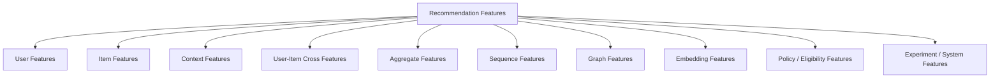
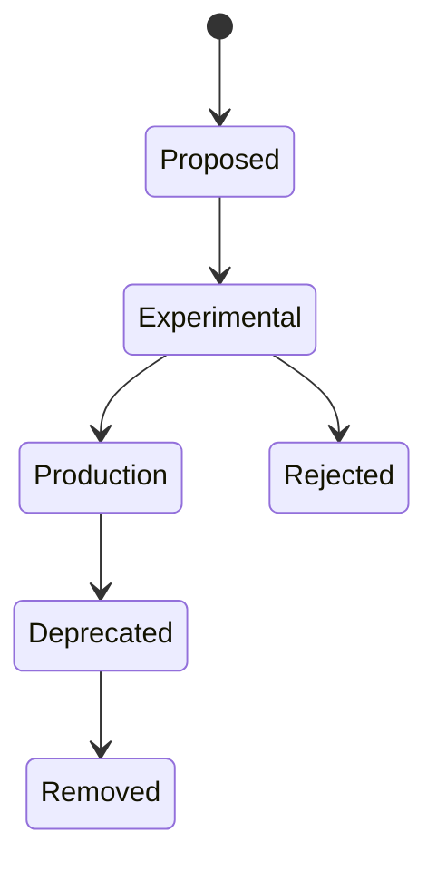
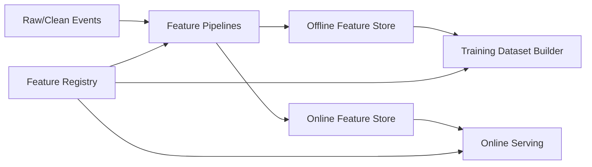
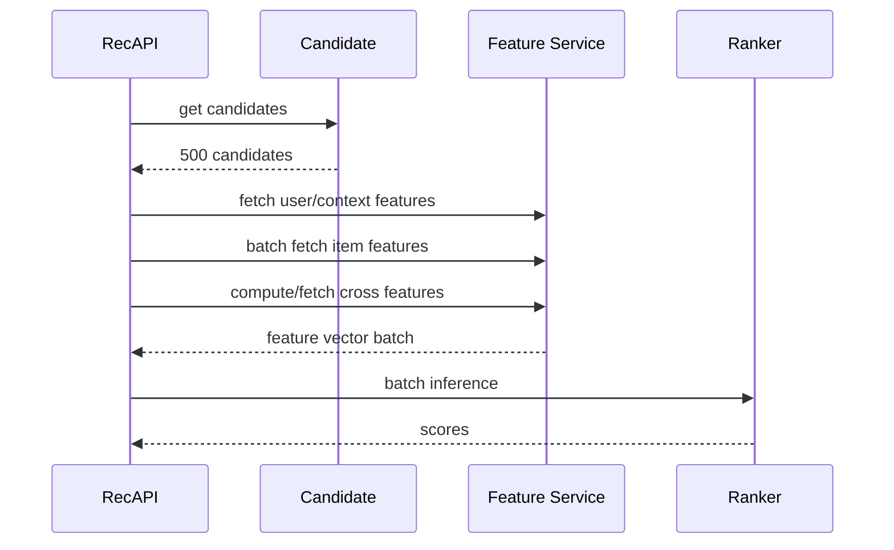

------
title: Build From Scratch Recommendations System - Part 016
description: Mendesain feature taxonomy dan feature contracts untuk recommendation system production-grade: user, item, context, cross, aggregate, sequence, graph, embedding features, freshness SLA, ownership, offline-online parity, dan feature lifecycle.
series: learn-build-from-scratch-recommendations-system
seriesTitle: Build From Scratch: Enterprise Recommendations System
order: 16
partTitle: Feature Taxonomy & Feature Contracts
tags:
  - recommendation-system
  - recsys
  - feature-store
  - feature-engineering
  - mlops
  - data-contract
  - series
date: 2026-07-02
---

# Part 016 — Feature Taxonomy & Feature Contracts

Model tidak langsung memahami user, item, context, atau intent.

Model melihat feature.

Feature adalah cara kita menerjemahkan dunia domain ke bentuk yang bisa dihitung.

Tetapi dalam production recommendation system, feature bukan sekadar kolom di dataframe. Feature adalah contract antara data, backend, ML, product, serving, observability, dan governance.

Feature yang buruk bisa membuat model:

- memakai data masa depan,
- berbeda antara training dan serving,
- stale saat online,
- null untuk segment tertentu,
- bias terhadap item populer,
- melanggar privacy,
- sulit didebug,
- tidak bisa direproduksi,
- gagal saat schema berubah,
- diam-diam berubah makna.

Part ini membahas feature taxonomy dan feature contracts: bagaimana mengelompokkan feature, mendefinisikan semantics, menetapkan freshness, menjaga offline-online parity, dan mengelola lifecycle feature secara production-grade.

---

## 1. Mental Model: Feature Adalah Janji

Feature bukan hanya nilai.

Feature adalah janji:

```text
For entity X at time T, this feature means Y,
computed from source Z, using logic V,
available within freshness SLA S,
valid for purpose P,
and safe under policy C.
```

Contoh feature buruk:

```text
user_score
```

Tidak jelas:

- score apa?
- dihitung dari apa?
- range berapa?
- update kapan?
- untuk objective apa?
- apakah termasuk future events?
- apakah tersedia online?
- apakah null artinya zero?
- siapa owner-nya?

Contoh feature lebih sehat:

```yaml
name: user_category_click_affinity_7d
entity: user_id
description: Decayed count of user clicks in category during the last 7 days before feature timestamp.
value_type: float
range: [0, +inf)
source_events:
  - item_click
join_dependencies:
  - item_category_snapshot
time_semantics: event_time
freshness_sla: 15m
owner: personalization-data
privacy_class: behavioral
online_available: true
offline_available: true
version: v3
```

Feature contract membuat feature bisa dipercaya.

---

## 2. Feature Taxonomy

Recommendation features bisa dikelompokkan seperti ini.



Setiap kelompok punya semantics, freshness, dan serving pattern berbeda.

---

## 3. User Features

User features menjelaskan preference, behavior, state, dan constraints user.

Examples:

```text
user_category_click_count_7d
user_category_purchase_count_90d
user_avg_price_bucket_30d
user_brand_affinity
user_creator_affinity
user_language_preference
user_recent_search_embedding
user_long_term_embedding
user_hide_rate_30d
user_price_sensitivity
user_lifecycle_stage
user_subscription_tier
user_consent_personalization
```

User features bisa level:

- user_id,
- anonymous_id,
- session_id,
- household_id,
- tenant_id,
- role/actor.

Jangan mencampur identity types dalam satu feature key.

Bad:

```text
profile_category_affinity
```

Good:

```text
user_category_affinity
anonymous_session_category_affinity
household_content_affinity
tenant_popular_topic_affinity
```

---

## 4. Item Features

Item features menjelaskan item.

Examples:

```text
item_category_id
item_brand_id
item_creator_id
item_price_bucket
item_age_since_created
item_quality_score
item_rating_avg
item_review_count
item_return_rate_30d
item_ctr_7d
item_cvr_30d
item_completion_rate_7d
item_policy_state
item_availability_state
item_text_embedding
item_image_embedding
item_topic_distribution
item_seller_quality_score
```

Item features bisa static atau dynamic.

Static-ish:

- category,
- brand,
- creator,
- language,
- duration.

Dynamic:

- stock,
- price,
- quality score,
- CTR,
- trend score,
- policy state,
- embedding version.

Training harus join item feature as-of prediction time.

Serving harus check freshness for dynamic features.

---

## 5. Context Features

Context features menjelaskan request situation.

Examples:

```text
surface_id
device_type
local_hour
day_of_week
region
locale
session_depth
current_query_embedding
seed_item_category
cart_total_bucket
cart_category_set
workflow_case_state
actor_role
case_risk_level
sla_remaining_hours
```

Context features sering dihitung request-time atau nearline.

Surface context sangat penting karena feature meaning berubah per surface.

Example:

```text
position_bias_curve_home_feed_mobile
```

bukan sama dengan:

```text
position_bias_curve_desktop_grid
```

---

## 6. User-Item Cross Features

Cross features menangkap hubungan user dan item.

Examples:

```text
user_item_category_match
user_item_brand_affinity
user_item_creator_affinity
user_item_price_fit
user_item_embedding_similarity
user_has_seen_item_7d
user_has_purchased_item
user_has_hidden_creator
user_item_dedup_group_seen_count
user_topic_affinity_for_item_topic
```

Cross features sering sangat predictive.

Tetapi lebih mahal karena harus dihitung per candidate item.

Serving implications:

```text
if 500 candidates and 50 cross features:
    25,000 feature values per request
```

Optimasi:

- precompute common cross features,
- compute cheap cross features online,
- cache user vector/item vector,
- batch feature computation,
- restrict candidate count before expensive cross features.

---

## 7. Aggregate Features

Aggregate features diringkas dari events.

Examples:

```text
item_click_count_1h
item_ctr_7d
category_purchase_rate_30d
seller_complaint_rate_30d
creator_watch_completion_7d
region_trending_score_3h
user_click_count_24h
tenant_case_resolution_rate_by_action_90d
```

Aggregate features harus punya:

- window,
- entity key,
- event source,
- denominator,
- smoothing,
- timestamp,
- lag policy.

Contoh ambiguity:

```text
item_ctr_7d
```

Harus dijelaskan:

```text
clicks / valid impressions over 7d before feature_timestamp,
excluding bot/internal traffic,
smoothed with prior by category,
computed hourly.
```

---

## 8. Sequence Features

Sequence features menangkap urutan perilaku.

Examples:

```text
last_10_clicked_item_ids
last_20_watched_topic_ids
session_recent_category_sequence
time_since_last_click
time_gap_between_recent_actions
recent_search_query_sequence
case_state_transition_history
```

Representasi:

- raw sequence IDs,
- pooled embeddings,
- RNN/Transformer encoded vector,
- counts with order decay,
- n-gram transitions.

Sequence features membutuhkan:

- strict temporal ordering,
- event_time correctness,
- session boundary,
- max length,
- padding/truncation policy,
- privacy filtering.

Never include target future event in history.

---

## 9. Graph Features

Recommendation often involves graph structure.

Graphs:

- user-item interaction graph,
- item-item co-view graph,
- item-category graph,
- creator-user graph,
- seller-product graph,
- case-entity graph,
- knowledge article-topic graph,
- organization-role-permission graph.

Graph features:

```text
personalized_pagerank_score
user_item_graph_distance
co_view_count
co_purchase_lift
common_neighbor_count
creator_affinity_graph_score
case_similarity_graph_score
```

Graph features need freshness and leakage control.

If graph built from future interactions, it leaks.

Graph snapshot must have cutoff time.

---

## 10. Embedding Features

Embedding features represent entities in vector space.

Types:

```text
user_embedding
item_embedding
session_embedding
query_embedding
text_embedding
image_embedding
audio_embedding
creator_embedding
seller_embedding
case_embedding
knowledge_article_embedding
```

Contracts must include:

- model name/version,
- dimension,
- training data cutoff,
- source fields,
- normalization,
- compatible index,
- refresh cadence,
- fallback if missing.

Example:

```yaml
name: item_text_embedding
dimension: 384
model: text-encoder-20260701
source_fields:
  - title
  - description
  - category_path
training_cutoff: 2026-07-01T00:00:00Z
refresh_sla: 24h
compatible_with:
  - user_query_embedding_text_encoder_20260701
```

Do not compare embeddings from incompatible models.

---

## 11. Policy and Eligibility Features

Some features are constraints, not preference.

Examples:

```text
item_policy_state
item_age_rating
user_child_profile
actor_permission_set
tenant_id
case_jurisdiction
item_availability_state
stock_available
seller_suspended
content_region_allowed
```

These should often be used before ranking as filters or hard constraints.

Do not let model learn access control implicitly.

Bad:

```text
ranker gives low score to unauthorized items
```

Good:

```text
unauthorized items never enter candidate set or are hard-filtered
```

Policy features must be fresh. Stale policy can be severe.

---

## 12. System and Experiment Features

Some features describe system state.

Examples:

```text
candidate_source
retrieval_model_version
ranker_model_version
surface_layout_variant
experiment_variant
position_if_fixed_slot
request_latency_budget
fallback_used
```

Use carefully.

`candidate_source` can help ranker calibrate scores from different retrieval sources. But it can also overfit to old source quality.

`experiment_variant` should usually be used for analysis, not serving score, unless intentionally part of adaptive policy.

---

## 13. Feature Naming

Feature names should encode meaning.

Pattern:

```text
<entity>_<attribute/event>_<aggregation>_<window>_<qualifier>
```

Examples:

```text
user_category_click_count_7d
item_impression_count_1h
user_item_embedding_cosine
seller_return_rate_30d
region_category_trending_score_3h
session_recent_item_embedding_avg_20
case_action_success_rate_90d
```

Avoid:

```text
score
rank
feature1
user_weight
magic_ctr
new_signal
```

Good names reduce bugs.

---

## 14. Feature Contract Template

Use a standard template.

```yaml
name: user_category_click_count_7d
description: Count of valid user clicks per category in the 7 days before feature timestamp.
entity:
  type: user_id
  key: user_id
value:
  type: map<string, float>
  default: empty_map
source:
  events:
    - item_click
  joins:
    - item_category_snapshot
time_semantics:
  event_time_based: true
  lookback_window: 7d
  point_in_time_required: true
freshness:
  online_sla: 15m
  offline_materialization: hourly
quality:
  null_policy: empty_map
  expected_range: ">=0"
  validation:
    - non_negative
    - category_id_known
privacy:
  class: behavioral
  purpose: personalization
  consent_required: true
serving:
  online_available: true
  fallback: empty_map
owner:
  team: personalization-data
version: v3
```

Feature contract should live in code/config, not only wiki.

---

## 15. Feature Freshness

Different features need different freshness.

Examples:

| Feature | Freshness need |
|---|---|
| user long-term category affinity | hours/day |
| session recent clicks | seconds |
| item stock state | seconds/minutes |
| item policy state | immediate |
| trending score | minutes |
| item embedding | hours/day |
| seller complaint rate | hours/day |
| case state | immediate |
| consent state | immediate |

Do not over-fresh everything. It increases cost and complexity.

Define freshness SLA:

```yaml
freshness_sla:
  max_age: 15m
  fail_behavior: use_stale_with_metric
```

For critical policy:

```yaml
freshness_sla:
  max_age: 1m
  fail_behavior: fail_closed
```

---

## 16. Staleness Behavior

When feature is stale, choose behavior.

Options:

1. Use stale value and log.
2. Use default.
3. Refresh synchronously.
4. Drop feature.
5. Drop candidate.
6. Use fallback model.
7. Fail closed.
8. Fail open.

Examples:

```text
trending_score stale -> use stale
session_recent_clicks stale -> default to empty session
stock stale -> sync refresh or filter
policy stale -> fail closed
consent stale -> fail closed/non-personalized
```

Staleness policy must be feature-specific.

---

## 17. Offline-Online Parity

One of the most common production ML bugs:

```text
training feature != serving feature
```

Examples:

- training computes 7d click count from clean batch,
- serving computes from raw stream with duplicates,
- training uses category taxonomy v3,
- serving uses v2,
- training fills null with 0,
- serving omits feature,
- training normalizes price by global mean,
- serving uses local mean.

Parity requires:

- shared feature definitions,
- same transformation code where possible,
- feature store,
- offline/online consistency tests,
- shadow comparison,
- feature value logging.

Test:

```text
For sampled online requests, recompute offline features as-of request time and compare.
```

Monitor parity drift.

---

## 18. Training-Serving Skew

Training-serving skew occurs when distributions differ.

Sources:

- offline features cleaner than online,
- online features stale,
- online missing values,
- candidate distribution differs,
- identity resolution differs,
- catalog projection lag,
- feature default mismatch,
- online not using same filters,
- online latency timeout drops expensive features.

Measure:

```text
feature distribution in training
vs
feature distribution in online logs
```

By surface/segment/model version.

---

## 19. Feature Logging

To debug model decisions, log feature snapshots or references.

Options:

### 19.1 Log All Feature Values

Pros:

- easy debug,
- exact training reconstruction.

Cons:

- expensive,
- privacy risk,
- large payload.

### 19.2 Log Feature Snapshot ID

Pros:

- compact,
- safer.

Cons:

- requires historical feature lookup.

### 19.3 Log Selected Features

Compromise.

Recommended:

- log feature set version,
- log feature snapshot/reference,
- log critical features and null/staleness indicators,
- sample full feature logs for debugging.

---

## 20. Nulls and Defaults

Null handling must be explicit.

Example:

```text
user_purchase_count_30d = null
```

Does it mean:

- unknown user?
- no purchases?
- feature missing due to bug?
- consent not allowed?
- online timeout?
- new user?

These are different.

Better:

```text
user_purchase_count_30d = 0
user_purchase_count_30d_missing_reason = "new_user"
```

For important features, add missing indicators:

```text
feature_value
feature_is_missing
feature_missing_reason
```

Do not silently replace everything with zero.

---

## 21. Feature Normalization

Features need stable scales.

Examples:

- log transform counts,
- bucket price,
- normalize by category,
- z-score numeric values,
- cap outliers,
- min-max for bounded signals,
- decayed counts.

Normalization must be part of contract.

Example:

```yaml
transform:
  raw: item_click_count_7d
  operation: log1p
  cap: 10000
```

Training and serving must apply same transform.

---

## 22. Feature Versioning

Feature meaning changes. Version it.

Examples of breaking changes:

- count window changes from 7d to 14d,
- bot filter added,
- category taxonomy changes,
- smoothing added,
- denominator changes,
- null default changes,
- event source changes.

Use versions:

```text
user_category_click_count_7d_v3
```

or metadata version:

```yaml
name: user_category_click_count_7d
version: v3
```

For compatibility, keep old feature until models using it are retired.

Feature registry should track which models use which feature version.

---

## 23. Feature Ownership

Every feature needs owner.

Owner responsible for:

- definition,
- source changes,
- freshness,
- data quality,
- backfill,
- deprecation,
- incident response,
- documentation.

Without owner, stale/broken features survive forever.

Feature registry:

```yaml
owner_team: personalization-data
slack_channel: "#recsys-data"
oncall: data-platform-oncall
```

Ownership is operational, not decorative.

---

## 24. Feature Lifecycle

Feature lifecycle:



### Proposed

Definition, source, expected value.

### Experimental

Computed offline, tested in model.

### Production

Available online/offline, monitored.

### Deprecated

No new model use, still served for existing models.

### Removed

Deleted after model dependency gone.

Never remove a production feature without checking model dependencies.

---

## 25. Feature Store Concepts

A feature store usually provides:

- feature registry,
- offline feature store,
- online feature store,
- materialization jobs,
- point-in-time joins,
- feature views,
- entity keys,
- freshness tracking,
- monitoring.

Conceptually:



The important idea is not a specific tool. The important idea is **same feature definition serving both training and online inference**.

---

## 26. Entity Keys and Feature Views

Feature view groups features by entity and freshness.

Example:

```yaml
feature_view: user_behavior_7d
entity: user_id
features:
  - user_click_count_7d
  - user_purchase_count_7d
  - user_category_affinity_7d
materialization: hourly
online: true
```

Another:

```yaml
feature_view: session_behavior
entity: session_id
features:
  - session_recent_item_ids
  - session_recent_category_counts
  - session_depth
materialization: streaming
ttl: 2h
online: true
```

Do not put features with very different freshness requirements in same view if it complicates updates.

---

## 27. TTL and Expiry

Online features need TTL.

Example:

```yaml
session_recent_clicks:
  ttl: 2h
user_long_term_embedding:
  ttl: 7d
item_stock_state:
  ttl: 5m
```

If TTL expired, feature is stale/missing.

Serving behavior must be defined.

TTL prevents ancient state from pretending to be fresh.

---

## 28. Backfill

When creating a new feature, you need historical values for training.

Backfill issues:

- source event schema changed,
- historical catalog missing,
- old traffic unfiltered,
- identity graph changed,
- compute cost large,
- point-in-time join expensive.

Feature contract should specify backfill plan.

```yaml
backfill:
  start_date: 2025-01-01
  method: hourly_event_time_aggregation
  known_limitations:
    - android impressions before 2025-05 used render definition
```

If historical feature quality differs, record limitation.

---

## 29. Feature Quality Monitoring

Monitor features like services.

Metrics:

```text
null_rate
default_rate
staleness
materialization_lag
value_distribution
outlier_rate
cardinality
top_values
coverage_by_segment
online_offline_parity
source_event_volume
```

Example alerts:

```text
item_quality_score null rate > 5%
session_recent_clicks staleness p95 > 10s
user_embedding missing for logged-in users > 2%
price_bucket distribution shifted unexpectedly
```

Feature quality problems should block model deployment if severe.

---

## 30. Feature Privacy and Governance

Features can encode sensitive behavior.

Classify:

- public item metadata,
- behavioral data,
- sensitive behavioral data,
- PII-derived,
- regulated,
- tenant-confidential,
- child-related,
- inferred attributes.

Feature contract should include:

```yaml
privacy:
  class: behavioral
  consent_required: true
  allowed_purposes:
    - personalization
  retention: 180d
  deletion_behavior: recompute_or_delete
```

Avoid features that infer sensitive attributes unless explicitly allowed and governed.

For enterprise, tenant boundary is critical:

```text
tenant_feature must not aggregate across tenants unless allowed.
```

---

## 31. Feature Leakage Control

For every feature ask:

```text
Could this include information after prediction_time?
Could this include label outcome?
Could this include future identity merge?
Could this include future catalog state?
Could this include current example in aggregate?
Could this be computed online at serving time?
```

Feature contract should state:

```yaml
point_in_time_safe: true
lookback_window: 7d
aggregation_cutoff: feature_timestamp
```

Features that are not point-in-time safe should not be used in training/serving rankers.

---

## 32. Feature Cost

Features have cost.

Costs:

- compute cost,
- storage cost,
- online latency,
- memory,
- network fetch,
- feature join complexity,
- monitoring burden,
- ownership burden.

A feature that improves AUC slightly but adds 50ms latency may not be worth it.

Feature review should include:

```text
predictive value
latency cost
freshness requirement
operational complexity
privacy risk
debuggability
```

Not every clever feature belongs in production.

---

## 33. Feature Fetching in Serving

Serving flow:



Optimization:

- batch feature fetch,
- parallel user/item/context fetch,
- cache item features,
- keep user/session features warm,
- precompute cross features when expensive,
- reduce candidate count before expensive features,
- timeout gracefully.

---

## 34. Feature Groups by Serving Stage

Not all features are needed at all stages.

### Retrieval

Needs cheap/high-recall features:

- user embedding,
- item embedding,
- query/session embedding,
- eligibility filters,
- coarse category/region.

### Pre-ranking

Uses moderate features:

- item quality,
- popularity,
- user-category affinity,
- freshness,
- candidate source score.

### Ranking

Uses richer cross features:

- user-item affinity,
- sequence match,
- price fit,
- creator affinity,
- context interaction.

### Re-ranking

Uses slate-level features:

- diversity by category/creator,
- frequency cap,
- fairness exposure,
- dedup group,
- policy constraints.

Feature cost must match stage.

---

## 35. Feature Anti-Patterns

### 35.1 Feature Without Time Semantics

Cannot prevent leakage.

### 35.2 Same Feature Computed Twice Differently

Training-serving skew.

### 35.3 Null Means Everything

Unknown, zero, timeout, no consent all collapsed.

### 35.4 No Owner

Feature breaks silently.

### 35.5 No Versioning

Meaning changes under same name.

### 35.6 Too-Fresh Everything

Cost explodes.

### 35.7 Model Learns Policy

Access control becomes soft score.

### 35.8 Embedding Version Mismatch

Dot products become meaningless.

### 35.9 Aggregate Includes Label

Target leakage.

### 35.10 Feature Added Because “It Might Help”

No contract, no cost review, no monitoring.

---

## 36. Minimal Production Feature Set

For first production-grade ranker:

### User Features

```text
user_category_click_affinity_7d
user_category_purchase_affinity_90d
user_recent_item_ids_20
user_price_bucket_preference_90d
user_hide_category_count_30d
```

### Item Features

```text
item_category_id
item_brand_or_creator_id
item_age_since_created
item_quality_score
item_popularity_ctr_7d
item_availability_state
item_policy_state
item_text_embedding_id
```

### Context Features

```text
surface_id
device_type
local_hour
region
session_depth
seed_item_category_if_any
cart_category_set_if_any
```

### Cross Features

```text
user_item_category_match
user_item_embedding_similarity
user_has_seen_item_7d
user_has_purchased_item
user_creator_or_brand_affinity
```

### System/Source Features

```text
candidate_source
candidate_source_score
retrieval_rank
model_version_context
```

Keep it understandable first. Add complexity only after observability is strong.

---

## 37. Feature Contract Example: User Category Affinity

```yaml
name: user_category_click_affinity_7d
version: v1
description: Decayed user click affinity per category over the 7 days before feature timestamp.
entity:
  type: user_id
value:
  type: map<category_id, float>
  default: empty_map
source:
  events:
    - item_click
  required_event_fields:
    - user_id
    - item_id
    - event_time
  joins:
    - item_category_scd2
time_semantics:
  event_time_based: true
  point_in_time_safe: true
  lookback: 7d
aggregation:
  method: exponential_decay_count
  half_life: 2d
filters:
  - exclude_bot
  - exclude_internal
  - valid_click_with_impression
freshness:
  online_sla: 15m
  materialization: streaming_plus_hourly_reconciliation
nulls:
  missing_user: empty_map
  no_history: empty_map
privacy:
  consent_required: true
  class: behavioral
serving:
  online: true
  fallback: empty_map
owner:
  team: personalization-data
quality_checks:
  - non_negative_values
  - known_category_ids
  - max_map_size_200
```

---

## 38. Feature Contract Example: Item Quality Score

```yaml
name: item_quality_score
version: v2
description: Composite item quality score from rating, complaint rate, return rate, content completeness, and policy risk.
entity:
  type: item_id
value:
  type: float
  range: [0, 1]
source:
  tables:
    - item_reviews
    - item_returns
    - item_policy_state
    - item_metadata_quality
time_semantics:
  point_in_time_safe: true
  valid_from_valid_to: true
freshness:
  online_sla: 24h
  fail_behavior: use_stale_with_metric
privacy:
  class: non_pii_aggregate
serving:
  online: true
  fallback: category_prior_quality_score
owner:
  team: catalog-quality
quality_checks:
  - range_0_1
  - null_rate_less_than_1_percent
  - distribution_shift_alert
```

---

## 39. Feature Readiness Checklist

```text
[ ] Feature has clear name.
[ ] Feature has owner.
[ ] Entity key is explicit.
[ ] Value type and range are defined.
[ ] Source events/tables are documented.
[ ] Time semantics are defined.
[ ] Point-in-time safety is verified.
[ ] Freshness SLA is defined.
[ ] Staleness behavior is defined.
[ ] Null/default policy is explicit.
[ ] Privacy/consent classification exists.
[ ] Offline and online availability are defined.
[ ] Training-serving parity test exists.
[ ] Feature version is tracked.
[ ] Quality checks exist.
[ ] Backfill plan exists.
[ ] Cost/latency impact reviewed.
[ ] Model dependencies tracked.
[ ] Deprecation path exists.
```

---

## 40. Kesimpulan

Features adalah bahasa yang dipakai model untuk membaca dunia. Jika bahasa itu ambigu, stale, bocor, atau berbeda antara training dan serving, model tidak bisa dipercaya.

Prinsip utama:

1. Feature adalah contract, bukan sekadar kolom.
2. Feature harus punya entity, meaning, source, time semantics, freshness, owner, dan version.
3. User, item, context, cross, aggregate, sequence, graph, embedding, dan policy features harus dibedakan.
4. Offline-online parity adalah requirement utama.
5. Null/default/stale harus eksplisit.
6. Feature leakage harus dicegah dari desain.
7. Policy/access control tidak boleh hanya diserahkan ke model.
8. Feature cost dan latency harus dipertimbangkan.
9. Feature lifecycle harus dikelola.
10. Feature monitoring sama pentingnya dengan service monitoring.

Di Part 017, kita akan membangun **Training Dataset Builder From Scratch**: menyatukan event, label, feature, point-in-time join, sampling, quality gates, dan dataset versioning menjadi pipeline training production-grade.
