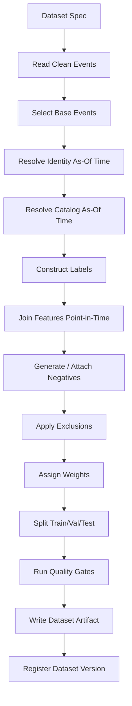

------
title: Build From Scratch Recommendations System - Part 017
description: Membangun training dataset builder production-grade dari nol: base event selection, label window, point-in-time feature join, entity resolution, catalog snapshot, negative sampling, quality gates, dataset versioning, dan lineage.
series: learn-build-from-scratch-recommendations-system
seriesTitle: Build From Scratch: Enterprise Recommendations System
order: 17
partTitle: Training Dataset Builder From Scratch
tags:
  - recommendation-system
  - recsys
  - training-data
  - dataset-builder
  - feature-store
  - mlops
  - series
date: 2026-07-02
---

# Part 017 — Training Dataset Builder From Scratch

Pada titik ini kita sudah punya fondasi:

- event contract,
- identity/session/device model,
- item catalog,
- context model,
- implicit feedback semantics,
- label construction,
- temporal split,
- negative sampling,
- data quality,
- feature contracts.

Sekarang semuanya harus disatukan menjadi satu komponen inti:

> **Training Dataset Builder**

Dataset builder adalah mesin yang mengubah event dunia nyata menjadi dataset yang bisa dipakai untuk melatih model recommendation system.

Kalau dataset builder salah, model akan salah sebelum training dimulai.

Model architecture bisa keren. Feature bisa banyak. GPU bisa mahal. Tetapi jika dataset builder bocor, duplicate, tidak point-in-time, salah negative sampling, salah identity, atau salah label window, hasilnya tetap tidak bisa dipercaya.

Part ini membangun training dataset builder dari nol dengan mental model production-grade.

---

## 1. Mental Model: Dataset Builder Adalah Compiler

Anggap dataset builder seperti compiler.

Input-nya:

```text
raw/clean events
catalog snapshots
identity graph
feature store
label definitions
sampling policy
split policy
quality rules
```

Output-nya:

```text
versioned training dataset
```

Seperti compiler, dataset builder punya pipeline:



Dataset builder bukan satu SQL besar yang sulit dipahami. Ia harus menjadi pipeline yang bisa diuji, diulang, diaudit, dan dikembangkan.

---

## 2. Dataset Spec First

Jangan mulai dari query.

Mulai dari dataset specification.

Contoh:

```yaml
dataset_name: home_feed_ctr_v1
dataset_type: ranking
base_unit: item_impression
surface: home_feed
time_range:
  start: 2026-06-01T00:00:00Z
  end: 2026-07-01T00:00:00Z
prediction_time_field: impression_time

label:
  name: clicked_within_30m
  positive_event: item_click
  join_key: impression_id
  window: 30m
  negative_condition: no_click_within_window
  version: ctr-label-v1

identity:
  resolution_mode: as_of_prediction_time
  version: idres-20260701

catalog:
  join_mode: as_of_prediction_time
  version_policy: scd2

features:
  feature_set: ranker_features_v12
  point_in_time: true

sampling:
  policy: ctr-negative-sampling-v2

exclusions:
  policy: training-exclusion-v4

split:
  policy: temporal-v1

quality_gates:
  policy: dataset-quality-v3
```

Spec membuat dataset builder:

- reproducible,
- reviewable,
- testable,
- versionable,
- portable.

---

## 3. Dataset Builder Invariants

Sebelum menulis pipeline, tetapkan invariants.

```text
Invariant 1: Every example has prediction_time.
Invariant 2: Every feature timestamp <= prediction_time.
Invariant 3: Every label event timestamp is within label window.
Invariant 4: Identity resolution uses graph as-of prediction_time.
Invariant 5: Catalog state uses item state as-of prediction_time.
Invariant 6: Base events are valid and deduplicated.
Invariant 7: Excluded traffic never enters training by default.
Invariant 8: Unknown label is not encoded as negative.
Invariant 9: Sampling policy is versioned.
Invariant 10: Every output row has lineage to source events/spec versions.
```

Kalau invariant ini dilanggar, dataset harus gagal build.

---

## 4. Base Event Selection

Base event menentukan unit prediksi.

Contoh untuk CTR:

```text
base_event = valid item_impression
```

Untuk CVR:

```text
base_event = item_click
```

atau:

```text
base_event = item_impression
```

Untuk sequence:

```text
base_event = target interaction event
```

Untuk enterprise next action:

```text
base_event = action_recommendation_impression
```

Base selection harus eksplisit.

Contoh SQL-ish:

```sql
SELECT
  impression_id,
  event_id AS base_event_id,
  event_time AS prediction_time,
  user_id,
  anonymous_id,
  session_id,
  item_id,
  surface,
  position,
  response_id,
  experiment_assignment_id
FROM clean.item_impressions
WHERE surface = 'home_feed'
  AND event_time >= :start_time
  AND event_time < :end_time
  AND is_valid_impression = true
  AND is_bot_suspected = false
  AND is_internal_user = false;
```

Jangan pilih dari raw event. Base events harus dari clean/curated layer.

---

## 5. Base Event Validity

Item impression valid jika:

```text
event schema valid
item_id present
user/session key present
surface valid
impression definition satisfied
visible duration sufficient
deduped
not bot/internal/test
not tracking incident window
item was eligible enough to be shown
```

Untuk CTR, invalid impression sebaiknya tidak menjadi negative. Jika item tidak benar-benar terlihat, no-click tidak bermakna.

Base validity harus per surface.

Homepage feed, email recommendation, push notification, checkout upsell, dan case workflow punya definisi exposure yang berbeda.

---

## 6. Prediction Time

Setiap example harus punya `prediction_time`.

Biasanya:

```text
item_impression.event_time
```

Untuk click-based CVR:

```text
item_click.event_time
```

Untuk sequence:

```text
target_event_time
```

Untuk batch recommendation:

```text
recommendation_generation_time
```

Prediction time adalah anchor semua time-travel join.

```text
features as of prediction_time
identity as of prediction_time
catalog as of prediction_time
context as of prediction_time
```

Jika tidak ada prediction_time, dataset tidak production-grade.

---

## 7. Identity Resolution Step

Dataset builder harus resolve identity secara temporal.

Input:

```json
{
  "user_id": "u123",
  "anonymous_id": "anon_456",
  "device_id": "dev_789",
  "session_id": "sess_001",
  "prediction_time": "2026-07-02T10:00:00Z"
}
```

Output:

```json
{
  "resolved_subject_type": "authenticated_user",
  "resolved_subject_id": "u123",
  "identity_resolution_version": "idres-20260701",
  "allowed_feature_keys": [
    {
      "type": "user_id",
      "id": "u123",
      "usage": "long_term_profile"
    },
    {
      "type": "session_id",
      "id": "sess_001",
      "usage": "short_term_intent"
    }
  ]
}
```

Untuk training, simpan baik raw keys maupun resolved keys.

Kenapa?

- raw keys menjaga historical trace,
- resolved keys memudahkan feature join,
- version membantu reproducibility.

Jangan rewrite event history tanpa jejak.

---

## 8. Catalog Snapshot Step

Join item state as-of prediction_time.

```sql
SELECT *
FROM item_catalog_scd2 c
WHERE c.item_id = base.item_id
  AND c.valid_from <= base.prediction_time
  AND (c.valid_to IS NULL OR base.prediction_time < c.valid_to)
```

Ambil:

- item_type,
- category,
- item version,
- eligibility state,
- policy state,
- availability state,
- dedup group,
- content version,
- seller/creator,
- quality score as-of time.

Jika catalog state missing:

- exclude,
- mark unknown,
- atau use fallback depending dataset.

Untuk ranking dataset, missing item catalog biasanya high severity.

---

## 9. Context Snapshot Step

Context bisa berasal dari:

- request event,
- response event,
- impression event,
- session state snapshot,
- server enrichment,
- workflow state.

Dataset builder harus membangun context as-of decision.

Example:

```json
{
  "surface": "home_feed",
  "device_type": "mobile",
  "region": "ID-JK",
  "locale": "id-ID",
  "local_hour": 17,
  "session_depth": 5,
  "experiment_assignment_id": "assign_123",
  "candidate_source": "two_tower"
}
```

Context snapshot penting karena model trained with context must see same type of context online.

Jangan join ke current user location, current cart, current case state, atau current policy jika prediction_time masa lalu.

---

## 10. Label Construction Step

Label construction mengikuti spec.

CTR example:

```text
clicked = exists item_click
  where click.impression_id = impression.impression_id
  and click.event_time between impression_time and impression_time + 30m
```

Important:

- use event_time,
- close label window,
- handle late events,
- dedup positive events,
- exclude invalid clicks,
- do not treat pending label as zero.

Output:

```json
{
  "label_name": "clicked_within_30m",
  "label_value": 1,
  "label_observed": true,
  "label_window": "30m",
  "label_version": "ctr-label-v1",
  "positive_event_ids": ["evt_click_001"]
}
```

For no-click:

```json
{
  "label_value": 0,
  "label_observed": true,
  "negative_reason": "no_click_within_closed_window"
}
```

For censored:

```json
{
  "label_value": null,
  "label_observed": false,
  "censor_reason": "tracking_outage"
}
```

---

## 11. Outcome Join

Outcome join harus hati-hati.

### By Impression ID

Best for click:

```text
click.impression_id = impression.impression_id
```

### By User + Item + Window

Common for purchase:

```text
same user
same product family / SKU mapping
purchase within 7d
```

### By Session

Useful for session conversion:

```text
same session_id
```

### By Case/Workflow Entity

Enterprise:

```text
same case_id
same recommended action
case transition within SLA
```

Outcome join harus menyimpan attribution rule.

```json
"attribution": {
  "rule": "last_click_within_7d",
  "version": "attribution-v2"
}
```

---

## 12. Label Maturity

Dataset builder harus memastikan label window selesai.

Example:

```text
dataset build time = Jul 10
purchase window = 7d
base events can go only until Jul 3
```

Spec:

```yaml
label_maturity:
  require_closed_window: true
  max_base_time: build_time - label_window
```

Untuk multi-label dataset dengan return 30d, label maturity bisa jauh lebih lama.

Solusi:

- separate fast labels and delayed labels,
- use null for delayed label not yet mature,
- train separate models,
- build corrected dataset later.

---

## 13. Point-in-Time Feature Join

Feature join adalah bagian paling rawan leakage.

Pattern:

```text
for each example:
  for each feature:
    select latest feature where feature_timestamp <= prediction_time
```

Conceptual SQL:

```sql
SELECT base.example_id, f.value
FROM base_examples base
LEFT JOIN user_features f
  ON f.user_id = base.user_id
 AND f.feature_timestamp <= base.prediction_time
QUALIFY ROW_NUMBER() OVER (
  PARTITION BY base.example_id
  ORDER BY f.feature_timestamp DESC
) = 1;
```

Untuk skala besar, implementasi bisa memakai feature store, temporal join engine, atau batch optimized table. Tetapi semantic-nya harus sama.

---

## 14. Feature Join Types

### 14.1 User Feature Join

Key:

```text
user_id / anonymous_id / session_id / household_id / tenant_id
```

As-of time:

```text
prediction_time
```

### 14.2 Item Feature Join

Key:

```text
item_id
```

As-of time:

```text
prediction_time
```

### 14.3 Context Feature Join

Key:

```text
surface, region, device, query, case_id
```

May be computed from request snapshot.

### 14.4 Cross Feature Join

Key:

```text
user_id + item_id
user_id + category_id
session_id + item_id
case_id + action_id
```

Cross features can be expensive.

### 14.5 Embedding Join

Key:

```text
entity_id + embedding_model_version
```

Ensure embedding training cutoff <= prediction_time if interaction-trained.

---

## 15. Feature Freshness Validation

Feature timestamp <= prediction_time is necessary but not sufficient.

Feature can be too stale.

Example:

```text
stock feature from 2 days ago
```

Maybe invalid for e-commerce serving.

Check:

```text
prediction_time - feature_timestamp <= freshness_sla
```

If stale:

- use fallback,
- mark stale,
- exclude example,
- or keep with staleness indicator depending feature.

Output should include:

```json
{
  "feature_staleness": {
    "item_stock_state": "45s",
    "session_recent_clicks": "3s",
    "user_long_term_embedding": "12h"
  }
}
```

At minimum, quality report should track staleness distribution.

---

## 16. Negative Generation Step

For ranking CTR, negatives may already be base examples with label 0.

For retrieval/two-tower, generate negatives.

Input:

```text
positive user-item pairs
catalog as-of prediction_time
eligibility filters
known user positives as-of time
sampling policy
```

Output:

```json
{
  "query_id": "u123_at_2026_07_02_10_00",
  "positive_item_id": "item_101",
  "negative_item_id": "item_999",
  "negative_type": "same_category_sampled",
  "negative_weight": 0.2,
  "sampling_policy": "retrieval-negatives-v1"
}
```

Negative sampler must be point-in-time safe:

```text
negative item must exist and be eligible as-of prediction_time
```

Jangan sample item yang belum ada pada saat itu.

---

## 17. Exclusion Step

Exclusion rules should be centralized and versioned.

Examples:

```yaml
exclude:
  - bot_suspected_high
  - internal_user
  - test_traffic
  - invalid_impression
  - duplicate_event
  - tracking_incident_window
  - missing_required_feature
  - item_policy_blocked_at_prediction_time
  - no_personalization_consent
```

Output should track counts by exclusion reason.

```text
base events: 100,000,000
excluded invalid impression: 1,200,000
excluded bot/internal: 430,000
excluded incident window: 5,000,000
remaining: 93,370,000
```

Sudden changes in exclusion counts are data incidents.

---

## 18. Weight Assignment

Weights can reflect:

- feedback strength,
- negative confidence,
- sampling probability,
- class imbalance,
- business value,
- recency,
- segment balancing,
- propensity correction.

Example:

```json
{
  "example_weight": 0.2,
  "weight_policy": "ctr-weight-v2",
  "weight_components": {
    "label_confidence": 0.2,
    "sampling_correction": 1.0,
    "segment_weight": 1.0
  }
}
```

Avoid magic weights hidden in training code. Put them in dataset builder spec.

---

## 19. Split Assignment

Split should be deterministic.

For temporal split:

```text
if prediction_time < train_end -> train
elif prediction_time < validation_end -> validation
else -> test
```

For retrieval sequence or session-level data, ensure session boundary logic.

Output:

```json
{
  "split": "train",
  "split_policy": "temporal-v1"
}
```

For rolling evaluation, output fold IDs.

```json
{
  "fold_id": "fold_2026_06_01",
  "split": "validation"
}
```

---

## 20. Dataset Quality Gates

Before writing final dataset, run gates.

### Count Gates

```text
row count within expected range
positive rate within expected range
negative/positive ratio valid
```

### Time Gates

```text
no feature_timestamp > prediction_time
label windows closed
no train/test overlap by time
```

### Join Gates

```text
catalog join rate > threshold
feature join rate > threshold
click-impression join rate valid
```

### Distribution Gates

```text
surface distribution
category distribution
device distribution
position distribution
feature null distribution
```

### Leakage Gates

```text
future feature timestamp check
identity edge valid_from check
catalog valid_from check
embedding cutoff check
```

If critical gate fails, dataset build fails.

---

## 21. Dataset Artifact Format

Dataset output should be partitioned and versioned.

Example path:

```text
/datasets/home_feed_ctr_v1/version=20260702_001/split=train/date=2026-06-01/part-000.parquet
```

Recommended metadata:

```json
{
  "dataset_name": "home_feed_ctr_v1",
  "dataset_version": "20260702_001",
  "created_at": "2026-07-02T02:00:00Z",
  "spec_hash": "sha256:...",
  "row_count": 92370000,
  "label_positive_rate": 0.034,
  "feature_set_version": "ranker-features-v12",
  "label_version": "ctr-label-v1",
  "split_policy": "temporal-v1"
}
```

Even if file format changes, dataset metadata must remain stable.

---

## 22. Lineage

Every row should have lineage.

Minimal:

```json
{
  "example_id": "ex_001",
  "base_event_id": "evt_imp_001",
  "positive_event_ids": ["evt_click_001"],
  "request_id": "req_001",
  "response_id": "resp_001",
  "feature_snapshot_refs": {
    "user_features": "user-fv-v12:2026-07-02T09:45:00Z",
    "item_features": "item-fv-v9:2026-07-02T09:00:00Z"
  },
  "dataset_spec_version": "home-feed-ctr-spec-v1"
}
```

Lineage enables:

- debugging bad examples,
- reproducing model,
- audit,
- data incident impact analysis,
- feature dependency tracking.

---

## 23. Dataset Registry

Dataset registry records dataset artifacts.

Fields:

```yaml
dataset_name: home_feed_ctr_v1
dataset_version: 20260702_001
status: validated
storage_path: /datasets/home_feed_ctr_v1/version=20260702_001
spec_hash: ...
created_by: dataset-builder-1.4.0
created_at: 2026-07-02T02:00:00Z
time_range:
  start: 2026-06-01T00:00:00Z
  end: 2026-07-01T00:00:00Z
quality_report_path: ...
lineage:
  event_tables:
    - clean.item_impressions@version
    - clean.item_clicks@version
  feature_views:
    - user_behavior_7d@v3
    - item_quality@v2
```

Model registry should reference dataset version. Model without dataset lineage is incomplete.

---

## 24. Debugging a Single Example

Given example ID, engineer should be able to reconstruct:

```text
Why is this label 0?
Was item actually visible?
Was click late?
Was user bot?
What catalog state was used?
Which features were joined?
Were any features missing/stale?
Which negative sampler selected this item?
Which split assigned it?
```

Build CLI/debug endpoint:

```text
dataset-debug --dataset home_feed_ctr_v1 --version 20260702_001 --example ex_001
```

Output:

```text
Base event: item_impression evt_imp_001
Prediction time: 2026-07-02 10:00:00Z
Label: 0, no click within 30m
Window closed: yes
Features:
  user_category_click_affinity_7d = {...}, timestamp 09:45
  item_quality_score = 0.82, timestamp 08:00
Catalog:
  item active, policy approved, category camera
Exclusions:
  none
```

This is not luxury. It is how production ML becomes debuggable.

---

## 25. Batch vs Streaming Dataset Builder

### Batch Builder

Good for:

- large training dataset,
- reproducibility,
- point-in-time joins,
- delayed labels,
- quality gates.

### Streaming/Nearline Builder

Good for:

- online learning,
- fast updates,
- near-real-time training,
- incremental examples.

Most systems start with batch builder, then add streaming for selected use cases.

Hybrid:

```text
batch truth
+ nearline incremental examples
+ periodic reconciliation
```

Be careful: streaming examples are more vulnerable to late/corrected labels.

---

## 26. Incremental Builds

Full rebuild can be expensive.

Incremental build:

```text
build only new day/hour
append partition
update dataset registry
```

But corrections/late events may require backfill.

Strategy:

- immutable raw data,
- partitioned clean data,
- rebuild affected partitions,
- version dataset,
- maintain correction policy.

For delayed labels:

```text
daily build examples whose label windows just closed
```

Example:

```text
On Jul 10, build purchase_7d labels for base events from Jul 3.
```

---

## 27. Handling Data Incidents

Dataset builder should read incident table.

```yaml
incident:
  id: data-incident-20260702-android-click-dup
  affected_event: item_click
  start: 2026-07-02T08:00:00Z
  end: 2026-07-02T12:30:00Z
  action:
    - exclude_from_training
```

During build:

```text
if event_time in incident window and affected conditions match:
    exclude or flag
```

Quality report should show incident impact.

---

## 28. Implementation Skeleton

A conceptual Java-ish structure:

```java
public final class DatasetBuilder {
    private final DatasetSpec spec;
    private final BaseEventReader baseEventReader;
    private final IdentityResolver identityResolver;
    private final CatalogSnapshotJoiner catalogJoiner;
    private final LabelBuilder labelBuilder;
    private final FeatureJoiner featureJoiner;
    private final NegativeSampler negativeSampler;
    private final ExclusionPolicy exclusionPolicy;
    private final WeightAssigner weightAssigner;
    private final SplitAssigner splitAssigner;
    private final QualityGateRunner qualityGateRunner;
    private final DatasetWriter datasetWriter;
    private final DatasetRegistry registry;

    public DatasetBuildResult build() {
        var base = baseEventReader.read(spec);
        var withIdentity = identityResolver.resolve(base, spec.identity());
        var withCatalog = catalogJoiner.join(withIdentity, spec.catalog());
        var labeled = labelBuilder.build(withCatalog, spec.label());
        var featured = featureJoiner.join(labeled, spec.features());
        var sampled = negativeSampler.applyIfNeeded(featured, spec.sampling());
        var filtered = exclusionPolicy.apply(sampled, spec.exclusions());
        var weighted = weightAssigner.assign(filtered, spec.weights());
        var split = splitAssigner.assign(weighted, spec.split());

        var report = qualityGateRunner.validate(split, spec.qualityGates());
        if (!report.passed()) {
            throw new DatasetQualityException(report);
        }

        var artifact = datasetWriter.write(split, spec);
        registry.register(artifact, report);
        return new DatasetBuildResult(artifact, report);
    }
}
```

The actual implementation may use Spark, Flink, Beam, SQL, or custom batch jobs. The architecture remains the same.

---

## 29. Dataset Spec as Code

Store specs in version control.

Example repository:

```text
datasets/
  home_feed_ctr_v1.yaml
  product_detail_cvr_v1.yaml
  retrieval_two_tower_v1.yaml
  case_next_action_v1.yaml
quality_policies/
  dataset_quality_v3.yaml
sampling_policies/
  retrieval_negatives_v1.yaml
label_policies/
  ctr_label_v1.yaml
```

Code review for dataset spec should check:

- label definition,
- leakage risks,
- exclusion policy,
- feature set,
- sampling policy,
- split policy,
- privacy/consent,
- quality gates.

---

## 30. Testing Dataset Builder

Test levels:

### Unit Tests

- label window logic,
- event dedup,
- identity as-of resolution,
- catalog SCD join,
- negative sampler filters,
- weight calculation.

### Contract Tests

- input event schema compatibility,
- feature contract compatibility,
- dataset spec validity.

### Golden Dataset Tests

Small fixed input -> expected output rows.

### Leakage Tests

Artificial future feature should be rejected.

### Backfill Tests

Historical period builds reproducibly.

### Quality Gate Tests

Broken dataset fails.

Dataset builder needs tests like production code.

---

## 31. Golden Dataset Example

Small input:

```text
impression imp1 at 10:00 item A
click imp1 at 10:05
impression imp2 at 10:00 item B
no click
feature user_click_count at 09:59 = 3
feature user_click_count at 10:01 = 4
```

Expected:

```text
example imp1 label=1 feature=3
example imp2 label=0 feature=3
```

If builder uses feature=4, leakage test fails.

Golden tests catch subtle bugs.

---

## 32. Privacy and Consent

Dataset builder must respect consent and purpose.

If user consent does not allow personalization:

- exclude from personalized training,
- or only use anonymized/aggregated data if allowed,
- or train non-personalized model depending policy.

Spec should include:

```yaml
privacy:
  purpose: personalization
  require_consent: true
  data_retention: 180d
  delete_subject_data: supported
```

For multi-tenant enterprise:

```yaml
tenant_isolation:
  mode: strict
  cross_tenant_aggregation: false
```

Dataset builder must not accidentally aggregate tenant-confidential data.

---

## 33. Dataset Builder Observability

Monitor builder jobs:

```text
build_duration
input_row_count
output_row_count
exclusion_count_by_reason
label_positive_rate
feature_join_rate
feature_null_rate
quality_gate_failures
partition_lag
late_event_correction_count
sampling_distribution
split_distribution
```

Alert:

- build failed,
- row count abnormal,
- positive rate abnormal,
- feature join rate drops,
- quality gates fail,
- output not registered.

Training pipeline should not proceed if dataset is invalid.

---

## 34. Common Dataset Builder Anti-Patterns

### 34.1 One Giant SQL Query

Impossible to test and reason about.

### 34.2 Current State Joins

Catalog/user/feature current state leaks into historical examples.

### 34.3 Label Logic Hidden in Notebook

No versioning, no review.

### 34.4 Silent Null Fill

Missing feature becomes zero without reason.

### 34.5 No Example Lineage

Bad examples cannot be debugged.

### 34.6 No Quality Gates

Broken data trains model.

### 34.7 No Dataset Registry

Model cannot be reproduced.

### 34.8 Sampling in Training Code Only

Dataset and model become inseparable.

### 34.9 Ignoring Data Incidents

Tracking bugs become ground truth.

### 34.10 No Golden Tests

Pipeline can regress silently.

---

## 35. Minimal Production Dataset Builder Plan

Build these first:

### 35.1 Ranking CTR Dataset

```text
base: valid item impressions
label: click within 30m
features: user/item/context/cross point-in-time
negatives: no-click impressions with low weight
split: temporal
```

### 35.2 Retrieval Dataset

```text
base: positive interactions
positive: purchase/add-to-cart/meaningful click
negatives: in-batch + sampled eligible items
features: user/session/item embeddings
split: temporal
```

### 35.3 Conversion Dataset

```text
base: click or impression
label: add-to-cart/purchase within window
censored: unavailable/tracking outage
split: temporal
```

Implement:

- specs as code,
- quality gates,
- lineage,
- registry,
- golden tests,
- incident exclusion,
- point-in-time joins.

---

## 36. Checklist Dataset Builder Readiness

```text
[ ] Dataset spec exists and is versioned.
[ ] Base event is explicit.
[ ] Prediction time is explicit.
[ ] Label definition is explicit.
[ ] Label window is closed or label is marked pending.
[ ] Identity resolution is as-of prediction time.
[ ] Catalog join is as-of prediction time.
[ ] Feature join is point-in-time.
[ ] Feature freshness is validated.
[ ] Negative sampling policy is versioned.
[ ] Exclusion policy is versioned.
[ ] Weighting policy is versioned.
[ ] Split policy is deterministic and temporal.
[ ] Bot/internal/test traffic is excluded by default.
[ ] Data incident windows are handled.
[ ] Unknown/censored labels are not encoded as zero.
[ ] Every row has lineage.
[ ] Dataset artifact is versioned.
[ ] Dataset registry records metadata.
[ ] Quality gates run before training.
[ ] Golden tests exist.
[ ] Leakage tests exist.
[ ] Privacy/consent rules are enforced.
```

---

## 37. Kesimpulan

Training dataset builder adalah jantung learning system.

Ia bukan sekadar ETL. Ia adalah compiler yang mengubah real-world behavior menjadi learning signal yang bisa dipercaya.

Prinsip utama:

1. Dataset harus dimulai dari spec.
2. Prediction time adalah anchor semua join.
3. Label, identity, catalog, dan feature harus temporal.
4. Unknown/censored bukan negative.
5. Sampling, weighting, exclusions, dan splits harus versioned.
6. Quality gates harus bisa menggagalkan build.
7. Lineage harus membuat setiap example debuggable.
8. Dataset artifact harus masuk registry.
9. Dataset builder harus diuji seperti production code.
10. Model tanpa dataset lineage tidak bisa dipercaya.

Part ini menutup Module 2: fondasi data recommendation system.

Di Part 018, kita mulai Module 3: **Popularity, Trending, and Editorial Baselines**. Sebelum model kompleks, kita harus membangun baseline yang kuat, sederhana, explainable, dan tahan failure.
