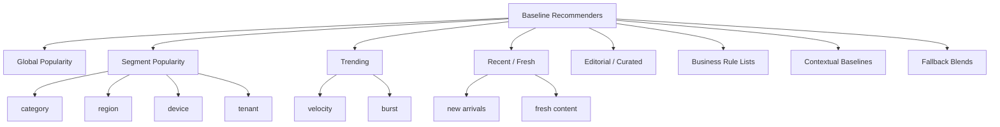
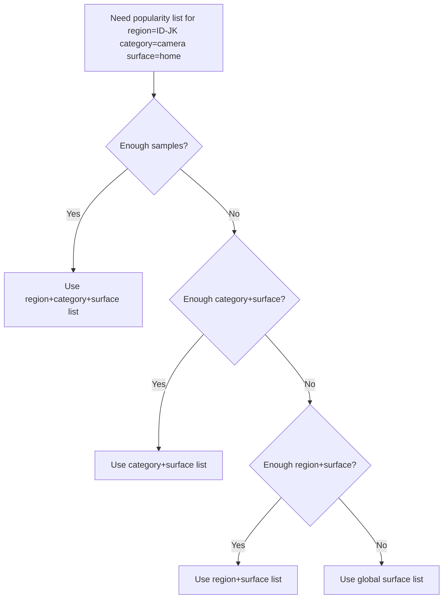
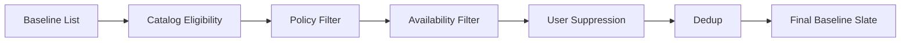
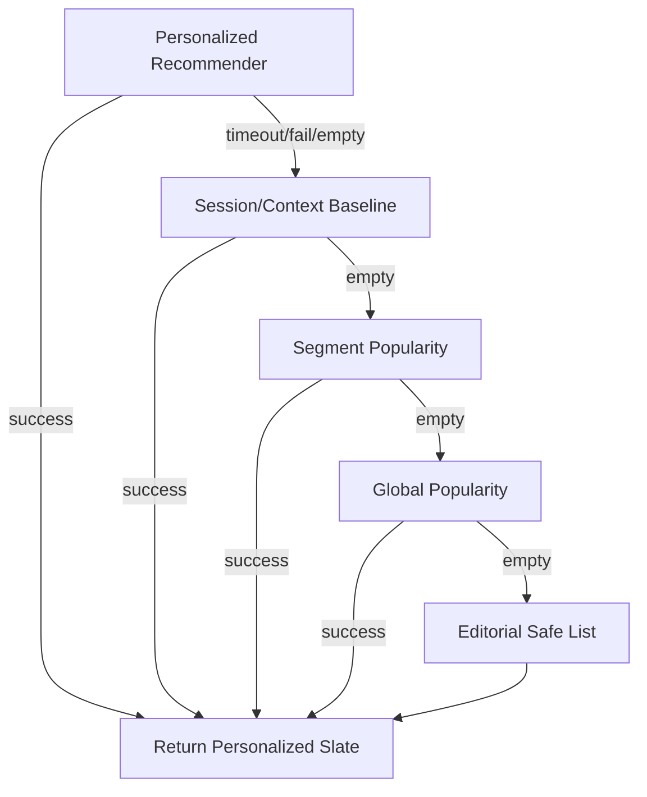
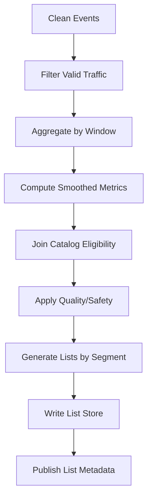

------
title: Build From Scratch Recommendations System - Part 018
description: Membangun baseline recommender production-grade: popularity, trending, recency decay, editorial curation, segment popularity, fallback hierarchy, cold-start baseline, guardrails, dan observability.
series: learn-build-from-scratch-recommendations-system
seriesTitle: Build From Scratch: Enterprise Recommendations System
order: 18
partTitle: Popularity, Trending, and Editorial Baselines
tags:
  - recommendation-system
  - recsys
  - baseline
  - popularity
  - trending
  - system-design
  - series
date: 2026-07-02
---

# Part 018 — Popularity, Trending, and Editorial Baselines

Sebelum membangun collaborative filtering, matrix factorization, graph recommendation, two-tower retrieval, deep ranker, atau bandit, bangun baseline yang benar.

Baseline bukan mainan.

Dalam production recommendation system, baseline adalah:

- pembanding model kompleks,
- fallback saat personalization gagal,
- cold-start solution,
- safety net saat feature/model down,
- debugging reference,
- launch strategy,
- explainable recommendation source,
- guardrail terhadap sistem terlalu pintar tapi rapuh.

Banyak sistem buruk karena langsung lompat ke model canggih tanpa baseline yang sehat. Akibatnya, ketika model turun performa, tidak ada fallback yang layak. Ketika A/B test naik 1%, tidak jelas apakah mengalahkan baseline kuat atau hanya mengalahkan sistem asal-asalan.

Part ini membangun baseline recommender production-grade: popularity, trending, recency decay, editorial curation, segment popularity, contextual baseline, fallback hierarchy, dan observability.

---

## 1. Mental Model: Baseline Adalah Control System

Baseline menjawab pertanyaan:

> “Jika kita tidak tahu banyak tentang user, apa rekomendasi aman dan cukup bagus yang bisa kita berikan?”

Baseline tidak harus personalized penuh. Tetapi harus:

- valid,
- available,
- policy-safe,
- fresh,
- non-duplicate,
- reasonable,
- explainable,
- low-latency,
- observable.

Baseline juga menjadi control dalam experiment:

```text
new model must beat strong baseline, not random list
```

Baseline yang baik membuat sistem lebih robust.

---

## 2. Why Baselines Matter

### 2.1 Cold Start

User baru belum punya history. Item baru belum punya interactions. Baseline menyediakan starting point.

### 2.2 Failure Fallback

Jika user feature store down, ranker timeout, vector index stale, atau model unavailable, baseline tetap bisa melayani.

### 2.3 Debugging

Jika personalized result buruk, bandingkan dengan popularity/trending baseline.

### 2.4 Product Safety

Baseline bisa lebih aman daripada model yang belum matang.

### 2.5 Evaluation Reference

Model kompleks harus mengalahkan:

- global popularity,
- segment popularity,
- item-to-item baseline,
- editorial baseline,
- trending baseline.

Jika tidak, kompleksitasnya belum layak.

---

## 3. Baseline Types



Baseline bisa digabung menjadi multi-source candidate generator.

---

## 4. Global Popularity Baseline

Paling sederhana:

```text
recommend top items by popularity
```

Popularity metric bisa:

- impressions,
- clicks,
- purchases,
- watch completions,
- add-to-cart,
- saves,
- rating,
- revenue,
- successful case usage.

Jangan pakai raw count tanpa denominator.

Bad:

```text
popular_score = click_count_7d
```

Better:

```text
popular_score = smoothed_ctr_7d * quality_weight * availability_weight
```

Atau e-commerce:

```text
popular_score =
  smoothed_purchase_rate_7d
  * item_quality_score
  * availability_score
  * margin_or_business_weight
```

Global popularity harus difilter oleh eligibility per context.

---

## 5. Popularity Denominator

Popularity count perlu denominator.

Examples:

```text
CTR = clicks / impressions
CVR = purchases / clicks
Purchase rate = purchases / impressions
Completion rate = completions / watch_starts
Save rate = saves / impressions
Hide rate = hides / impressions
Report rate = reports / impressions
```

Raw clicks bias terhadap exposure besar.

Item yang ditampilkan banyak akan mendapat click banyak.

Popularity score harus memikirkan:

- exposure,
- position,
- recency,
- item age,
- surface,
- segment,
- bot/internal filtering.

---

## 6. Bayesian / Smoothed Popularity

Item dengan 1 click dari 1 impression punya CTR 100%, tetapi belum tentu lebih baik dari item dengan 10,000 clicks dari 200,000 impressions.

Gunakan smoothing.

Simple Bayesian smoothing:

```text
smoothed_ctr =
  (clicks + prior_ctr * prior_weight)
  / (impressions + prior_weight)
```

Example:

```text
prior_ctr = category average CTR
prior_weight = 100 impressions
```

Benefits:

- avoids overpromoting tiny-sample items,
- helps cold items,
- more stable.

For ratings:

```text
smoothed_rating =
  (rating_sum + global_avg * prior_weight)
  / (rating_count + prior_weight)
```

Smoothing is baseline superpower.

---

## 7. Recency Decay

Popularity lama tidak selalu relevan.

Use recency decay:

```text
score = sum(event_weight * exp(-lambda * age))
```

Or windowed counts:

```text
clicks_1h
clicks_24h
clicks_7d
clicks_30d
```

Combine:

```text
popularity_score =
  0.5 * smoothed_ctr_24h
  + 0.3 * smoothed_ctr_7d
  + 0.2 * smoothed_ctr_30d
```

Domain-specific:

- news: hours matter,
- video/social: hours/days,
- e-commerce: days/weeks,
- books/courses: weeks/months,
- enterprise knowledge articles: validity and success rate matter more than recency.

---

## 8. Trending Baseline

Trending is not the same as popular.

Popular:

```text
high total engagement
```

Trending:

```text
engagement increasing faster than expected
```

Example score:

```text
trend_score =
  recent_rate / baseline_rate
```

More robust:

```text
trend_score =
  zscore(recent_engagement_rate compared to historical baseline)
```

Or:

```text
trend_score =
  decayed_recent_events
  / expected_events_for_item_segment
```

Trending should handle:

- small sample smoothing,
- bot/fraud filtering,
- region/local trends,
- category trends,
- time-of-day seasonality,
- item age,
- safety/quality.

Raw velocity can be manipulated.

---

## 9. Trending Windows

Use multiple windows.

```text
trend_15m
trend_1h
trend_6h
trend_24h
```

For each item:

```text
recent = events in last 1h
baseline = average hourly events over last 7d
trend = recent / (baseline + smoothing)
```

But new items have no baseline. Use category prior.

Example:

```text
trend_score =
  (recent_clicks_1h + prior_recent)
  / (expected_clicks_1h + prior_expected)
```

Trending should not blindly promote unsafe or low-quality content.

---

## 10. Segment Popularity

Global popularity ignores context.

Better:

```text
popular in user's region
popular in category
popular among similar segment
popular for surface
popular for device
popular for tenant
popular for role
```

Examples:

```text
top_products_by_region_category
top_videos_by_language_topic
top_articles_by_locale_section
top_actions_by_case_state_role
top_knowledge_articles_by_jurisdiction_role
```

Segment popularity is simple but powerful.

For cold user in Jakarta browsing camera category:

```text
popular products in camera category in ID-JK
```

will beat global generic items.

---

## 11. Segment Granularity Trade-off

Too broad:

```text
global popular
```

Not personalized enough.

Too narrow:

```text
popular among mobile users in South Jakarta who viewed camera at 5pm and use app v6
```

Data sparse.

Use hierarchy.

```text
region + category + surface
fallback to category + surface
fallback to region + surface
fallback to surface
fallback to global
```

This is hierarchical fallback.

---

## 12. Hierarchical Popularity Fallback

Example:



Threshold:

```text
min_impressions = 1000
min_unique_users = 100
min_items = 50
```

Fallback should be explicit and logged.

---

## 13. Editorial Baseline

Editorial/curated lists are not anti-ML. They are essential.

Use cases:

- launch new surface,
- safety-sensitive content,
- campaign,
- seasonal collection,
- high-stakes enterprise recommendation,
- regulatory knowledge articles,
- cold-start catalog,
- human-approved recommendations,
- brand-sensitive surfaces.

Editorial list contract:

```yaml
list_id: home_feed_editorial_id_202607
surface: home_feed
region: ID
valid_from: 2026-07-01T00:00:00Z
valid_until: 2026-07-31T23:59:59Z
items:
  - item_101
  - item_205
constraints:
  require_item_still_eligible: true
  allow_rerank: false
owner: editorial-team
```

Editorial does not bypass eligibility. Items still need policy/availability checks.

---

## 14. Business Rule Lists

Examples:

- new arrivals,
- best sellers,
- clearance,
- back in stock,
- top rated,
- staff picks,
- trending near you,
- popular in your category,
- recently updated policy articles,
- required next actions.

Rule lists are baseline candidate sources.

Important: label them honestly.

```text
recommended because: best seller
recommended because: new arrival
recommended because: required for current case state
```

Rule lists should have owner, validity, metric, and guardrails.

---

## 15. Freshness Baseline

For some domains, freshness itself is valuable.

Examples:

- latest news,
- new videos,
- new products,
- new jobs,
- new knowledge articles,
- updated policy documents.

Simple score:

```text
freshness_score = exp(-lambda * age_since_published)
```

But pure freshness is risky. New does not mean good.

Combine:

```text
fresh_score =
  freshness_decay
  * quality_prior
  * eligibility
  * category_match
```

For cold-start item exploration, freshness baseline can provide controlled exposure.

---

## 16. Quality-Aware Baseline

Popularity should be adjusted by quality.

E-commerce:

```text
quality =
  rating_score
  * low_return_score
  * seller_reliability
  * content_completeness
```

Content:

```text
quality =
  completion_rate
  * low_report_rate
  * creator_trust
  * editorial_score
```

Enterprise:

```text
quality =
  success_rate
  * policy_validity
  * expert_approval
  * low_reversal_rate
```

Baseline score:

```text
baseline_score =
  popularity_component
  * quality_component
  * freshness_component
  * availability_component
```

Use hard filters for severe policy/safety.

---

## 17. Safety and Policy Guardrails

Baseline must filter:

- deleted item,
- banned item,
- out-of-stock if required,
- wrong region,
- wrong age rating,
- unauthorized enterprise entity,
- blocked creator/seller,
- hidden by user,
- duplicate group,
- expired campaign,
- invalid surface.

Pipeline:



Never assume baseline lists are safe because they are simple.

---

## 18. Baseline API Contract

Baseline recommender can be a service/source.

Request:

```json
{
  "surface": "home_feed",
  "context": {
    "region": "ID-JK",
    "locale": "id-ID",
    "device_type": "mobile",
    "category_hint": "camera"
  },
  "subject": {
    "user_id": "u123",
    "session_id": "sess_001"
  },
  "limit": 50,
  "fallback_allowed": true
}
```

Response:

```json
{
  "source": "segment_popularity",
  "source_version": "popularity-v3",
  "items": [
    {
      "item_id": "item_101",
      "score": 0.87,
      "reason": "popular_in_camera_ID-JK",
      "features": {
        "smoothed_ctr_7d": 0.042,
        "quality_score": 0.91
      }
    }
  ],
  "fallback_level": "region_category_surface"
}
```

Log source and fallback level.

---

## 19. Baseline Storage

Precompute baseline lists.

Examples:

```text
global_popular_by_surface
popular_by_region_surface
popular_by_category_surface
popular_by_region_category_surface
trending_by_region_category
editorial_lists
new_arrivals_by_category
top_rated_by_category
```

Store with metadata:

```json
{
  "list_key": "popular:home_feed:ID-JK:camera",
  "generated_at": "2026-07-02T10:00:00Z",
  "valid_until": "2026-07-02T11:00:00Z",
  "items": [...]
}
```

Lists should be regenerated periodically and invalidated by critical catalog/policy changes.

---

## 20. Baseline Refresh Cadence

Different lists need different refresh.

| List | Refresh |
|---|---|
| global best sellers | hourly/daily |
| trending 1h | minutes |
| new arrivals | minutes/hourly |
| editorial | manual/versioned |
| top rated | daily |
| stock-aware popular | minutes |
| enterprise policy articles | on publish/update |
| case next actions | rule/policy driven |

Refresh faster is not always better. Cost and stability matter.

---

## 21. Baseline Candidate Mixing

Baseline can be a source in multi-source generation.

Example:

```yaml
candidate_mix:
  personalized_two_tower: 60%
  segment_popularity: 20%
  trending: 10%
  editorial: 10%
```

For cold user:

```yaml
candidate_mix:
  segment_popularity: 40%
  trending: 20%
  editorial: 20%
  fresh_exploration: 20%
```

For fallback:

```yaml
candidate_mix:
  segment_popularity: 70%
  editorial_safe: 30%
```

Mix should be surface-specific.

---

## 22. Baseline as Fallback Hierarchy

Fallback hierarchy example:



Fallback reasons:

- feature store timeout,
- retrieval empty,
- ranker timeout,
- policy filters removed all,
- user has no consent,
- anonymous cold start,
- vector index unavailable,
- catalog projection down.

Log fallback reason.

---

## 23. Contextual Baselines

A strong baseline uses context.

Examples:

### Product Detail Page

```text
popular items in same category
top co-viewed items
top accessories by seed category
```

### Cart

```text
frequently bought with cart categories
top accessories in cart category
low-return add-ons
```

### Search Zero Result

```text
popular items matching relaxed query/category
top categories for query tokens
```

### Video Next-Up

```text
popular videos from same topic/creator
trending in language/topic
```

### Enterprise Case

```text
most successful next actions for case_state + risk_level + jurisdiction + role
approved knowledge articles for case topic
```

Contextual baseline often beats poorly trained personalization.

---

## 24. Enterprise Baselines

For regulatory/case systems, baseline must be deterministic and defensible.

Examples:

```text
valid next actions by state machine priority
most used knowledge articles for case type
policy-required checklist items
similar resolved cases by rule-based attributes
SLA-based escalation suggestions
```

Important constraints:

- action must be valid for current state,
- actor must have permission,
- jurisdiction policy must match,
- recommendation must be explainable,
- audit log required,
- high-risk actions require confirmation.

Baseline score might be:

```text
priority_score =
  policy_required_weight
  + sla_urgency_weight
  + historical_success_rate
  + expert_curated_weight
```

This is not “less advanced”. In high-stakes domains, rule+baseline systems are often necessary.

---

## 25. Deduplication in Baselines

Popularity lists often contain duplicates:

- same product family,
- multiple SKUs,
- same article syndicated,
- same creator repeated,
- same topic repeated.

Dedup rules:

```text
max 1 item per dedup_group per slate
max N items per creator
max N items per seller
max N items per category cluster
```

Baseline output should be slate-safe.

If dedup removes too many items, fallback to broader list.

---

## 26. Diversity in Baselines

Pure popularity can be monotonous.

Add diversity:

```text
category diversity
creator diversity
brand diversity
price diversity
topic diversity
freshness diversity
seller diversity
```

Simple algorithm:

```text
iterate sorted list
add item if it does not violate diversity constraints
continue until limit
fallback if insufficient
```

Example constraint:

```yaml
diversity:
  max_per_category: 3
  max_per_creator: 2
  max_per_dedup_group: 1
```

Baseline diversity is cheap and effective.

---

## 27. Fresh Exploration Slot

Baseline can allocate exploration slots.

Example:

```yaml
slate_size: 20
slots:
  popularity: 14
  trending: 3
  new_items: 2
  editorial: 1
```

New item exploration helps collect data.

Guardrails:

- quality minimum,
- policy approved,
- eligible,
- exposure cap,
- monitor hide/report,
- stop if negative signal high.

Exploration should be logged:

```json
"reason": "new_item_exploration",
"exploration_policy": "new-item-quota-v1"
```

---

## 28. Baseline Observability

Track:

```text
baseline_request_count
baseline_empty_rate
fallback_level_distribution
source_contribution
item_coverage
category_coverage
dedup_filter_rate
policy_filter_rate
availability_filter_rate
stale_list_rate
list_generation_lag
CTR/CVR by baseline source
hide/report rate by baseline source
```

For fallback:

```text
personalized_failed -> segment_popularity used
ranker_timeout -> global_popular used
```

If fallback usage spikes, personalized system is unhealthy.

---

## 29. Baseline Quality Metrics

Offline:

- HitRate@K,
- Recall@K,
- NDCG@K,
- CTR/CVR historical replay,
- coverage,
- diversity,
- freshness,
- long-tail exposure,
- safety filter rate.

Online:

- CTR,
- conversion,
- hide/report,
- retention,
- session continuation,
- fallback satisfaction,
- latency,
- empty result rate.

Compare model against baseline per surface and segment.

---

## 30. Baseline Latency

Baseline should be fast.

Serving pattern:

- precompute lists,
- store in low-latency KV/cache,
- fetch by context key,
- apply online eligibility/suppression,
- return.

Latency budget example:

```text
baseline list fetch: 5ms
eligibility/suppression: 20ms
dedup/diversity: 5ms
total: <50ms
```

If baseline is fallback during incident, it must not depend on same broken components as primary path.

Avoid baseline depending on ranker model or feature store that might be down.

---

## 31. Baseline Resilience

Baseline should degrade gracefully.

If regional list missing:

```text
region+category -> category -> region -> global -> editorial
```

If catalog lookup slow:

- use cached eligibility for non-critical,
- fail closed for policy-critical,
- reduce list length,
- fallback safe editorial.

If trending job stale:

- use last valid list if within TTL,
- else fallback popularity.

If editorial list expired:

- do not use unless marked evergreen,
- fallback safe global.

---

## 32. Baseline and Personalization

Baseline can be personalized lightly.

Examples:

- choose segment list based on user's top category,
- filter seen/purchased/hidden items,
- apply price bucket preference,
- choose locale/region,
- use session category hint.

This is not full ML but often powerful.

Example:

```text
if user recent session category = camera:
    use popular_in_camera_region
else:
    use popular_by_user_top_category
```

Light personalization is cheap and explainable.

---

## 33. Baseline for No-Consent Users

If personalization consent missing, baseline still can serve contextual/non-personal recommendations.

Allowed signals may include:

- surface,
- region if allowed,
- language/locale,
- current item seed,
- current query,
- generic popularity,
- editorial list.

Do not use behavioral user history if consent disallows.

Baseline is essential for privacy-aware product experience.

---

## 34. Baseline Configuration

Use config, not hardcoded logic.

```yaml
surface: home_feed
baseline_policy: home-baseline-v3
sources:
  - name: segment_popularity
    weight: 0.5
    key_template: "popular:{surface}:{region}:{category_hint}"
    min_items: 20
  - name: trending
    weight: 0.2
    key_template: "trending:{region}:{category_hint}"
  - name: editorial
    weight: 0.1
    list_id: "home_editorial_id_202607"
  - name: new_arrivals
    weight: 0.2
filters:
  - eligibility
  - availability
  - user_suppression
  - dedup
diversity:
  max_per_category: 4
  max_per_creator: 2
fallback:
  - popular:{surface}:{region}
  - popular:{surface}:global
  - editorial_safe:{surface}:{region}
```

Policy version should be logged.

---

## 35. Baseline Implementation Sketch

Conceptual service:

```java
public final class BaselineRecommendationService {
    private final BaselinePolicyRegistry policyRegistry;
    private final BaselineListStore listStore;
    private final EligibilityService eligibilityService;
    private final SuppressionService suppressionService;
    private final SlateBuilder slateBuilder;

    public BaselineResult recommend(BaselineRequest request) {
        BaselinePolicy policy = policyRegistry.get(request.surface());

        List<Candidate> candidates = new ArrayList<>();

        for (BaselineSource source : policy.sources()) {
            List<Candidate> sourceItems = listStore.fetch(source.resolveKey(request.context()));
            candidates.addAll(tag(sourceItems, source.name()));
        }

        List<Candidate> eligible = eligibilityService.filter(candidates, request.context());
        List<Candidate> unsuppressed = suppressionService.filter(eligible, request.subject());
        Slate slate = slateBuilder.build(unsuppressed, policy.diversity(), request.limit());

        if (slate.isEmpty() && policy.hasFallback()) {
            return recommendWithFallback(request, policy.fallback());
        }

        return new BaselineResult(slate, policy.version());
    }
}
```

Implementation detail may differ, but separation matters:

- source retrieval,
- filtering,
- suppression,
- slate construction,
- fallback,
- logging.

---

## 36. Baseline List Generation Job

Batch/stream job:



Inputs:

- clean impressions,
- clicks/conversions,
- catalog,
- policy state,
- quality signals,
- bot/internal filters.

Outputs:

- list key,
- ordered item IDs,
- scores,
- reason,
- generated_at,
- TTL,
- source version.

---

## 37. Baseline Testing

Test:

- list generation correctness,
- smoothing formula,
- fallback hierarchy,
- eligibility filtering,
- dedup constraints,
- diversity constraints,
- expired editorial list,
- no-consent behavior,
- unauthorized enterprise item filtered,
- stale list behavior.

Golden test:

```text
Given list [A,A_variant,B,C] and max 1 per dedup group,
output [A,B,C]
```

Incident test:

```text
Given item banned after list generated,
serving filter removes item.
```

---

## 38. Baseline Anti-Patterns

### 38.1 Raw Click Count Popularity

Overexposes already exposed items.

### 38.2 No Eligibility Filter

Out-of-stock/banned items leak.

### 38.3 No Smoothing

Tiny-sample items dominate.

### 38.4 No Segment Fallback

Narrow segment empty.

### 38.5 Editorial Bypasses Policy

Human list accidentally shows invalid item.

### 38.6 Same Baseline for All Surfaces

Homepage, checkout, PDP, and email need different logic.

### 38.7 No Observability

Fallback silently serves poor lists.

### 38.8 Trending Without Bot Filter

Manipulation becomes recommendation.

### 38.9 No Diversity

Top list becomes repetitive.

### 38.10 Baseline Depends on Primary Failure Component

Fallback fails when primary fails.

---

## 39. Minimal Production Baseline Plan

Implement:

### Global Popularity

```text
by surface
smoothed CTR/CVR or domain objective
quality adjusted
policy filtered
```

### Segment Popularity

```text
surface + region
surface + category
surface + region + category
tenant + role + case_state for enterprise
```

### Trending

```text
recent velocity with smoothing
bot/internal filtered
region/category aware
```

### Editorial Safe List

```text
owner/version/validity
still eligibility-checked at serving
```

### Fallback Hierarchy

```text
contextual segment -> broader segment -> global -> editorial safe
```

### Observability

```text
empty rate
fallback usage
filter rate
source metrics
list freshness
```

This baseline will already be useful before any advanced model exists.

---

## 40. Checklist Baseline Readiness

```text
[ ] Baseline sources are defined per surface.
[ ] Popularity uses denominator, not raw count only.
[ ] Smoothing is applied.
[ ] Recency/window policy is explicit.
[ ] Bot/internal/test traffic is filtered.
[ ] Segment hierarchy has fallback.
[ ] Editorial lists have owner/version/validity.
[ ] Eligibility, policy, availability filters run at serving.
[ ] User suppression is applied.
[ ] Dedup group constraints exist.
[ ] Diversity constraints exist.
[ ] Trending is protected from manipulation.
[ ] Baseline can serve no-consent users safely.
[ ] Baseline does not depend on primary model path.
[ ] Baseline list freshness is monitored.
[ ] Fallback reason is logged.
[ ] Source contribution is logged.
[ ] Baseline is included in offline and online evaluation.
[ ] Enterprise baselines enforce permissions/state/jurisdiction.
```

---

## 41. Kesimpulan

Baseline recommender bukan dummy. Ia adalah control system, fallback system, cold-start system, dan evaluation reference.

Prinsip utama:

1. Build strong baseline before complex ML.
2. Popularity needs denominators, smoothing, recency, quality, and eligibility.
3. Trending means velocity relative to expectation, not raw count.
4. Segment popularity is simple and powerful.
5. Editorial curation is valid when versioned and policy-checked.
6. Baseline must be context-aware per surface.
7. Baseline must apply suppression, dedup, diversity, and safety filters.
8. Baseline should be resilient and low-latency.
9. Baseline observability is required.
10. New models must beat strong baseline by segment, not just overall.

Di Part 019, kita akan membahas **Content-Based Recommendation**: bagaimana merekomendasikan berdasarkan metadata, text, image, taxonomy, semantic similarity, dan item features — sangat penting untuk cold-start dan explainability.
