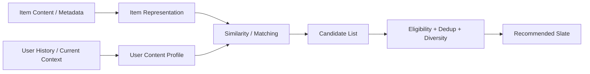
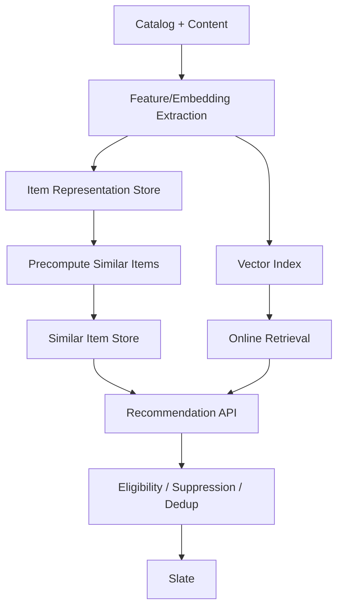
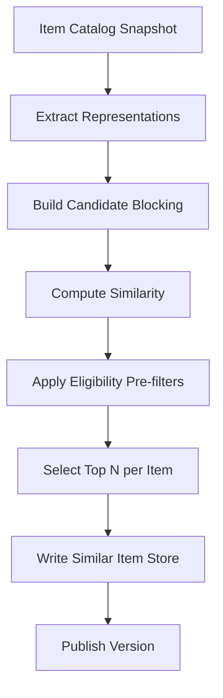

------
title: Build From Scratch Recommendations System - Part 019
description: Membangun content-based recommendation production-grade dari nol: item representation, metadata similarity, text/image embeddings, taxonomy, user profile from content, cold-start, explainability, filtering, scoring, dan serving architecture.
series: learn-build-from-scratch-recommendations-system
seriesTitle: Build From Scratch: Enterprise Recommendations System
order: 19
partTitle: Content-Based Recommendation
tags:
  - recommendation-system
  - recsys
  - content-based
  - embeddings
  - cold-start
  - information-retrieval
  - series
date: 2026-07-02
---

# Part 019 — Content-Based Recommendation

Content-based recommendation menjawab pertanyaan sederhana:

> “Jika user menyukai atau sedang melihat item dengan karakteristik tertentu, item lain apa yang punya karakteristik mirip atau cocok?”

Ia tidak menunggu banyak user lain berinteraksi. Ia membaca item dari kontennya sendiri: category, tags, title, description, brand, creator, topic, price, language, duration, image, transcript, policy metadata, atau domain attributes.

Content-based recommendation adalah salah satu fondasi paling penting karena ia:

- bekerja untuk item cold-start,
- explainable,
- relatif mudah dikontrol,
- bagus untuk similar items,
- bagus untuk knowledge/article/document recommendation,
- bisa menjadi fallback saat collaborative signal lemah,
- bisa dibangun bertahap sebelum deep model kompleks.

Namun content-based system yang naif juga mudah buruk:

- hanya merekomendasikan item yang terlalu mirip,
- tidak belajar preference kolektif,
- mudah overfit ke category,
- sulit memahami complement vs substitute,
- bisa repetitive,
- bergantung pada kualitas metadata,
- tidak selalu tahu item mana yang benar-benar disukai user.

Part ini membangun content-based recommendation production-grade dari nol.

---

## 1. Mental Model: Represent Item, Represent User, Match Them

Content-based recommendation punya tiga langkah besar:



Intinya:

```text
item -> vector/features
user/context -> vector/features
score(user, item) = compatibility(user_profile, item_representation)
```

Untuk similar item:

```text
score(seed_item, candidate_item) = similarity(seed_representation, candidate_representation)
```

Untuk content-based user recommendation:

```text
score(user, item) = similarity(user_content_profile, item_representation)
```

---

## 2. Content-Based vs Collaborative

Content-based:

```text
Recommend item because its content matches user/item context.
```

Collaborative:

```text
Recommend item because users/items with similar interaction patterns are related.
```

Contoh:

User suka artikel Java concurrency.

Content-based akan merekomendasikan:

- artikel Java thread pool,
- artikel lock-free programming,
- artikel JVM memory model.

Collaborative bisa merekomendasikan:

- buku distributed systems,
- talk tentang Kafka,
- course debugging production,
karena user serupa juga mengonsumsi itu.

Content-based kuat untuk semantic similarity. Collaborative kuat untuk hidden behavioral relation.

Production system biasanya memakai keduanya.

---

## 3. Kapan Content-Based Cocok

Content-based sangat cocok untuk:

- item cold-start,
- new catalog,
- low interaction domain,
- document/knowledge recommendation,
- similar item recommendation,
- seed-based recommendation,
- search-like recommendation,
- explainable recommendation,
- regulated/enterprise environment,
- long-tail discovery,
- privacy-constrained recommendation,
- no-consent contextual recommendation.

Tidak cukup jika:

- preference tidak tercermin di metadata,
- item yang disukai justru complement, bukan similar,
- user ingin novelty/serendipity,
- metadata buruk,
- behavioral trend penting,
- objective conversion bergantung social proof.

---

## 4. Item Representation

Item representation adalah cara sistem menyatakan “isi” item.

Sumber representation:

```text
structured metadata
taxonomy
text
image
audio/video
behavioral aggregates
quality signals
policy attributes
domain-specific fields
embeddings
```

Contoh product representation:

```json
{
  "item_id": "prod_123",
  "type": "product",
  "category_path": ["electronics", "camera", "mirrorless"],
  "brand": "brand_x",
  "price_bucket": "mid",
  "tags": ["beginner", "travel", "lightweight"],
  "text": "compact mirrorless camera for beginner creators",
  "quality_score": 0.86,
  "availability": "available",
  "text_embedding_id": "emb_text_prod_123_v4",
  "image_embedding_id": "emb_img_prod_123_v2"
}
```

Contoh knowledge article:

```json
{
  "item_id": "ka_047",
  "type": "knowledge_article",
  "topic": "aml_escalation",
  "jurisdiction": "ID",
  "audience_roles": ["investigator", "supervisor"],
  "policy_version": "aml-2026-v2",
  "text_embedding_id": "emb_doc_ka_047_v6"
}
```

Item representation harus typed dan versioned.

---

## 5. Structured Metadata Similarity

Mulai dari metadata sederhana.

Contoh features:

- same category,
- same brand,
- same creator,
- same language,
- same topic,
- same price bucket,
- same difficulty,
- same jurisdiction,
- same role applicability,
- same duration bucket,
- same content rating.

Scoring sederhana:

```text
score =
  w_category * category_similarity
  + w_brand * brand_match
  + w_price * price_bucket_similarity
  + w_topic * topic_similarity
  + w_quality * quality_score
```

Example:

```yaml
similarity_weights:
  category_path: 0.35
  tags: 0.20
  brand_or_creator: 0.10
  price_bucket: 0.10
  text_embedding: 0.20
  quality_score: 0.05
```

Ini mudah dijelaskan dan dikontrol.

---

## 6. Category Path Similarity

Category tidak hanya exact match. Path memberi hierarchy.

Contoh:

```text
Electronics > Camera > Mirrorless
Electronics > Camera > DSLR
Electronics > Laptop > Gaming
```

Similarity:

```text
same leaf category       = high
same parent category     = medium
same root only           = low
different root           = zero
```

Formula sederhana:

```text
category_similarity = common_prefix_length / max_path_length
```

Example:

```text
mirrorless vs DSLR:
common path = Electronics > Camera
similarity = 2 / 3

mirrorless vs gaming laptop:
common path = Electronics
similarity = 1 / 3
```

Taxonomy version harus konsisten.

---

## 7. Tag Similarity

Jika item punya tags:

```text
item A tags = {java, concurrency, performance}
item B tags = {java, threading, performance}
```

Jaccard similarity:

```text
|intersection| / |union|
```

Weighted tag similarity lebih baik jika tag punya importance.

```text
score = sum(weight(tag) for common tags) / sum(weight(tag) for all tags)
```

Tag problems:

- too generic tags,
- inconsistent tagging,
- synonyms,
- missing tags,
- spam tags,
- taxonomy drift.

Solusi:

- controlled vocabulary,
- tag normalization,
- synonym mapping,
- tag quality score,
- human/editorial validation untuk critical domain.

---

## 8. Text Representation

Text fields:

- title,
- description,
- article body,
- transcript,
- review summary,
- case summary,
- policy document,
- query text.

Representation options:

### 8.1 Bag-of-Words / TF-IDF

Simple and explainable.

Good for:

- documents,
- knowledge articles,
- sparse text,
- exact terms.

Limitations:

- synonyms difficult,
- semantic meaning limited,
- language normalization needed.

### 8.2 Text Embeddings

Encode text into dense vector.

Good for:

- semantic similarity,
- synonyms,
- multilingual if model supports,
- document retrieval,
- query-item matching.

Limitations:

- embedding model versioning,
- cost,
- explainability weaker,
- can retrieve semantically similar but policy-invalid items,
- may encode sensitive patterns.

Production often uses both:

```text
keyword/taxonomy filters
+ embedding similarity
+ policy/eligibility
```

---

## 9. Image and Multimodal Representation

For visual products/content:

- fashion,
- furniture,
- food,
- travel,
- video thumbnails,
- art,
- real estate.

Image embeddings can capture:

- visual style,
- color,
- shape,
- composition,
- product type,
- aesthetic similarity.

But image similarity alone can be misleading.

Example:

Two shoes look similar, but one is running shoe, one is safety shoe. Metadata still matters.

Combine:

```text
multimodal_score =
  w_text * text_similarity
  + w_image * image_similarity
  + w_metadata * metadata_similarity
```

For content/video, thumbnail clickability should not dominate relevance. Monitor clickbait risk.

---

## 10. Domain-Specific Representation

Content-based recommendation gets powerful when domain attributes are explicit.

### Product

```text
category
brand
price
compatibility
size
material
style
use case
stock
seller quality
```

### Video

```text
topic
creator
duration
language
difficulty
format
transcript embedding
thumbnail embedding
content safety
```

### Job

```text
role
skills
seniority
location
salary
work mode
company industry
candidate qualifications
```

### Enterprise Case/Knowledge

```text
case type
jurisdiction
risk level
applicable state
policy version
required role
entity type
evidence type
outcome category
```

Generic embeddings help, but domain-specific features make recommendation controllable and defensible.

---

## 11. User Content Profile

Untuk merekomendasikan item ke user, buat profile berdasarkan content dari item yang user interaksi.

Example:

```text
user clicked:
  camera, mirrorless, beginner
  camera, lens, travel
  tripod, photography, accessory
```

User profile bisa berupa:

- category affinity,
- tag affinity,
- brand/creator affinity,
- topic distribution,
- price preference,
- language preference,
- average embedding,
- sequence-weighted embedding,
- negative preference vector.

Basic profile:

```text
user_profile_vector =
  weighted_average(item_vectors_interacted_by_user)
```

Weights based on feedback:

```text
click = 1
long dwell = 2
add_to_cart = 3
purchase = 5
hide = -3
```

Use recency decay:

```text
weight = feedback_weight * exp(-lambda * age)
```

---

## 12. Positive and Negative Profiles

Do not only model likes.

Maintain:

```text
positive_profile
negative_profile
```

Positive from:

- click,
- dwell,
- purchase,
- save,
- like,
- completion.

Negative from:

- hide,
- not interested,
- dislike,
- report,
- repeated skip.

Score:

```text
score(user, item) =
  similarity(item, positive_profile)
  - alpha * similarity(item, negative_profile)
```

But report/policy should not only become negative profile. It may need safety workflow.

Negative profiles help avoid repeating unwanted topics.

---

## 13. Session vs Long-Term Content Profile

User may have long-term taste and short-term intent.

Represent both:

```text
long_term_profile = weighted history over 90d
session_profile = weighted recent events in current session
```

Score:

```text
score =
  w_long * sim(item, long_term_profile)
  + w_session * sim(item, session_profile)
```

Surface-specific weights:

```text
homepage: long 0.6, session 0.4
product detail: seed/session 0.8, long 0.2
checkout: cart context 0.9, long 0.1
email digest: long 0.8, recent 0.2
```

For gift shopping, session profile should not permanently pollute long-term profile.

---

## 14. Similar Item Recommendation

Given seed item, recommend similar items.

Basic:

```text
candidate_score = similarity(seed_item_vector, candidate_item_vector)
```

Use cases:

- similar products,
- related articles,
- more like this,
- related videos,
- similar cases,
- similar knowledge articles.

But define relation goal.

```text
similar
alternative
complement
upgrade
replacement
related_topic
same_author
same_policy_area
```

Content similarity mostly finds “similar”, not “complement”.

For complements, use item-to-item/co-occurrence or compatibility graph. That is Part 020.

---

## 15. Similarity Functions

Common similarity:

### Cosine Similarity

For embeddings/vectors:

```text
cosine(a,b) = dot(a,b) / (||a|| * ||b||)
```

Good for text/item embeddings.

### Jaccard

For sets:

```text
|A ∩ B| / |A ∪ B|
```

Good for tags.

### Weighted Overlap

For weighted tags/categories.

### Numeric Distance

For price/duration/age:

```text
price_similarity = exp(-abs(log(price_a) - log(price_b)))
```

### Hybrid Score

Combine several:

```text
score =
  0.4 * text_embedding_cosine
  + 0.2 * category_similarity
  + 0.1 * brand_match
  + 0.1 * price_similarity
  + 0.2 * quality_adjustment
```

Normalize each component.

---

## 16. Candidate Generation Architecture

Content-based retrieval can be:

### 16.1 Precomputed Similar Items

For each item, precompute top-N similar items.

Good for:

- PDP similar items,
- related articles,
- low latency.

### 16.2 Online Vector Search

Compute query/user/session vector and search ANN index.

Good for:

- personalized content-based,
- query-based,
- dynamic context.

### 16.3 Metadata Filtering + Scoring

Filter by category/eligibility, then score in memory.

Good for:

- small catalog,
- enterprise constrained domains,
- explainability.

Architecture:



---

## 17. Precomputed Similar Items

Batch job:

```text
for each item:
  find top N similar eligible candidates
  store list with scores and reasons
```

Store:

```json
{
  "seed_item_id": "item_101",
  "model_version": "content-sim-v3",
  "generated_at": "2026-07-02T02:00:00Z",
  "similar_items": [
    {
      "item_id": "item_202",
      "score": 0.87,
      "reasons": ["same_category", "similar_text", "same_price_bucket"]
    }
  ]
}
```

Serving:

1. fetch list by seed_item_id,
2. filter eligibility/availability,
3. remove seen/purchased/hidden,
4. dedup,
5. diversify,
6. return.

This is fast and robust.

---

## 18. Online Content-Based Personalization

For user homepage:

1. Build user/session vector.
2. Search vector index.
3. Filter eligible items.
4. Score with metadata/quality.
5. Dedup/diversify.
6. Return candidates to ranker or baseline slate.

Example:

```text
query_vector = 0.7 * session_embedding + 0.3 * long_term_embedding
candidates = ANN.search(query_vector, topK=500)
```

Important:

- exclude items already seen/purchased,
- enforce surface/region/policy,
- avoid over-similarity,
- mix with popularity/trending for freshness.

---

## 19. Cold-Start Items

Content-based system can recommend new items before interactions exist.

Needs:

- metadata completeness,
- category,
- text/image embedding,
- policy approval,
- quality prior,
- exploration quota.

Cold-start score:

```text
score =
  similarity_to_user_or_seed
  * quality_prior
  * freshness_boost
  * eligibility
```

Risks:

- new low-quality items overpromoted,
- spam metadata,
- unreviewed content,
- embedding extraction failed.

Use guardrails:

```text
min_quality_score
policy_approved
metadata_complete
exposure_cap
hide/report monitoring
```

---

## 20. Cold-Start Users

For users with no history:

Use:

- current context,
- query,
- seed item,
- region,
- locale,
- onboarding preferences,
- segment popularity,
- editorial lists,
- trending.

Content-based can use explicit onboarding:

```text
choose topics: Java, distributed systems, databases
```

Then recommend items matching selected topics.

This is better than pretending there is long-term behavior.

---

## 21. Explainability

Content-based recommendations are explainable.

Reason examples:

```text
Because it is also in Mirrorless Cameras
Because it matches your interest in Java concurrency
Because it applies to AML escalation cases in ID jurisdiction
Because it is similar to the article you just read
Because it matches the skills in your profile
```

To support explanation, store reason components:

```json
{
  "score": 0.83,
  "reason_components": [
    {"type": "same_category", "value": "mirrorless_camera", "weight": 0.35},
    {"type": "similar_topic", "value": "beginner_photography", "weight": 0.25},
    {"type": "price_fit", "value": "mid", "weight": 0.10}
  ]
}
```

Do not expose raw embedding similarity as explanation. Translate to semantic reason.

---

## 22. Over-Specialization Problem

Content-based systems can trap user in narrow topics.

If user clicked one Java concurrency article, all recommendations become Java concurrency.

Mitigation:

- diversity constraints,
- topic expansion,
- related-but-not-identical categories,
- exploration slots,
- popularity/trending mix,
- recency decay,
- session vs long-term separation,
- cap same category/creator.

Example slate rule:

```text
max 4 items from same leaf category
max 2 from same creator
at least 3 related topics
```

---

## 23. Metadata Quality Problem

Content-based recommendation depends heavily on metadata.

Bad metadata causes bad recommendations.

Problems:

- missing category,
- wrong tags,
- SEO keyword stuffing,
- outdated description,
- language mismatch,
- duplicate content,
- policy tags missing,
- generated metadata hallucinated,
- inconsistent taxonomy.

Monitor:

```text
metadata_completeness
unknown_category_rate
embedding_missing_rate
tag_distribution
duplicate_content_rate
policy_tag_missing_rate
```

Metadata quality is recommendation quality.

---

## 24. Content-Based Filtering vs Scoring

Separate hard filters and soft scores.

Hard filters:

- policy,
- region,
- availability,
- permission,
- item active,
- surface allowed,
- age gate,
- tenant boundary.

Soft score:

- category similarity,
- embedding similarity,
- quality,
- freshness,
- price fit,
- topic affinity.

Do not let high similarity override policy.

Formula:

```text
if not eligible(item, context):
    exclude
else:
    score_content_match(item, user/context)
```

---

## 25. Diversity and Dedup

Content similarity often returns near-duplicates.

Dedup by:

- product family,
- article canonical URL,
- video content hash,
- creator repetition,
- semantic cluster,
- topic cluster,
- policy document version.

Diversity constraints:

```yaml
max_per_dedup_group: 1
max_per_creator: 2
max_per_leaf_category: 4
min_semantic_distance_between_items: 0.1
```

Without this, “similar items” becomes repetitive.

---

## 26. Evaluation

Offline content-based evaluation:

- HitRate@K,
- Recall@K,
- NDCG@K,
- coverage,
- cold item recall,
- metadata coverage,
- diversity,
- novelty,
- human relevance judgment,
- explanation quality.

For similar item:

- user clicked similar item after seed,
- co-view/purchase overlap,
- human review,
- category correctness,
- complement confusion rate.

Online:

- CTR,
- add-to-cart/purchase,
- watch completion,
- hide/not interested,
- repeat engagement,
- cold-start exposure success,
- diversity/coverage,
- report rate.

For enterprise:

- task success,
- case progression,
- article usefulness feedback,
- supervisor approval,
- policy compliance.

---

## 27. Content-Based vs Search

Content-based recommendation and search are cousins.

Search:

```text
query -> matching items
```

Content-based:

```text
user/seed/context representation -> matching items
```

Both use:

- indexing,
- filtering,
- scoring,
- text relevance,
- embeddings,
- metadata filters.

Differences:

- search intent is explicit query,
- recommendation intent often inferred,
- recommendation needs diversity and novelty more,
- search relevance can be narrower,
- recommendation often must account for fatigue and personalization.

A strong search infrastructure can power content-based recommendation if policy and personalization layers are added.

---

## 28. Serving Latency

Content-based recommendation can be fast if precomputed.

Latency budgets:

### Precomputed similar items

```text
list fetch: 5ms
filter/dedup: 20ms
total: <50ms
```

### Online vector search

```text
user vector build/fetch: 5-20ms
ANN search: 10-50ms
filter/rerank: 20-80ms
```

### Full metadata scoring over large catalog

Too slow unless candidate set small.

Use staged retrieval:

```text
metadata filter -> ANN/topN -> lightweight rank -> final filters
```

---

## 29. Content-Based Recommender API

Request:

```json
{
  "mode": "similar_item",
  "surface": "product_detail_related",
  "seed_item_id": "item_101",
  "subject": {
    "user_id": "u123",
    "session_id": "sess_001"
  },
  "context": {
    "region": "ID-JK",
    "locale": "id-ID",
    "relationship_goal": "similar"
  },
  "limit": 20
}
```

Response:

```json
{
  "source": "content_based_similar_items",
  "source_version": "content-sim-v3",
  "items": [
    {
      "item_id": "item_202",
      "score": 0.84,
      "reason_codes": ["same_category", "similar_text", "price_fit"]
    }
  ]
}
```

Reason codes are useful for debugging and explainability.

---

## 30. Implementation Sketch

Core interfaces:

```java
public interface ItemRepresentationStore {
    ItemRepresentation get(String itemId, String representationVersion);
}

public interface SimilarityScorer {
    double score(ItemRepresentation a, ItemRepresentation b);
}

public interface ContentBasedCandidateGenerator {
    List<Candidate> generate(ContentBasedRequest request);
}
```

Hybrid scorer:

```java
public final class HybridContentSimilarityScorer implements SimilarityScorer {
    public double score(ItemRepresentation a, ItemRepresentation b) {
        double category = categorySimilarity(a.categoryPath(), b.categoryPath());
        double text = cosine(a.textEmbedding(), b.textEmbedding());
        double tags = weightedTagOverlap(a.tags(), b.tags());
        double price = priceSimilarity(a.priceBucket(), b.priceBucket());
        double quality = b.qualityScore();

        return 0.35 * category
             + 0.25 * text
             + 0.15 * tags
             + 0.10 * price
             + 0.15 * quality;
    }
}
```

In production, weights should be configurable and versioned.

---

## 31. Batch Similarity Job



Blocking avoids comparing all pairs.

Blocking strategies:

- same category,
- same language,
- same region,
- same item type,
- same tenant,
- embedding ANN topK,
- brand/topic constraints.

All-pairs similarity over millions of items is expensive.

---

## 32. Blocking and Candidate Pruning

For item-item content similarity, don't compare every item with every item.

Use blocking:

```text
candidate pool for seed item =
  same category
  OR same topic
  OR ANN nearest neighbors
  OR same creator/brand
```

Then score.

Example:

```text
1M items
all pairs = 1T comparisons
blocked same category average 10k each = much smaller
ANN top 1000 each = manageable
```

Blocking itself must not be too narrow. Otherwise recommendations become repetitive.

---

## 33. Versioning

Version every piece:

```text
representation_version
embedding_model_version
similarity_scorer_version
weight_config_version
taxonomy_version
catalog_snapshot_version
similar_item_list_version
```

Serving logs should include:

```json
{
  "source_version": "content-sim-v3",
  "embedding_model": "text-encoder-20260701",
  "similarity_config": "hybrid-content-weights-v5"
}
```

Without versioning, A/B tests and debugging become unclear.

---

## 34. Enterprise Content-Based Recommendation

For enterprise case/knowledge systems:

Use content-based for:

- similar cases,
- related knowledge articles,
- applicable policies,
- next best document,
- evidence checklist,
- similar enforcement actions.

Representation:

```text
case type
risk indicators
jurisdiction
entities involved
case state
evidence types
policy topics
text summary embedding
outcome category
```

Hard constraints:

- tenant,
- permission,
- jurisdiction,
- case confidentiality,
- policy validity,
- role applicability.

Explainability is mandatory:

```text
Recommended because this article applies to AML escalation cases in ID and matches the current case risk indicators.
```

Do not rely only on opaque embeddings for high-stakes recommendations.

---

## 35. Anti-Patterns

### 35.1 Metadata Only, No Quality

Recommends low-quality but similar items.

### 35.2 Embedding Only, No Policy

Retrieves semantically similar but unauthorized/unsafe items.

### 35.3 Similar = Complement

Similar camera is not necessarily camera bag.

### 35.4 No Dedup

Near-identical items fill slate.

### 35.5 No Versioning

Embedding/model/taxonomy changes are untraceable.

### 35.6 User Profile Average Without Recency

Old interests dominate forever.

### 35.7 Session Interest Pollutes Long-Term Profile

One gift search changes profile permanently.

### 35.8 Raw Embedding Explanation

“Because vector similarity 0.84” is not user-facing explanation.

### 35.9 No Metadata Quality Monitoring

Bad input silently degrades recommendations.

### 35.10 Over-Specialization

System traps user in same topic/category.

---

## 36. Minimal Production Content-Based Plan

Build in this order:

### 36.1 Item Representation

```text
category path
tags/topics
brand/creator
price/duration bucket
quality score
text embedding
policy/availability fields
```

### 36.2 Similar Item Store

```text
precompute top 100 similar items per item
filter by item type/category/language
score by hybrid similarity
store reasons
```

### 36.3 User Content Profile

```text
long-term category/topic affinity
session category/topic affinity
weighted average item embedding
negative profile from hide/not interested
```

### 36.4 Online Serving

```text
fetch similar list or ANN search
apply eligibility
apply suppression
dedup/diversify
return candidates
```

### 36.5 Observability

```text
empty rate
filter rate
similarity score distribution
reason code distribution
category coverage
cold item exposure
hide/report rate
```

This gives strong cold-start and fallback capability.

---

## 37. Checklist Content-Based Readiness

```text
[ ] Item representation is typed and versioned.
[ ] Metadata quality is monitored.
[ ] Taxonomy version is tracked.
[ ] Text/image embeddings have model versions.
[ ] Embedding compatibility is enforced.
[ ] Similarity function is explicit and versioned.
[ ] Hard filters are separated from soft scoring.
[ ] Policy/eligibility checks run before final output.
[ ] User profile separates long-term and session intent.
[ ] Negative profile/suppression is supported.
[ ] Similar item relation goal is explicit.
[ ] Dedup and diversity constraints exist.
[ ] Similar items can be explained with semantic reason codes.
[ ] Cold-start item path exists.
[ ] No-consent contextual path exists if needed.
[ ] Offline and online metrics include coverage/diversity.
[ ] Enterprise permissions/jurisdiction are enforced if applicable.
```

---

## 38. Kesimpulan

Content-based recommendation adalah fondasi yang kuat, praktis, dan explainable.

Ia tidak menggantikan collaborative signal, tetapi mengisi celah penting:

- item cold-start,
- user cold-start,
- similar item,
- knowledge/document recommendation,
- privacy-aware contextual recommendation,
- fallback,
- explainability.

Prinsip utama:

1. Represent item dengan metadata, taxonomy, text/image embeddings, quality, dan policy.
2. Represent user/context dari content yang mereka konsumsi atau sedang lihat.
3. Pisahkan hard eligibility dari soft similarity.
4. Jangan menganggap similar sebagai complement.
5. Gunakan recency, session, dan negative profile agar tidak over-specialized.
6. Dedup dan diversity wajib.
7. Explanation harus berbasis semantic reason, bukan raw vector.
8. Versioning dan observability wajib.
9. Metadata quality adalah recommendation quality.
10. Untuk enterprise, content-based harus permission-aware dan defensible.

Di Part 020, kita akan membahas **Item-to-Item & Co-occurrence Recommendation**: bagaimana membangun “people also viewed/bought/watched” dari interaction graph, lift, PMI, confidence, session co-occurrence, dan production serving.
