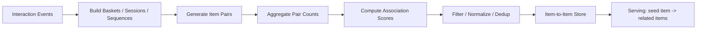
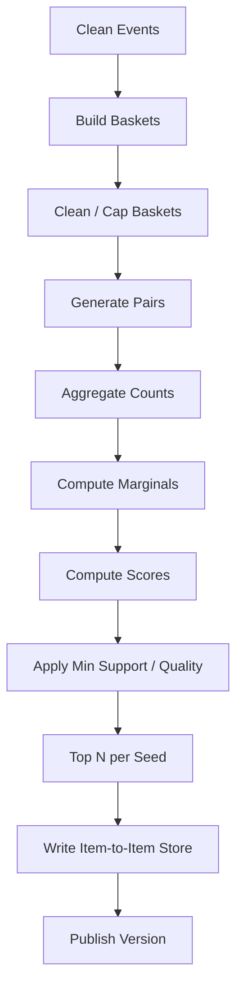
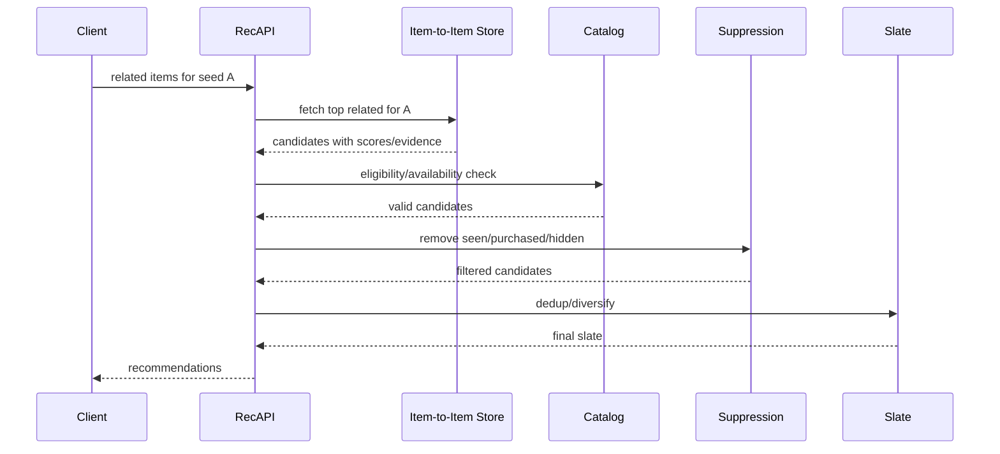

------
title: Build From Scratch Recommendations System - Part 020
description: Membangun item-to-item dan co-occurrence recommendation production-grade: co-view, co-buy, session co-occurrence, lift, confidence, PMI, association scoring, dedup, complement vs substitute, batch pipeline, dan serving.
series: learn-build-from-scratch-recommendations-system
seriesTitle: Build From Scratch: Enterprise Recommendations System
order: 20
partTitle: Item-to-Item & Co-occurrence Recommendation
tags:
  - recommendation-system
  - recsys
  - item-to-item
  - co-occurrence
  - association-rules
  - collaborative-filtering
  - series
date: 2026-07-02
---

# Part 020 — Item-to-Item & Co-occurrence Recommendation

Salah satu recommendation pattern paling berguna di production adalah item-to-item:

```text
People also viewed
People also bought
Frequently bought together
Users who watched this also watched
Related articles
Similar cases
Knowledge articles used together
Actions often taken after this action
```

Berbeda dari content-based recommendation yang melihat isi item, item-to-item melihat **pola interaksi**.

Jika banyak user melihat A lalu B, membeli A dan B, menonton A lalu B, atau memakai knowledge article A dan B pada case yang mirip, maka A dan B punya hubungan behavioral.

Item-to-item recommendation sangat production-friendly karena:

- bisa diprecompute,
- serving cepat,
- explainable,
- bagus untuk product detail page,
- bagus untuk cross-sell,
- tidak perlu full user profile,
- bisa menjadi candidate source untuk ranker,
- cocok untuk collaborative signal awal sebelum model kompleks.

Namun co-occurrence yang naif juga mudah salah:

- popular item muncul di semua list,
- substitute dan complement tercampur,
- bot/internal traffic mencemari,
- stock/policy tidak diperiksa,
- rare item pair overpromoted,
- temporal/session leakage,
- duplicate item family mendominasi,
- “also viewed” dipakai untuk “also bought” padahal maknanya berbeda.

Part ini membangun item-to-item dan co-occurrence recommender dari nol.

---

## 1. Mental Model: Relationship from Shared Behavior

Item-to-item bertanya:

> “Item apa yang punya hubungan kuat dengan item ini berdasarkan perilaku kolektif?”

Input:

```text
user/session/order/watch/case interaction histories
```

Output:

```text
for each seed item, list related items with relationship score
```

Diagram:



The core idea:

```text
If items appear together more often than expected, they are related.
```

---

## 2. Co-occurrence Units

Sebelum menghitung pair, tentukan “together” artinya apa.

Common units:

### 2.1 Session

Items interacted in same session.

```text
view A, view B, click C
```

Good for:

- browsing similarity,
- next item,
- content feed,
- product discovery.

### 2.2 Order / Cart

Items bought together.

```text
order contains A and B
```

Good for:

- frequently bought together,
- bundles,
- accessories,
- cross-sell.

### 2.3 User History Window

Items interacted by same user within 7/30/90 days.

Good for:

- broad taste relation,
- collaborative similarity.

Risk:

- too broad,
- user interests mixed.

### 2.4 Sequence Transition

Item B follows item A.

```text
A -> B
```

Good for:

- next video,
- next article,
- workflow next action,
- session prediction.

### 2.5 Case / Task Context

Enterprise:

```text
knowledge articles A and B used in same case type
actions A then B in similar cases
```

Good for:

- next best action,
- related knowledge,
- case support.

Different unit produces different relationship.

---

## 3. Relationship Semantics

Not all co-occurrence means same thing.

### Also Viewed

```text
view A and view B in same session
```

Often means substitutes, alternatives, or comparison.

### Also Bought

```text
buy A and buy B in same order/window
```

Often means complements or bundle relation.

### Bought After Viewing

```text
view A then buy B
```

Can mean A led to B, or A was rejected in favor of B.

### Watched Next

```text
watch A then watch B
```

Can mean sequence continuation.

### Used Together

Enterprise/document:

```text
article A and B used in same case
```

Can mean procedural relationship.

Do not mix all co-occurrence types into one generic score without source label.

---

## 4. Basket Construction

A basket is a set or ordered list of items considered together.

Example session basket:

```json
{
  "basket_id": "sess_123",
  "basket_type": "session_views",
  "user_id": "u123",
  "event_time_start": "2026-07-02T10:00:00Z",
  "items": [
    {"item_id": "A", "event_type": "view", "time": "10:00"},
    {"item_id": "B", "event_type": "view", "time": "10:03"},
    {"item_id": "C", "event_type": "click", "time": "10:04"}
  ]
}
```

Order basket:

```json
{
  "basket_id": "order_456",
  "basket_type": "purchase_order",
  "items": [
    {"item_id": "camera", "quantity": 1},
    {"item_id": "memory_card", "quantity": 1},
    {"item_id": "camera_bag", "quantity": 1}
  ]
}
```

Basket quality matters. Bad baskets produce bad pair counts.

---

## 5. Basket Cleaning

Before generating pairs:

- remove duplicate item within basket if needed,
- map SKU to product family if appropriate,
- remove invalid/bot/internal traffic,
- remove items not actually visible/valid,
- remove policy-blocked items,
- cap huge baskets,
- handle repeated events,
- exclude test orders,
- filter refunds/fraud if needed.

Huge baskets are dangerous.

Example: enterprise procurement order with 500 items creates 124,750 pairs. It can dominate counts but may not reflect recommendation relation.

Cap or downweight large baskets.

```text
basket_weight = 1 / log(2 + basket_size)
```

or ignore baskets above threshold.

---

## 6. Pair Generation

For unordered basket:

```text
items = [A, B, C]
pairs = (A,B), (A,C), (B,C)
```

For recommendation from seed item, store directional pairs:

```text
A -> B
B -> A
A -> C
C -> A
```

For sequence:

```text
A -> B
B -> C
```

Or with window:

```text
A -> B within next 3 interactions
A -> C within next 3 interactions
```

Directional relationships matter.

Example:

```text
phone -> phone_case
```

is useful.

```text
phone_case -> phone
```

may also be useful but has different semantics.

---

## 7. Basic Co-occurrence Count

Simplest score:

```text
co_count(A,B) = number of baskets containing both A and B
```

This is easy but biased toward popular items.

Popular item P appears with everything.

If you recommend by raw co_count, every item says “also buy iPhone” or “also watch viral video”.

Need normalization.

---

## 8. Support, Confidence, Lift

Association rule metrics.

### Support

How often A and B occur together.

```text
support(A,B) = count(A,B) / total_baskets
```

### Confidence

Probability of B given A.

```text
confidence(A -> B) = count(A,B) / count(A)
```

Useful for directional recommendation.

Problem: favors popular B.

### Lift

How much more likely B is with A than generally.

```text
lift(A -> B) =
  confidence(A -> B) / P(B)
```

Or:

```text
lift(A,B) =
  P(A,B) / (P(A) * P(B))
```

Lift reduces popularity bias.

But lift can overpromote rare pairs with tiny counts. Use minimum support/smoothing.

---

## 9. PMI and PPMI

Pointwise Mutual Information:

```text
PMI(A,B) = log( P(A,B) / (P(A) * P(B)) )
```

Positive PMI:

```text
PPMI = max(PMI, 0)
```

PMI captures association beyond chance.

Problem:

- unstable for rare pairs,
- needs smoothing/min count.

Use:

```text
if count(A,B) >= min_pair_count:
    score = PMI
else:
    ignore
```

Or combine with support/confidence.

---

## 10. Scoring Formula

Practical item-to-item score often blends metrics.

Example:

```text
score(A -> B) =
  w_conf * smoothed_confidence(A -> B)
  + w_lift * log_lift(A,B)
  + w_quality * quality(B)
  + w_freshness * freshness(B)
  - w_pop_penalty * popularity_penalty(B)
```

Simpler:

```text
score =
  smoothed_confidence(A -> B)
  * log(1 + lift(A,B))
  * quality_score(B)
```

With minimum thresholds:

```text
count(A,B) >= 5
count(A) >= 20
item B eligible
```

Do not chase mathematical purity first. Use stable, explainable scoring.

---

## 11. Smoothing

Confidence:

```text
conf(A -> B) = count(A,B) / count(A)
```

Smoothed:

```text
smoothed_conf =
  (count(A,B) + prior_prob_B * prior_weight)
  / (count(A) + prior_weight)
```

This prevents tiny items from extreme scores.

Alternatively:

```text
score = count(A,B) / (count(A)^alpha * count(B)^beta)
```

With alpha/beta controlling popularity normalization.

Example:

```text
score = count(A,B) / sqrt(count(A) * count(B))
```

This is cosine similarity for binary co-occurrence vectors.

---

## 12. Cosine Similarity from Co-occurrence

Represent each item as vector of users/sessions/baskets.

```text
item A vector: baskets where A appears
item B vector: baskets where B appears
```

Cosine:

```text
cosine(A,B) = count(A,B) / sqrt(count(A) * count(B))
```

This is a strong simple baseline.

It normalizes popularity better than raw count.

But it treats all baskets equally and ignores direction.

---

## 13. Jaccard Similarity

```text
jaccard(A,B) = count(A,B) / count(A or B)
```

Good for set overlap.

Can be too harsh for popular items.

Useful for:

- document co-usage,
- small domains,
- entity overlap.

---

## 14. Directional vs Symmetric Relations

Symmetric:

```text
similar_to(A,B)
```

Directional:

```text
A recommends B
```

Co-buy in order is often symmetric, but serving may need direction.

Example:

```text
camera -> memory card
memory card -> camera
```

Both may be valid, but ranking differs.

Sequence is directional:

```text
episode 1 -> episode 2
```

not:

```text
episode 2 -> episode 1
```

Workflow actions are directional:

```text
collect evidence -> escalate case
```

not always reverse.

Store relation type and direction.

---

## 15. Time-Aware Co-occurrence

Relationships change.

Use windows:

```text
co_view_1d
co_view_7d
co_view_30d
co_buy_90d
```

Or decay:

```text
pair_weight = exp(-lambda * age)
```

For stable domains, longer windows help.

For trends, shorter windows matter.

Hybrid:

```text
score =
  0.5 * score_7d
  + 0.3 * score_30d
  + 0.2 * score_180d
```

If item pair was common last year but irrelevant now, recency decay helps.

---

## 16. Session-Aware Co-occurrence

For session co-view, not all pairs equally strong.

If A and B occur close together, relation stronger.

```text
weight(A,B) = exp(-lambda * interaction_distance)
```

Example:

```text
A then B immediately: high
A and B 20 interactions apart: low
```

Also use time gap:

```text
weight = exp(-lambda * minutes_between_events)
```

This helps distinguish session intent from broad user taste.

---

## 17. Event Weighting

Different event types carry different strength.

Example:

```text
view-view pair: 1
click-click pair: 2
add_to_cart-add_to_cart pair: 4
purchase-purchase pair: 6
watch_complete-watch_complete pair: 5
```

Pair weight:

```text
pair_weight = sqrt(weight(event_i) * weight(event_j))
```

But keep relation type separate.

Better:

- build co-view model,
- build co-buy model,
- build co-watch-complete model,
- blend at serving depending surface.

---

## 18. Co-view vs Co-buy

Co-view often finds alternatives/substitutes.

Example:

User views multiple cameras before choosing one.

Co-buy often finds complements.

Example:

Camera + memory card + camera bag.

For PDP:

```text
similar alternatives -> co_view/content_similarity
frequently bought together -> co_buy/order
accessories -> co_buy + compatibility
```

Do not use co-view for “frequently bought together” unless validated.

---

## 19. Substitute vs Complement

This is critical.

Substitute:

```text
items satisfy similar need; user chooses one
```

Complement:

```text
items are useful together
```

Signals:

| Signal | Likely relation |
|---|---|
| same session views, one purchased | substitute/alternative |
| same order purchase | complement |
| same cart | complement or comparison |
| same category + co-view | substitute |
| different category + co-buy | complement |
| compatibility graph | complement |
| same creator/topic + watch sequence | related/continuation |

Classification:

```text
if same category and co_view high: alternative
if different complementary category and co_buy high: complement
if sequence transition high: next
```

Relation type should be stored.

---

## 20. Item Granularity

Use correct item level:

- product-level,
- SKU-level,
- variant-level,
- offer-level,
- article-level,
- canonical document-level,
- case template-level,
- action-level.

Example e-commerce:

Order contains SKU red size 42. For recommendation, use product family for co-buy to avoid duplicate variants.

But for compatibility, SKU/variant might matter.

Rule:

```text
choose granularity based on serving surface
```

Store mapping:

```text
sku -> variant -> product -> product_family
```

---

## 21. Dedup and Canonicalization

Before pair generation:

- canonicalize items,
- map duplicates,
- collapse variants if needed,
- remove same dedup group pairs,
- handle item merges/deletions.

Example:

```text
A_variant1 and A_variant2 in same order
```

Do not produce pair:

```text
A -> A_variant2
```

unless variant recommendation is intended.

Dedup group is mandatory.

---

## 22. Eligibility and Policy

Pair store may contain old items now invalid.

Serving must filter:

- active,
- available,
- policy approved,
- visible to actor,
- region,
- age,
- tenant,
- surface allowed,
- not suppressed.

Batch generation can prefilter, but serving must final-check because state changes.

Pattern:

```text
precompute relation candidates
final online eligibility check
```

---

## 23. Data Pipeline

Batch pipeline:



Inputs:

- clean events,
- catalog snapshots,
- dedup mapping,
- traffic filters,
- item quality,
- policy state.

Outputs:

- seed item,
- candidate item,
- relation type,
- score,
- evidence counts,
- version.

---

## 24. Pair Explosion

If basket size is `n`, unordered pairs:

```text
n * (n - 1) / 2
```

Large baskets explode.

Example:

```text
n = 1000 -> 499,500 pairs
```

Mitigation:

- cap basket size,
- sample pairs,
- downweight large baskets,
- ignore low-signal events,
- split basket by category/time,
- sequence window instead of full pair,
- use frequent item mining thresholds.

For sessions, only pair nearby events.

```text
window_size = 5 next items
```

---

## 25. Minimum Support

Rare pairs can have high lift by accident.

Use thresholds:

```text
count(A) >= min_seed_count
count(B) >= min_candidate_count
count(A,B) >= min_pair_count
unique_users(A,B) >= min_unique_users
```

Example:

```yaml
min_pair_count: 5
min_unique_users: 3
min_seed_count: 20
```

Use higher thresholds for high-traffic surfaces.

For enterprise low-data domains, thresholds may be lower but require expert/rule backing.

---

## 26. Unique User vs Event Count

If one user repeatedly views A and B, raw pair count high.

Use unique users/sessions/orders.

Metrics:

```text
pair_event_count
pair_session_count
pair_user_count
pair_order_count
```

For robustness:

```text
score uses unique_user_count or capped per-user contribution
```

Cap contribution:

```text
max contribution per user per pair per day = 1
```

Prevents power users/bots from dominating.

---

## 27. Bot and Fraud Protection

Co-occurrence is easy to manipulate.

Filters:

- exclude bot/internal/test,
- cap per-user contribution,
- require unique users,
- detect abnormal pair velocity,
- seller/creator self-interaction filters,
- suspicious account clusters,
- low-quality traffic source filtering.

Trending co-occurrence needs even stronger protection.

---

## 28. Pair Store Schema

Example:

```json
{
  "seed_item_id": "item_A",
  "candidate_item_id": "item_B",
  "relation_type": "co_buy",
  "score": 0.842,
  "rank": 1,
  "evidence": {
    "pair_count": 120,
    "seed_count": 1500,
    "candidate_count": 800,
    "unique_user_count": 110,
    "confidence": 0.08,
    "lift": 3.2,
    "pmi": 1.16
  },
  "metadata": {
    "window": "90d",
    "generated_at": "2026-07-02T02:00:00Z",
    "model_version": "i2i-cobuy-v4",
    "item_granularity": "product_family"
  }
}
```

Store evidence for debugging.

---

## 29. Serving Flow



Item-to-item should be low-latency because top lists are precomputed.

---

## 30. Fallbacks

If seed item has no co-occurrence list:

Fallback hierarchy:

```text
same category popularity
content-based similar items
same creator/brand popular
global surface baseline
editorial list
```

If co-buy empty but co-view exists, use co-view only if surface allows alternatives.

Fallback reason must be logged.

---

## 31. Blending Multiple I2I Sources

For PDP:

```yaml
sources:
  content_similar:
    weight: 0.3
  co_view_alternatives:
    weight: 0.3
  co_buy_complements:
    weight: 0.3
  editorial_accessories:
    weight: 0.1
```

But keep relation slots separate if UX needs clarity:

```text
Similar items
Frequently bought together
Accessories
Customers also viewed
```

Mixing all into one list can confuse users.

---

## 32. Multi-Seed Recommendation

For cart:

Seed is multiple items.

Options:

### 32.1 Union

Fetch related for each cart item, merge scores.

```text
score(candidate) = sum(score(seed_i -> candidate))
```

### 32.2 Max

```text
score = max_i score(seed_i -> candidate)
```

### 32.3 Weighted by Cart Importance

```text
score = sum(cart_item_weight_i * score(seed_i -> candidate))
```

Filter:

- items already in cart,
- incompatible items,
- duplicates,
- too expensive if not intended.

For enterprise case, seeds can be current case attributes, used articles, prior actions.

---

## 33. Sequence Transitions

For next item/action:

Count transitions:

```text
A -> B
```

within event sequence.

Metrics:

```text
transition_count(A,B)
transition_confidence(A->B) = count(A->B) / count(A)
```

Use time gap and position.

For video:

```text
watch_complete A then watch_start B within 10m
```

For workflow:

```text
action A then action B in same case within valid state transition
```

Sequence relation is directional and context-dependent.

---

## 34. Contextual Co-occurrence

Same item pair may mean different things by context.

Examples:

- region,
- category,
- surface,
- user segment,
- tenant,
- role,
- case state.

Build segmented I2I if data sufficient:

```text
co_buy_by_region
co_view_by_category
next_action_by_case_state_role
related_article_by_jurisdiction
```

Use fallback hierarchy if sparse.

Segmented co-occurrence can dramatically improve relevance.

---

## 35. Enterprise Co-occurrence

Examples:

### Similar Cases

Pairs of cases sharing entities, risk indicators, actions, outcomes.

### Knowledge Articles Used Together

If article A and B often used in same case type, recommend B after A.

### Next Actions

If action B often follows action A for case state S, recommend B.

### Evidence Checklist

Evidence item B often required when evidence A is present.

Constraints:

- permission,
- jurisdiction,
- policy version,
- case state validity,
- auditability,
- expert review for high-risk actions.

Co-occurrence is evidence, not authority. For high-stakes workflows, combine with rules/state machine.

---

## 36. Explanation

Item-to-item explanations:

```text
Frequently bought together
Customers also viewed
Often watched next
Used in similar cases
Commonly referenced with this article
Usually follows this action in cases like this
```

Only use explanation matching relation type.

Do not label co-view as “bought together”.

Expose confidence carefully. User-facing explanation should be simple; internal debug can include counts/lift.

---

## 37. Evaluation

Offline:

- Recall@K for next item/purchase,
- HitRate@K,
- NDCG@K,
- coverage,
- pair precision via human judgment,
- complement/substitute correctness,
- diversity,
- cold item coverage,
- long-tail exposure.

Online:

- CTR,
- add-to-cart,
- attach rate,
- bundle conversion,
- watch next completion,
- case action acceptance,
- hide/report,
- revenue/margin,
- return/refund,
- user satisfaction.

For co-buy, attach rate is more relevant than CTR alone.

---

## 38. Attach Rate

For cross-sell:

```text
attach_rate = orders_with_seed_and_candidate / orders_with_seed
```

This is directional confidence for purchase.

But adjust for general popularity:

```text
lift = attach_rate / overall_purchase_rate(candidate)
```

Use both.

High attach rate but low lift may just mean candidate is popular.

High lift but tiny count may be noise.

---

## 39. Guardrails

Monitor:

```text
out_of_stock_filter_rate
policy_filter_rate
duplicate_filter_rate
same_seed_candidate_rate
cooccurrence_list_empty_rate
pair_count_distribution
top_candidate_popularity_concentration
hide/report rate
return/refund rate for co-buy
bot contribution
```

If one item appears in too many lists, check popularity bias.

Metric:

```text
candidate_appears_in_seed_lists_count
```

Cap over-dominant candidates if needed.

---

## 40. Versioning

Version:

- event source,
- basket definition,
- window,
- item granularity,
- pair generation logic,
- scoring formula,
- thresholds,
- filters,
- output list.

Example:

```text
i2i-cobuy-productfamily-90d-v4
```

Serving logs:

```json
{
  "source": "item_to_item",
  "relation_type": "co_buy",
  "source_version": "i2i-cobuy-productfamily-90d-v4"
}
```

Without versioning, changed pair logic can’t be evaluated cleanly.

---

## 41. Implementation Sketch

Core model:

```java
public record ItemPair(
    String seedItemId,
    String candidateItemId,
    String relationType,
    double score,
    long pairCount,
    long seedCount,
    long candidateCount,
    double confidence,
    double lift
) {}
```

Scoring:

```java
public final class CoOccurrenceScorer {
    public double score(long pairCount, long seedCount, long candidateCount, long totalBaskets,
                        double candidateQuality) {
        double priorWeight = 50.0;
        double priorProb = (double) candidateCount / totalBaskets;

        double smoothedConfidence =
            (pairCount + priorProb * priorWeight) / (seedCount + priorWeight);

        double candidateProb = (double) candidateCount / totalBaskets;
        double lift = smoothedConfidence / Math.max(candidateProb, 1e-9);

        return smoothedConfidence * Math.log1p(lift) * candidateQuality;
    }
}
```

This is simple, stable, and interpretable.

---

## 42. Batch Job Pseudocode

```java
List<Basket> baskets = basketReader.read(spec.timeWindow());

Stream<ItemPairEvent> pairEvents = baskets.stream()
    .filter(basketQuality::isValid)
    .flatMap(pairGenerator::generatePairs);

Map<PairKey, PairStats> pairStats = aggregatePairs(pairEvents);
Map<String, Long> itemCounts = aggregateItemCounts(baskets);

List<ItemPair> scoredPairs = pairStats.entrySet().stream()
    .filter(e -> e.getValue().pairCount() >= spec.minPairCount())
    .map(e -> scorer.score(e, itemCounts, totalBaskets))
    .filter(pair -> eligibilityPreFilter.isCandidateAllowed(pair.candidateItemId()))
    .collect(toTopNPerSeed(spec.topN()));

pairStore.write(scoredPairs, spec.version());
```

Production implementation may use Spark/Flink/Beam/SQL. The logical pipeline remains.

---

## 43. Anti-Patterns

### 43.1 Raw Co-count Ranking

Popular items dominate every list.

### 43.2 No Minimum Support

Rare accidental pairs overpromoted.

### 43.3 Mix Co-view and Co-buy Blindly

Alternatives and complements confused.

### 43.4 No Basket Cleaning

Bots, huge orders, duplicates contaminate pairs.

### 43.5 No Item Granularity Decision

SKU variants recommend each other uselessly.

### 43.6 No Online Eligibility Filter

Deleted/out-of-stock/banned items show up.

### 43.7 No Direction

Sequence and complement relationships get reversed incorrectly.

### 43.8 No Dedup

Same product family fills list.

### 43.9 No Evidence Stored

Pair cannot be debugged.

### 43.10 No Versioning

Score changes cannot be attributed.

---

## 44. Minimal Production I2I Plan

Build four relation stores:

### 44.1 Co-view Alternatives

```yaml
basket: session views/clicks
window: 30d
granularity: product/article/item canonical
score: cosine or confidence*lift
use_case: similar/also viewed
```

### 44.2 Co-buy Complements

```yaml
basket: order/cart purchases
window: 90d
granularity: product_family
score: smoothed attach rate * lift * quality
use_case: frequently bought together
```

### 44.3 Sequential Next

```yaml
basket: ordered session events
window: 30d
pairing: next 1-3 events
score: transition confidence with smoothing
use_case: next video/article/action
```

### 44.4 Enterprise Co-usage

```yaml
basket: case/task context
window: 180d
constraints: tenant/role/jurisdiction/policy
score: success-weighted co-usage
use_case: related knowledge/next action
```

Each relation store gets its own version, thresholds, and evaluation.

---

## 45. Checklist Item-to-Item Readiness

```text
[ ] Co-occurrence unit is explicit.
[ ] Relation type is explicit.
[ ] Basket cleaning rules exist.
[ ] Bot/internal/test traffic excluded.
[ ] Huge baskets capped or downweighted.
[ ] Item granularity is chosen intentionally.
[ ] Dedup/canonicalization happens before pair generation.
[ ] Pair generation direction is correct.
[ ] Minimum support thresholds exist.
[ ] Score normalizes popularity.
[ ] Smoothing is applied.
[ ] Evidence counts are stored.
[ ] Relation store is versioned.
[ ] Online eligibility/policy/availability filters run.
[ ] User suppression runs.
[ ] Dedup/diversity constraints exist.
[ ] Fallback exists for sparse seeds.
[ ] Co-view and co-buy are not mixed blindly.
[ ] Enterprise access/state/jurisdiction constraints enforced if applicable.
[ ] Metrics include coverage, attach rate, hide/report, and filter rates.
```

---

## 46. Kesimpulan

Item-to-item dan co-occurrence recommendation adalah salah satu sistem paling berguna, murah, dan kuat untuk production.

Ia memberi:

- “also viewed”,
- “frequently bought together”,
- “watched next”,
- “related knowledge”,
- “next action”,
- candidate source untuk ranker,
- fallback dan explainability.

Prinsip utama:

1. Define what “together” means.
2. Separate co-view, co-buy, sequence, and co-usage.
3. Raw co-count is not enough; normalize popularity.
4. Use support, confidence, lift, PMI/cosine, and smoothing.
5. Decide item granularity carefully.
6. Clean baskets before generating pairs.
7. Store evidence and version everything.
8. Apply online eligibility and suppression.
9. Distinguish substitute vs complement.
10. For enterprise, co-occurrence is evidence, not authority; combine with rules and permissions.

Di Part 021, kita akan membahas **User-Item Collaborative Filtering**: bagaimana membangun rekomendasi dari matrix interaksi user-item, neighborhood methods, similarity metrics, sparse data, cold-start limitation, dan production trade-offs.
