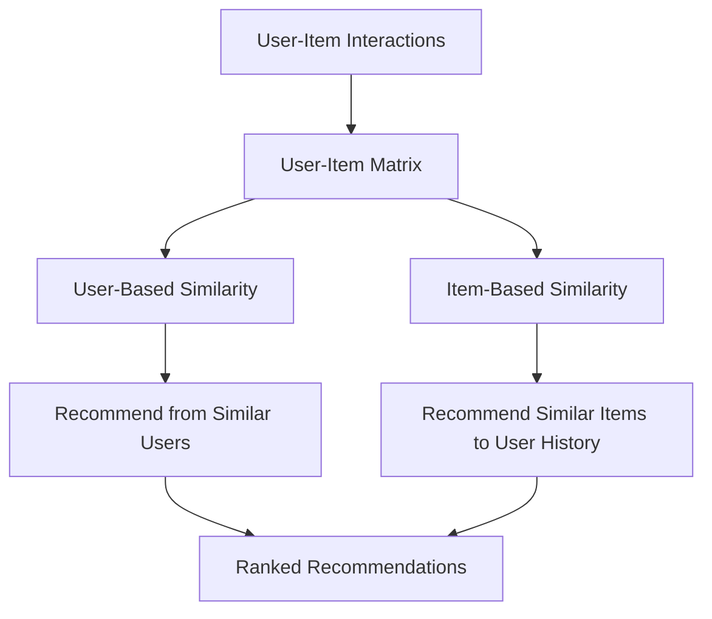
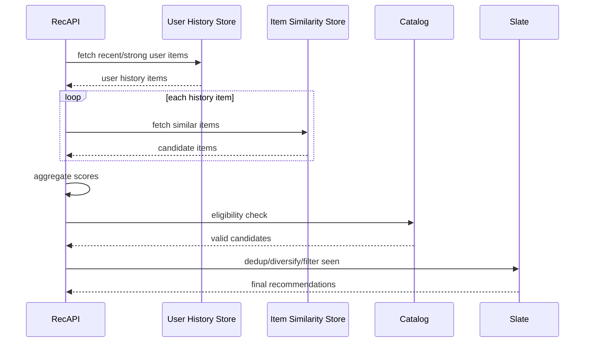
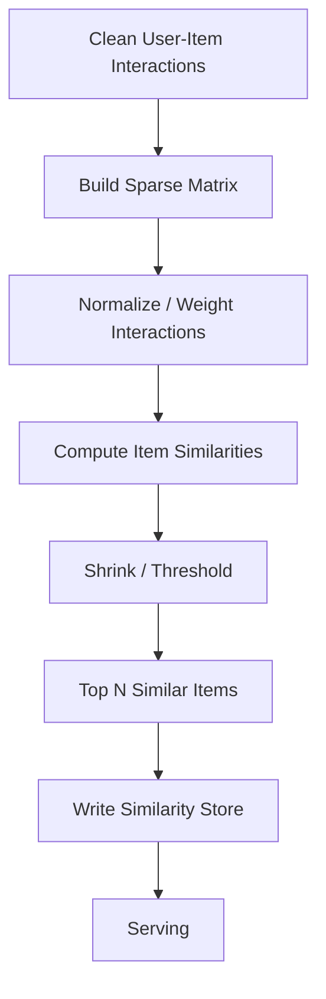
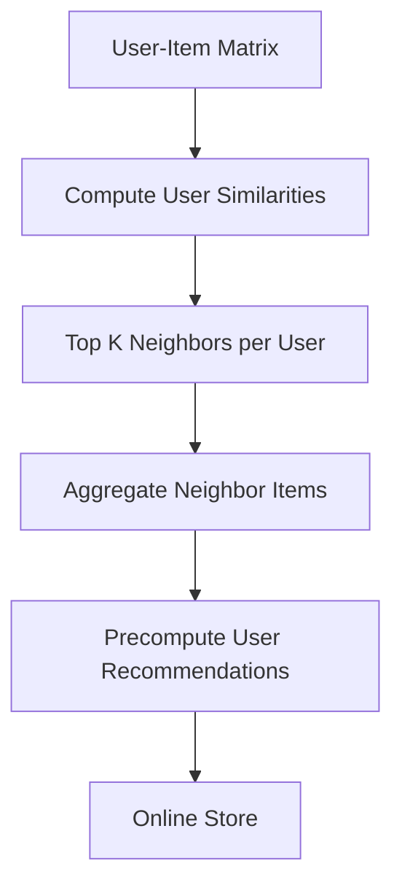

------
title: Build From Scratch Recommendations System - Part 021
description: Membangun user-item collaborative filtering production-grade: interaction matrix, user-based dan item-based neighborhood, similarity metrics, implicit feedback, sparsity, normalization, explainability, cold-start, evaluation, dan serving trade-offs.
series: learn-build-from-scratch-recommendations-system
seriesTitle: Build From Scratch: Enterprise Recommendations System
order: 21
partTitle: User-Item Collaborative Filtering
tags:
  - recommendation-system
  - recsys
  - collaborative-filtering
  - user-item
  - neighborhood-methods
  - machine-learning
  - series
date: 2026-07-02
---

# Part 021 — User-Item Collaborative Filtering

Collaborative filtering berangkat dari ide yang sangat kuat:

> User yang punya pola interaksi mirip kemungkinan menyukai item yang mirip. Item yang disukai oleh user-user yang mirip kemungkinan saling terkait.

Berbeda dari content-based recommendation yang melihat metadata item, collaborative filtering melihat **pola interaksi kolektif**.

Ia bisa menemukan hubungan yang tidak eksplisit di metadata.

Contoh:

- User yang membaca artikel Java concurrency juga membaca artikel Kafka partitioning.
- User yang membeli kamera tertentu juga membeli memory card tertentu.
- Investigator yang memakai knowledge article A sering juga memakai escalation checklist B.
- User yang menonton video distributed tracing juga menonton video incident postmortem.

Hubungan ini tidak selalu tertulis di category atau tag. Ia muncul dari perilaku.

Part ini membahas collaborative filtering klasik berbasis user-item matrix dan neighborhood methods: user-based CF, item-based CF, similarity metrics, implicit feedback, sparsity, normalization, explainability, cold-start, dan production trade-offs.

---

## 1. Mental Model: User-Item Matrix

Collaborative filtering dimulai dari matrix.

Baris = user.  
Kolom = item.  
Nilai = interaksi/preference.

```text
              item_A  item_B  item_C  item_D  item_E
user_1          1       1       ?       0       ?
user_2          1       ?       1       ?       ?
user_3          ?       1       ?       1       ?
user_4          0       ?       1       1       ?
```

Tanda `?` bukan berarti user tidak suka. Itu berarti **unknown/unobserved**.

Collaborative filtering mencoba mengisi nilai yang belum diketahui:

```text
score(user, item) = estimated preference
```

Ada dua pendekatan neighborhood klasik:

1. **User-based CF**  
   Cari user mirip, rekomendasikan item yang mereka sukai.

2. **Item-based CF**  
   Cari item mirip dengan item yang disukai user.

Diagram:



---

## 2. Explicit vs Implicit Matrix

### Explicit Feedback

Nilai matrix berasal dari rating langsung.

```text
rating(user, item) = 1..5
```

Contoh:

```text
user_1 rates movie_A = 5
user_1 rates movie_B = 2
```

Lebih mudah secara semantic, tetapi jarang.

### Implicit Feedback

Nilai matrix berasal dari behavior.

```text
click
view
watch
purchase
save
like
hide
skip
```

Untuk production recommendation modern, implicit feedback jauh lebih umum.

Matrix implicit sering diubah menjadi:

```text
preference p_ui = 1 if positive interaction observed else 0
confidence c_ui = strength of evidence
```

Important:

```text
p_ui = 0 does not mean dislike.
It often means unknown with low confidence.
```

---

## 3. Interaction Strength

Tidak semua interaction sama.

Example e-commerce:

```text
view = 1
click = 2
add_to_cart = 4
purchase = 6
repeat_purchase = 8
hide = negative
return = negative correction
```

Content:

```text
impression = weak
click/open = 1
long dwell = 2
complete = 4
like/save = 5
follow creator = 6
not interested = negative
```

Interaction score:

```text
r_ui = sum(event_weight * recency_decay)
```

Example:

```text
r(user, item) =
  1.0 * clicks
  + 3.0 * add_to_cart
  + 5.0 * purchases
  - 4.0 * hides
```

Use carefully. Arbitrary weights can distort behavior. Keep weights versioned.

---

## 4. Binarization

Sometimes convert interactions to binary:

```text
1 if user has positive interaction with item
0 otherwise
```

Good for:

- simple CF,
- large-scale sparse binary matrix,
- item-item similarity,
- retrieval candidate generation.

Bad because:

- loses strength,
- click and purchase treated same,
- repeated interactions ignored,
- negative feedback ignored.

Better:

```text
binary preference + confidence weight
```

Example:

```text
preference = 1
confidence = log1p(weighted_interaction_count)
```

---

## 5. User-Based Collaborative Filtering

Idea:

> Find users similar to target user, then recommend items those users liked.

Steps:

1. Build user-item vectors.
2. Compute similarity between users.
3. Select top-K similar users.
4. Aggregate their item interactions.
5. Filter items already seen/consumed.
6. Rank.

Formula:

```text
score(u, i) =
  sum(sim(u, v) * r(v, i)) over neighbor users v
  / sum(abs(sim(u, v)))
```

Example:

```text
User A liked items: X, Y
User B liked items: X, Y, Z
User C liked items: X, Y, W

Recommend Z and W to User A.
```

User-based CF is intuitive but can be expensive at scale.

---

## 6. Item-Based Collaborative Filtering

Idea:

> Recommend items similar to items user liked.

Steps:

1. Build item-item similarity from user-item matrix.
2. For each user, take interacted items.
3. Fetch similar items for each interacted item.
4. Aggregate scores.
5. Filter seen/purchased/hidden.
6. Rank.

Formula:

```text
score(u, j) =
  sum(sim(i, j) * r(u, i)) over items i interacted by user
```

Item-based CF is often more production-friendly because item-item similarity can be precomputed.

This connects closely to Part 020 co-occurrence, but collaborative filtering typically works from user-item matrix and similarity metrics more generally.

---

## 7. User-Based vs Item-Based Trade-Off

| Aspect | User-Based CF | Item-Based CF |
|---|---|---|
| Intuition | similar users | similar items |
| Scalability | harder if many users | easier to precompute |
| Stability | user behavior changes fast | item similarity more stable |
| Cold user | weak | weak unless context/history exists |
| Cold item | weak | weak until interactions exist |
| Explainability | “users like you” | “similar to item you liked” |
| Serving | expensive online | fast with item-to-item store |
| Privacy concern | can feel sensitive | usually safer UX |

Production systems often prefer item-based CF for baseline collaborative candidate generation.

---

## 8. Similarity Metrics

Collaborative filtering depends on similarity.

Common metrics:

- cosine similarity,
- Pearson correlation,
- Jaccard similarity,
- adjusted cosine,
- overlap coefficient,
- log-likelihood / lift / PMI variants,
- shrinkage-adjusted similarity.

Metric choice changes behavior.

---

## 9. Cosine Similarity

For vectors:

```text
cosine(a,b) = dot(a,b) / (||a|| * ||b||)
```

For item vectors over users:

```text
sim(item_i, item_j) =
  users who interacted with both
  / sqrt(users who interacted with i * users who interacted with j)
```

Good:

- simple,
- scalable,
- works for sparse binary/count vectors,
- popularity-normalized better than raw co-count.

Problem:

- still biased by popularity,
- ignores rating scale bias unless normalized,
- rare pairs can be noisy.

Use minimum overlap/shrinkage.

---

## 10. Pearson Correlation

For explicit ratings:

```text
sim(u,v) =
  correlation between ratings after subtracting user means
```

Useful when users use rating scales differently.

Example:

- User A rates everything high.
- User B rates strictly.
- Pearson accounts for relative preference.

Formula concept:

```text
rating centered by user mean
```

Less useful for pure implicit feedback.

---

## 11. Adjusted Cosine

For item-based explicit rating:

```text
subtract user average rating before computing item similarity
```

This handles user rating bias.

Example:

```text
some users rate all items 5
some rate all items 3
```

Adjusted cosine focuses on deviations from each user's baseline.

---

## 12. Jaccard Similarity

For binary interactions:

```text
sim(A,B) = |users(A) ∩ users(B)| / |users(A) ∪ users(B)|
```

Good:

- simple,
- interpretable,
- robust for set overlap.

Bad:

- can penalize popular items heavily,
- ignores interaction strength,
- can be sparse.

---

## 13. Shrinkage

Similarity based on tiny overlap is unreliable.

Example:

```text
item A and B both interacted by 1 same user
cosine may look high
```

Shrinkage reduces similarity when evidence is small.

```text
sim_shrunk = sim_raw * overlap / (overlap + shrinkage)
```

If overlap low, score shrinks toward zero.

This is extremely important in production.

---

## 14. Minimum Support

Before considering similarity:

```text
overlap_count >= min_overlap
item_count >= min_item_count
user_count >= min_user_count
```

Example:

```yaml
min_item_interactions: 20
min_pair_overlap: 5
min_unique_users: 5
```

Thresholds depend on traffic.

Without minimum support, rare accidental relationships pollute recommendations.

---

## 15. Normalization

Raw user-item matrix has biases:

- some users interact with many items,
- some items are globally popular,
- some surfaces generate more impressions,
- some categories have higher engagement,
- some users click everything,
- some users rarely click.

Normalization strategies:

### User normalization

Downweight users with huge histories.

```text
each user contributes total weight 1 per window
```

### Item popularity normalization

Reduce dominance of very popular items.

### Event strength normalization

Cap repeated events.

```text
r_ui = log1p(count)
```

### Recency normalization

Recent interactions matter more.

---

## 16. Recency Decay

User interests change.

Weight interaction by recency:

```text
weight = event_weight * exp(-lambda * age)
```

For user profile scoring:

```text
recent purchase > purchase 2 years ago
```

But domain matters:

- music taste may last years,
- shopping session intent lasts hours/days,
- professional interest can last months,
- case workflow context lasts until case state changes.

Recency policy should be domain/surface-specific.

---

## 17. Implicit Confidence

Implicit CF often uses confidence:

```text
p_ui = 1 if interaction exists else 0
c_ui = 1 + alpha * r_ui
```

Where `r_ui` is interaction strength.

Interpretation:

- observed interaction gives confidence user has preference,
- unobserved item has low confidence unknown,
- repeated/strong interaction increases confidence.

This mental model leads naturally to matrix factorization in Part 022.

---

## 18. Prediction for User-Based CF

Suppose user `u` has neighbors `N(u)`.

```text
score(u, item_i) =
  weighted average of neighbor interactions with item_i
```

Example:

```text
neighbor_1 sim=0.9 interacted item_X=1
neighbor_2 sim=0.7 interacted item_X=1
neighbor_3 sim=0.2 interacted item_X=0

score = 0.9 + 0.7 = 1.6
```

Filter items user already consumed.

Sort by score.

---

## 19. Prediction for Item-Based CF

Suppose user interacted with items A, B, C.

Candidate item X score:

```text
score(user, X) =
  sim(A,X) * r(user,A)
  + sim(B,X) * r(user,B)
  + sim(C,X) * r(user,C)
```

This is easy to explain:

```text
Recommended because it is similar to A and B.
```

Item-based CF can use precomputed top similar items per item.

---

## 20. Serving Architecture: Item-Based CF



This architecture is fast if:

- user history is bounded,
- item similarity lists are precomputed,
- candidate aggregation is efficient.

---

## 21. User History Selection

Do not use entire user history online.

Select useful seeds:

- last N clicked items,
- recent purchases,
- saved/liked items,
- completed content,
- high-confidence interactions,
- session items,
- long-term representative items.

Example:

```yaml
history_seed_policy:
  max_recent_clicks: 20
  max_purchases: 20
  max_likes: 20
  lookback_days: 90
  exclude_hidden: true
  recency_decay: true
```

If user history huge, cap and summarize.

---

## 22. Candidate Aggregation

One user history item can produce 100 similar items. With 50 history items, 5,000 candidates.

Need aggregation.

For each candidate:

```text
candidate_score += seed_weight * similarity(seed, candidate)
```

Also track evidence:

```json
{
  "candidate_item_id": "item_X",
  "score": 2.37,
  "evidence": [
    {"seed_item_id": "item_A", "similarity": 0.82},
    {"seed_item_id": "item_B", "similarity": 0.44}
  ]
}
```

Limit:

- top M seeds,
- top N similar per seed,
- keep top K aggregated candidates.

---

## 23. Filtering

Filter:

- items already seen recently,
- purchased/consumed items,
- hidden/not interested,
- same dedup group,
- unavailable,
- policy blocked,
- unauthorized,
- wrong region,
- wrong surface,
- too many from same category/creator.

Collaborative filtering can produce strong but invalid candidates. Final eligibility is mandatory.

---

## 24. Explainability

Item-based CF explanation:

```text
Because you viewed A
Because you bought B
Because it is often liked with C
Users who watched A also watched this
```

User-based CF explanation is more sensitive:

```text
Users similar to you liked this
```

This can feel creepy or vague. Prefer item-based explanations when possible.

Store evidence seeds for explanation and debugging.

---

## 25. Sparsity

User-item matrix is mostly empty.

Example:

```text
10M users * 1M items = 10^13 possible cells
observed interactions = 10^9
density = 0.01%
```

Sparsity problems:

- many users have few interactions,
- many items have few interactions,
- similarity noisy,
- cold start,
- long-tail poor coverage.

Mitigation:

- use implicit feedback broadly,
- aggregate by category/topic,
- use content-based fallback,
- use smoothing/shrinkage,
- use matrix factorization,
- use embeddings,
- use exploration.

---

## 26. Cold Start

### Cold User

No history -> CF cannot personalize.

Fallback:

- popularity,
- trending,
- context,
- onboarding,
- content-based from session/query,
- editorial.

### Cold Item

No interactions -> CF cannot recommend.

Fallback:

- content-based,
- new item exploration,
- editorial boost,
- category popularity,
- creator/seller prior.

Collaborative filtering alone is insufficient for cold-start.

---

## 27. Popularity Bias

CF can amplify popularity.

Popular items appear in many user histories and many similar lists.

Mitigation:

- normalize similarity,
- use lift/PMI-like metrics,
- shrinkage,
- diversity/reranking,
- cap globally dominant candidates,
- segment-specific evaluation,
- exploration for long-tail.

Monitor:

```text
catalog coverage
long-tail exposure
top item concentration
Gini coefficient of exposure
```

---

## 28. Privacy Considerations

User-based CF can feel like exposing other users’ behavior.

Avoid explanations like:

```text
John and Maria bought this.
```

Use aggregate explanations.

For enterprise, ensure tenant isolation:

```text
do not compute user similarity across tenants if not allowed
```

For sensitive domains, collaborative signals can reveal hidden associations. Use access control and privacy review.

---

## 29. Enterprise Collaborative Filtering

Enterprise use cases:

- similar investigators use these knowledge articles,
- cases with similar action histories used this checklist,
- teams resolving similar cases followed this escalation path,
- agents with similar role/context used this document.

But constraints are strict:

- tenant isolation,
- role permissions,
- jurisdiction,
- state-machine validity,
- auditability,
- no leakage of confidential case existence.

Collaborative signal should be one evidence source, not sole decision-maker.

Example score:

```text
score(action) =
  collaborative_usage_score
  + policy_priority
  + case_state_validity
  + historical_success_rate
```

Invalid actions are filtered before scoring.

---

## 30. Offline Evaluation

For CF:

- leave-last-interaction-out by time,
- temporal split,
- Recall@K,
- HitRate@K,
- NDCG@K,
- coverage,
- novelty,
- diversity,
- cold user/item slice,
- popularity bias metrics.

Do not use random interaction split as main metric.

For each user:

```text
history before time T -> recommend -> did held-out item appear?
```

Candidate set should be realistic.

---

## 31. Online Metrics

Depending surface:

- CTR,
- add-to-cart,
- purchase,
- watch completion,
- session continuation,
- hide/not interested,
- report,
- retention,
- attach rate,
- case action acceptance,
- knowledge article usefulness.

Also monitor:

- empty result rate,
- fallback rate,
- coverage,
- latency,
- stale similarity list rate,
- top candidate concentration.

---

## 32. Computational Complexity

User-based CF naive:

```text
compute similarity target user to all users
```

Too expensive at scale.

Item-based CF:

```text
precompute item-item similarity offline
```

More scalable if item count manageable and top-N sparse.

For large catalogs:

- use approximate methods,
- only compute pairs with co-occurrence,
- use blocking,
- use sparse matrix operations,
- limit top-N per item,
- batch update.

---

## 33. Sparse Matrix Representation

Do not store dense matrix.

Use sparse formats:

- COO: `(row, col, value)`
- CSR: compressed sparse row
- CSC: compressed sparse column

For item-based similarity, item-user inverted index is useful.

Conceptually:

```text
item -> list of users who interacted
user -> list of items interacted
```

Pair generation from baskets/user histories is often easier than full matrix multiplication.

---

## 34. Batch Pipeline for Item-Based CF



Input interactions must be deduped, filtered, and time-bounded.

---

## 35. Batch Pipeline for User-Based CF

User-based can precompute user neighborhoods for active users.



But user graph changes quickly and user count can be huge. This approach is more expensive.

Use for:

- smaller systems,
- enterprise tenant-local user groups,
- offline batch recommendations,
- email digests,
- low-QPS surfaces.

---

## 36. Batch vs Online CF

### Batch Precompute

Good for:

- low latency,
- email/push,
- item-to-item store,
- stable recommendations.

Bad:

- stale,
- less context-aware.

### Online Aggregation

Good for:

- session-aware,
- recent behavior,
- context adaptation.

Bad:

- latency,
- feature dependencies,
- more failure modes.

Hybrid:

```text
precomputed item similarity
+ online user history aggregation
```

This is common and practical.

---

## 37. Updating Similarity

How often recompute?

- hourly for fast content/news,
- daily for e-commerce/content,
- weekly for stable catalog,
- on-demand for enterprise policy changes.

Incremental updates are possible but complex.

Start with batch recompute and monitor staleness.

Critical catalog/policy changes should be filtered at serving even if similarity list stale.

---

## 38. Neighborhood Size

Parameters:

```text
K similar users
N similar items per item
M user history seeds
TopK final candidates
```

Trade-offs:

- larger K/N improves recall,
- increases latency and noise,
- more filtering/dedup needed.

Typical starting points:

```text
similar items per seed: 100
user history seeds: 20-50
final candidates: 200-1000 before ranker
```

Tune by surface and latency.

---

## 39. Score Calibration

CF scores are often not calibrated probabilities.

Similarity score 0.8 does not mean 80% chance click.

Use CF score as:

- candidate generation score,
- rank feature,
- relative ordering within source.

If combining with other sources, normalize:

```text
source_score_percentile
z-score by source
min-max by source
rank-based score
```

Ranker can learn how to use CF score if logged.

---

## 40. Combining CF with Other Sources

Collaborative filtering is one candidate source.

Blend with:

- popularity,
- trending,
- content-based,
- editorial,
- two-tower retrieval,
- graph,
- search/query,
- business rules.

Candidate provenance:

```json
{
  "item_id": "item_X",
  "sources": [
    {"source": "item_cf", "score": 0.78},
    {"source": "content_based", "score": 0.64}
  ]
}
```

Ranker can use source features later.

---

## 41. Implementation Sketch: Item-Based CF

```java
public record Interaction(
    String userId,
    String itemId,
    double weight,
    long eventTimeEpochMillis
) {}

public record SimilarItem(
    String seedItemId,
    String candidateItemId,
    double similarity,
    long overlap,
    String version
) {}
```

Similarity with shrinkage:

```java
public final class CosineSimilarityWithShrinkage {
    private final double shrinkage;

    public double score(double dotProduct, double normA, double normB, long overlap) {
        if (normA == 0.0 || normB == 0.0) {
            return 0.0;
        }

        double raw = dotProduct / (normA * normB);
        double shrink = overlap / (overlap + shrinkage);
        return raw * shrink;
    }
}
```

Serving aggregation:

```java
public final class ItemBasedCfCandidateGenerator {
    public List<Candidate> generate(UserHistory history, int limit) {
        Map<String, CandidateAccumulator> acc = new HashMap<>();

        for (HistoryItem seed : history.topSeeds()) {
            for (SimilarItem sim : similarityStore.getSimilar(seed.itemId())) {
                if (history.hasSeen(sim.candidateItemId())) {
                    continue;
                }

                acc.computeIfAbsent(sim.candidateItemId(), CandidateAccumulator::new)
                   .add(seed.itemId(), seed.weight() * sim.similarity());
            }
        }

        return acc.values().stream()
            .map(CandidateAccumulator::toCandidate)
            .sorted(Comparator.comparing(Candidate::score).reversed())
            .limit(limit)
            .toList();
    }
}
```

This is conceptually simple and production-usable.

---

## 42. Common Anti-Patterns

### 42.1 Treat Unknown as Dislike

Most matrix cells are unknown, not negative.

### 42.2 Raw Co-count as Similarity

Popular items dominate.

### 42.3 No Shrinkage

Rare pairs look too strong.

### 42.4 No Recency

Ancient interests dominate.

### 42.5 Use Entire User History Online

Latency and stale preference problems.

### 42.6 No Eligibility Filter

Invalid items get recommended.

### 42.7 No Dedup

Variants/repeated items flood slate.

### 42.8 No Cold-Start Fallback

New users/items get empty recs.

### 42.9 Cross-Tenant Similarity

Enterprise data leakage.

### 42.10 Explain with Individual Users

Privacy and trust issue.

---

## 43. Minimal Production CF Plan

Start with item-based CF:

```yaml
interaction_source:
  - click
  - add_to_cart
  - purchase
  - watch_complete
weighting:
  click: 1
  add_to_cart: 3
  purchase: 5
  watch_complete: 4
  hide: exclude_or_negative
time_window: 90d
normalization:
  per_user_cap: true
  log1p_counts: true
similarity:
  metric: cosine
  shrinkage: 50
  min_overlap: 5
  min_item_interactions: 20
output:
  top_similar_per_item: 200
serving:
  user_seed_limit: 50
  candidate_limit: 500
  filters:
    - eligibility
    - availability
    - suppression
    - dedup
fallback:
  - content_based
  - segment_popularity
```

This is a strong collaborative candidate source.

---

## 44. Checklist Collaborative Filtering Readiness

```text
[ ] Interaction semantics are defined.
[ ] Implicit feedback is weighted intentionally.
[ ] Unknown is not treated as strong negative.
[ ] User-item matrix is time-bounded.
[ ] Bot/internal/test traffic is excluded.
[ ] Similarity metric is chosen and versioned.
[ ] Minimum support threshold exists.
[ ] Shrinkage is applied.
[ ] Recency decay or time window exists.
[ ] User contribution is capped/normalized.
[ ] Item granularity is intentional.
[ ] Similarity store is versioned.
[ ] Serving uses bounded user history.
[ ] Seen/purchased/hidden items are filtered.
[ ] Eligibility/policy/availability filters run online.
[ ] Dedup/diversity constraints exist.
[ ] Cold-start fallback exists.
[ ] Evaluation uses temporal split.
[ ] Metrics include coverage and popularity bias.
[ ] Enterprise tenant/access boundaries are enforced if applicable.
```

---

## 45. Kesimpulan

User-item collaborative filtering adalah fondasi penting sebelum masuk matrix factorization dan retrieval embeddings.

Prinsip utama:

1. Collaborative filtering belajar dari pola kolektif, bukan metadata.
2. User-item matrix sangat sparse; unknown bukan dislike.
3. User-based CF intuitif tetapi sulit scale.
4. Item-based CF lebih production-friendly dan explainable.
5. Similarity metric harus dinormalisasi, di-shrink, dan diberi threshold.
6. Interaction strength, recency, dan confidence penting.
7. Cold-start tetap membutuhkan content/popularity/editorial fallback.
8. Eligibility dan suppression tetap wajib.
9. CF score biasanya relative, bukan calibrated probability.
10. Untuk enterprise, collaborative signal harus permission-aware dan tidak melanggar tenant isolation.

Di Part 022, kita akan membangun **Matrix Factorization From Scratch**: bagaimana user dan item direpresentasikan sebagai latent vectors, bagaimana objective implicit feedback bekerja, dan bagaimana hasilnya menjadi jembatan menuju embedding retrieval modern.
