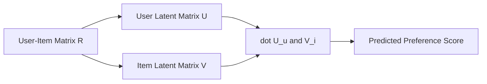
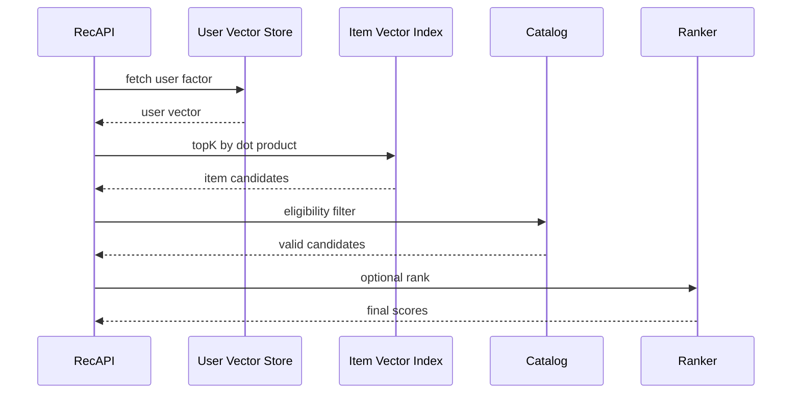
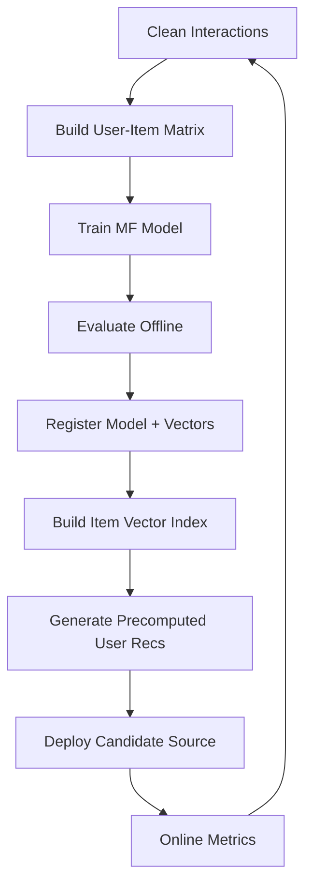

------
title: Build From Scratch Recommendations System - Part 022
description: Membangun matrix factorization dari nol untuk recommendation system production-grade: latent factors, explicit dan implicit objective, SGD, ALS, regularization, negative confidence, evaluation, serving embeddings, cold-start, dan operational trade-offs.
series: learn-build-from-scratch-recommendations-system
seriesTitle: Build From Scratch: Enterprise Recommendations System
order: 22
partTitle: Matrix Factorization From Scratch
tags:
  - recommendation-system
  - recsys
  - matrix-factorization
  - latent-factors
  - collaborative-filtering
  - machine-learning
  - series
date: 2026-07-02
---

# Part 022 — Matrix Factorization From Scratch

Collaborative filtering berbasis neighborhood mencari kemiripan user atau item dari matrix interaksi.

Matrix factorization mengambil langkah berbeda:

> Daripada menyimpan similarity eksplisit antar user atau item, kita belajar representasi laten untuk user dan item.

Setiap user menjadi vector.  
Setiap item menjadi vector.  
Preference diprediksi dari dot product kedua vector.

```text
score(user, item) = dot(user_vector, item_vector)
```

Ini sederhana, tetapi sangat kuat.

Matrix factorization adalah jembatan penting dari collaborative filtering klasik menuju embedding retrieval modern, two-tower models, dan deep recommendation systems.

Part ini membangun matrix factorization dari nol: mental model, objective explicit/implicit feedback, SGD, ALS, regularization, bias terms, confidence weighting, negative sampling intuition, evaluation, serving embeddings, dan production trade-offs.

---

## 1. Mental Model: Factorize the Interaction Matrix

User-item matrix besar dan sparse.

```text
R ≈ U × Vᵀ
```

Where:

- `R` = user-item interaction/preference matrix
- `U` = user latent matrix
- `V` = item latent matrix

If we choose latent dimension `k`:

```text
user_vector[u] = k-dimensional vector
item_vector[i] = k-dimensional vector
```

Prediction:

```text
r_hat(u,i) = dot(user_vector[u], item_vector[i])
```

Diagram:



Latent dimensions are not manually named, but they often capture hidden patterns:

- price sensitivity,
- genre/topic taste,
- creator affinity,
- beginner vs expert,
- mainstream vs niche,
- workflow style,
- risk/action preference.

---

## 2. Why Factorization Works

Suppose users who like Java concurrency also like Kafka internals. The model can learn a latent factor for “deep backend systems”.

Suppose users who buy cameras also buy lenses, but not all lenses. The model can learn factors for “photography setup”.

These factors are not explicitly coded. They emerge from co-interaction patterns.

Matrix factorization compresses sparse behavior into dense vectors.

Benefits:

- handles sparse matrix better than raw neighborhood in many cases,
- gives compact user/item embeddings,
- can score any known user-item pair quickly,
- useful as candidate generation source,
- item vectors can be indexed,
- strong baseline for collaborative recommendation.

Limitations:

- cold-start users/items weak,
- pure collaborative signal ignores content/context,
- static unless retrained/updated,
- dot product may over-recommend popular items,
- explainability weaker than rule/content-based,
- temporal/context effects need extensions.

---

## 3. Explicit Feedback Matrix Factorization

For explicit rating:

```text
r_ui = rating user u gave item i
```

Objective:

```text
minimize sum((r_ui - dot(p_u, q_i))^2)
```

Where:

- `p_u` = user vector
- `q_i` = item vector

With regularization:

```text
loss =
  sum((r_ui - p_u · q_i)^2)
  + λ * (||p_u||^2 + ||q_i||^2)
```

This works for ratings.

But most production systems use implicit feedback.

---

## 4. Adding Bias Terms

Ratings/preferences have global/user/item bias.

Prediction:

```text
r_hat(u,i) =
  global_mean
  + user_bias[u]
  + item_bias[i]
  + dot(p_u, q_i)
```

Bias captures:

- generally popular items,
- users who rate/click more,
- baseline tendency.

For implicit ranking, bias terms can help but may also amplify popularity if not controlled.

---

## 5. Implicit Feedback Problem

In implicit data, we don't have clean ratings.

We have:

```text
clicks
views
purchases
watch completions
likes
hides
```

Common transformation:

```text
p_ui = 1 if user interacted with item, else 0
c_ui = 1 + alpha * interaction_strength
```

Where:

- `p_ui` = binary preference
- `c_ui` = confidence

Interpretation:

```text
observed interaction means likely preference with confidence
unobserved means unknown/weak negative with low confidence
```

Objective:

```text
minimize sum(c_ui * (p_ui - dot(p_u, q_i))^2)
```

This is implicit matrix factorization.

Key idea:

> We do not say unobserved items are strong negatives. We give them low confidence.

---

## 6. Interaction Strength for Implicit MF

Interaction strength `r_ui` can be:

```text
click_count
purchase_count
weighted_event_count
watch_time
completion_count
add_to_cart_count
```

Then:

```text
c_ui = 1 + alpha * log1p(r_ui)
```

Use log to cap repeated behavior.

Example:

```text
r_ui = 1 click -> c = 1 + alpha * 0.69
r_ui = 100 clicks -> c = 1 + alpha * 4.61
```

Without log/cap, power users/repeated events dominate.

---

## 7. Confidence vs Preference

Important distinction:

```text
p_ui = 1
c_ui = how sure we are
```

If user purchased item 3 times:

```text
p_ui = 1
c_ui = high
```

If user clicked once:

```text
p_ui = 1
c_ui = medium
```

If user never saw item:

```text
p_ui = 0
c_ui = low
```

If user explicitly hid item:

Could model as:

```text
negative preference
```

or handle separately.

Standard implicit MF is better at positive-only data than explicit negative events. You can incorporate negative feedback carefully, but do not mix report/policy events blindly.

---

## 8. Objective as Ranking Approximation

Implicit MF objective is not directly optimizing NDCG or Recall@K. It approximates preference reconstruction.

The model learns:

```text
observed positives should score higher than unobserved low-confidence items
```

For retrieval/candidate generation, this is often good enough.

For final ranking, use richer ranker later.

Matrix factorization is commonly a candidate generator or feature source, not final decision system.

---

## 9. SGD Training: Simple Version

For observed explicit ratings:

Prediction:

```text
err = r_ui - dot(p_u, q_i)
```

Update:

```text
p_u += learning_rate * (err * q_i - λ * p_u)
q_i += learning_rate * (err * p_u - λ * q_i)
```

For implicit sampled training, you can sample positives and negatives and optimize pairwise/logistic loss. But classic implicit MF often uses ALS.

Still, SGD mental model is useful: adjust user and item vectors so positives have higher dot product.

---

## 10. ALS Training

ALS = Alternating Least Squares.

Idea:

1. Fix item vectors, solve user vectors.
2. Fix user vectors, solve item vectors.
3. Repeat.

Why useful?

With one side fixed, optimizing the other side becomes least squares.

Implicit ALS can handle confidence weights efficiently for sparse data.

Conceptual loop:

```text
initialize item vectors randomly
repeat:
  for each user:
    solve best user vector given item vectors
  for each item:
    solve best item vector given user vectors
```

ALS is popular for large-scale implicit matrix factorization because it parallelizes well.

---

## 11. Latent Dimension

Dimension `k` controls capacity.

Examples:

```text
k = 16, 32, 64, 128, 256
```

Low k:

- simpler,
- faster,
- less overfit,
- less expressive.

High k:

- more expressive,
- more memory,
- more overfit risk,
- more expensive serving/indexing.

Start simple:

```text
k = 64
```

Then tune.

Evaluate by recall, coverage, latency, and online impact.

---

## 12. Regularization

Regularization prevents vectors from growing too large and overfitting.

Loss includes:

```text
λ * (||p_u||^2 + ||q_i||^2)
```

Higher λ:

- smoother,
- less overfit,
- worse fit if too high.

Lower λ:

- more fit,
- more overfit,
- unstable rare users/items.

Rare users/items especially need regularization.

---

## 13. Initialization

Initialize vectors small random.

```text
p_u ~ Normal(0, 0.01)
q_i ~ Normal(0, 0.01)
```

Bad initialization can slow training.

For warm-start:

- initialize item vectors from previous model,
- initialize new user from average/segment vector,
- initialize new item from category/content vector if hybrid.

Classic MF cold-start new item has no learned vector unless trained or initialized.

---

## 14. Data Preparation

Input interactions:

```text
user_id
item_id
interaction_strength
event_time
```

Build matrix:

```text
r_ui = aggregate interactions within window
```

Example aggregation:

```text
r_ui =
  1 * clicks
  + 3 * add_to_cart
  + 5 * purchases
  + 2 * watch_completions
```

Apply:

- bot/internal filtering,
- dedup,
- recency decay,
- log1p,
- cap per user/item,
- exclude invalid items,
- consent rules,
- tenant boundaries.

Bad input produces bad embeddings.

---

## 15. Time Window

Matrix factorization can use a time window.

Examples:

```text
last 30d
last 90d
last 180d
all-time with decay
```

Window trade-off:

- short window: fresh, less data, more sparse.
- long window: stable, stale preferences.
- decay: compromise.

For e-commerce, 90d may be reasonable.  
For news, hours/days.  
For enterprise knowledge, 180d+ may help if policies stable, but policy version matters.

---

## 16. Recency Decay in Matrix

Interaction weight:

```text
r_ui += event_weight * exp(-lambda * age)
```

This makes recent behavior stronger.

But if you train daily, event age relative to training cutoff must be consistent.

Do not include future interactions relative to evaluation split.

---

## 17. Negative Feedback

How to handle hide/dislike/return?

Options:

### 17.1 Exclude from positives and use suppression separately

Safe default.

### 17.2 Negative interaction strength

Could push score down, but objective must support signed preferences.

### 17.3 Separate negative profile/model

Train positive MF and use negative feedback in reranking/suppression.

### 17.4 Pairwise loss with explicit negatives

More flexible.

For early production, prefer:

```text
positive MF for candidate generation
+ explicit negative suppression/filtering
+ ranker features for negative feedback
```

Do not let report/policy events become ordinary negative ratings.

---

## 18. Popularity Bias in MF

MF can over-recommend popular items.

Reasons:

- popular items have many positives,
- dot product learns broad appeal,
- unobserved low-confidence negatives weak.

Mitigation:

- item/user normalization,
- downweight very popular interactions,
- sample negatives popularity-aware,
- use ranking/reranking diversity,
- include novelty penalty,
- evaluate long-tail coverage,
- use item bias carefully,
- post-filter top item concentration.

Candidate generation can include MF but final slate should balance diversity.

---

## 19. Cold Start

MF cannot learn vector for user/item with no interactions.

### New User

Options:

- average user vector,
- segment vector,
- onboarding-derived vector,
- session vector,
- content-based fallback,
- popularity baseline.

### New Item

Options:

- average item vector,
- category vector,
- content embedding mapping,
- exploration,
- hybrid model,
- retrain/incremental update after interactions.

Pure MF is not enough for cold-start.

---

## 20. Serving: Scoring All Items

Naive recommendation:

```text
for user u:
  score all items i = dot(p_u, q_i)
  return top K
```

If 10M items, full scan is expensive.

Options:

1. Precompute top-N per user offline.
2. Use ANN/vector index over item factors.
3. Score only candidate subset.
4. Segment users and precompute.
5. Use MF as rank feature, not source.

For online personalized retrieval, item vectors can be indexed and user vector used as query.

---

## 21. MF as Embedding Retrieval

Item factors are embeddings.

User vector query:

```text
ANN.search(user_vector, topK=1000)
```

Because score is dot product, use vector index supporting inner product.

Serving flow:



This is the conceptual bridge to two-tower retrieval.

---

## 22. Precomputed Recommendations

For low-latency:

```text
daily/hourly job computes top N items per user
```

Store:

```json
{
  "user_id": "u123",
  "model_version": "implicit-mf-20260702",
  "generated_at": "2026-07-02T02:00:00Z",
  "items": [
    {"item_id": "item_101", "score": 12.4},
    {"item_id": "item_202", "score": 11.9}
  ]
}
```

Serving applies final filters.

Pros:

- very fast,
- simple,
- good for email/push/homepage.

Cons:

- stale,
- storage heavy,
- not context/session-aware,
- hard for large user base.

---

## 23. Online User Vector Updates

User vector from ALS is trained batch.

For recent behavior, you can update user vector nearline:

Options:

1. Recompute user vector from fixed item vectors using recent interactions.
2. Blend batch user vector with session vector.
3. Use online learning update.
4. Use ranker/session features instead.

Simpler:

```text
final_query_vector =
  0.7 * batch_user_vector
  + 0.3 * recent_session_item_vector_average
```

This gives freshness without retraining full MF.

---

## 24. Item Vector Lifecycle

Item vector created during training.

Metadata:

```json
{
  "item_id": "item_101",
  "vector_id": "mf_item_101_v5",
  "model_version": "implicit-mf-20260702",
  "dimension": 64,
  "training_data_end": "2026-07-01T00:00:00Z"
}
```

If item deleted/banned, vector may remain in index. Serving must filter or remove index entry.

If item new, no vector. Use content/popularity/exploration fallback.

---

## 25. Evaluation

Offline:

- Recall@K,
- HitRate@K,
- NDCG@K,
- MAP,
- coverage,
- novelty,
- cold user/item performance,
- popularity concentration,
- segment metrics.

Evaluation method:

```text
train on interactions before T
for each user, use history before T
predict held-out interaction after T
```

Avoid random split leakage.

For implicit data, choose test positives carefully:

- purchase,
- meaningful click,
- watch complete,
- accepted action.

---

## 26. Candidate Evaluation

For MF retrieval:

```text
Does topK include future positive item?
```

Example:

```text
Recall@100 = fraction of user future positives found in top 100 candidates
```

High Recall@K matters because ranker can only rank candidates it receives.

But also measure:

- candidate diversity,
- source overlap,
- long-tail coverage,
- eligibility filter loss.

---

## 27. Online Evaluation

MF candidate source should be A/B tested.

Metrics:

- CTR,
- conversion,
- watch completion,
- add-to-cart,
- hide/report,
- retention,
- candidate source contribution,
- ranker usage of MF candidates,
- fallback/empty rate,
- latency,
- long-tail exposure.

MF may improve recall but harm diversity if not controlled.

---

## 28. Explainability

MF latent factors are less explainable.

Possible explanations:

- “Based on items you interacted with”
- “Popular among users with similar behavior”
- use nearest seed item evidence if available,
- combine with item-based CF explanation,
- expose category/topic reason from candidate item.

Do not claim specific reason if model only used latent vector.

For enterprise, pure MF may be insufficiently defensible for high-stakes action recommendation. Use it as candidate/evidence source with rule-based explanation.

---

## 29. Matrix Factorization vs Item-Based CF

| Aspect | Item-Based CF | Matrix Factorization |
|---|---|---|
| Representation | explicit item similarity | latent vectors |
| Serving | fetch similar lists | dot product / ANN |
| Explainability | stronger | weaker |
| Generalization | limited to observed similarity | better latent generalization |
| Cold-start | weak | weak |
| Scalability | good with precompute | good with vectors/ANN |
| Context | limited | limited unless extended |
| Candidate generation | strong | strong |

They complement each other.

---

## 30. Extensions

Matrix factorization can be extended with:

- biases,
- temporal dynamics,
- implicit confidence,
- side features,
- factorization machines,
- Bayesian personalized ranking,
- weighted regularized MF,
- hybrid content factors,
- session factors,
- context-aware factorization.

We will not overbuild here. The point is to understand latent factor mental model.

---

## 31. BPR: Pairwise Ranking View

Bayesian Personalized Ranking style objective:

```text
for user u:
  positive item i should score higher than negative item j
```

Loss concept:

```text
maximize score(u,i) - score(u,j)
```

This fits implicit recommendation well.

Training samples:

```text
(u, positive_item, negative_item)
```

Negative sampling becomes critical.

BPR-like thinking leads toward modern retrieval training.

---

## 32. Factorization Machines

Factorization machines generalize MF by modeling pairwise feature interactions.

Instead of only user_id and item_id, include:

- category,
- brand,
- context,
- device,
- time,
- user segment.

FM learns embeddings for features and interactions.

This is bridge to ranking models like DeepFM/DCN later.

But start with simple MF first. Understand the matrix before adding features.

---

## 33. Multi-Tenant MF

For enterprise/multi-tenant:

Options:

1. Separate model per tenant.
2. Shared model with tenant-specific filters.
3. Shared item vectors but tenant-specific user vectors.
4. Hierarchical model.

Risks:

- tenant data leakage,
- small tenant sparsity,
- different workflows/policies,
- access control.

Default safe design:

```text
strict tenant isolation unless explicit policy allows shared aggregate learning
```

For small tenants, use content/rule baseline plus tenant-local MF if enough data.

---

## 34. Operational Pipeline



Artifacts:

- user factors,
- item factors,
- model metadata,
- training dataset version,
- vector index version,
- precomputed recommendations,
- evaluation report.

---

## 35. Quality Checks

Before deployment:

```text
vector dimension correct
no NaN/Inf values
norm distribution reasonable
item coverage
user coverage
training loss stable
offline recall by segment
top item concentration
cold item performance
index recall
eligibility filter rate
```

Vector norm is important. Huge norms can dominate dot product.

Monitor:

```text
user_vector_norm_distribution
item_vector_norm_distribution
```

---

## 36. Serving Guardrails

MF candidate source must still apply:

- eligibility,
- policy,
- availability,
- suppression,
- dedup,
- diversity,
- frequency cap,
- no-consent rules.

Dot product score cannot override business constraints.

If MF returns mostly invalid/stale items, monitor:

```text
mf_candidate_filter_rate
```

High filter rate means model/index/catalog mismatch.

---

## 37. Retraining Cadence

Factors become stale.

Retrain cadence depends on:

- interaction volume,
- catalog velocity,
- user behavior drift,
- item churn,
- cost,
- online impact.

Typical:

- daily for active consumer systems,
- hourly/nearline for fast domains if needed,
- weekly for stable domains,
- on-demand after major catalog/policy change.

Always compare new model against previous and baseline.

---

## 38. Incremental Updates

Full ALS retraining can be expensive.

Options:

- retrain full batch periodically,
- update user factors more frequently with fixed item factors,
- update new item factors after enough interactions,
- blend with session/content signals,
- use streaming embeddings in more advanced systems.

Do not add complex online updates before monitoring batch model well.

---

## 39. Failure Modes

### 39.1 Popularity Collapse

Top popular items dominate.

### 39.2 Stale Preferences

Old interactions drive recommendations.

### 39.3 Cold-Start Empty

New users/items get nothing.

### 39.4 Vector Norm Explosion

Some items score high for everyone.

### 39.5 Data Leakage

Training uses future interactions.

### 39.6 Cross-Tenant Leakage

Enterprise violation.

### 39.7 Index Staleness

Item vector index contains deleted/banned items.

### 39.8 Low Diversity

Latent similarity returns narrow results.

### 39.9 Explanation Gap

Hard to justify recommendation.

### 39.10 Training-Serving Mismatch

Offline model not same as online vector/index/filter.

---

## 40. Implementation Sketch: Minimal SGD MF

For learning mental model, simple SGD explicit-style code:

```java
public final class MatrixFactorizationModel {
    private final double[][] userFactors;
    private final double[][] itemFactors;
    private final int dimensions;

    public double score(int userIndex, int itemIndex) {
        double sum = 0.0;
        for (int d = 0; d < dimensions; d++) {
            sum += userFactors[userIndex][d] * itemFactors[itemIndex][d];
        }
        return sum;
    }

    public void update(int userIndex, int itemIndex, double target, double learningRate, double lambda) {
        double prediction = score(userIndex, itemIndex);
        double error = target - prediction;

        for (int d = 0; d < dimensions; d++) {
            double userValue = userFactors[userIndex][d];
            double itemValue = itemFactors[itemIndex][d];

            userFactors[userIndex][d] += learningRate * (error * itemValue - lambda * userValue);
            itemFactors[itemIndex][d] += learningRate * (error * userValue - lambda * itemValue);
        }
    }
}
```

This is not full production implicit ALS, but it shows the core: adjust vectors so dot product matches target.

---

## 41. Implementation Sketch: Pairwise Update

For implicit pairwise training:

```text
positive item should score higher than negative item
```

Conceptual update:

```java
public void updatePair(int userIndex, int positiveItemIndex, int negativeItemIndex,
                       double learningRate, double lambda) {
    double positiveScore = score(userIndex, positiveItemIndex);
    double negativeScore = score(userIndex, negativeItemIndex);
    double diff = positiveScore - negativeScore;

    double gradient = 1.0 / (1.0 + Math.exp(diff)); // sigmoid(-diff)

    for (int d = 0; d < dimensions; d++) {
        double u = userFactors[userIndex][d];
        double qi = itemFactors[positiveItemIndex][d];
        double qj = itemFactors[negativeItemIndex][d];

        userFactors[userIndex][d] += learningRate * (gradient * (qi - qj) - lambda * u);
        itemFactors[positiveItemIndex][d] += learningRate * (gradient * u - lambda * qi);
        itemFactors[negativeItemIndex][d] += learningRate * (-gradient * u - lambda * qj);
    }
}
```

This connects MF with negative sampling and ranking.

---

## 42. Minimal Production MF Plan

```yaml
model: implicit_matrix_factorization_v1
interactions:
  positive_events:
    - meaningful_click
    - add_to_cart
    - purchase
    - watch_complete
  weights:
    click: 1
    add_to_cart: 3
    purchase: 5
    watch_complete: 4
  filters:
    - exclude_bot
    - exclude_internal
    - valid_item
    - consent_required
time:
  window: 90d
  recency_decay: true
training:
  dimensions: 64
  regularization: tuned
  objective: implicit_feedback
  split: temporal
serving:
  use_as_candidate_source: true
  item_index: inner_product_ann
  topK: 1000
  filters:
    - eligibility
    - availability
    - suppression
fallback:
  - content_based
  - popularity
monitoring:
  - recall_at_k
  - coverage
  - vector_norm
  - filter_rate
  - top_item_concentration
```

---

## 43. Checklist Matrix Factorization Readiness

```text
[ ] Interaction weights are defined.
[ ] Unknown is treated as low-confidence, not strong dislike.
[ ] Training data is temporal and point-in-time safe.
[ ] Bot/internal/test traffic is filtered.
[ ] Consent/tenant boundaries are enforced.
[ ] Time window/recency policy is explicit.
[ ] Latent dimension is chosen and tuned.
[ ] Regularization is applied.
[ ] Negative sampling/confidence policy is versioned.
[ ] User/item factors are versioned artifacts.
[ ] Vector norms are monitored.
[ ] Offline evaluation uses temporal split.
[ ] Candidate Recall@K is measured.
[ ] Cold-start fallback exists.
[ ] Item vector index version is tracked.
[ ] Online eligibility/suppression filters run.
[ ] MF source contribution is logged.
[ ] Popularity concentration is monitored.
[ ] Model registry references dataset version.
```

---

## 44. Kesimpulan

Matrix factorization adalah salah satu ide paling penting dalam recommendation systems.

Ia mengubah sparse user-item interactions menjadi latent vectors yang bisa dipakai untuk scoring dan retrieval.

Prinsip utama:

1. Factorize user-item matrix into user and item vectors.
2. Dot product estimates preference.
3. Explicit feedback predicts rating; implicit feedback predicts preference with confidence.
4. Unknown is low-confidence, not strong negative.
5. Regularization and shrinkage-like thinking prevent overfit.
6. Recency and interaction weighting matter.
7. MF is strong for candidate generation, not necessarily final ranking.
8. Cold-start still needs content/popularity/exploration.
9. Serving requires vector index or precomputed lists.
10. Versioning, filtering, and monitoring are production requirements.

Di Part 023, kita akan membahas **Graph-Based Recommendation**: user-item graph, item graph, random walk, personalized PageRank, graph embeddings, community signals, dan bagaimana graph thinking membantu recommendation system skala besar.
