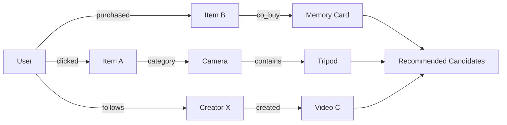
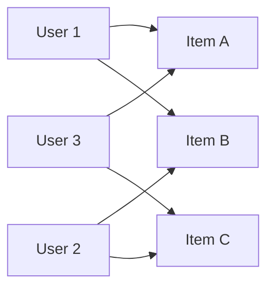
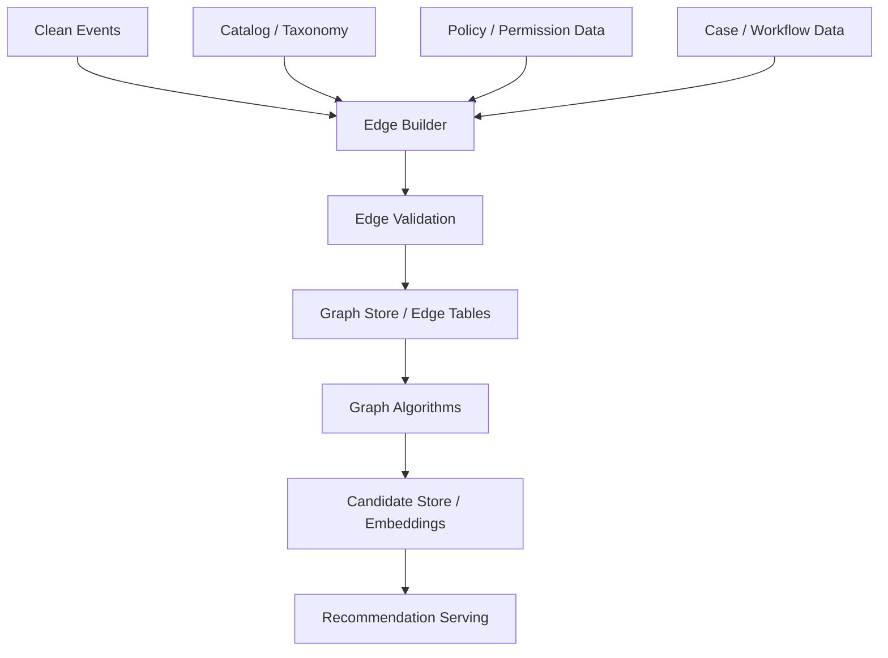
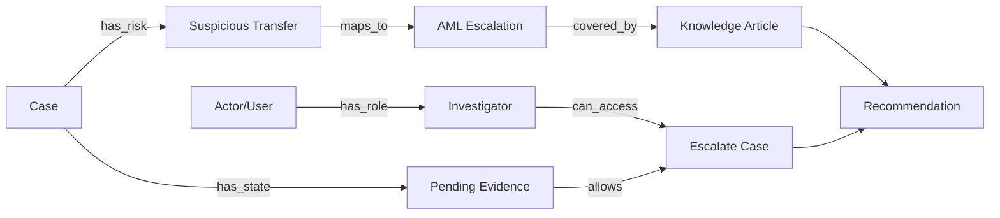

------
title: Build From Scratch Recommendations System - Part 023
description: Membangun graph-based recommendation production-grade: user-item graph, item graph, entity graph, random walk, Personalized PageRank, graph embeddings, community signals, constraints, scalability, dan serving architecture.
series: learn-build-from-scratch-recommendations-system
seriesTitle: Build From Scratch: Enterprise Recommendations System
order: 23
partTitle: Graph-Based Recommendation
tags:
  - recommendation-system
  - recsys
  - graph
  - graph-recommendation
  - personalized-pagerank
  - embeddings
  - series
date: 2026-07-02
---

# Part 023 — Graph-Based Recommendation

Recommendation system sering lebih mudah dipahami sebagai graph.

User berinteraksi dengan item. Item punya kategori. Item dibuat creator. Produk dijual seller. Artikel punya topic. Case punya entities. Knowledge article berlaku untuk policy. User berada di organization. Role punya permission. Item mirip karena co-view. Produk terhubung karena co-buy. Video terhubung karena watch-next. Case terhubung karena shared risk indicators.

Jika kita memodelkan semua hubungan itu sebagai graph, recommendation menjadi masalah:

> Dari node awal, node lain mana yang paling relevan, reachable, valid, dan berguna?

Graph-based recommendation memberi kita cara berpikir yang sangat kuat karena ia bisa menggabungkan collaborative signal, content signal, taxonomy, entity relationship, policy constraint, dan domain knowledge dalam satu struktur.

Part ini membahas graph-based recommendation production-grade: user-item graph, item graph, heterogeneous graph, random walk, Personalized PageRank, graph embeddings, community signals, enterprise graph, scalability, serving, dan failure modes.

---

## 1. Mental Model: Recommendation as Graph Traversal

Bayangkan graph:

```text
User -> clicked -> Item
Item -> belongs_to -> Category
Item -> created_by -> Creator
Item -> co_bought_with -> Item
User -> follows -> Creator
Case -> has_risk_indicator -> Entity
KnowledgeArticle -> applies_to -> PolicyTopic
Action -> valid_after -> Action
```

Recommendation bisa dimodelkan sebagai traversal:

```text
start from user/session/context node
walk through meaningful edges
collect candidate item/action/document nodes
score by path strength and constraints
```

Diagram:



Graph gives multiple paths:

```text
User -> Item -> Similar Item
User -> Category -> Popular Item
User -> Creator -> New Item
User -> Case -> Policy Topic -> Knowledge Article
```

---

## 2. Why Graph-Based Recommendation Matters

Graph recommendation is useful when:

- entities have rich relationships,
- behavior alone is sparse,
- content and collaborative signals must combine,
- explanation via paths matters,
- domain constraints are relational,
- enterprise permission/policy graph exists,
- item taxonomy is important,
- multi-hop reasoning helps,
- cold-start can use metadata graph.

Examples:

### E-commerce

```text
user -> purchased camera
camera -> compatible_with memory_card
camera -> co_bought_with camera_bag
camera -> belongs_to mirrorless_category
mirrorless_category -> popular tripod
```

### Content

```text
user -> watched video
video -> topic distributed_tracing
topic -> related_topic observability
observability -> article/post/course
```

### Enterprise Case

```text
case -> risk_indicator suspicious_transfer
risk_indicator -> policy_topic AML_escalation
policy_topic -> knowledge_article
case_state -> valid_next_action
actor_role -> permission -> action
```

Graph makes these paths explicit.

---

## 3. Graph Types in Recommendation

### 3.1 User-Item Bipartite Graph

Nodes:

- users,
- items.

Edges:

- view,
- click,
- purchase,
- watch,
- like,
- hide.



Good for collaborative recommendation.

### 3.2 Item Graph

Nodes:

- items.

Edges:

- co-view,
- co-buy,
- similar content,
- same category,
- sequence next,
- complement,
- alternative.

Good for item-to-item recommendation and candidate generation.

### 3.3 Knowledge Graph / Entity Graph

Nodes:

- user,
- item,
- category,
- brand,
- creator,
- seller,
- topic,
- tenant,
- role,
- policy,
- case,
- action,
- document.

Edges are typed.

Good for hybrid recommendation and enterprise.

### 3.4 Session Graph

Nodes:

- items/actions in a session.

Edges:

- sequence,
- time proximity,
- transition.

Good for next-item/session recommendation.

---

## 4. Heterogeneous Graph

Production recommendation graph is usually heterogeneous.

Different node types:

```text
User
Item
Category
Creator
Seller
Brand
Topic
Query
Session
Case
Action
KnowledgeArticle
Tenant
Role
Policy
```

Different edge types:

```text
clicked
purchased
viewed
belongs_to
created_by
follows
co_bought
similar_to
valid_for
requires_permission
applies_to
next_action
```

Example schema:

```yaml
nodes:
  - user
  - item
  - category
  - creator
  - topic
  - case
  - knowledge_article
  - action
edges:
  - user_clicked_item
  - user_purchased_item
  - item_belongs_to_category
  - item_created_by_creator
  - item_has_topic
  - case_has_topic
  - article_applies_to_topic
  - action_valid_for_case_state
```

Typed graph matters because `clicked` edge is not the same as `belongs_to`.

---

## 5. Edge Semantics

Every edge needs meaning.

Edge fields:

```json
{
  "source_node": "user:u123",
  "target_node": "item:i456",
  "edge_type": "clicked",
  "weight": 1.0,
  "event_time": "2026-07-02T10:00:00Z",
  "valid_from": "2026-07-02T10:00:00Z",
  "valid_until": null,
  "source_event_id": "evt_001",
  "confidence": 0.8
}
```

Edge semantics include:

- direction,
- weight,
- timestamp,
- confidence,
- validity,
- source,
- privacy/policy scope.

Do not turn all edges into untyped connections. You lose meaning.

---

## 6. Edge Weighting

Edge weight can reflect interaction strength.

Example:

```text
impression = 0.1
click = 1.0
long_dwell = 2.0
add_to_cart = 3.0
purchase = 5.0
hide = negative/suppression
report = policy signal
```

For graph traversal, edge weights affect probability.

Example:

```text
user -> purchased item
```

should carry stronger signal than:

```text
user -> clicked item
```

But edge type should remain explicit. Weight is not replacement for semantic type.

---

## 7. Time and Recency in Graphs

Graph changes over time.

Edges should decay or expire.

```text
edge_weight(t) = original_weight * exp(-lambda * age)
```

Examples:

- session click edge expires quickly,
- purchase edge lasts longer,
- case state edge valid until state changes,
- policy edge valid until policy version replaced,
- stock/availability edge can change immediately.

Graph recommendation must avoid stale edges.

For production, store:

```text
created_at
valid_from
valid_until
last_updated_at
ttl
```

---

## 8. Graph Construction Pipeline



Graph is built from curated data, not raw events.

Input quality still matters:

- dedup,
- bot filtering,
- policy state,
- catalog version,
- identity resolution,
- tenant isolation.

---

## 9. Graph Storage

Storage options conceptually:

### 9.1 Edge Tables

Relational/lake format:

```text
source_type, source_id, edge_type, target_type, target_id, weight, timestamp
```

Good for batch graph algorithms.

### 9.2 Key-Value Adjacency Lists

```text
node_id -> list of outgoing edges
```

Good for online traversal.

### 9.3 Graph Database

Useful for complex relationship queries, but not always necessary for high-throughput recommendation.

### 9.4 Vector Store for Graph Embeddings

If graph algorithms produce embeddings.

Production often uses multiple:

```text
edge tables for batch
adjacency store for serving
vector index for retrieval
```

---

## 10. Simple Graph Traversal Recommendation

Given user:

1. Get recently interacted items.
2. Traverse item -> related items.
3. Traverse item -> category -> popular items.
4. Traverse creator/topic edges.
5. Aggregate candidates.
6. Filter and rank.

Example scoring by path:

```text
User --purchase--> Camera --co_buy--> MemoryCard
score = weight(purchase) * weight(co_buy)
```

For multi-hop:

```text
User -> Item -> Category -> Item
```

Score decays by path length.

```text
path_score = product(edge_weights) * path_decay^length
```

Shorter, stronger paths usually better.

---

## 11. Path-Based Scoring

Path example:

```text
user:u1 --clicked--> item:A --has_topic--> topic:T --has_item--> item:B
```

Score:

```text
score(B) += user_click_weight * topic_edge_weight * topic_item_weight * decay(3 hops)
```

For each candidate, sum over paths:

```text
score(candidate) = sum(path_scores from seed nodes to candidate)
```

This is explainable:

```text
Recommended because it shares topic T with item A you clicked.
```

But enumerating many paths can be expensive. Limit:

- max path length,
- edge type whitelist,
- top edges per node,
- candidate cap,
- time window.

---

## 12. Personalized PageRank

Personalized PageRank (PPR) is a graph algorithm for personalized relevance.

Intuition:

- start random walk from user/context seed nodes,
- at each step, either continue walking or restart at seed,
- nodes visited often are relevant.

Formula idea:

```text
rank = restart_probability * seed_distribution
     + (1 - restart_probability) * transition_matrix * rank
```

PPR naturally handles multi-hop relationships while keeping personalization anchored.

Use cases:

- user-item graph,
- heterogeneous graph,
- related documents,
- enterprise knowledge graph.

Pros:

- explainable-ish via graph,
- combines multi-hop signal,
- can use typed edges/weights,
- works with sparse data.

Cons:

- expensive at scale,
- graph freshness,
- topic drift if graph dense,
- hard to tune edge weights,
- needs filtering.

---

## 13. Random Walk with Restart

Algorithm mental model:

```text
current_node = seed
repeat many times:
  with probability restart:
      current_node = seed
  else:
      current_node = sample_neighbor(current_node)
  count visits
```

Candidates are item/action/document nodes with high visit count.

In production, exact random walks online can be expensive. Options:

- precompute PPR for active users/items,
- approximate online for small subgraph,
- use graph embeddings,
- use PPR as batch feature/candidate source.

---

## 14. Typed Edge Random Walks

In heterogeneous graph, not all paths are valid.

Example e-commerce recommendation path:

```text
user -> purchased_item -> co_bought_item
```

valid.

But:

```text
user -> item -> seller -> all_seller_items
```

might overpromote seller.

Use metapaths.

Metapath examples:

```text
User-Item-Item
User-Item-Category-Item
User-Item-Creator-Item
Case-Topic-Article
Case-State-Action
User-Role-Permission-Action
```

Define allowed metapaths per surface.

```yaml
surface: product_detail_related
allowed_metapaths:
  - item->co_view->item
  - item->co_buy->item
  - item->category->item
  - item->brand->item
blocked_metapaths:
  - item->seller->item
```

This keeps graph traversal controlled.

---

## 15. Graph Embeddings

Graph embeddings learn vector representation of nodes from graph structure.

Examples:

- item embedding from co-interaction graph,
- user embedding from user-item graph,
- entity embedding from knowledge graph,
- case embedding from case-entity graph.

Methods conceptually:

- random walk sequences + skip-gram,
- matrix factorization of graph proximity,
- graph neural networks,
- knowledge graph embedding.

In production, graph embeddings are useful as candidate retrieval features:

```text
ANN.search(user_graph_embedding)
```

But embedding versioning and training cutoff matter.

---

## 16. Random Walk Embedding Mental Model

Generate node sequences:

```text
user1 -> itemA -> categoryC -> itemB -> user2 -> itemD
```

Train embeddings so nodes appearing in similar walks are close.

This captures graph neighborhood similarity.

Use typed walks to avoid meaningless paths.

For recommendation:

- query node embedding,
- retrieve nearest item/action nodes,
- filter eligibility,
- rank.

Graph embeddings bridge graph reasoning and vector retrieval.

---

## 17. Graph Neural Networks

Graph neural networks aggregate neighbor information.

Concept:

```text
node_representation =
  function(node_features, neighbor_representations, edge_types)
```

Useful when:

- graph has rich node features,
- multi-hop structure matters,
- node types/edge types are meaningful,
- you need inductive generalization for new nodes with features.

Challenges:

- complexity,
- training cost,
- serving cost,
- stale graph,
- explainability,
- operational maturity.

For this series stage, understand graph GNNs as advanced extension. Build simpler graph traversal/PPR/embedding first.

---

## 18. Graph-Based Candidate Generation

Graph can produce candidates:

### From User Node

```text
user -> interacted items -> related items
```

### From Session Node

```text
session -> recent items -> next items
```

### From Item Seed

```text
seed item -> co_buy/co_view/similar graph
```

### From Context/Case Node

```text
case -> topics/entities/state -> articles/actions
```

Candidate output should include provenance:

```json
{
  "item_id": "item_123",
  "source": "graph_ppr",
  "score": 0.73,
  "paths": [
    "user_clicked:item_A -> topic:distributed_tracing -> item_123"
  ],
  "graph_version": "graph-20260702"
}
```

Path provenance is powerful for debugging.

---

## 19. Graph-Based Features

Graph is not only candidate source. It can produce features for ranker.

Examples:

```text
user_item_graph_distance
personalized_pagerank_score
common_neighbor_count
user_topic_graph_affinity
item_community_id
creator_centrality
seller_trust_graph_score
case_article_path_score
action_success_graph_score
```

Ranker can use these with other features.

Important: graph features must be point-in-time safe.

---

## 20. Community Detection

Graphs reveal communities.

Examples:

- item clusters,
- user interest groups,
- creator communities,
- case clusters,
- knowledge topic clusters.

Community features:

```text
item_community_id
user_top_community
user_item_same_community
community_popularity
community_diversity
```

Use cases:

- candidate generation,
- diversity,
- exploration,
- segmentation,
- cold-start.

Beware of filter bubbles. Community-based recommendation can over-narrow exposure.

---

## 21. Knowledge Graph Recommendation

Knowledge graph includes domain facts.

Example e-commerce:

```text
Product -> compatible_with -> Accessory
Product -> requires -> BatteryType
Brand -> has_series -> ProductLine
```

Example enterprise:

```text
CaseType -> governed_by -> Policy
Policy -> requires -> EvidenceType
EvidenceType -> described_by -> KnowledgeArticle
Action -> valid_for -> CaseState
Role -> allowed_to_execute -> Action
```

Recommendation can use rule-like graph traversal:

```text
case -> policy -> required_evidence -> knowledge_article
```

This is highly explainable and safe if graph is curated.

Knowledge graph edges often represent truth/constraint, not behavior. Treat them differently from click edges.

---

## 22. Enterprise Graph Example



Serving must enforce:

```text
actor has permission
case state allows action
jurisdiction matches policy
tenant boundary holds
article valid now
```

Graph makes these constraints explicit.

---

## 23. Graph Constraints and Safety

Graph traversal can accidentally reach unauthorized nodes.

Example:

```text
case -> similar_case -> confidential_document
```

If actor cannot access similar case, candidate should not appear.

Apply constraints:

- traversal-level edge filtering,
- node visibility filtering,
- final eligibility filtering,
- path redaction in logs,
- tenant isolation,
- purpose/consent checks.

For high-sensitivity graph, do authorization-aware traversal, not only final filtering.

---

## 24. Graph Versioning

Version graph artifacts:

```text
edge_schema_version
edge_weight_policy
graph_snapshot_version
node_feature_version
embedding_model_version
ppr_algorithm_version
metapath_policy_version
```

Log:

```json
{
  "graph_version": "graph-snapshot-20260702",
  "metapath_policy": "home-graph-metapath-v3",
  "edge_weight_policy": "edge-weight-v4"
}
```

If graph changes, recommendation behavior changes.

---

## 25. Temporal Graph Snapshots

For training/evaluation:

```text
use graph as-of prediction_time
```

Do not use future edges.

Example leakage:

- user buys item B after impression,
- graph includes edge user->B,
- training example before purchase uses graph path to B.

Solution:

- graph snapshots by time,
- edge valid_from/valid_to,
- temporal joins,
- graph embedding training cutoff.

Graph leakage can be subtle.

---

## 26. Scalability

Graphs can be huge.

Challenges:

- billions of edges,
- high-degree nodes,
- popular items/categories,
- online traversal latency,
- memory,
- frequent updates,
- access control.

Mitigations:

- cap neighbor lists,
- filter edge types,
- downweight high-degree nodes,
- precompute top candidates,
- use approximate PPR,
- use graph embeddings,
- partition by tenant/region/domain,
- cache adjacency lists,
- use batch graph processing.

High-degree nodes like global category “Electronics” can make traversal noisy. Penalize or limit.

---

## 27. High-Degree Node Problem

Nodes like:

```text
category: all
topic: technology
creator: mega_creator
item: viral_item
```

connect to many nodes.

They can dominate traversal.

Mitigations:

- degree normalization,
- edge weight normalization,
- stopword-like node removal,
- max neighbors per node,
- metapath restrictions,
- popularity penalty,
- use specific category levels.

Graph equivalent of “the” in text: too common to be useful.

---

## 28. Serving Patterns

### 28.1 Precomputed Graph Candidates

Batch compute graph candidates per user/item/context.

Pros:

- low latency,
- stable,
- easy fallback.

Cons:

- stale,
- storage heavy.

### 28.2 Online Traversal

Compute candidates at request time.

Pros:

- dynamic,
- context-aware.

Cons:

- latency,
- complexity,
- graph store dependency.

### 28.3 Graph Embedding Retrieval

Use vector index.

Pros:

- scalable retrieval,
- fast.

Cons:

- less path explainability,
- stale embeddings.

Hybrid is common:

```text
precomputed graph candidates
+ online filters
+ graph score as rank feature
+ graph embedding retrieval for broader recall
```

---

## 29. Graph Candidate Contract

Graph candidate should include:

```json
{
  "candidate_id": "item_123",
  "candidate_type": "item",
  "source": "graph_ppr",
  "score": 0.731,
  "reason_paths": [
    {
      "path_type": "user_item_topic_item",
      "path": ["user:u1", "item:A", "topic:T", "item:123"],
      "path_score": 0.42
    }
  ],
  "graph_metadata": {
    "graph_version": "graph-20260702",
    "edge_weight_policy": "edge-weight-v3",
    "metapath_policy": "home-v2"
  }
}
```

For privacy, reason paths may be internal-only. Do not expose sensitive nodes.

---

## 30. Evaluation

Offline:

- Recall@K,
- NDCG@K,
- HitRate@K,
- path relevance,
- coverage,
- diversity,
- cold-start improvement,
- graph source contribution,
- community coverage,
- long-tail exposure.

Online:

- CTR,
- conversion,
- watch completion,
- case success,
- hide/report,
- session continuation,
- diversity,
- user trust,
- latency.

For enterprise:

- permission violation count must be zero,
- invalid action recommendations must be zero,
- policy/jurisdiction mismatch must be zero.

Graph systems need safety evaluation, not just relevance.

---

## 31. Explainability via Paths

Graph recommendations can be explained by path.

Examples:

```text
Because you read articles about distributed tracing.
Because this product is compatible with your camera.
Because this article applies to the risk indicator in your case.
Because users who completed this course also took this next module.
```

Internal explanation:

```text
user -> item_A -> topic_observability -> item_B
```

User-facing explanation should be semantic, concise, and policy-safe.

Do not expose:

- other user identities,
- confidential case nodes,
- sensitive inferred attributes,
- hidden policy signals.

---

## 32. Graph and Diversity

Graph can help diversity.

If candidates belong to graph communities, reranker can enforce:

```text
max items per community
cover multiple related topics
avoid same creator cluster
```

Graph can also hurt diversity by staying inside one cluster.

Use graph community as both feature and constraint.

---

## 33. Graph and Cold Start

Cold item can connect through metadata graph:

```text
new item -> category/topic/creator -> users/items
```

Even with no interactions, graph can recommend it via content edges.

Cold user can connect through:

- onboarding topics,
- session items,
- query,
- role,
- case context,
- region.

Graph is strong for cold-start if metadata/entity edges are rich.

---

## 34. Graph and Policy

Graph can encode policy:

```text
role -> can_access -> action
item -> restricted_in -> region
article -> valid_for -> jurisdiction
case_state -> allows -> action
```

But do not mix policy score with preference score.

Use policy graph for eligibility, then preference graph for relevance.

Hard constraint:

```text
if no valid permission path:
    exclude candidate
```

---

## 35. Operational Failure Modes

### 35.1 Stale Edges

Old interactions dominate.

### 35.2 High-Degree Dominance

Generic nodes recommend everything.

### 35.3 Unauthorized Path Leakage

Traversal reaches restricted nodes.

### 35.4 Graph Explosion

Online traversal too slow.

### 35.5 Edge Semantics Mixed

Click, category, permission, and co-buy all treated same.

### 35.6 Future Edge Leakage

Graph embedding trained with future data.

### 35.7 Poor Metadata

Cold-start graph edges wrong.

### 35.8 No Path Provenance

Recommendation cannot be debugged.

### 35.9 Over-Clustering

Recommendations too narrow.

### 35.10 Tenant Leakage

Enterprise graph crosses tenant boundary.

---

## 36. Implementation Sketch: Path-Based Candidate Generator

Conceptual Java-like structure:

```java
public interface GraphStore {
    List<Edge> outgoing(NodeId node, EdgeFilter filter, int limit);
}

public record GraphSeed(NodeId nodeId, double weight) {}

public record GraphCandidate(
    String candidateId,
    String candidateType,
    double score,
    List<String> reasonPaths
) {}
```

Traversal:

```java
public final class PathBasedGraphCandidateGenerator {
    private final GraphStore graphStore;
    private final MetapathPolicy metapathPolicy;

    public List<GraphCandidate> generate(List<GraphSeed> seeds, GraphRequestContext context) {
        Map<String, CandidateAccumulator> candidates = new HashMap<>();

        for (GraphSeed seed : seeds) {
            traverse(seed.nodeId(), seed.weight(), List.of(seed.nodeId().toString()), 0, candidates, context);
        }

        return candidates.values().stream()
            .map(CandidateAccumulator::toGraphCandidate)
            .sorted(Comparator.comparing(GraphCandidate::score).reversed())
            .limit(context.limit())
            .toList();
    }

    private void traverse(
        NodeId node,
        double pathScore,
        List<String> path,
        int depth,
        Map<String, CandidateAccumulator> candidates,
        GraphRequestContext context
    ) {
        if (depth >= context.maxDepth()) {
            return;
        }

        EdgeFilter filter = metapathPolicy.edgeFilterFor(path, context);
        for (Edge edge : graphStore.outgoing(node, filter, context.maxNeighborsPerNode())) {
            double nextScore = pathScore * edge.weight() * context.pathDecay();

            NodeId target = edge.target();
            List<String> nextPath = append(path, target.toString());

            if (context.isCandidateType(target.type())) {
                candidates.computeIfAbsent(target.id(), CandidateAccumulator::new)
                    .add(nextScore, nextPath);
            }

            traverse(target, nextScore, nextPath, depth + 1, candidates, context);
        }
    }
}
```

Production version needs cycle control, privacy filtering, quotas, and latency budgets.

---

## 37. Minimal Production Graph Plan

Start with three graph candidate sources:

### 37.1 User-Item-Item Graph

```text
user recent positive items -> item-to-item edges -> candidates
```

Edges:

- co_view,
- co_buy,
- content_similar.

### 37.2 User-Item-Topic-Item Graph

```text
user positive items -> topics/categories -> items
```

Good for cold-start and diversity.

### 37.3 Enterprise Case-Topic-Article/Action Graph

```text
case -> risk/topic/state -> valid articles/actions
```

For enterprise domain.

Implement:

- edge table,
- graph version,
- metapath policy,
- offline candidate generation,
- online eligibility filter,
- path provenance,
- graph metrics.

Do not start with full GNN unless graph/data/ops foundation is mature.

---

## 38. Checklist Graph Recommendation Readiness

```text
[ ] Node types are defined.
[ ] Edge types are defined.
[ ] Edge semantics are documented.
[ ] Edge weights are versioned.
[ ] Edge timestamps and validity are stored.
[ ] Graph construction uses clean curated data.
[ ] Bot/internal/test edges are excluded or flagged.
[ ] High-degree node handling exists.
[ ] Metapath policy exists per surface.
[ ] Traversal respects tenant/permission/policy boundaries.
[ ] Graph snapshot/version is logged.
[ ] Temporal graph leakage is controlled.
[ ] Candidate provenance/path is stored.
[ ] Online eligibility/suppression filters run.
[ ] Graph candidate latency is bounded.
[ ] Coverage/diversity metrics are monitored.
[ ] Unauthorized recommendation count is monitored.
[ ] Cold-start impact is measured.
[ ] Fallback exists if graph source empty.
```

---

## 39. Kesimpulan

Graph-based recommendation memberi cara berpikir yang luas dan kuat: recommendation sebagai traversal dan scoring di atas hubungan antar entity.

Prinsip utama:

1. Recommendation graph harus typed; edge semantics penting.
2. Graph bisa menggabungkan collaborative, content, taxonomy, policy, dan domain knowledge.
3. Path-based scoring memberi explainability.
4. Personalized PageRank/random walk memberi multi-hop relevance.
5. Graph embeddings memberi retrieval scalable.
6. High-degree nodes dan stale edges harus dikontrol.
7. Temporal graph leakage harus dicegah.
8. Authorization-aware traversal penting untuk enterprise.
9. Graph is evidence, not a replacement for policy.
10. Start simple with metapaths and precomputed candidates before jumping to GNN.

Part ini menutup Module 3: baseline dan recommender klasik sebelum deep learning.

Di Part 024, kita masuk Module 4: **Candidate Generation / Retrieval Layer**, dimulai dari Candidate Generation Contract — batas formal yang membuat banyak source retrieval bisa bekerja rapi dengan ranker dan serving system.
