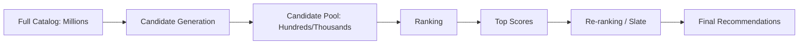
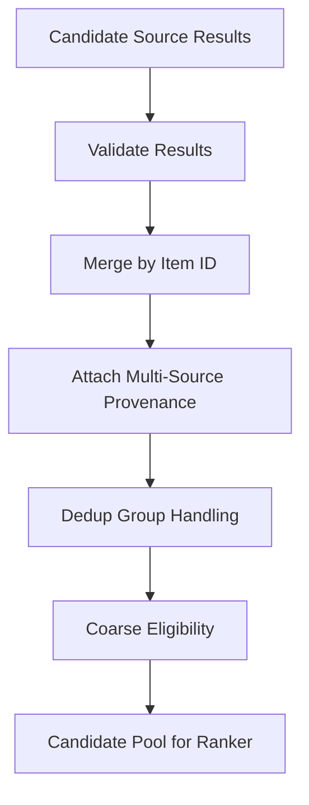
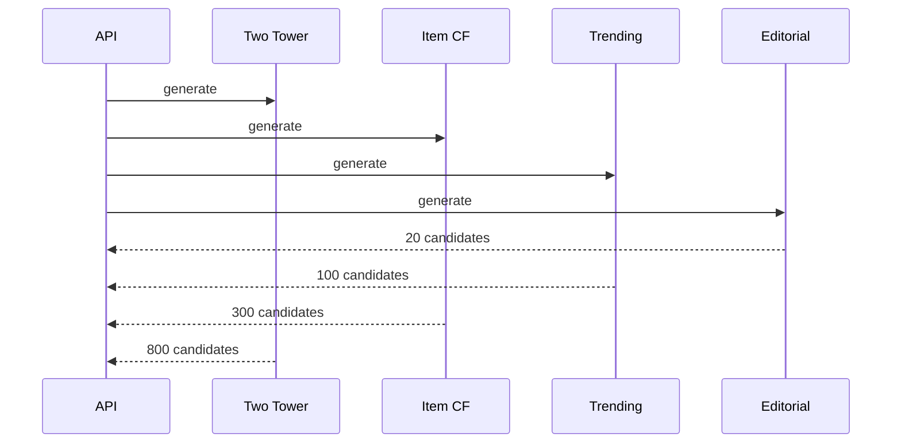

------
title: Build From Scratch Recommendations System - Part 024
description: Mendesain candidate generation contract production-grade: source interface, candidate schema, provenance, eligibility boundary, scoring semantics, quotas, latency budget, dedup, tracing, fallback, dan integration dengan ranking service.
series: learn-build-from-scratch-recommendations-system
seriesTitle: Build From Scratch: Enterprise Recommendations System
order: 24
partTitle: Candidate Generation Contract
tags:
  - recommendation-system
  - recsys
  - candidate-generation
  - retrieval
  - api-contract
  - system-design
  - series
date: 2026-07-02
---

# Part 024 — Candidate Generation Contract

Sebelum ranking model bisa memilih item terbaik, sistem harus punya daftar kandidat.

Pada katalog kecil, kita mungkin bisa score semua item.

Pada production recommendation system, katalog bisa berisi:

- jutaan produk,
- ratusan juta video,
- puluhan juta artikel,
- dokumen enterprise,
- action templates,
- job postings,
- marketplace offers,
- policy-specific knowledge articles.

Ranking semua item untuk setiap request hampir selalu terlalu mahal.

Maka sistem butuh candidate generation layer.

Candidate generation menjawab:

> “Dari seluruh inventory, subset item mana yang cukup mungkin relevan sehingga layak diberikan ke ranking layer?”

Part ini membahas kontrak candidate generation production-grade: interface, candidate schema, provenance, score semantics, eligibility boundary, source quotas, latency budget, dedup, fallback, debug trace, dan integrasi dengan ranking.

---

## 1. Mental Model: Candidate Generation = Recall-Oriented Retrieval

Ranking layer bertugas mengurutkan kandidat.

Candidate generation bertugas memastikan kandidat bagus masuk ke ranker.

Jika kandidat bagus tidak pernah masuk, ranker tidak bisa menyelamatkan.

```text
No candidate, no recommendation.
```

Diagram funnel:



Candidate generation optimizes:

- recall,
- coverage,
- diversity of sources,
- latency,
- eligibility,
- freshness,
- cost.

Ranking optimizes:

- precision,
- utility,
- objective,
- calibration,
- final ordering.

---

## 2. Why Candidate Contract Matters

Production systems rarely have one candidate source.

Sources:

- popularity,
- trending,
- editorial,
- content-based,
- item-to-item,
- collaborative filtering,
- matrix factorization,
- graph,
- two-tower retrieval,
- search/query retrieval,
- business rules,
- campaign,
- cold-start exploration,
- enterprise policy/action rules.

Without contract, every source returns different shape:

```text
some return item_id only
some return score
some return reason
some already filtered
some include unavailable items
some return duplicates
some score higher-is-better
some score lower-is-better
some use stale catalog
some time out silently
```

Candidate generation contract creates standard boundary.

---

## 3. Candidate Source Responsibilities

A candidate source should:

1. Accept a typed request/context.
2. Return candidates with stable schema.
3. Include source name and version.
4. Include score and score semantics.
5. Include provenance/reason.
6. Respect source-specific latency budget.
7. Apply mandatory source-level filters if required.
8. Declare whether candidates are fully eligible or need final validation.
9. Return enough candidates for downstream ranking.
10. Expose debug/metrics.

A candidate source should not:

- make final product decision alone,
- bypass policy,
- hide score semantics,
- return unauthorized items knowingly,
- mutate user state,
- depend on ranker internals,
- silently fail without status.

---

## 4. Candidate Generation Request

A source needs request context.

Generic request:

```json
{
  "request_id": "req_001",
  "surface": "home_feed",
  "subject": {
    "subject_type": "authenticated_user",
    "user_id": "u123",
    "anonymous_id": "anon_456",
    "session_id": "sess_789",
    "tenant_id": null
  },
  "context": {
    "request_time": "2026-07-02T10:00:00Z",
    "region": "ID-JK",
    "locale": "id-ID",
    "device_type": "mobile",
    "surface_context": {
      "page_index": 0,
      "placement": "main_feed"
    },
    "intent": {
      "type": "camera_research",
      "confidence": 0.72
    }
  },
  "constraints": {
    "limit": 500,
    "allowed_item_types": ["product"],
    "allowed_surfaces": ["home_feed"],
    "require_available": true,
    "policy_context": {
      "content_safety_mode": "standard"
    }
  },
  "debug": {
    "enable_trace": false
  }
}
```

Not all sources need all fields, but contract should allow them.

---

## 5. Candidate Response

Standard response:

```json
{
  "source": "two_tower_retrieval",
  "source_version": "retrieval-two-tower-20260701",
  "status": "success",
  "latency_ms": 32,
  "candidates": [
    {
      "candidate_id": "cand_001",
      "item_id": "item_123",
      "item_type": "product",
      "score": 0.834,
      "score_type": "inner_product",
      "source_rank": 1,
      "provenance": {
        "reason_codes": ["user_embedding_match"],
        "retrieval_key": "user_vector:u123:v5",
        "index_version": "item-index-20260701"
      },
      "eligibility_status": "unknown_needs_final_check",
      "metadata": {
        "dedup_group_id": "product_family_123"
      }
    }
  ],
  "diagnostics": {
    "requested_limit": 500,
    "returned_count": 500,
    "timeout": false,
    "fallback_used": false
  }
}
```

This response gives ranking and debugging enough context.

---

## 6. Candidate Object Schema

Minimal candidate fields:

```yaml
candidate:
  candidate_id: unique per source response
  item_id: stable item identity
  item_type: typed entity
  source: candidate source name
  source_version: source version
  source_rank: rank within source
  score: source-native score
  score_type: meaning of score
  provenance: reason/source metadata
  eligibility_status: source's confidence about eligibility
  generated_at: timestamp
```

Recommended additional fields:

```yaml
candidate:
  dedup_group_id
  candidate_source_features
  relation_type
  seed_item_id
  query_id
  graph_path
  experiment_context
  debug_trace_id
```

Do not rely on item_id only. Provenance matters.

---

## 7. Score Semantics

Scores from different sources are not directly comparable.

Examples:

```text
popularity score = smoothed CTR
content score = cosine similarity
MF score = dot product
graph score = PPR probability
i2i score = confidence * lift
editorial score = manual priority
rule score = deterministic priority
```

If you merge by raw score, nonsense happens.

Candidate must include `score_type`.

```json
{
  "score": 0.82,
  "score_type": "cosine_similarity"
}
```

Candidate aggregator/ranker can use:

- source rank,
- source score percentile,
- source-specific normalization,
- source identity as feature,
- calibrated source score if available.

Never assume all source scores mean probability.

---

## 8. Candidate Provenance

Provenance answers:

> “Why did this item enter the candidate pool?”

Examples:

### Popularity

```json
{
  "source": "segment_popularity",
  "reason_codes": ["popular_in_region_category"],
  "segment_key": "home_feed:ID-JK:camera"
}
```

### Item-to-Item

```json
{
  "source": "co_buy_i2i",
  "seed_item_id": "camera_123",
  "relation_type": "co_buy",
  "evidence": {
    "pair_count": 120,
    "lift": 3.2
  }
}
```

### Content-Based

```json
{
  "source": "content_based",
  "reason_codes": ["same_topic", "text_similarity"],
  "similarity_components": {
    "text": 0.78,
    "category": 0.91
  }
}
```

### Graph

```json
{
  "source": "graph_ppr",
  "path_type": "user_item_topic_item",
  "path_sample": ["user:u123", "item:A", "topic:T", "item:B"]
}
```

Provenance is essential for debugging, explainability, and source tuning.

---

## 9. Eligibility Boundary

Important question:

> Should candidate sources return only eligible items?

Answer: source should filter what it can cheaply and safely, but final serving path must still validate.

Why?

- source index/list can be stale,
- item stock changes,
- policy changes,
- user suppression is request-specific,
- tenant/permission can be dynamic,
- item deleted after list generation.

Use two-layer filtering:

```text
source-level coarse eligibility
+ final online eligibility
```

Candidate field:

```json
"eligibility_status": "coarse_filtered"
```

or:

```json
"eligibility_status": "unknown_needs_final_check"
```

Never trust precomputed list blindly.

---

## 10. Mandatory Hard Constraints

Some constraints should be applied before or during retrieval.

Examples:

- tenant boundary,
- actor permission,
- child safety mode,
- region legal restriction,
- item type allowed for surface,
- policy-banned items,
- deleted items.

For enterprise restricted corpus, retrieval itself must be authorization-aware.

Bad:

```text
retrieve all documents semantically
then filter unauthorized at end
```

This can leak through logs/debug/side channels.

Better:

```text
retrieval query includes tenant/permission filter
+ final validation
```

---

## 11. Candidate Source Types

A source can be:

### 11.1 Static List Source

- editorial,
- global popularity,
- safe fallback.

### 11.2 Contextual List Source

- segment popularity,
- category trending,
- region-specific.

### 11.3 Seed-Based Source

- item-to-item,
- content similar,
- co-buy,
- sequence.

### 11.4 User/Profile-Based Source

- collaborative filtering,
- matrix factorization,
- two-tower retrieval.

### 11.5 Query/Intent-Based Source

- search retrieval,
- semantic query-item retrieval.

### 11.6 Rule/Policy Source

- enterprise valid actions,
- required checklist,
- compliance recommendations.

### 11.7 Exploration Source

- new item quota,
- long-tail exploration,
- bandit candidates.

All can use same contract.

---

## 12. Candidate Source Interface

Conceptual Java interface:

```java
public interface CandidateSource {
    CandidateSourceName name();

    CandidateSourceVersion version();

    CandidateSourceResult generate(CandidateSourceRequest request);
}
```

Result:

```java
public record CandidateSourceResult(
    String source,
    String sourceVersion,
    CandidateSourceStatus status,
    Duration latency,
    List<Candidate> candidates,
    CandidateSourceDiagnostics diagnostics
) {}
```

Candidate:

```java
public record Candidate(
    String itemId,
    String itemType,
    String source,
    String sourceVersion,
    int sourceRank,
    double sourceScore,
    String scoreType,
    CandidateProvenance provenance,
    EligibilityStatus eligibilityStatus
) {}
```

The actual transport can be REST/gRPC/in-process, but contract concept stays.

---

## 13. Candidate Source Status

Do not return only list. Return status.

Statuses:

```text
success
partial_success
empty
timeout
dependency_failure
invalid_request
disabled_by_policy
skipped_not_applicable
fallback_used
```

Example:

```json
{
  "source": "two_tower_retrieval",
  "status": "timeout",
  "latency_ms": 80,
  "candidates": [],
  "diagnostics": {
    "dependency": "vector_index",
    "timeout_budget_ms": 50
  }
}
```

This allows fallback and monitoring.

---

## 14. Source Applicability

Not every source applies to every request.

Examples:

- item-to-item requires seed item,
- cart co-buy requires cart,
- query retrieval requires query,
- user MF requires user vector,
- enterprise action source requires case context,
- no-consent user cannot use behavioral source.

Source should declare applicability.

```java
boolean isApplicable(CandidateSourceRequest request);
```

If not applicable:

```text
status = skipped_not_applicable
```

Do not treat this as error.

---

## 15. Source Quotas

Each source should have quota.

Example:

```yaml
home_feed_candidate_sources:
  two_tower:
    max_candidates: 800
    timeout_ms: 40
  item_cf:
    max_candidates: 300
    timeout_ms: 20
  trending:
    max_candidates: 100
    timeout_ms: 10
  editorial:
    max_candidates: 50
    timeout_ms: 5
```

Quotas prevent one source from dominating.

Candidate generation is a portfolio.

---

## 16. Source Diversity

If one source returns all candidates, system becomes fragile.

Maintain source mix:

```text
personalized retrieval
content-based
popularity/trending
business/editorial
exploration
```

Even if ranker later chooses, candidate pool should contain diversity.

Source-level metrics:

```text
source_return_count
source_selected_count_after_ranking
source_final_slate_count
source_ctr/cvr
source_filter_rate
```

If source contributes zero final items for weeks, investigate or remove.

---

## 17. Candidate Aggregation

Multiple sources return candidates.

Aggregator tasks:

1. collect results,
2. handle timeouts,
3. merge candidates,
4. deduplicate by item/dedup group,
5. combine source provenance,
6. normalize source scores if needed,
7. enforce source quotas,
8. apply coarse filters,
9. pass pool to ranker.

Diagram:



---

## 18. Multi-Source Candidate Merge

Same item can come from multiple sources.

Example:

```json
{
  "item_id": "item_123",
  "sources": [
    {
      "source": "two_tower",
      "score": 0.82,
      "rank": 12
    },
    {
      "source": "trending",
      "score": 0.63,
      "rank": 4
    },
    {
      "source": "content_based",
      "score": 0.77,
      "rank": 8
    }
  ]
}
```

This is valuable.

Ranker can use:

```text
source_count
best_source_rank
two_tower_score
trending_score
content_score
candidate_source_flags
```

Do not drop provenance from duplicate source merge.

---

## 19. Dedup Semantics

Dedup levels:

- exact item_id,
- product family,
- content canonical ID,
- creator/category cap,
- semantic duplicate,
- offer/SKU grouping.

Candidate aggregation should dedup exact item_id. Slate/reranker may handle more sophisticated dedup.

For e-commerce:

```text
multiple SKU variants -> one product family candidate
```

For marketplace offer-level:

```text
multiple sellers for same product -> choose best offer or keep for offer ranker
```

Dedup policy is surface-specific.

---

## 20. Candidate Pool Size

Too few candidates:

- low recall,
- ranker starved,
- repetitive output.

Too many candidates:

- high latency,
- feature fetch cost,
- ranker cost,
- more invalid candidates.

Typical ranges:

```text
candidate generation: 500 - 10,000
pre-ranking: reduce to 500 - 2,000
ranking: 100 - 1,000
final slate: 10 - 50
```

Numbers depend on catalog, latency, and model cost.

Measure recall vs latency.

---

## 21. Candidate Generation Latency Budget

Candidate generation often runs under strict budget.

Example home feed:

```text
total API budget: 200ms
context/identity: 20ms
candidate generation: 60ms
feature fetch: 50ms
ranking: 40ms
reranking/logging: 30ms
```

Sources may run in parallel.



Use per-source timeout and partial success.

---

## 22. Timeout Behavior

If source times out:

- do not fail whole request unless source critical,
- use other sources,
- use fallback baseline,
- log timeout,
- update source health metrics.

Policy:

```yaml
source_timeout_policy:
  two_tower:
    timeout_ms: 40
    required: false
    fallback: segment_popularity
  policy_valid_actions:
    timeout_ms: 30
    required: true
    failure_mode: fail_closed
```

For enterprise policy source, failure may require fail-closed.

For homepage trending, failure can fallback.

---

## 23. Candidate Source Health

Monitor per source:

```text
request_count
success_rate
timeout_rate
empty_rate
latency p50/p95/p99
returned_count
filter_rate
final_slate_contribution
click/conversion contribution
error by dependency
staleness
```

Source with high empty rate may be broken or not applicable.

Distinguish:

```text
empty because not applicable
empty because no data
empty because dependency failure
empty because all filtered
```

---

## 24. Candidate Recall

Candidate generation quality is about recall.

If future positive item is not in candidate pool, ranker cannot pick it.

Offline metric:

```text
candidate_recall@K =
  fraction of requests where held-out positive item appears in top K candidates
```

Measure by:

- source,
- source combination,
- surface,
- segment,
- cold user,
- cold item,
- item popularity bucket,
- category.

Candidate recall should be evaluated before ranking metric.

---

## 25. Source Contribution Analysis

Track source contribution through funnel.

```text
generated candidates by source
after eligibility filter
after ranker top 100
after reranker final slate
clicked/purchased by source
```

Example:

| Source | Generated | After Filter | Final Slate | Clicks |
|---|---:|---:|---:|---:|
| two_tower | 800 | 720 | 12 | 1000 |
| item_cf | 300 | 250 | 5 | 300 |
| trending | 100 | 95 | 2 | 100 |
| editorial | 50 | 48 | 1 | 80 |

This reveals source value and waste.

---

## 26. Candidate Features for Ranker

Candidate sources should pass source-specific features.

Examples:

```text
source_rank
source_score
candidate_source_flags
i2i_pair_count
i2i_lift
content_similarity
graph_ppr_score
mf_dot_product
popularity_score
trending_score
editorial_priority
exploration_probability
```

Ranker can learn how to use them.

But feature names should be source-specific and versioned.

---

## 27. Candidate Provenance in Logging

Recommendation response should log candidate provenance for final items and sometimes sampled non-final candidates.

Needed for:

- debugging,
- source attribution,
- training features,
- counterfactual analysis,
- source contribution,
- explainability.

Do not log huge full candidate pools for every request if too expensive. Options:

- log final slate provenance always,
- log top N pre-rank candidates,
- sample full candidate pool,
- store debug trace with TTL for debug-enabled requests.

---

## 28. Candidate Generation and Experiments

Experiments can change:

- source enabled/disabled,
- source quota,
- retrieval model version,
- vector index,
- source mix,
- exploration rate,
- fallback policy.

Candidate generation event should log experiment assignment.

```json
{
  "candidate_policy_version": "home-candidate-policy-v5",
  "experiments": [
    {
      "experiment_key": "two_tower_v3_candidate_mix",
      "variant": "treatment"
    }
  ]
}
```

Candidate source changes can affect downstream ranker distribution.

---

## 29. Candidate Policy

Define candidate policy per surface.

Example:

```yaml
surface: home_feed
candidate_policy_version: home-candidates-v4
sources:
  - name: two_tower
    enabled: true
    quota: 800
    timeout_ms: 40
  - name: item_cf
    enabled: true
    quota: 300
    timeout_ms: 20
  - name: content_based_session
    enabled: true
    quota: 300
    timeout_ms: 30
  - name: trending_region
    enabled: true
    quota: 100
    timeout_ms: 10
  - name: editorial
    enabled: true
    quota: 50
    timeout_ms: 5
merge:
  exact_item_dedup: true
  keep_multi_source_provenance: true
minimum_pool_size: 500
fallback:
  if_pool_below_minimum:
    - segment_popularity
    - global_popularity
```

Policy as config enables review and experiment.

---

## 30. Candidate Generation for Different Surfaces

### Home Feed

Many sources:

- personalized retrieval,
- trending,
- content-based,
- graph,
- editorial,
- exploration.

Goal: discovery.

### Product Detail

Seed-based:

- similar items,
- co-view alternatives,
- co-buy complements,
- accessories,
- content similarity.

Goal: related to seed.

### Cart

Cart-based:

- frequently bought together,
- compatible accessories,
- bundles,
- low-return add-ons.

Goal: attach/conversion.

### Search

Query-based:

- lexical/semantic search,
- category relaxation,
- popularity for query intent.

Goal: satisfy explicit intent.

### Enterprise Case

Context/rule/graph:

- valid actions,
- relevant articles,
- similar cases,
- evidence checklist.

Goal: task success and compliance.

Each surface needs its own candidate contract/policy.

---

## 31. Candidate Generation and Exploration

Exploration source intentionally returns items with uncertain value.

Candidate fields:

```json
{
  "source": "new_item_exploration",
  "exploration": {
    "policy": "new-item-quota-v2",
    "propensity": 0.02,
    "reason": "cold_start_item"
  }
}
```

Propensity logging is important for learning/evaluation.

Exploration must respect:

- safety,
- quality minimum,
- exposure caps,
- user controls,
- surface risk level.

---

## 32. Candidate Generation for No-Consent Users

If personalization not allowed:

Disable behavioral user sources:

- user MF,
- two-tower user embedding,
- user graph,
- history-based CF.

Allowed depending policy:

- contextual popularity,
- current query,
- current seed item,
- region/locale if allowed,
- editorial,
- non-personal content-based.

Candidate policy must support privacy modes.

```yaml
privacy_mode: non_personalized
sources:
  - segment_popularity
  - editorial
  - seed_content_based
disabled_sources:
  - user_behavioral_retrieval
  - user_graph
```

---

## 33. Enterprise Candidate Generation

Enterprise source examples:

### Valid Action Source

Returns actions valid for current state and actor permission.

### Knowledge Article Source

Returns articles matching case topic/jurisdiction/role.

### Similar Case Source

Returns similar cases actor can access.

### Policy Required Source

Returns required checklists or compliance steps.

Contract must include:

```text
authorization evidence
policy version
case state
jurisdiction
role
audit reason
```

Candidate generation must not produce unauthorized candidates.

---

## 34. Candidate Debug Trace

For request debugging:

```json
{
  "request_id": "req_001",
  "candidate_generation": {
    "policy_version": "home-candidates-v4",
    "sources": [
      {
        "source": "two_tower",
        "status": "success",
        "returned": 800,
        "latency_ms": 31
      },
      {
        "source": "item_cf",
        "status": "timeout",
        "returned": 0,
        "latency_ms": 21
      }
    ],
    "merged_count": 1032,
    "dedup_removed": 168,
    "eligibility_removed": 52,
    "final_pool_count": 812
  }
}
```

This is invaluable when user asks:

> “Why are my recommendations empty?”

or engineer asks:

> “Why did model not recommend item X?”

---

## 35. Candidate Generation Failure Modes

### 35.1 Low Recall

Good items never reach ranker.

### 35.2 Source Dominance

One source overwhelms pool.

### 35.3 Stale Candidates

Deleted/out-of-stock items returned.

### 35.4 Score Misinterpretation

Raw scores from different sources merged incorrectly.

### 35.5 No Provenance

Cannot debug source behavior.

### 35.6 Timeout Cascades

Slow source blocks request.

### 35.7 Empty Pool

Filters remove all candidates.

### 35.8 Privacy Violation

Behavioral source used for no-consent user.

### 35.9 Authorization Leakage

Enterprise retrieval returns unauthorized item.

### 35.10 Exploration Without Propensity

Cannot evaluate exploration data.

---

## 36. Testing Candidate Sources

Test each source:

- request validation,
- applicability,
- returns correct schema,
- respects quota,
- timeout behavior,
- source version present,
- provenance present,
- eligibility filters applied,
- no unauthorized items,
- no duplicate item IDs if required,
- empty result handling,
- fallback behavior.

Golden test:

```text
Given seed item A with similar list [B,C,D],
and C unavailable,
source returns B,D with provenance.
```

Contract test should run in CI for every source.

---

## 37. Testing Candidate Aggregator

Test:

- multi-source merge,
- exact dedup,
- provenance preservation,
- quota enforcement,
- timeout partial success,
- minimum pool fallback,
- eligibility filtering,
- source diagnostics,
- privacy mode disabling sources.

Example:

```text
two_tower returns item X
trending returns item X
aggregator output item X once with both source records
```

---

## 38. Candidate Generation Observability Dashboard

Minimum dashboard:

```text
requests by surface
source success/timeout/error
source latency
source returned count
source empty rate
merged candidate count
dedup removed count
eligibility removed count
final pool size
fallback usage
source final slate contribution
source click/conversion contribution
candidate recall offline
```

Alert:

```text
final pool size p95 below threshold
two_tower timeout > 5%
eligibility filter rate spikes
source contribution drops to zero
fallback usage spikes
unauthorized candidate count > 0
```

---

## 39. Candidate Generation as Product Lever

Candidate policy changes product behavior.

Examples:

- increase long-tail exploration,
- add editorial safety source,
- reduce sponsored candidates,
- increase fresh item quota,
- disable low-quality source,
- add enterprise required actions,
- include category diversity at candidate stage.

Therefore candidate generation policy should be reviewed like ranking policy.

It is not just backend plumbing.

---

## 40. Minimal Production Candidate Generation Contract

Start with this candidate schema:

```json
{
  "item_id": "item_123",
  "item_type": "product",
  "source": "item_cf",
  "source_version": "item-cf-20260702",
  "source_rank": 12,
  "source_score": 0.73,
  "score_type": "cosine_similarity_shrunk",
  "provenance": {
    "seed_item_id": "item_001",
    "reason_codes": ["similar_interaction_pattern"]
  },
  "eligibility_status": "needs_final_check",
  "generated_at": "2026-07-02T10:00:00Z"
}
```

Start with these sources:

```text
segment_popularity
content_based
item_cf / item_to_item
matrix_factorization
trending
editorial
```

Add two-tower and graph sources later as maturity grows.

---

## 41. Checklist Candidate Generation Readiness

```text
[ ] Candidate source interface is standardized.
[ ] Candidate response includes status and diagnostics.
[ ] Candidate object includes source, version, score, score_type, rank.
[ ] Provenance is included.
[ ] Eligibility boundary is explicit.
[ ] Final online eligibility validation exists.
[ ] Source applicability is defined.
[ ] Source quotas are configured.
[ ] Source timeouts are configured.
[ ] Candidate policy is versioned per surface.
[ ] Multiple sources can be merged.
[ ] Multi-source provenance is preserved.
[ ] Dedup policy exists.
[ ] Candidate pool size is monitored.
[ ] Candidate recall is measured offline.
[ ] Source contribution is measured.
[ ] Fallback exists for empty/failed sources.
[ ] Privacy mode disables behavioral sources.
[ ] Enterprise authorization is enforced before restricted retrieval.
[ ] Exploration candidates include propensity.
[ ] Debug trace exists.
```

---

## 42. Kesimpulan

Candidate generation adalah recall layer recommendation system.

Ranker hanya bisa memilih dari kandidat yang diberikan. Karena itu candidate generation harus dirancang sebagai sistem production-grade dengan contract yang jelas.

Prinsip utama:

1. Candidate generation optimizes recall under latency/cost constraints.
2. Multiple sources need a shared contract.
3. Score semantics differ by source; do not merge raw scores blindly.
4. Provenance is mandatory for debugging and explainability.
5. Eligibility must be checked at source where needed and finally online.
6. Source quotas, timeouts, and status make system resilient.
7. Candidate policy is product logic and must be versioned.
8. Candidate recall should be measured before ranking metrics.
9. Privacy and authorization constraints must shape source applicability.
10. Exploration candidates need propensity and guardrails.

Di Part 025, kita akan membahas **Multi-Source Candidate Generation**: bagaimana menggabungkan popularity, content-based, CF, MF, graph, two-tower, rules, editorial, dan exploration menjadi candidate portfolio yang seimbang, kuat, dan observable.
