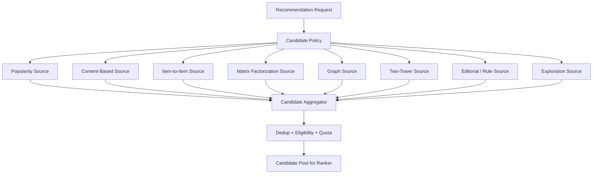
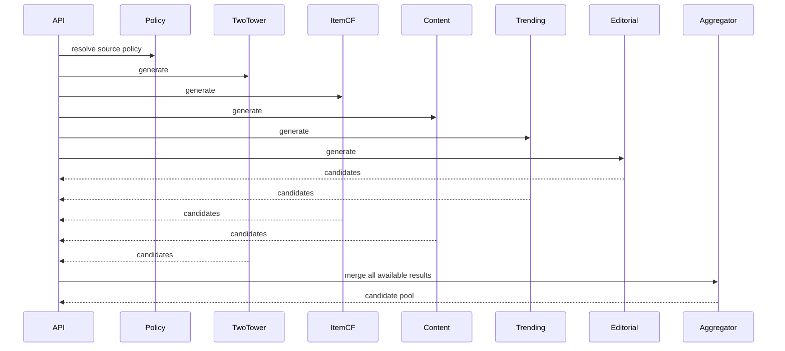
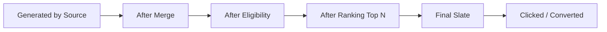
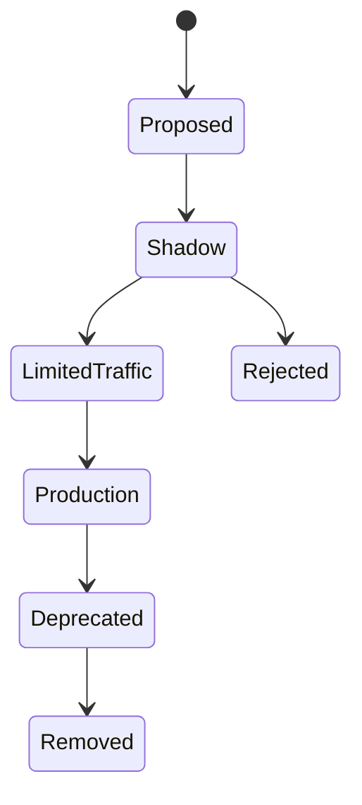

------
title: Build From Scratch Recommendations System - Part 025
description: Mendesain multi-source candidate generation production-grade: source portfolio, blending, quotas, dedup, source normalization, fallback, exploration, source contribution, candidate recall, dan operability.
series: learn-build-from-scratch-recommendations-system
seriesTitle: Build From Scratch: Enterprise Recommendations System
order: 25
partTitle: Multi-Source Candidate Generation
tags:
  - recommendation-system
  - recsys
  - candidate-generation
  - retrieval
  - multi-source
  - system-design
  - series
date: 2026-07-02
---

# Part 025 — Multi-Source Candidate Generation

Candidate generation jarang cukup jika hanya memakai satu source.

Satu source punya blind spot.

Popularity kuat untuk cold-start user, tetapi bias terhadap item populer.  
Content-based kuat untuk cold-start item, tetapi sering terlalu similar.  
Item-to-item kuat untuk PDP, tetapi butuh seed item.  
Matrix factorization kuat untuk collaborative retrieval, tetapi lemah untuk new items.  
Graph kuat untuk multi-hop relationship, tetapi bisa mahal dan noisy.  
Two-tower kuat untuk scalable personalized retrieval, tetapi butuh training data dan embedding infra.  
Editorial kuat untuk safety/launch, tetapi tidak scale untuk semua user.  
Rules kuat untuk enterprise constraints, tetapi tidak menangkap hidden preference.  
Exploration penting untuk data masa depan, tetapi berisiko jika tidak dikontrol.

Karena itu production recommendation system biasanya memakai **multi-source candidate generation**.

Part ini membahas bagaimana mendesain portfolio candidate sources yang seimbang, kuat, observable, dan bisa dikembangkan.

---

## 1. Mental Model: Candidate Portfolio

Candidate generation adalah portfolio, bukan single model.



Setiap source berkontribusi berbeda.

Goal candidate portfolio:

```text
high recall
+ source diversity
+ cold-start coverage
+ domain constraint safety
+ low latency
+ observable contribution
```

---

## 2. Why One Source Is Not Enough

### 2.1 Popularity Only

Good:

- stable,
- fast,
- works for anonymous users.

Bad:

- not personalized,
- popularity bias,
- long-tail poor,
- stale if not refreshed.

### 2.2 Content-Based Only

Good:

- cold item,
- explainable,
- metadata-aware.

Bad:

- over-specialized,
- misses behavioral complement,
- metadata quality dependent.

### 2.3 Collaborative Only

Good:

- hidden preference,
- behavior-driven.

Bad:

- cold-start weak,
- popularity bias,
- sparse for low activity users/items.

### 2.4 Two-Tower Only

Good:

- scalable,
- personalized,
- embedding retrieval.

Bad:

- training/serving complexity,
- data bias,
- model drift,
- hard to explain alone.

### 2.5 Rules Only

Good:

- safe,
- deterministic,
- enterprise-friendly.

Bad:

- limited personalization,
- maintenance burden,
- misses latent relation.

A robust system blends these.

---

## 3. Candidate Portfolio by Surface

Different surface needs different portfolio.

### 3.1 Home Feed

Goal: discovery.

Sources:

```text
two_tower personalized
matrix_factorization
content_based_session
trending_region
segment_popularity
editorial
fresh_item_exploration
graph_topic
```

### 3.2 Product Detail Page

Goal: related to seed item.

Sources:

```text
content_similar
co_view_alternatives
co_buy_complements
compatible_accessories
same_category_popularity
recently_viewed_related
```

### 3.3 Cart

Goal: cross-sell and attach.

Sources:

```text
frequently_bought_together
compatibility_graph
category_complements
low_return_addons
promotion_eligible_items
```

### 3.4 Search

Goal: explicit intent satisfaction.

Sources:

```text
lexical_search
semantic_search
query_category_popularity
query_rewrite_retrieval
zero_result_relaxation
```

### 3.5 Enterprise Case Workflow

Goal: correct, authorized, useful next support.

Sources:

```text
valid_actions_by_state_machine
policy_required_actions
knowledge_articles_by_case_topic
similar_cases_authorized
historical_success_actions
expert_curated_rules
```

Source portfolio must be surface-specific.

---

## 4. Candidate Policy as Control Plane

Define candidate policy in config.

```yaml
surface: home_feed
policy_version: home-candidates-v6
sources:
  - name: two_tower
    enabled: true
    quota: 800
    timeout_ms: 40
    required: false
  - name: matrix_factorization
    enabled: true
    quota: 300
    timeout_ms: 20
    required: false
  - name: content_based_session
    enabled: true
    quota: 300
    timeout_ms: 30
    required: false
  - name: trending_region
    enabled: true
    quota: 150
    timeout_ms: 10
    required: false
  - name: editorial_safe
    enabled: true
    quota: 50
    timeout_ms: 5
    required: false
  - name: new_item_exploration
    enabled: true
    quota: 50
    timeout_ms: 10
    required: false
minimum_pool_size: 700
fallback_sources:
  - segment_popularity
  - global_popularity
merge:
  keep_multi_source_provenance: true
  exact_dedup: true
  dedup_group_policy: one_per_group_before_ranker
```

Candidate policy is product logic.

It should be versioned, reviewed, monitored, and experimentable.

---

## 5. Source Quota Strategy

Quota controls how many candidates each source can contribute.

Reasons:

- prevent domination,
- control latency,
- ensure source diversity,
- bound feature/ranking cost,
- allow exploration.

Quota examples:

```text
two_tower: 800
item_cf: 300
content_based: 300
trending: 100
editorial: 50
exploration: 50
```

Quota does not mean final slate quota. Ranker can choose fewer/more from each source after scoring.

But candidate pool should provide enough variety.

---

## 6. Static vs Dynamic Quotas

Static quota:

```text
always two_tower 800, content 300
```

Simple.

Dynamic quota adapts by context:

```text
if user is new:
  reduce two_tower, increase popularity/content/editorial

if seed item exists:
  increase item-to-item/content-similar

if user has strong session intent:
  increase session/content/query source

if feature store degraded:
  increase baseline fallback

if no consent:
  disable behavioral sources
```

Example:

```yaml
quota_rules:
  - condition: user_history_count < 3
    overrides:
      two_tower: 200
      segment_popularity: 500
      editorial_safe: 100
      content_based_contextual: 300
  - condition: privacy_mode == non_personalized
    disable:
      - two_tower
      - matrix_factorization
      - user_graph
```

Dynamic quotas make candidate generation smarter but require careful observability.

---

## 7. Source Applicability Matrix

Document source applicability per surface/context.

| Source | Home | PDP | Cart | Search | Enterprise Case |
|---|---:|---:|---:|---:|---:|
| popularity | yes | fallback | fallback | yes | limited |
| trending | yes | limited | no | limited | no |
| content-based | yes | yes | limited | yes | yes |
| item-to-item | yes if history | yes | yes | limited | yes |
| MF | yes | maybe | no | no | limited |
| graph | yes | yes | yes | yes | yes |
| two-tower | yes | maybe | maybe | yes | possible |
| editorial | yes | yes | yes | yes | yes |
| valid actions | no | no | no | no | yes |

Applicability should be encoded, not tribal knowledge.

---

## 8. Parallel Execution

Sources should run in parallel under timeout.



Slow source should not block all sources unless required.

Use:

- per-source timeouts,
- cancellation,
- partial results,
- fallback if pool too small,
- circuit breaker for unhealthy sources.

---

## 9. Required vs Optional Sources

Some sources are optional:

- trending,
- MF,
- content-based,
- editorial.

Some may be required:

- enterprise valid action source,
- policy eligibility source,
- authorization-aware retrieval,
- safety source.

If required source fails:

```text
fail closed or return safe fallback
```

Example:

```yaml
valid_action_source:
  required: true
  failure_mode: fail_closed
```

For consumer home feed:

```yaml
two_tower:
  required: false
  failure_mode: fallback_to_popularity
```

Requiredness is domain/surface-specific.

---

## 10. Candidate Merge

When multiple sources return same item, merge.

Before merge:

```text
Candidate(source=A,item=X,score=0.8)
Candidate(source=B,item=X,score=0.5)
```

After merge:

```json
{
  "item_id": "X",
  "sources": [
    {"source": "two_tower", "score": 0.8, "rank": 12},
    {"source": "trending", "score": 0.5, "rank": 4}
  ],
  "source_count": 2
}
```

Multi-source presence is a valuable signal.

Candidate appearing from independent sources often deserves attention.

But do not simply add raw scores with incompatible semantics.

---

## 11. Source Score Normalization

Scores have different units.

Possible normalization:

### Rank-Based

```text
normalized_score = 1 / log(1 + source_rank)
```

Simple and robust.

### Percentile Within Source

```text
score_percentile = percentile(source_score among returned candidates)
```

### Z-score Within Source

```text
(score - mean) / std
```

Works if distribution stable.

### Learned by Ranker

Pass raw source score + source ID to ranker. Let ranker learn.

### Source Calibration

Calibrate source score to probability/lift if possible.

For candidate aggregation, often avoid cross-source score ordering. Let ranker handle.

---

## 12. Dedup Across Sources

Dedup exact item ID first.

Then maybe dedup group depending stage.

Example:

```text
product variants all returned from content source
same product returned from MF and trending
same article canonical URL
same video reupload
same enterprise document version
```

Dedup policy options:

### Early Dedup

Reduce ranker cost.

### Late Dedup

Let ranker see variants and choose.

### Group Candidate

Represent product family as candidate, resolve offer/variant later.

For e-commerce:

```text
candidate at product-family level for home feed
offer/SKU resolution later for checkout
```

Dedup policy must be surface-specific.

---

## 13. Eligibility Filtering Stage

Multiple filters:

### Source-level filter

Cheap/coarse.

```text
item active
surface allowed
tenant boundary if required
```

### Aggregator-level filter

Common filters after merge.

```text
item_type allowed
region available
dedup group
```

### Final serving filter

Strict request-specific.

```text
user suppression
policy
stock
permission
consent
```

Do not rely on source-level filtering only.

Track filter reasons.

---

## 14. Candidate Pool Quality

A candidate pool can be large but poor.

Quality indicators:

```text
candidate_recall@K
source diversity
item type coverage
category diversity
cold item coverage
long-tail coverage
filter rate
duplicate rate
source overlap
final slate contribution
```

A pool of 5000 candidates all from same category/source may have poor quality.

Candidate generation should optimize portfolio quality, not count.

---

## 15. Minimum Pool Size and Fallback

If candidate pool after filtering is too small, fallback.

Example:

```yaml
minimum_pool_size: 500
fallback:
  - segment_popularity
  - category_popularity
  - global_popularity
  - editorial_safe
```

Fallback can be additive or replacement.

```text
if pool size < 500:
    add segment popularity until pool reaches 500
```

Always log fallback.

If fallback is used frequently, candidate sources are unhealthy or overly narrow.

---

## 16. Source Contribution Funnel

Track candidate lifecycle.



Metrics per source:

```text
generated_count
merged_count
eligible_count
ranked_top_count
final_slate_count
click_count
conversion_count
hide_count
report_count
```

This tells whether a source is useful or wasteful.

---

## 17. Source Interaction Effects

A source may be useful even if few final items.

Example:

- exploration source rarely final, but discovers long-tail.
- editorial source has low CTR but protects safety/freshness.
- content source improves cold-start.
- trending source spikes during events.

Do not remove source based only on final clicks. Look at strategic role.

Metrics should be interpreted by source purpose.

---

## 18. Candidate Recall Analysis

Evaluate per source:

```text
source_recall@K
portfolio_recall@K
marginal_recall_gain
```

Marginal recall:

```text
Recall(all sources) - Recall(all sources except source X)
```

This shows source unique value.

A source with low individual recall but high marginal recall for cold items may be valuable.

Measure by segment:

- new users,
- new items,
- low-activity users,
- long-tail,
- high-value categories,
- enterprise roles.

---

## 19. Source Overlap

Sources can overlap heavily.

Overlap matrix:

| | two_tower | MF | content | trending |
|---|---:|---:|---:|---:|
| two_tower | 1.0 | 0.45 | 0.20 | 0.10 |
| MF | 0.45 | 1.0 | 0.15 | 0.08 |
| content | 0.20 | 0.15 | 1.0 | 0.05 |
| trending | 0.10 | 0.08 | 0.05 | 1.0 |

High overlap may mean redundancy. But overlap with independent sources can signal confidence.

Track:

```text
source_pair_overlap_rate
average_source_count_per_candidate
unique_candidates_by_source
```

---

## 20. Candidate Portfolio for Cold Start

### New User

Use:

- contextual popularity,
- editorial,
- trending,
- content from onboarding/query/session,
- region/category popularity,
- exploration.

Reduce:

- user MF,
- long-term CF,
- user graph.

### New Item

Use:

- content-based,
- editorial/new arrival,
- exploration,
- category/creator prior,
- graph metadata edges.

Collaborative sources will underrepresent new items.

Candidate policy should explicitly handle cold-start.

---

## 21. Candidate Portfolio for Privacy Modes

Privacy mode affects source availability.

### Personalized Mode

All allowed sources.

### Contextual Mode

No behavioral user history, but current context/seed/query allowed depending consent.

### Non-Personalized Mode

Only global/contextual/editorial sources.

Example:

```yaml
privacy_mode_sources:
  personalized:
    - two_tower
    - mf
    - item_cf
    - graph_user
    - content_session
    - popularity
  contextual:
    - seed_content
    - query_retrieval
    - region_popularity
    - editorial
  non_personalized:
    - global_popularity
    - editorial
    - trending_public
```

Candidate policy must enforce this, not rely on source teams remembering.

---

## 22. Candidate Portfolio for Enterprise

Enterprise source portfolio should prioritize correctness.

Example case recommendation:

```yaml
sources:
  valid_actions_by_state:
    required: true
    quota: 50
  policy_required_actions:
    required: true
    quota: 20
  knowledge_articles_by_case_topic:
    required: false
    quota: 100
  similar_cases_authorized:
    required: false
    quota: 100
  historical_success_actions:
    required: false
    quota: 50
filters:
  - tenant_boundary
  - actor_permission
  - case_state_validity
  - jurisdiction
  - policy_version_valid
```

Candidate source that returns unauthorized item is a serious incident.

---

## 23. Exploration as a Source

Exploration source generates candidates not fully optimized for current predicted score.

Goals:

- collect data for new items,
- reduce bias,
- test uncertain candidates,
- improve long-tail coverage,
- estimate propensities.

Candidate must include:

```json
{
  "source": "exploration_new_items",
  "exploration_policy": "new-item-v2",
  "propensity": 0.015,
  "exploration_reason": "cold_start_item"
}
```

Ranker/reranker may reserve slots or apply controlled randomization.

Exploration should be capped and monitored.

---

## 24. Sponsored / Business Candidates

If system has sponsored/promoted/business-rule candidates, treat them as candidate source with explicit provenance.

```json
{
  "source": "sponsored_campaign",
  "campaign_id": "camp_123",
  "bid": 1.25,
  "eligibility_status": "coarse_filtered",
  "disclosure_required": true
}
```

Do not hide business source as organic recommendation.

Ranking/reranking must enforce:

- disclosure,
- policy,
- relevance floor,
- user experience guardrails,
- campaign budget,
- frequency cap.

---

## 25. Source Governance

Each candidate source needs owner.

Source registry:

```yaml
source: matrix_factorization
owner_team: recsys-ml
purpose: collaborative personalized retrieval
allowed_surfaces:
  - home_feed
  - email_digest
privacy:
  requires_personalization_consent: true
dependencies:
  - user_vector_store
  - item_vector_index
freshness:
  model_retrain: daily
  index_refresh: daily
```

Candidate source without owner becomes operational risk.

---

## 26. Candidate Source Lifecycle

Lifecycle:



### Shadow

Source runs but does not affect final ranking. Log candidates.

### Limited Traffic

Small experiment.

### Production

Enabled by candidate policy.

### Deprecated

No new traffic; kept for fallback/model dependency if needed.

This prevents risky source launches.

---

## 27. Shadow Evaluation

Before enabling source:

- run in shadow,
- measure recall contribution,
- filter rate,
- latency,
- overlap,
- candidate quality,
- safety violations,
- cold-start coverage.

Shadow source can reveal:

```text
returns too many unavailable items
latency too high
overlaps 95% with existing source
great recall for cold items
```

Do not send to ranker before basic quality is known.

---

## 28. Candidate Source A/B Testing

Experiment knobs:

- enable source,
- change quota,
- change model version,
- change index,
- change merge policy,
- change exploration rate.

Metrics:

- final product metrics,
- source contribution,
- latency,
- candidate recall,
- filter rate,
- diversity,
- guardrails.

If source adds candidates but ranker never selects them, maybe ranker needs retraining or source quality is poor.

Candidate source experiments can be subtle because ranker mediates impact.

---

## 29. Ranker Training and Candidate Distribution

Ranker trained on historical candidate distribution may not handle new source well.

If new source introduces different candidate distribution:

- score calibration may be off,
- features missing,
- ranker may under-score,
- offline metrics may not reflect online.

Mitigations:

- shadow log source candidates,
- include source features,
- retrain ranker with source candidates,
- use exploration/interleaving,
- source-specific calibration,
- gradual rollout.

Candidate generation and ranking must co-evolve.

---

## 30. Candidate Source Features

For each source, pass features.

Examples:

```text
two_tower_score
two_tower_rank
mf_dot_product
item_cf_similarity
i2i_lift
content_similarity
graph_ppr
popularity_score
trending_score
editorial_priority
exploration_propensity
```

Ranker can learn source reliability by context.

Keep feature contracts stable.

---

## 31. Source-Aware Reranking

Even after ranking, reranker may enforce source mix.

Example:

```yaml
final_slate_constraints:
  max_sponsored: 2
  min_exploration_if_eligible: 1
  max_same_source_if_low_diversity: 8
  must_include_policy_required_actions: true
```

Use carefully. Hard source quotas can reduce relevance. But some business/safety/exploration goals require them.

Separate:

- source quota at candidate stage,
- final slate source constraints,
- ranking objective.

---

## 32. Handling Empty Sources

Empty source can mean:

- not applicable,
- user cold-start,
- dependency failure,
- source index stale,
- all candidates filtered,
- source bug,
- surface unsupported.

Status should distinguish.

```json
{
  "source": "item_cf",
  "status": "empty",
  "empty_reason": "no_user_history"
}
```

or:

```json
{
  "source": "item_cf",
  "status": "empty",
  "empty_reason": "all_candidates_filtered_by_policy"
}
```

This improves debugging.

---

## 33. Candidate Pool Debugging Questions

When recommendation bad, ask:

```text
Did good item appear in any candidate source?
Which sources returned it?
Was it filtered before ranking?
Was it ranked low?
Was it removed by reranker?
Was it ineligible?
Was source disabled by privacy/experiment?
Did source timeout?
Was candidate pool too small?
```

This is why candidate provenance and debug trace matter.

---

## 34. Multi-Source Failure Modes

### 34.1 All Sources Return Same Popular Items

Low diversity, long-tail poor.

### 34.2 New Source Never Selected

Ranker distribution mismatch or source low quality.

### 34.3 Source Timeout Causes Empty Pool

No fallback or too much reliance on one source.

### 34.4 Source Returns Invalid Items

Stale index/list or weak eligibility.

### 34.5 Candidate Pool Too Large

Feature/ranking latency explosion.

### 34.6 Exploration Overexposes Bad Items

Guardrails insufficient.

### 34.7 Privacy Mode Bug

Personalized source used when disabled.

### 34.8 Enterprise Authorization Leak

Unauthorized candidates generated.

### 34.9 No Source Attribution

Cannot understand production behavior.

### 34.10 Candidate Policy Drift

Config changes without evaluation.

---

## 35. Implementation Sketch

Candidate orchestrator:

```java
public final class CandidateGenerationOrchestrator {
    private final CandidatePolicyRegistry policyRegistry;
    private final Map<String, CandidateSource> sources;
    private final CandidateAggregator aggregator;
    private final EligibilityService eligibilityService;
    private final FallbackCandidateService fallbackService;

    public CandidatePool generate(RecommendationRequest request) {
        CandidatePolicy policy = policyRegistry.resolve(request.surface(), request.context());

        List<CandidateSourceCall> calls = policy.sources().stream()
            .filter(sourceConfig -> sourceConfig.enabled())
            .filter(sourceConfig -> sources.get(sourceConfig.name()).isApplicable(request))
            .map(sourceConfig -> callAsync(sourceConfig, request))
            .toList();

        List<CandidateSourceResult> results = waitWithinBudget(calls, policy.totalTimeout());

        CandidatePool pool = aggregator.merge(results, policy.mergePolicy());
        CandidatePool eligiblePool = eligibilityService.filter(pool, request.context());

        if (eligiblePool.size() < policy.minimumPoolSize()) {
            CandidatePool fallback = fallbackService.generate(request, policy.fallbackSources());
            eligiblePool = aggregator.merge(List.of(eligiblePool, fallback), policy.mergePolicy());
        }

        return eligiblePool.withDiagnostics(results);
    }
}
```

Important details:

- async calls,
- per-source timeout,
- diagnostics,
- fallback,
- eligibility,
- provenance preservation.

---

## 36. Candidate Aggregator Sketch

```java
public final class CandidateAggregator {
    public CandidatePool merge(List<CandidateSourceResult> results, MergePolicy policy) {
        Map<String, AggregatedCandidate> byItemId = new HashMap<>();

        for (CandidateSourceResult result : results) {
            if (!result.status().canUseCandidates()) {
                continue;
            }

            for (Candidate candidate : result.candidates()) {
                String key = policy.exactDedup()
                    ? candidate.itemId()
                    : candidate.candidateKey();

                byItemId.computeIfAbsent(key, ignored -> AggregatedCandidate.from(candidate))
                        .addSource(candidate);
            }
        }

        return new CandidatePool(
            byItemId.values().stream()
                .limit(policy.maxMergedCandidates())
                .toList()
        );
    }
}
```

Production needs better top-K handling, quotas, dedup groups, and memory safety.

---

## 37. Data Model for Aggregated Candidate

```json
{
  "item_id": "item_123",
  "item_type": "product",
  "dedup_group_id": "family_123",
  "sources": [
    {
      "source": "two_tower",
      "version": "v5",
      "rank": 12,
      "score": 0.82,
      "score_type": "inner_product"
    },
    {
      "source": "content_based",
      "version": "v3",
      "rank": 8,
      "score": 0.77,
      "score_type": "cosine_similarity"
    }
  ],
  "aggregated_features": {
    "source_count": 2,
    "best_source_rank": 8,
    "has_two_tower": true,
    "has_content_based": true
  },
  "provenance": {
    "reason_codes": ["embedding_match", "same_topic"]
  }
}
```

This becomes input to feature fetch/ranker.

---

## 38. Minimal Production Multi-Source Plan

For first robust system:

```yaml
home_feed:
  sources:
    segment_popularity: 300
    content_based_user_session: 300
    item_cf_from_history: 300
    matrix_factorization: 500
    trending_region: 100
    editorial_safe: 50
  fallback:
    - segment_popularity
    - global_popularity

product_detail:
  sources:
    content_similar: 300
    co_view: 300
    co_buy: 200
    category_popularity: 100
  fallback:
    - same_category_popularity
    - global_popularity

enterprise_case:
  sources:
    valid_actions: required
    policy_required: required
    knowledge_by_topic: 100
    similar_cases_authorized: 100
  fallback:
    - policy_required
```

Then add:

- two-tower,
- graph PPR,
- exploration,
- sponsored/business sources if applicable.

---

## 39. Checklist Multi-Source Candidate Generation

```text
[ ] Candidate policy exists per surface.
[ ] Source applicability is defined.
[ ] Source quotas are defined.
[ ] Per-source timeout exists.
[ ] Sources run in parallel where possible.
[ ] Required vs optional source behavior is explicit.
[ ] Candidate merge preserves multi-source provenance.
[ ] Score semantics are not mixed blindly.
[ ] Exact item dedup exists.
[ ] Dedup group strategy exists.
[ ] Final eligibility filtering exists.
[ ] Minimum pool size and fallback exist.
[ ] Source contribution funnel is monitored.
[ ] Candidate recall is measured per source and portfolio.
[ ] Source overlap is monitored.
[ ] Cold-start policy changes source mix.
[ ] Privacy mode disables behavioral sources.
[ ] Enterprise authorization is enforced.
[ ] Exploration source logs propensity.
[ ] Source lifecycle includes shadow mode.
[ ] Ranker retraining considers new source distribution.
```

---

## 40. Kesimpulan

Multi-source candidate generation adalah cara production recommendation system menghindari blind spot.

Prinsip utama:

1. Candidate generation is a portfolio.
2. Source mix must be surface-specific.
3. Source quotas control recall, cost, and diversity.
4. Scores are source-native; do not compare raw scores blindly.
5. Multi-source provenance is a feature, not noise.
6. Candidate recall and source contribution must be measured.
7. Cold-start, privacy, and enterprise modes require different source policies.
8. Exploration is a source with propensity and guardrails.
9. Candidate source lifecycle needs shadow, experiment, production, deprecation.
10. Ranker and candidate distribution must evolve together.

Di Part 026, kita masuk ke retrieval modern: **Two-Tower Retrieval Model**, fondasi untuk scalable personalized retrieval dengan user/query tower, item tower, embedding index, negative sampling, dan ANN serving.
