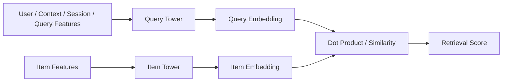
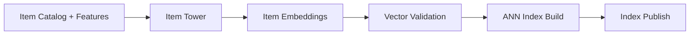
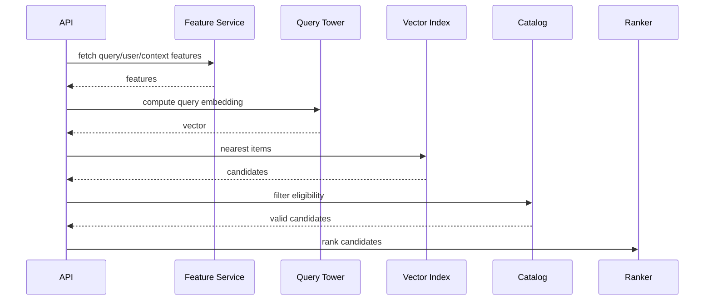

------
title: Build From Scratch Recommendations System - Part 026
description: Membangun two-tower retrieval model production-grade dari nol: query/user tower, item tower, embedding objective, positive pairs, negatives, in-batch sampling, ANN index, serving, training-serving consistency, dan operational trade-offs.
series: learn-build-from-scratch-recommendations-system
seriesTitle: Build From Scratch: Enterprise Recommendations System
order: 26
partTitle: Two-Tower Retrieval Model
tags:
  - recommendation-system
  - recsys
  - two-tower
  - retrieval
  - embeddings
  - approximate-nearest-neighbor
  - series
date: 2026-07-02
---

# Part 026 — Two-Tower Retrieval Model

Two-tower retrieval adalah salah satu pattern paling penting dalam recommendation system modern.

Tujuannya:

> Mengambil kandidat relevan dari jutaan atau ratusan juta item secara cepat dengan embedding search.

Model terdiri dari dua tower:

1. **Query/User Tower**  
   Mengubah user/context/query/session menjadi vector.

2. **Item Tower**  
   Mengubah item menjadi vector.

Score:

```text
score(query, item) = dot(query_embedding, item_embedding)
```

Item embeddings diprecompute dan dimasukkan ke vector index. Saat request datang, sistem menghitung query embedding lalu mencari nearest item embeddings.

Two-tower adalah evolusi natural dari matrix factorization. Bedanya, tower bisa memakai feature kaya: user history, context, query, item metadata, text/image embeddings, category, dan domain features.

Part ini membahas two-tower retrieval dari nol: model structure, data construction, objective, negatives, in-batch sampling, ANN serving, consistency, limitations, dan production design.

---

## 1. Mental Model: Learn Compatible Embedding Spaces

Two-tower belajar dua fungsi:

```text
f_query(user, context, session, query) -> vector q
f_item(item features) -> vector v
```

Lalu:

```text
score = q · v
```

Training membuat positive pairs punya dot product tinggi dan negatives punya dot product rendah.

Diagram:



Serving:

```text
query embedding -> ANN index -> topK item embeddings
```

---

## 2. Why Two-Tower

Two-tower solves scale.

If catalog has 10M items, scoring every item with rich ranker per request is too expensive.

Two-tower allows:

- precompute item embeddings offline,
- index item embeddings,
- compute query embedding online,
- retrieve topK quickly.

Benefits:

- scalable personalized retrieval,
- supports rich user/context/item features,
- good candidate source for ranker,
- can handle cold items if item tower uses content features,
- can support query recommendation/search-like use cases.

Limitations:

- dot product interaction is simple,
- hard to model complex cross features at retrieval stage,
- depends heavily on negative sampling,
- embedding index can be stale,
- score not necessarily calibrated,
- filtering/eligibility still required,
- explainability weaker than explicit sources.

---

## 3. Two-Tower vs Matrix Factorization

Matrix factorization:

```text
user_id -> learned vector
item_id -> learned vector
score = dot
```

Two-tower:

```text
user/context/session/query features -> neural/ML function -> vector
item/content/features -> neural/ML function -> vector
score = dot
```

MF learns lookup vectors. Two-tower can generalize using features.

Example:

New item with metadata can get embedding from item tower even before many interactions.

New user/session can get query embedding from context/session signals.

Two-tower is more flexible but more complex.

---

## 4. Query Tower Inputs

Query tower can consume:

### User identity features

```text
user_id embedding
anonymous_id embedding
tenant_id embedding
user segment
subscription tier
```

### User history

```text
recent clicked item IDs
recent purchased item IDs
recent watched topics
long-term category affinity
user embedding from MF
```

### Session/context

```text
session recent items
query text
surface
device
local hour
region
locale
cart contents
seed item
case state
actor role
```

### Aggregated features

```text
category affinity
creator affinity
price preference
topic distribution
```

Not every surface needs every input.

For home feed, user history matters.  
For search, query text matters.  
For PDP, seed item matters.  
For enterprise case, case context and role matter.

---

## 5. Item Tower Inputs

Item tower can consume:

### ID features

```text
item_id embedding
category_id embedding
brand/creator_id embedding
seller_id embedding
```

### Structured metadata

```text
price bucket
duration bucket
language
region
quality score
freshness
item type
taxonomy path
```

### Content features

```text
text embedding
image embedding
audio/video embedding
document embedding
topic distribution
```

### Domain features

```text
compatibility attributes
skill requirements
jurisdiction
policy version
case applicability
action type
```

For cold-start item, item tower should not depend only on item_id. It needs content/metadata features.

---

## 6. Positive Pairs

Training data is pairs:

```text
(query_context, positive_item)
```

Examples:

### E-commerce

```text
user/session before click -> clicked product
user/session before purchase -> purchased product
cart context -> add-on purchased
```

### Video

```text
watch history -> next completed video
session context -> watched video
```

### Search

```text
query -> clicked/purchased result
```

### Enterprise

```text
case context + actor role -> accepted useful action
case topic -> used knowledge article
```

Positive pair should use features as-of prediction time.

Do not include future interactions in query history.

---

## 7. Positive Event Strength

Not all positives equal.

Possible weights:

```text
click = 1
long dwell = 2
add_to_cart = 3
purchase = 5
watch_complete = 4
save/like = 3
accepted_action_with_success = 5
```

Training can weight examples by positive strength.

But be careful:

- click is noisy,
- purchase is sparse,
- combining all positives may blur objective.

Often train separate retrieval models or use weighted mix.

---

## 8. Negative Sampling

Two-tower training needs negatives.

Sources:

- in-batch negatives,
- random catalog negatives,
- popularity sampled negatives,
- same-category negatives,
- hard negatives from existing retrieval,
- exposed-but-not-clicked negatives,
- semantically similar negatives,
- policy/invalid excluded, not preference negatives.

Negative sampling shapes embedding space.

For retrieval, common starting point:

```yaml
negative_mix:
  in_batch: primary
  popularity_sampled: supplemental
  same_category: hard
  exposed_no_click: hard_with_weight
```

False negatives are common. Use weights and filtering.

---

## 9. In-Batch Negatives

Batch:

```text
(q1, item1)
(q2, item2)
(q3, item3)
```

For `q1`, `item2` and `item3` are negatives.

This is efficient.

Loss treats correct item for each query as target among batch items.

Problem:

- item2 might also be relevant to q1,
- batch distribution affects training,
- popular items appear often,
- duplicate positives in batch can conflict.

Mitigation:

- remove known positives from in-batch negatives,
- large batch,
- sampled correction,
- domain-aware batching,
- downweight potential false negatives.

---

## 10. Softmax Retrieval Loss

For a batch of N positive pairs:

```text
scores[i][j] = dot(query_i, item_j)
```

For each row i, item_i is positive. Others are negatives.

Loss:

```text
cross_entropy(softmax(scores[i]), target=i)
```

This trains query embedding closer to positive item embedding than other batch items.

Temperature can control sharpness:

```text
softmax(scores / temperature)
```

Lower temperature makes training focus harder differences.

---

## 11. Dot Product vs Cosine

Score options:

### Dot Product

```text
q · v
```

Common for ANN maximum inner product search.

Vector norms matter. Popular items may get large norms.

### Cosine Similarity

```text
normalize q and v, then dot
```

Controls norm, focuses on direction.

Choice affects retrieval.

If using dot product, monitor vector norms.

```text
query_vector_norm
item_vector_norm
```

If item norms explode, popular items can dominate.

---

## 12. Tower Architecture

Start simple.

### Query Tower

```text
user_id embedding
+ pooled recent item embeddings
+ context embeddings
+ dense features
-> MLP
-> normalized query embedding
```

### Item Tower

```text
item_id embedding
+ category/brand embeddings
+ text/image embeddings
+ dense metadata
-> MLP
-> item embedding
```

Output dimension:

```text
64, 128, 256
```

Do not overbuild initially. Retrieval model should be fast and stable.

---

## 13. History Encoding

User history can be encoded by:

### Average Pooling

```text
mean embeddings of recent interacted items
```

Simple and strong baseline.

### Weighted Pooling

```text
sum(weight(event) * item_embedding)
```

with recency and event strength.

### Attention

Learn which history items matter.

More powerful, more expensive.

### Sequence Encoder

Transformer/RNN for order-aware sessions.

Use later if session order important.

For initial two-tower, weighted average of recent item/category embeddings is often enough.

---

## 14. Item ID vs Content Features

If item tower uses item_id embedding only:

- strong for known items,
- weak for cold items,
- cannot generalize to new items.

If item tower uses content metadata:

- better cold-start,
- more robust,
- but depends on metadata quality.

Hybrid:

```text
item_embedding_input =
  item_id_embedding
  + category_embedding
  + text_embedding_projection
  + dense_features
```

For new item missing item_id learned embedding, use content features.

---

## 15. Feature Freshness

Training query features must match serving availability.

Examples:

- recent session events: seconds freshness,
- long-term profile: hours/day,
- item metadata: hours/day,
- stock/policy: should be filter, not just feature,
- user vector features: batch refresh.

If a feature is unavailable online, don't use it in training.

Training-serving consistency is critical.

---

## 16. Training Dataset for Two-Tower

Training example:

```json
{
  "query_id": "q_001",
  "prediction_time": "2026-07-02T10:00:00Z",
  "surface": "home_feed",
  "query_features": {
    "user_id": "u123",
    "recent_item_ids": ["A", "B", "C"],
    "region": "ID-JK",
    "device_type": "mobile"
  },
  "positive_item": {
    "item_id": "D",
    "event": "purchase",
    "weight": 5.0
  },
  "metadata": {
    "dataset_version": "retrieval-ds-20260702",
    "label_version": "positive-pair-v2"
  }
}
```

For each positive, query history must exclude the positive event and anything after it.

---

## 17. Avoiding Leakage in Query History

If target item D clicked at 10:05, query history must include events before 10:05 only.

Bad:

```text
recent_item_ids include D after target click
```

Good:

```text
recent_item_ids = events before prediction_time
positive_item = D
```

For purchase target, if user clicked D before purchase, should click D be in history?

Depends on task.

If training purchase retrieval from homepage impression, use history before impression.  
If training "next purchase after click", click can be history.

Spec must define prediction point.

---

## 18. Multi-Task / Multi-Surface Training

One two-tower can train across surfaces:

```text
home_feed clicks
PDP related clicks
search clicks
email opens
```

But surfaces have different intents.

Add surface feature or train separate models.

Options:

1. Separate model per major surface.
2. Shared model with surface embedding.
3. Shared item tower, separate query tower heads.
4. Multi-task objective.

Start with surface-specific if behavior differs strongly.

---

## 19. Item Embedding Generation

After training, compute item embeddings for all eligible items.

Batch job:



Need:

- item feature snapshot,
- model version,
- embedding dimension,
- vector norm checks,
- eligible item filter,
- index build validation,
- rollback path.

---

## 20. Query Embedding Serving

Online:

```text
request -> features -> query tower -> query embedding
```

Needs:

- feature fetch,
- history encoding,
- model inference,
- timeout,
- fallback if missing features,
- same preprocessing as training.

Serving flow:



---

## 21. ANN Index

ANN index supports fast nearest neighbor retrieval.

Index stores item embeddings.

Query:

```text
topK items by dot product/cosine
```

Need to track:

- index version,
- embedding model version,
- item catalog version,
- build time,
- item count,
- recall benchmark,
- latency benchmark.

If index uses old embeddings with new query tower, retrieval breaks. Query tower and item index must be compatible.

---

## 22. Index Compatibility

Two-tower model version includes both towers.

If you update query tower but not item embeddings, score space may change.

Safe deployment:

1. Train two-tower model.
2. Generate item embeddings with item tower.
3. Build index.
4. Deploy query tower with matching index.
5. Log model/index version together.

Compatibility contract:

```yaml
retrieval_model_version: two-tower-20260702
query_tower_version: qtower-20260702
item_tower_version: itower-20260702
index_version: item-index-20260702
embedding_dimension: 128
score_type: inner_product
```

---

## 23. Candidate Filtering with ANN

ANN retrieves nearest items, but not all are valid.

Filters:

- item active,
- region,
- availability,
- policy,
- surface,
- user suppression,
- tenant/permission,
- not already consumed,
- dedup group.

Filtering after ANN can reduce candidate count.

If filter rate high, use filtered ANN or over-fetch.

Example:

```text
need 500 valid candidates
ANN fetch 2000
after filters 650 remain
```

Monitor filter rate.

---

## 24. Pre-Filter vs Post-Filter

### Post-filter

Simpler:

```text
ANN topK -> filter
```

But can waste retrieval on invalid items.

### Pre-filter

Restrict ANN search by metadata:

```text
region=ID, item_type=product, surface=home
```

More efficient but index/query system more complex.

For enterprise authorization, pre-filter may be mandatory.

Hybrid:

- separate indexes by major partition,
- ANN metadata filters,
- final strict filter.

---

## 25. Over-Fetching

Because filters remove candidates:

```text
requested_valid = 500
ann_topK = 2000
```

Over-fetch factor depends on filter rate.

```text
overfetch = desired / expected_pass_rate
```

If only 30% pass:

```text
500 / 0.3 = 1667
```

Monitor pass rate by surface/segment/source.

---

## 26. Two-Tower Candidate Contract

Candidate output:

```json
{
  "item_id": "item_123",
  "source": "two_tower",
  "source_version": "two-tower-20260702",
  "source_rank": 17,
  "source_score": 8.42,
  "score_type": "inner_product",
  "provenance": {
    "query_tower_version": "qtower-20260702",
    "item_index_version": "item-index-20260702",
    "query_embedding_norm": 1.03,
    "item_embedding_norm": 0.98
  },
  "eligibility_status": "needs_final_check"
}
```

Include enough metadata to debug model/index issues.

---

## 27. Hard Negatives for Two-Tower

Two-tower can learn shallow separation if negatives are too easy.

Hard negatives:

- items retrieved by previous model but not clicked,
- shown but not clicked,
- same category alternatives,
- semantically similar but not selected,
- high popularity items not relevant,
- search results skipped.

Hard negatives improve retrieval precision but increase false negative risk.

Use a mix.

```yaml
negative_mix:
  in_batch: 70%
  popularity_sampled: 10%
  same_category: 10%
  exposed_no_click: 10%
```

Tune by recall and online metrics.

---

## 28. False Negatives in In-Batch

If two users in batch have overlapping interests, one user's positive item may be another user's valid item.

Example:

```text
q1 positive = camera
q2 positive = lens
q1 might also like lens
```

Loss treats lens as negative for q1.

Mitigation:

- remove known positives,
- use soft labels if known related,
- larger diverse batches,
- reduce weight for likely false negatives,
- use sampled negatives with filters,
- train with multiple positives per query if possible.

False negatives are unavoidable; control damage.

---

## 29. Multiple Positives per Query

A query context may have multiple positive items.

Example:

```text
user session -> clicked items A, B, C
```

Instead of one positive:

```text
target=A
```

Use multi-positive loss:

```text
A, B, C all positives
```

This reduces false negatives.

Implementation more complex but useful.

At minimum, avoid placing known positives as negatives.

---

## 30. Popularity Bias in Two-Tower

Two-tower can learn popularity.

Popular items are positives for many queries and appear in many batches.

Mitigations:

- popularity-adjusted sampling,
- downweight overexposed items,
- source diversity in final slate,
- novelty/reranking,
- candidate mix with long-tail sources,
- evaluate by popularity bucket,
- monitor item exposure concentration.

Do not expect model alone to solve popularity bias.

---

## 31. Embedding Collapse

Failure mode: embeddings collapse, scores not meaningful.

Symptoms:

- all query vectors similar,
- item vector norms extreme,
- ANN returns same items for everyone,
- low diversity,
- high popularity concentration.

Monitor:

```text
query_embedding_norm
item_embedding_norm
embedding variance
nearest neighbor diversity
top item frequency
average pairwise similarity
```

Use:

- normalization,
- regularization,
- better negatives,
- batch diversity,
- learning rate tuning.

---

## 32. Offline Evaluation

Retrieval metrics:

```text
Recall@K
HitRate@K
NDCG@K
MRR
coverage
cold item recall
cold user recall
long-tail recall
source overlap
```

Evaluate with temporal split.

For each example:

```text
query context before target -> retrieve topK -> check if target positive item is included
```

Use realistic filtering.

Also evaluate index recall separately:

```text
exact topK vs ANN topK
```

---

## 33. ANN Recall vs Model Recall

Two retrieval failures:

### Model Recall Failure

Positive item not close in embedding space.

### ANN Recall Failure

Positive item is close exactly but ANN index failed to retrieve.

Evaluate both.

- exact brute force on sample,
- ANN search on same sample,
- compare.

Metrics:

```text
ANN recall@K relative to exact
ANN latency p95
index memory
build time
```

Do not blame model for index misconfiguration.

---

## 34. Online Evaluation

Candidate source metrics:

```text
two_tower_return_count
two_tower_filter_rate
two_tower_final_slate_contribution
two_tower_clicks/conversions
two_tower_latency
two_tower_timeout_rate
two_tower_empty_rate
```

Product metrics:

- CTR,
- conversion,
- watch completion,
- retention,
- hide/report,
- diversity,
- long-tail exposure.

Two-tower can improve candidate recall but final online impact depends on ranker and reranker.

---

## 35. Training-Serving Skew

Common skews:

- training uses clean batch features, serving uses stale online features,
- item tower generated embeddings with different preprocessing,
- query tower deployed with wrong index,
- category IDs differ,
- missing feature default mismatch,
- history sequence includes current item online but not training,
- text embedding version mismatch,
- normalization mismatch.

Mitigate:

- shared preprocessing,
- feature contracts,
- model/index compatibility checks,
- online feature logging,
- shadow evaluation,
- request replay.

---

## 36. Deployment Strategy

Safe rollout:

1. Train model.
2. Build item embeddings/index.
3. Offline evaluation.
4. Shadow online retrieval.
5. Compare source metrics and candidate recall proxy.
6. Enable small traffic as candidate source.
7. Monitor contribution/filter/latency/guardrails.
8. Retrain ranker if distribution changes.
9. Ramp up.

Do not replace all candidate sources at once.

---

## 37. Shadow Mode

In shadow mode:

- compute query embedding,
- retrieve candidates,
- log candidates,
- do not send to ranker/final slate.

Measure:

- latency,
- empty rate,
- invalid/filter rate,
- overlap with existing sources,
- held-out/live proxy recall,
- safety violations.

Shadow mode catches many issues before user impact.

---

## 38. Query Tower Feature Failures

If user features missing:

Options:

- use anonymous/session-only tower,
- use default user embedding,
- use context-only vector,
- fallback to popularity/content,
- skip two-tower source.

Do not return random vector silently.

Candidate source status:

```text
skipped_not_applicable: missing_required_user_features
```

or:

```text
fallback_used: context_only_query_vector
```

Log it.

---

## 39. Item Tower Feature Failures

If item embedding missing:

- item absent from index,
- use content-only fallback embedding,
- include via other candidate sources,
- schedule embedding backfill.

Monitor:

```text
item_embedding_coverage
embedding_missing_by_item_type
index_item_count_vs_catalog_eligible_count
```

Cold-start item support depends on this.

---

## 40. Two-Tower in Enterprise

Enterprise use cases:

- case context -> knowledge article,
- actor + case -> next action,
- query/case summary -> similar document,
- user role/context -> recommended workflow.

Constraints:

- tenant isolation,
- role permission,
- jurisdiction,
- case state validity,
- policy version,
- audit.

For restricted corpus, item index may need partitioning:

```text
tenant-specific index
permission-filtered index
metadata-filtered ANN
```

For high-stakes actions, two-tower should be candidate source only. Final validation/rules must enforce correctness.

---

## 41. Explainability

Two-tower itself is opaque.

Possible explanations:

- use source provenance: “matched your recent activity”
- map candidate to semantic overlap: category/topic match,
- use seed item/history nearest contribution,
- combine with content/graph reason,
- let ranker/reranker choose explanation from available provenance.

Do not claim exact causality from embedding match.

Internal debug can show:

```text
query embedding built from recent items A, B, C
candidate retrieved by ANN rank 12
source score 8.42
```

User-facing explanation should be semantic and truthful.

---

## 42. Cost Considerations

Costs:

- training compute,
- embedding generation,
- index build,
- index memory,
- online model inference,
- vector search latency,
- feature fetch,
- monitoring.

Optimization:

- smaller dimension,
- quantization,
- partitioned indexes,
- cache query embeddings for session,
- precompute user embeddings,
- batch item embedding generation,
- reduce overfetch after better filtering,
- use two-stage retrieval.

Cost must be justified by recall/online lift.

---

## 43. Common Anti-Patterns

### 43.1 Train with Future History

Leakage inflates offline recall.

### 43.2 Use Item ID Only

Cold-start item fails.

### 43.3 Easy Negatives Only

Model cannot distinguish plausible items.

### 43.4 Deploy Query Tower with Wrong Index

Retrieval becomes meaningless.

### 43.5 No ANN Recall Test

Index silently misses good candidates.

### 43.6 No Eligibility Filter

ANN returns invalid items.

### 43.7 No Source Provenance

Cannot debug candidate source.

### 43.8 Treat Dot Product as Calibrated Probability

It is retrieval score, not probability.

### 43.9 Replace All Sources at Once

Risky and hard to attribute.

### 43.10 No Ranker Retraining

New candidate distribution ignored by downstream ranker.

---

## 44. Implementation Sketch

Conceptual interfaces:

```java
public interface QueryTower {
    Embedding encode(QueryTowerInput input);
}

public interface ItemTower {
    Embedding encode(ItemTowerInput input);
}

public interface VectorIndex {
    List<VectorSearchResult> search(Embedding query, int topK, VectorFilter filter);
}
```

Candidate source:

```java
public final class TwoTowerCandidateSource implements CandidateSource {
    private final QueryTower queryTower;
    private final FeatureAssembler featureAssembler;
    private final VectorIndex vectorIndex;
    private final TwoTowerConfig config;

    public CandidateSourceResult generate(CandidateSourceRequest request) {
        QueryTowerInput input = featureAssembler.buildQueryInput(request);

        if (!input.hasRequiredFeatures()) {
            return CandidateSourceResult.skipped(name(), version(), "missing_required_features");
        }

        Embedding query = queryTower.encode(input);

        List<VectorSearchResult> results = vectorIndex.search(
            query,
            config.overfetchTopK(),
            buildVectorFilter(request)
        );

        List<Candidate> candidates = results.stream()
            .limit(config.quota())
            .map(result -> Candidate.fromTwoTower(
                result.itemId(),
                result.rank(),
                result.score(),
                version(),
                vectorIndex.version(),
                query.norm()
            ))
            .toList();

        return CandidateSourceResult.success(name(), version(), candidates);
    }
}
```

Production version needs timeouts, tracing, fallback, batching, and error handling.

---

## 45. Minimal Production Two-Tower Plan

Start with:

```yaml
model:
  output_dim: 128
  score_type: dot_product
query_tower:
  features:
    - user_id_embedding
    - recent_item_ids_weighted_pool
    - surface
    - region
    - device_type
    - category_affinity
item_tower:
  features:
    - item_id_embedding
    - category_id_embedding
    - creator_or_brand_embedding
    - text_embedding_projection
    - quality_score
training:
  positives:
    - meaningful_click
    - add_to_cart
    - purchase
  negative_mix:
    - in_batch
    - popularity_sampled
    - same_category
    - exposed_no_click
  split: temporal
serving:
  ann_topK: 2000
  final_quota: 800
  overfetch: true
  final_eligibility_filter: true
monitoring:
  - retrieval_recall_at_k
  - ann_recall
  - vector_norms
  - filter_rate
  - source_contribution
```

Deploy as one source in multi-source candidate generation, not as the only source.

---

## 46. Checklist Two-Tower Readiness

```text
[ ] Positive pair definition is clear.
[ ] Query history is point-in-time safe.
[ ] Item features are point-in-time safe.
[ ] Negative sampling policy is versioned.
[ ] In-batch false negatives are considered.
[ ] Query tower inputs are available online.
[ ] Item tower inputs are available for all eligible items.
[ ] Embedding dimension and score type are fixed.
[ ] Query tower and item index compatibility is enforced.
[ ] Item embeddings are versioned.
[ ] ANN index is versioned.
[ ] ANN recall is measured.
[ ] Vector norms are monitored.
[ ] Eligibility filters run after retrieval.
[ ] Overfetch factor is tuned.
[ ] Candidate provenance includes model/index version.
[ ] Shadow mode is used before launch.
[ ] Source contribution is monitored.
[ ] Ranker retraining strategy exists.
[ ] Cold-start fallback exists.
[ ] Enterprise/privacy constraints are enforced if applicable.
```

---

## 47. Kesimpulan

Two-tower retrieval adalah fondasi scalable personalized retrieval.

Prinsip utama:

1. Learn query and item embeddings in compatible space.
2. Dot product retrieves relevant items fast.
3. Item embeddings are precomputed and indexed.
4. Query embedding is computed online from user/context/session/query.
5. Positive pairs and negative sampling define what model learns.
6. In-batch negatives are efficient but noisy.
7. Training-serving consistency is critical.
8. Query tower and item index must be version-compatible.
9. ANN recall is separate from model recall.
10. Two-tower should be a candidate source inside a multi-source portfolio, not the entire recommender.

Di Part 027, kita akan membahas **Embedding Design & Representation Learning**: bagaimana mendesain embedding user, item, session, query, graph, multimodal, dan domain entities agar retrieval/ranking lebih kuat dan lebih stabil.
