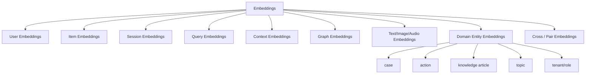
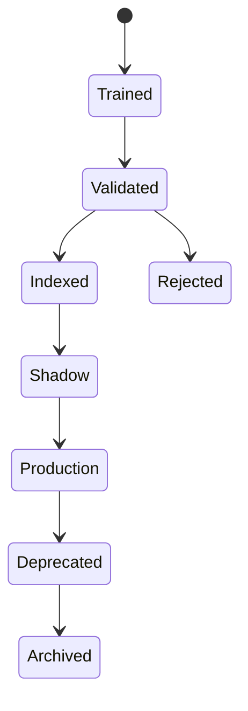

------
title: Build From Scratch Recommendations System - Part 027
description: Mendesain embedding dan representation learning untuk recommendation system production-grade: user, item, session, query, context, graph, multimodal, domain entities, objective alignment, versioning, monitoring, dan failure modes.
series: learn-build-from-scratch-recommendations-system
seriesTitle: Build From Scratch: Enterprise Recommendations System
order: 27
partTitle: Embedding Design & Representation Learning
tags:
  - recommendation-system
  - recsys
  - embeddings
  - representation-learning
  - retrieval
  - machine-learning
  - series
date: 2026-07-02
---

# Part 027 — Embedding Design & Representation Learning

Embedding adalah salah satu bahasa utama recommendation system modern.

Embedding mengubah entity — user, item, query, session, category, creator, document, case, action, topic — menjadi vector numerik sehingga sistem bisa menghitung similarity, retrieval, clustering, ranking feature, dan generalization.

Namun embedding bukan “magic vector”.

Embedding yang buruk bisa membuat:

- item populer muncul di semua query,
- user profile terlalu narrow,
- cold-start gagal,
- semantic similarity tidak sesuai business objective,
- ANN index tidak stabil,
- cross-model score tidak comparable,
- embedding stale,
- vector space collapse,
- privacy leakage,
- recommendation sulit dijelaskan.

Part ini membahas embedding design dan representation learning untuk recommendation system production-grade: jenis embedding, objective, input features, training data, alignment, versioning, monitoring, dan operational trade-offs.

---

## 1. Mental Model: Embedding = Compressed Meaning for a Task

Embedding bukan representasi “makna universal”.

Embedding adalah representasi yang dipelajari untuk suatu objective.

```text
embedding(entity) = vector representation useful for task T under data D and model M
```

Task bisa berbeda:

- retrieve item yang akan diklik,
- retrieve item yang akan dibeli,
- retrieve video yang akan ditonton sampai selesai,
- retrieve document yang relevan dengan query,
- retrieve action yang membantu case,
- cluster item by topic,
- detect duplicate,
- rank candidates.

Embedding yang baik untuk semantic similarity belum tentu baik untuk purchase conversion.

Contoh:

```text
Two cameras semantically similar
```

belum tentu:

```text
both likely purchased by same user
```

Embedding design harus selalu dimulai dari task.

---

## 2. Embedding Space

Embedding space adalah ruang vector tempat entity ditempatkan.

Jika dua item dekat, artinya model menganggap mereka mirip menurut objective.

```text
cosine(item_A, item_B) high
```

bisa berarti:

- text-nya mirip,
- users similar interacted,
- same category,
- same query intent,
- same workflow usage,
- same purchase complement,
- same creator/topic.

Meaning depends on training objective.

Jangan mencampur embedding dari objective berbeda tanpa memahami semantics.

---

## 3. Types of Embeddings

Recommendation system bisa punya banyak embedding.



Each embedding needs:

- purpose,
- input,
- model,
- dimension,
- training data,
- freshness,
- compatibility,
- owner,
- version.

---

## 4. User Embeddings

User embedding merepresentasikan preference/behavior user.

Sources:

- long-term interaction history,
- recent purchases,
- click/watch history,
- explicit preferences,
- follows/likes,
- negative feedback,
- segment/profile attributes,
- tenant/role in enterprise.

User embedding can represent:

- long-term preference,
- short-term intent,
- price sensitivity,
- category interest,
- topic interest,
- creator affinity,
- workflow behavior.

But user embedding is risky:

- can become stale,
- can encode sensitive behavior,
- can be wrong for shared accounts,
- can leak cross-tenant behavior,
- can overfit to historical bias.

Production often separates:

```text
long_term_user_embedding
session_embedding
contextual_query_embedding
```

Do not force one user vector to represent everything.

---

## 5. Item Embeddings

Item embedding merepresentasikan item.

Sources:

- item ID interaction embedding,
- category/taxonomy,
- title/description,
- image/video/audio,
- creator/seller,
- quality score,
- behavioral co-interaction,
- graph neighborhood,
- domain attributes.

Types:

### Collaborative Item Embedding

Learned from user-item interactions.

Good for behavior.

Weak for cold-start.

### Content Item Embedding

Learned from text/image/metadata.

Good for cold-start and semantic similarity.

May miss collaborative complement.

### Hybrid Item Embedding

Combines ID, content, metadata, and behavior.

Usually best in production.

---

## 6. Session Embeddings

Session embedding captures current intent.

Inputs:

- recent items viewed/clicked,
- query terms,
- cart contents,
- current seed item,
- sequence of actions,
- current case state,
- current workflow context.

Example:

```text
session = [view camera, view lens, search "mirrorless travel"]
```

Session embedding should represent:

```text
current shopping/research intent
```

not user’s entire identity.

Session embeddings are high freshness, short TTL.

```yaml
session_embedding:
  ttl: 2h
  freshness_sla: seconds/minutes
```

For many surfaces, session embedding improves relevance more than long-term profile.

---

## 7. Query Embeddings

Query embedding represents explicit user intent.

Use cases:

- search recommendation,
- zero-result recovery,
- query-to-item retrieval,
- document recommendation,
- case text to knowledge article,
- natural language request to action.

Inputs:

- raw query,
- normalized query,
- filters,
- language,
- domain-specific parsed intent.

Query embeddings often use text encoders.

Need:

- query normalization version,
- language handling,
- sensitive query handling,
- fallback for empty/ambiguous queries,
- separation between lexical and semantic match.

For search-like use cases, query embedding should not ignore exact constraints. Semantic retrieval must be combined with filters.

---

## 8. Context Embeddings

Context embeddings represent request situation.

Examples:

- surface,
- device,
- local time,
- region,
- role,
- tenant,
- case state,
- workflow stage,
- campaign context.

Often context is not embedded alone. It is input to query tower.

But categorical context can have embeddings:

```text
surface_embedding
region_embedding
device_embedding
case_state_embedding
role_embedding
```

Context embeddings are useful when interactions differ by surface/role/time.

Example:

```text
same item has different relevance on homepage vs checkout
```

---

## 9. Graph Embeddings

Graph embeddings represent nodes based on graph structure.

Nodes:

- user,
- item,
- category,
- topic,
- creator,
- case,
- action,
- document.

Graph embeddings are useful when relationships matter:

```text
user-item-topic-creator
case-risk-policy-article
product-compatibility-accessory
```

Graph embedding can support:

- candidate generation,
- similarity,
- clustering,
- rank features.

Risks:

- high-degree node dominance,
- temporal leakage,
- tenant leakage,
- edge semantics mixed,
- difficult explanation.

Use graph version and metapath policy.

---

## 10. Multimodal Embeddings

Multimodal embeddings combine:

- text,
- image,
- audio,
- video,
- structured metadata.

Use cases:

- fashion/furniture visual similarity,
- video recommendation,
- product discovery,
- document + image,
- thumbnail/content mismatch detection.

Fusion strategies:

### Early Fusion

Concatenate features before model.

### Late Fusion

Compute separate embeddings and combine scores.

### Learned Projection

Project text/image/audio into shared space.

Example:

```text
item_embedding =
  MLP(concat(text_embedding, image_embedding, category_embedding, quality_features))
```

Monitor modality missingness.

---

## 11. Domain Entity Embeddings

Enterprise systems need embeddings for non-consumer entities:

- case,
- action,
- investigation topic,
- policy rule,
- evidence type,
- role,
- workflow state,
- organization,
- document,
- incident.

Example:

```text
case_embedding = representation of case risk indicators + text summary + state + jurisdiction
action_embedding = representation of action applicability + outcome history
```

These embeddings can support:

```text
case -> action retrieval
case -> knowledge article retrieval
case -> similar case retrieval
```

But high-stakes domains require constraints and explanation. Embedding retrieval is candidate generation, not final authority.

---

## 12. Embedding Objective

Objective determines meaning.

Examples:

### Click Retrieval Objective

Positive:

```text
query context -> clicked item
```

Embedding learns clickable relevance.

Risk:

- clickbait.

### Purchase Objective

Positive:

```text
query context -> purchased item
```

Embedding learns conversion.

Risk:

- sparse, delayed.

### Watch Completion Objective

Positive:

```text
session -> completed video
```

Learns content satisfaction better than click.

### Co-Occurrence Objective

Positive:

```text
item A -> item B co-used/co-bought
```

Learns item relation.

### Semantic Objective

Positive:

```text
text pairs with similar meaning
```

Learns semantic similarity, not necessarily business outcome.

### Workflow Outcome Objective

Positive:

```text
case context -> action/article that improved outcome
```

Learns task utility.

Be explicit. Do not call everything “embedding”.

---

## 13. Same Entity, Multiple Embeddings

One item can have multiple embeddings.

```text
item_text_embedding
item_image_embedding
item_collaborative_embedding
item_purchase_embedding
item_click_embedding
item_graph_embedding
item_policy_topic_embedding
```

This is normal.

Do not force one universal item embedding too early.

Use multiple embeddings for different sources/features:

- content-based retrieval,
- two-tower retrieval,
- duplicate detection,
- item-to-item similarity,
- graph candidates,
- ranking features.

Compatibility is only within embedding family/version.

---

## 14. Embedding Compatibility

Embedding A and B are compatible if:

- same model family,
- same dimension,
- same normalization,
- same objective space,
- same preprocessing,
- same version or explicitly compatible versions.

Bad:

```text
cosine(user_two_tower_v3, item_text_encoder_v1)
```

unless trained/projected into same space.

Store metadata:

```json
{
  "embedding_name": "item_two_tower_embedding",
  "version": "20260702",
  "dimension": 128,
  "score_type": "inner_product",
  "compatible_query_embeddings": [
    "query_two_tower_embedding_20260702"
  ]
}
```

---

## 15. Embedding Dimension

Dimension controls capacity and cost.

Common starting points:

```text
64
128
256
```

Higher dimension:

- more expressive,
- more storage,
- more ANN memory,
- slower search,
- higher overfit risk.

Lower dimension:

- cheaper,
- maybe insufficient.

Choose by:

- retrieval recall,
- ANN latency,
- memory cost,
- vector norm stability,
- online impact.

Do not choose 768 because a text encoder has 768 dimensions if you can project to 128 for retrieval.

---

## 16. Normalization

Vectors can be:

- unnormalized, dot product,
- L2-normalized, cosine,
- normalized with learned temperature,
- quantized.

If using inner product, vector norm matters.

High norm item can score high for many queries.

Monitor:

```text
item_vector_norm_p50/p95/p99
query_vector_norm_p50/p95/p99
top_items_by_norm
```

If using cosine, normalize vectors.

But norm can encode useful popularity/confidence. Decide intentionally.

---

## 17. Embedding Training Data

Embedding quality depends on data.

Training data should specify:

```text
positive definition
negative sampling
time range
filters
surface
label window
feature snapshots
sampling policy
privacy/consent
tenant boundary
```

Embedding without dataset lineage is untrustworthy.

Metadata:

```json
{
  "training_dataset": "two_tower_home_v5",
  "dataset_version": "20260702_001",
  "training_start": "2026-05-01",
  "training_end": "2026-07-01",
  "positive_events": ["click", "purchase"],
  "negative_policy": "inbatch+hard-v3"
}
```

---

## 18. Positive Signal Selection

Embedding trained on clicks differs from purchases.

### Click Embedding

Good for engagement.

Risk: clickbait.

### Purchase Embedding

Good for conversion.

Risk: sparse, less exploratory.

### Completion/Satisfaction Embedding

Better for long-term satisfaction.

Risk: delayed/sparse.

### Mixed Objective

Can improve coverage but blur semantics.

If mixed, use event weights and monitor.

```yaml
positive_mix:
  click: 1
  add_to_cart: 3
  purchase: 5
  hide: excluded_or_negative
```

---

## 19. Negative Sampling and Embeddings

Negative sampling shapes vector space.

If negatives are easy random items, embedding learns coarse categories.

If negatives are hard same-category items, embedding learns fine distinctions.

If negatives are exposed no-click, embedding learns historical policy context.

Use negative mix based on purpose.

For retrieval:

```text
in-batch + popularity + same-category + hard exposed
```

For semantic similarity:

```text
hard semantic negatives
```

For enterprise action:

```text
valid but non-chosen actions as hard negatives, invalid actions excluded
```

---

## 20. Recency and Temporal Drift

Embedding becomes stale.

Reasons:

- user interests change,
- item catalog changes,
- new trends,
- policy changes,
- embedding objective changes,
- item quality changes.

Strategies:

- retrain periodically,
- recency weighting,
- session embeddings,
- online user vector update,
- freshness features in ranker,
- index refresh cadence.

Do not expect one batch embedding to stay good indefinitely.

---

## 21. Cold-Start Embeddings

### New Item

If item embedding uses only item_id learned from interactions, new item has no vector.

Solutions:

- content-based item tower,
- category/creator prior,
- text/image embedding,
- average vector by category,
- exploration until enough interactions,
- hybrid model.

### New User

If user embedding uses only user_id, new user has no vector.

Solutions:

- session embedding,
- onboarding interests,
- context embedding,
- anonymous/device history if allowed,
- segment average,
- popularity baseline.

Cold-start support must be designed explicitly.

---

## 22. Embedding Stores

You need stores for embeddings.

Types:

### Offline Embedding Store

Historical/analysis/training.

```text
item_id, embedding, version, timestamp
```

### Online Embedding Store

Low-latency lookup for user/session/item vectors.

### Vector Index

ANN search over item/document/action embeddings.

### Feature Store

Embeddings as feature values for ranker.

Keep metadata with vectors:

```json
{
  "entity_type": "item",
  "entity_id": "item_123",
  "embedding_name": "item_two_tower",
  "version": "20260702",
  "vector": [0.01, -0.04, "..."],
  "created_at": "2026-07-02T02:00:00Z",
  "source_model": "two-tower-v5"
}
```

---

## 23. Embedding Versioning

Version every embedding.

Breaking changes:

- dimension changes,
- model architecture changes,
- objective changes,
- training data changes,
- preprocessing changes,
- normalization changes,
- text encoder changes,
- taxonomy changes.

Do not overwrite vectors in place without version.

Index should refer to embedding version.

```text
item-index-20260702 built from item_two_tower_embedding:20260702
```

---

## 24. Embedding Lifecycle



Validation includes:

- vector shape,
- norm distribution,
- coverage,
- offline recall,
- ANN recall,
- segment metrics,
- safety filter rate.

Do not publish index just because training completed.

---

## 25. Embedding Quality Checks

Check:

```text
no NaN/Inf
dimension correct
norm distribution stable
coverage by item/user type
missing embedding rate
nearest neighbor sanity
cluster distribution
top retrieved items diversity
offline recall
cold item recall
segment performance
```

Nearest neighbor sanity examples:

- similar products should be related,
- documents in same topic should cluster,
- unrelated categories should not all mix,
- banned/deleted items not in production index.

Human review of nearest neighbors is useful.

---

## 26. Embedding Monitoring Online

Monitor:

```text
query_vector_norm
item_vector_norm
ANN topK score distribution
top returned item concentration
embedding_missing_rate
index_filter_rate
source contribution
segment recall proxy
latency
fallback usage
```

If query vector norm suddenly drops, feature/model issue.

If same item returned for many queries, norm/popularity collapse.

If filter rate spikes, index/catalog mismatch.

---

## 27. Vector Norm Problems

### Norm Explosion

Some items have huge norm and appear everywhere.

Causes:

- popularity bias,
- training instability,
- no normalization,
- learning rate issue.

Mitigation:

- vector normalization,
- norm regularization,
- clipping,
- popularity correction,
- monitor top norm items.

### Norm Collapse

Vectors near zero.

Causes:

- undertraining,
- bad loss,
- missing features,
- regularization too high.

Monitor norm distribution.

---

## 28. Embedding Drift

Embedding drift can happen between versions.

Compare:

```text
nearest neighbor overlap between v1 and v2
score distribution shift
cluster movement
top candidate overlap
segment recall change
```

A new embedding version can be better offline but radically changes candidate distribution. Ranker may need retraining.

Shadow test before production.

---

## 29. Embedding Explainability

Embeddings are opaque, but you can provide explanation via:

- nearest seed item,
- shared category/topic,
- graph path,
- source reason codes,
- metadata overlap,
- query terms.

Internal debug:

```text
query embedding built from recent items A/B/C
candidate item similarity score 0.83
nearest history item A similarity 0.77
```

User-facing:

```text
Because it matches your recent interest in mirrorless cameras.
```

Do not expose raw vector math.

---

## 30. Privacy and Embeddings

Embeddings can encode sensitive behavior.

Risks:

- inferred sensitive interests,
- membership inference,
- cross-tenant leakage,
- reconstructing private signals,
- embedding reuse beyond consent purpose.

Controls:

- purpose limitation,
- consent enforcement,
- tenant isolation,
- retention policy,
- delete/recompute on data deletion,
- access control to embedding store,
- aggregation where possible,
- avoid sensitive attributes unless approved.

User embeddings deserve same privacy treatment as behavioral profiles.

---

## 31. Tenant and Boundary Safety

For enterprise:

- do not train shared embeddings across tenants unless allowed,
- do not index documents across tenant without filtering,
- do not allow ANN to retrieve unauthorized documents,
- partition index if needed,
- include tenant/permission filters.

Embedding similarity can reveal hidden document existence if not controlled.

For restricted corpora, authorization-aware retrieval is mandatory.

---

## 32. Embedding as Rank Features

Embedding similarity can be feature for ranker.

Examples:

```text
user_item_two_tower_dot
user_item_content_cosine
query_item_semantic_similarity
session_item_similarity
case_article_embedding_similarity
```

Ranker can combine embeddings with:

- item quality,
- business metrics,
- context,
- policy,
- diversity.

Embedding retrieval score alone should not be final ranking score.

---

## 33. Multiple Embeddings in Ranking

Ranker can use multiple similarity signals:

```text
two_tower_score
content_text_similarity
image_similarity
graph_similarity
cooccurrence_score
query_semantic_score
```

Need feature contracts.

Do not feed high-dimensional raw embeddings to tree ranker naively unless planned. Often use scalar similarities or low-dimensional projections.

Deep rankers can consume embeddings directly.

---

## 34. Embedding Backfill

When new embedding version launches:

1. compute embeddings for all eligible items,
2. validate coverage,
3. build index,
4. shadow test,
5. deploy matching query tower,
6. monitor,
7. keep old version for rollback,
8. deprecate old after safe period.

Backfill can be expensive.

Plan compute capacity and incremental updates.

---

## 35. Embedding Freshness

Freshness requirements:

| Embedding | Freshness |
|---|---|
| item content embedding | hours/day after content update |
| item collaborative embedding | daily/hourly depending interactions |
| user long-term embedding | hours/day |
| session embedding | seconds/minutes |
| query embedding | request-time |
| graph embedding | daily/weekly |
| case embedding | on case update |

Not all embeddings need real-time.

Define SLA and staleness behavior.

---

## 36. Multilingual Embeddings

If system spans languages:

Options:

- multilingual encoder,
- language-specific encoders,
- translate then encode,
- language as feature/filter.

Risks:

- one language dominates,
- semantic mismatch,
- mixed-language retrieval,
- poor low-resource language quality.

Monitor by locale/language.

For Indonesian content, ensure encoder quality for Bahasa Indonesia if text retrieval matters.

---

## 37. Embedding Evaluation

Offline:

- retrieval Recall@K,
- nearest neighbor relevance,
- cluster purity,
- cold-start performance,
- coverage,
- diversity,
- segment metrics,
- ANN recall,
- embedding drift.

Online:

- source contribution,
- CTR/CVR/watch,
- hide/report,
- diversity,
- latency,
- fallback,
- business objective.

Human evaluation:

- nearest neighbor inspection,
- query-item relevance,
- enterprise domain expert review,
- safety review.

Embedding evaluation should match purpose.

---

## 38. Embedding Debugging Playbook

If recommendations bad:

```text
1. Is query embedding generated?
2. Are required features missing?
3. Is item index compatible?
4. Are vectors normalized as expected?
5. Are nearest neighbors reasonable?
6. Are invalid items filtered?
7. Is source returning enough candidates?
8. Is ranker dropping all embedding candidates?
9. Did embedding version change?
10. Is behavior segment-specific?
```

Debugging embeddings requires both ML and serving observability.

---

## 39. Common Anti-Patterns

### 39.1 One Universal Embedding for Everything

Different objectives need different spaces.

### 39.2 No Version Compatibility

Query and item embeddings mismatch.

### 39.3 Embedding Without Dataset Lineage

Cannot trust or reproduce.

### 39.4 No Norm Monitoring

Popularity/norm collapse undetected.

### 39.5 Content Encoder Used as Purchase Embedding

Semantic similarity is not conversion preference.

### 39.6 No Cold-Start Design

New items/users missing vectors.

### 39.7 Raw Embedding as Explanation

Not meaningful to users.

### 39.8 Cross-Tenant Vector Index

Enterprise leakage risk.

### 39.9 Stale Index

Deleted/banned items retrieved.

### 39.10 Ranker Not Updated After Embedding Change

Candidate distribution shifts silently.

---

## 40. Minimal Production Embedding Plan

Start with embedding families:

### Item Content Embedding

```yaml
purpose: cold-start and content similarity
inputs: title, description, category, image if available
dimension: 128 or 256 projection
refresh: on item update / daily
```

### Item Collaborative Embedding

```yaml
purpose: behavior-based retrieval
inputs: interactions
model: MF or two-tower item tower
refresh: daily
```

### User Long-Term Embedding

```yaml
purpose: personalized retrieval
inputs: weighted historical interactions
refresh: daily/hourly
privacy: requires personalization consent
```

### Session Embedding

```yaml
purpose: current intent
inputs: recent session events
refresh: request-time or nearline
ttl: short
```

### Case/Document Embedding for Enterprise

```yaml
purpose: case-to-knowledge/action candidate generation
inputs: case summary, state, risk indicators, jurisdiction
constraints: tenant/permission/policy filters
```

Each has contract, version, owner, monitoring.

---

## 41. Embedding Contract Template

```yaml
embedding_name: item_two_tower_embedding
version: 20260702
entity:
  type: item
  key: item_id
purpose:
  - personalized_candidate_retrieval
model:
  name: two_tower_retrieval
  version: two-tower-20260702
dimension: 128
score_type: inner_product
normalization: none
compatible_with:
  - query_two_tower_embedding:20260702
training_data:
  dataset: retrieval_pairs_home_v5
  version: 20260702_001
  time_range: 2026-05-01_to_2026-07-01
features:
  - item_id
  - category_id
  - creator_id
  - text_embedding
  - quality_score
freshness:
  refresh: daily
  max_age: 48h
privacy:
  class: non_pii_item_representation
serving:
  index: item-ann-index-20260702
owner:
  team: recsys-retrieval
quality_checks:
  - no_nan
  - dimension_128
  - norm_distribution
  - coverage_gt_99_percent
```

---

## 42. Checklist Embedding Readiness

```text
[ ] Embedding purpose is explicit.
[ ] Entity type/key is explicit.
[ ] Model/objective is documented.
[ ] Training dataset version is recorded.
[ ] Positive/negative sampling policy is recorded.
[ ] Dimension and score type are fixed.
[ ] Normalization policy is explicit.
[ ] Compatibility with other embeddings is defined.
[ ] Feature inputs are versioned.
[ ] Refresh/freshness SLA is defined.
[ ] Coverage is monitored.
[ ] Norm distribution is monitored.
[ ] ANN/index version is linked if used.
[ ] Privacy/consent/tenant constraints are defined.
[ ] Cold-start fallback exists.
[ ] Shadow evaluation is done before launch.
[ ] Old version kept for rollback.
[ ] Ranker impact is evaluated after embedding change.
```

---

## 43. Kesimpulan

Embedding adalah representasi ringkas yang sangat kuat, tetapi hanya bermakna dalam konteks objective, data, dan model yang membentuknya.

Prinsip utama:

1. Embedding is task-specific, not universal truth.
2. User, item, session, query, graph, multimodal, and domain embeddings serve different roles.
3. Multiple embeddings for same entity are normal.
4. Compatibility and versioning are mandatory.
5. Training data lineage defines embedding meaning.
6. Negative sampling shapes the vector space.
7. Vector norms, coverage, and drift must be monitored.
8. Cold-start requires content/context-based design.
9. Embeddings can encode sensitive behavior and need governance.
10. Embedding retrieval score is candidate signal, not final decision.

Di Part 028, kita akan membahas **Approximate Nearest Neighbor Indexing**: bagaimana membangun vector index production-grade agar embedding retrieval bisa berjalan cepat, scalable, fresh, dan reliable.
