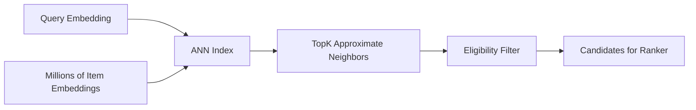
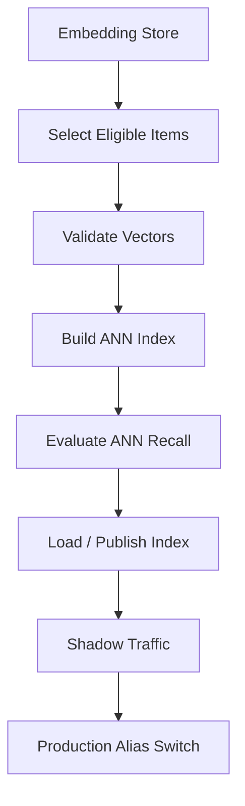
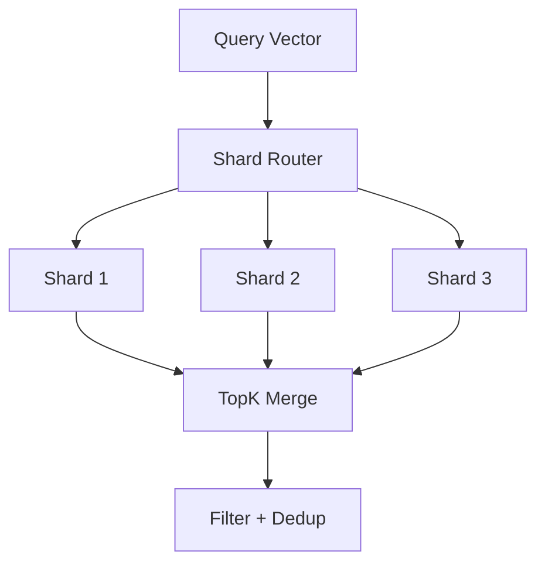

------
title: Build From Scratch Recommendations System - Part 028
description: Mendesain Approximate Nearest Neighbor indexing production-grade untuk recommendation retrieval: vector search, recall-latency trade-off, HNSW, IVF, quantization, filtering, index build, freshness, sharding, monitoring, dan rollback.
series: learn-build-from-scratch-recommendations-system
seriesTitle: Build From Scratch: Enterprise Recommendations System
order: 28
partTitle: Approximate Nearest Neighbor Indexing
tags:
  - recommendation-system
  - recsys
  - ann
  - vector-search
  - indexing
  - retrieval
  - series
date: 2026-07-02
---

# Part 028 — Approximate Nearest Neighbor Indexing

Embedding retrieval hanya berguna jika kita bisa mencari item terdekat dengan cepat.

Jika katalog punya 10 juta item dan setiap request harus menghitung dot product terhadap semua item, latency dan cost bisa meledak.

Approximate Nearest Neighbor atau ANN indexing menjawab kebutuhan ini:

> Cari vector yang paling dekat dengan query vector secara sangat cepat, dengan sedikit kompromi terhadap exactness.

ANN adalah fondasi production retrieval untuk two-tower, semantic search, content-based retrieval, graph embeddings, document recommendation, dan large-scale candidate generation.

Part ini membahas ANN indexing production-grade: vector search basics, exact vs approximate, recall-latency trade-off, HNSW, IVF, quantization, filtering, index build, refresh, sharding, multi-tenancy, monitoring, rollback, dan failure modes.

---

## 1. Mental Model: Search in Vector Space

Kita punya:

```text
query vector q
item vectors v1, v2, ..., vn
```

Goal:

```text
find topK items maximizing similarity(q, vi)
```

Similarity can be:

- inner product,
- cosine similarity,
- negative Euclidean distance.

Exact search:

```text
score all n vectors
sort topK
```

ANN search:

```text
search intelligently through index
return approximate topK much faster
```

Diagram:



---

## 2. Exact Search vs ANN

### Exact Search

Pros:

- exact topK,
- simple,
- good for small catalog.

Cons:

- expensive for large catalog,
- high latency,
- heavy compute.

### ANN Search

Pros:

- fast,
- scalable,
- practical for large item set.

Cons:

- approximate,
- tuning required,
- index build complexity,
- recall trade-off,
- filtering complexity,
- freshness/index update issues.

Production uses ANN when brute force is too expensive.

---

## 3. ANN Recall

ANN may miss true nearest neighbors.

Define ANN recall:

```text
ANN recall@K =
  overlap(ANN topK, exact topK) / K
```

Example:

```text
exact top100
ANN top100
overlap = 92
ANN recall@100 = 0.92
```

High ANN recall is important, but not always must be 1.0.

Candidate generation can tolerate some approximate error if ranker/source portfolio has redundancy.

Tune recall vs latency.

---

## 4. Model Recall vs Index Recall

Two separate things:

### Model Recall

Does embedding model place relevant items near query?

### Index Recall

Does ANN retrieve the nearest items according to embedding model?

If relevant item is not close in vector space, index cannot help.  
If relevant item is close but ANN misses it, index tuning/build is problem.

Evaluate separately:

```text
exact brute force recall on sample
ANN recall against exact
online source contribution
```

---

## 5. Similarity Metrics

ANN index must match score type.

### Inner Product

Used by many two-tower models.

```text
score = q · v
```

### Cosine

Equivalent to inner product if vectors are L2-normalized.

```text
cosine = dot(normalize(q), normalize(v))
```

### Euclidean

Distance-based.

Choose based on model training.

If model trained with dot product and index searches cosine, behavior changes.

Index metadata must record metric.

---

## 6. Vector Normalization

If using cosine, normalize item and query vectors.

If using inner product, decide whether norm carries information.

Potential issue:

- high-norm popular items appear everywhere,
- low-norm niche items underexposed.

Monitor vector norms.

Sometimes use normalized embeddings for retrieval and pass popularity as separate feature to ranker. This can reduce popularity domination.

---

## 7. ANN Algorithm Families

Common conceptual families:

### Graph-Based ANN

Example: HNSW-style graph.

Vectors are nodes connected to nearby vectors. Search walks graph.

Pros:

- high recall/latency performance,
- good for dynamic-ish updates,
- widely used.

Cons:

- memory heavy,
- tuning required.

### Inverted File / Clustering-Based

Partition vectors into clusters. Search nearest clusters.

Pros:

- scalable,
- memory configurable,
- works with compression.

Cons:

- recall depends on cluster/probe tuning,
- rebuild complexity.

### Quantization-Based

Compress vectors to reduce memory and speed search.

Pros:

- memory efficient.

Cons:

- lower recall/precision,
- more complexity.

Production systems often combine approaches.

---

## 8. HNSW Mental Model

HNSW-like indexes create multi-layer neighbor graph.

Search:

1. Start from entry point.
2. Greedily move closer to query in upper layers.
3. Search more thoroughly in bottom layer.
4. Return nearest candidates.

Tuning concepts:

```text
M = number of graph neighbors per node
efConstruction = build-time search breadth
efSearch = query-time search breadth
```

Trade-offs:

- larger M = higher recall, more memory,
- larger efConstruction = better index, slower build,
- larger efSearch = higher recall, higher latency.

Good for low-latency high-recall retrieval if memory is acceptable.

---

## 9. IVF Mental Model

IVF partitions vector space into clusters.

Build:

1. Train centroids.
2. Assign each item vector to nearest centroid.
3. Store vectors in inverted lists.

Search:

1. Find nearest centroids to query.
2. Search vectors inside selected lists.
3. Return topK.

Tuning:

```text
nlist = number of clusters
nprobe = number of clusters searched per query
```

Trade-offs:

- larger nlist = finer partitions,
- larger nprobe = higher recall, higher latency.

IVF works well at large scale and can combine with quantization.

---

## 10. Product Quantization

Product quantization compresses vectors.

Idea:

- split vector into subvectors,
- quantize each subvector,
- store compact codes.

Benefits:

- lower memory,
- faster distance approximation.

Costs:

- approximation error,
- lower recall,
- more tuning,
- harder debugging.

Use quantization when memory/cost requires it. Validate ANN recall and product metrics.

---

## 11. Choosing Index Strategy

Factors:

```text
catalog size
embedding dimension
latency target
recall target
memory budget
update frequency
filtering requirements
tenant isolation
hardware
operational complexity
```

Simple starting point:

- small/medium catalog: exact or HNSW.
- large static catalog: IVF/HNSW depending infra.
- memory-constrained: quantization.
- high update rate: choose index supporting incremental update or build partitions.
- strict metadata filtering: partitioned indexes or filter-aware engine.

Do not choose algorithm by hype. Choose by constraints.

---

## 12. Index Build Pipeline



Steps:

1. read item embeddings,
2. filter eligible indexable items,
3. validate dimension/norm,
4. build index,
5. evaluate recall/latency,
6. publish with version,
7. shadow test,
8. atomically switch alias.

Index build is deployment artifact.

---

## 13. Index Versioning

Index version must include:

```text
embedding_name
embedding_version
model_version
metric
dimension
build_time
item_count
catalog_snapshot
index_algorithm
index_params
```

Example:

```json
{
  "index_name": "home-two-tower-item-index",
  "index_version": "20260702_001",
  "embedding_version": "item_two_tower_20260702",
  "metric": "inner_product",
  "dimension": 128,
  "algorithm": "hnsw",
  "params": {
    "M": 32,
    "efConstruction": 200
  },
  "item_count": 12450832,
  "built_at": "2026-07-02T02:00:00Z"
}
```

Serving logs should include index version.

---

## 14. Atomic Index Publish

Do not update production index destructively.

Pattern:

```text
build new index -> validate -> load as new version -> switch alias
```

Alias:

```text
current_home_item_index -> index_20260702_001
```

Rollback:

```text
current_home_item_index -> index_20260701_001
```

Atomic switching avoids partial/broken index.

---

## 15. Index Validation

Before publish:

```text
item count expected
dimension correct
no NaN/Inf
norm distribution stable
sample exact-vs-ANN recall
latency benchmark
filter functionality
top neighbor sanity
deleted/banned items excluded or filterable
memory usage acceptable
```

Validation failure should block publish.

---

## 16. ANN Recall Benchmark

Create sample query set.

For each query:

1. Compute exact topK over sample/full set if feasible.
2. Query ANN topK.
3. Compare overlap.
4. Record latency.

Metrics:

```text
ANN recall@10
ANN recall@100
ANN recall@1000
latency p50/p95/p99
```

Use query distribution similar to production:

- active users,
- cold users,
- different regions,
- different surfaces,
- enterprise roles/cases if relevant.

---

## 17. Top Neighbor Sanity

Human/automatic sanity:

```text
nearest items for camera should be camera/accessory, not random document
nearest article for AML topic should be AML-related
nearest query "java kafka" should retrieve relevant items
```

Check:

- top high-norm items,
- random queries,
- cold-start items,
- sensitive categories,
- enterprise restricted nodes.

Sanity review catches mismatched model/index quickly.

---

## 18. Filtering in ANN

Recommendation rarely retrieves from all items.

Need filters:

- item_type,
- surface,
- region,
- language,
- tenant,
- policy,
- availability,
- category,
- permission,
- age safety,
- valid time.

Filtering strategies:

### 18.1 Post-Filter

Retrieve topN, then filter.

Simple but can lose too many candidates.

### 18.2 Pre-Filter / Metadata Filter

Index supports filtering during search.

Better but engine-dependent.

### 18.3 Partitioned Indexes

Separate indexes by major filter:

```text
region
tenant
language
item_type
surface
```

### 18.4 Hybrid

Partition by coarse constraints, post-filter fine constraints.

---

## 19. Post-Filter Overfetch

If post-filtering, overfetch.

```text
desired candidates = 500
expected pass rate = 25%
ANN topK = 2000
```

Formula:

```text
topK_raw = desired / pass_rate
```

But pass rate varies by context.

Monitor:

```text
ann_returned_count
post_filter_pass_rate
valid_candidate_count
```

If pass rate too low, build better filtering/partitioning.

---

## 20. Partitioned Index

Partition index by high-level constraints.

Examples:

```text
index_product_ID
index_product_SG
index_video_id-ID
index_tenant_bank001_documents
index_public_articles_id
```

Pros:

- faster filtering,
- safer tenant isolation,
- lower invalid retrieval.

Cons:

- more indexes,
- memory overhead,
- operational complexity,
- sparse partitions,
- routing logic.

Use partitioning for hard boundaries:

- tenant,
- item type,
- region/legal,
- restricted corpus.

---

## 21. Multi-Tenant Indexing

Enterprise requires care.

Options:

### Per-Tenant Index

Strong isolation.

Pros:

- safest,
- simple authorization boundary.

Cons:

- many small indexes,
- operational overhead.

### Shared Index with Tenant Filter

Pros:

- efficient.

Cons:

- risk if filter fails,
- side-channel concerns,
- harder compliance.

### Hybrid

Large tenants get own index; small tenants share with strict filters.

Default for sensitive data: prefer isolation.

---

## 22. Authorization-Aware Retrieval

For restricted documents/actions, do not retrieve unauthorized items.

Options:

- partition by tenant/permission class,
- pre-filter with ACL metadata,
- search only authorized subset,
- final permission check,
- avoid logging unauthorized candidates.

For high-stakes enterprise:

```text
unauthorized candidate count must be zero
```

This is not just quality. It is security.

---

## 23. Freshness and Updates

Index can become stale.

Changes:

- new item,
- item deleted,
- item banned,
- stock change,
- embedding updated,
- policy change,
- document permission change.

Update strategies:

### Full Rebuild

Simple, consistent, slower.

### Incremental Add/Update/Delete

Faster, more complex.

### Delta Index

Main index + small fresh index.

Search both and merge.

### Filter at Serving

For delete/ban, final filter prevents exposure even if vector remains.

Critical removals should be reflected quickly.

---

## 24. Delta Index Pattern

For new/updated items between full rebuilds:

```text
main_index: daily full build
delta_index: nearline updates
query both -> merge results
```

Pros:

- freshness,
- avoids rebuilding huge index constantly.

Cons:

- merge complexity,
- duplicates,
- different quality,
- eventual consistency.

Useful for fast-changing catalogs.

---

## 25. Delete and Ban Handling

If item is banned/deleted:

- remove from index if supported,
- or add to exclusion filter immediately,
- ensure final eligibility filter blocks,
- update item status cache,
- monitor banned item retrieval count.

Critical safety removal should not wait for next index build.

```text
final policy filter is non-negotiable
```

But high retrieval of banned items indicates stale index and waste.

---

## 26. Index Staleness Metrics

Monitor:

```text
index_age
embedding_age
catalog_item_count_vs_index_item_count
eligible_items_missing_from_index
ineligible_items_present_in_index
banned_item_retrieval_count
post_filter_reject_rate
delta_index_size
```

Alert if:

- index too old,
- index build failed,
- eligible coverage drops,
- banned item appears in retrieved candidates,
- filter rate spikes.

---

## 27. Sharding

Large index may need sharding.

Sharding strategies:

### By Entity Partition

```text
region, tenant, item_type
```

### By Hash

Even distribution.

### By Vector Space / Cluster

Index-specific.

### By Catalog Segment

```text
category, language, marketplace
```

Routing must know which shards to query.

Querying many shards increases latency. Querying too few lowers recall.

---

## 28. Distributed Search

If multiple shards:

1. send query to selected shards,
2. each shard returns topK,
3. merge globally,
4. filter/dedup,
5. return.



Need:

- shard timeout,
- partial results,
- merge by score,
- score comparability across shards,
- shard health metrics.

---

## 29. Score Comparability Across Shards

If shards use same embedding/index metric, raw scores are generally comparable.

But issues arise if:

- different embedding versions,
- different normalization,
- different index params,
- category-specific distributions,
- quantization differs.

Ensure shard version compatibility.

If not comparable, use rank-based merge or normalize carefully.

---

## 30. Index Routing

Routing decides which index/shards to query.

Inputs:

- surface,
- item type,
- region,
- tenant,
- language,
- policy context,
- query intent,
- privacy mode.

Examples:

```text
home_feed product ID -> product_id_index
enterprise tenant bank_001 -> tenant_bank001_doc_index
video surface locale id-ID -> video_id_index
```

Routing is part of candidate source logic and must be logged.

---

## 31. Caching

Cache can reduce latency.

Options:

### Query Embedding Cache

For same session/request context.

### ANN Result Cache

For repeated query vector/context.

Hard because query vectors vary.

### Popular Context Cache

For anonymous/contextual retrieval.

### Precomputed User Candidate Cache

Run retrieval offline/nearline for active users.

Caching must include context/filter/index version.

Avoid serving personalized cached results to wrong context.

---

## 32. ANN and Ranker Integration

ANN returns candidates with retrieval score.

Ranker needs:

```text
item_id
source=two_tower
ann_rank
ann_score
index_version
embedding_model_version
```

Ranker may use retrieval score as feature.

But ranker should not assume ANN score is calibrated probability.

ANN result is candidate evidence.

---

## 33. Overlap with Other Sources

ANN two-tower source may overlap with MF/content/graph.

Track overlap.

If ANN source returns only same popular items as baseline, little marginal value.

If it uniquely retrieves good long-tail items, high value.

Measure:

```text
unique candidate contribution
marginal recall gain
final slate contribution
```

---

## 34. Latency Budget

ANN latency includes:

- feature fetch,
- query tower inference,
- routing,
- index search,
- filtering,
- merge.

Example budget:

```text
query feature fetch: 15ms
query tower inference: 5ms
ANN search: 25ms
filter/merge: 10ms
total: 55ms
```

ANN search itself may be fast, but total source latency includes dependencies.

---

## 35. Timeout and Fallback

If ANN source times out:

- return partial if available,
- fallback to other sources,
- do not fail entire recommendation unless source required,
- log timeout and dependency.

For home feed:

```text
fallback to MF/content/popularity
```

For enterprise restricted retrieval:

```text
if required policy index unavailable, fail closed or use safe rule list
```

---

## 36. Index Warmup

New index may need warmup:

- load into memory,
- cache graph structures,
- pre-warm popular queries,
- health check.

Do not switch traffic before index ready.

Health endpoint should verify:

```text
index loaded
item count
version
sample query works
latency ok
```

---

## 37. Rollback

Rollback plan:

- keep previous index loaded or quickly loadable,
- alias switch back,
- query tower compatibility,
- candidate source config rollback,
- monitor after rollback.

If query tower changed with index, rollback both together.

Version pair:

```text
query_tower_v5 + index_v5
```

not:

```text
query_tower_v6 + index_v5
```

unless explicitly compatible.

---

## 38. Exact Re-Scoring After ANN

ANN approximate search may return candidate set. You can re-score returned candidates exactly using original vectors.

Flow:

```text
ANN approximate topN -> fetch full vectors -> exact dot -> sort topK
```

This improves ordering among retrieved candidates but cannot recover missed candidates.

Useful with quantization/compression.

---

## 39. Hybrid Retrieval

ANN can be combined with lexical/metadata search.

Examples:

```text
semantic vector search + category filter
lexical query match + vector rerank
graph candidates + vector nearest neighbors
```

For search, pure semantic vector may miss exact constraints. Hybrid is often better.

For recommendation, metadata filters and business constraints are mandatory.

---

## 40. ANN for Different Embedding Families

Separate indexes:

```text
item_two_tower_index
item_content_text_index
item_image_index
document_semantic_index
case_action_index
graph_item_index
```

Do not mix incompatible vectors.

Each candidate source routes to correct index.

A single vector database can host multiple indexes, but metadata must keep them separate.

---

## 41. Security and Access Control

Vector index may reveal sensitive data.

Controls:

- authentication,
- authorization,
- tenant partition,
- audit logs,
- encryption,
- no raw sensitive text in metadata,
- restrict debug access,
- avoid returning unauthorized metadata,
- delete handling.

For enterprise document/case index, treat vector index as sensitive data store.

---

## 42. Observability Dashboard

Minimum:

```text
query_count
latency p50/p95/p99
timeout_rate
error_rate
index_version
query_tower_version
returned_count
post_filter_pass_rate
empty_rate
ANN recall benchmark
item_count
index_age
memory usage
CPU/GPU usage
top returned item concentration
embedding norm stats
```

By:

- surface,
- region,
- tenant,
- index,
- model version,
- request type.

---

## 43. Quality Drift

ANN source can degrade without error.

Symptoms:

- source contribution drops,
- ranker stops selecting ANN candidates,
- filter rate rises,
- same items returned too often,
- cold-start recall drops,
- latency increases,
- vector norm distribution shifts.

Set drift checks after new index/model deploy.

Compare old vs new:

```text
topK overlap
score distribution
candidate category distribution
filter rate
source contribution
offline recall
```

---

## 44. ANN Testing

Tests:

### Unit/Contract

- vector dimension validation,
- metric compatibility,
- filter behavior,
- routing logic,
- version metadata.

### Integration

- build small index,
- query known vectors,
- verify nearest neighbors,
- filter excludes invalid items.

### Benchmark

- recall vs exact,
- latency at load,
- memory usage.

### Failure

- index unavailable,
- shard timeout,
- partial results,
- incompatible version,
- empty partition.

ANN is infrastructure; test it like infrastructure.

---

## 45. Cost Engineering

Cost factors:

- vector dimension,
- item count,
- replicas,
- memory per vector,
- graph/index overhead,
- quantization,
- QPS,
- overfetch,
- filtering,
- rebuild frequency.

Optimization:

- reduce dimension,
- quantize,
- partition smartly,
- reduce overfetch with better pre-filtering,
- cache query embeddings,
- batch low-priority retrieval,
- retire unused indexes,
- tune recall/latency threshold.

Cost must be tied to business/source value.

---

## 46. Common Anti-Patterns

### 46.1 No ANN Recall Evaluation

You do not know if index is missing nearest neighbors.

### 46.2 Query Tower and Index Version Mismatch

Retrieval quality collapses.

### 46.3 No Final Eligibility Filter

Invalid items leak.

### 46.4 Post-Filter Without Overfetch

Candidate pool becomes empty.

### 46.5 One Shared Index for Restricted Tenants

Access risk.

### 46.6 No Atomic Publish

Partial index served.

### 46.7 No Rollback

Bad index stays live.

### 46.8 Index Metadata Missing

Debugging impossible.

### 46.9 Ignore Vector Norms

Popularity/norm issues invisible.

### 46.10 Treat ANN Score as Final Rank

Retrieval score is candidate signal, not full utility.

---

## 47. Minimal Production ANN Plan

Start with:

```yaml
index:
  name: item-two-tower-home
  metric: inner_product
  dimension: 128
  algorithm: hnsw_or_managed_ann
  versioned: true
build:
  cadence: daily
  input: item_two_tower_embedding
  validate:
    - dimension
    - no_nan
    - norm_distribution
    - item_count
    - ann_recall_sample
publish:
  atomic_alias_switch: true
  rollback_previous_version: true
serving:
  topK_raw: 2000
  desired_valid_candidates: 800
  final_filter: true
  log_index_version: true
monitoring:
  - latency
  - timeout
  - filter_rate
  - empty_rate
  - ann_recall
  - index_age
  - source_contribution
```

For enterprise restricted documents:

```yaml
partition:
  by: tenant
authorization:
  retrieval_must_be_authorization_aware: true
final_permission_check: true
```

---

## 48. Checklist ANN Readiness

```text
[ ] Index metric matches model score type.
[ ] Embedding dimension is validated.
[ ] Query and item embedding versions are compatible.
[ ] Index version metadata is complete.
[ ] Build pipeline validates vectors.
[ ] ANN recall benchmark exists.
[ ] Latency benchmark exists.
[ ] Atomic publish/alias switch exists.
[ ] Rollback exists.
[ ] Final eligibility filter exists.
[ ] Overfetch factor is tuned.
[ ] Filter pass rate is monitored.
[ ] Index staleness is monitored.
[ ] Deleted/banned item handling is immediate.
[ ] Sharding/partitioning strategy is explicit.
[ ] Tenant/permission boundaries are enforced if needed.
[ ] Source logs index version and score type.
[ ] Dashboard monitors latency, recall, filter, empty, source contribution.
[ ] New index shadow or canary test exists.
```

---

## 49. Kesimpulan

ANN indexing membuat embedding retrieval feasible pada skala production.

Prinsip utama:

1. ANN trades exactness for speed; measure ANN recall.
2. Model recall and index recall are different.
3. Metric, dimension, normalization, and version compatibility are mandatory.
4. Index is a deployable artifact, not a hidden cache.
5. Build, validate, publish, monitor, and rollback index like production software.
6. Filtering strategy determines candidate validity and latency.
7. Overfetch is needed when post-filtering.
8. Tenant/authorization boundaries may require partitioned or filter-aware indexes.
9. Index freshness and banned/deleted item handling are safety requirements.
10. ANN score is retrieval evidence, not final recommendation utility.

Di Part 029, kita akan membahas **Vector Store & Embedding Serving**: bagaimana mengoperasikan embedding/vector infrastructure sebagai service: storage, retrieval API, version routing, online feature integration, backfill, consistency, dan SLO.
