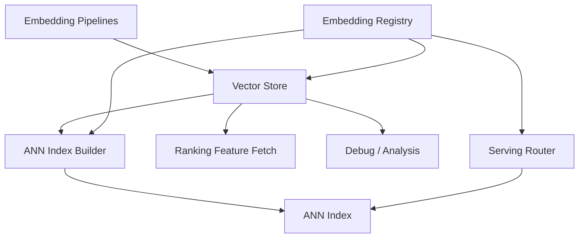
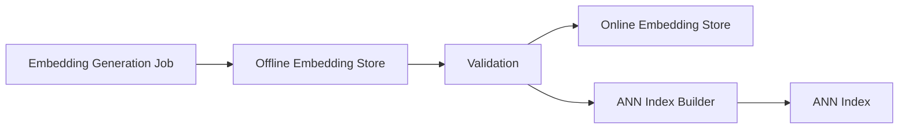
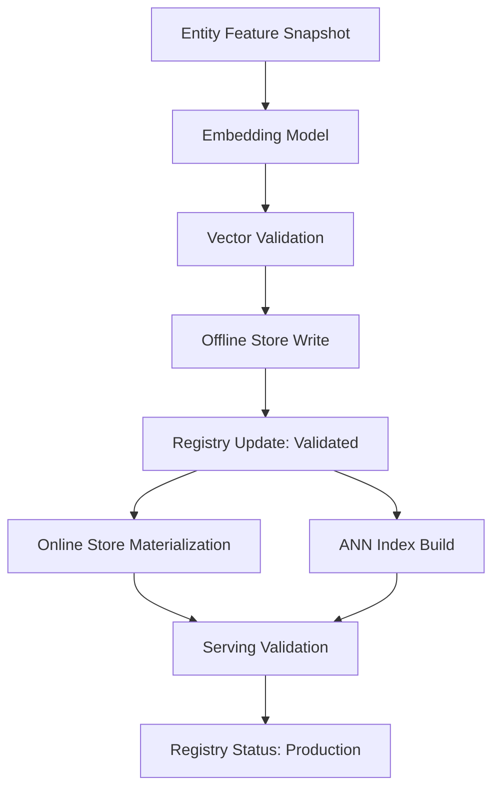

------
title: Build From Scratch Recommendations System - Part 029
description: Mendesain vector store dan embedding serving production-grade: embedding registry, vector API, version routing, online/offline stores, ANN integration, consistency, freshness, backfill, access control, observability, dan SLO.
series: learn-build-from-scratch-recommendations-system
seriesTitle: Build From Scratch: Enterprise Recommendations System
order: 29
partTitle: Vector Store & Embedding Serving
tags:
  - recommendation-system
  - recsys
  - vector-store
  - embeddings
  - serving
  - mlops
  - series
date: 2026-07-02
---

# Part 029 — Vector Store & Embedding Serving

Embedding tidak cukup hanya dilatih.

Embedding harus dioperasikan.

Recommendation system production-grade membutuhkan platform untuk:

- menyimpan embedding,
- mengambil embedding dengan latency rendah,
- membangun ANN index,
- menjaga versi embedding,
- memastikan query tower cocok dengan item index,
- melakukan backfill,
- update embedding baru,
- melayani banyak surface/model,
- membatasi akses berdasarkan privacy/tenant,
- memonitor freshness, coverage, dan quality,
- rollback saat versi buruk.

Inilah peran **vector store dan embedding serving**.

Part ini membahas desain vector/embedding platform sebagai service production-grade untuk recommendation system: data model, API, registry, storage, serving, version routing, consistency, access control, observability, dan SLO.

---

## 1. Mental Model: Embedding Is a Versioned Serving Artifact

Embedding bukan array float biasa.

Embedding adalah artifact production.

```text
entity + vector + embedding family + version + model lineage + freshness + compatibility + access policy
```

Contoh:

```json
{
  "entity_type": "item",
  "entity_id": "item_123",
  "embedding_name": "item_two_tower_embedding",
  "embedding_version": "20260702",
  "dimension": 128,
  "score_type": "inner_product",
  "vector": [0.01, -0.04, 0.13],
  "created_at": "2026-07-02T02:00:00Z",
  "model_version": "two-tower-v5",
  "dataset_version": "retrieval-dataset-20260702_001"
}
```

Vector store adalah sistem yang membuat artifact ini bisa digunakan oleh retrieval, ranking, debugging, dan training.

---

## 2. Vector Store vs ANN Index vs Feature Store

Bedakan tiga konsep.

### Vector Store

Tempat menyimpan dan mengambil embedding berdasarkan key.

```text
get embedding for item_123 version v5
```

### ANN Index

Struktur untuk mencari nearest vectors.

```text
search topK item vectors nearest to query vector
```

### Feature Store

Tempat menyimpan feature untuk model.

Embedding bisa menjadi feature, tetapi vector store punya kebutuhan khusus seperti dimension, compatibility, vector search, dan version routing.

Diagram:



Ketiganya saling terkait, tetapi tidak sama.

---

## 3. Core Requirements

Vector/embedding serving harus memenuhi:

```text
low-latency lookup
high-throughput batch read/write
versioned embeddings
compatibility checks
freshness monitoring
coverage monitoring
backfill support
online/offline consistency
access control
tenant isolation
index build integration
debuggability
rollback
```

Untuk large-scale system, embedding infrastructure adalah platform, bukan utility kecil.

---

## 4. Embedding Registry

Registry menyimpan metadata embedding.

Example:

```yaml
embedding_name: item_two_tower_embedding
version: 20260702
entity_type: item
dimension: 128
score_type: inner_product
normalization: none
model:
  name: two_tower_retrieval
  version: two-tower-v5
training:
  dataset_version: retrieval-pairs-20260702_001
  data_end_time: 2026-07-01T00:00:00Z
compatibility:
  compatible_query_embeddings:
    - query_two_tower_embedding:20260702
storage:
  offline_path: /embeddings/item_two_tower/version=20260702
  online_store: vector-online-prod
  ann_indexes:
    - item-ann-home-20260702
freshness:
  max_age: 48h
owner:
  team: recsys-retrieval
status: production
```

Registry is source of truth.

Serving should not guess which vector/index versions match.

---

## 5. Embedding Family

Embedding family groups compatible versions and purpose.

Examples:

```text
item_two_tower_embedding
query_two_tower_embedding
item_text_embedding
item_image_embedding
user_long_term_embedding
session_embedding
case_embedding
knowledge_article_embedding
action_embedding
```

Each family has:

- entity type,
- purpose,
- score type,
- compatible families,
- owner,
- retention,
- privacy class.

Do not store all vectors in one undifferentiated bucket.

---

## 6. Data Model

A generic embedding record:

```json
{
  "embedding_key": {
    "entity_type": "item",
    "entity_id": "item_123",
    "embedding_name": "item_two_tower_embedding",
    "embedding_version": "20260702"
  },
  "vector": {
    "dimension": 128,
    "values": [0.012, -0.034, "..."],
    "dtype": "float32"
  },
  "metadata": {
    "created_at": "2026-07-02T02:00:00Z",
    "valid_from": "2026-07-02T02:00:00Z",
    "valid_until": null,
    "model_version": "two-tower-v5",
    "source_feature_snapshot": "item-features-v12",
    "quality_status": "valid",
    "norm": 1.04
  },
  "access": {
    "tenant_id": null,
    "privacy_class": "non_pii_item_representation",
    "allowed_purposes": ["candidate_retrieval"]
  }
}
```

For user embeddings, access metadata is more sensitive.

---

## 7. Key Design

Embedding key should avoid ambiguity.

Good key:

```text
(entity_type, entity_id, embedding_name, embedding_version)
```

Examples:

```text
(item, item_123, item_two_tower_embedding, 20260702)
(user, u123, user_long_term_embedding, 20260702)
(session, sess_abc, session_embedding, realtime-v3)
(case, case_001, case_context_embedding, 20260702)
```

Do not key only by `item_id`.

Same item can have multiple embeddings.

---

## 8. Online vs Offline Storage

### Offline Store

Used for:

- training,
- analysis,
- backfill,
- index build,
- audit,
- model evaluation.

Optimized for batch scan.

### Online Store

Used for:

- low-latency lookup,
- query/user/session vector fetch,
- ranking feature fetch.

Optimized for point lookups.

### ANN Index

Used for nearest neighbor search.

Optimized for vector similarity search.

Data flow:



Offline is usually source of truth for batch embeddings. Online/index are serving projections.

---

## 9. Write Path

Embedding generation pipeline writes vectors.

Steps:

1. Read entity features.
2. Run embedding model.
3. Validate vectors.
4. Write to offline store.
5. Publish metadata to registry.
6. Materialize to online store/index.
7. Validate serving projection.
8. Mark version ready/production.

Diagram:



Do not mark embedding version production before serving projection is validated.

---

## 10. Read Path: Lookup

Lookup API:

```http
POST /embeddings/get
```

Request:

```json
{
  "embedding_name": "item_two_tower_embedding",
  "embedding_version": "20260702",
  "keys": [
    {"entity_type": "item", "entity_id": "item_123"},
    {"entity_type": "item", "entity_id": "item_456"}
  ],
  "purpose": "ranking_feature_fetch"
}
```

Response:

```json
{
  "embedding_name": "item_two_tower_embedding",
  "embedding_version": "20260702",
  "dimension": 128,
  "records": [
    {
      "entity_id": "item_123",
      "status": "found",
      "vector": [0.01, -0.03, "..."],
      "metadata": {
        "created_at": "2026-07-02T02:00:00Z",
        "norm": 1.02
      }
    },
    {
      "entity_id": "item_456",
      "status": "missing"
    }
  ]
}
```

Batch lookup is essential.

---

## 11. Read Path: Search

Search API wraps ANN index.

```http
POST /vectors/search
```

Request:

```json
{
  "index_name": "item-two-tower-home",
  "index_version": "20260702_001",
  "query_embedding": {
    "embedding_name": "query_two_tower_embedding",
    "embedding_version": "20260702",
    "values": [0.02, -0.01, "..."]
  },
  "top_k": 1000,
  "filters": {
    "item_type": "product",
    "region": "ID",
    "surface": "home_feed"
  },
  "purpose": "candidate_generation"
}
```

Response:

```json
{
  "index_version": "20260702_001",
  "score_type": "inner_product",
  "results": [
    {
      "entity_type": "item",
      "entity_id": "item_123",
      "score": 8.42,
      "rank": 1
    }
  ],
  "diagnostics": {
    "latency_ms": 23,
    "searched_shards": 4,
    "filtered_count_estimate": 120
  }
}
```

Search API should enforce compatibility.

---

## 12. Version Routing

Serving code should request logical version via registry/alias.

Example:

```text
home_feed_two_tower_current -> query_embedding_20260702 + index_20260702_001
```

Instead of hardcoding:

```text
index_20260702_001
```

Routing table:

```yaml
route: home_feed_two_tower
status: production
query_tower_version: qtower-20260702
query_embedding_name: query_two_tower_embedding
item_index: item-two-tower-home
item_index_version: 20260702_001
```

This enables:

- canary,
- rollback,
- shadow,
- per-surface version,
- experiment version.

---

## 13. Compatibility Checks

Before search:

```text
query_embedding.version compatible with index.embedding_version
dimension matches
score_type matches
normalization matches
tenant/privacy constraints satisfied
```

If mismatch, fail fast.

Bad:

```text
query tower v6 queries item index v5 accidentally
```

Response should be error, not silent poor results.

Compatibility check is cheap and prevents severe production bugs.

---

## 14. Embedding Serving Modes

### Batch Precompute

User/item embeddings computed offline.

Good for:

- stable long-term profiles,
- item embeddings,
- email recommendations.

### Nearline Update

Embeddings updated after events.

Good for:

- active user profile,
- recent behavior.

### Online Compute

Embedding computed on request.

Good for:

- query embedding,
- session embedding,
- case context embedding.

Each mode has different freshness and cost.

---

## 15. User Embedding Serving

User embeddings are sensitive and dynamic.

Use cases:

- retrieval query vector,
- ranking feature,
- personalization.

Design:

```text
user_id -> long_term_user_embedding version
```

Need:

- consent check,
- deletion handling,
- retention policy,
- stale fallback,
- shared account handling,
- tenant boundary.

If user embedding missing:

- use session embedding,
- use segment average,
- fallback to contextual popularity,
- skip behavioral source.

Do not use another user's vector by fallback bug.

---

## 16. Session Embedding Serving

Session embedding has short TTL.

Storage options:

- in-memory cache,
- Redis-like state store,
- computed on request,
- nearline stream processor.

Fields:

```json
{
  "session_id": "sess_123",
  "embedding_name": "session_intent_embedding",
  "version": "realtime-v3",
  "vector": [...],
  "updated_at": "2026-07-02T10:00:02Z",
  "ttl_seconds": 7200
}
```

Session embedding should expire.

Old session vector should not affect new session.

---

## 17. Item Embedding Serving

Item embeddings usually batch-generated.

Need:

- high coverage,
- daily/hourly refresh,
- index integration,
- missing embedding fallback,
- delete/ban handling,
- item version awareness.

If item content updates significantly:

- regenerate embedding,
- update offline/online store,
- update delta index or next full index.

Monitor item embedding coverage by:

- item type,
- category,
- region,
- tenant,
- lifecycle state.

---

## 18. Query/Case Embedding Serving

Query/case embedding often computed online.

Examples:

```text
search query -> query embedding
case summary -> case embedding
cart contents -> cart embedding
seed item + context -> contextual query embedding
```

Need:

- model inference SLO,
- text preprocessing consistency,
- language handling,
- privacy filtering,
- cache for repeated query/case,
- timeout fallback.

For enterprise case, text may contain sensitive data. Do not log raw text casually.

---

## 19. Backfill

When new embedding version is created, backfill historical/current entities.

Backfill plan:

```yaml
embedding: item_two_tower_embedding
version: 20260702
entity_scope:
  - active_items
  - recently_inactive_items_if_needed
batch_size: 10000
validation:
  - dimension
  - norm
  - no_nan
  - coverage
publish:
  - offline
  - online
  - index
```

Backfill must be resumable and idempotent.

If job fails halfway, version should not become production.

---

## 20. Incremental Updates

Incremental update for:

- new item,
- updated item,
- new user activity,
- case state change,
- document update.

Pattern:

```text
entity change event -> embedding update job -> vector store upsert -> delta index update
```

Use idempotency key:

```text
entity_id + embedding_name + embedding_version + source_version
```

Be careful with out-of-order updates. Newer vector should not be overwritten by older job.

---

## 21. Consistency Models

Embedding serving can be:

### Strong-ish Consistency

Important for permissions/policy? Usually handled by filters, not embedding.

### Eventual Consistency

Common for embeddings.

Example:

- new item appears in catalog,
- embedding generated within 30 minutes,
- index updated within 1 hour.

Define expectations.

```yaml
item_embedding_freshness_slo:
  95_percent_new_active_items_indexed_within: 2h
```

Do not pretend embeddings are instant if pipeline is batch.

---

## 22. Embedding Freshness SLO

Freshness metrics:

```text
embedding_age = now - created_at
materialization_lag = online_available_at - offline_created_at
index_lag = index_built_at - embedding_created_at
```

SLO examples:

```text
99% item embeddings available within 24h of item activation
95% user long-term embeddings refreshed within 6h of significant interaction
99% session embeddings updated within 5s of event
```

SLO depends on embedding type.

---

## 23. Coverage SLO

Coverage:

```text
coverage = entities_with_valid_embedding / eligible_entities
```

Examples:

```text
active item embedding coverage >= 99%
eligible document embedding coverage >= 99.9%
active user embedding coverage >= 95%
session embedding coverage for active sessions >= 98%
```

Coverage by segment matters.

```text
coverage by category, language, region, tenant, item type
```

Overall coverage can hide one broken category.

---

## 24. Access Control

Vector store access must be controlled.

Rules:

- user embeddings require privacy authorization,
- tenant embeddings isolated,
- document embeddings restricted,
- purpose-based access,
- no raw vectors to unauthorized clients,
- audit access,
- deletion support.

Example policy:

```yaml
embedding_name: user_long_term_embedding
privacy_class: behavioral_personalization
allowed_purposes:
  - recommendation_candidate_generation
  - recommendation_ranking
requires_consent: personalization
disallowed:
  - advertising_export
  - external_download
```

Do not let embeddings become unmanaged data exhaust.

---

## 25. Tenant Isolation

For enterprise:

- separate namespace per tenant,
- tenant key in embedding record,
- tenant-aware index routing,
- ACL-aware search,
- no cross-tenant nearest neighbor unless explicitly allowed.

Example key:

```text
tenant_id + entity_type + entity_id + embedding_name + version
```

Debug tools must respect tenant boundaries.

---

## 26. Deletion and Retention

If user requests deletion:

- delete user embeddings,
- delete session/device embeddings if linked and required,
- remove from online store,
- remove from offline store or mark tombstone depending policy,
- prevent future use,
- retrain/recompute aggregates if required by policy.

For item deletion/ban:

- remove or filter item embedding/index,
- tombstone entity,
- block serving.

Retention should be declared per embedding.

```yaml
retention_days: 180
deletion_behavior: hard_delete_online_and_offline
```

---

## 27. Vector Store Observability

Metrics:

```text
lookup_qps
lookup_latency_p50/p95/p99
lookup_error_rate
missing_rate
coverage
embedding_age
write_lag
materialization_lag
index_lag
dimension_mismatch_errors
compatibility_errors
access_denied_count
tenant_filter_violations
```

By:

- embedding_name,
- version,
- entity_type,
- tenant,
- surface,
- caller service.

Missing rate spike can break recommendation silently.

---

## 28. Search Observability

For vector search:

```text
search_qps
search_latency
timeout_rate
empty_result_rate
returned_count
filter_pass_rate
index_version
query_embedding_version
score_distribution
top_item_concentration
shard_error_rate
```

Also monitor:

```text
ANN recall benchmark
index_age
index_memory
index_cpu
```

Search quality is not just latency.

---

## 29. Vector Quality Monitoring

Quality metrics:

```text
norm_distribution
NaN/Inf count
duplicate_vector_rate
zero_vector_rate
nearest_neighbor_sanity
embedding_drift
coverage_by_segment
topK_overlap_between_versions
```

Alerts:

```text
zero_vector_rate > 0
norm p99 jumps 3x
coverage drops below threshold
nearest neighbor top items all same category unexpectedly
```

Embedding bugs can pass system health but fail quality.

---

## 30. Debugging Tools

Useful tools:

```text
embedding-get entity_id
embedding-compare entity_id versionA versionB
nearest-neighbors entity_id/query
index-search-debug query_vector
coverage-report embedding_name version
compatibility-check query_version index_version
vector-norm-report
```

Example:

```text
embedding-debug --entity item_123 --embedding item_two_tower --version 20260702
```

Output:

```text
found: yes
dimension: 128
norm: 1.03
created_at: 2026-07-02 02:00
model: two-tower-v5
index membership: item-index-20260702 yes
nearest neighbors: item_456, item_789
```

Production ML needs operational debugging.

---

## 31. Shadow and Canary Serving

Before switching version:

- shadow search with new index,
- compare topK overlap,
- compare filter rate,
- compare latency,
- compare source contribution,
- canary small traffic,
- monitor guardrails,
- rollback if needed.

Embedding/index changes can shift candidate distribution dramatically.

Canary should include segment metrics, not just global.

---

## 32. Version Rollback

Rollback must switch compatible bundle:

```text
query tower
embedding version
ANN index version
feature preprocessing
candidate source config
```

Bad rollback:

```text
old index + new query tower
```

Safe bundle:

```yaml
retrieval_bundle:
  version: home-two-tower-bundle-20260702
  query_tower: qtower-20260702
  item_embedding: item_two_tower-20260702
  index: item-index-20260702_001
```

Rollback bundle, not individual artifact.

---

## 33. Embedding Serving API Design

Endpoints:

```text
GET /registry/embeddings/{name}/versions/{version}
POST /embeddings/get
POST /embeddings/batch-get
POST /vectors/search
POST /vectors/search-debug
GET /indexes/{index}/status
POST /routes/resolve
```

Internal services should use typed clients rather than raw HTTP calls.

Client should enforce:

- dimension,
- version,
- timeout,
- retry,
- purpose,
- tenant context.

---

## 34. SLA and SLO

Example SLOs:

### Lookup

```text
p95 latency < 10ms for batch size <= 100
availability >= 99.9%
missing rate for active items < 1%
```

### Search

```text
p95 latency < 50ms for topK 2000
availability >= 99.9%
ANN recall@100 sample >= 0.95
```

### Freshness

```text
99% active item embeddings refreshed within 24h
95% session embeddings updated within 5s
```

SLOs should be realistic and tied to product needs.

---

## 35. Failure Modes

### 35.1 Missing Embeddings

Candidate source empty or reduced recall.

### 35.2 Version Mismatch

Search quality collapses.

### 35.3 Stale Index

Deleted/banned items retrieved.

### 35.4 Norm Collapse/Explosion

Same items dominate or retrieval weak.

### 35.5 Access Control Bug

Tenant/privacy violation.

### 35.6 Partial Backfill Published

Many entities missing vectors.

### 35.7 Online Store Lag

Ranker feature missing.

### 35.8 Index Search Healthy but Quality Bad

System metrics pass, recommendations degrade.

### 35.9 Debug Log Leaks Sensitive Vectors/Text

Governance issue.

### 35.10 No Rollback Bundle

Bad version hard to revert.

---

## 36. Implementation Sketch: Registry + Router

Conceptual Java records:

```java
public record EmbeddingVersion(
    String embeddingName,
    String version,
    String entityType,
    int dimension,
    String scoreType,
    String modelVersion,
    List<String> compatibleWith,
    EmbeddingStatus status
) {}

public record RetrievalRoute(
    String routeName,
    String routeVersion,
    String queryTowerVersion,
    String queryEmbeddingName,
    String queryEmbeddingVersion,
    String indexName,
    String indexVersion
) {}
```

Router:

```java
public final class EmbeddingRouteResolver {
    private final EmbeddingRegistry registry;

    public RetrievalRoute resolve(String routeName, RequestContext context) {
        RetrievalRoute route = registry.getActiveRoute(routeName, context.experimentAssignments());

        EmbeddingVersion query = registry.getEmbeddingVersion(
            route.queryEmbeddingName(),
            route.queryEmbeddingVersion()
        );

        IndexMetadata index = registry.getIndex(route.indexName(), route.indexVersion());

        if (!index.isCompatibleWith(query)) {
            throw new IncompatibleEmbeddingRouteException(route);
        }

        return route;
    }
}
```

Compatibility check belongs in platform, not every caller.

---

## 37. Implementation Sketch: Embedding Lookup

```java
public interface EmbeddingStore {
    BatchEmbeddingResult batchGet(BatchEmbeddingRequest request);
}

public record BatchEmbeddingRequest(
    String embeddingName,
    String embeddingVersion,
    List<EntityKey> keys,
    String purpose,
    AccessContext accessContext
) {}
```

Store behavior:

- check access,
- check version exists,
- validate dimension,
- return missing separately,
- record metrics.

Do not throw for individual missing keys in batch unless entire request invalid.

---

## 38. Implementation Sketch: Search Service

```java
public interface VectorSearchService {
    VectorSearchResult search(VectorSearchRequest request);
}

public record VectorSearchRequest(
    String indexName,
    String indexVersion,
    Embedding queryEmbedding,
    int topK,
    Map<String, String> filters,
    String purpose,
    AccessContext accessContext
) {}
```

Search service:

1. validate query dimension,
2. validate compatible version,
3. enforce access/tenant filters,
4. execute ANN search,
5. return results with scores/ranks/index metadata,
6. emit metrics.

---

## 39. Minimal Production Vector Platform Plan

Start with:

```yaml
registry:
  embedding_versions: true
  index_versions: true
  retrieval_routes: true

offline_store:
  parquet_or_table_partitioned_by_embedding_version: true

online_store:
  batch_get_by_entity_key: true
  p95_lookup_lt_10ms: true

ann_integration:
  index_build_from_offline_store: true
  index_metadata_registered: true
  atomic_alias_switch: true

serving:
  route_resolution: true
  compatibility_check: true
  final_eligibility_filter_in_rec_api: true

observability:
  coverage: true
  freshness: true
  missing_rate: true
  vector_norms: true
  search_latency: true
  ann_recall_benchmark: true

governance:
  purpose_access: true
  tenant_namespace: true
  deletion_support: true
```

This is enough to operate embeddings safely.

---

## 40. Checklist Vector Store & Embedding Serving Readiness

```text
[ ] Embedding registry exists.
[ ] Embedding versions are immutable.
[ ] Index versions are registered.
[ ] Retrieval route maps compatible query tower and index.
[ ] Compatibility checks are enforced.
[ ] Offline embedding store exists.
[ ] Online embedding lookup exists.
[ ] ANN search API exists.
[ ] Batch lookup supports missing-key semantics.
[ ] Vector validation runs before publish.
[ ] Coverage and freshness are monitored.
[ ] Norm distributions are monitored.
[ ] Atomic index publish exists.
[ ] Rollback bundle exists.
[ ] Access control and purpose checks exist.
[ ] Tenant isolation exists if applicable.
[ ] Deletion/retention behavior is defined.
[ ] Search logs include index/model version.
[ ] Debug tools exist.
[ ] Shadow/canary process exists for new versions.
[ ] SLOs exist for lookup, search, freshness, and coverage.
```

---

## 41. Kesimpulan

Embedding dan vector search adalah infrastructure, bukan hanya ML output.

Prinsip utama:

1. Embedding is a versioned serving artifact.
2. Vector store, ANN index, and feature store have different roles.
3. Embedding registry is source of truth.
4. Query tower and item index compatibility must be enforced.
5. Online/offline stores need clear consistency and freshness expectations.
6. Access control and tenant isolation are mandatory for sensitive embeddings.
7. Coverage, freshness, norm, and search quality must be monitored.
8. Index publish/rollback should be atomic and bundle-compatible.
9. Debugging tools are required for production operations.
10. Vector platform should be treated like core serving infrastructure.

Di Part 030, kita akan membahas **Cold-Start Retrieval**: bagaimana merekomendasikan untuk user baru, item baru, surface baru, tenant baru, dan domain baru tanpa menunggu collaborative data matang.
