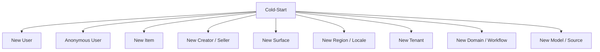
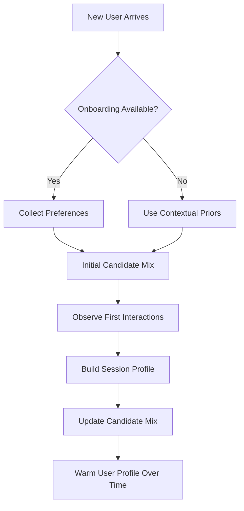
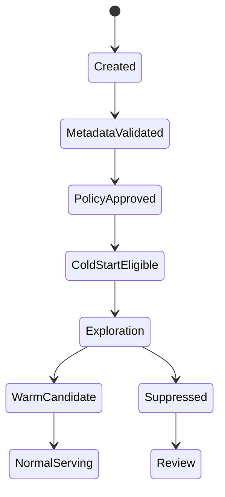

------
title: Build From Scratch Recommendations System - Part 030
description: Mendesain cold-start retrieval production-grade: new user, anonymous user, new item, new creator/seller, new tenant, new surface, content-based retrieval, priors, exploration, onboarding, fallback, evaluation, dan guardrails.
series: learn-build-from-scratch-recommendations-system
seriesTitle: Build From Scratch: Enterprise Recommendations System
order: 30
partTitle: Cold-Start Retrieval
tags:
  - recommendation-system
  - recsys
  - cold-start
  - retrieval
  - candidate-generation
  - exploration
  - series
date: 2026-07-02
---

# Part 030 — Cold-Start Retrieval

Recommendation system paling mudah gagal ketika tidak punya data.

User baru belum punya history.  
Anonymous user belum login.  
Item baru belum punya interaction.  
Creator/seller baru belum punya reputation.  
Tenant baru belum punya domain data.  
Surface baru belum punya event.  
Region baru belum punya popularity.  
Workflow baru belum punya historical outcome.  
Model baru belum tahu distribusi source baru.

Ini disebut **cold-start**.

Cold-start bukan edge case. Dalam production, cold-start terjadi terus-menerus:

- user baru datang setiap hari,
- produk baru masuk katalog,
- artikel baru dipublish,
- video baru diupload,
- job posting baru dibuka,
- policy document diperbarui,
- case type baru muncul,
- campaign baru diluncurkan,
- app surface baru dibuat.

Part ini membahas cold-start retrieval production-grade: jenis cold-start, strategi source, content-based retrieval, priors, onboarding, exploration, guardrails, metrics, dan operational design.

---

## 1. Mental Model: Cold-Start = Missing Evidence, Not Missing Product

Cold-start berarti sistem belum punya cukup evidence untuk entity tertentu.

Bukan berarti tidak bisa merekomendasikan.

Kita bisa menggunakan evidence lain:

```text
metadata
context
content
taxonomy
creator/seller prior
category prior
segment popularity
editorial curation
rules
graph edges
exploration
onboarding preferences
```

Prinsip:

> When collaborative evidence is missing, use content, context, priors, and controlled exploration.

---

## 2. Types of Cold-Start



Each type needs different strategy.

Do not solve all cold-start with global popularity.

---

## 3. New User Cold-Start

New user has little or no history.

Available signals:

- current context,
- acquisition channel,
- locale/region,
- device,
- onboarding preferences,
- first query,
- first clicked item,
- current session behavior,
- referral/campaign,
- anonymous pre-login history if allowed.

Candidate sources:

```text
segment popularity
trending by region/context
editorial safe list
onboarding topic content
session-based content retrieval
query/seed-based retrieval
exploration
```

Avoid relying on:

- long-term user embedding,
- user CF,
- MF user vector,
- user graph.

---

## 4. Anonymous User Cold-Start

Anonymous user may have session/device history.

Signals:

- anonymous_id,
- session_id,
- recent viewed items,
- query,
- region/locale,
- device,
- current surface,
- consent mode.

If policy allows, use anonymous behavioral history.

If not, use contextual/non-personal sources.

Privacy mode matters.

```yaml
anonymous_personalization:
  allowed: depends_on_consent_and_policy
  sources:
    - session_content_based
    - segment_popularity
    - trending
    - editorial
```

Do not silently merge anonymous and logged-in profiles without temporal/consent logic.

---

## 5. Early Session Personalization

Even within a few clicks, session intent emerges.

Example:

```text
view camera
view mirrorless
search "travel camera"
```

Use session-based retrieval:

- content similar to recent items,
- category/topic popularity,
- query embedding retrieval,
- item-to-item from recent seed,
- cart-based complements.

Session features:

```text
recent_item_ids
recent_category_counts
recent_query_embedding
session_depth
time_since_last_action
```

Cold user can become warm session quickly.

---

## 6. Onboarding Preferences

Ask user explicitly.

Examples:

- choose topics,
- choose categories,
- choose goals,
- choose role,
- choose skill level,
- choose preferred brands/creators,
- choose location constraints.

Onboarding should map to candidate sources.

```text
selected_topic -> topic content list
selected_category -> segment popularity/category content
selected_skill -> difficulty filter
selected_role -> enterprise permission/context
```

Avoid asking too much. Preferences can be stale or aspirational. Treat as initial prior, not permanent truth.

---

## 7. New Item Cold-Start

New item has no interactions.

Available signals:

- metadata,
- taxonomy,
- text,
- image/video/audio,
- creator/seller,
- price,
- availability,
- policy state,
- quality priors,
- editorial classification,
- graph metadata edges,
- compatibility attributes.

Candidate sources:

```text
content-based retrieval
new arrivals source
category priors
creator/seller follower source
editorial curation
fresh exploration
semantic search
graph metadata traversal
```

Collaborative sources will underrepresent new item.

---

## 8. Item Metadata Completeness

Cold-start item depends on metadata.

Minimum metadata:

```text
title/name
description
category
language/locale
item type
availability
policy approval
image/text if relevant
creator/seller
quality checks
```

If metadata incomplete:

- do not over-promote,
- send to catalog quality workflow,
- use conservative exposure,
- exclude from sensitive surfaces.

Metadata quality score:

```text
completeness
valid category
image quality
text quality
policy tags
duplicate risk
```

Cold-start retrieval should use this score.

---

## 9. Content-Based Cold-Start

For new item:

1. Generate text/image/metadata embedding.
2. Find users/sessions/topics/items that match.
3. Insert into candidate sources.
4. Apply exposure cap and quality filter.

Example:

```text
new article about Java virtual threads
-> topic Java/concurrency
-> recommend to users/sessions with Java backend interest
```

For e-commerce:

```text
new mirrorless camera
-> category camera
-> price bucket mid
-> creator/brand prior
-> recommend in camera category exploration slots
```

Content-based retrieval is the first line of defense for item cold-start.

---

## 10. Creator/Seller Prior

New item can inherit prior from creator/seller/brand.

Examples:

```text
creator has high completion rate
seller has low return rate
brand has strong affinity among segment
author trusted in topic
enterprise document owner is policy team
```

Use prior carefully.

Score:

```text
cold_item_prior =
  creator_quality
  * category_prior
  * metadata_quality
  * policy_trust
```

Avoid unfairly locking out new creators/sellers. New creator also has cold-start.

---

## 11. New Creator/Seller Cold-Start

New creator/seller has no reputation.

Signals:

- verification status,
- catalog quality,
- early item quality,
- policy review,
- external metadata if allowed,
- category/brand fit,
- editorial review,
- initial user feedback.

Strategies:

- conservative exposure caps,
- quality threshold,
- exploration budget,
- fast feedback monitoring,
- human review for sensitive categories.

Do not give unlimited exposure to unknown creators based only on self-provided metadata.

---

## 12. New Surface Cold-Start

A new recommendation surface has no historical behavior.

Examples:

- new homepage module,
- checkout upsell,
- email digest,
- case assistant panel,
- mobile widget.

Problems:

- no surface-specific CTR/CVR,
- unknown position bias,
- unknown UI effect,
- no candidate/ranker training data.

Strategies:

1. Start with safe baseline.
2. Use sources from similar surfaces.
3. Log everything.
4. Run exploration.
5. Build surface-specific dataset.
6. Gradually train/rerank.

Initial source mix:

```text
editorial/safe list
segment popularity
content-based
rules
similar surface candidate source
controlled exploration
```

Do not deploy complex model trained on unrelated surface without monitoring.

---

## 13. New Region/Locale Cold-Start

New region has sparse data.

Signals:

- global popularity,
- language/locale,
- local catalog availability,
- region taxonomy,
- similar region priors,
- editorial local curation,
- content language embedding.

Strategies:

- use global priors with local availability,
- similar-region transfer,
- region-specific exploration,
- local trending once data exists,
- language-aware content retrieval.

Be careful:

```text
global popular item may not be legal, available, culturally relevant, or localized.
```

---

## 14. New Tenant Cold-Start

Enterprise tenant cold-start.

Signals:

- tenant configuration,
- role definitions,
- policy templates,
- imported knowledge base,
- workflow state machine,
- industry/domain,
- admin curation,
- global/shared model if allowed,
- synthetic/demo cases if allowed for initialization.

Strategies:

- rule-based valid actions,
- policy-required recommendations,
- admin-curated knowledge articles,
- tenant-local popularity after enough usage,
- shared anonymized priors only if contract permits,
- active feedback collection.

Default:

```text
strict tenant isolation
```

Do not use other tenants' behavioral data unless explicitly allowed.

---

## 15. New Domain/Workflow Cold-Start

If product enters a new domain:

- no labels,
- no events,
- no historical outcomes,
- unknown objective,
- new policies.

Start with:

- domain expert rules,
- content-based/knowledge graph,
- explicit feedback collection,
- conservative rollout,
- high observability,
- human-in-the-loop review.

Examples:

```text
new fraud case type
new healthcare protocol
new legal document workflow
```

In high-stakes domains, cold-start must prioritize safety and correctness over engagement.

---

## 16. Candidate Sources for Cold-Start

Cold-start source table:

| Scenario | Good sources |
|---|---|
| new user | segment popularity, onboarding, session content, editorial |
| anonymous user | contextual popularity, session signals, seed/query retrieval |
| new item | content-based, new arrivals, creator prior, exploration |
| new creator | quality-reviewed exploration, editorial, category prior |
| new surface | baseline, rules, similar surface, exploration |
| new region | local availability + global/neighbor region priors |
| new tenant | rules, policy, tenant config, admin curation |
| new workflow | expert rules, knowledge graph, human feedback |

No single cold-start strategy covers all.

---

## 17. Cold-Start Policy

Define cold-start policy.

Example:

```yaml
cold_start_policy: home-feed-v3
conditions:
  new_user:
    if: user_positive_events_30d < 3
    source_mix:
      segment_popularity: 40%
      onboarding_topics: 20%
      session_content: 20%
      editorial: 10%
      exploration: 10%
  new_item:
    eligibility:
      metadata_quality_min: 0.8
      policy_state: approved
    exposure_cap:
      max_impressions_per_day: 1000
    source:
      new_item_exploration: enabled
```

Policy should be explicit, versioned, and monitored.

---

## 18. Cold-Start Scoring

Cold item score can combine:

```text
content_match
category_prior
creator/seller_prior
metadata_quality
freshness
policy_trust
exploration_priority
```

Example:

```text
cold_item_score =
  0.35 * content_similarity
  + 0.20 * category_prior_ctr
  + 0.15 * creator_quality
  + 0.15 * metadata_quality
  + 0.10 * freshness
  + 0.05 * editorial_boost
```

Then apply:

- exposure caps,
- safety filters,
- diversity,
- feedback monitoring.

Cold-start score is prior, not truth.

---

## 19. Priors

Priors fill missing data.

Examples:

- category average CTR,
- creator average completion,
- seller return rate,
- brand conversion prior,
- region popularity prior,
- topic engagement prior,
- role/action success prior,
- policy-required priority.

Use smoothing:

```text
smoothed_item_ctr =
  (clicks + category_prior_ctr * prior_weight)
  / (impressions + prior_weight)
```

For new item, clicks/impressions are zero, so score starts at category prior.

As item gets data, observed evidence takes over.

---

## 20. Exploration for Cold-Start

Cold-start needs exposure to learn.

Exploration means controlled exposure of uncertain candidates.

Examples:

- new item quota,
- new creator quota,
- long-tail item quota,
- new action suggestion in safe context,
- randomized slot among eligible candidates.

Exploration requirements:

```text
policy approved
quality minimum
surface risk control
exposure cap
propensity logging
guardrail monitoring
fast stop if negative signal
```

Exploration is not random chaos. It is controlled data acquisition.

---

## 21. Exposure Caps

New items should not get unlimited exposure before quality known.

Cap examples:

```text
max impressions per item per hour
max impressions per item per day
max impressions per user per item
max exposure in sensitive surfaces
```

Cap can increase as evidence improves.

```text
if hide/report low and CTR above prior:
    increase exploration budget
```

If negative signal high:

```text
reduce exposure or send to review
```

---

## 22. Promotion vs Exploration

Do not confuse:

### Promotion

Business/editorial wants item shown.

### Exploration

System needs data about uncertain item.

Both can increase exposure but should be labeled separately.

Candidate provenance:

```json
{
  "source": "new_item_exploration",
  "exploration_policy": "cold-item-v2",
  "propensity": 0.02
}
```

or:

```json
{
  "source": "editorial_promotion",
  "campaign_id": "camp_123",
  "disclosure_required": false
}
```

Transparency matters.

---

## 23. Cold-Start and Fairness

Cold-start affects marketplace/ecosystem fairness.

If new sellers/creators never get exposure, ecosystem stagnates.

If low-quality new sellers get too much exposure, user trust suffers.

Balance:

- minimum quality gate,
- controlled exploration,
- fair opportunity,
- performance-based ramp,
- abuse detection,
- long-term ecosystem metrics.

Metrics:

```text
new_item_exposure_share
new_creator_exposure_share
quality-adjusted new item success
report rate for new items
conversion by creator age
```

---

## 24. Cold-Start User Onboarding Loop

Flow:



The system should quickly transition from cold to warm session.

Do not wait for days of history before adapting.

---

## 25. Cold-Start Item Lifecycle

Flow:



Requirements before exploration:

```text
metadata complete
policy approved
availability valid
quality minimum
dedup checked
embedding generated
```

Warm transition after enough evidence:

```text
impressions >= threshold
or unique users >= threshold
or confidence interval narrow enough
```

---

## 26. Confidence Intervals for New Items

Early metrics are noisy.

Item with:

```text
1 click / 1 impression
```

is not necessarily excellent.

Use smoothing/confidence.

Example:

```text
observed_ctr = clicks / impressions
smoothed_ctr = (clicks + prior_ctr * prior_weight) / (impressions + prior_weight)
```

Or lower confidence bound.

Use conservative estimates for ramping exposure.

---

## 27. Cold-Start Evaluation

Evaluate by segments:

```text
new users
anonymous users
users with <3 interactions
new items age <1 day
new items age <7 days
new creators/sellers
new region
new tenant
```

Metrics:

- CTR/CVR/watch,
- retention,
- hide/report,
- coverage,
- time-to-first-impression,
- time-to-first-click,
- time-to-confidence,
- exploration success rate,
- cold item ramp success,
- fallback rate.

Overall metric hides cold-start failures.

---

## 28. Time-to-X Metrics

Important cold-start metrics:

```text
time_to_first_impression
time_to_first_click
time_to_first_conversion
time_to_embedding
time_to_index
time_to_enough_evidence
time_to_normal_serving
```

For new item:

```text
created -> metadata validated -> embedding generated -> indexed -> first impression -> first positive signal
```

If `time_to_index` is 48h, item cold-start is slow even if model is good.

---

## 29. Cold-Start Observability

Dashboards:

```text
new_user_request_count
new_user_source_mix
anonymous_source_mix
new_item_embedding_coverage
new_item_indexing_lag
new_item_exposure
new_item_positive_rate
new_item_hide/report rate
fallback usage for cold users
onboarding preference usage
session adaptation speed
```

By:

- surface,
- region,
- category,
- tenant,
- item type,
- creator/seller age.

---

## 30. Cold-Start Guardrails

Guardrails:

```text
report rate
hide/not interested rate
return/refund rate
complaint rate
policy violation
low-quality engagement
creator/seller abuse
tenant permission violation
```

For new items/creators, guardrails should be stricter.

If report/hide rate spikes, exploration should throttle automatically.

---

## 31. Cold-Start in Ranking

Candidate generation handles retrieval, but ranker also needs cold-start features.

Features:

```text
item_age
is_new_item
metadata_quality_score
creator_prior
category_prior
embedding_missing_indicator
new_user_indicator
user_history_count
session_depth
source_is_exploration
exploration_propensity
```

Ranker must learn how to treat cold candidates.

If ranker trained mostly on warm items, it may suppress new items. Use exploration/shadow data and source features.

---

## 32. Cold-Start and Candidate Source Portfolio

For cold-start, source mix matters more than model score.

Example new user home feed:

```yaml
source_mix:
  segment_popularity: 35%
  trending: 15%
  editorial: 15%
  onboarding_topic: 20%
  session_content: 10%
  exploration: 5%
```

After first interactions:

```yaml
source_mix:
  session_content: 30%
  item_to_item: 20%
  segment_popularity: 20%
  two_tower_contextual: 20%
  exploration: 10%
```

Candidate policy should adapt as evidence grows.

---

## 33. Cold-Start and Two-Tower

Two-tower can help cold-start only if tower uses features.

### New User

Query tower can use:

- context,
- session,
- onboarding,
- anonymous history,
- segment.

### New Item

Item tower can use:

- metadata,
- text/image embeddings,
- category,
- creator/seller,
- quality.

If towers rely only on IDs, cold-start fails.

Design two-tower with cold-start requirements upfront.

---

## 34. Cold-Start and Content-Based Retrieval

Content-based is usually best for:

- new items,
- new documents,
- new articles,
- similar item surface,
- new user with explicit interests.

Use:

- item text/image embedding,
- taxonomy,
- tags,
- metadata,
- knowledge graph.

Cold-start content path should be productionized, not side fallback.

---

## 35. Cold-Start and Graph

Graph helps if new entity has metadata edges.

New item:

```text
item -> category
item -> creator
item -> topic
item -> compatible_with
```

New case:

```text
case -> risk indicators
case -> jurisdiction
case -> state
case -> policy topics
```

Graph can retrieve related candidates without interaction history.

But graph edges must be correct and authorization-safe.

---

## 36. Cold-Start and Editorial

Editorial is useful for:

- new surface launch,
- high-value campaign,
- new category,
- sensitive domain,
- enterprise onboarding,
- low-data region.

Editorial should be:

- versioned,
- valid time bounded,
- policy checked,
- measured.

Do not let editorial bypass eligibility.

---

## 37. Cold-Start and Synthetic Data

Sometimes teams propose synthetic interactions.

Use caution.

Synthetic data can help:

- test pipeline,
- bootstrap model shape,
- simulate new workflow,
- QA.

But it should not be mixed with real training labels as if true user behavior unless clearly weighted/flagged.

For enterprise, expert-labeled examples may be valid training data, but label source must be explicit.

---

## 38. Cold-Start Abuse Risks

New items/creators can abuse exploration.

Risks:

- spam content,
- fake metadata,
- clickbait thumbnails,
- seller manipulation,
- bot engagement,
- low-quality flooding,
- policy evasion.

Controls:

- metadata validation,
- creator/seller trust checks,
- bot/fraud detection,
- exposure caps,
- report monitoring,
- policy review,
- quality threshold,
- duplicate detection.

Cold-start should not become attack surface.

---

## 39. Cold-Start Failure Modes

### 39.1 Global Popularity for Everyone

New users get generic experience.

### 39.2 New Items Never Exposed

Collaborative model starves them.

### 39.3 New Items Overexposed

Quality/trust harmed.

### 39.4 Metadata Poor

Content-based retrieval fails.

### 39.5 No Exploration Logging

Cannot learn from cold-start exposure.

### 39.6 Ranker Suppresses Cold Items

Candidate source works but final slate ignores.

### 39.7 Privacy Bug

Anonymous/no-consent user gets behavioral personalization.

### 39.8 Tenant Cold-Start Uses Other Tenant Data

Enterprise violation.

### 39.9 Surface Transfer Mismatch

Model trained on homepage used for checkout incorrectly.

### 39.10 No Time-to-Index Monitoring

Items cold because pipeline slow.

---

## 40. Implementation Sketch: Cold-Start Resolver

```java
public final class ColdStartResolver {
    public ColdStartProfile resolve(RecommendationRequest request, UserStats userStats, CatalogStats catalogStats) {
        boolean newUser = userStats.positiveEvents30d() < 3;
        boolean anonymous = request.subject().isAnonymous();
        boolean noConsent = !request.privacy().allowsPersonalization();

        return new ColdStartProfile(
            newUser,
            anonymous,
            noConsent,
            request.context().sessionDepth(),
            request.context().hasExplicitQuery(),
            request.context().hasSeedItem()
        );
    }
}
```

Candidate policy can use profile:

```java
public CandidatePolicy resolvePolicy(RecommendationRequest request, ColdStartProfile coldStart) {
    if (coldStart.noConsent()) {
        return policies.nonPersonalized(request.surface());
    }

    if (coldStart.newUser()) {
        return policies.newUser(request.surface());
    }

    return policies.standard(request.surface());
}
```

Cold-start should be a first-class serving concept.

---

## 41. Implementation Sketch: New Item Exploration Source

```java
public final class NewItemExplorationSource implements CandidateSource {
    public CandidateSourceResult generate(CandidateSourceRequest request) {
        List<Item> eligibleNewItems = catalog.findNewItems(new NewItemQuery(
            request.context().region(),
            request.context().surface(),
            request.constraints().allowedItemTypes(),
            minMetadataQuality,
            maxItemAge
        ));

        List<Candidate> candidates = eligibleNewItems.stream()
            .filter(item -> exposureCapService.canExpose(item.id(), request.context()))
            .sorted(Comparator.comparing(this::coldStartPriorScore).reversed())
            .limit(config.quota())
            .map(item -> Candidate.exploration(
                item.id(),
                "new_item_exploration",
                config.policyVersion(),
                exposureCapService.propensity(item.id(), request.context())
            ))
            .toList();

        return CandidateSourceResult.success(name(), version(), candidates);
    }
}
```

Key points:

- eligibility,
- metadata quality,
- exposure cap,
- prior score,
- propensity.

---

## 42. Cold-Start Policy Example

```yaml
policy: home-cold-start-v1
new_user:
  condition:
    user_positive_events_30d_lt: 3
  sources:
    segment_popularity:
      quota: 400
    onboarding_topics:
      quota: 300
    session_content:
      quota: 300
    trending_region:
      quota: 150
    editorial_safe:
      quota: 50
  disabled_sources:
    - user_mf
    - long_term_user_cf

new_item:
  eligibility:
    item_age_lt: 7d
    metadata_quality_gte: 0.8
    policy_state: approved
    embedding_required: item_content_embedding
  exposure_cap:
    max_impressions_per_day: 1000
    max_impressions_per_user_7d: 1
  guardrails:
    report_rate_max: 0.01
    hide_rate_max: 0.10
```

---

## 43. Minimal Production Cold-Start Plan

Implement:

### New User

```text
segment popularity
contextual trending
onboarding topics
session content-based
editorial safe list
```

### Anonymous/No Consent

```text
non-personal contextual popularity
current seed/query content retrieval
editorial
```

### New Item

```text
metadata quality gate
content embedding
category prior
creator/seller prior
new item exploration quota
exposure cap
fast guardrail monitoring
```

### New Surface

```text
baseline launch
full event logging
shadow candidate sources
small exploration
surface-specific dataset build
```

### New Tenant/Enterprise

```text
rules/policy/permission first
admin curation
tenant-local data collection
shared priors only if allowed
```

---

## 44. Checklist Cold-Start Readiness

```text
[ ] Cold-start types are explicitly defined.
[ ] New user policy exists.
[ ] Anonymous/no-consent policy exists.
[ ] New item policy exists.
[ ] New surface launch policy exists.
[ ] New tenant/domain policy exists if applicable.
[ ] Source mix changes based on cold-start profile.
[ ] Content-based retrieval is available for new items.
[ ] Metadata quality gate exists.
[ ] Embedding generation/indexing lag is monitored.
[ ] Creator/seller/category priors are defined.
[ ] Exploration source logs propensity.
[ ] Exposure caps exist.
[ ] Guardrails throttle bad cold-start candidates.
[ ] Ranker has cold-start features.
[ ] Cold-start metrics are segmented.
[ ] Privacy/tenant boundaries are enforced.
[ ] Editorial/rule fallback exists.
[ ] Time-to-first-impression/click/index is monitored.
```

---

## 45. Kesimpulan

Cold-start bukan masalah kecil. Ia adalah bagian permanen dari production recommendation system.

Prinsip utama:

1. Cold-start means missing evidence, not no solution.
2. Use context, content, priors, rules, editorial, and exploration.
3. New user, new item, new surface, new tenant need different policies.
4. Content-based retrieval is essential for item cold-start.
5. Session signals can warm up new users quickly.
6. Exploration must be controlled, logged, and guarded.
7. Metadata quality determines cold-start quality.
8. Ranker must understand cold-start candidates.
9. Privacy and tenant boundaries matter more when data sparse.
10. Measure cold-start separately; overall metrics hide it.

Di Part 031, kita akan membahas **Real-Time and Nearline Candidate Generation**: bagaimana menggunakan streaming events, session state, recent behavior, hot item updates, and nearline profiles untuk retrieval yang lebih fresh tanpa mengorbankan reliability.
