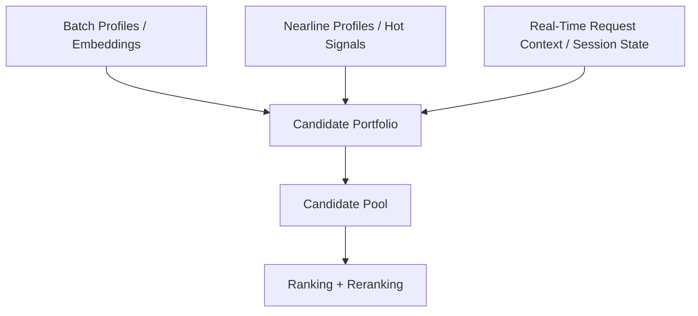
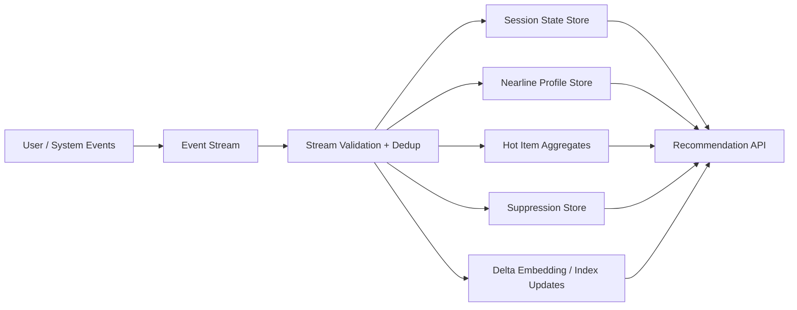
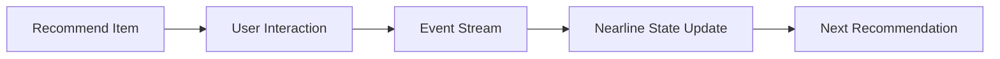

------
title: Build From Scratch Recommendations System - Part 031
description: Mendesain real-time dan nearline candidate generation production-grade: session state, streaming events, recent intent, hot items, incremental profiles, delta indexes, freshness-latency trade-off, reliability, fallback, dan observability.
series: learn-build-from-scratch-recommendations-system
seriesTitle: Build From Scratch: Enterprise Recommendations System
order: 31
partTitle: Real-Time and Nearline Candidate Generation
tags:
  - recommendation-system
  - recsys
  - real-time
  - nearline
  - streaming
  - candidate-generation
  - series
date: 2026-07-02
---

# Part 031 — Real-Time and Nearline Candidate Generation

Batch candidate generation kuat, murah, dan reproducible.

Tetapi user intent sering berubah dalam menit bahkan detik.

User baru saja mencari “kamera travel”.  
User baru saja memasukkan laptop ke cart.  
User baru saja menonton tiga video debugging Kubernetes.  
Item baru tiba-tiba viral.  
Produk baru restock.  
Case enterprise baru berpindah state dari `pending_evidence` ke `needs_escalation`.  
Knowledge article baru dipublish karena policy update.  
Sebuah item mendadak banyak di-hide dan harus dikurangi exposure.

Jika recommendation system hanya mengandalkan batch harian, ia lambat membaca sinyal baru.

Di sinilah **real-time** dan **nearline candidate generation** masuk.

Part ini membahas bagaimana mendesain retrieval yang fresh tanpa mengorbankan reliability: session state, streaming events, hot items, nearline user profiles, delta indexes, incremental embeddings, fast feedback loops, fallback, dan observability.

---

## 1. Mental Model: Batch Is Memory, Real-Time Is Reflex

Recommendation system punya beberapa horizon waktu.

```text
long-term memory: weeks/months/years
nearline memory: minutes/hours
real-time reflex: seconds/current request
```

Batch systems memberi stabilitas:

- long-term user preference,
- daily embeddings,
- item quality,
- offline-trained models,
- global statistics.

Nearline/real-time systems memberi freshness:

- current session intent,
- recent interactions,
- hot/trending items,
- recent inventory changes,
- current case state,
- new document availability.

Production system harus menggabungkan keduanya.



---

## 2. Real-Time vs Nearline

Istilah sering kacau. Kita definisikan praktis.

### Real-Time

Dihitung saat request atau dalam beberapa detik.

Examples:

```text
current query
current seed item
current cart contents
current session clicks
current case state
fresh permission check
```

Sifat:

- very fresh,
- latency-critical,
- limited computation,
- request-specific.

### Nearline

Dihitung dari stream dalam menit.

Examples:

```text
session profile updated within seconds/minutes
user recent category affinity updated every few minutes
hot item counter updated every minute
new item delta index within 15 minutes
case summary embedding after update
```

Sifat:

- fresh enough,
- stored for serving,
- event-driven,
- more robust than request-time heavy computation.

### Batch

Dihitung jam/hari.

Examples:

```text
daily two-tower item index
daily MF embeddings
daily item quality score
weekly graph embeddings
```

Sifat:

- stable,
- reproducible,
- less fresh.

---

## 3. Freshness Spectrum

```text
request-time: now
streaming: seconds
nearline: minutes
hourly: hours
daily: day
offline: historical
```

Setiap signal butuh freshness berbeda.

| Signal | Freshness Need |
|---|---|
| current query | request-time |
| cart contents | request-time/seconds |
| session intent | seconds/minutes |
| stock/policy | seconds/minutes |
| trending item | minutes |
| user long-term embedding | hours/day |
| item collaborative embedding | hours/day |
| item content embedding | on content update |
| enterprise case state | immediate |
| global popularity | hours/day |

Jangan membuat semua real-time. Mahal dan rapuh.

---

## 4. Real-Time Candidate Sources

Examples:

### Session Content-Based

Use current session items/query to retrieve similar candidates.

```text
recent viewed items -> content similar / item-to-item
```

### Cart-Based Candidates

```text
cart items -> co-buy/accessories/compatibility graph
```

### Current Query Retrieval

```text
query embedding -> semantic item/document search
```

### Seed Item Retrieval

```text
current PDP item -> related items
```

### Case State Valid Actions

```text
current case state + actor role -> valid next actions
```

### Request-Time Rules

```text
if user is viewing checkout, recommend low-return add-ons
```

These sources use current context rather than stored long-term profile.

---

## 5. Nearline Candidate Sources

Examples:

### Nearline User Profile

Updated from recent events.

```text
user_recent_category_affinity_1h
user_recent_item_embedding_avg_30m
```

### Hot Item Source

Streaming counts.

```text
trending in region/category over last 15m
```

### New Item Delta Index

Embeddings for newly active items added quickly.

### Recent Co-Occurrence

Session co-view transitions updated within minutes.

### Nearline Suppression

If user just hid item/creator/topic, suppress immediately.

### Enterprise Case Embedding

Case updated -> recompute case embedding -> candidate articles/actions refresh.

Nearline bridges batch and request-time.

---

## 6. Event Flow for Fresh Retrieval



Fresh retrieval depends on reliable streaming events.

If event quality is poor, real-time system amplifies bad data quickly.

---

## 7. Session State Store

Session state stores recent behavior.

Example record:

```json
{
  "session_id": "sess_123",
  "subject": {
    "anonymous_id": "anon_456",
    "user_id": "u123"
  },
  "updated_at": "2026-07-02T10:05:00Z",
  "recent_events": [
    {"type": "view", "item_id": "camera_1", "time": "10:01"},
    {"type": "view", "item_id": "lens_2", "time": "10:03"},
    {"type": "search", "query": "travel camera", "time": "10:04"}
  ],
  "category_counts": {
    "camera": 2,
    "lens": 1
  },
  "session_embedding": {
    "version": "session-encoder-v2",
    "updated_at": "10:05"
  },
  "ttl_seconds": 7200
}
```

Session state must be:

- low-latency,
- TTL-based,
- idempotently updated,
- privacy-aware,
- robust to out-of-order events.

---

## 8. Session Candidate Generation

Session source uses current short-term intent.

Inputs:

```text
recent item IDs
recent categories/topics
current query
cart contents
current seed item
session embedding
```

Candidate methods:

- item-to-item from recent items,
- content-based from session embedding,
- category popularity within session topic,
- query semantic search,
- graph traversal from seed items.

Example score:

```text
candidate_score =
  sum(recency_weight(seed_event) * relation_score(seed_item, candidate))
```

Recent event weight:

```text
weight = event_strength * exp(-lambda * age_minutes)
```

---

## 9. Session vs Long-Term Conflict

User long-term profile:

```text
software engineering, distributed systems
```

Current session:

```text
searching gift: baby stroller
```

If system overuses long-term profile, it recommends Java courses while user shops for gift.

Use blending:

```text
score =
  w_session * session_candidate_score
  + w_long_term * long_term_score
```

Dynamic weights:

```text
if session_intent_confidence high:
    w_session = 0.8
else:
    w_session = 0.3
```

Session intent confidence can use:

- repeated category/query,
- recent action strength,
- cart additions,
- query clarity,
- time since last event.

---

## 10. Real-Time Query Retrieval

For search-like or query-driven recommendation:

1. Normalize query.
2. Compute query embedding.
3. Retrieve semantic/lexical candidates.
4. Apply filters.
5. Merge with other sources.

Use cases:

- search page,
- zero-result page,
- assistant recommendation,
- enterprise case notes to articles,
- “recommend based on this text”.

Need guardrails:

- exact filters,
- language handling,
- sensitive query policy,
- no unauthorized retrieval,
- fallback for empty/ambiguous query.

---

## 11. Current Cart Retrieval

Cart is strong intent.

Cart candidates:

- frequently bought together,
- compatible accessories,
- consumables,
- warranties/services,
- substitutes if item unavailable,
- discount/stock-aware alternatives.

Inputs:

```text
cart item set
cart category set
cart total
cart item compatibility
region/shipping
inventory
```

Candidate scoring:

```text
score(candidate) =
  sum(co_buy_score(cart_item, candidate))
  * compatibility
  * availability
  * low_return_prior
```

Filter:

- already in cart,
- incompatible,
- not shippable,
- out of stock,
- too many same type.

---

## 12. Hot Item / Trending Nearline

Hot item source detects fast-moving items.

Streaming aggregates:

```text
clicks_5m
clicks_15m
purchases_1h
watch_completions_30m
unique_users_15m
hide_rate_15m
report_rate_15m
```

Hot score:

```text
hot_score =
  recent_engagement_rate
  / expected_engagement_rate
```

With smoothing and bot filters.

Use segmentation:

```text
region
category
language
surface
tenant
topic
```

Do not let bot/manipulation make item hot.

---

## 13. Real-Time Suppression

Negative feedback must apply fast.

If user clicks:

```text
hide item
not interested in topic
block creator
already purchased
dismiss action
```

Suppression should update immediately/nearline.

Suppression store:

```json
{
  "subject_id": "u123",
  "suppression_type": "creator",
  "target_id": "creator_9",
  "reason": "not_interested",
  "created_at": "2026-07-02T10:00:00Z",
  "ttl": "90d"
}
```

Serving checks suppression before final ranking/slate.

Batch profile update tomorrow is too slow for explicit negative feedback.

---

## 14. Nearline User Profile

Nearline profile updates after recent behavior.

Example:

```json
{
  "user_id": "u123",
  "profile_name": "recent_interest_profile",
  "updated_at": "2026-07-02T10:05:00Z",
  "category_affinity_1h": {
    "camera": 3.2,
    "lens": 1.1
  },
  "recent_embedding_avg": "vector_ref",
  "recent_negative_topics": ["clickbait_news"]
}
```

Use in candidate generation:

- retrieve items matching recent category,
- query two-tower with recent embedding,
- blend with long-term embedding.

Nearline profile should have TTL.

---

## 15. Incremental User Vector

If item embeddings are fixed, user vector can be updated nearline.

```text
user_recent_vector =
  weighted average of recent positive item vectors
```

Blend:

```text
query_vector =
  0.6 * long_term_user_vector
  + 0.4 * recent_user_vector
```

Or:

```text
query_vector =
  session_vector if session_confidence high
  else blend
```

This gives freshness without retraining item tower.

---

## 16. Delta Index for New/Fresh Items

Daily ANN index may miss items created after build.

Delta index pattern:

```text
main_index: daily full catalog
delta_index: nearline new/updated items
```

Query both:

```text
main_results = search(main_index)
delta_results = search(delta_index)
merge + filter + rank
```

Delta index use cases:

- new products,
- newly published articles,
- updated documents,
- new videos,
- urgent policy articles.

Need dedup and score compatibility.

---

## 17. Nearline Item State Updates

Some item state changes are critical:

- out of stock,
- restocked,
- banned,
- price changed,
- region availability,
- document permission,
- policy validity.

Not all require embedding regeneration.

For retrieval:

- critical invalidation should update eligibility/filter immediately,
- embedding/index can update later.

Separate:

```text
item representation freshness
item eligibility freshness
```

Eligibility must be fresher than embeddings.

---

## 18. Stream Processing Semantics

Streaming jobs must handle:

- duplicate events,
- out-of-order events,
- late events,
- reprocessing,
- checkpointing,
- idempotent state updates.

Nearline counters should be idempotent.

Example:

```text
if click event replayed, do not increment click count twice
```

Use:

- event_id dedup,
- state store TTL,
- event-time windows,
- watermark,
- correction/reconciliation.

Real-time bad data affects users immediately.

---

## 19. Windowed Aggregates

Hot/recent features use windows.

```text
last 5m
last 15m
last 1h
last 24h
```

Use event-time windows.

Example:

```text
item_click_count_15m_by_region_category
```

Important:

- late events update prior windows,
- output can be preliminary vs final,
- serving should know freshness.

For candidate generation, approximate fresh signal may be okay if monitored.

---

## 20. Freshness vs Stability

Too fresh can be noisy.

Example:

```text
item gets 3 clicks in 1 minute
```

Could be trend or noise.

Use smoothing:

```text
score = (recent_count + prior) / (expected + prior)
```

Use minimum unique users.

```text
unique_users_15m >= 5
```

For sensitive surfaces, require more evidence.

Freshness needs stability guardrails.

---

## 21. Real-Time Candidate Source Contract

Candidate response should include freshness metadata.

```json
{
  "source": "session_content_source",
  "source_version": "session-content-v2",
  "candidates": [
    {
      "item_id": "item_123",
      "score": 0.77,
      "score_type": "session_similarity",
      "provenance": {
        "session_state_version": "sess-state-v4",
        "seed_events": ["evt_1", "evt_2"],
        "state_updated_at": "2026-07-02T10:05:00Z"
      }
    }
  ],
  "diagnostics": {
    "state_age_ms": 1200,
    "used_fallback": false
  }
}
```

Freshness should be observable.

---

## 22. Handling Missing Real-Time State

If session state unavailable:

Options:

- compute from request payload if possible,
- use long-term profile,
- use contextual baseline,
- skip session source,
- fallback to popularity.

Do not fail entire recommendation.

Status:

```text
skipped_not_applicable: session_state_missing
```

or:

```text
fallback_used: long_term_profile
```

Monitor missing rate.

---

## 23. Degradation Modes

Real-time systems fail more often than batch.

Degradation hierarchy:

```text
real-time session source
-> nearline recent profile
-> batch long-term profile
-> segment popularity
-> global/editorial fallback
```

This should be built into candidate policy.

Example:

```yaml
session_content:
  fallback:
    - nearline_user_profile
    - content_based_long_term
    - segment_popularity
```

Graceful degradation prevents blank/irrelevant recommendations.

---

## 24. Latency Budget

Real-time candidate generation must be fast.

Example:

```text
session state fetch: 5ms
recent vector build: 3ms
ANN search: 25ms
merge/filter: 10ms
total: 43ms
```

Avoid heavy computation request-time:

- large graph traversal,
- full profile recomputation,
- expensive text embedding if not cached,
- full catalog scoring.

If expensive, move to nearline.

---

## 25. Caching Real-Time Embeddings

Query/session embeddings can be cached.

Key:

```text
session_id + state_version + model_version
```

If session changes, invalidate or recompute.

For query:

```text
normalized_query + locale + model_version
```

Be careful with personalization and access control.

Never serve one user’s personalized vector to another.

---

## 26. Real-Time Personalization and Privacy

Real-time signals can be sensitive.

Examples:

- current query,
- current cart,
- current case state,
- sensitive document,
- medical/legal/financial interest.

Controls:

- consent,
- purpose limitation,
- retention TTL,
- encrypted state,
- restricted logs,
- tenant isolation,
- no raw text logging by default,
- deletion support.

Session state often deserves stronger privacy treatment than aggregate metrics.

---

## 27. Enterprise Nearline Retrieval

Enterprise examples:

### Case State Update

Case changes state. Candidate actions must update immediately.

```text
state: pending_evidence -> needs_review
```

Valid actions change.

### New Policy Article

Policy team publishes urgent article. It should become retrievable soon.

### Actor Permission Change

User loses permission. Retrieval must stop returning restricted actions/documents immediately.

For enterprise, correctness beats freshness if they conflict.

Use:

- request-time permission/state validation,
- nearline case embeddings,
- policy graph update,
- final hard filters.

---

## 28. Real-Time Exploration

Exploration can be nearline-aware.

Examples:

- new item gets initial exposure,
- hot emerging item tested,
- uncertain action recommendation sampled in low-risk cases,
- long-tail content injected.

Need:

- propensity,
- exposure cap,
- real-time guardrail monitoring,
- stop conditions.

If hide/report spikes, exploration should throttle fast.

---

## 29. Fast Feedback Loop

Real-time systems enable fast feedback.

Loop:



This is powerful but risky.

If system overreacts:

- filter bubble,
- repeated similar items,
- manipulation,
- oscillation.

Use blending, caps, and decay.

---

## 30. Preventing Feedback Overreaction

Mitigations:

- recency decay,
- smoothing,
- minimum evidence,
- diversify slate,
- cap same category/creator,
- separate session vs long-term,
- do not immediately infer strong preference from one click,
- use negative feedback carefully.

Example:

```text
one click -> session boost
repeated engagement -> profile update
purchase/long dwell -> stronger long-term signal
```

---

## 31. Online Feature Parity

Nearline features used in serving should be available in training logs.

If ranker/candidate model uses nearline profile, log:

```text
profile_version
profile_values or snapshot ref
profile_updated_at
state_age
```

Otherwise training cannot reproduce online behavior.

Real-time features can be sampled/logged due to size.

But without logging, learning from them is hard.

---

## 32. Request-Time Computed Features

Some features are computed only at request:

- current cart total,
- query embedding,
- seed item similarity,
- current case state,
- local time.

For training, dataset builder must reconstruct them as-of historical request.

This requires logging request context and/or feature snapshot.

Otherwise training-serving skew appears.

---

## 33. Observability

Metrics:

```text
session_state_hit_rate
session_state_age_ms
nearline_profile_hit_rate
nearline_profile_age
hot_item_update_lag
delta_index_age
real_time_source_latency
real_time_source_empty_rate
fallback_usage
suppression_update_lag
post_filter_rate
source_contribution
```

Quality metrics:

```text
CTR/CVR by state freshness
hide/report after real-time source
session continuation
repeat category concentration
new item exploration success
```

---

## 34. Freshness SLO

Examples:

```text
p95 session state update lag < 5s
p95 suppression update lag < 2s
p95 hot item aggregate lag < 60s
p95 new item delta index lag < 15m
p95 case state recommendation update < 5s
```

Different signals need different SLO.

Critical suppression/policy should be fastest.

---

## 35. Reconciliation

Streaming state can drift from batch truth.

Reconcile:

```text
streaming recent counters vs batch clean events
session state anomalies
hot item counts
suppression state
delta index vs catalog
```

If drift large:

- correct state,
- alert,
- exclude affected period from training if needed.

Real-time systems still need batch truth.

---

## 36. Failure Modes

### 36.1 Duplicate Events Inflate Recent Interest

User sees same item type repeatedly.

### 36.2 Session State Missing

Real-time source empty.

### 36.3 Overreaction to One Click

Recommendations become too narrow.

### 36.4 Hot Item Manipulation

Bot traffic creates fake trend.

### 36.5 Delta Index Stale

New items not retrieved.

### 36.6 Suppression Lag

User hides item but keeps seeing similar items.

### 36.7 Permission Lag

Enterprise unauthorized action appears.

### 36.8 Training-Serving Skew

Nearline state not logged.

### 36.9 Latency Spikes

Real-time dependencies slow request.

### 36.10 No Fallback

Fresh source failure empties candidate pool.

---

## 37. Implementation Sketch: Session Source

```java
public final class SessionCandidateSource implements CandidateSource {
    private final SessionStateStore sessionStateStore;
    private final ItemToItemStore itemToItemStore;
    private final ContentRetrievalService contentRetrievalService;
    private final SessionSourceConfig config;

    public CandidateSourceResult generate(CandidateSourceRequest request) {
        var sessionId = request.subject().sessionId();
        if (sessionId == null) {
            return CandidateSourceResult.skipped(name(), version(), "missing_session_id");
        }

        var session = sessionStateStore.get(sessionId);
        if (session.isEmpty() || session.get().isExpired()) {
            return CandidateSourceResult.empty(name(), version(), "session_state_missing");
        }

        var candidates = new ArrayList<Candidate>();

        for (var seed : session.get().recentStrongItemSeeds(config.maxSeeds())) {
            var related = itemToItemStore.getSimilar(seed.itemId(), config.relatedPerSeed());
            candidates.addAll(toCandidates(seed, related));
        }

        if (session.get().hasSessionEmbedding()) {
            candidates.addAll(contentRetrievalService.searchByEmbedding(
                session.get().sessionEmbedding(),
                config.embeddingTopK()
            ));
        }

        return CandidateSourceResult.success(
            name(),
            version(),
            dedupAndLimit(candidates, config.quota())
        );
    }
}
```

Core points:

- session state lookup,
- TTL check,
- seed selection,
- source provenance,
- limit/dedup,
- graceful empty.

---

## 38. Implementation Sketch: Hot Item Source

```java
public final class HotItemCandidateSource implements CandidateSource {
    private final HotItemStore hotItemStore;
    private final HotItemConfig config;

    public CandidateSourceResult generate(CandidateSourceRequest request) {
        var key = HotItemKey.from(
            request.surface(),
            request.context().region(),
            request.context().categoryHint()
        );

        var list = hotItemStore.get(key);

        if (list.isMissingOrStale(config.maxAge())) {
            return CandidateSourceResult.empty(name(), version(), "hot_list_missing_or_stale");
        }

        var candidates = list.items().stream()
            .filter(item -> item.uniqueUsers() >= config.minUniqueUsers())
            .filter(item -> item.reportRate() <= config.maxReportRate())
            .limit(config.quota())
            .map(item -> Candidate.fromHotItem(
                item.itemId(),
                item.hotScore(),
                version(),
                list.generatedAt()
            ))
            .toList();

        return CandidateSourceResult.success(name(), version(), candidates);
    }
}
```

Hot source must include quality guardrails.

---

## 39. Minimal Production Real-Time/Nearline Plan

Start with:

### Session State

```text
recent item IDs
recent categories/topics
recent query
session embedding optional
TTL
```

### Real-Time Suppression

```text
hide/not interested/purchased/blocked creator
```

### Hot Item Aggregates

```text
15m/1h trending by region/category/surface
bot filtered
unique user threshold
```

### Nearline User Recent Profile

```text
recent category affinity
recent item embedding average
updated every few minutes
```

### Delta Index

```text
new/updated items indexed within 15-60m
```

### Fallback

```text
if fresh source unavailable -> batch profile/popularity
```

Keep it small and reliable before making everything real-time.

---

## 40. Checklist Real-Time & Nearline Readiness

```text
[ ] Signals are classified as real-time, nearline, or batch.
[ ] Session state store exists with TTL.
[ ] Session state updates are idempotent.
[ ] Recent intent source has fallback.
[ ] Real-time suppression updates quickly.
[ ] Hot item aggregates filter bot/internal traffic.
[ ] Hot item source uses smoothing/minimum evidence.
[ ] Nearline profiles have freshness metadata.
[ ] Delta index strategy exists for new items.
[ ] Eligibility/policy state is fresher than embeddings.
[ ] Request-time features are logged or reconstructable.
[ ] Fresh source latency budget is defined.
[ ] Graceful degradation exists.
[ ] Freshness SLOs are monitored.
[ ] Stream vs batch reconciliation exists.
[ ] Privacy/tenant controls cover real-time state.
[ ] Enterprise permission/state updates are fail-safe.
[ ] Source contribution and guardrails are monitored.
```

---

## 41. Kesimpulan

Real-time dan nearline candidate generation membuat recommendation system lebih responsif terhadap intent, trend, inventory, policy, dan workflow state.

Prinsip utama:

1. Batch is memory; real-time is reflex.
2. Not all signals need real-time freshness.
3. Session intent should be separate from long-term profile.
4. Nearline profiles bridge batch and request-time.
5. Hot item sources need anti-abuse and smoothing.
6. Suppression/permission updates must be fast.
7. Delta index helps new/fresh items enter retrieval quickly.
8. Freshness must degrade gracefully to batch/fallback.
9. Real-time features must be logged for training parity.
10. Streaming state needs reconciliation with batch truth.

Di Part 032, kita akan membahas **Candidate Deduping, Filtering, and Eligibility**: bagaimana memastikan kandidat dari semua retrieval sources valid, aman, tidak duplikatif, tidak melanggar policy, dan siap masuk ranking layer.
