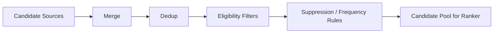
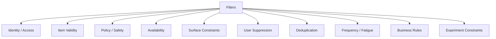
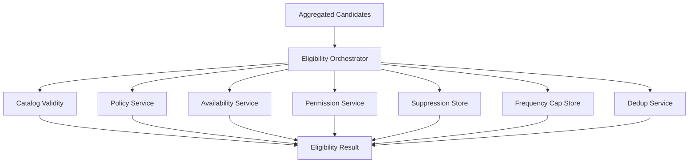

------
title: Build From Scratch Recommendations System - Part 032
description: Mendesain candidate deduping, filtering, dan eligibility production-grade: item validity, policy, availability, permissions, suppression, dedup groups, exposure rules, surface constraints, filter ordering, diagnostics, dan safety gates sebelum ranking.
series: learn-build-from-scratch-recommendations-system
seriesTitle: Build From Scratch: Enterprise Recommendations System
order: 32
partTitle: Candidate Deduping, Filtering, and Eligibility
tags:
  - recommendation-system
  - recsys
  - filtering
  - eligibility
  - deduplication
  - policy
  - retrieval
  - series
date: 2026-07-02
---

# Part 032 — Candidate Deduping, Filtering, and Eligibility

Candidate generation mengumpulkan banyak item dari banyak source.

Tetapi tidak semua kandidat boleh masuk ranking.

Beberapa kandidat duplicate.  
Beberapa item sudah dibeli user.  
Beberapa tidak tersedia di region user.  
Beberapa out of stock.  
Beberapa policy-blocked.  
Beberapa tidak cocok untuk surface.  
Beberapa terlalu sering dilihat user.  
Beberapa tidak boleh diakses actor enterprise.  
Beberapa berasal dari item yang sama tetapi SKU berbeda.  
Beberapa adalah artikel versi lama.  
Beberapa adalah action yang tidak valid untuk case state saat ini.

Jika filtering/eligibility lemah, ranker menerima kandidat kotor. Ranker bisa mempelajari hal salah, latency terbuang, dan yang paling buruk: sistem bisa menampilkan item yang tidak boleh ditampilkan.

Part ini membahas candidate deduping, filtering, dan eligibility sebagai gate production-grade sebelum ranking layer.

---

## 1. Mental Model: Eligibility Is a Hard Boundary

Recommendation ranking menjawab:

```text
Which valid candidate is best?
```

Eligibility menjawab:

```text
Is this candidate allowed to be considered at all?
```

Jangan mencampur keduanya.

Bad:

```text
ranker gives low score to illegal item
```

Good:

```text
illegal item never reaches ranker/final slate
```

Eligibility adalah boundary.



Ranking bekerja setelah candidate pool aman dan valid.

---

## 2. Types of Filters

Filters can be grouped.



Each filter has different severity and freshness needs.

---

## 3. Hard vs Soft Filters

### Hard Filter

Candidate must be removed.

Examples:

- item deleted,
- policy banned,
- unauthorized,
- out of stock when purchase required,
- tenant mismatch,
- invalid case action,
- user blocked creator,
- age-restricted mismatch.

### Soft Filter / Penalty

Candidate can remain but should be downranked or constrained.

Examples:

- seen recently,
- low freshness,
- repeated category,
- low quality,
- high price mismatch,
- source diversity.

Soft filters often belong in reranking/ranking.

Rule:

```text
If showing it would be wrong or unsafe, hard filter.
If showing it is allowed but less desirable, score/constraint.
```

---

## 4. Eligibility Contract

Eligibility result should be structured.

```json
{
  "item_id": "item_123",
  "eligible": false,
  "filter_results": [
    {
      "filter": "policy_state",
      "decision": "reject",
      "reason_code": "item_policy_banned",
      "severity": "critical"
    },
    {
      "filter": "availability",
      "decision": "not_evaluated"
    }
  ]
}
```

For accepted candidate:

```json
{
  "item_id": "item_456",
  "eligible": true,
  "filter_results": [
    {"filter": "item_active", "decision": "pass"},
    {"filter": "region", "decision": "pass"},
    {"filter": "suppression", "decision": "pass"}
  ]
}
```

Reason codes are essential for observability and debugging.

---

## 5. Filter Ordering

Filter order matters for latency and diagnostics.

Suggested order:

1. Exact candidate schema validation.
2. Exact item dedup.
3. Cheap item validity.
4. Hard policy/access filters.
5. Availability/surface constraints.
6. User suppression.
7. Frequency/fatigue.
8. Dedup group/canonicalization.
9. Business/source constraints.
10. Final pool size/fallback check.

Apply cheap/high-severity filters early.

Do not call expensive services for candidates already invalid.

---

## 6. Candidate Schema Validation

Before eligibility, validate candidate shape:

```text
item_id present
item_type present
source present
source_version present
score_type present
generated_at present
```

Invalid candidate is dropped or quarantined depending severity.

Candidate source contract bugs should be visible.

Metrics:

```text
invalid_candidate_schema_count by source
```

If source emits invalid schema, fix source.

---

## 7. Exact Dedup

Same item from multiple sources should appear once.

Input:

```text
item_123 from two_tower
item_123 from trending
item_123 from content_based
```

Output:

```text
one aggregated candidate with three source records
```

Exact dedup preserves provenance.

```json
{
  "item_id": "item_123",
  "sources": ["two_tower", "trending", "content_based"]
}
```

Do not throw away source info.

---

## 8. Canonicalization

Sometimes item IDs differ but logical item same.

Examples:

- SKU variants,
- marketplace offers,
- duplicate articles,
- syndicated videos,
- document versions,
- product family,
- case template versions,
- action aliases.

Canonicalization maps:

```text
candidate_item_id -> canonical_id / dedup_group_id
```

Example:

```text
sku_red_42 -> product_family_shoe_123
sku_blue_43 -> product_family_shoe_123
```

Surface decides whether to show variants or family.

---

## 9. Dedup Group Policy

Dedup group prevents slate repetition.

Rules:

```text
max 1 candidate per product family
max 1 article per canonical URL
max 1 document per policy version group
max 2 items per creator
max 3 per category cluster
```

Dedup can happen:

- before ranker to reduce cost,
- after ranker to keep best variant,
- during reranking.

For candidate pool, exact dedup is always safe. Group dedup depends on surface.

---

## 10. Choosing Representative Candidate

If multiple candidates in same dedup group, choose representative.

Options:

- highest source priority,
- highest source score within source,
- best availability/price,
- highest item quality,
- most recent version,
- ranker later chooses.

Example e-commerce:

```text
same product family with multiple offers
choose best offer by availability, price, seller quality
```

Example document:

```text
choose latest policy version
```

Representative selection is domain-specific.

---

## 11. Item Validity Filters

Basic validity:

```text
item exists
item active
item not deleted
item type allowed
item lifecycle state recommendable
item has required metadata
item not duplicate tombstone
item version valid
```

Catalog state should be fresh enough.

Candidate from stale source may refer to deleted item. Filter it.

---

## 12. Surface Eligibility

Not all items can appear on all surfaces.

Examples:

- product can appear on home feed but not policy article surface,
- adult-rated content not allowed in family surface,
- long video not allowed in short-form rail,
- enterprise action not allowed in knowledge article panel,
- sponsored item not allowed in organic-only module.

Surface contract:

```yaml
surface: checkout_upsell
allowed_item_types:
  - product_addon
  - service
required:
  - shippable_to_region
  - compatible_with_cart
blocked:
  - out_of_stock
  - age_restricted
```

Surface constraints should be config, not scattered code.

---

## 13. Region and Locale Filters

Eligibility can depend on:

- shipping region,
- legal region,
- language,
- currency,
- tax,
- availability,
- local policy,
- localization completeness.

Example:

```text
item available in US but not ID
article only valid for Singapore jurisdiction
video language not supported by user locale
```

Region/legal filters are often hard filters.

Locale mismatch may be soft or hard depending product.

---

## 14. Availability Filters

Availability types:

```text
in_stock
inventory_count
delivery_region
seller_active
offer_valid
price_available
booking_available
document_valid
action_available
case_state_valid
```

Availability freshness matters.

If item out of stock now, candidate should not be shown for purchase surface.

Availability can be surface-specific:

- content article can be read even if product unavailable,
- product detail alternatives can include out-of-stock only if labeled? usually no,
- wishlist recommendations may allow pre-order,
- enterprise action must be valid now.

---

## 15. Policy and Safety Filters

Policy filters:

- banned item,
- unsafe content,
- restricted category,
- age restriction,
- legal restriction,
- content rating,
- sensitive topic controls,
- seller/creator suspension,
- misinformation/harm rules,
- compliance policy.

These are hard filters in most cases.

Policy state must be fresh.

If policy service unavailable:

- fail closed for high-risk surfaces,
- use last known safe cache for low-risk if acceptable,
- fallback to editorial safe list.

Never let policy failure silently pass all candidates.

---

## 16. User Suppression

User-specific suppression:

```text
already purchased
already consumed
hidden item
not interested topic
blocked creator/seller
reported item
dismissed action
seen too many times recently
```

Suppression can be hard or time-bounded.

Examples:

```text
hide item -> hard suppress item
not interested creator -> suppress creator for 90d
purchased product -> suppress same product for 180d
watched episode -> suppress same episode forever
seen article -> suppress for 30d
```

Suppression needs fast updates.

---

## 17. Seen and Repetition Rules

Repeated exposure can cause fatigue.

Rules:

```text
do not show same item more than N times in 7d
do not show same creator more than M times per slate
do not show same category more than K slots
cooldown after impression without click
```

Exposure history:

```text
user_id + item_id + surface + impression_time
```

Use frequency caps.

Do not permanently suppress after one no-click; use cooldown/weight.

---

## 18. Purchased/Consumed Filters

Domain-specific.

E-commerce:

```text
suppress purchased consumable? maybe not if repeat purchase likely
suppress durable goods? likely yes for some window
```

Video/content:

```text
suppress watched completed item
allow rewatch for music? maybe yes
```

Enterprise:

```text
suppress completed action if no longer valid
suppress article already used? maybe not if still relevant
```

Suppression policy depends on item type and surface.

---

## 19. Permission and Access Control

Enterprise and document systems require strict access.

Filters:

```text
tenant_id match
actor has role
role has permission
document ACL allows actor
case visibility allows actor
action allowed for actor
jurisdiction allowed
policy version valid
```

Permission must often be checked before retrieval, but final filter still required.

Unauthorized candidate count should be zero.

Do not log unauthorized item details to callers who cannot access them.

---

## 20. Case/Workflow Eligibility

For enterprise next-action recommendation:

Action eligibility:

```text
case_state allows action
actor_role can execute action
required prerequisites met
jurisdiction policy allows action
SLA state compatible
action not already completed
action not blocked by supervisor decision
```

Invalid action should not reach ranker.

Ranker should choose among valid actions only.

State machine should be source of truth.

---

## 21. Business Rule Filters

Business constraints:

- campaign eligibility,
- margin threshold,
- seller ranking restrictions,
- contractual obligations,
- sponsored disclosure,
- inventory clearance,
- region launch,
- brand safety.

Be explicit whether business rule is:

- hard filter,
- boost,
- quota,
- final slate constraint.

Do not hide hard business constraints as ranker features.

---

## 22. Experiment Filters

Experiments may control candidate eligibility.

Examples:

- treatment enables new category,
- control excludes source,
- experiment allows exploration slot,
- variant changes surface item type,
- policy experiment changes frequency cap.

Candidate filtering must log experiment context.

If experiment changes eligibility, training data needs variant info.

---

## 23. Filter Diagnostics

Every filter should emit count and reason.

Metrics:

```text
candidates_before_filter
removed_by_item_deleted
removed_by_policy
removed_by_availability
removed_by_region
removed_by_suppression
removed_by_dedup
removed_by_permission
candidates_after_filter
```

By source and surface.

Example:

```text
two_tower returned 1000
policy removed 10
availability removed 350
suppression removed 100
dedup removed 50
final 490
```

High filter rate indicates source/index/catalog mismatch.

---

## 24. Source-Specific Filter Rate

Track per source.

```text
source_filter_rate = removed candidates / generated candidates
```

If content source has 80% availability filter rate, maybe it retrieves stale/out-of-region items.

If two-tower has high policy filter rate, index includes bad items.

If exploration has high report filter, exploration quality issue.

Source-specific filter diagnostics guide source improvement.

---

## 25. Filter Result as Rank Feature?

Some soft filter signals can become rank features.

Examples:

```text
seen_count_7d
time_since_last_impression
availability_confidence
metadata_quality
freshness
```

But hard filter failures should not become features; they remove candidate.

Do not pass `policy_banned=true` to ranker and hope it learns.

---

## 26. Eligibility Service Architecture

Centralize eligibility logic.



Do not duplicate filters in every source.

Some coarse filters can live in sources, but final eligibility should be shared.

---

## 27. Batch Eligibility vs Online Eligibility

### Batch/Precompute

Useful for:

- remove deleted/banned items from indexes/lists,
- reduce serving cost,
- build clean candidate stores.

### Online

Required for:

- user-specific suppression,
- fresh inventory,
- permission,
- current policy,
- current context,
- experiment,
- frequency cap.

Use both.

Batch eligibility reduces waste. Online eligibility ensures correctness.

---

## 28. Filter Freshness

Freshness requirements:

| Filter | Freshness |
|---|---|
| item deleted/banned | immediate/minutes |
| policy state | immediate/minutes |
| stock | seconds/minutes |
| user hide/block | seconds |
| purchased/consumed | seconds/minutes |
| region availability | minutes/hours |
| metadata completeness | hours/day |
| document permission | immediate |
| case state/action validity | immediate |

Critical filters should not rely on daily batch.

---

## 29. Caching Eligibility

Eligibility checks can be expensive.

Cache:

- item static validity,
- policy state,
- availability snapshot,
- catalog metadata,
- permission for stable roles,
- suppression sets.

But cache must respect freshness.

For critical policy/access, use short TTL or event-driven invalidation.

Cache key includes:

```text
item_id
user/actor if user-specific
surface
region
tenant
policy_context
```

Bad cache key can leak eligibility across contexts.

---

## 30. Bulk Filtering

Candidate pools contain hundreds/thousands of items. Use batch APIs.

Bad:

```text
for each item:
    call policy service
```

Good:

```text
policyService.batchCheck(items, context)
availabilityService.batchCheck(items, region)
suppressionStore.batchCheck(user, items)
```

Batching reduces latency and load.

Eligibility service should be designed for bulk operations.

---

## 31. Fail-Open vs Fail-Closed

When filter dependency fails:

### Fail-Closed

Reject or use safe fallback.

Use for:

- policy,
- permission,
- legal,
- child safety,
- enterprise restricted docs,
- high-risk actions.

### Fail-Open

Allow if low-risk and last-known state acceptable.

Use cautiously for:

- non-critical metadata,
- soft quality signal,
- low-risk freshness.

Default for safety/access: fail closed.

Document per filter.

```yaml
policy_filter:
  failure_mode: fail_closed
availability_filter:
  failure_mode: fail_closed_for_checkout
  fallback: last_known_available_for_home_if_recent
```

---

## 32. Filter Ordering and Failures

If policy service fails and fail-closed, you might remove all candidates. Then fallback should use safe source.

Example:

```text
policy unavailable -> return editorial_safe_prevalidated list
```

For enterprise:

```text
permission service unavailable -> no restricted recommendations
```

Better blank/safe than unauthorized.

Failure mode is product/safety decision.

---

## 33. Candidate Pool Minimum After Filtering

After filters, pool may be too small.

If pool size < minimum:

1. fallback broader source,
2. relax soft filters,
3. use safe popularity/editorial,
4. reduce final slate size if necessary,
5. return empty only if no safe candidates.

Do not relax hard filters.

Example:

```text
Do not show banned item just because pool small.
```

---

## 34. Dedup vs Diversity

Dedup removes same/near-same candidate.

Diversity ensures slate has variety.

Dedup usually pre-ranking/reranking.

Diversity often reranking.

But candidate-stage dedup can remove excessive duplicates to save ranker cost.

Example:

```text
candidate pool has 500 variants of same shoe
keep best 5 before ranker
reranker selects at most 1
```

Balance recall vs cost.

---

## 35. Eligibility in Training

Training dataset must reflect serving eligibility.

If model trains on items that would not be eligible, it wastes capacity and learns invalid patterns.

Dataset builder should include:

```text
item was eligible at prediction_time
surface allowed
policy state valid
availability valid if objective requires
permission valid
```

But be careful: if historical system wrongly showed invalid item, label may exist. Use incident/policy correction.

Serving filters define candidate universe.

---

## 36. Logging Filtered Candidates

Should we log filtered candidates?

Useful for:

- debugging,
- source quality,
- training source diagnostics,
- filter rate monitoring.

But privacy/security risk:

- unauthorized items should not be broadly logged,
- sensitive policy reasons may be restricted.

Approach:

- log counts by reason always,
- log sampled candidate IDs for non-sensitive filters,
- redact unauthorized details,
- store debug trace with restricted access.

---

## 37. User-Facing Explanation and Filters

If user asks why not seeing something, system may need reason.

Examples:

- out of stock,
- already purchased,
- not available in region,
- hidden by user preference.

But do not expose sensitive policy/security reason directly.

Internal reason:

```text
blocked_by_integrity_policy_rule_42
```

User-facing:

```text
This item is unavailable.
```

Design reason mapping.

---

## 38. Sponsored Candidate Eligibility

Sponsored/promoted candidates must pass same or stricter filters.

Do not let paid source bypass:

- policy,
- availability,
- relevance floor,
- user suppression,
- legal region,
- disclosure requirement,
- frequency cap.

Candidate object should include:

```json
{
  "disclosure_required": true,
  "campaign_id": "camp_123"
}
```

Sponsored is candidate provenance, not eligibility exemption.

---

## 39. Eligibility for Exploration

Exploration candidates need guardrails.

Filters:

```text
policy approved
quality threshold
metadata complete
not suppressed
exposure cap
not high report rate
not duplicate
surface risk allowed
```

Exploration should never mean “ignore safety because we need data”.

---

## 40. Multi-Stage Filtering

Some systems use stages:

### Stage 1: Source Coarse Filter

Remove obvious invalids.

### Stage 2: Aggregator Eligibility

Common hard filters.

### Stage 3: Pre-Rank Filtering

Reduce pool, apply expensive filters.

### Stage 4: Post-Rank/Rerank Constraints

Dedup/diversity/frequency final slate.

### Stage 5: Final Safety Check

Before response, ensure final items still valid.

Final check catches race conditions.

---

## 41. Race Conditions

Between filtering and response, item state can change.

Examples:

- item goes out of stock,
- document permission revoked,
- item banned,
- case state changes.

For critical domains, final check should happen close to response.

For e-commerce stock, some eventual consistency acceptable depending UX. For enterprise permission, not acceptable.

---

## 42. Eligibility Test Cases

Golden tests:

```text
deleted item is removed
banned item is removed
out-of-stock checkout item removed
hidden creator item removed
duplicate product variants deduped
unauthorized document removed
invalid case action removed
no-consent behavioral candidate allowed only if non-personal source? depends policy
```

Test filters as code.

Eligibility bugs are production incidents.

---

## 43. Filter Configuration Example

```yaml
surface: home_feed
eligibility_policy: home-feed-eligibility-v4
hard_filters:
  - item_exists
  - item_active
  - policy_allowed
  - region_allowed
  - surface_allowed
  - user_not_blocked_creator
  - not_hidden_item
soft_constraints:
  - seen_recently_cooldown
  - max_per_creator_candidate_pool
dedup:
  exact_item: true
  dedup_group:
    enabled: true
    max_per_group: 2
failure_modes:
  policy_allowed: fail_closed
  region_allowed: fail_closed
  availability: use_last_known_if_age_lt_5m
minimum_pool:
  size: 500
fallback:
  - segment_popularity
  - editorial_safe
```

---

## 44. Enterprise Eligibility Config Example

```yaml
surface: case_next_action
eligibility_policy: case-action-eligibility-v2
hard_filters:
  - tenant_match
  - actor_has_case_access
  - actor_has_action_permission
  - case_state_allows_action
  - jurisdiction_allows_action
  - policy_version_valid
  - action_not_completed
  - action_prerequisites_met
failure_modes:
  actor_has_action_permission: fail_closed
  case_state_allows_action: fail_closed
  jurisdiction_allows_action: fail_closed
minimum_pool:
  size: 1
fallback:
  - policy_required_safe_actions
audit:
  log_filter_decisions: true
  redact_unauthorized_candidates: true
```

Enterprise eligibility is not optional.

---

## 45. Observability Dashboard

Minimum:

```text
candidate_count_before_filters
candidate_count_after_filters
filter_rate_by_reason
filter_rate_by_source
filter_latency
filter_dependency_error_rate
dedup_removed_count
pool_size_after_filter
fallback_due_to_low_pool
unauthorized_candidate_count
policy_filter_fail_closed_count
suppression_hit_rate
frequency_cap_hit_rate
```

By:

- surface,
- source,
- region,
- tenant,
- item type,
- experiment variant.

Alert:

```text
unauthorized_candidate_count > 0
policy dependency down
pool size after filter below threshold
availability filter rate spikes
suppression store lag high
dedup removes >80% from source
```

---

## 46. Debug Trace Example

```json
{
  "request_id": "req_001",
  "candidate_filtering": {
    "before": 1800,
    "exact_dedup_removed": 220,
    "item_deleted_removed": 15,
    "policy_removed": 4,
    "availability_removed": 310,
    "region_removed": 50,
    "suppression_removed": 120,
    "dedup_group_removed": 80,
    "after": 1001,
    "fallback_used": false
  }
}
```

For item-specific debug:

```json
{
  "item_id": "item_123",
  "sources": ["two_tower", "trending"],
  "filter_decision": "rejected",
  "reason_code": "already_purchased",
  "filter": "user_suppression"
}
```

Debug trace should be permission-controlled.

---

## 47. Common Anti-Patterns

### 47.1 Let Ranker Learn Policy

Unsafe and unreliable.

### 47.2 Filter Only at Source

Stale precomputed lists leak invalid items.

### 47.3 No Reason Codes

Cannot debug filter losses.

### 47.4 No Batch APIs

Eligibility causes latency explosion.

### 47.5 Fail-Open for Permissions

Security incident waiting to happen.

### 47.6 Dedup by Item ID Only

Variants/duplicates flood slate.

### 47.7 Suppression Updated Daily

User keeps seeing hidden items.

### 47.8 Availability Not Contextual

Item available globally but not for this region/user.

### 47.9 Sponsored Bypasses Eligibility

Trust and compliance problem.

### 47.10 No Final Check

Race condition leaks invalid item.

---

## 48. Implementation Sketch: Eligibility Pipeline

```java
public final class CandidateEligibilityPipeline {
    private final CatalogFilter catalogFilter;
    private final PolicyFilter policyFilter;
    private final AvailabilityFilter availabilityFilter;
    private final PermissionFilter permissionFilter;
    private final SuppressionFilter suppressionFilter;
    private final FrequencyCapFilter frequencyCapFilter;
    private final DedupGroupFilter dedupGroupFilter;

    public EligibilityPipelineResult filter(CandidatePool pool, RequestContext context) {
        var result = EligibilityPipelineResult.start(pool);

        result = result.apply("catalog", candidates -> catalogFilter.filter(candidates, context));
        result = result.apply("policy", candidates -> policyFilter.filter(candidates, context));
        result = result.apply("availability", candidates -> availabilityFilter.filter(candidates, context));
        result = result.apply("permission", candidates -> permissionFilter.filter(candidates, context));
        result = result.apply("suppression", candidates -> suppressionFilter.filter(candidates, context));
        result = result.apply("frequency_cap", candidates -> frequencyCapFilter.filter(candidates, context));
        result = result.apply("dedup_group", candidates -> dedupGroupFilter.filter(candidates, context));

        return result;
    }
}
```

Each filter returns:

```text
accepted candidates
rejected candidates
reason codes
latency
dependency status
```

---

## 49. Implementation Sketch: Filter Result

```java
public record FilterDecision(
    String itemId,
    boolean accepted,
    String filterName,
    String reasonCode,
    FilterSeverity severity
) {}

public record FilterStageResult(
    String filterName,
    List<AggregatedCandidate> accepted,
    List<FilterDecision> rejected,
    Duration latency,
    DependencyStatus dependencyStatus
) {}
```

Eligibility pipeline should be auditable.

---

## 50. Minimal Production Eligibility Plan

Implement first:

```yaml
candidate_validation:
  required_fields: [item_id, item_type, source, source_version]

dedup:
  exact_item: true
  preserve_multi_source_provenance: true

hard_filters:
  - item_exists
  - item_active
  - surface_allowed
  - policy_allowed
  - region_allowed
  - availability_if_required
  - permission_if_enterprise
  - user_hide_block_suppression

frequency:
  - seen_recently_cooldown
  - max_impressions_per_item_window

dedup_group:
  - product_family/article_canonical/document_version

fallback:
  - if_pool_too_small: safe_popularity/editorial

observability:
  - filter_rate_by_reason
  - filter_rate_by_source
  - unauthorized_count
  - pool_size_after_filter
```

This gives a safe candidate pool for ranking.

---

## 51. Checklist Dedup, Filtering, Eligibility Readiness

```text
[ ] Candidate schema validation exists.
[ ] Exact item dedup preserves provenance.
[ ] Canonical/dedup group mapping exists.
[ ] Item lifecycle validity is checked.
[ ] Surface allowed item types are enforced.
[ ] Region/locale/legal constraints are enforced.
[ ] Availability is checked where required.
[ ] Policy/safety filters are hard filters.
[ ] User suppression is applied quickly.
[ ] Frequency/fatigue rules exist.
[ ] Permission/access control filters exist for enterprise/restricted data.
[ ] Case/workflow action validity is enforced if applicable.
[ ] Sponsored/exploration candidates pass same safety filters.
[ ] Filter dependency failure modes are defined.
[ ] Fail-closed is used for policy/access.
[ ] Batch filter APIs are used.
[ ] Filter reason codes are logged.
[ ] Filter metrics by source/surface exist.
[ ] Fallback exists when pool too small.
[ ] Final safety check exists for critical surfaces.
[ ] Eligibility rules are tested with golden cases.
```

---

## 52. Kesimpulan

Candidate deduping, filtering, dan eligibility adalah safety gate antara retrieval dan ranking.

Prinsip utama:

1. Eligibility is a hard boundary, not a ranker preference.
2. Filter invalid/unsafe candidates before ranking.
3. Dedup exact item while preserving multi-source provenance.
4. Use canonical/dedup groups for variants and duplicates.
5. Policy, permission, legal, and safety failures should fail closed.
6. Suppression and frequency rules protect user experience.
7. Batch/precomputed filters reduce waste, but online final filters ensure correctness.
8. Filter reason codes and metrics are mandatory.
9. Sponsored and exploration candidates do not bypass eligibility.
10. Enterprise action/document recommendations require strict authorization and workflow validity.

Part ini menutup Module 4: Candidate Generation / Retrieval Layer.

Di Part 033, kita masuk Module 5: **Ranking Layer**, dimulai dari **Ranking Problem Formulation** — bagaimana mengubah candidate pool menjadi supervised/learning-to-rank problem yang tepat, dengan objective, labels, features, and evaluation yang sesuai production.
