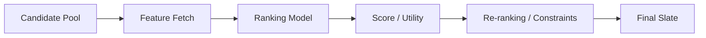

------
title: Build From Scratch Recommendations System - Part 033
description: Memformulasikan ranking problem production-grade: candidate pool, objective, label, utility, constraints, ranking context, pointwise vs listwise thinking, position bias, calibration, multi-objective trade-off, dan offline-online alignment.
series: learn-build-from-scratch-recommendations-system
seriesTitle: Build From Scratch: Enterprise Recommendations System
order: 33
partTitle: Ranking Problem Formulation
tags:
  - recommendation-system
  - recsys
  - ranking
  - learning-to-rank
  - machine-learning
  - evaluation
  - series
date: 2026-07-02
---

# Part 033 — Ranking Problem Formulation

Candidate generation menjawab:

```text
Item apa saja yang mungkin relevan?
```

Ranking menjawab:

```text
Dari kandidat valid ini, mana yang paling berguna untuk ditampilkan sekarang, dalam urutan apa?
```

Ranking layer adalah tempat banyak sinyal bertemu:

- user preference,
- item quality,
- context,
- source score,
- business objective,
- policy,
- diversity,
- novelty,
- freshness,
- long-term value,
- marketplace health,
- safety guardrails.

Ranking bukan sekadar model yang memprediksi click probability.

Ranking adalah formulasi keputusan.

Jika problem formulation salah, model bisa sangat akurat untuk metric yang salah dan buruk untuk produk.

Part ini membahas bagaimana memformulasikan ranking problem production-grade: unit ranking, objective, labels, utility, candidate context, slate context, bias, calibration, multi-objective, constraints, offline-online alignment, dan failure modes.

---

## 1. Mental Model: Ranking Is Utility Ordering Under Constraints

Ranking system menerima candidate pool:

```text
C = {candidate_1, candidate_2, ..., candidate_n}
```

Untuk request context `x`, ranking menghasilkan urutan:

```text
ordered candidates = sort_by_utility(C, x)
```

Namun utility bukan hanya:

```text
P(click)
```

Utility bisa berupa:

```text
expected user value
+ expected business value
+ expected long-term value
- expected harm/risk
- expected fatigue
subject to constraints
```

Ranking production-grade:

```text
maximize expected utility of slate
while satisfying safety, eligibility, policy, latency, and product constraints
```

Diagram:



---

## 2. Ranking Is Not Retrieval

Retrieval/candidate generation optimizes recall.

Ranking optimizes precision and utility among candidates.

Retrieval may use approximate similarity:

```text
user embedding dot item embedding
```

Ranking can use richer features:

```text
user-item cross features
context
item quality
source provenance
business value
freshness
negative feedback
availability
```

Retrieval can be wrong but useful if it includes candidates. Ranking refines.

Do not overload retrieval model to solve everything. It cannot see all cross features or slate constraints cheaply.

---

## 3. Ranking Unit

Define what is being ranked.

Examples:

### Item Ranking

```text
rank products/videos/articles
```

### Offer Ranking

```text
rank seller offers for same product
```

### Action Ranking

```text
rank next best actions for case
```

### Document Ranking

```text
rank knowledge articles
```

### Creator Ranking

```text
rank creators/channels
```

### Bundle Ranking

```text
rank groups of items
```

### Slate Ranking

```text
rank an ordered list, not individual items independently
```

The unit affects labels, features, constraints, and evaluation.

---

## 4. Candidate Pool Is Part of Ranking Problem

Ranker only sees candidates from retrieval.

If candidate distribution changes, ranking changes.

Training data must match production candidate pool.

Problems:

- ranker trained on old retrieval candidates,
- new two-tower source adds different items,
- exploration source adds cold items,
- ranker suppresses unknown source,
- ranker overfits source rank.

Ranking formulation must include candidate source provenance.

Candidate features:

```text
source flags
source scores
source ranks
source count
retrieval model version
candidate generation policy
```

Ranker learns within a candidate ecosystem.

---

## 5. Ranking Context

Ranking depends on request context.

Context includes:

```text
user identity/state
session intent
surface
device
time
region
locale
query
seed item
cart
candidate source policy
experiment variant
privacy mode
enterprise case state
actor role
```

Same candidate can have different utility in different context.

Example:

```text
camera battery
```

High utility on cart with camera, low utility on homepage.

Ranking model must receive enough context to distinguish.

---

## 6. Surface-Specific Ranking

Different surfaces have different intent and metrics.

### Home Feed

Discovery, engagement, retention, diversity.

### Product Detail

Alternatives, complements, comparison.

### Cart/Checkout

Attach, conversion, low regret.

### Search

Explicit query relevance, conversion.

### Email/Push

Open, long-term trust, frequency fatigue.

### Enterprise Case

Task success, correctness, compliance, auditability.

One universal ranker may underperform if surface semantics differ.

Options:

- separate ranker per surface,
- shared model with surface features,
- shared backbone with surface-specific heads,
- surface-specific calibration.

Start with surface-specific formulation if behavior is very different.

---

## 7. Label Choice

Ranking model usually predicts labels from user feedback.

Labels:

```text
click
long dwell
add_to_cart
purchase
watch completion
save/like
hide/not interested
report
return/refund
case action accepted
case action success
article useful
```

Label choice defines what model optimizes.

If you train on click, model learns clickability.

If you train on purchase, model learns conversion but with sparse delayed labels.

If you train on watch completion, model learns deeper engagement.

If you train on accepted action, model may learn user convenience, not actual case outcome.

Choose label aligned with product objective.

---

## 8. Click Is Not Enough

Click is common because it is frequent and fast.

But click can be misleading:

- clickbait,
- accidental clicks,
- curiosity without satisfaction,
- UI bias,
- title/image attractiveness,
- short-term engagement over long-term trust.

Click can be useful as one task, but not the only objective.

Production ranking often uses multiple labels:

```text
click
conversion
satisfaction
negative feedback
long-term retention
```

---

## 9. Conversion Labels

Conversion depends on domain.

E-commerce:

```text
purchase
add_to_cart
checkout
repeat purchase
low return
```

Content:

```text
watch complete
read complete
follow creator
return next day
```

Enterprise:

```text
action executed
case resolved
SLA met
supervisor approved
no rework
article marked useful
```

Conversion labels are often delayed and sparse.

Need label windows and maturity.

---

## 10. Negative Labels

Negative feedback is valuable.

Examples:

```text
hide
not interested
dislike
report
refund
return
complaint
dismiss action as irrelevant
supervisor rejects action
```

But negative labels have different severity.

`hide` may indicate preference.  
`report` may indicate safety/policy issue.  
`return` may indicate post-purchase dissatisfaction, item quality, logistics, or expectation mismatch.

Do not collapse all negatives into one binary label blindly.

---

## 11. Non-Action Is Ambiguous

Candidate shown but not clicked is often used as negative.

But no-click could mean:

- not seen,
- user busy,
- bad position,
- item irrelevant,
- user already satisfied,
- UI issue,
- candidate below fold,
- user not ready.

No-click can be weak negative for CTR, but not strong dislike.

Ranking formulation must consider exposure, visibility, and position.

---

## 12. Ranking Example Row

A pointwise ranking example:

```json
{
  "request_id": "req_001",
  "candidate_id": "item_123",
  "prediction_time": "2026-07-02T10:00:00Z",
  "surface": "home_feed",
  "position_logged": 3,
  "features": {
    "user_category_affinity": 0.71,
    "item_quality": 0.84,
    "source_two_tower_score": 8.2,
    "source_trending_rank": 12,
    "user_has_seen_item_7d": false
  },
  "labels": {
    "clicked_30m": 1,
    "purchased_7d": 0,
    "hide_7d": 0
  },
  "example_weight": 1.0
}
```

For production, include:

- source provenance,
- experiment variant,
- feature version,
- label version,
- visibility/impression quality,
- position/layout.

---

## 13. Objective vs Label vs Metric

These are different.

### Objective

What the system should optimize.

```text
increase satisfied purchases without increasing returns
```

### Label

Observed signal used for training.

```text
purchase within 7d
return within 30d
```

### Metric

How we evaluate.

```text
online conversion, return rate, revenue, NDCG, retention
```

Objective may require multiple labels and guardrails.

Do not confuse label with objective.

---

## 14. Utility Function

Ranking can be framed as expected utility.

Example e-commerce:

```text
utility =
  P(purchase) * expected_margin
  - P(return) * return_cost
  - P(report) * safety_cost
  + P(long_term_satisfaction) * retention_value
```

Content:

```text
utility =
  P(watch_complete) * user_value
  - P(hide) * trust_cost
  - repetition_penalty
  + novelty_bonus
```

Enterprise:

```text
utility =
  P(action_success) * case_value
  - P(rework) * operational_cost
  - policy_risk
```

The model may predict components separately. Ranking policy composes them.

---

## 15. Single-Objective Ranking

Simple formulation:

```text
score = P(click)
```

Good for:

- early baseline,
- high-volume engagement surfaces,
- simple objective.

Bad if:

- clickbait,
- conversion matters,
- negative feedback matters,
- long-term value matters,
- business constraints matter.

Single-objective is starting point, not final destination.

---

## 16. Multi-Objective Ranking

Predict multiple outcomes:

```text
p_click
p_purchase
p_hide
p_report
p_return
p_satisfaction
```

Then compose:

```text
score =
  w1 * p_click
  + w2 * p_purchase
  - w3 * p_hide
  - w4 * p_report
  - w5 * p_return
```

Weights are product decisions.

Important:

- predictions should be calibrated enough,
- weights should be reviewed,
- guardrails should exist,
- online experiments required.

Multi-objective ranking is common in production.

---

## 17. Guardrail Metrics

Some metrics should not be optimized directly but constrained.

Examples:

```text
report rate must not increase
return rate must not increase
latency must stay below SLO
exposure fairness must not degrade
policy violations must be zero
creator concentration must be bounded
```

Guardrail:

```text
improve primary metric while maintaining guardrails
```

Ranking formulation should know which metrics are optimize vs guard.

---

## 18. Position Bias

Historical labels depend on position.

Items at top get more attention.

If model trains on clicks without accounting for position, it may learn historical ranker bias.

Example:

```text
item A clicked because position 1
item B not clicked because position 20
```

Mitigations:

- visibility logging,
- position features for debiasing/evaluation,
- propensity weighting,
- randomized exploration,
- train on candidate sets with position-aware labels,
- avoid using final position as serving feature for pre-position ranker.

Position is logging context, not always serving feature.

---

## 19. Presentation Bias

Labels depend on UI.

Examples:

- image size,
- badge,
- sponsored label,
- price display,
- layout,
- autoplay,
- title truncation,
- notification copy.

Ranking data should log presentation context.

If UI changes, label distribution changes.

Ranker trained on old UI may not transfer.

---

## 20. Selection Bias

Training data only includes shown candidates.

Unshown candidates have unknown outcome.

Ranking model learns under historical candidate generation and ranking policy.

This means:

```text
observed feedback is conditional on logging policy
```

Mitigations:

- exploration,
- propensity logging,
- counterfactual evaluation,
- source diversity,
- retraining after source changes,
- careful offline validation.

---

## 21. Candidate Set Context

Ranker often scores candidates independently, but user sees slate.

Candidate utility can depend on other candidates:

- duplicates,
- diversity,
- category balance,
- creator repetition,
- price range,
- sequence,
- complementarity,
- fairness exposure.

A pointwise ranker gives item score. Reranker/slate optimizer handles list context.

But ranking formulation should include:

```text
ranking is eventually slate-level
```

---

## 22. Pointwise Ranking Formulation

Pointwise:

```text
predict label for each candidate independently
```

Example:

```text
P(click | user, item, context)
```

Pros:

- simple,
- scalable,
- works with standard classifiers/regressors,
- easy to calibrate,
- easy to debug.

Cons:

- does not directly optimize ordering,
- ignores slate context,
- no pair/list objective,
- position bias issues.

Pointwise is common starting point.

---

## 23. Pairwise Ranking Formulation

Pairwise:

```text
for same request/user, positive item should score higher than negative item
```

Example:

```text
clicked item > skipped item
purchased item > viewed-only item
```

Pros:

- closer to ranking,
- handles relative preference,
- useful for learning-to-rank.

Cons:

- pair generation cost,
- negative sampling complexity,
- can lose calibration,
- pair labels can be noisy.

---

## 24. Listwise Ranking Formulation

Listwise:

```text
optimize ordering of entire list/slate
```

Pros:

- closest to ranking metrics,
- can optimize NDCG-like objectives,
- understands group context better.

Cons:

- more complex,
- needs query/request groups,
- harder training/infrastructure,
- slate feedback sparse/noisy.

Part 034 will go deeper into pointwise/pairwise/listwise.

---

## 25. Ranking Group

For learning-to-rank, examples are grouped.

Group can be:

```text
request_id
search query
session request
recommendation response
candidate pool snapshot
case context
```

Group contains candidates competing for same slots.

If group lost, pairwise/listwise training breaks.

Training dataset should keep:

```text
group_id
candidate_id
features
labels
position
```

---

## 26. Ranking and Calibration

If score is used as probability or combined with business value, calibration matters.

Example:

```text
score = P(purchase) * margin
```

If `P(purchase)` is uncalibrated, utility wrong.

Calibration needed for:

- multi-objective score composition,
- thresholding,
- bid/sponsored systems,
- risk-sensitive enterprise decisions,
- expected value ranking.

Less needed if score only orders within same model/source.

Monitor calibration by segment.

---

## 27. Score Composition

Ranking score can be:

```text
model_score
```

or composed:

```text
final_score =
  model_score
  + business_boost
  + freshness_boost
  - repetition_penalty
```

Prefer explicit composition layer instead of hiding everything inside labels.

Example:

```text
ranker predicts p_purchase
policy layer applies margin, availability, frequency, diversity
```

This is more debuggable.

---

## 28. Ranking Features

Feature groups:

### User

```text
affinity, history, segment, consent, lifecycle
```

### Item

```text
category, quality, price, freshness, popularity
```

### Context

```text
surface, device, time, region, query, cart, case state
```

### Cross

```text
user-item affinity, embedding similarity, seen count, price fit
```

### Source

```text
retrieval source flags, scores, ranks, source count
```

### System

```text
experiment, model version, layout
```

Feature design will be Part 035.

---

## 29. Ranking Label Windows

Each label needs window.

```text
click within 30m
purchase within 7d
return within 30d after purchase
watch completion within session
article useful within case lifecycle
```

Longer windows:

- more complete,
- slower training,
- more delayed.

Shorter windows:

- faster,
- noisier/incomplete.

Use label maturity.

---

## 30. Delayed Outcomes

Some outcomes appear long after impression.

Examples:

- purchase after days,
- return after weeks,
- retention after months,
- case resolution after days/weeks.

Ranking model may need:

- fast proxy labels,
- delayed correction labels,
- multi-stage models,
- periodic retraining,
- long-term value model.

Do not label incomplete delayed outcomes as negative.

---

## 31. Ranking for Enterprise Actions

Enterprise ranking often has stricter formulation.

Candidate universe:

```text
valid actions/documents only
```

Labels:

```text
action accepted
action completed
case progressed
SLA improved
supervisor approved
no rework
article marked useful
```

Constraints:

```text
permission
case state
jurisdiction
policy
audit
explainability
```

Utility:

```text
task success > engagement
```

A high click/accept rate may be bad if action causes rework.

Ranking must optimize outcome, not just user convenience.

---

## 32. Ranking vs Reranking

Ranking:

```text
assign score to candidates
```

Reranking:

```text
construct final slate with constraints
```

Reranking handles:

- diversity,
- novelty,
- frequency cap,
- fairness,
- source mix,
- business constraints,
- slate-level rules.

Do not force ranker to solve all slate constraints alone.

But ranker should output enough calibrated/meaningful scores for reranker.

---

## 33. Offline Ranking Evaluation

Metrics:

- AUC,
- log loss,
- precision@K,
- recall@K,
- NDCG@K,
- MAP,
- calibration error,
- coverage,
- diversity,
- guardrail metrics.

Metric depends on formulation.

For ranking, request-grouped metrics like NDCG@K often more relevant than global AUC.

But offline metrics are proxies. Online A/B remains necessary.

---

## 34. Offline-Online Gap

Reasons offline ranking improvement may not convert online:

- leakage,
- biased labels,
- wrong candidate distribution,
- metric not aligned,
- position bias,
- ranker distribution shift,
- calibration issues,
- reranker changes,
- UI effects,
- delayed outcomes not captured,
- guardrail degradation.

Ranking formulation should include expected online experiment plan.

---

## 35. Ranking Baselines

Before complex model, compare against:

- source score ranking,
- popularity ranking,
- content similarity ranking,
- item quality ranking,
- simple logistic regression/GBDT,
- previous production ranker.

A complex ranker that cannot beat strong baseline is not ready.

---

## 36. Logging for Ranking

At serving, log:

```text
request context
candidate pool
candidate sources
features or feature snapshot refs
model version
scores
rank before rerank
final position
labels/outcomes later
experiment variant
filter decisions
```

Without ranking logs, training and debugging fail.

Full candidate logging may be expensive. At least log final slate and sampled non-final candidates.

---

## 37. Ranking Problem Spec

Define ranking problem as spec.

```yaml
ranking_problem: home_feed_ranker_v1
surface: home_feed
unit: item_candidate
group_id: request_id
candidate_sources:
  - two_tower
  - item_cf
  - content_based
  - trending
features: home_ranker_features_v12
labels:
  primary:
    clicked_30m:
      weight: 1.0
  secondary:
    purchase_7d:
      weight: 3.0
    hide_7d:
      weight: -2.0
objective:
  type: multi_task_pointwise
evaluation:
  primary_offline: ndcg_at_20_click
  guardrails:
    - hide_rate
    - report_rate
    - latency
split: temporal
```

Spec creates clarity and reviewability.

---

## 38. Ranking Failure Modes

### 38.1 Optimizes Clickbait

Click-only objective.

### 38.2 Suppresses New Items

Training dominated by warm items.

### 38.3 Overweights Source Rank

Ranker learns old retrieval/ranker bias.

### 38.4 Ignores Negative Feedback

User fatigue and trust degrade.

### 38.5 Uses Position as Serving Feature

Leakage/invalid feature.

### 38.6 Candidate Distribution Shift

New source not handled.

### 38.7 Poor Calibration

Multi-objective score wrong.

### 38.8 No Slate Awareness

Duplicates/repetition.

### 38.9 Enterprise Invalid Actions

Eligibility failure mixed with ranking.

### 38.10 Offline Metric Overfit

A/B test fails.

---

## 39. Implementation Sketch: Ranking Request

```java
public record RankingRequest(
    String requestId,
    String surface,
    Subject subject,
    RequestContext context,
    List<AggregatedCandidate> candidates,
    RankingPolicy policy,
    boolean debug
) {}
```

Candidate includes source provenance and eligibility-passed item.

```java
public record RankableCandidate(
    String itemId,
    String itemType,
    List<CandidateSourceEvidence> sources,
    Map<String, Object> candidateMetadata
) {}
```

Ranking response:

```java
public record RankingResult(
    List<ScoredCandidate> scoredCandidates,
    String modelVersion,
    String featureSetVersion,
    RankingDiagnostics diagnostics
) {}
```

---

## 40. Implementation Sketch: Utility Composition

```java
public final class UtilityComposer {
    public double compose(Predictions p, BusinessContext context) {
        return context.clickWeight() * p.pClick()
             + context.purchaseWeight() * p.pPurchase()
             - context.hideWeight() * p.pHide()
             - context.reportWeight() * p.pReport()
             + context.qualityWeight() * p.expectedSatisfaction();
    }
}
```

In production, weights should be versioned config, not random constants hidden in code.

---

## 41. Minimal Production Ranking Formulation

Start with:

```yaml
unit: item candidate
group: request_id
model: pointwise GBDT or neural ranker
primary_label: clicked_within_30m
secondary_labels:
  - purchase_7d
  - hide_7d
features:
  - user
  - item
  - context
  - user_item_cross
  - source_features
evaluation:
  - NDCG@K
  - Precision@K
  - calibration
  - hide/report guardrails
candidate_distribution:
  - production candidate logs
split:
  - temporal
```

Do not start with listwise deep slate optimizer before pointwise/pairwise formulation and logging are solid.

---

## 42. Checklist Ranking Problem Formulation

```text
[ ] Ranking unit is explicit.
[ ] Surface-specific objective is defined.
[ ] Candidate source distribution is known.
[ ] Group ID is preserved.
[ ] Primary label is defined.
[ ] Secondary/negative labels are defined.
[ ] Label windows and maturity are defined.
[ ] Utility function or score composition is explicit.
[ ] Guardrail metrics are defined.
[ ] Position/presentation bias is considered.
[ ] Candidate source features are included.
[ ] Eligibility is separated from ranking.
[ ] Reranking/slate constraints are acknowledged.
[ ] Offline metrics align with objective.
[ ] Calibration need is identified.
[ ] Training logs include feature/model/source versions.
[ ] Enterprise constraints are handled as hard filters if applicable.
[ ] Ranking problem spec is versioned.
```

---

## 43. Kesimpulan

Ranking problem formulation menentukan apa yang sebenarnya dipelajari model.

Prinsip utama:

1. Ranking is utility ordering under constraints.
2. Retrieval optimizes recall; ranking optimizes utility among valid candidates.
3. Label choice shapes model behavior.
4. Click is useful but insufficient as sole objective.
5. Multi-objective ranking is often necessary.
6. Position, presentation, and selection bias affect labels.
7. Ranking examples need group/request context.
8. Candidate source provenance is part of ranking.
9. Eligibility is a hard boundary, not ranker preference.
10. Ranking problem should be specified and versioned before model training.

Di Part 034, kita akan membahas **Learning to Rank: Pointwise, Pairwise, Listwise** — tiga cara utama melatih ranking model dan kapan menggunakannya di production.
