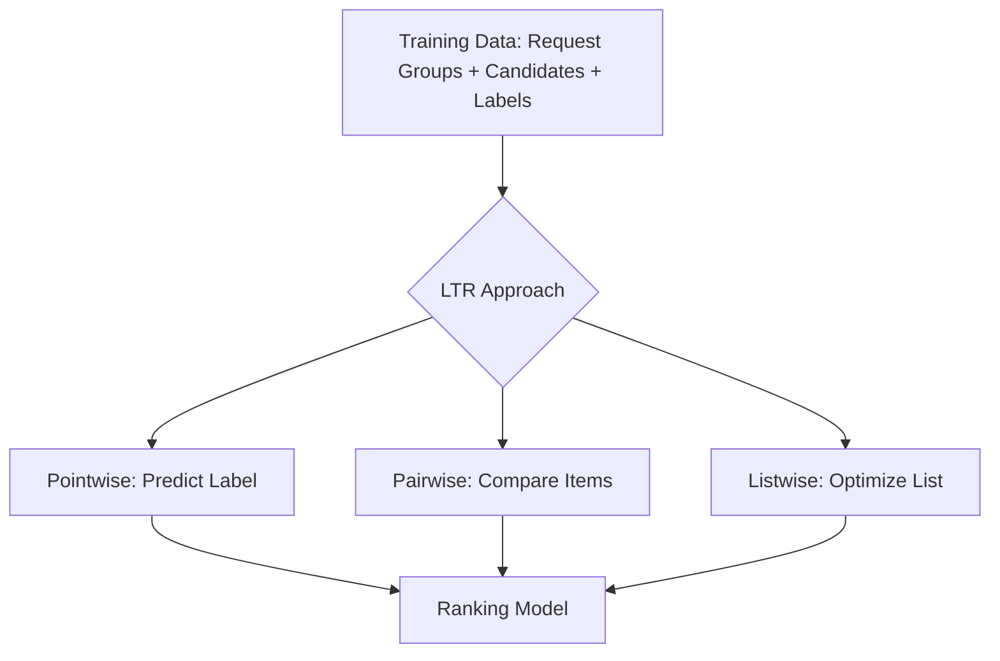

------
title: Build From Scratch Recommendations System - Part 034
description: Membahas learning-to-rank production-grade: pointwise, pairwise, listwise objectives, dataset grouping, pair construction, losses, metrics, calibration, bias, trade-offs, dan penerapan untuk recommendation ranking.
series: learn-build-from-scratch-recommendations-system
seriesTitle: Build From Scratch: Enterprise Recommendations System
order: 34
partTitle: Learning to Rank: Pointwise, Pairwise, Listwise
tags:
  - recommendation-system
  - recsys
  - learning-to-rank
  - ranking
  - pointwise
  - pairwise
  - listwise
  - series
date: 2026-07-02
---

# Part 034 — Learning to Rank: Pointwise, Pairwise, Listwise

Setelah ranking problem diformulasikan, pertanyaan berikutnya:

> Bagaimana model dilatih agar menghasilkan urutan kandidat yang baik?

Di learning-to-rank, ada tiga keluarga utama:

1. **Pointwise**  
   Setiap kandidat diprediksi secara independen.

2. **Pairwise**  
   Model belajar bahwa kandidat yang lebih baik harus mendapat skor lebih tinggi dari kandidat yang lebih buruk.

3. **Listwise**  
   Model belajar mengoptimalkan urutan list secara keseluruhan.

Ketiganya punya tempat di production.

Pointwise sederhana dan mudah dioperasikan.  
Pairwise lebih dekat ke ranking.  
Listwise lebih dekat ke metric seperti NDCG, tetapi lebih kompleks.

Part ini membahas ketiganya secara praktis: objective, dataset, loss, trade-off, bias, calibration, evaluation, dan penerapan di recommendation system production-grade.

---

## 1. Mental Model

Ranking model menghasilkan score:

```text
score = f(user, item, context, source_features)
```

Kemudian kandidat diurutkan berdasarkan score.

Learning-to-rank menentukan bagaimana `f` dilatih.



All approaches need good data. Loss function cannot fix bad labels, leakage, or invalid candidates.

---

## 2. Training Data Shape

Learning-to-rank dataset should preserve groups.

Example:

```text
group_id = request_id
candidates = [item_A, item_B, item_C, item_D]
labels = [0, 1, 0, 0]
```

Table:

| group_id | item_id | features | label | logged_position |
|---|---|---|---:|---:|
| req_1 | A | ... | 0 | 1 |
| req_1 | B | ... | 1 | 2 |
| req_1 | C | ... | 0 | 3 |
| req_1 | D | ... | 0 | 4 |

For pointwise, group less critical but still useful for metrics.  
For pairwise/listwise, group is essential.

---

## 3. Pointwise Learning-to-Rank

Pointwise treats each candidate independently.

Example objective:

```text
predict P(click | user, item, context)
```

Model sees rows:

```text
(candidate features) -> label
```

Common losses:

- binary cross entropy,
- logistic loss,
- squared error,
- Poisson/count loss,
- regression loss for rating/utility.

Prediction:

```text
score_i = f(x_i)
sort candidates by score_i
```

This is the most common starting point.

---

## 4. Pointwise Example

Training examples:

```text
item A shown, not clicked -> 0
item B shown, clicked -> 1
item C shown, not clicked -> 0
```

Model learns:

```text
features of clicked items -> higher probability
features of non-clicked items -> lower probability
```

At serving:

```text
score each candidate independently
sort descending
```

Simple and scalable.

---

## 5. Pointwise Pros

Pointwise is popular because:

- easy dataset construction,
- works with many models,
- supports calibrated probabilities,
- easy multi-task setup,
- easy debugging,
- online-serving simple,
- can use standard classification/regression tooling,
- handles large data.

Models:

- logistic regression,
- gradient boosted trees,
- random forests,
- neural nets,
- wide & deep,
- deep rankers.

For first production ranker, pointwise is often right.

---

## 6. Pointwise Cons

Limitations:

- does not directly optimize rank order,
- ignores candidate competition,
- treats examples across different requests similarly,
- class imbalance can dominate,
- no-click ambiguity,
- position bias,
- slate effects not modeled,
- predicted probability may not translate to best ordering if utility is complex.

Example:

```text
A p_click=0.2 on low-intent request
B p_click=0.1 on high-intent request
```

Pointwise model sees both globally, but ranking only matters within each request.

Use group metrics for evaluation.

---

## 7. Pointwise with Utility Labels

Instead of predicting click only, target can be utility.

Example:

```text
label_utility =
  1.0 * click
  + 5.0 * purchase
  - 2.0 * hide
  - 10.0 * report
```

Then train regression.

Risk:

- arbitrary weights,
- scale instability,
- hard calibration,
- rare outcomes dominate,
- negative labels semantically mixed.

Often better:

```text
multi-task predictions + explicit utility composition
```

rather than one handcrafted utility label.

---

## 8. Multi-Task Pointwise

Model predicts multiple labels:

```text
p_click
p_purchase
p_hide
p_report
p_return
p_satisfaction
```

Loss:

```text
L =
  w_click * BCE(click)
  + w_purchase * BCE(purchase)
  + w_hide * BCE(hide)
  + ...
```

Serving utility:

```text
score =
  a * p_click
  + b * p_purchase
  - c * p_hide
  - d * p_report
```

Pros:

- each label retains semantics,
- flexible score composition,
- guardrails easier,
- calibration per task possible.

Cons:

- task imbalance,
- delayed labels,
- missing labels,
- task conflict.

---

## 9. Pointwise Class Imbalance

Clicks/purchases are sparse.

Example:

```text
CTR = 3%
purchase rate = 0.5%
```

If model predicts all zero, accuracy high but useless.

Use:

- class weights,
- downsample negatives,
- proper metrics,
- calibration correction,
- group-wise ranking metrics,
- hard negative sampling.

Do not optimize accuracy.

Use log loss/AUC/NDCG/PR-AUC depending objective.

---

## 10. Pairwise Learning-to-Rank

Pairwise trains on item pairs within same group.

If item A is better than item B:

```text
score(A) > score(B)
```

Training pair:

```text
(x_A, x_B, label = A preferred)
```

Loss penalizes wrong ordering.

Example:

```text
clicked item > non-clicked item
purchased item > clicked-only item
not-hidden item > hidden item
```

Pairwise is closer to ranking than pointwise.

---

## 11. Pair Construction

Given group:

```text
A label=0
B label=1
C label=0
D label=0
```

Pairs:

```text
B > A
B > C
B > D
```

If graded labels:

```text
purchase=3
click=1
no-click=0
hide=-2
```

Pairs:

```text
purchase > click
purchase > no-click
click > no-click
no-click > hide
```

Pair construction can explode.

If group has `m` candidates, pairs can be O(m²).

Use sampling.

---

## 12. Pairwise Loss

Common form:

```text
loss = log(1 + exp(-(score_pos - score_neg)))
```

If positive score much higher than negative, loss small.

If negative score higher, loss large.

Hinge version:

```text
loss = max(0, margin - (score_pos - score_neg))
```

Pairwise loss focuses on relative ordering.

---

## 13. Pairwise Pros

- optimizes ordering more directly,
- robust to global calibration issues,
- good for relative preference,
- can handle graded labels,
- focuses on hard comparisons,
- aligns with ranking within request.

Pairwise is useful when:

- ordering matters more than calibrated probability,
- labels are relative,
- candidate groups are available,
- negatives are meaningful within same request.

---

## 14. Pairwise Cons

- pair explosion,
- pair sampling complexity,
- less calibrated scores,
- noisy pairs from ambiguous negatives,
- harder online interpretation,
- position bias still matters,
- training slower,
- group construction required.

If no-click negatives are weak, many pairs may be noisy.

Example:

```text
clicked item at position 1 > no-click item at position 20
```

Maybe position, not relevance.

---

## 15. Pair Sampling

Strategies:

### All Positive-Negative Pairs

High cost.

### Sample Negatives Per Positive

```text
for each positive, sample K negatives
```

### Hard Negative Pairs

Use negatives with high model/source score.

### Same-Position/Similar Exposure Pairs

Reduce position bias.

### Label-Difference Weighted Pairs

Bigger label difference gets higher weight.

Example:

```text
purchase > report has higher weight than click > no-click
```

Pair sampling policy should be versioned.

---

## 16. Pairwise with Multiple Positive Levels

Graded labels:

```text
purchase = 4
add_to_cart = 3
click = 1
no_click = 0
hide = -2
report = -5
```

Pairs only if label difference meaningful.

```text
if label_i - label_j >= threshold:
    create pair i > j
```

This avoids noisy tiny differences.

Weight:

```text
pair_weight = abs(label_i - label_j)
```

But graded labels must be carefully designed.

---

## 17. Pairwise and Position Bias

Pairwise can still learn bias.

Historical clicked item often appeared higher.

Mitigation:

- compare items with similar exposure probability,
- use propensity weights,
- use randomized/interleaved data,
- include examination model,
- exclude low-visibility negatives,
- pair within same slate with visibility known.

Do not assume pairwise solves bias automatically.

---

## 18. Listwise Learning-to-Rank

Listwise trains on entire candidate list/group.

Goal:

```text
produce ordering that maximizes list metric
```

Metrics:

- NDCG,
- MAP,
- MRR,
- top-K utility.

Listwise objectives approximate ranking metrics directly.

Examples:

- LambdaRank/LambdaMART-style gradient weighting,
- softmax/list probability losses,
- differentiable NDCG approximations.

Listwise is more complex but powerful.

---

## 19. NDCG Intuition

NDCG rewards putting high-relevance items near top.

```text
DCG = sum(gain_i / log2(position_i + 1))
```

High label at top gives more gain.

NDCG normalizes by ideal DCG.

Example:

```text
purchase item at position 1 is much better than position 10
```

Listwise methods often weight errors by NDCG impact.

---

## 20. LambdaRank / LambdaMART Intuition

Lambda methods train by pairwise swaps weighted by metric impact.

If swapping item A and B would greatly improve NDCG, gradient is larger.

This combines pairwise comparison with listwise metric awareness.

LambdaMART with gradient boosted trees has been a strong LTR approach in many search/recommendation systems.

Practical idea:

```text
not all wrong pairs matter equally
wrong order at top matters more
```

---

## 21. Listwise Softmax Loss

For a group, model produces scores for candidates.

Softmax converts scores to distribution:

```text
P(item_i) = exp(score_i) / sum(exp(score_j))
```

Target distribution comes from labels.

Loss compares predicted distribution vs target distribution.

Useful when group labels are meaningful.

Challenges:

- group size variance,
- large groups expensive,
- label noise,
- missing negatives.

---

## 22. Listwise Pros

- closest to ranking metrics,
- considers group/list context,
- emphasizes top positions,
- can optimize graded relevance,
- often strong for search/ranking tasks.

Useful when:

- request groups are well-formed,
- labels are graded,
- top-K ordering matters,
- infra supports group training.

---

## 23. Listwise Cons

- complex data pipeline,
- needs group completeness,
- expensive for large candidate pools,
- harder debugging,
- harder calibration,
- label noise can hurt,
- slate feedback still incomplete,
- online serving still scores individual candidates unless using slate model.

Listwise is not automatically better. It needs mature data.

---

## 24. Pointwise vs Pairwise vs Listwise Summary

| Approach | Trains On | Pros | Cons |
|---|---|---|---|
| Pointwise | individual candidate labels | simple, scalable, calibrated | indirect ranking |
| Pairwise | item comparisons | better ordering | pair sampling/noise |
| Listwise | full group/list | metric-aligned | complex, needs groups |

Recommended progression:

```text
pointwise baseline -> pairwise/listwise if ranking metric/scale justifies
```

Do not skip pointwise unless you have mature LTR infra.

---

## 25. Choosing Approach by Situation

### Early Production Ranker

Use pointwise.

### Search Ranking with Query Groups

Pairwise/listwise can be strong.

### E-commerce Product Ranking

Pointwise multi-task + reranking often works well.

Pairwise/listwise for top-K improvements.

### Feed Ranking

Pointwise/multi-task plus slate reranking is common; listwise more complex due to feedback loops.

### Enterprise Action Ranking

Pointwise/multi-task with strong constraints and explainability first.

Pairwise possible with expert-labeled preferences.

---

## 26. Calibration Considerations

Pointwise models can be calibrated to probabilities.

Pairwise/listwise scores are often less calibrated.

If utility composition needs probabilities:

```text
P(purchase) * margin - P(return) * cost
```

pointwise/multi-task is useful.

If final rank only needs order, pairwise/listwise may be sufficient.

Hybrid approach:

- pointwise model predicts calibrated outcomes,
- pairwise/listwise model or reranker improves ordering,
- calibration layer applied separately.

---

## 27. Hybrid Objectives

Model can combine losses:

```text
loss =
  pointwise_click_loss
  + pairwise_order_loss
  + listwise_ndcg_loss
```

Or train separate models.

Be careful:

- loss weights need tuning,
- tasks can conflict,
- harder debugging.

Start simple. Add complexity when clear bottleneck exists.

---

## 28. Training Dataset Group Completeness

For pairwise/listwise, group should represent candidate competition.

If training group contains only final displayed items, it misses candidates ranker considered but did not show.

Better:

```text
candidate pool before ranking
+ final positions
+ labels
```

But logging full candidate pool is expensive.

Options:

- log top N pre-rank candidates,
- sample non-shown candidates,
- use candidate source replay,
- train on displayed slate first but recognize bias.

---

## 29. Displayed Slate vs Candidate Pool

Displayed slate:

- has labels,
- position known,
- smaller.

Candidate pool:

- closer to ranker decision set,
- many unshown items have unknown labels,
- needs counterfactual handling.

Pointwise CTR usually uses displayed impressions.

Pairwise/listwise can use displayed slate labels, but it optimizes within what was shown, not all candidates.

Exploration data helps.

---

## 30. Negative Sampling for Ranking

Ranking negatives can be:

- shown but not clicked,
- visible no action,
- same request candidates not selected,
- candidate pool non-shown,
- hard negatives from high source score,
- explicit negative feedback.

Confidence differs.

For pointwise CTR:

```text
valid visible no-click = weak negative
```

For pairwise:

```text
clicked > visible no-click
```

For listwise:

```text
labels reflect graded relevance
```

Do not treat unshown candidates as strong negative.

---

## 31. Weighting Examples

Pointwise weights:

```text
click positive weight = 1
no-click visible top position = 0.2
no-click low visibility = 0.05
purchase positive = 5
hide negative = 3
```

Pairwise weights:

```text
purchase > no-click: high
click > no-click: medium
no-click > hide: high
click > click: no pair
```

Listwise gains:

```text
purchase = 7
add_to_cart = 4
click = 1
no-click = 0
hide = -3 or separate penalty
```

Weights are product/modeling decisions.

---

## 32. Handling Negative Feedback in LTR

Negative labels can be handled as:

### Pointwise

Predict `p_hide`, `p_report`, `p_return` separately.

### Pairwise

Ensure negative-feedback items rank below neutral/positive items.

### Listwise

Use negative gain or exclusion.

Be careful with reports:

- may indicate safety/policy issue,
- should trigger filter/policy systems,
- not just rank lower.

Explicit user block/hide often becomes suppression.

---

## 33. Query/Request Grouping for Recommendation

Group by:

```text
recommendation request
response slate
candidate generation run
search query
case context
session decision point
```

Do not group candidates from unrelated requests. Pair/list comparisons across different contexts are meaningless.

Bad:

```text
clicked product from request A > no-click article from request B
```

unless using pointwise.

---

## 34. Feature Consistency Across Candidates

Within group, candidates should share request context.

Efficient representation:

```text
group features: user/context
candidate features: item/source/cross
```

Serving can compute group features once.

Training should avoid duplicating huge context fields unnecessarily, but logical model sees them.

---

## 35. Models for LTR

### Logistic Regression

Good baseline, interpretable.

### Gradient Boosted Decision Trees

Strong for tabular ranking features.

Common for pointwise and LambdaMART.

### Neural Rankers

Good for embeddings, sequences, high-dimensional features.

### Factorization Machines / DeepFM

Good for sparse feature interactions.

### Hybrid

GBDT + neural embeddings/features.

Model choice depends on feature type, scale, latency, and ops maturity.

---

## 36. Gradient Boosted Trees for Ranking

GBDTs are strong when features are structured:

- counts,
- affinities,
- source scores,
- item quality,
- cross features.

Pros:

- strong tabular performance,
- handles non-linearities,
- less feature scaling,
- interpretable-ish,
- fast inference if controlled.

Cons:

- large models can be heavy,
- harder with raw high-dimensional embeddings,
- incremental updates not natural.

LambdaMART is a tree-based LTR method.

---

## 37. Neural Rankers for LTR

Neural rankers handle:

- embeddings,
- sequences,
- text representations,
- multimodal features,
- complex interactions.

Pros:

- expressive,
- can use deep representations,
- supports multi-task.

Cons:

- more data needed,
- serving latency,
- calibration,
- harder debugging,
- training-serving skew.

Start neural when feature/model maturity supports it.

---

## 38. Evaluation Metrics by Approach

Pointwise:

- log loss,
- AUC,
- PR-AUC,
- calibration error,
- grouped NDCG.

Pairwise:

- pairwise accuracy,
- NDCG,
- MAP,
- top-K metrics.

Listwise:

- NDCG@K,
- MAP,
- MRR,
- top-K utility.

Always include production guardrails:

- hide/report,
- latency,
- coverage,
- diversity,
- business constraints.

---

## 39. Grouped Metrics Matter

Even pointwise models should be evaluated by grouped ranking metrics.

For each request group:

1. score candidates,
2. sort,
3. compute NDCG@K/Precision@K/Recall@K.

Global AUC can improve while top-K ranking worsens.

Ranking is about order within request.

---

## 40. Offline Evaluation Caveats

LTR offline evaluation can be misleading due to:

- position bias,
- selection bias,
- candidate generation mismatch,
- label noise,
- incomplete labels,
- temporal leakage,
- source changes,
- UI changes.

Use temporal splits and online A/B tests.

Offline LTR metric is screening, not final proof.

---

## 41. Online Testing

A/B test rankers with:

- primary product metric,
- guardrails,
- source contribution,
- latency,
- segment analysis,
- cold-start analysis,
- long-term metrics if possible.

If pairwise/listwise improves NDCG but increases hide/report, not acceptable.

---

## 42. Training-Serving Alignment

Ensure:

```text
same features
same transforms
same candidate source distribution
same eligibility filters
same model version
same score composition
```

For listwise/pairwise, serving still usually scores candidates individually then sorts. Ensure training objective matches serving use.

---

## 43. Debugging LTR Models

Questions:

```text
Did candidate appear in training distribution?
Are features missing/stale?
Did model overuse source rank?
Is label noisy?
Is item cold-start?
Is score calibrated?
Did reranker override?
Is metric segment-specific?
```

Debug views should show:

- feature values,
- model score,
- task predictions,
- source evidence,
- rank before/after rerank,
- reason for final order.

---

## 44. Production Progression

Recommended maturity path:

### Stage 1

Pointwise CTR/CVR model with strong features.

### Stage 2

Multi-task pointwise with negative/longer-term labels.

### Stage 3

Pairwise loss or LambdaMART for top-K ordering.

### Stage 4

Listwise/slate-aware objectives for mature surfaces.

### Stage 5

Contextual bandits/long-term optimization.

Do not jump stages without logging/evaluation foundation.

---

## 45. Enterprise LTR

Enterprise ranking should start conservative.

Recommended:

- pointwise/multi-task model,
- valid candidates only,
- expert/rule features,
- success outcome labels,
- strong explanation,
- audit logs,
- human review for high-risk actions.

Pairwise can use expert preference pairs:

```text
in this case state, action A is preferred over B
```

Listwise can optimize ordered checklist, but only after enough reliable feedback.

---

## 46. Implementation Sketch: Pointwise Dataset

```java
public record PointwiseRankingExample(
    String groupId,
    String candidateId,
    FeatureVector features,
    Map<String, Double> labels,
    double exampleWeight
) {}
```

Training:

```text
for each example:
  predict p_click, p_purchase, p_hide
  compute weighted BCE losses
```

Serving:

```text
for each candidate:
  predictions = model.predict(features)
  utility = composer.compose(predictions)
sort by utility
```

---

## 47. Implementation Sketch: Pairwise Dataset

```java
public record PairwiseRankingExample(
    String groupId,
    String preferredCandidateId,
    String lessPreferredCandidateId,
    FeatureVector preferredFeatures,
    FeatureVector lessPreferredFeatures,
    double pairWeight
) {}
```

Pair generation:

```java
for (CandidateExample a : group.candidates()) {
    for (CandidateExample b : group.candidates()) {
        if (a.label() > b.label() + threshold) {
            pairs.add(new PairwiseRankingExample(group.id(), a.id(), b.id(), a.features(), b.features(), weight(a, b)));
        }
    }
}
```

Sample pairs if too many.

---

## 48. Implementation Sketch: Pairwise Loss

Conceptual:

```java
double scorePreferred = model.score(preferredFeatures);
double scoreLess = model.score(lessPreferredFeatures);

double margin = scorePreferred - scoreLess;
double loss = Math.log1p(Math.exp(-margin)) * pairWeight;
```

Training updates model to increase margin.

---

## 49. Implementation Sketch: Listwise Group

```java
public record RankingGroup(
    String groupId,
    List<CandidateExample> candidates
) {}

public record CandidateExample(
    String candidateId,
    FeatureVector features,
    double relevanceLabel,
    int loggedPosition
) {}
```

Listwise training needs complete groups and relevance labels.

---

## 50. Minimal Production LTR Plan

Start:

```yaml
approach: multi_task_pointwise
model: gradient_boosted_tree_or_neural
group_id: request_id
labels:
  click_30m: primary
  purchase_7d: secondary
  hide_7d: negative
features:
  - user
  - item
  - context
  - cross
  - source
loss:
  weighted_bce_per_task
evaluation:
  - grouped_ndcg_at_10
  - precision_at_10
  - calibration
  - hide_report_guardrails
next:
  - pairwise hard negative training
  - lambda/listwise for mature surface
```

This is practical and production-friendly.

---

## 51. Checklist Learning-to-Rank Readiness

```text
[ ] Group ID is available.
[ ] Candidate features are point-in-time safe.
[ ] Labels and label windows are defined.
[ ] Position/visibility logging exists.
[ ] Pointwise baseline is built.
[ ] Grouped ranking metrics are computed.
[ ] Negative/no-click confidence is handled.
[ ] Pair construction policy is versioned if pairwise.
[ ] Pair sampling controls pair explosion.
[ ] Listwise groups are complete enough if listwise.
[ ] Calibration needs are identified.
[ ] Candidate source distribution matches production.
[ ] Source features are included.
[ ] Bias/propensity considerations are documented.
[ ] Guardrail metrics are evaluated.
[ ] Online A/B test plan exists.
[ ] Debug view shows feature/score/source/rank.
```

---

## 52. Kesimpulan

Learning-to-rank menyediakan beberapa cara melatih ranker, dan semuanya punya trade-off.

Prinsip utama:

1. Pointwise predicts candidate outcomes independently.
2. Pairwise learns relative ordering within group.
3. Listwise optimizes list-level ranking more directly.
4. Pointwise is the best production starting point for most teams.
5. Pairwise/listwise need good group data and careful sampling.
6. Calibration is easier with pointwise.
7. Pairwise/listwise scores are often less probabilistic.
8. Bias, position, and selection effects still matter.
9. Offline ranking metrics must be grouped by request.
10. Choose LTR approach based on data maturity, latency, debugging, and product objective.

Di Part 035, kita akan membahas **Feature Engineering for Ranking**: bagaimana mendesain user, item, context, cross, source, sequence, graph, and embedding features untuk ranker yang kuat dan production-safe.
