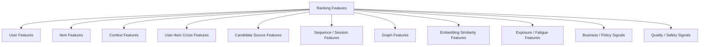
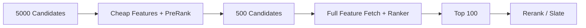
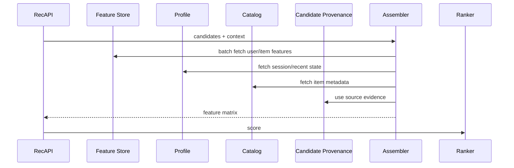

------
title: Build From Scratch Recommendations System - Part 035
description: Mendesain feature engineering untuk ranking production-grade: user, item, context, user-item cross, source, sequence, graph, embedding, freshness, leakage control, online-offline parity, feature logging, dan monitoring.
series: learn-build-from-scratch-recommendations-system
seriesTitle: Build From Scratch: Enterprise Recommendations System
order: 35
partTitle: Feature Engineering for Ranking
tags:
  - recommendation-system
  - recsys
  - ranking
  - feature-engineering
  - feature-store
  - mlops
  - series
date: 2026-07-02
---

# Part 035 — Feature Engineering for Ranking

Ranking model hanya sekuat feature yang ia lihat.

Candidate generation membawa ratusan atau ribuan kandidat. Ranking layer harus memutuskan kandidat mana yang paling berguna untuk request tertentu. Keputusan itu membutuhkan feature yang menangkap:

- siapa user/actor,
- apa item/action/document,
- konteks request,
- hubungan user dan item,
- asal kandidat,
- kualitas item,
- freshness,
- riwayat exposure,
- sinyal graph,
- sinyal embedding,
- sinyal negative feedback,
- policy/business constraints,
- dan confidence dari setiap sinyal.

Feature engineering untuk ranking bukan sekadar menambah kolom sebanyak mungkin. Feature harus production-safe: jelas makna, point-in-time, tersedia online, fresh, terukur, dan tidak bocor label.

Part ini membahas desain feature engineering ranking production-grade.

---

## 1. Mental Model: Ranking Feature = Evidence for Utility

Ranking feature adalah evidence yang membantu model memperkirakan utility kandidat.

```text
feature = evidence about expected usefulness of candidate in this context
```

Contoh:

```text
user_category_affinity_30d = evidence user tertarik pada category item
item_quality_score = evidence item layak ditampilkan
user_has_seen_item_7d = evidence fatigue/repetition risk
two_tower_score = evidence retrieval relevance
cart_item_compatibility = evidence complement relevance
case_state_action_validity = hard eligibility, not soft feature
```

Feature yang baik menjawab pertanyaan eksplisit.

Feature yang buruk hanya angka tanpa semantic.

---

## 2. Ranking Feature Taxonomy



Setiap kelompok punya freshness, cost, dan leakage risk berbeda.

---

## 3. User Features

User features menjelaskan preference dan state user.

Examples:

```text
user_lifetime_click_count
user_click_count_7d
user_purchase_count_90d
user_category_affinity_30d
user_brand_affinity_90d
user_creator_affinity_30d
user_price_bucket_preference
user_language_preference
user_negative_topic_count_90d
user_lifecycle_stage
user_subscription_tier
user_personalization_consent
```

Important:

- separate long-term and short-term,
- avoid sensitive/forbidden attributes unless explicitly governed,
- do not leak future behavior,
- handle missing for new users.

For anonymous/no-consent users, many user features are unavailable. Ranker must receive missing indicators or use non-personalized feature set.

---

## 4. Item Features

Item features menjelaskan item itself.

Examples:

```text
item_category_id
item_brand_or_creator_id
item_age_hours
item_price_bucket
item_quality_score
item_popularity_ctr_7d
item_popularity_cvr_30d
item_rating_avg
item_review_count
item_return_rate_30d
item_report_rate_7d
item_availability_confidence
item_metadata_quality_score
item_text_embedding_norm
item_content_language
item_policy_state
```

Item features can be static, batch, nearline, or request-time.

Important distinction:

```text
policy_state is often hard filter, not ranking feature
availability can be hard filter or feature depending surface
```

Do not let ranker decide to show banned items.

---

## 5. Context Features

Context features describe current request.

Examples:

```text
surface
placement
device_type
local_hour
day_of_week
region
locale
network_type
page_index
query_present
query_intent
seed_item_type
cart_size
cart_total_bucket
session_depth
privacy_mode
experiment_variant
```

Context tells model how to interpret other features.

Example:

```text
item_popularity_score
```

may matter differently on:

- homepage,
- PDP,
- checkout,
- search,
- enterprise case panel.

Surface/context feature is usually mandatory.

---

## 6. User-Item Cross Features

Cross features are often strongest for ranking.

They describe relationship between user and candidate.

Examples:

```text
user_item_category_affinity
user_item_brand_affinity
user_item_creator_affinity
user_item_price_fit
user_item_language_match
user_item_embedding_dot
user_item_content_similarity
user_has_seen_item_7d
user_has_purchased_item
user_has_hidden_creator
user_category_negative_signal_30d
user_item_geo_distance
user_role_item_permission_relation
```

Cross features are expensive because they are per candidate.

If request has 1000 candidates and 100 cross features, you may compute 100,000 values per request.

Optimize carefully.

---

## 7. Candidate Source Features

Candidate provenance is powerful.

Features:

```text
has_source_two_tower
has_source_item_cf
has_source_content_based
has_source_trending
has_source_editorial
has_source_exploration
source_count
best_source_rank
two_tower_score
two_tower_rank
item_cf_similarity
content_similarity
graph_ppr_score
popularity_score
trending_score
editorial_priority
exploration_propensity
```

Candidate source features help ranker learn source reliability by context.

A candidate appearing in multiple independent sources may deserve higher confidence.

But be careful: model may overfit old candidate source behavior. When source changes, ranker may need retraining.

---

## 8. Source Score Normalization Features

Source scores have different meanings.

Instead of raw only, provide:

```text
source_score_raw
source_score_percentile_within_source
source_rank
source_rank_log_inverse
source_score_zscore_within_request
```

Rank-based features are often more stable.

Example:

```text
two_tower_rank_inverse = 1 / log(2 + rank)
```

This helps model use retrieval ordering without assuming score calibration.

---

## 9. Exposure and Fatigue Features

Ranking must know what user has already seen.

Features:

```text
user_item_impression_count_1d
user_item_impression_count_7d
time_since_last_impression
user_creator_impression_count_7d
user_category_impression_count_1d
user_item_click_count_after_impressions
consecutive_no_click_impressions
item_global_exposure_count_1h
```

Use cases:

- reduce repetition,
- frequency cap,
- fatigue modeling,
- exploration control,
- fairness exposure.

Hard frequency cap may happen in reranker. But ranker can learn fatigue signals too.

---

## 10. Negative Feedback Features

Negative feedback should influence ranking.

Examples:

```text
user_hidden_item
user_hidden_creator
user_not_interested_category_count
user_disliked_topic_score
item_report_rate_7d
creator_block_rate
seller_complaint_rate
return_rate
refund_rate
case_action_rework_rate
```

Hard suppress explicit hides/blocks if policy says so.

Other negative patterns can be rank features.

Do not treat safety report merely as preference. It may require policy workflow.

---

## 11. Freshness Features

Freshness can mean:

```text
item_age
content_updated_age
stock_updated_age
embedding_age
feature_age
candidate_source_age
trending_score_age
policy_version_age
```

Examples:

```text
item_age_hours
time_since_item_published
time_since_price_update
candidate_generated_age_ms
user_profile_age_minutes
```

Freshness can be positive for news/new arrivals, negative for stale content.

Feature should be interpreted with surface/domain context.

---

## 12. Quality Features

Quality protects user trust.

Examples:

```text
item_quality_score
metadata_quality_score
creator_quality_score
seller_quality_score
document_quality_score
article_helpfulness_score
return_rate
complaint_rate
low_report_rate
content_completeness
expert_verified
policy_approved_by_human
```

Quality signals can be:

- hard gate,
- ranking feature,
- reranking constraint.

For high-stakes enterprise, quality/verification may be hard requirement.

---

## 13. Business Features

Business features may include:

```text
margin_bucket
inventory_pressure
promotion_active
campaign_priority
sponsored_bid
seller_tier
contractual_priority
clearance_flag
strategic_category
```

Use transparent governance.

Do not let business features destroy user relevance or safety.

If candidate is sponsored/promoted, provenance and disclosure should be explicit.

Business features should be part of utility composition or policy layer, not hidden manipulation.

---

## 14. Graph Features

Graph-derived ranking features:

```text
personalized_pagerank_score
user_item_graph_distance
common_neighbor_count
user_topic_graph_affinity
item_community_id
same_community_user_item
case_article_path_score
action_validity_path_score
creator_centrality
seller_trust_graph_score
```

Graph features can capture multi-hop relations.

Need:

- graph version,
- temporal cutoff,
- tenant safety,
- high-degree normalization.

Graph feature leakage is common if graph includes future edges.

---

## 15. Embedding Similarity Features

Examples:

```text
two_tower_dot_product
user_item_content_cosine
session_item_embedding_similarity
query_item_semantic_similarity
case_article_embedding_similarity
item_seed_embedding_similarity
user_negative_profile_similarity
```

Embedding similarity features are compact and powerful.

But track:

- embedding version,
- score type,
- normalization,
- compatibility.

Do not compare incompatible embeddings.

---

## 16. Sequence Features

Sequence features capture order and recency.

Examples:

```text
last_clicked_category_id
last_5_item_ids
last_5_category_ids
time_since_last_click
session_event_count
session_category_entropy
candidate_matches_last_query
candidate_matches_recent_sequence
sequence_model_score
```

Sequence features can be:

- hand-engineered,
- output of session model,
- attention/transformer embedding,
- recency-weighted aggregates.

For tabular rankers, summarize sequence with features.

For deep rankers, feed sequence directly.

---

## 17. Contextual Cross Features

Some features combine item with context, not user.

Examples:

```text
item_available_in_region
item_language_matches_locale
item_price_currency_matches_region
item_surface_historical_ctr
item_device_type_ctr
category_surface_ctr
creator_surface_ctr
action_valid_for_case_state
document_valid_for_jurisdiction
```

These are extremely useful.

A video may perform well on mobile but not desktop.  
An action may be useful only in a certain workflow state.

---

## 18. Feature Freshness Categories

Classify each feature:

```text
static
batch
nearline
real-time
request-time
```

Example:

| Feature | Freshness |
|---|---|
| item_category | static-ish |
| item_quality_score | batch |
| item_trending_score_15m | nearline |
| session_depth | real-time |
| current_cart_total | request-time |
| permission_check | request-time |
| user_long_term_affinity | batch/nearline |

Feature store/design should respect this.

Do not fetch request-time features from stale batch store.

---

## 19. Point-in-Time Safety

Every training feature must be computed as-of prediction time.

Bad:

```text
join item_ctr_7d computed after the label window
```

Good:

```text
item_ctr_7d as of impression_time
```

For each feature:

```text
feature_timestamp <= prediction_time
```

Also:

```text
feature data window ends before prediction_time
```

Point-in-time correctness is non-negotiable.

---

## 20. Leakage Patterns in Ranking Features

Common leaks:

```text
future purchase count
future item popularity
label-derived feature
current rank position from production ranker
post-click dwell features
post-conversion item state
future catalog category
future user identity merge
future policy state
```

Example:

```text
item_purchase_count_7d
```

If computed from 7 days after impression, it leaks target.

Feature contract must state time window.

---

## 21. Online Availability

Feature used in ranker must be available online within latency budget.

Questions:

```text
Can this feature be fetched at request time?
Is it in online store?
Is it fresh enough?
What happens if missing?
How much latency/cost per candidate?
```

A feature only available in notebook should not enter production model.

Training-serving skew often starts with offline-only feature.

---

## 22. Feature Cost

Ranking feature cost matters.

Cost dimensions:

- compute CPU,
- network call,
- storage,
- latency,
- memory,
- cardinality,
- dependency risk.

Per-candidate expensive features can dominate.

Example:

```text
1000 candidates * remote call per candidate = disaster
```

Use:

- batch fetch,
- precompute,
- cache,
- candidate pruning,
- staged ranking,
- feature groups by stage.

---

## 23. Staged Feature Fetch

Not all candidates need all features.

### Stage 1: Lightweight Pre-Ranking

Use cheap features to reduce 5000 candidates to 500.

### Stage 2: Full Ranking

Use expensive cross/sequence features.

### Stage 3: Reranking

Use slate-level constraints.

Feature design should match serving stage.



---

## 24. Missing Values

Missing values are semantic.

`null` can mean:

- new user,
- feature pipeline failure,
- no history,
- no consent,
- timeout,
- entity missing,
- stale feature,
- not applicable.

Use missing indicators:

```text
user_category_affinity_value
user_category_affinity_is_missing
user_category_affinity_missing_reason
```

Do not silently fill all nulls with zero.

---

## 25. Defaults

Default policy examples:

```yaml
user_category_affinity:
  no_history: 0
  no_consent: null_with_missing_reason
  timeout: fallback_to_cached_or_missing
item_quality_score:
  missing: category_prior_quality
```

Model should distinguish:

```text
zero because truly zero
vs
zero because unknown
```

---

## 26. Feature Transformations

Common transformations:

```text
log1p(count)
bucketize(price)
cap(outliers)
normalize by category
recency decay
z-score within segment
percentile rank
boolean flags
embedding normalization
```

Transform must be same training and serving.

Put transformation in feature contract or shared code.

---

## 27. Feature Crosses

Cross features encode interactions.

Examples:

```text
user_top_category == item_category
user_price_bucket == item_price_bucket
query_language == item_language
region == item_available_region
case_state_action_validity
```

GBDTs can learn many crosses from raw features, but explicit crosses can help.

Deep models can learn crosses via embeddings/interaction layers.

For high-cardinality crosses, be careful with sparsity.

---

## 28. High-Cardinality Categorical Features

Examples:

```text
user_id
item_id
creator_id
seller_id
category_id
query_token
tenant_id
```

Options:

- embeddings,
- hashing,
- target encoding with leakage control,
- frequency thresholds,
- grouping,
- use source scores instead of raw ID.

For GBDT, high-cardinality ID features can overfit.

For neural ranker, embeddings are common.

Be careful with rare categories and cold-start.

---

## 29. Target Encoding

Target encoding:

```text
category_ctr
creator_cvr
seller_return_rate
```

Useful, but leakage-prone.

Must be computed point-in-time.

Use smoothing:

```text
encoded_ctr =
  (clicks + global_ctr * prior_weight)
  / (impressions + prior_weight)
```

Do not compute using full dataset including validation/test future.

---

## 30. Feature Logging

To train and debug ranker, log features or snapshot references.

Options:

- log full feature vector for final slate,
- log sampled candidate feature vectors,
- log feature store version and snapshot IDs,
- log source feature values,
- log missing/staleness indicators.

Feature logging enables:

- training dataset reconstruction,
- online/offline parity checks,
- debugging bad recommendations,
- drift monitoring.

---

## 31. Online-Offline Parity Tests

Compare online feature values with offline recomputation.

Process:

1. sample online requests,
2. log feature snapshot,
3. recompute offline as-of request time,
4. compare values.

Metrics:

```text
exact match rate for categorical
absolute/relative difference for numeric
missing mismatch rate
staleness mismatch
```

Alert on parity drift.

---

## 32. Feature Monitoring

Monitor:

```text
null rate
default rate
staleness
distribution
outliers
cardinality
top values
online-offline parity
feature importance shift
correlation with label
segment coverage
```

By:

- surface,
- model version,
- feature version,
- segment,
- source.

Feature drift can silently degrade ranker.

---

## 33. Feature Importance and Debugging

Model feature importance can help but be careful.

For GBDT:

- split gain,
- permutation importance,
- SHAP-like analysis.

For neural:

- ablation,
- integrated gradients,
- attention inspection if meaningful.

Use feature importance to detect:

- model overuses source rank,
- leakage feature dominates,
- business feature overwhelms relevance,
- missing indicator overused,
- cold-start feature ignored.

---

## 34. Feature Governance

Every production feature needs:

```text
owner
definition
source
timestamp semantics
freshness SLA
null policy
privacy classification
version
monitoring
deprecation plan
```

Feature registry should track model dependencies.

Do not delete/change feature without checking models using it.

---

## 35. Privacy and Sensitive Features

Some features are sensitive or regulated.

Examples:

- precise location,
- health/finance/legal interest,
- protected attributes,
- inferred sensitive topics,
- tenant-confidential behavior,
- child profile,
- personal identifiers.

Principles:

- minimize,
- purpose-limit,
- consent-check,
- aggregate where possible,
- avoid direct sensitive attributes unless explicitly allowed,
- monitor proxy risks,
- document.

For enterprise, tenant and role-based data must not leak.

---

## 36. Fairness and Marketplace Health Features

Feature engineering affects exposure.

Useful features:

```text
creator_exposure_7d
seller_exposure_share
category_exposure_share
new_item_exposure_count
long_tail_bucket
item_popularity_bucket
creator_quality_adjusted_exposure
```

These may be used by reranking more than ranker.

Do not blindly optimize historical popularity if marketplace health matters.

---

## 37. Enterprise Ranking Features

For enterprise recommendations:

User/actor:

```text
role
team
permission set
experience level
```

Case/context:

```text
case_state
risk_level
jurisdiction
SLA remaining
entity types
evidence completeness
```

Action/document:

```text
action_type
policy_required
historical_success_rate
rework_rate
expert_verified
article_validity
```

Cross:

```text
role_action_permission
case_state_action_validity
case_topic_article_match
jurisdiction_policy_match
```

Hard validity still belongs to eligibility.

Ranking chooses among valid actions/documents.

---

## 38. Feature Set Versioning

Ranker model should reference feature set version.

```yaml
feature_set: home_ranker_features_v12
features:
  - user_category_affinity_30d:v3
  - item_quality_score:v2
  - two_tower_score:v5
  - user_item_seen_count_7d:v1
```

Model registry:

```text
model -> feature set -> feature versions -> data sources
```

Without this, model cannot be reproduced.

---

## 39. Feature Deprecation

Deprecate safely:

1. mark feature deprecated,
2. stop adding to new models,
3. verify no production model uses it,
4. remove serving fetch,
5. remove materialization,
6. archive metadata.

Do not remove online feature because it “looks unused” without dependency check.

---

## 40. Feature Store Integration

Ranking feature store should support:

- batch/offline feature retrieval,
- online feature serving,
- point-in-time joins,
- freshness metadata,
- feature registry,
- monitoring,
- access controls.

But not every request-time feature belongs in feature store. Some are assembled in Rec API.

Classify:

```text
stored feature
request-derived feature
model-output feature
source-provenance feature
```

---

## 41. Feature Assembly Service

Ranking path often has feature assembly.



Assembler must be optimized and observable.

---

## 42. Feature Matrix Shape

For ranking request:

```text
group features: one per request
candidate features: one per candidate
cross features: one per candidate
source features: one per candidate/source
```

Feature matrix:

```text
num_candidates x num_features
```

Need memory control.

If candidate count 5000 and feature count 1000, matrix can be heavy.

Use pre-ranking or feature pruning.

---

## 43. Common Anti-Patterns

### 43.1 Offline-Only Feature

Model cannot serve.

### 43.2 Future Leakage Feature

Offline metric inflated.

### 43.3 No Missing Reason

Model confuses unknown with zero.

### 43.4 No Feature Owner

Broken feature persists.

### 43.5 Too Many Expensive Cross Features

Latency explodes.

### 43.6 Source Score Used Without Score Type

Misinterpreted.

### 43.7 Policy as Soft Feature

Unsafe.

### 43.8 No Feature Logging

Cannot train/debug.

### 43.9 High-Cardinality ID Overfit

Offline strong, online poor.

### 43.10 No Drift Monitoring

Model degrades silently.

---

## 44. Minimal Production Ranking Feature Set

Start with:

### User

```text
user_click_count_30d
user_purchase_count_90d
user_category_affinity_30d
user_price_bucket_preference
user_lifecycle_stage
```

### Item

```text
item_category
item_age_hours
item_quality_score
item_popularity_ctr_7d
item_popularity_cvr_30d
item_price_bucket
item_availability_state
```

### Context

```text
surface
device_type
region
local_hour
session_depth
privacy_mode
```

### Cross

```text
user_item_category_match
user_item_price_fit
user_has_seen_item_7d
user_has_purchased_item
user_item_embedding_similarity
```

### Source

```text
source_flags
source_count
source_rank_inverse
two_tower_score
content_similarity
item_cf_similarity
popularity_score
```

### Negative/Fatigue

```text
time_since_last_impression
impression_count_7d
hide_creator_flag
category_negative_signal
```

This is enough for a strong first ranker.

---

## 45. Checklist Feature Engineering for Ranking

```text
[ ] Feature taxonomy is defined.
[ ] Every feature has contract and owner.
[ ] Feature timestamp semantics are explicit.
[ ] Point-in-time safety is verified.
[ ] Online availability is verified.
[ ] Freshness SLA is defined.
[ ] Missing/default policy is explicit.
[ ] Feature cost/latency is reviewed.
[ ] Candidate source features are included.
[ ] Cross features are bounded and batch-computed.
[ ] Exposure/fatigue features exist.
[ ] Negative feedback features exist.
[ ] Policy/access hard constraints are not soft features.
[ ] Feature logging exists.
[ ] Online-offline parity checks exist.
[ ] Feature drift monitoring exists.
[ ] Privacy classification exists.
[ ] Feature set version is tracked in model registry.
```

---

## 46. Kesimpulan

Feature engineering untuk ranking adalah engineering discipline, bukan notebook experimentation saja.

Prinsip utama:

1. Feature adalah evidence for utility.
2. User, item, context, cross, source, sequence, graph, and embedding features all matter.
3. Cross/source/exposure features are often extremely valuable.
4. Every feature must be point-in-time safe.
5. Online availability and latency cost are as important as offline predictive power.
6. Missing values need semantic reason.
7. Feature logging and parity checks are mandatory.
8. Policy/access constraints should be hard filters, not ranker features.
9. Feature versioning and ownership prevent production entropy.
10. Strong features plus simple model often beat weak features plus complex model.

Di Part 036, kita akan membahas **Gradient Boosted Rankers**: mengapa GBDT/LambdaMART sangat kuat untuk ranking tabular, bagaimana melatihnya, menyajikannya, memonitor, dan menghindari failure modes.
