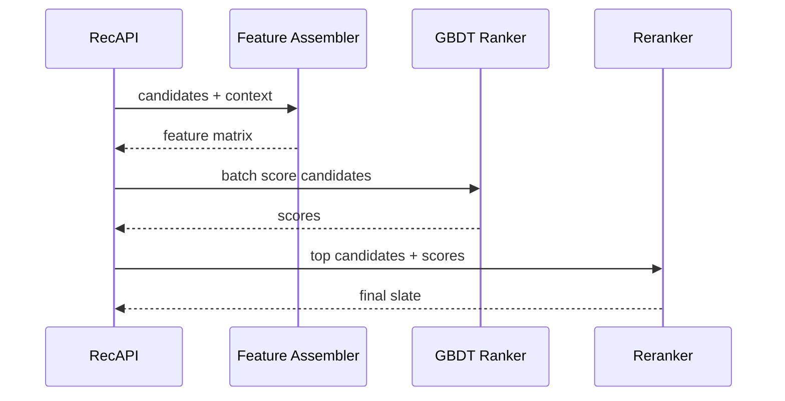
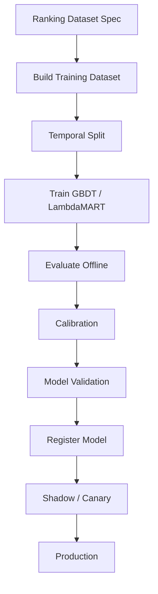

------
title: Build From Scratch Recommendations System - Part 036
description: Membangun gradient boosted rankers production-grade: GBDT, LambdaMART, pointwise/pairwise/listwise training, feature handling, calibration, serving latency, model size, interpretability, monitoring, dan operational trade-offs.
series: learn-build-from-scratch-recommendations-system
seriesTitle: Build From Scratch: Enterprise Recommendations System
order: 36
partTitle: Gradient Boosted Rankers
tags:
  - recommendation-system
  - recsys
  - ranking
  - gbdt
  - lambdamart
  - learning-to-rank
  - series
date: 2026-07-02
---

# Part 036 — Gradient Boosted Rankers

Sebelum melompat ke deep ranking model, production recommendation system sering mendapatkan hasil luar biasa dari gradient boosted decision trees.

GBDT sangat kuat untuk feature tabular:

- user aggregates,
- item statistics,
- source scores,
- context features,
- cross features,
- freshness,
- exposure/fatigue,
- quality signals,
- business metrics.

Banyak ranking problem di recommendation systems berisi feature tabular yang kaya. Untuk kondisi seperti itu, GBDT/LambdaMART sering menjadi baseline yang sangat kuat, cepat dilatih, relatif mudah didebug, dan efisien untuk serving.

Part ini membahas gradient boosted rankers production-grade: mental model, pointwise GBDT, LambdaMART, feature handling, training data, hyperparameters, calibration, serving latency, model size, interpretability, monitoring, dan failure modes.

---

## 1. Mental Model: Many Small Trees Add Up

Gradient boosted trees membangun model sebagai jumlah banyak decision trees kecil.

```text
score(x) = tree_1(x) + tree_2(x) + ... + tree_N(x)
```

Setiap tree memperbaiki error model sebelumnya.

Decision tree membelah feature:

```text
if two_tower_score > 7.3:
  if item_quality_score > 0.8:
      leaf score = +0.12
  else:
      leaf score = -0.04
else:
  ...
```

GBDT menangkap non-linear interactions tanpa harus membuat semua cross feature manual.

---

## 2. Why GBDT Works Well for Ranking

GBDT kuat karena:

- handles numeric/tabular features well,
- learns non-linear thresholds,
- handles feature interactions,
- works with missing values if configured,
- needs less feature scaling,
- can train on large structured data,
- inference can be fast,
- feature importance/debugging easier than deep models,
- supports pointwise and LTR objectives in many libraries.

For recommendation ranking, many signals are tabular:

```text
source_rank
item_quality
user_affinity
seen_count
popularity_score
price_bucket
time_since_last_impression
```

GBDT is often hard to beat as first production ranker.

---

## 3. GBDT vs Neural Ranker

| Aspect | GBDT | Neural Ranker |
|---|---|---|
| Tabular features | excellent | good with tuning |
| Raw embeddings/sequences | limited | strong |
| Training complexity | lower | higher |
| Serving latency | predictable | can be higher |
| Debuggability | better | harder |
| Feature scaling | less needed | more needed |
| High-cardinality IDs | harder | embeddings natural |
| Multi-task | limited | natural |
| Online incremental | limited | possible but complex |

Use GBDT when tabular features dominate. Use neural when sequence/embedding/multimodal interactions dominate.

---

## 4. Pointwise GBDT Ranker

Simplest ranker:

```text
train GBDT classifier/regressor on candidate rows
label = clicked / purchased / utility
```

Example:

```text
features -> clicked_30m
```

Loss:

- binary log loss for click,
- regression loss for utility,
- logistic loss for conversion,
- custom objective if available.

Serving:

```text
score each candidate independently
sort by score
```

This is a strong baseline.

---

## 5. LambdaMART / Ranking GBDT

LambdaMART combines boosted trees with ranking objective.

It learns to improve ranking metrics like NDCG by considering candidate groups.

Inputs:

```text
group_id = request/query
candidates within group
relevance labels
features
```

Objective weights pairwise swaps by their NDCG impact.

Intuition:

```text
mistake at top of list matters more than mistake at bottom
```

LambdaMART is often strong for search and recommendation ranking.

---

## 6. When to Use Pointwise vs LambdaMART

Use pointwise when:

- you need calibrated probabilities,
- labels are binary/multi-task,
- group data incomplete,
- pipeline maturity early,
- utility composition uses probabilities.

Use LambdaMART/listwise GBDT when:

- group/request candidate sets are well logged,
- you optimize NDCG/top-K ordering,
- labels can be graded,
- calibration less critical,
- infra supports group training.

A common path:

```text
pointwise GBDT -> LambdaMART after group logging matures
```

---

## 7. Training Data Requirements

For pointwise:

```text
one row per candidate impression
features
label
weight
```

For LambdaMART:

```text
rows grouped by request_id/query_id
features
graded relevance label
group boundaries
```

Example:

| group_id | item_id | label | features |
|---|---|---:|---|
| req1 | A | 0 | ... |
| req1 | B | 2 | ... |
| req1 | C | 0 | ... |
| req2 | D | 1 | ... |
| req2 | E | 0 | ... |

Group sorting/partitioning must be preserved.

---

## 8. Relevance Labels for LambdaMART

Labels can be graded.

Example e-commerce:

```text
purchase = 4
add_to_cart = 3
click = 1
visible_no_click = 0
hide = -2
```

Some libraries expect non-negative labels. Then handle negatives separately:

```text
report/hide as separate model or filter/weight
```

Label design matters.

Do not make arbitrary label gains without product review.

---

## 9. Example Weighting

Weights can account for:

- label confidence,
- position propensity,
- event strength,
- sample probability,
- segment balance,
- business value,
- negative sampling.

Example:

```text
example_weight =
  label_confidence
  * inverse_sampling_probability
  * segment_weight
```

For GBDT, weights can strongly affect splits.

Be careful and version weighting policy.

---

## 10. Position Bias Handling

If training on displayed impressions:

- top positions get more clicks,
- lower positions get fewer clicks.

For pointwise GBDT:

- avoid using final logged position as serving feature unless it exists before ranking,
- use propensity weighting if available,
- train on exploration/randomized data when possible,
- log visibility.

For LambdaMART:

- pairwise/listwise objective still sees biased labels,
- position bias remains.

Bias handling is data problem, not model magic.

---

## 11. Feature Preparation for GBDT

GBDT handles many feature types but not everything naturally.

Good:

```text
numeric counts
scores
booleans
bucketed categorical IDs
target-encoded aggregates
missing indicators
rank features
```

Challenging:

```text
raw high-cardinality user_id/item_id
long sequences
raw text
high-dimensional embeddings
```

For embeddings, use:

- similarity scalar,
- projection,
- cluster ID,
- low-dimensional PCA,
- separate neural model output.

Do not feed hundreds/thousands of raw embedding dimensions blindly unless tested.

---

## 12. Categorical Features

GBDT libraries vary in categorical support.

Strategies:

- one-hot for low-cardinality,
- ordinal/category encoding if library supports categorical,
- hashing,
- target encoding with point-in-time safety,
- frequency encoding,
- learned embeddings converted to scalar similarities.

Examples:

```text
surface
device_type
region
category_id
price_bucket
source_flags
```

High-cardinality categorical features can overfit.

---

## 13. Missing Values in GBDT

GBDT can learn missing paths.

But missing semantics should still be explicit.

Features:

```text
user_category_affinity
user_category_affinity_missing_reason
```

If no history and feature pipeline failure both appear as missing, model cannot distinguish.

Use missing indicators/reasons.

---

## 14. Feature Scaling

GBDT usually does not require standardization like neural nets.

But transformations still help:

```text
log1p(counts)
cap outliers
bucketize heavy-tailed values
use percentiles
smooth rates
```

Example:

```text
raw_click_count_30d
```

can have long tail. Use:

```text
log1p_click_count_30d
```

---

## 15. Rate Features and Smoothing

Features like CTR/CVR should be smoothed.

Bad:

```text
item_ctr = clicks / impressions
```

For small impressions, unstable.

Better:

```text
item_ctr_smoothed =
  (clicks + prior_ctr * prior_weight)
  / (impressions + prior_weight)
```

Also include support:

```text
item_impression_count_7d
```

Model can learn confidence.

---

## 16. Hyperparameters

Important GBDT hyperparameters:

```text
num_trees / iterations
learning_rate
max_depth / num_leaves
min_data_in_leaf
subsample
feature_fraction
l2_regularization
early_stopping
```

Trade-offs:

- more trees = more capacity, more latency,
- deeper trees = interactions, overfit risk,
- smaller learning rate = more stable, more trees,
- min leaf controls overfitting rare patterns.

Tune with temporal validation.

---

## 17. Overfitting

GBDT can overfit:

- high-cardinality IDs,
- leakage features,
- rare categories,
- target-encoded features without proper cutoff,
- training period artifacts,
- source version artifacts,
- small segments.

Mitigate:

- temporal split,
- regularization,
- min leaf,
- feature review,
- leakage tests,
- segment validation,
- drop suspicious features,
- monitor train/validation gap.

---

## 18. Temporal Validation

Random split can overestimate.

Use temporal split:

```text
train: older period
validation: later period
test: most recent held-out
```

Ranking model must predict future behavior from past data.

Also evaluate by:

- surface,
- source,
- user tenure,
- item age,
- popularity bucket,
- category,
- region.

---

## 19. Offline Metrics for GBDT Ranker

Pointwise:

```text
log loss
AUC
PR-AUC
calibration
grouped NDCG@K
Precision@K
```

LambdaMART:

```text
NDCG@K
MAP
MRR
Precision@K
```

Always include guardrails:

```text
hide/report
coverage
diversity
latency
source distribution
business constraints
```

Do not choose model by one global metric.

---

## 20. Feature Importance

GBDT gives feature importance.

Types:

- split count,
- gain,
- permutation importance,
- SHAP-like contribution.

Use for:

- debugging,
- detecting leakage,
- understanding source reliance,
- feature pruning,
- explaining model behavior internally.

If top feature is suspicious:

```text
future_purchase_count
logged_position
label_proxy
```

investigate immediately.

---

## 21. SHAP / Local Explanation

Tree contribution analysis can show why candidate scored high.

Example:

```text
+0.23 two_tower_score high
+0.12 user_category_affinity high
+0.08 item_quality_score high
-0.10 seen_count_7d high
```

Useful for:

- debugging,
- model review,
- enterprise audit,
- feature validation.

Do not expose internal numeric explanation directly to users without translation.

---

## 22. Calibration

GBDT classifier output may need calibration.

Methods:

- Platt scaling,
- isotonic regression,
- temperature-like scaling,
- segment calibration.

Calibration matters if:

```text
score = P(purchase) * margin
```

or threshold decisions.

For pure ranking order, less critical but still useful for multi-objective composition.

Evaluate calibration by segment.

---

## 23. Multi-Objective with GBDT

Options:

### Separate Models

```text
click_model
purchase_model
hide_model
report_model
```

Compose utility.

Pros:

- calibration per task,
- simpler labels.

Cons:

- multiple inference calls,
- consistency.

### Multi-output if supported

Some tooling supports limited multi-target.

### Utility Label

Single target with weighted labels.

Pros:

- simple serving.

Cons:

- less semantic, harder tuning.

Production often uses separate models or pointwise multi-task neural model for many tasks. For GBDT, separate models are common.

---

## 24. GBDT + Neural Hybrid

Use neural/embedding models as feature producers:

```text
two_tower_score
content_similarity
sequence_model_score
deep_ranker_score
graph_embedding_similarity
```

GBDT combines them with tabular features.

This is powerful:

- neural handles representation,
- GBDT handles tabular/nonlinear business logic.

GBDT can be a meta-ranker.

---

## 25. Serving Architecture



GBDT inference should be batched over candidates.

Avoid per-candidate remote calls.

---

## 26. Latency and Model Size

GBDT inference cost roughly depends on:

```text
num_candidates * num_trees * tree_depth
```

Large model + many candidates can be slow.

Control:

- candidate pre-ranking,
- smaller model,
- shallower trees,
- feature pruning,
- batch scoring,
- compiled/runtime optimized inference,
- model distillation,
- two-stage ranking.

Example:

```text
5000 candidates * 2000 trees = expensive
500 candidates * 500 trees = manageable
```

---

## 27. Two-Stage GBDT Ranking

Stage 1:

```text
cheap GBDT / simple model
5000 -> 500 candidates
```

Stage 2:

```text
full GBDT with expensive features
500 -> 100
```

Then rerank final slate.

This controls latency while preserving recall.

---

## 28. Model Export and Serving

GBDT model needs production format.

Requirements:

- immutable model artifact,
- model version,
- feature schema version,
- inference runtime compatibility,
- checksum,
- rollback,
- shadow/canary,
- performance benchmark.

Feature order must match exactly.

Schema mismatch can silently corrupt predictions.

Use feature name-based mapping if possible.

---

## 29. Feature Schema Validation

Before scoring:

```text
all required features present
types correct
categorical values encoded
missing policy applied
feature version compatible
```

If feature missing:

- use default with missing indicator,
- fallback model,
- skip source,
- fail depending severity.

Never shift feature columns accidentally.

---

## 30. Shadow Testing

Before deploy:

- score live traffic in shadow,
- compare score distribution,
- compare top-K overlap,
- compare latency,
- compare feature missing rates,
- compare source distribution,
- inspect extreme predictions.

Shadow model does not affect users.

If distribution drastically shifts, investigate.

---

## 31. Canary Rollout

Gradual traffic:

```text
1% -> 5% -> 25% -> 50% -> 100%
```

Monitor:

- primary metric,
- guardrails,
- latency,
- error rate,
- feature missing,
- score distribution,
- source contribution.

Rollback quickly if guardrails fail.

---

## 32. Model Monitoring

Online:

```text
prediction score distribution
feature missing rates
feature drift
latency
model error rate
top feature contribution drift
source contribution
final slate distribution
click/conversion/hide/report
```

By segment:

- surface,
- region,
- category,
- user tenure,
- item age,
- source,
- experiment.

Model can degrade in one segment while global metric stable.

---

## 33. Data Drift

GBDT can be sensitive to feature distribution shifts.

Causes:

- new candidate source,
- UI change,
- event tracking change,
- catalog change,
- seasonality,
- region launch,
- policy change.

Monitor:

```text
population stability index
feature distribution
score distribution
calibration drift
label rate drift
```

Retrain or recalibrate when drift significant.

---

## 34. Handling New Candidate Sources

New source introduces new source features.

If existing ranker never saw source:

- source flags are unseen,
- source score distribution unknown,
- candidates may be under-ranked.

Options:

- shadow log source,
- retrain ranker with source candidates,
- use conservative source prior,
- allow exploration quota,
- separate source-specific calibration.

Do not expect old ranker to understand new source automatically.

---

## 35. Cold-Start Handling

GBDT can suppress cold items if features look weak.

Add features:

```text
is_new_item
item_age
metadata_quality
category_prior
creator_prior
source_exploration
embedding_available
item_interaction_count
```

Use exploration data to train.

Without cold-start features, model confuses “no history” with “bad”.

---

## 36. Enterprise Use

GBDT ranker is good for enterprise tabular features:

```text
case_state
risk_level
role
action_type
policy_required
historical_success_rate
rework_rate
article_helpfulness
SLA_remaining
```

Benefits:

- interpretable-ish,
- controllable,
- auditable,
- works with smaller data if features strong.

Keep hard constraints outside model.

Use feature contribution for internal explanation.

---

## 37. Safety and Policy

GBDT should not decide hard safety.

Before GBDT:

```text
eligibility filters remove invalid candidates
```

GBDT can rank among safe candidates using quality/risk features.

For safety-sensitive soft signals:

```text
low_trust_score
complaint_rate
metadata_quality
```

can reduce score.

But banned/unauthorized must be filtered.

---

## 38. Debugging Bad Ranking

Questions:

```text
Was candidate eligible?
Was feature vector correct?
Were source scores present?
Did model overvalue popularity?
Did missing value path cause issue?
Is candidate cold-start?
Is feature drift present?
Did reranker alter order?
Is model version correct?
```

Debug output:

```text
candidate score
top feature contributions
feature values
source evidence
missing indicators
rank before/after rerank
```

GBDT is good for this.

---

## 39. Common Failure Modes

### 39.1 Leakage Feature Dominates

Offline metric great, online fails.

### 39.2 Source Rank Overfit

Model reproduces old ranker.

### 39.3 High-Cardinality Overfit

Rare IDs memorized.

### 39.4 Calibration Poor

Utility composition wrong.

### 39.5 Model Too Large

Latency exceeds budget.

### 39.6 Feature Schema Mismatch

Scores nonsense.

### 39.7 Cold Items Suppressed

New catalog gets no exposure.

### 39.8 Missing Values Misinterpreted

No history equals bad pipeline.

### 39.9 Global Metric Hides Segment Regression

One region/category suffers.

### 39.10 No Guardrail Monitoring

Click improves, trust/safety worsens.

---

## 40. Implementation Sketch: Ranker Interface

```java
public interface RankingModel {
    RankingModelMetadata metadata();

    List<ScoredCandidate> scoreBatch(RankingFeatureMatrix featureMatrix);
}
```

Metadata:

```java
public record RankingModelMetadata(
    String modelName,
    String modelVersion,
    String featureSetVersion,
    String objective,
    Instant trainedAt,
    String trainingDatasetVersion
) {}
```

Scored candidate:

```java
public record ScoredCandidate(
    String itemId,
    double modelScore,
    Map<String, Double> taskScores,
    Map<String, Double> debugContributions
) {}
```

---

## 41. Implementation Sketch: Feature Schema Check

```java
public final class FeatureSchemaValidator {
    public void validate(FeatureVector vector, FeatureSchema schema) {
        for (FeatureDefinition feature : schema.requiredFeatures()) {
            if (!vector.contains(feature.name())) {
                throw new MissingFeatureException(feature.name());
            }

            if (!feature.type().matches(vector.get(feature.name()))) {
                throw new FeatureTypeMismatchException(feature.name());
            }
        }
    }
}
```

In high-QPS serving, validation may be optimized but should exist in shadow/canary and CI.

---

## 42. Training Pipeline Sketch



Model registry should link:

- dataset version,
- feature set version,
- label version,
- objective,
- hyperparameters,
- metrics.

---

## 43. Hyperparameter Tuning Strategy

Tune in stages:

1. establish strong default,
2. tune number of leaves/depth,
3. tune learning rate/trees,
4. tune min data in leaf,
5. tune regularization/subsampling,
6. evaluate latency,
7. validate by segment.

Do not optimize only offline metric. Include serving cost.

---

## 44. Feature Pruning

Remove features that are:

- unused,
- expensive,
- unstable,
- leakage-prone,
- high drift,
- privacy risky,
- redundant.

Feature pruning improves:

- latency,
- robustness,
- interpretability,
- maintenance.

But validate impact by segment.

---

## 45. Minimal Production GBDT Ranker Plan

```yaml
model_type: pointwise_gbdt
objective: binary_logloss_click
secondary_models:
  - purchase
  - hide
features:
  - user aggregates
  - item aggregates
  - context
  - user-item crosses
  - source scores/ranks
  - exposure/fatigue
split: temporal
evaluation:
  - grouped_ndcg_at_20
  - log_loss
  - calibration
  - hide_report_guardrails
serving:
  max_candidates_full_rank: 500
  pre_rank_if_candidates_gt: 2000
  feature_schema_validation: true
  shadow_before_prod: true
monitoring:
  - score_distribution
  - feature_missing
  - latency
  - source_contribution
  - segment_metrics
```

After stable, evaluate LambdaMART.

---

## 46. Checklist Gradient Boosted Ranker Readiness

```text
[ ] Ranking dataset is point-in-time safe.
[ ] Group IDs are preserved if using LambdaMART.
[ ] Feature schema/version is fixed.
[ ] Feature missing policy is explicit.
[ ] Temporal validation is used.
[ ] Leakage checks are run.
[ ] Hyperparameters are tuned with latency in mind.
[ ] Offline metrics include grouped ranking metrics.
[ ] Calibration is evaluated if probability used.
[ ] Feature importance is reviewed.
[ ] Model artifact is versioned.
[ ] Feature schema validation exists.
[ ] Batch scoring is optimized.
[ ] Shadow testing is performed.
[ ] Canary rollout plan exists.
[ ] Online monitoring includes score/feature/source/latency.
[ ] Guardrail metrics are monitored.
[ ] Rollback path exists.
```

---

## 47. Kesimpulan

Gradient boosted rankers adalah workhorse yang sangat kuat untuk recommendation ranking production-grade.

Prinsip utama:

1. GBDT is excellent for tabular ranking features.
2. Pointwise GBDT is a strong first production ranker.
3. LambdaMART is powerful when grouped LTR data is mature.
4. Feature quality matters more than model complexity.
5. GBDT can overfit leakage, IDs, and old source behavior.
6. Model size and candidate count directly affect latency.
7. Calibration is needed for utility composition.
8. Feature schema/version validation prevents silent disasters.
9. Shadow/canary and segment monitoring are mandatory.
10. GBDT often remains useful even when deep models are added, as baseline, meta-ranker, or interpretable ranker.

Di Part 037, kita akan membahas **Deep Ranking Models**: kapan neural/deep rankers layak digunakan, bagaimana input embedding/sequence/cross features disusun, dan bagaimana mengoperasikannya tanpa kehilangan debuggability.
