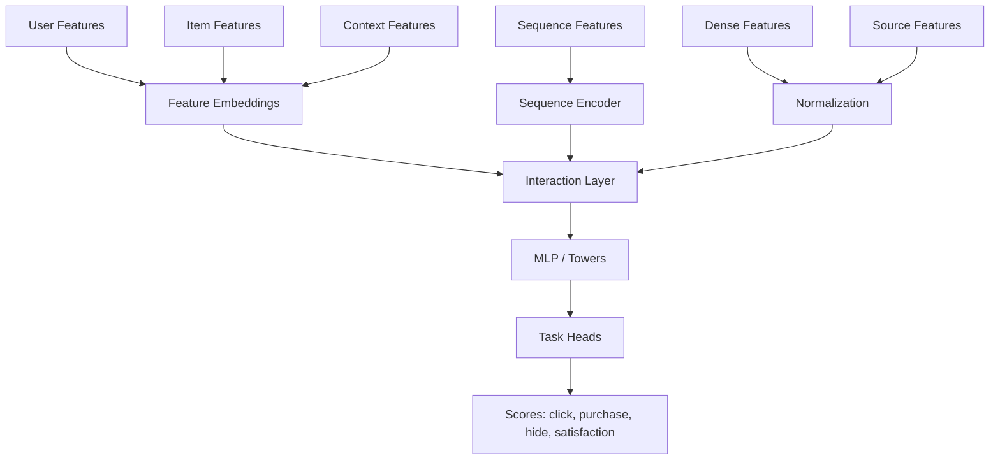
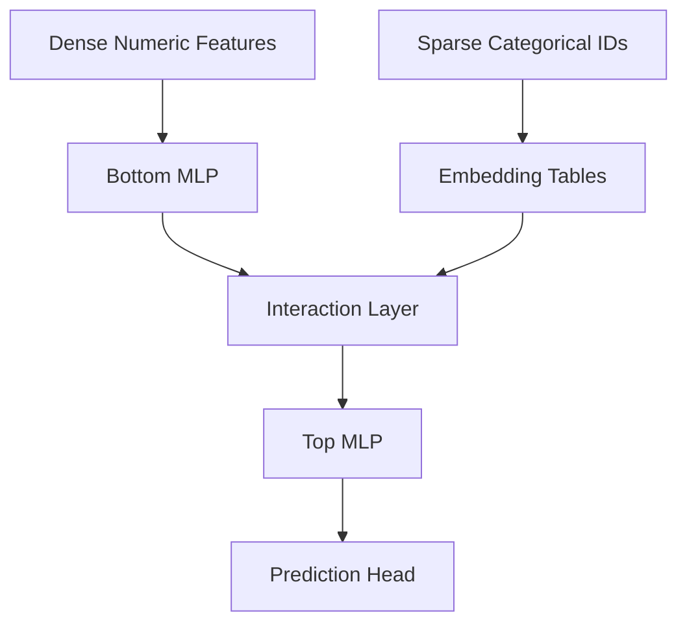
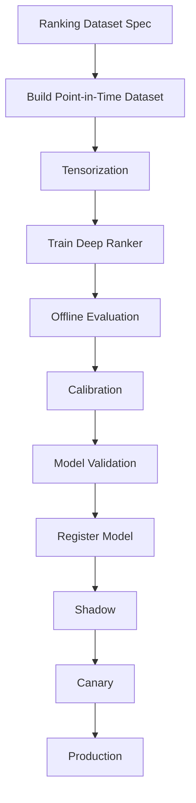

------
title: Build From Scratch Recommendations System - Part 037
description: Membangun deep ranking models production-grade: neural ranker, embeddings, feature interaction, multi-task learning, wide & deep, DLRM-style architecture, calibration, latency, observability, explainability, dan operational trade-offs.
series: learn-build-from-scratch-recommendations-system
seriesTitle: Build From Scratch: Enterprise Recommendations System
order: 37
partTitle: Deep Ranking Models
tags:
  - recommendation-system
  - recsys
  - ranking
  - deep-learning
  - neural-ranking
  - mlops
  - series
date: 2026-07-02
---

# Part 037 — Deep Ranking Models

Gradient boosted rankers sangat kuat untuk feature tabular. Namun recommendation system modern sering membutuhkan ranker yang bisa memahami:

- high-cardinality categorical features,
- user/item embeddings,
- sequence history,
- query/document text embeddings,
- multimodal signals,
- dense cross interactions,
- multi-task objectives,
- shared representations across surfaces,
- personalized context yang berubah cepat.

Di titik ini, **deep ranking models** mulai relevan.

Deep ranker bukan otomatis lebih baik dari GBDT. Ia lebih mahal, lebih kompleks, dan lebih sulit didebug. Tetapi ketika feature space besar, sequence penting, embeddings dominan, dan objective multi-task, neural ranker bisa memberi peningkatan besar.

Part ini membahas deep ranking models production-grade: kapan digunakan, arsitektur, input representation, feature interaction, wide & deep, DLRM-style thinking, multi-task learning, calibration, latency, deployment, monitoring, dan failure modes.

---

## 1. Mental Model: Deep Ranker Learns Representation and Interactions

GBDT kuat untuk tabular split:

```text
if item_quality > 0.8 and two_tower_score > 7.0 then boost
```

Deep ranker belajar representasi dan interaksi dari embeddings/dense features.

```text
user embedding
item embedding
context embedding
sequence embedding
source score
dense features
-> neural network
-> predictions / utility
```

Diagram:



Deep ranker bisa belajar cross yang tidak mudah dibuat manual.

---

## 2. When Deep Ranker Is Worth It

Gunakan deep ranker jika:

```text
raw embeddings/sequence/multimodal features are important
high-cardinality categorical features dominate
multi-task learning is needed
large training data exists
latency budget allows
ML platform maturity sufficient
GBDT baseline is already strong
```

Jangan gunakan deep ranker hanya karena terlihat modern.

Deep ranker membutuhkan:

- robust feature pipelines,
- large logged data,
- model serving infra,
- monitoring,
- debugging tools,
- retraining discipline,
- rollback.

Jika feature foundation lemah, deep model akan memperbesar kekacauan.

---

## 3. Deep Ranker vs Two-Tower

Two-tower retrieval:

```text
fast approximate candidate retrieval from huge catalog
```

Deep ranker:

```text
precise scoring among candidate pool
```

Two-tower score is usually simple dot product. Deep ranker can use:

- user-item cross features,
- candidate source scores,
- item quality,
- context,
- sequence,
- business features,
- negative feedback,
- calibration heads.

Deep ranker is more expensive but only scores hundreds/thousands of candidates, not the full catalog.

---

## 4. Deep Ranker Inputs

Input groups:

### Sparse Categorical

```text
user_id
item_id
category_id
creator_id
brand_id
surface
region
device_type
source_id
tenant_id
role_id
```

### Dense Numeric

```text
item_quality_score
two_tower_score
popularity_ctr
user_category_affinity
seen_count
price
item_age
```

### Embeddings

```text
user_embedding
item_embedding
session_embedding
query_embedding
content_embedding
graph_embedding
```

### Sequence

```text
recent_item_ids
recent_event_types
recent_categories
recent_query_tokens
case_action_history
```

### Candidate Source Evidence

```text
source flags
source ranks
source scores
source count
reason codes
```

Deep model must know which features are stable, missing, and fresh.

---

## 5. Embedding Tables

High-cardinality categorical features often use embedding tables.

Example:

```text
category_id -> 32-dimensional embedding
creator_id -> 64-dimensional embedding
item_id -> 128-dimensional embedding
user_segment -> 16-dimensional embedding
```

Learned during ranker training.

Pros:

- captures feature similarity,
- handles sparse categorical features,
- enables neural interactions.

Cons:

- memory heavy,
- cold-start IDs missing,
- rare IDs poorly trained,
- privacy/governance risks,
- serving lookup cost.

For very high-cardinality `user_id` or `item_id`, decide carefully.

---

## 6. ID Embeddings vs Precomputed Embeddings

Two options for item/user representations:

### Learned ID Embedding in Ranker

```text
item_id -> ranker embedding table
```

Good for frequent known items.

Bad for cold-start.

### Precomputed Embedding Feature

```text
item_two_tower_embedding
item_content_embedding
user_long_term_embedding
```

Good for sharing and cold-start if content-based.

Often combine:

```text
learned item_id embedding + content embedding + item metadata
```

If item ID embedding missing, content/metadata can still work.

---

## 7. Dense Feature Normalization

Neural models need normalized dense features.

Examples:

```text
log1p(count)
standardize numeric features
bucketize heavy-tailed values
clip outliers
normalize scores
```

GBDT can handle raw skew better. Neural ranker often cannot.

Feature transformation must be shared between training and serving.

Store:

```text
normalization stats version
```

Do not recompute normalization using future data.

---

## 8. Feature Interaction Layer

Deep ranker needs to combine features.

Common patterns:

### Concatenate + MLP

Simple:

```text
concat(all embeddings and dense features) -> MLP
```

Works but may not explicitly model pair interactions well.

### Dot Product Interactions

Compute pairwise dot products between embeddings.

Useful in DLRM-style models.

### Cross Network

Explicitly learns feature crosses.

### Attention

Learns which history/context features matter.

### Gating

Condition one representation on another.

Start simple, then add interactions when evidence supports.

---

## 9. Wide & Deep

Wide & Deep combines:

- memorization through wide linear/cross features,
- generalization through deep embeddings.

Example:

```text
wide features:
  user_category_match
  source flags
  item_popularity_bucket
  policy_required_flag

deep features:
  user/item/category embeddings
  sequence embedding
  dense features
```

Score:

```text
score = wide_part + deep_part
```

Useful because some rules/crosses are known and should be easy for model.

---

## 10. DLRM-Style Thinking

DLRM-style models separate:

- dense features processed by MLP,
- sparse categorical features embedded,
- interaction layer combines them,
- final MLP predicts tasks.

Conceptual:



This architecture is strong for recommendation/ranking with mixed dense/sparse features.

---

## 11. Multi-Task Deep Ranker

Deep ranker often predicts multiple outcomes.

Shared trunk:

```text
feature embeddings + interactions -> shared representation
```

Task heads:

```text
click head
purchase head
hide head
report head
satisfaction head
return/refund head
```

Loss:

```text
L = w1*click_loss + w2*purchase_loss + w3*hide_loss + ...
```

Serving utility:

```text
score = utility_composer(task_predictions)
```

Benefits:

- shared learning,
- better representation,
- explicit negative predictions,
- flexible score composition.

Risks:

- task conflict,
- loss imbalance,
- poor calibration,
- delayed/missing labels.

---

## 12. Task Imbalance

Click labels abundant. Purchase/report labels sparse.

If losses are not balanced:

```text
model optimizes click and ignores purchase/report
```

Strategies:

- task weights,
- uncertainty-based weighting,
- sampling by task,
- separate heads with calibration,
- auxiliary losses,
- delayed label training,
- multi-stage models.

Monitor each task separately.

---

## 13. Label Delay and Multi-Task

Some labels mature slowly.

Examples:

```text
purchase within 7d
return within 30d
retention after 14d
case resolution after days
```

Options:

- train fast model on fast labels,
- train delayed model less frequently,
- use delayed labels as auxiliary task,
- correct model over time,
- separate long-term value model.

Do not treat immature delayed labels as zero.

---

## 14. Sequence Inputs

Deep ranker can consume sequence directly.

Examples:

```text
last 50 item IDs
last 50 event types
last 50 timestamps
last 20 queries
case action history
```

Sequence encoder options:

- average pooling,
- weighted pooling,
- RNN/GRU,
- CNN,
- attention,
- transformer.

Sequence and session-based ranking gets its own Part 038. For deep ranker, sequence is one input family.

---

## 15. Attention over History

Attention can learn which history items matter for candidate.

Example:

```text
candidate = camera lens
history = [laptop, camera, tripod, book]
attention focuses on camera/tripod
```

Candidate-aware attention:

```text
attention(query=candidate, keys=user_history_items)
```

This is powerful but more expensive.

Use for high-value surfaces where sequence/candidate relation matters.

---

## 16. Candidate-Aware Features

Deep ranker can model interactions between candidate and history.

Examples:

```text
candidate item embedding attends to recent item embeddings
candidate category attends to session categories
candidate action attends to case history
```

This is stronger than static user embedding.

But serving cost grows with:

```text
num_candidates * history_length * attention_cost
```

Optimize with batching and sequence truncation.

---

## 17. Cold-Start in Deep Rankers

Deep ranker must handle missing ID embeddings.

For new item:

- content embedding,
- category embedding,
- creator prior,
- metadata features,
- quality features,
- new item flag.

For new user:

- session features,
- context,
- onboarding,
- segment,
- no-history missing indicators.

If model depends heavily on item_id/user_id embeddings, cold-start suffers.

Feature dropout can help model not over-rely on IDs.

---

## 18. Feature Dropout

During training, randomly drop some features:

```text
drop user_id embedding
drop item_id embedding
drop source score
drop history sequence
```

This forces model to use fallback signals.

Useful for robustness:

- missing features,
- cold-start,
- source outages.

But too much dropout can hurt.

Use intentionally and evaluate segments.

---

## 19. Regularization

Deep rankers can overfit.

Use:

- L2 regularization,
- dropout,
- embedding norm regularization,
- early stopping,
- feature dropout,
- label smoothing,
- negative sampling balance,
- temporal validation.

Monitor train/validation gap by segment.

---

## 20. Calibration

Deep model outputs are often miscalibrated.

Calibration matters for multi-objective utility.

Methods:

- Platt scaling,
- isotonic regression,
- temperature scaling,
- per-segment calibration,
- calibration head.

Calibrate per task:

```text
p_click
p_purchase
p_hide
```

Monitor calibration drift over time.

---

## 21. Utility Composition

Deep ranker can output:

```text
p_click
p_purchase
p_hide
p_report
expected_watch_time
expected_satisfaction
```

Composer:

```text
score =
  0.5 * p_click
  + 3.0 * p_purchase
  - 2.0 * p_hide
  - 20.0 * p_report
```

Weights should be versioned policy.

Do not bury business trade-offs inside model without review.

---

## 22. Latency

Deep rankers can be expensive.

Latency drivers:

- candidate count,
- model size,
- embedding lookups,
- sequence length,
- attention layers,
- remote feature fetch,
- CPU/GPU availability,
- batching.

Strategies:

- pre-ranking,
- candidate cap,
- smaller model,
- quantization,
- distillation,
- batch inference,
- caching user/session representation,
- two-stage ranker,
- hardware acceleration.

Latency is product quality.

---

## 23. Two-Stage Ranking with Deep Model

Common pattern:

```text
candidate pool 5000
-> cheap pre-ranker 500
-> deep ranker 100
-> reranker final slate
```

Deep ranker only scores manageable set.

Pre-ranker can be:

- GBDT,
- simple neural,
- retrieval score + heuristics.

This balances quality and cost.

---

## 24. Caching User/Session Representations

If user/session tower is expensive:

```text
compute user representation once per request/session
reuse for all candidates
```

Candidate scoring:

```text
candidate-specific item representation + shared user/context representation
```

Cache key:

```text
user_id/session_id + state_version + model_version
```

Be careful with privacy and session changes.

---

## 25. Batch Scoring

Score all candidates in one model call.

Bad:

```text
for candidate:
    call ranker
```

Good:

```text
ranker.scoreBatch(feature_matrix)
```

Batching improves throughput and hardware efficiency.

---

## 26. Feature Serving for Deep Ranker

Deep ranker needs dense/sparse inputs.

Feature assembler must produce:

```text
dense tensor
categorical ID tensor
sequence tensor
mask tensor
source feature tensor
```

Schema must be strict.

Example:

```json
{
  "dense_features": [...],
  "categorical_features": {
    "category_id": 123,
    "surface_id": 4
  },
  "sequence_features": {
    "recent_item_ids": [1, 2, 3],
    "mask": [1, 1, 1]
  }
}
```

Training and serving tensor construction must match.

---

## 27. Model Serving Runtime

Options:

- in-process JVM runtime if model format supports,
- separate model server,
- GPU inference service,
- CPU optimized runtime,
- batch scoring service.

Consider:

- latency,
- QPS,
- model size,
- feature assembly location,
- operational ownership,
- rollback,
- language/runtime compatibility.

For Java-heavy systems, feature assembly may be Java while model inference runs in dedicated service.

---

## 28. Observability

Monitor:

```text
model latency
feature assembly latency
batch size
score distribution
task prediction distribution
feature missing rate
embedding missing rate
sequence length distribution
calibration
source contribution
final slate metrics
guardrails
```

By:

- surface,
- region,
- user tenure,
- item age,
- source,
- model version.

Deep model errors can appear as score distribution shifts.

---

## 29. Debuggability

Deep rankers are harder to debug.

Build debug tools:

```text
feature vector viewer
prediction by task
score decomposition if possible
embedding nearest history
attention weights if meaningful
counterfactual feature changes
model version and feature versions
rank before/after rerank
```

For enterprise, internal explanation may need:

- top feature groups,
- source evidence,
- rule constraints,
- candidate provenance.

Do not rely on black-box score only.

---

## 30. Interpretability Techniques

Options:

- feature ablation,
- permutation importance,
- SHAP-like approximations,
- integrated gradients,
- attention visualization,
- counterfactual analysis,
- segment-level sensitivity.

Use interpretability for engineering/debugging, not as absolute truth.

Attention weights are not always faithful explanations.

---

## 31. Training Pipeline



Tensorization is critical: categorical vocab, embedding IDs, sequence padding, dense normalization.

---

## 32. Vocabulary Management

Categorical embeddings need vocab.

Vocab maps:

```text
raw category_id -> integer index
unknown -> UNK
out-of-vocab -> OOV bucket
```

Need:

- versioned vocab,
- frequency thresholds,
- OOV handling,
- cold-start handling,
- serving consistency.

If training vocab and serving vocab differ, predictions break.

---

## 33. Sequence Padding and Masks

Sequences have variable length.

Use:

```text
max_history_length
padding token
mask
```

Example:

```text
recent_item_ids = [A, B, C, PAD, PAD]
mask = [1, 1, 1, 0, 0]
```

Model must not treat PAD as real item.

Sequence truncation policy matters:

- most recent N,
- strongest N,
- diverse N,
- surface-specific N.

---

## 34. Offline Evaluation

Evaluate:

- grouped NDCG@K,
- precision@K,
- log loss per task,
- AUC/PR-AUC,
- calibration,
- source contribution,
- latency estimate,
- segment metrics.

Segments:

```text
new users
new items
high activity
low activity
categories
regions
surfaces
candidate sources
```

Deep model may improve average but hurt cold-start.

---

## 35. Online Evaluation

A/B test with:

- primary metric,
- guardrails,
- latency,
- feature missing,
- fallback rate,
- source distribution,
- cold-start,
- long-term metrics.

Deep ranker can increase engagement but reduce diversity/trust. Guardrails matter.

---

## 36. Shadow Testing

Before canary:

- run model on live feature requests,
- compare score distribution to current ranker,
- compare top-K overlap,
- monitor latency,
- inspect extreme scores,
- check missing/OOV rates,
- verify tensor schema.

Shadow catches feature/tensor bugs.

---

## 37. Canary and Rollback

Canary gradually.

Rollback bundle includes:

- model artifact,
- vocab,
- feature schema,
- normalization stats,
- utility weights,
- serving config.

Bad rollback:

```text
old model with new vocab
```

Safe:

```text
model bundle version
```

Bundle everything.

---

## 38. Model Bundle

A deep ranker bundle should include:

```yaml
model_version: deep-ranker-home-20260702
feature_set_version: home-ranker-features-v18
vocab_versions:
  item_id: item-vocab-20260702
  category_id: category-vocab-20260702
normalization_stats: norm-stats-20260702
task_heads:
  - click
  - purchase
  - hide
utility_policy: home-utility-v5
training_dataset: home-ranker-ds-20260702_001
```

Serving should load bundle atomically.

---

## 39. Deep Ranker Failure Modes

### 39.1 Feature/Tensor Mismatch

Wrong tensor order breaks predictions.

### 39.2 Over-Reliance on IDs

Cold-start poor.

### 39.3 Latency Too High

Product experience suffers.

### 39.4 Poor Calibration

Utility composition wrong.

### 39.5 Task Imbalance

Click dominates other objectives.

### 39.6 OOV Spike

New catalog/category not represented.

### 39.7 Embedding Table Memory Blowup

Serving unstable.

### 39.8 Debugging Blindness

No explanation for bad ranking.

### 39.9 Sequence Overreaction

One recent click dominates.

### 39.10 Offline Improvement, Online Regression

Bias/distribution mismatch.

---

## 40. Enterprise Deep Rankers

Use deep rankers cautiously in enterprise high-stakes settings.

Good use:

- document/article relevance,
- case-to-knowledge retrieval/ranking,
- action ranking after hard validation,
- assistive suggestions with human review.

Requirements:

- valid candidates only,
- audit logs,
- explanation/provenance,
- role/tenant/jurisdiction constraints,
- conservative rollout,
- expert evaluation,
- fail-safe fallback.

Deep ranker should not override policy/state machine.

---

## 41. Implementation Sketch: Deep Ranker Interface

```java
public interface DeepRankingModel {
    DeepRankingModelMetadata metadata();

    List<TaskPredictions> predictBatch(RankingTensorBatch batch);
}
```

Tensor batch:

```java
public record RankingTensorBatch(
    float[][] denseFeatures,
    int[][] categoricalFeatures,
    int[][] recentItemSequences,
    boolean[][] recentItemMasks,
    float[][] sourceFeatures
) {}
```

Prediction:

```java
public record TaskPredictions(
    String candidateId,
    double pClick,
    double pPurchase,
    double pHide,
    double pReport,
    double utilityScore
) {}
```

---

## 42. Implementation Sketch: Utility Composer

```java
public final class DeepRankerUtilityComposer {
    private final UtilityPolicy policy;

    public double compose(TaskPredictions p) {
        return policy.clickWeight() * p.pClick()
             + policy.purchaseWeight() * p.pPurchase()
             - policy.hideWeight() * p.pHide()
             - policy.reportWeight() * p.pReport();
    }
}
```

Keep utility policy versioned and experimentable.

---

## 43. Minimal Production Deep Ranker Plan

Start after strong GBDT baseline.

```yaml
model:
  architecture: wide_deep_or_dlrm_style
  tasks:
    - click
    - purchase
    - hide
inputs:
  dense:
    - source_scores
    - item_quality
    - user_affinities
    - exposure_counts
  categorical:
    - category_id
    - surface
    - device
    - region
    - source_flags
  embeddings:
    - user_long_term_embedding
    - item_content_embedding
    - session_embedding
  sequence:
    - recent_item_ids_max_20
serving:
  stage: second_stage_ranker
  max_candidates: 500
  batch_inference: true
monitoring:
  - latency
  - score_distribution
  - task_calibration
  - missing/OOV
  - cold-start segment
  - guardrails
```

Do not replace existing ranker until shadow/canary proves stable.

---

## 44. Checklist Deep Ranking Readiness

```text
[ ] Strong non-deep baseline exists.
[ ] Deep model use case is justified.
[ ] Training data volume is sufficient.
[ ] Feature tensor schema is versioned.
[ ] Categorical vocab is versioned.
[ ] Dense normalization stats are versioned.
[ ] Sequence padding/masking is correct.
[ ] Missing/OOV handling exists.
[ ] Multi-task labels and weights are defined.
[ ] Calibration is evaluated per task.
[ ] Latency budget is met.
[ ] Batch inference is supported.
[ ] Model bundle includes model, vocab, schema, normalization, utility policy.
[ ] Shadow testing is done.
[ ] Canary rollout and rollback exist.
[ ] Debug tools show feature/task/source information.
[ ] Guardrails are monitored by segment.
```

---

## 45. Kesimpulan

Deep ranking models sangat kuat ketika recommendation system membutuhkan rich representation, sequence awareness, high-cardinality features, dan multi-task prediction.

Prinsip utama:

1. Deep ranker learns representations and interactions, not just thresholds.
2. Use it when GBDT baseline is strong but insufficient.
3. Input schema, vocab, normalization, and tensorization are production-critical.
4. Multi-task prediction helps separate click, conversion, negative feedback, and satisfaction.
5. Sequence/candidate-aware attention can be powerful but expensive.
6. Calibration and utility composition must be explicit.
7. Latency and model size are core design constraints.
8. Cold-start requires content/context features, not just ID embeddings.
9. Debuggability must be designed upfront.
10. Deep ranker should be rolled out as bundle with shadow, canary, monitoring, and rollback.

Di Part 038, kita akan membahas **Sequence and Session-Based Ranking**: bagaimana ranker memahami urutan behavior, short-term intent, session drift, candidate-aware attention, next-item prediction, dan real-time personalization.
