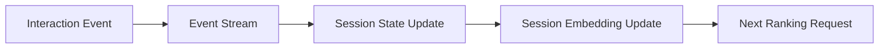

------
title: Build From Scratch Recommendations System - Part 038
description: Mendesain sequence dan session-based ranking production-grade: session intent, user history sequence, recency, event types, sequence encoders, candidate-aware attention, next-item ranking, session drift, freshness, latency, dan observability.
series: learn-build-from-scratch-recommendations-system
seriesTitle: Build From Scratch: Enterprise Recommendations System
order: 38
partTitle: Sequence and Session-Based Ranking
tags:
  - recommendation-system
  - recsys
  - ranking
  - sequence-modeling
  - session-based
  - personalization
  - series
date: 2026-07-02
---

# Part 038 — Sequence and Session-Based Ranking

User preference tidak selalu statis.

User bisa punya long-term interest pada software engineering, tetapi dalam sesi tertentu sedang mencari hadiah.  
User biasa menonton video backend, tetapi sekarang sedang debugging Kubernetes.  
Customer biasanya membeli produk premium, tetapi sekarang membandingkan barang budget.  
Investigator biasanya menangani case AML, tetapi case saat ini adalah fraud escalation.  
Session intent bisa berubah dalam menit.

Ranking yang hanya melihat aggregate historis sering gagal menangkap urutan dan konteks jangka pendek.

Sequence dan session-based ranking mencoba menjawab:

> Berdasarkan urutan behavior terbaru, apa kandidat yang paling relevan sekarang?

Part ini membahas sequence/session-based ranking production-grade: session intent, event sequence, recency, event types, candidate-aware attention, next-item prediction, short-term vs long-term blending, data construction, latency, observability, dan failure modes.

---

## 1. Mental Model: Preference Has Time Structure

User history bukan unordered bag.

```text
A -> B -> C
```

berbeda dari:

```text
C -> B -> A
```

Sequence membawa informasi:

- intent progression,
- comparison behavior,
- funnel stage,
- topic drift,
- action workflow,
- fatigue,
- repeated interest,
- abandonment.

Example e-commerce:

```text
view camera -> view lens -> add camera to cart
```

Candidate memory card becomes relevant.

Example video:

```text
watch intro Kafka -> watch partitioning -> watch consumer groups
```

Candidate Kafka Streams may be relevant.

Example enterprise:

```text
collect evidence -> review risk indicator -> escalate
```

Next action depends on workflow sequence.

---

## 2. Session vs Long-Term History

Long-term profile:

```text
stable preference over weeks/months
```

Session:

```text
current intent over minutes/hours
```

Ranking should consider both.

```text
score =
  long_term_component
  + session_component
  + context_component
```

But weights should adapt.

If session intent strong:

```text
session dominates
```

If session weak/noisy:

```text
long-term dominates
```

User may be shopping for someone else. Session prevents long-term over-personalization.

---

## 3. Sequence Data

A sequence event record:

```json
{
  "subject_id": "u123",
  "session_id": "sess_456",
  "event_time": "2026-07-02T10:05:00Z",
  "event_type": "view",
  "item_id": "item_789",
  "surface": "product_detail",
  "context": {
    "query": "travel camera",
    "category": "camera"
  }
}
```

Sequence can include:

- item IDs,
- event types,
- timestamps,
- surfaces,
- queries,
- categories,
- dwell,
- position,
- action outcomes,
- case states.

---

## 4. Event Type Matters

Sequence is not just item IDs.

Events have different strength:

```text
impression
view
click
long dwell
add_to_cart
purchase
save
hide
search
back
scroll
dismiss
case action executed
article marked useful
```

Example:

```text
view item A
hide item B
purchase item C
```

is very different from:

```text
view A
view B
view C
```

Event type embedding or weight is important.

---

## 5. Recency

Recent events matter more.

Basic decay:

```text
weight = exp(-lambda * age)
```

Sequence models can learn recency via positional/time features.

Hand-engineered:

```text
time_since_last_event
time_since_last_category_view
last_event_type
last_clicked_item
last_purchased_item
```

For real-time ranking, last few events can dominate.

But avoid overreacting to one weak event.

---

## 6. Sequence Window

Choose history length.

Examples:

```text
last 5 events
last 20 events
last 50 events
last 100 events
last 2 hours
last 30 days
```

Trade-offs:

- longer = more context, more cost/noise,
- shorter = fresh, may miss preference.

Use different windows:

```text
session sequence: last 20 events
recent history: last 7d top events
long-term profile: aggregates/embedding
```

Do not feed entire lifetime sequence online.

---

## 7. Sessionization

Need clear session definition.

Common:

```text
new session after 30 minutes inactivity
```

But domain-specific:

- e-commerce: 30m inactivity,
- video: continuous watch session,
- enterprise case: workflow session,
- B2B: user workday context,
- mobile app: app open session.

Session boundaries affect training and serving.

If sessionization differs offline/online, model skew occurs.

---

## 8. Session State

Serving needs session state.

Fields:

```json
{
  "session_id": "sess_123",
  "recent_item_ids": ["A", "B", "C"],
  "recent_event_types": ["view", "click", "add_to_cart"],
  "recent_categories": ["camera", "lens"],
  "last_query": "travel camera",
  "session_depth": 8,
  "updated_at": "2026-07-02T10:05:00Z"
}
```

Session state freshness is critical.

If session store stale, ranker sees wrong intent.

---

## 9. Simple Sequence Features

Before deep sequence model, start with simple features.

Examples:

```text
last_item_id
last_category_id
last_event_type
last_query_embedding
session_category_counts
session_creator_counts
session_price_bucket_counts
candidate_matches_last_category
candidate_matches_last_query
candidate_same_as_recent_item
candidate_complements_cart
time_since_last_event
session_depth
```

These features work well with GBDT.

Sequence-aware ranking does not always require transformer first.

---

## 10. Session Embedding by Weighted Average

Simple session embedding:

```text
session_embedding =
  weighted_average(item_embeddings in recent session)
```

Weight:

```text
event_strength * recency_decay
```

Then rank feature:

```text
candidate_similarity_to_session = cosine(session_embedding, item_embedding)
```

This is simple, cheap, and strong.

---

## 11. Event-Weighted Session Embedding

Example weights:

```text
view = 1
click = 2
add_to_cart = 5
purchase = 6
hide = negative or suppression
```

Session vector:

```text
sum(weight_e * item_embedding_e) / sum(abs(weight_e))
```

For negative event, maintain separate negative session embedding.

Score:

```text
sim(candidate, positive_session)
- alpha * sim(candidate, negative_session)
```

---

## 12. Sequential Next-Item Objective

Training task:

```text
given sequence before time t, predict next positive item
```

Example:

```text
history: [A, B, C]
target: D
```

Training pair:

```text
(sequence_context, target_item)
```

This is similar to retrieval, but ranker can use candidate features too.

For ranking, target can be:

- next click,
- next purchase,
- next watched video,
- next accepted action,
- next useful article.

---

## 13. Candidate-Aware Sequence Ranking

Instead of summarizing session once, model evaluates candidate relative to sequence.

Example:

```text
candidate = memory_card
history = camera, lens, camera_bag
```

Candidate-aware model asks:

```text
Which history events are relevant to this candidate?
```

Mechanisms:

- attention between candidate embedding and history item embeddings,
- max similarity to recent items,
- recency-weighted similarity,
- sequence model output conditioned on candidate.

Features:

```text
max_recent_item_similarity
mean_top3_recent_similarity
last_clicked_item_similarity
candidate_complements_cart_score
```

---

## 14. Attention over Sequence

Attention computes weights over history.

```text
attention_weight_i = relevance(candidate, history_item_i)
```

Then:

```text
sequence_context_for_candidate =
  sum(attention_weight_i * history_item_embedding_i)
```

This lets candidate focus on relevant past events.

Example:

History:

```text
laptop, mouse, camera, tripod
```

Candidate:

```text
camera lens
```

Attention should focus on camera/tripod.

---

## 15. Transformer-Style Sequence Encoder

Transformers model sequence with self-attention.

Inputs:

```text
item embedding
event type embedding
position embedding
time gap embedding
surface embedding
```

Output:

```text
session representation
per-position representation
next-item prediction vector
```

Pros:

- captures order,
- handles long dependencies,
- strong for sequential recommendation.

Cons:

- expensive,
- data hungry,
- latency,
- harder debugging,
- serving complexity.

Use only when simple sequence features/pooling are insufficient.

---

## 16. Time Gap Features

Time between events matters.

Examples:

```text
view A -> view B after 2 seconds
```

could be browsing/comparison.

```text
view A -> purchase B after 3 days
```

different meaning.

Features:

```text
time_since_previous_event
time_gap_bucket
time_since_session_start
time_since_last_same_category
```

Sequence model can include time gap embedding.

---

## 17. Surface Transitions

User moves across surfaces:

```text
search -> product detail -> cart -> checkout
```

Surface sequence reveals funnel stage.

Features:

```text
last_surface
surface_transition
current_surface
candidate_source_surface_origin
```

A product relevant on search may be less relevant on checkout unless complement.

Enterprise:

```text
case_dashboard -> evidence_upload -> review -> escalation
```

Action ranking depends on workflow stage.

---

## 18. Query Sequence

Search/query history matters.

Examples:

```text
"camera"
"travel camera"
"mirrorless under 10 juta"
```

This refines intent.

Features:

```text
last_query_text_embedding
query_refinement_count
candidate_query_similarity
query_category_match
time_since_last_query
```

For search/recommend hybrid surfaces, query sequence is high-signal.

---

## 19. Cart Sequence

Cart is not just set. Add order matters.

```text
add camera -> add lens -> remove lens
```

Candidate accessories depend on final cart state and removed items.

Features:

```text
current_cart_items
removed_cart_items
time_since_add_to_cart
cart_category_mix
candidate_complements_cart
candidate_was_removed_before
```

If user removed item, do not recommend it immediately unless clear reason.

---

## 20. Negative Sequence Events

Negative events in sequence:

```text
hide
not interested
remove from cart
skip
dismiss
report
```

They should influence ranking quickly.

Options:

- suppression,
- negative session embedding,
- negative topic/category features,
- event type embedding,
- sequence model learns negative event.

Explicit block/hide may be hard filter.

---

## 21. Session Drift

Session intent can drift.

Example:

```text
first 10 events: camera research
last 3 events: laptop
```

Should model follow old or new intent?

Use:

- recency decay,
- attention,
- detect category/topic switch,
- split session into sub-intents,
- use last query.

Feature:

```text
session_intent_entropy
dominant_recent_category
dominant_early_category
intent_shift_score
```

High drift suggests rely more on recent events.

---

## 22. Multi-Intent Sessions

User may compare multiple categories.

Example:

```text
camera, tripod, backpack
```

Could be travel photography bundle.

Or unrelated browsing.

Represent session as multiple interests:

- top categories,
- cluster recent items,
- multi-vector session representation,
- source mix per intent.

A single average vector can blur intents.

For advanced systems, multi-interest user representation is useful.

---

## 23. Long-Term + Short-Term Fusion

Fusion strategies:

### Linear Blend

```text
score = a * long_term_score + b * session_score
```

### Feature Input

Both scores/features go into ranker.

### Gating Network

Model learns weight based on context.

```text
gate = sigmoid(g(context, session_confidence))
final_rep = gate * session_rep + (1-gate) * long_term_rep
```

### Rule-Based Override

If strong query/cart intent, session dominates.

Start with feature input and simple gating.

---

## 24. Session Confidence

Features for confidence:

```text
session_depth
number_of_strong_events
dominant_category_share
last_query_confidence
time_since_last_event
cart_present
repeated_topic_count
negative_event_count
```

High confidence:

```text
several recent strong events in same category/topic
```

Low confidence:

```text
one accidental click or random browse
```

Use confidence to blend session and long-term.

---

## 25. Training Dataset for Session Ranking

Each training example should reconstruct sequence before prediction time.

Example:

```json
{
  "group_id": "req_123",
  "prediction_time": "2026-07-02T10:05:00Z",
  "sequence": [
    {"item_id": "A", "event_type": "view", "time": "10:00"},
    {"item_id": "B", "event_type": "click", "time": "10:02"}
  ],
  "candidate": "C",
  "label": {
    "clicked_30m": 1
  }
}
```

Sequence must not include events after prediction_time.

This is common leakage source.

---

## 26. Sequence Feature Snapshot

Training should store:

```text
sequence_event_ids
sequence_cutoff_time
sequence_policy_version
max_length
event_type_filter
```

This makes examples debuggable.

If sequence builder changes, model behavior changes.

Version sequence construction policy.

---

## 27. Handling Long Histories Offline

For users with huge histories:

- last N events,
- top N by event strength,
- recent diverse sample,
- per-category summaries,
- long-term aggregate features.

Do not dump unlimited sequence into training.

Training and serving sequence truncation must match.

---

## 28. Serving Latency

Sequence models can be expensive.

Latency drivers:

```text
sequence length
candidate count
attention cost
embedding lookup
model size
batching
```

Strategies:

- compute session representation once,
- candidate-aware only for top candidates,
- pre-rank before deep sequence model,
- truncate history,
- cache session embedding,
- use efficient attention,
- batch scoring.

---

## 29. Two-Stage Sequence Ranking

Pattern:

```text
candidate pool 2000
-> cheap ranker to 300
-> candidate-aware sequence ranker
-> reranker
```

This lets sequence model focus on likely candidates.

If sequence model scores all candidates, cost may be too high.

---

## 30. Real-Time Sequence Updates

Session sequence must update quickly.

Flow:



If update lag high, ranker misses fresh intent.

Monitor:

```text
session_update_lag
session_state_age
sequence_event_count
missing_session_state
```

---

## 31. Sequence and Candidate Source Interaction

Sequence can affect candidate generation and ranking.

Candidate generation:

```text
session candidates from recent items/query
```

Ranking:

```text
session features score all candidates
```

Avoid double counting? Not necessarily wrong, but ranker should know source.

If candidate came from session source, source feature indicates it.

---

## 32. Evaluation

Offline:

- next-item Recall@K,
- session NDCG@K,
- CTR/CVR by session depth,
- sequence-aware ablation,
- cold user performance,
- intent shift segments.

Online:

- session continuation,
- CTR,
- conversion,
- watch next,
- add-to-cart,
- hide/not interested,
- repeat/redundancy,
- latency.

Segment by:

```text
new user
session depth
strong intent
multi-intent
query present
cart present
```

---

## 33. Ablation

Compare:

```text
ranker without sequence features
ranker with simple session aggregates
ranker with session embedding
ranker with candidate-aware attention
```

Do not assume transformer is needed.

Ablation shows value of complexity.

---

## 34. Debugging Sequence Ranking

Questions:

```text
What sequence did model see?
Were recent events missing?
Did sequence include future event?
Did session state lag?
Did one accidental click dominate?
Did negative event suppress correctly?
Did long-term profile override session?
```

Debug view should show:

- recent events,
- event times/types,
- sequence truncation,
- session embedding age,
- candidate similarity to history,
- attention weights if used,
- final score components.

---

## 35. Privacy

Session sequence may contain sensitive behavior.

Controls:

- consent,
- short TTL,
- minimal logging,
- purpose limitation,
- access control,
- deletion,
- raw query redaction,
- tenant isolation.

Current session data can be more sensitive than long-term aggregate.

---

## 36. Enterprise Sequence Ranking

Enterprise workflow sequence examples:

```text
case opened -> evidence uploaded -> risk reviewed -> action recommended
```

Sequence features:

```text
previous actions
case state transitions
time in state
failed actions
supervisor feedback
document usage sequence
SLA remaining
```

Candidate action ranking should use sequence, but eligibility remains hard.

Invalid action never reaches ranker.

Sequence model can suggest likely next action among valid options.

---

## 37. Sequence-Based Explanation

User-facing explanations:

```text
Because you recently viewed mirrorless cameras.
Because this complements items in your cart.
Because it follows the topic you are currently exploring.
Because this is the next step after uploading evidence.
```

Internal:

```text
candidate attention focused on events A and B
session category affinity camera=0.8
```

Do not expose sensitive sequence details.

---

## 38. Failure Modes

### 38.1 Future Event Leakage

Training sequence includes target or after-target events.

### 38.2 Overreaction

One click changes all recommendations.

### 38.3 Stale Session State

Model misses current intent.

### 38.4 Session/Long-Term Conflict

Wrong blending.

### 38.5 Sequence Padding Bug

PAD treated as item.

### 38.6 OOV Recent Item IDs

New items not represented.

### 38.7 Attention Cost Too High

Latency spike.

### 38.8 Negative Event Ignored

User keeps seeing hidden topic.

### 38.9 Multi-Intent Collapse

Average vector blurs intent.

### 38.10 Privacy Leakage

Sensitive query/session logged excessively.

---

## 39. Implementation Sketch: Sequence Builder

```java
public final class SequenceBuilder {
    private final int maxLength;
    private final EventFilter eventFilter;

    public UserSequence build(List<UserEvent> events, Instant cutoffTime) {
        return events.stream()
            .filter(event -> event.eventTime().isBefore(cutoffTime))
            .filter(eventFilter::isAllowed)
            .sorted(Comparator.comparing(UserEvent::eventTime).reversed())
            .limit(maxLength)
            .collect(collectingAndThen(toList(), list -> {
                Collections.reverse(list);
                return UserSequence.from(list);
            }));
    }
}
```

Key: cutoff time prevents leakage.

---

## 40. Implementation Sketch: Session Embedding

```java
public final class SessionEmbeddingBuilder {
    private final ItemEmbeddingStore itemEmbeddingStore;
    private final EventWeightPolicy weightPolicy;
    private final RecencyDecay recencyDecay;

    public Embedding build(UserSequence sequence, Instant now) {
        Vector sum = Vector.zeros(dimension);
        double totalWeight = 0.0;

        for (UserEvent event : sequence.events()) {
            Optional<Embedding> item = itemEmbeddingStore.get(event.itemId());
            if (item.isEmpty()) {
                continue;
            }

            double weight = weightPolicy.weight(event.eventType())
                * recencyDecay.weight(Duration.between(event.eventTime(), now));

            sum.addScaled(item.get().vector(), weight);
            totalWeight += Math.abs(weight);
        }

        if (totalWeight == 0.0) {
            return Embedding.zero(dimension);
        }

        return new Embedding(sum.divide(totalWeight));
    }
}
```

Production needs negative profiles, missing handling, and versioning.

---

## 41. Implementation Sketch: Candidate Sequence Feature

```java
public final class SequenceCandidateFeatureBuilder {
    public SequenceFeatures build(UserSequence sequence, Candidate candidate) {
        double maxSimilarity = 0.0;
        double recencyWeightedSimilarity = 0.0;

        for (UserEvent event : sequence.events()) {
            double sim = embeddingSimilarity(event.itemEmbedding(), candidate.itemEmbedding());
            maxSimilarity = Math.max(maxSimilarity, sim);
            recencyWeightedSimilarity += event.recencyWeight() * sim;
        }

        return new SequenceFeatures(
            maxSimilarity,
            recencyWeightedSimilarity,
            sequence.depth(),
            sequence.timeSinceLastEventMillis()
        );
    }
}
```

This gives GBDT/deep ranker sequence-aware scalar features.

---

## 42. Minimal Production Sequence Ranking Plan

Start with:

```yaml
session_state:
  recent_item_ids: max_20
  recent_event_types: max_20
  recent_categories: max_20
  last_query_embedding: optional
  ttl: 2h

features:
  - session_depth
  - last_event_type
  - last_category
  - dominant_session_category
  - candidate_matches_recent_category
  - candidate_similarity_to_session_embedding
  - time_since_last_event
  - session_intent_confidence

model:
  stage_1: GBDT with sequence features
  stage_2_optional: deep candidate-aware sequence ranker

monitoring:
  - session_state_hit_rate
  - state_age
  - sequence_feature_missing
  - CTR by session_depth
  - latency
```

Add transformer/attention only after simple features show value and bottleneck remains.

---

## 43. Checklist Sequence & Session Ranking Readiness

```text
[ ] Session definition is documented.
[ ] Sequence cutoff time prevents leakage.
[ ] Event types and weights are defined.
[ ] Sequence truncation policy is versioned.
[ ] Session state store exists with TTL.
[ ] Session state freshness is monitored.
[ ] Simple sequence features are implemented first.
[ ] Session embedding has version and freshness metadata.
[ ] Long-term vs session blending is explicit.
[ ] Negative sequence events are handled.
[ ] Request-time sequence features are logged or reconstructable.
[ ] Padding/masking is correct for deep models.
[ ] Candidate-aware sequence cost is bounded.
[ ] Evaluation is segmented by session depth/intent.
[ ] Privacy controls cover session/query history.
[ ] Enterprise workflow validity remains hard eligibility.
```

---

## 44. Kesimpulan

Sequence dan session-based ranking membuat recommendation system responsif terhadap intent yang sedang terjadi sekarang.

Prinsip utama:

1. User history has order; sequence matters.
2. Session intent and long-term preference should be separate.
3. Simple session features often provide strong gains.
4. Session embedding via weighted recent item embeddings is a strong baseline.
5. Candidate-aware attention is powerful but costly.
6. Sequence cutoff time is critical to avoid leakage.
7. Negative events should affect ranking/suppression quickly.
8. Session state freshness directly affects relevance.
9. Long-term/session blending should adapt to intent confidence.
10. Sequence modeling must be production-aware: latency, logging, privacy, and debuggability.

Di Part 039, kita akan membahas **Multimodal Ranking**: bagaimana text, image, audio, video, document, and structured metadata masuk ke ranking model secara aman dan scalable.
