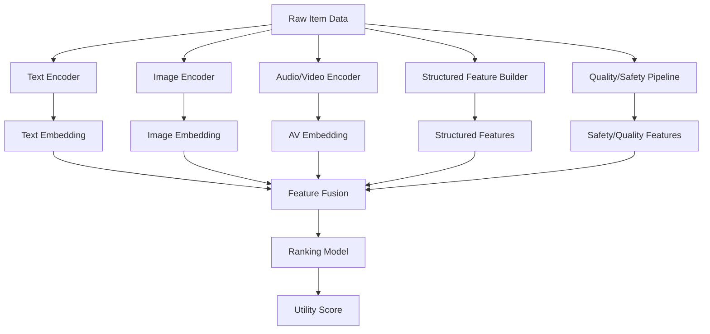
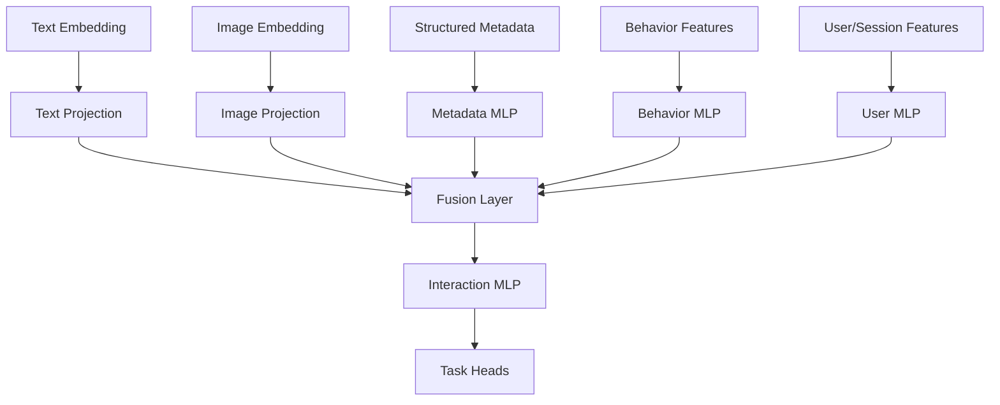
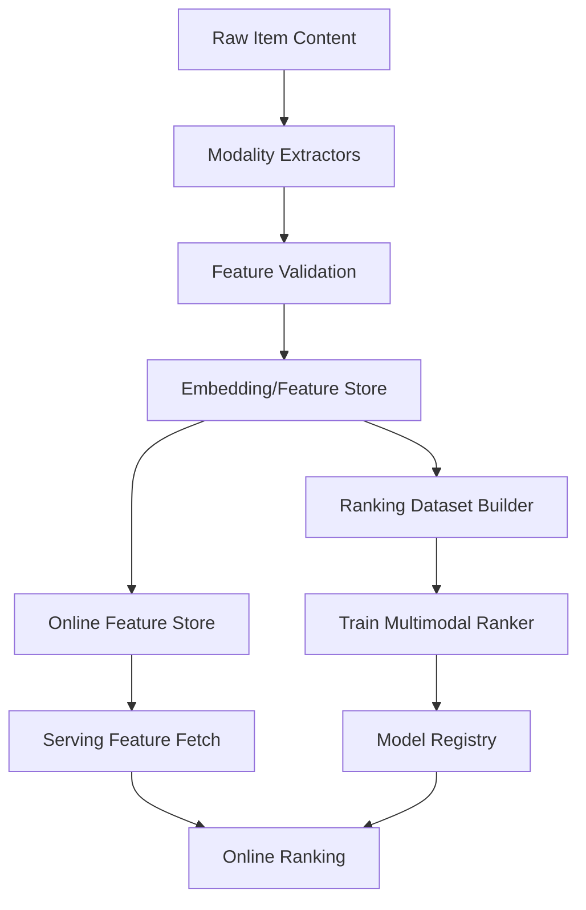

------
title: Build From Scratch Recommendations System - Part 039
description: Mendesain multimodal ranking production-grade: text, image, audio, video, document, structured metadata, multimodal embeddings, fusion strategy, missing modality, quality/safety signals, latency, monitoring, dan failure modes.
series: learn-build-from-scratch-recommendations-system
seriesTitle: Build From Scratch: Enterprise Recommendations System
order: 39
partTitle: Multimodal Ranking
tags:
  - recommendation-system
  - recsys
  - ranking
  - multimodal
  - embeddings
  - machine-learning
  - series
date: 2026-07-02
---

# Part 039 — Multimodal Ranking

Banyak item dalam recommendation system tidak bisa direpresentasikan hanya dengan satu jenis data.

Produk punya title, description, category, image, price, review, seller, stock, dan policy metadata.  
Video punya title, thumbnail, transcript, audio, watch pattern, creator, duration, dan content safety label.  
Artikel punya text, topic, author, freshness, quality, dan engagement.  
Dokumen enterprise punya body text, policy version, jurisdiction, authoring team, classification, dan access control.  
Action recommendation punya action type, workflow state, historical outcome, role, policy, dan case context.

**Multimodal ranking** adalah ranking yang menggabungkan berbagai modality untuk memahami candidate secara lebih lengkap.

Part ini membahas desain multimodal ranking production-grade: modality types, fusion strategy, feature extraction, multimodal embeddings, missing modality, quality/safety signals, serving cost, explainability, monitoring, dan failure modes.

---

## 1. Mental Model: Item Meaning Lives Across Modalities

Satu item punya banyak “view”.

```text
text view
image view
audio view
video view
structured metadata view
behavioral view
graph view
policy/safety view
```

Ranking yang kuat menggabungkan evidence dari view tersebut.

Example fashion product:

```text
title: "linen summer shirt"
image: actual visual style
category: men's casual shirt
price: mid
reviews: breathable, relaxed fit
seller: high quality
```

Jika model hanya membaca title, ia melewatkan style visual.  
Jika hanya membaca image, ia melewatkan material/size/brand.  
Jika hanya membaca behavior, item cold-start lemah.

Multimodal ranking mencoba membangun representation dan score yang lebih utuh.

---

## 2. What Counts as Modality?

Dalam recommendation system, modality tidak hanya media mentah.

Common modalities:

```text
structured metadata
text
image
audio
video
behavioral signals
graph relationships
reviews/ratings
policy/safety labels
context/workflow state
```

Contoh mapping:

| Domain | Modalities |
|---|---|
| E-commerce | title, description, image, category, price, stock, reviews |
| Video | title, thumbnail, transcript, audio, watch history, creator |
| News/Articles | title, body, topic, author, freshness, source credibility |
| Jobs | job text, skills, company, salary, location, applicant behavior |
| Enterprise docs | body text, policy, jurisdiction, ACL, owner, version |
| Case actions | state, text notes, action metadata, outcome history, permissions |

Structured metadata is a modality too. It is often the most controllable one.

---

## 3. Why Multimodal Ranking Matters

Multimodal ranking helps with:

- cold-start item,
- richer relevance,
- visual/aesthetic matching,
- semantic document matching,
- safety/policy filtering,
- quality estimation,
- duplicate detection,
- query understanding,
- session intent,
- explainability,
- robustness when one modality missing.

Examples:

### Product

Image says style; text says material; reviews say quality; price says fit.

### Video

Thumbnail may drive click; transcript/content drives satisfaction; watch completion reveals value.

### Enterprise Document

Text says semantic topic; policy metadata says applicability; ACL says access; version says validity.

A model that ignores any critical modality will make brittle decisions.

---

## 4. Multimodal Ranking Pipeline



Production design separates:

1. offline modality extraction,
2. online feature fetch,
3. ranking fusion,
4. safety/eligibility gates.

---

## 5. Fusion Strategies

How to combine modalities?

### 5.1 Early Fusion

Concatenate features before model.

```text
concat(text_embedding, image_embedding, structured_features) -> ranker
```

Pros:

- simple,
- lets model learn interactions.

Cons:

- high dimensional,
- missing modality issues,
- serving cost.

### 5.2 Late Fusion

Score each modality separately, then combine.

```text
score = w_text*text_score + w_image*image_score + w_behavior*behavior_score
```

Pros:

- interpretable,
- robust,
- easy to debug.

Cons:

- may miss deep interactions.

### 5.3 Hybrid Fusion

Use modality-specific encoders, then interaction model.

```text
text tower -> text vector
image tower -> image vector
metadata tower -> metadata vector
fusion MLP/attention -> ranking score
```

Often best for mature systems.

---

## 6. Text Features

Text fields:

```text
title
description
body
transcript
query
review text
case notes
policy document
action description
```

Text feature options:

### Simple

```text
language
title length
keyword matches
BM25 score
topic tags
```

### Embedding

```text
text embedding
query-item semantic similarity
case-document similarity
```

### Extracted Signals

```text
topic distribution
toxicity/safety score
readability
intent classification
named entities
```

For ranking, scalar similarities are often easier than huge raw text embeddings for GBDT. Deep rankers can consume embeddings.

---

## 7. Image Features

Image features matter for:

- fashion,
- furniture,
- food,
- travel,
- real estate,
- product visual search,
- video thumbnails.

Features:

```text
image_embedding
image_quality_score
dominant_color
style_cluster
duplicate_image_hash
thumbnail_clickability
unsafe_visual_score
blur/low_quality_score
```

Important:

- image can drive click but not satisfaction,
- thumbnail can be clickbait,
- image similarity may ignore compatibility,
- image safety review is hard requirement in some domains.

Do not optimize only visual clickability.

---

## 8. Audio/Video Features

For video/audio:

```text
duration
transcript embedding
audio topic embedding
speech language
music genre
scene/visual embedding
thumbnail embedding
watch completion rate
skip rate
creator quality
content safety
```

Video is multi-modal by itself:

```text
title + thumbnail + transcript + visual frames + audio + behavior
```

Ranking should distinguish:

- clickability from thumbnail/title,
- satisfaction from content/watch completion,
- safety from content review,
- relevance from transcript/topic.

---

## 9. Structured Metadata Features

Structured metadata is often most reliable.

Examples:

```text
category
taxonomy path
brand
creator
seller
price
availability
language
region
duration
difficulty
jurisdiction
policy version
role applicability
case state
action type
```

Metadata helps:

- filtering,
- ranking,
- explainability,
- cold-start,
- controlled behavior.

Metadata quality is critical.

Feature:

```text
metadata_completeness_score
taxonomy_confidence
policy_tag_confidence
```

---

## 10. Behavioral Modality

Behavior is also a modality.

Signals:

```text
CTR
CVR
watch completion
save rate
hide rate
return rate
co-view
co-buy
source scores
graph centrality
```

Behavior captures user response but is biased and cold-start weak.

Multimodal model should combine behavior with content/metadata.

Example:

```text
new item has no behavior, use content/metadata
warm item uses behavior + content
```

---

## 11. Quality and Safety Modality

Quality/safety signals:

```text
item_quality_score
creator_trust_score
seller_quality
report_rate
policy_state
content_safety_score
adult_score
misinformation_risk
document_verified
expert_reviewed
return/refund rate
complaint rate
```

Some are hard filters. Some are rank features.

Banned/unsafe content should not be “low ranked”; it should be removed.

Soft risk/quality can influence ranking.

---

## 12. Multimodal Candidate Features

Examples for ranker:

```text
text_query_similarity
image_query_similarity
text_image_consistency
thumbnail_content_consistency
item_metadata_quality
image_quality_score
transcript_topic_match
review_sentiment_score
content_safety_score
creator_quality_score
behavioral_ctr_smoothed
user_visual_style_affinity
user_topic_affinity
```

Cross-modal features are powerful.

Example:

```text
text_image_consistency
```

can detect clickbait mismatch.

---

## 13. Text-Image Consistency

For products/videos, text and image should align.

If title says:

```text
"red leather bag"
```

image should show red leather bag.

Feature:

```text
text_image_similarity
```

Low consistency may indicate:

- bad listing,
- spam,
- wrong image,
- clickbait thumbnail,
- catalog error.

Use as quality/risk signal.

---

## 14. Query-Multimodal Matching

For query-driven ranking:

```text
query -> text match
query -> image match
query -> structured filter match
```

Example query:

```text
"minimalist wooden desk"
```

Needs both:

- text match: desk, wooden,
- image/style match: minimalist.

Score:

```text
query_item_score =
  w_text * query_text_similarity
  + w_image * query_image_similarity
  + w_metadata * attribute_match
```

Weights depend on domain.

---

## 15. User-Multimodal Preference

User may prefer:

- visual style,
- creator voice,
- topic,
- price,
- format,
- document type.

Features:

```text
user_visual_style_affinity
user_topic_embedding
user_creator_affinity
user_duration_preference
user_reading_level_preference
user_price_bucket_preference
```

For visual domains, user style embedding can matter.

For enterprise, user role/workflow preference matters more than visual style.

---

## 16. Missing Modality

Many items lack some modalities.

Examples:

- product missing image,
- article missing body embedding,
- video missing transcript,
- old document missing metadata,
- new item missing behavior,
- item has image but no reviews.

Handle with:

```text
missing indicator
missing reason
fallback representation
modality dropout training
quality penalty if required
```

Do not fill missing embedding with zero silently without indicator.

---

## 17. Modality Dropout

During training, randomly drop modality features.

Purpose:

- robustness to missing modalities,
- prevent model over-reliance,
- improve cold-start.

Example:

```text
drop image embedding 10%
drop behavior features 20%
drop item_id embedding 15%
```

Useful but tune carefully.

If image is critical, too much dropout hurts.

---

## 18. Modality Reliability

Not all modalities equally trustworthy.

Examples:

- seller-provided tags can be spammed,
- thumbnail can be clickbait,
- OCR/transcript may be noisy,
- image embedding may be generic,
- reviews can be fake,
- behavior can be bot-biased,
- metadata can be stale.

Feature should include reliability/confidence:

```text
tag_confidence
transcript_quality
image_quality
metadata_verified
behavior_unique_user_count
review_authenticity_score
```

Ranker can learn trust level.

---

## 19. Cold-Start and Multimodal Ranking

Multimodal is essential for cold-start.

New item can have:

```text
text
image
metadata
creator prior
quality score
```

No behavior yet.

Ranking features:

```text
is_new_item
item_content_embedding
metadata_quality
creator_prior
category_prior
exploration_source
```

If model over-relies on behavior, cold-start item ranks low. Use modality dropout and cold-start evaluation.

---

## 20. Multimodal Embedding Versioning

Each embedding has version:

```text
text_embedding_v4
image_embedding_v2
video_embedding_v3
multimodal_projection_v1
```

Ranking model depends on versions.

If image embedding model changes, ranker feature distribution shifts.

Model registry should track:

```text
ranker -> feature set -> embedding versions
```

Do not change embedding version under ranker silently.

---

## 21. Feature Dimensionality

Multimodal embeddings can be large:

```text
text 768
image 512
video 1024
```

Feeding all raw dimensions to ranker may be expensive.

Options:

- scalar similarities,
- projection to lower dimension,
- PCA/autoencoder,
- modality-specific tower,
- late fusion scores,
- feature selection.

For GBDT, prefer scalar features or low-dimensional projections.  
For deep ranker, embeddings can be consumed directly with projection layers.

---

## 22. Multimodal Ranker Architecture

Example deep architecture:



Fusion layer can be concat, attention, gating, or cross network.

---

## 23. Late Fusion Baseline

Before deep fusion, build late fusion.

```text
score =
  w_behavior * behavior_rank_score
  + w_text * text_relevance_score
  + w_image * image_relevance_score
  + w_metadata * metadata_match_score
  + w_quality * quality_score
```

Benefits:

- simple,
- debuggable,
- robust,
- good baseline.

Then compare with deep fusion.

Do not start with complex multimodal transformer unless simpler baselines fail.

---

## 24. Gating by Context

Modality importance depends on context.

Examples:

- visual similarity more important in fashion,
- text more important for knowledge articles,
- transcript more important for educational video,
- image less important for enterprise actions,
- metadata critical for policy.

Use gating:

```text
modality_weight = g(surface, category, query_intent, user_state)
```

Example:

```text
fashion_home: image high
knowledge_search: text high
checkout_addon: compatibility metadata high
```

---

## 25. Multimodal Safety

Multimodal safety is hard.

Unsafe content may appear in image but not text.  
Misleading title may hide unsafe video content.  
Document text may contain sensitive info.  
Audio may include disallowed content.

Safety should be modality-aware:

```text
text_safety
image_safety
audio_safety
video_safety
metadata_policy
human_review_state
```

Hard safety filters must run before ranking/final slate.

---

## 26. Multimodal Explainability

Explanations can use modality evidence.

Examples:

```text
Matches your recent interest in minimalist furniture.
Similar visual style to items you saved.
Relevant to your query about Java concurrency.
This document applies to AML escalation policy.
This accessory is compatible with your cart item.
```

Do not say:

```text
because vector similarity 0.82
```

Translate modality evidence to semantic reason.

---

## 27. Multimodal Quality Monitoring

Monitor:

```text
embedding_missing_rate by modality
modality_feature_null_rate
modality_score_distribution
text_image_consistency_distribution
image_quality_score
transcript_coverage
metadata_completeness
modality drift
cold-start performance
```

If transcript pipeline fails, video ranker may degrade.

If image embedding changes, visual category distribution may shift.

---

## 28. Modality Ablation

Evaluate contribution.

Train/evaluate:

```text
all modalities
without image
without text
without behavior
without metadata
without source features
```

Ablation reveals:

- which modality matters,
- over-reliance,
- missing robustness,
- cold-start weakness.

Run by segment/category/surface.

---

## 29. Latency and Cost

Multimodal ranking can be expensive.

Costs:

- feature fetch,
- embedding storage,
- model inference,
- high-dimensional tensors,
- image/video processing,
- online text encoding,
- multi-tower deep ranker.

Production strategy:

- precompute heavy embeddings offline,
- avoid online image/video encoding,
- compute query embedding online only when necessary,
- use low-dimensional projections,
- two-stage ranking,
- cache modality features,
- batch inference.

---

## 30. Online vs Offline Extraction

Heavy extraction should be offline/nearline:

```text
image embedding
video embedding
transcript embedding
document embedding
quality score
safety score
```

Online extraction only for:

```text
current query
current case text if needed
current session
```

If online extraction is expensive, cache result.

Do not perform video frame encoding in request path.

---

## 31. Data Pipeline



Extraction pipeline failures should not silently produce zero vectors.

---

## 32. Training Data Alignment

Multimodal features must be point-in-time.

Examples:

- item image changed after impression,
- title edited after click,
- document policy version updated,
- transcript generated after video published,
- moderation label changed.

Training should use modality features as-of prediction time if changes matter.

At minimum, track content version and embedding generated time.

---

## 33. Multimodal and UI Bias

Some modalities affect UI exposure.

Example:

- attractive thumbnail increases click,
- title length affects display,
- badge affects trust,
- image quality affects CTR.

If optimizing click, model may overvalue clickbait visual features.

Use satisfaction/negative labels:

```text
watch completion
long dwell
hide/report
return/refund
```

Multimodal ranking should not optimize presentation trickery.

---

## 34. Enterprise Multimodal Ranking

Enterprise “multimodal” often means:

- document text,
- structured policy metadata,
- ACL/permission,
- workflow state,
- case notes,
- historical outcomes.

Example:

```text
case summary embedding
+ policy topic match
+ jurisdiction match
+ role applicability
+ article helpfulness
+ document freshness
```

Hard constraints:

- access,
- jurisdiction,
- policy version,
- case state.

Ranking chooses among valid documents/actions.

---

## 35. Multimodal Failure Modes

### 35.1 Over-Reliance on Image/Thumbnail

Clickbait improves, satisfaction drops.

### 35.2 Missing Modality Treated as Zero

Cold/new items penalized incorrectly.

### 35.3 Embedding Version Drift

Ranker distribution shifts silently.

### 35.4 Metadata Spam

Model trusts seller tags too much.

### 35.5 Safety Signal as Soft Feature Only

Unsafe content leaks.

### 35.6 Online Encoding Too Expensive

Latency fails.

### 35.7 Text/Image Mismatch Ignored

Bad catalog quality.

### 35.8 Behavior Dominates Content

Cold-start weak.

### 35.9 Raw High-Dim Features Overwhelm Model

Serving/model complexity high.

### 35.10 Modality-Specific Pipeline Failure Unmonitored

Ranker degrades silently.

---

## 36. Implementation Sketch: Multimodal Feature Record

```java
public record MultimodalItemFeatures(
    String itemId,
    String textEmbeddingVersion,
    float[] textEmbedding,
    String imageEmbeddingVersion,
    float[] imageEmbedding,
    Map<String, Object> structuredMetadata,
    double metadataQualityScore,
    double imageQualityScore,
    double textImageConsistency,
    double safetyScore,
    Instant featureTimestamp
) {}
```

For ranking, you may project embeddings or compute scalar similarities.

---

## 37. Implementation Sketch: Fusion Feature Builder

```java
public final class MultimodalFeatureBuilder {
    public RankingFeatures build(
        UserContext user,
        Candidate candidate,
        MultimodalItemFeatures item,
        RequestContext context
    ) {
        RankingFeatures features = new RankingFeatures();

        features.put("metadata_quality", item.metadataQualityScore());
        features.put("image_quality", item.imageQualityScore());
        features.put("text_image_consistency", item.textImageConsistency());
        features.put("safety_score", item.safetyScore());

        if (user.hasQueryEmbedding() && item.textEmbedding() != null) {
            features.put(
                "query_text_similarity",
                cosine(user.queryEmbedding(), item.textEmbedding())
            );
        }

        if (user.hasVisualStyleEmbedding() && item.imageEmbedding() != null) {
            features.put(
                "user_image_style_similarity",
                cosine(user.visualStyleEmbedding(), item.imageEmbedding())
            );
        }

        features.put("text_embedding_missing", item.textEmbedding() == null);
        features.put("image_embedding_missing", item.imageEmbedding() == null);

        return features;
    }
}
```

Important: include missing indicators.

---

## 38. Minimal Production Multimodal Ranking Plan

Start with:

```yaml
modalities:
  structured_metadata:
    features:
      - category
      - price_bucket
      - creator
      - language
      - item_age
      - metadata_quality
  text:
    features:
      - text_embedding
      - query_text_similarity
      - topic_match
  image:
    features:
      - image_embedding
      - image_quality
      - text_image_consistency
  behavior:
    features:
      - ctr_smoothed
      - cvr_smoothed
      - hide_rate
  quality_safety:
    features:
      - item_quality
      - report_rate
      - safety_state
fusion:
  initial: late_fusion_or_gbdt_scalar_features
  advanced: deep_fusion
monitoring:
  - missing_rate_by_modality
  - modality_ablation
  - cold_start_performance
  - safety_guardrails
```

Keep first version debuggable.

---

## 39. Checklist Multimodal Ranking Readiness

```text
[ ] Modalities are explicitly listed.
[ ] Each modality has owner and extraction pipeline.
[ ] Embedding/feature versions are tracked.
[ ] Missing modality indicators exist.
[ ] Modality quality/reliability features exist.
[ ] Heavy modality extraction is offline/nearline.
[ ] Online feature fetch meets latency budget.
[ ] Hard safety/policy filters run before ranking.
[ ] Text/image/content consistency is monitored where relevant.
[ ] Fusion strategy is chosen intentionally.
[ ] Baseline late fusion exists before complex deep fusion.
[ ] Cold-start performance is evaluated.
[ ] Modality ablation is run.
[ ] Feature drift is monitored per modality.
[ ] Explanation maps modality evidence to user-safe reason.
```

---

## 40. Kesimpulan

Multimodal ranking membuat model memahami item dan context secara lebih kaya daripada satu jenis signal saja.

Prinsip utama:

1. Item meaning lives across modalities.
2. Structured metadata is a modality and often the most controllable.
3. Text, image, audio/video, behavior, graph, and quality signals complement each other.
4. Fusion can be early, late, or hybrid.
5. Missing modality must be explicit.
6. Modality reliability and quality matter.
7. Safety signals must not be treated only as soft ranking features.
8. Heavy modality extraction should be offline/nearline.
9. Multimodal models need versioning and drift monitoring.
10. Start with debuggable fusion before complex multimodal deep models.

Di Part 040, kita akan membahas **Multi-Task and Multi-Objective Ranking**: bagaimana ranker mengoptimalkan klik, conversion, satisfaction, negative feedback, long-term value, dan business constraints secara seimbang.
