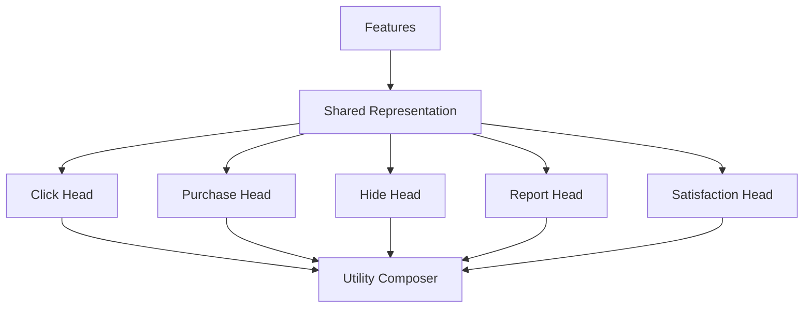

------
title: Build From Scratch Recommendations System - Part 040
description: Mendesain multi-task dan multi-objective ranking production-grade: task heads, click/conversion/satisfaction/negative labels, utility composition, calibration, objective weights, guardrails, Pareto trade-offs, delayed outcomes, dan governance.
series: learn-build-from-scratch-recommendations-system
seriesTitle: Build From Scratch: Enterprise Recommendations System
order: 40
partTitle: Multi-Task and Multi-Objective Ranking
tags:
  - recommendation-system
  - recsys
  - ranking
  - multi-task-learning
  - multi-objective
  - optimization
  - series
date: 2026-07-02
---

# Part 040 — Multi-Task and Multi-Objective Ranking

Recommendation system yang hanya mengoptimalkan satu objective hampir pasti bermasalah.

Jika hanya mengoptimalkan klik, sistem bisa menjadi clickbait.  
Jika hanya mengoptimalkan purchase, sistem bisa mengabaikan discovery dan long-term trust.  
Jika hanya mengoptimalkan watch time, sistem bisa mendorong konten addictive atau low-quality.  
Jika hanya mengoptimalkan margin, user experience turun.  
Jika hanya mengoptimalkan action acceptance di enterprise, action yang mudah diterima tapi buruk untuk outcome bisa naik.

Production ranking harus mempertimbangkan banyak objective:

- click,
- conversion,
- satisfaction,
- retention,
- negative feedback,
- safety,
- quality,
- business value,
- diversity,
- fairness,
- long-term ecosystem health,
- enterprise task success.

Part ini membahas multi-task dan multi-objective ranking production-grade: task labels, model heads, utility composition, calibration, delayed outcomes, objective weights, guardrails, trade-offs, governance, dan failure modes.

---

## 1. Mental Model: Predict Components, Compose Decision

Daripada membuat satu label campuran yang tidak jelas, production system sering memprediksi beberapa outcome.

```text
p_click
p_purchase
p_hide
p_report
p_return
expected_watch_time
p_satisfaction
p_case_success
```

Lalu ranking policy menyusun utility.

```text
utility =
  + value_click * p_click
  + value_purchase * p_purchase
  + value_satisfaction * p_satisfaction
  - cost_hide * p_hide
  - cost_report * p_report
  - cost_return * p_return
```

Model memprediksi components. Policy mengatur trade-off.

Ini lebih debuggable daripada satu score opaque.

---

## 2. Multi-Task vs Multi-Objective

### Multi-Task Learning

Model dilatih untuk memprediksi banyak task/label.

```text
click head
purchase head
hide head
report head
```

Focus: representation learning and prediction.

### Multi-Objective Ranking

Sistem membuat keputusan berdasarkan banyak objective.

```text
maximize purchase while limiting hide/report and protecting diversity
```

Focus: decision policy and trade-off.

Keduanya berkaitan, tapi berbeda.

Multi-task model menyediakan signal. Multi-objective policy menentukan ranking.

---

## 3. Why Not One Label?

Satu label utility seperti:

```text
label = click + 5*purchase - 3*hide
```

mungkin terlihat sederhana, tetapi:

- weights arbitrer,
- labels punya delay berbeda,
- negative feedback beda semantic,
- calibration sulit,
- business trade-off tersembunyi,
- sulit men-debug,
- sulit mengubah policy tanpa retrain.

Lebih baik:

```text
predict tasks separately
compose utility explicitly
```

Kecuali sistem sangat sederhana.

---

## 4. Common Tasks in Recommendation Ranking

### Engagement

```text
click
open
view
watch_start
dwell
```

### Conversion

```text
add_to_cart
purchase
subscribe
apply
complete action
```

### Satisfaction

```text
watch_complete
long dwell
like/save
return visit
article useful
case resolved
```

### Negative

```text
hide
not interested
dislike
report
unsubscribe
return/refund
complaint
rework
```

### Long-Term

```text
retention
repeat purchase
creator follow
trust
lifetime value
case quality
```

### Safety/Policy

```text
policy violation
unsafe content
restricted access
```

Safety is often hard filter/guardrail, not just task.

---

## 5. Task Label Semantics

Each task needs clear label spec.

Example:

```yaml
task: purchase_7d
positive:
  event: purchase
  window: 7d_after_impression
maturity:
  wait: 7d
negative:
  no_purchase_after_window
exclusions:
  - item_out_of_stock_before_window_end
  - user_not_eligible_to_purchase
```

For click:

```yaml
task: click_30m
positive: click within 30m
negative: visible impression without click within 30m
```

For hide:

```yaml
task: hide_7d
positive: hide/not_interested within 7d
```

Task labels are contracts.

---

## 6. Label Maturity

Tasks mature at different times.

```text
click: minutes
purchase: days
return: weeks
retention: weeks/months
case success: days/weeks
```

Training dataset must avoid immature negatives.

If purchase window is 7 days, example from yesterday is not mature.

Solutions:

- delayed training,
- task-specific maturity masks,
- partial labels,
- separate fast/slow models.

---

## 7. Missing Labels

Not every task label is observed for every example.

Examples:

- return label only if purchased,
- satisfaction survey sparse,
- case outcome unknown,
- report rare,
- item unavailable during window.

Use label masks:

```text
loss applied only if label is observed/mature
```

Do not treat missing label as negative.

---

## 8. Multi-Task Architecture

Deep multi-task model:



GBDT approach:

- separate model per task,
- or utility label,
- or small set of models.

Deep model naturally supports shared trunk + task heads.

---

## 9. Shared Trunk Benefits

Shared representation helps sparse tasks.

Click data is abundant and can help learn general relevance.

Purchase/report tasks are sparse but can benefit from shared features.

Risks:

- click task dominates,
- negative task undertrained,
- task gradients conflict,
- shared representation learns clickbait.

Use task weights and monitor per task.

---

## 10. Task Conflict

Tasks can conflict.

Example:

- click vs satisfaction,
- purchase vs return,
- engagement vs report,
- short-term revenue vs long-term retention,
- speed vs correctness in enterprise.

A candidate can have:

```text
high p_click
high p_hide
```

or:

```text
high p_purchase
high p_return
```

Multi-objective policy must resolve trade-off.

---

## 11. Loss Weighting

Multi-task loss:

```text
L =
  w_click * L_click
  + w_purchase * L_purchase
  + w_hide * L_hide
  + w_report * L_report
```

Weights affect learning.

If `w_click` too high, model ignores purchase/hide.  
If rare task weight too high, training unstable.

Strategies:

- manual weights,
- normalize by label frequency,
- uncertainty-based weighting,
- gradient balancing,
- staged training,
- task-specific sampling.

Start simple and inspect task metrics.

---

## 12. Example Weighting Policy

```yaml
loss_weights:
  click_30m: 1.0
  add_to_cart_1d: 2.0
  purchase_7d: 4.0
  hide_7d: 2.0
  report_7d: 10.0
```

This does not mean report is “10x more important” in final product. It affects training gradient.

Utility weights are separate.

Keep loss weights and utility weights distinct.

---

## 13. Utility Composition

Serving score:

```text
score =
  a_click * p_click
  + a_purchase * p_purchase
  + a_satisfaction * p_satisfaction
  - a_hide * p_hide
  - a_report * p_report
  - a_return * p_return
```

Example e-commerce:

```text
score =
  0.2 * p_click
  + 3.0 * p_purchase
  - 2.0 * p_return
  - 5.0 * p_hide
```

Example content:

```text
score =
  0.5 * p_click
  + 2.0 * p_completion
  + 1.0 * p_like
  - 4.0 * p_hide
  - 20.0 * p_report
```

Weights are product/business/safety policy, not arbitrary ML constants.

---

## 14. Calibration Requirement

Utility composition assumes predictions are comparable.

If `p_purchase` is overestimated and `p_hide` underestimated, utility is wrong.

Calibrate per task:

```text
click calibration
purchase calibration
hide calibration
report calibration
```

By segment:

- surface,
- category,
- source,
- new item,
- region,
- user tenure.

Poor calibration can make multi-objective ranking worse than single-task.

---

## 15. Scale of Tasks

`p_click` may be 0.05.  
`p_purchase` may be 0.003.  
`p_report` may be 0.0001.

Direct weights must account for base rates.

A small report probability can matter if cost is large.

Example:

```text
report_cost = 1000
p_report = 0.001
expected_cost = 1.0
```

Score composition should represent expected value/risk, not raw intuition.

---

## 16. Guardrails vs Utility Penalty

Some objectives should be guardrails, not weighted penalties.

Examples:

```text
policy violation = zero tolerance
unauthorized item = zero tolerance
child safety = hard constraint
report rate cannot exceed threshold
latency must be under SLO
```

Weighted penalty may still allow bad item if other score high.

For hard constraints:

```text
filter or fail closed
```

For soft but critical guardrails:

```text
monitor and constrain rollout
```

---

## 17. Multi-Objective Optimization Patterns

### Weighted Sum

```text
score = weighted sum of predictions
```

Simple and common.

### Constraint-Based

```text
maximize primary objective subject to guardrails
```

Example:

```text
maximize purchase while hide rate does not increase
```

### Lexicographic

First satisfy safety/quality, then optimize relevance.

### Pareto Frontier

Compare trade-offs among objectives.

### Reranking Constraints

Use ranking model score plus slate-level constraints.

Production often uses combination.

---

## 18. Weighted Sum Pros and Cons

Pros:

- simple,
- tunable,
- debuggable,
- easy A/B testing.

Cons:

- weights hard to choose,
- calibration required,
- trade-offs non-linear,
- segment effects,
- can hide guardrail issues.

Weighted sum is starting point. Guardrails and monitoring are mandatory.

---

## 19. Objective Weights Governance

Weights should be:

- versioned,
- reviewed,
- experimentable,
- documented,
- monitored.

Example:

```yaml
utility_policy: home-feed-utility-v7
weights:
  p_click: 0.4
  p_watch_complete: 2.0
  p_hide: -3.0
  p_report: -50.0
guardrails:
  report_rate_relative_change_max: 0
  hide_rate_relative_change_max: 0.05
owner: recsys-ranking
approved_by:
  - product
  - safety
```

Do not bury weights inside model code.

---

## 20. Pareto Thinking

Sometimes no single best model.

Model A:

```text
+2% click
+0.5% hide
```

Model B:

```text
+1% click
-1% hide
```

Which is better depends on product values.

Pareto frontier shows trade-off.

Do not choose solely by one metric.

---

## 21. Segment-Level Trade-Offs

Global improvement can hide harm.

Example:

```text
overall purchase +1%
new users -5%
long-tail exposure -20%
report rate in one region +30%
```

Evaluate multi-objective metrics by segment.

Important segments:

- new user,
- new item,
- category,
- region,
- source,
- tenant,
- protected marketplace groups if relevant,
- enterprise role/workflow.

---

## 22. Delayed Outcome Modeling

For long-term outcomes:

```text
retention
return/refund
case success
repeat purchase
satisfaction
```

Options:

### Separate delayed model

Trained less frequently.

### Auxiliary task

Included in multi-task model with mature labels.

### Long-term value model

Predict expected future value.

### Proxy + correction

Use fast proxy for daily ranking, delayed outcome for periodic correction.

Be explicit about delay.

---

## 23. Proxy Labels

Proxy labels are easier but imperfect.

Examples:

```text
click as proxy for interest
watch time as proxy for satisfaction
purchase as proxy for value
action accepted as proxy for task success
```

Proxy can be gamed.

Use negative and long-term labels to correct.

Example:

```text
high click + low completion = clickbait
high purchase + high return = bad conversion
high action acceptance + high rework = bad enterprise suggestion
```

---

## 24. Negative Objective Modeling

Negative predictions:

```text
p_hide
p_report
p_return
p_refund
p_unsubscribe
p_rework
```

Use in:

- utility penalty,
- guardrail monitoring,
- reranking constraints,
- source evaluation.

Rare negative labels require careful sampling/weighting.

For reports/safety, also feed policy systems.

---

## 25. Satisfaction Modeling

Satisfaction signals:

```text
long dwell
completion
like/save
repeat engagement
survey rating
low hide/report
return next day
article useful
case resolved
```

Satisfaction is often latent and multi-signal.

Model may use:

- direct satisfaction label if available,
- composite label,
- multi-task heads,
- long-term retention proxy.

Be careful: watch time may not always equal satisfaction.

---

## 26. Business Value

Business objective examples:

```text
margin
revenue
subscription conversion
seller health
inventory clearance
strategic category
campaign value
operational cost saved
```

Business value should be balanced against user value.

Example utility:

```text
expected_margin = p_purchase * margin
```

But high margin low relevance can hurt long-term trust.

Use relevance floor and guardrails.

---

## 27. Marketplace Health

In marketplace/creator ecosystems, objectives include:

- fair exposure,
- new creator opportunity,
- seller quality,
- category coverage,
- long-tail discovery,
- avoid winner-take-all collapse.

These are often slate/reranking constraints rather than per-item model tasks.

But ranker can include features:

```text
creator_exposure
seller_quality
long_tail_bucket
new_creator_flag
```

Multi-objective policy should include ecosystem metrics.

---

## 28. Enterprise Multi-Objective Ranking

Enterprise objectives:

```text
task success
SLA compliance
case resolution
policy compliance
low rework
user productivity
auditability
```

Example:

```text
utility =
  + p_case_progress * value_progress
  + p_sla_improve * value_sla
  - p_rework * cost_rework
  - policy_risk
```

Hard constraints:

- permission,
- case state,
- jurisdiction,
- policy validity.

Do not optimize action acceptance alone.

---

## 29. Multi-Task Dataset Example

```json
{
  "group_id": "req_001",
  "candidate_id": "item_123",
  "features": "...",
  "labels": {
    "click_30m": {"value": 1, "observed": true},
    "purchase_7d": {"value": 0, "observed": true},
    "hide_7d": {"value": 0, "observed": true},
    "return_30d": {"value": null, "observed": false}
  },
  "weights": {
    "click_30m": 1.0,
    "purchase_7d": 1.0,
    "hide_7d": 1.0,
    "return_30d": 0.0
  }
}
```

Label masks prevent missing labels from becoming negatives.

---

## 30. Model Output Contract

Ranking model output:

```json
{
  "candidate_id": "item_123",
  "predictions": {
    "p_click_30m": 0.071,
    "p_purchase_7d": 0.004,
    "p_hide_7d": 0.012,
    "p_report_7d": 0.0001,
    "p_return_30d": 0.0008
  },
  "calibration_version": "home-calibration-v4",
  "model_version": "home-mtl-ranker-20260702"
}
```

Utility composer then creates final score.

---

## 31. Utility Debugging

For each candidate, show contribution:

```json
{
  "item_id": "item_123",
  "utility": 0.183,
  "components": [
    {"name": "click", "prediction": 0.071, "weight": 0.4, "contribution": 0.0284},
    {"name": "purchase", "prediction": 0.004, "weight": 30.0, "contribution": 0.12},
    {"name": "hide", "prediction": 0.012, "weight": -3.0, "contribution": -0.036}
  ]
}
```

This makes trade-offs debuggable.

---

## 32. Calibration Monitoring

For each task:

```text
predicted probability bucket -> actual rate
```

Example:

```text
items predicted p_click 0.05 should click about 5%
```

By segment:

- source,
- surface,
- item age,
- category,
- user tenure,
- region.

If calibration drifts, utility composition becomes unreliable.

---

## 33. Online Experiment Design

Multi-objective changes require multiple metrics.

Primary:

```text
business/product objective
```

Guardrails:

```text
hide
report
return
latency
retention
diversity
fairness
policy incidents
```

Segment checks:

```text
new users
new items
long-tail
high-risk categories
enterprise tenants
```

Do not ship if primary improves but critical guardrail fails.

---

## 34. Tuning Utility Weights

Process:

1. Define objective and guardrails.
2. Estimate reasonable expected values.
3. Simulate offline.
4. Run shadow ranking.
5. Run small A/B.
6. Analyze segments.
7. Adjust weights.
8. Version policy.

Do not tune weights manually in production without experiment tracking.

---

## 35. Offline Simulation

Given logged candidate sets, score candidates under different utility weights.

Measure:

```text
offline NDCG
expected utility
source mix
category mix
new item exposure
negative predictions
```

Offline simulation helps narrow candidates, but online test still required.

---

## 36. Multi-Objective Reranking

Some objectives are slate-level:

- diversity,
- novelty,
- fairness exposure,
- source mix,
- frequency cap,
- sponsored limits,
- exploration slots.

Ranking model scores individual candidates. Reranker constructs slate.

Example:

```text
ranker utility + diversity constraint + exploration quota
```

Do not force pointwise utility to solve slate-level objectives alone.

---

## 37. Constraint Example

```yaml
final_slate_policy:
  max_same_creator: 2
  max_sponsored: 2
  min_exploration_if_eligible: 1
  max_seen_recently: 3
  require_policy_required_actions: true
```

These constraints may override pure utility ordering.

They are part of multi-objective system.

---

## 38. Dynamic Objective Weights

Weights can vary by:

- surface,
- user lifecycle,
- session intent,
- category,
- business mode,
- risk level,
- enterprise workflow state.

Example:

```text
checkout: purchase weight high
home feed: satisfaction/diversity higher
child mode: safety hard constraints strict
enterprise escalation: policy compliance dominates
```

Use controlled config, not ad hoc code.

---

## 39. Personalization vs Global Objective

User-specific utility may conflict with ecosystem objective.

Example:

- user loves one creator, but slate over-concentrates exposure,
- user clicks sensational content, but long-term satisfaction drops,
- marketplace wants new seller exposure.

Balance via:

- utility,
- reranking constraints,
- long-term value,
- user controls,
- exploration.

Be transparent and cautious.

---

## 40. Objective Drift

Business/product objectives change.

Examples:

- growth mode to retention mode,
- click to satisfaction,
- revenue to quality,
- new regulation,
- enterprise workflow change.

Ranking system should allow objective policy update without full model rewrite.

Predict components separately; compose policy flexibly.

---

## 41. Multi-Objective Failure Modes

### 41.1 Click Dominates Everything

Clickbait/repetition.

### 41.2 Sparse Task Ignored

Purchase/report not learned.

### 41.3 Bad Calibration

Utility composition wrong.

### 41.4 Hidden Weight Changes

Product behavior changes without trace.

### 41.5 Guardrails as Soft Penalty Only

Unsafe items leak.

### 41.6 Global Metric Hides Segment Harm

Vulnerable segment degraded.

### 41.7 Delayed Labels Treated as Negative

Long-term objective damaged.

### 41.8 Business Value Overpowers Relevance

Trust declines.

### 41.9 Negative Feedback Underweighted

User fatigue grows.

### 41.10 Model Optimizes Proxy, Not Real Objective

Acceptance/click improves but outcome worsens.

---

## 42. Implementation Sketch: Multi-Task Prediction

```java
public record MultiTaskPrediction(
    String candidateId,
    double pClick,
    double pPurchase,
    double pHide,
    double pReport,
    double pReturn,
    double pSatisfaction
) {}
```

Utility composer:

```java
public final class MultiObjectiveUtilityComposer {
    private final UtilityPolicy policy;

    public double score(MultiTaskPrediction p) {
        return policy.weight("click") * p.pClick()
             + policy.weight("purchase") * p.pPurchase()
             + policy.weight("satisfaction") * p.pSatisfaction()
             - policy.weight("hide") * p.pHide()
             - policy.weight("report") * p.pReport()
             - policy.weight("return") * p.pReturn();
    }
}
```

Weight names and signs should be explicit to avoid mistakes.

---

## 43. Implementation Sketch: Utility Policy

```java
public record UtilityPolicy(
    String policyName,
    String policyVersion,
    Map<String, Double> positiveWeights,
    Map<String, Double> negativeWeights,
    List<Guardrail> guardrails
) {
    public double weight(String task) {
        if (positiveWeights.containsKey(task)) {
            return positiveWeights.get(task);
        }
        if (negativeWeights.containsKey(task)) {
            return negativeWeights.get(task);
        }
        return 0.0;
    }
}
```

In production, validate policy:

- all model task names known,
- weights finite,
- required guardrails present,
- approval metadata.

---

## 44. Implementation Sketch: Masked Multi-Task Loss

Conceptual:

```java
double loss = 0.0;

for (Task task : tasks) {
    if (!example.label(task).observed()) {
        continue;
    }

    double prediction = model.predict(task, example.features());
    double label = example.label(task).value();
    double taskLoss = binaryCrossEntropy(label, prediction);

    loss += lossWeights.get(task) * example.weight(task) * taskLoss;
}
```

Missing labels should not contribute.

---

## 45. Minimal Production Multi-Objective Plan

Start with:

```yaml
tasks:
  - click_30m
  - purchase_7d
  - hide_7d
models:
  approach: separate_gbdt_models_or_deep_multi_task
utility_policy:
  score:
    click_30m: 0.4
    purchase_7d: 20.0
    hide_7d: -5.0
calibration:
  required: true
  by_segment:
    - surface
    - category
    - source
evaluation:
  primary:
    - purchase
    - ndcg_click
  guardrails:
    - hide_rate
    - report_rate
    - latency
    - coverage
monitoring:
  - task_prediction_distribution
  - calibration
  - utility_component_contribution
  - segment metrics
```

Then add:

- report,
- return/refund,
- satisfaction,
- long-term retention,
- marketplace health.

---

## 46. Checklist Multi-Task & Multi-Objective Readiness

```text
[ ] Tasks are explicitly defined.
[ ] Label windows are defined.
[ ] Label maturity is handled.
[ ] Missing labels use masks.
[ ] Loss weights are versioned.
[ ] Utility weights are separate from loss weights.
[ ] Task predictions are calibrated.
[ ] Utility composition policy is versioned.
[ ] Guardrails are defined.
[ ] Hard constraints remain filters, not soft penalties.
[ ] Segment-level metrics are monitored.
[ ] Delayed outcomes are not treated as negatives.
[ ] Negative feedback tasks are included or handled.
[ ] Business value is balanced with user value.
[ ] Reranker handles slate-level objectives.
[ ] Utility debug view shows component contributions.
[ ] Objective policy changes are experiment-tracked.
```

---

## 47. Kesimpulan

Multi-task dan multi-objective ranking adalah langkah penting dari “model memprediksi klik” menuju “sistem mengambil keputusan bernilai tinggi dan aman”.

Prinsip utama:

1. Predict outcome components separately.
2. Compose decision utility explicitly.
3. Multi-task learning and multi-objective decision policy are different.
4. Click is useful but insufficient.
5. Negative feedback and delayed outcomes matter.
6. Missing/mature labels must be handled correctly.
7. Calibration is critical for utility composition.
8. Guardrails and hard constraints cannot be replaced by soft penalties.
9. Objective weights must be versioned and governed.
10. Evaluate trade-offs by segment, not only globally.

Di Part 041, kita akan membahas **Score Calibration and Score Composition**: bagaimana memastikan berbagai model score/prediction bisa digabung secara masuk akal, stabil, dan dapat diaudit.
