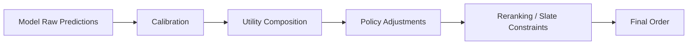

------
title: Build From Scratch Recommendations System - Part 041
description: Mendesain score calibration dan score composition production-grade: probability calibration, source score normalization, utility composition, calibration by segment, drift, guardrails, score debugging, dan governance.
series: learn-build-from-scratch-recommendations-system
seriesTitle: Build From Scratch: Enterprise Recommendations System
order: 41
partTitle: Score Calibration and Score Composition
tags:
  - recommendation-system
  - recsys
  - ranking
  - calibration
  - score-composition
  - mlops
  - series
date: 2026-07-02
---

# Part 041 — Score Calibration and Score Composition

Production recommendation system menggabungkan banyak score:

- retrieval score,
- two-tower dot product,
- content similarity,
- item-to-item similarity,
- graph PPR score,
- popularity score,
- GBDT score,
- deep ranker predictions,
- `p_click`,
- `p_purchase`,
- `p_hide`,
- business value,
- freshness boost,
- quality penalty,
- exploration propensity.

Masalahnya: tidak semua score punya makna yang sama.

`0.8` dari cosine similarity tidak sama dengan `0.8` dari calibrated click probability.  
`8.5` dari dot product tidak sama dengan `8.5` dari GBDT raw margin.  
Rank `1` dari trending source tidak sama dengan rank `1` dari personalized retrieval.  
`p_purchase=0.01` mungkin tinggi untuk kategori tertentu, tetapi rendah untuk kategori lain.

Jika score digabung sembarangan, ranking menjadi tidak stabil, tidak bisa diaudit, dan sering menghasilkan trade-off salah.

Part ini membahas score calibration dan score composition production-grade: kapan perlu kalibrasi, bagaimana mengkalibrasi, cara menormalisasi source score, komposisi multi-task utility, segment calibration, drift, debugging, dan governance.

---

## 1. Mental Model: Score Has Semantics

Setiap score harus menjawab:

```text
Apa makna angka ini?
```

Contoh:

```text
p_click = estimated probability user clicks candidate within 30m
p_purchase = estimated probability purchase within 7d
two_tower_score = inner product in retrieval embedding space
content_similarity = cosine similarity between query/session and item content
popularity_score = smoothed engagement rate in segment
utility_score = composed expected utility from predictions and policy weights
```

Jika semantics tidak jelas, score tidak boleh digabung.

Score contract:

```yaml
score_name: p_purchase_7d
meaning: probability of purchase within 7 days after impression
range: 0..1
calibrated: true
calibration_version: purchase-calibration-v3
segment_scope:
  - surface
  - category
  - region
```

---

## 2. Ranking Score Types

Common score types:

### Probability Score

```text
P(click)
P(purchase)
P(hide)
```

Range 0..1. Ideally calibrated.

### Similarity Score

```text
cosine
dot product
BM25
graph proximity
```

Not probability.

### Rank-Based Score

```text
source rank
inverse rank
percentile rank
```

Relative within source/request.

### Raw Model Margin

```text
GBDT raw margin
neural logit
```

Not probability until transformed/calibrated.

### Utility Score

```text
weighted composition of predicted outcomes
```

May be any real value.

### Constraint/Penalty Score

```text
freshness penalty
repetition penalty
quality risk
```

Usually policy-defined.

---

## 3. Calibration Definition

A probability prediction is calibrated if:

```text
Among candidates predicted 0.10 probability, about 10% actually happen.
```

Example:

```text
predicted p_click = 0.05
actual click rate in that bucket ≈ 5%
```

Calibration is different from ranking quality.

A model can rank well but be poorly calibrated.

A model can be calibrated but not rank well.

For utility composition, calibration matters.

---

## 4. Why Calibration Matters

Calibration matters when score is used as expected value.

Example:

```text
expected_margin = p_purchase * margin
```

If `p_purchase` is 2x overestimated for expensive items, ranking over-promotes expensive items.

Example negative objective:

```text
expected_risk = p_report * report_cost
```

If `p_report` is under-calibrated for new items, unsafe/low-quality items may get too much exposure.

Multi-objective ranking depends on calibrated task predictions.

---

## 5. Calibration Is Segment-Specific

Global calibration can look good while segment calibration is bad.

Segments:

```text
surface
category
region
locale
item age
user tenure
candidate source
device
price bucket
tenant
role/workflow
```

Example:

```text
p_purchase calibrated overall
but overestimates new items
and underestimates repeat-purchase consumables
```

Monitor calibration by important segments.

---

## 6. Calibration Curves

Calibration curve:

1. Bucket predictions.
2. For each bucket, compare average predicted probability vs actual rate.

Example:

| Prediction Bucket | Avg Predicted | Actual Rate |
|---|---:|---:|
| 0.00-0.01 | 0.006 | 0.005 |
| 0.01-0.03 | 0.020 | 0.017 |
| 0.03-0.05 | 0.041 | 0.052 |
| 0.05-0.10 | 0.071 | 0.090 |

If actual > predicted, model underestimates.  
If actual < predicted, model overestimates.

Metrics:

```text
Expected Calibration Error
Brier Score
log loss
calibration slope/intercept
```

---

## 7. Calibration Methods

Common methods:

### Platt Scaling

Fit logistic regression on raw score/logit.

```text
calibrated = sigmoid(a * raw_score + b)
```

Simple and stable.

### Isotonic Regression

Non-parametric monotonic mapping.

More flexible, can overfit if data small.

### Temperature Scaling

Mostly for neural logits.

```text
calibrated = sigmoid(logit / T)
```

### Segment Calibration

Separate calibration per segment or with segment features.

### Beta Calibration / Other Methods

More advanced, use when needed.

Start simple: Platt or isotonic with validation data.

---

## 8. Calibration Data

Calibration must use held-out data not used for model training.

Use:

```text
train model on train period
fit calibration on validation period
evaluate on later test period
```

Do not calibrate on future/test data.

Calibration should match serving distribution:

- same candidate sources,
- same eligibility filters,
- same surface,
- same label maturity,
- same feature definitions.

If candidate distribution changes, calibration can drift.

---

## 9. Calibration by Source

Predictions may be differently calibrated by candidate source.

Example:

```text
p_click for two_tower candidates
p_click for editorial candidates
p_click for exploration candidates
```

Same model score can mean different actual rate because candidate source changes prior distribution.

Features can include source flags, but calibration monitoring by source remains important.

If needed:

```text
calibration model includes source
```

or:

```text
source-specific calibration
```

---

## 10. Calibration by Item Age

New items often poorly calibrated.

Warm items have behavior features. New items rely on priors/content.

Monitor:

```text
item_age < 1d
item_age 1-7d
item_age 7-30d
item_age > 30d
```

If new-item p_click/p_purchase is overestimated, exploration may harm users.  
If underestimated, new items starve.

Cold-start calibration is important.

---

## 11. Calibration by Position

Training labels are affected by position.

Serving model predicts candidate probability before final position, but actual click depends on position.

Possible definitions:

### Position-Independent Relevance Probability

Hard to observe.

### Position-Conditional Click Probability

```text
P(click | candidate, context, position)
```

If model includes position, it predicts UI outcome, not pure relevance.

For ranking before position assignment, avoid using final position as feature.

But for final slate simulation/calibration, position effects may be modeled separately.

---

## 12. Ranking Score vs Display Probability

If candidate at position 1 gets more clicks than at position 10, model score alone is not enough to estimate final slate clicks.

Need distinction:

```text
relevance_score
examination_probability(position)
display_click_probability = relevance * examination
```

For many systems, ranker learns from historical position-biased data. Be aware.

Advanced systems use propensity/examination models. For now, log position and evaluate carefully.

---

## 13. Source Score Normalization

Candidate sources output incompatible scores.

Examples:

```text
two_tower dot product: -5..15
content cosine: -1..1
BM25: 0..100
PPR: 0..0.02
popularity CTR: 0..0.5
editorial priority: 1..10
```

For ranker features, provide raw score plus normalized features.

Options:

```text
source_rank
source_rank_inverse
source_score_percentile
source_score_zscore
source_score_minmax
source_score_bucket
```

Raw score can be useful, but model needs context.

---

## 14. Rank-Based Normalization

Rank-based normalization is robust.

```text
rank_inverse = 1 / log2(rank + 1)
```

Example:

```text
rank 1 -> 1.0
rank 2 -> 0.63
rank 10 -> 0.29
rank 100 -> 0.15
```

Rank has stable meaning within source: earlier candidate is better according to source.

Use along with source ID.

---

## 15. Percentile Normalization

Within a source result set:

```text
percentile = rank percentile or score percentile
```

Example:

```text
candidate in top 5% of content source
```

This is more comparable across requests/sources than raw score.

But percentile loses absolute strength.

If source returns only weak candidates, top percentile may still be bad.

Include both raw and percentile.

---

## 16. Score Z-Score

Within source/request:

```text
z = (score - mean_score) / std_score
```

Useful when score distribution varies.

Problems:

- unstable if few candidates,
- outlier sensitive,
- assumes distribution meaningful.

Use cautiously.

---

## 17. Min-Max Normalization

```text
norm = (score - min) / (max - min)
```

Simple but sensitive to outliers.

If all scores close, small differences get amplified.

Usually less robust than rank/percentile.

---

## 18. Raw Model Logits

Neural/GBDT may output raw logits/margins.

Transform:

```text
prob = sigmoid(logit)
```

But sigmoid output may still not be calibrated.

Calibration layer:

```text
prob_calibrated = calibration(sigmoid_or_logit)
```

Store:

```text
raw_score
calibrated_score
calibration_version
```

For debugging, raw and calibrated both useful.

---

## 19. Utility Composition

Utility composition combines calibrated predictions.

Example:

```text
utility =
  0.5 * p_click
  + 20.0 * p_purchase
  - 5.0 * p_hide
  - 100.0 * p_report
```

This is expected value thinking.

But utility score itself is not probability.

It is ranking decision score under policy version.

Score contract:

```yaml
score_name: home_utility_score
inputs:
  - p_click_calibrated
  - p_purchase_calibrated
  - p_hide_calibrated
  - p_report_calibrated
policy_version: home-utility-v8
range: unbounded real
higher_is_better: true
```

---

## 20. Score Composition Layers

Recommended layers:

```text
model prediction
-> calibration
-> utility composition
-> policy adjustments
-> reranking constraints
```

Diagram:



Keep layers separate for debugging.

---

## 21. Business Value Composition

For e-commerce:

```text
expected_profit =
  p_purchase * margin
  - p_return * return_cost
  - p_support_contact * support_cost
```

But user value matters.

```text
utility =
  expected_profit
  + user_satisfaction_value * p_satisfaction
  - trust_cost * p_hide
```

If margin dominates, recommendations degrade long-term trust.

Use guardrails and relevance floors.

---

## 22. Risk-Aware Composition

For high-risk negative outcomes:

```text
risk_cost = p_report * report_cost
```

If report/severe harm is rare but costly, even small probability matters.

However for true policy/safety violations, do not rely on probability penalty. Hard filter.

Use risk-aware composition for soft risk, not illegal/forbidden candidates.

---

## 23. Quality Adjustments

Quality can enter as:

### Feature in model

Model learns effect.

### Utility multiplier

```text
utility *= quality_multiplier
```

### Penalty

```text
utility -= low_quality_penalty
```

### Hard gate

```text
if quality < min: filter
```

Which one depends on severity.

For catalog quality threshold, hard gate may be better.  
For minor quality differences, rank feature/penalty.

---

## 24. Freshness Composition

Freshness can be:

- positive for news/new arrivals,
- negative for stale content,
- neutral for evergreen items.

Freshness boost:

```text
freshness_boost = alpha * exp(-item_age / tau)
```

But blind freshness boost can overexpose low-quality new items.

Use:

```text
freshness * quality * eligibility * exploration policy
```

Freshness policy should be surface/category-specific.

---

## 25. Exploration and Propensity

Exploration may override pure utility slightly.

Example:

```text
final_score = utility + exploration_bonus
```

But exploration should log propensity.

Candidate:

```json
{
  "source": "new_item_exploration",
  "propensity": 0.02,
  "exploration_policy": "cold-item-v3"
}
```

Exploration score adjustment must be controlled, capped, and monitored.

Do not hide exploration as organic score.

---

## 26. Sponsored Score Composition

Sponsored candidate may have bid and predicted relevance.

Example:

```text
ad_score = bid * p_click * quality
```

But organic recommendation and sponsored ranking need disclosure and constraints.

Do not mix sponsored and organic silently.

If system includes sponsored candidates, score contract must include:

```text
campaign_id
bid
disclosure_required
relevance_floor
frequency_cap
```

---

## 27. Score Clipping

Extreme scores can dominate.

Use clipping:

```text
p in [epsilon, 1-epsilon]
utility contribution capped
boost capped
penalty capped
```

Example:

```text
freshness_boost <= 0.2
business_boost <= 0.1 * base_score_range
```

Unbounded boosts are dangerous.

---

## 28. Score Monotonicity

Some signals should behave monotonically.

Examples:

```text
higher p_report should not increase utility
higher item_quality should not decrease utility all else equal
higher seen_count should not increase repetition unless domain allows
```

GBDT/deep models may violate intuitive monotonicity.

Options:

- monotonic constraints if supported,
- explicit composition layer,
- post-score adjustments,
- tests.

For policy-critical scoring, explicit composition is safer.

---

## 29. Relevance Floor

Business/freshness/exploration boosts should not promote irrelevant items.

Use relevance floor:

```text
if p_relevance < min:
    candidate cannot be boosted into final slate
```

Or:

```text
exploration candidates must pass quality and relevance threshold
```

This protects user experience.

---

## 30. Score Debugging

For a candidate, debug should show:

```json
{
  "item_id": "item_123",
  "raw_predictions": {
    "click_logit": 1.2,
    "purchase_logit": -4.1
  },
  "calibrated_predictions": {
    "p_click": 0.071,
    "p_purchase": 0.004,
    "p_hide": 0.012
  },
  "utility_components": {
    "click": 0.028,
    "purchase": 0.080,
    "hide": -0.060
  },
  "policy_adjustments": {
    "freshness_boost": 0.020,
    "repetition_penalty": -0.030
  },
  "final_score": 0.038
}
```

Without component debugging, score composition becomes opaque.

---

## 31. Score Logging

Log:

```text
raw model scores
calibrated scores
calibration version
utility policy version
utility components
policy boosts/penalties
final score
rank before/after rerank
```

For sampled candidate pool and final slate.

This enables:

- calibration analysis,
- utility debugging,
- offline simulation,
- policy audit,
- incident review.

---

## 32. Calibration Drift

Calibration can drift due to:

- UI change,
- candidate source change,
- seasonality,
- catalog shift,
- user behavior shift,
- model retrain,
- feature pipeline change,
- policy change.

Monitor calibration over time.

If drift detected:

- recalibrate,
- retrain,
- segment recalibration,
- rollback model/source change.

Calibration layer can be updated more frequently than model if stable.

---

## 33. Score Distribution Monitoring

Monitor:

```text
raw score distribution
calibrated prediction distribution
utility distribution
component contribution distribution
top score concentration
score by source
score by segment
```

Sudden shift indicates:

- model bug,
- feature drift,
- calibration mismatch,
- source distribution change.

Example alert:

```text
p_click p95 doubles after deploy
```

Investigate before ramping.

---

## 34. Calibration After Candidate Source Change

If new source added, calibration can change.

Why?

Candidate pool distribution changes.

Example:

- old candidates mostly popularity/source A,
- new source brings semantic long-tail,
- model predictions for long-tail are under-calibrated.

Need:

- shadow log new source,
- calibrate with new distribution,
- retrain ranker if needed,
- monitor by source.

---

## 35. Calibration for Rare Events

Rare tasks:

```text
report
return
unsubscribe
policy issue
```

Hard to calibrate due to low counts.

Strategies:

- aggregate over longer window,
- segment less granularly,
- use Bayesian smoothing,
- use risk tiers,
- combine with rule/safety models,
- treat as guardrail/hard filter when severe.

Do not overtrust tiny rare-event probabilities.

---

## 36. Calibration for Enterprise

Enterprise outcomes often sparse and delayed.

Examples:

```text
case resolution success
rework
policy violation
SLA improvement
```

Calibration needs domain review.

For high-stakes action ranking, predicted probability should not be sole decision. Use:

- hard rules,
- expert validation,
- calibrated risk tiers,
- confidence intervals,
- audit logs.

Score composition should be explainable.

---

## 37. Confidence and Uncertainty

Predicted score should ideally include uncertainty.

Useful for:

- cold-start,
- rare categories,
- low-support items,
- exploration,
- risk management.

Approximate uncertainty features:

```text
training support count
item impression count
feature missing count
model ensemble variance
prediction interval
calibration bucket support
```

Use uncertainty to:

- avoid overconfident cold items,
- guide exploration,
- require fallback/human review.

---

## 38. Score Composition Testing

Test utility composer:

```text
higher p_purchase increases score
higher p_hide decreases score
higher p_report decreases score strongly
freshness boost capped
business boost cannot override relevance floor
NaN predictions rejected
missing calibration version fails
```

Unit tests for score composition are essential.

Score bugs can alter product behavior drastically.

---

## 39. Policy Versioning

Utility policy must be versioned.

```yaml
utility_policy: home-feed-utility-v9
weights:
  p_click: 0.4
  p_purchase: 20.0
  p_hide: -5.0
  p_report: -100.0
boosts:
  freshness_max: 0.2
  exploration_max: 0.1
constraints:
  relevance_floor: 0.01
owner: ranking-platform
approved_at: 2026-07-02
```

Log policy version with every response.

---

## 40. Offline Simulation of Score Policies

Before changing weights:

1. Replay logged candidate sets.
2. Apply new score composition.
3. Compare final order.
4. Measure proxy metrics.
5. Inspect source/category/new-item distribution.
6. Check guardrail predictions.
7. Run shadow/canary.

Offline simulation is not proof, but catches obvious issues.

---

## 41. A/B Testing Score Composition

Score composition change can be tested without retraining model.

Experiment:

```text
same model predictions
different utility weights
```

This isolates policy effect.

Metrics:

- primary objective,
- negative feedback,
- conversion,
- retention,
- diversity,
- source mix,
- latency unchanged.

Useful for product tuning.

---

## 42. Common Anti-Patterns

### 42.1 Add Raw Scores from Different Sources

Cosine + dot product + CTR without normalization.

### 42.2 Treat Raw Logit as Probability

Wrong expected utility.

### 42.3 No Segment Calibration

Global calibrated, segment broken.

### 42.4 Hard Safety as Soft Penalty

Unsafe candidates can still win.

### 42.5 Hidden Business Weights

No governance/audit.

### 42.6 Unbounded Boosts

Freshness/business/exploration dominates relevance.

### 42.7 Calibration on Test/Future Data

Offline results inflated.

### 42.8 No Component Logging

Cannot debug score behavior.

### 42.9 Score Policy Changed Without Experiment

Product behavior shifts silently.

### 42.10 Rare Risk Prediction Overtrusted

High-stakes bad decisions.

---

## 43. Implementation Sketch: Calibration Layer

```java
public interface Calibrator {
    double calibrate(String taskName, double rawScore, CalibrationContext context);
}

public record CalibrationContext(
    String surface,
    String category,
    String source,
    String segment,
    String calibrationVersion
) {}
```

Example Platt calibrator:

```java
public final class PlattCalibrator implements Calibrator {
    private final Map<String, Parameters> paramsBySegment;

    public double calibrate(String taskName, double rawScore, CalibrationContext context) {
        Parameters p = paramsBySegment.getOrDefault(context.segment(), paramsBySegment.get("global"));
        return sigmoid(p.a() * rawScore + p.b());
    }

    private double sigmoid(double x) {
        return 1.0 / (1.0 + Math.exp(-x));
    }
}
```

Production version needs task-specific params, versioning, and fallback.

---

## 44. Implementation Sketch: Utility Composer

```java
public final class UtilityComposer {
    private final UtilityPolicy policy;

    public UtilityResult compose(CalibratedPredictions p, CandidateContext c) {
        Map<String, Double> components = new LinkedHashMap<>();

        components.put("click", policy.weight("p_click") * p.pClick());
        components.put("purchase", policy.weight("p_purchase") * p.pPurchase());
        components.put("hide", -policy.weight("p_hide") * p.pHide());
        components.put("report", -policy.weight("p_report") * p.pReport());

        double base = components.values().stream().mapToDouble(Double::doubleValue).sum();

        double freshness = cappedFreshnessBoost(c);
        double repetition = repetitionPenalty(c);

        double finalScore = base + freshness - repetition;

        return new UtilityResult(finalScore, components, Map.of(
            "freshness_boost", freshness,
            "repetition_penalty", repetition
        ), policy.version());
    }
}
```

Use explicit signs carefully. Many bugs come from negative weight mistakes.

---

## 45. Minimal Production Calibration Plan

Start with:

```yaml
tasks:
  - click_30m
  - purchase_7d
  - hide_7d
calibration:
  method: platt_or_isotonic
  data: validation_period_after_training
  segments:
    - surface
    - major_category
    - candidate_source
monitoring:
  - calibration_curve
  - expected_calibration_error
  - score_distribution
utility:
  policy_versioned: true
  components_logged: true
guardrails:
  - report_rate
  - hide_rate
  - return_rate
  - latency
```

For rare report/safety, use guardrails and policy filters, not only calibrated model.

---

## 46. Checklist Score Calibration and Composition Readiness

```text
[ ] Every score has documented semantics.
[ ] Raw model scores are distinguished from probabilities.
[ ] Task predictions are calibrated if used as probabilities.
[ ] Calibration data is held-out and temporal.
[ ] Calibration is monitored globally and by segment.
[ ] Candidate source scores are normalized before broad use.
[ ] Utility composition policy is versioned.
[ ] Loss weights are not confused with utility weights.
[ ] Hard constraints remain filters.
[ ] Boosts and penalties are capped.
[ ] Relevance floors exist where needed.
[ ] Score components are logged.
[ ] Calibration version and utility policy version are logged.
[ ] Offline score-policy simulation exists.
[ ] A/B testing is used for major score policy changes.
[ ] Rare/high-risk tasks are handled conservatively.
```

---

## 47. Kesimpulan

Score calibration dan composition adalah lapisan yang membuat ranking multi-signal bisa dipercaya.

Prinsip utama:

1. Every score needs semantics.
2. Similarity, rank, logit, probability, and utility are different.
3. Calibration means predicted probability matches observed frequency.
4. Calibration matters for expected value and multi-objective ranking.
5. Calibration must be monitored by segment.
6. Source scores should not be mixed raw.
7. Utility composition should use calibrated predictions and versioned weights.
8. Hard safety/access/policy constraints must remain filters.
9. Boosts/penalties need caps and relevance floors.
10. Score components must be logged for debugging and governance.

Di Part 042, kita akan membahas **Ranking Service Design**: bagaimana membangun service ranking production-grade yang menerima candidate pool, fetch feature, score batch, compose utility, expose debug traces, memenuhi latency SLO, dan aman dioperasikan.
