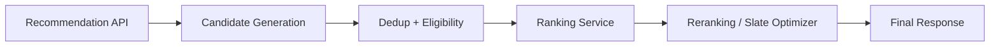
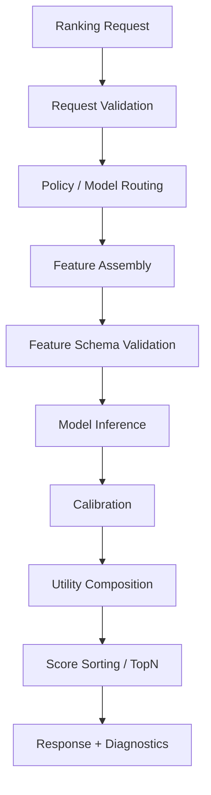
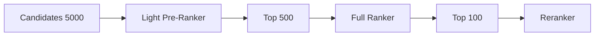

------
title: Build From Scratch Recommendations System - Part 042
description: Mendesain ranking service production-grade: API contract, feature assembly, batch scoring, model routing, utility composition, latency budget, fallback, shadow/canary, debug traces, observability, dan deployment.
series: learn-build-from-scratch-recommendations-system
seriesTitle: Build From Scratch: Enterprise Recommendations System
order: 42
partTitle: Ranking Service Design
tags:
  - recommendation-system
  - recsys
  - ranking-service
  - system-design
  - model-serving
  - mlops
  - series
date: 2026-07-02
---

# Part 042 — Ranking Service Design

Ranking model tidak hidup di notebook.

Production recommendation system membutuhkan **Ranking Service** yang:

- menerima candidate pool,
- mengambil feature,
- membangun feature matrix/tensor,
- memilih model yang benar,
- menjalankan batch scoring,
- mengkalibrasi predictions,
- menyusun utility score,
- mengembalikan scored candidates,
- memenuhi latency SLO,
- degrade gracefully saat dependency bermasalah,
- mendukung shadow/canary,
- memberikan debug trace,
- dan aman untuk rollback.

Ranking service adalah salah satu service paling kritikal dalam online serving path.

Part ini membahas desain ranking service production-grade: API contract, feature assembly, model routing, batch inference, score composition, latency budget, fallback, observability, deployment, dan failure modes.

---

## 1. Mental Model: Ranking Service as Decision Scoring Layer

Ranking service berada setelah candidate generation/filtering dan sebelum reranking/slate construction.



Input:

```text
valid candidate pool + request context
```

Output:

```text
scored candidates + predictions + diagnostics
```

Ranking service should not generate candidates.  
Ranking service should not enforce all slate constraints.  
Ranking service scores valid candidates.

---

## 2. Ranking Service Responsibilities

Core responsibilities:

1. Validate request.
2. Resolve ranking policy/model.
3. Assemble features.
4. Batch score candidates.
5. Calibrate predictions.
6. Compose utility score.
7. Return scores and diagnostics.
8. Support debug mode.
9. Log model/feature/policy versions.
10. Handle fallback/degradation.

Non-responsibilities:

- raw event ingestion,
- long-term training,
- final eligibility hard filters,
- full slate optimization,
- business campaign management,
- UI rendering.

Boundaries matter.

---

## 3. Ranking Request Contract

Example request:

```json
{
  "request_id": "req_001",
  "surface": "home_feed",
  "subject": {
    "user_id": "u123",
    "anonymous_id": "anon_456",
    "session_id": "sess_789",
    "tenant_id": null
  },
  "context": {
    "request_time": "2026-07-02T10:00:00Z",
    "region": "ID",
    "locale": "id-ID",
    "device_type": "mobile",
    "privacy_mode": "personalized",
    "surface_context": {
      "placement": "main_feed",
      "page_index": 0
    }
  },
  "candidates": [
    {
      "item_id": "item_123",
      "item_type": "product",
      "sources": [
        {
          "source": "two_tower",
          "score": 8.42,
          "rank": 12,
          "score_type": "inner_product",
          "version": "two-tower-20260702"
        }
      ],
      "metadata": {
        "dedup_group_id": "family_123"
      }
    }
  ],
  "ranking_policy": {
    "policy_hint": "default"
  },
  "debug": {
    "enabled": false
  }
}
```

Request should contain enough context for feature assembly and model routing.

---

## 4. Ranking Response Contract

Example response:

```json
{
  "request_id": "req_001",
  "ranking_model": {
    "model_name": "home_feed_ranker",
    "model_version": "home-ranker-20260702",
    "feature_set_version": "home-features-v18",
    "utility_policy_version": "home-utility-v7"
  },
  "scored_candidates": [
    {
      "item_id": "item_123",
      "model_score": 0.184,
      "rank_score": 0.213,
      "predictions": {
        "p_click": 0.071,
        "p_purchase": 0.004,
        "p_hide": 0.012
      },
      "score_components": {
        "click": 0.028,
        "purchase": 0.080,
        "hide": -0.060,
        "freshness_boost": 0.020
      },
      "diagnostics": {
        "feature_missing_count": 2
      }
    }
  ],
  "diagnostics": {
    "candidate_count": 800,
    "feature_fetch_latency_ms": 22,
    "model_latency_ms": 11,
    "total_latency_ms": 41,
    "fallback_used": false
  }
}
```

Response should be useful to reranker and logs.

---

## 5. Internal Pipeline



Each stage should expose latency and errors.

---

## 6. Model Routing

Model may depend on:

- surface,
- tenant,
- experiment,
- privacy mode,
- item type,
- language/region,
- request type,
- model canary.

Example routing:

```yaml
route: ranking.home_feed
default_model: home-ranker-v12
experiments:
  deep_ranker_test:
    treatment: home-deep-ranker-v2
privacy:
  non_personalized: home-nonpersonal-ranker-v3
fallback_model: home-baseline-ranker-v1
```

Do not hardcode model version in service code.

Use registry/config.

---

## 7. Model Bundle

Ranking model deployment should be bundle.

Bundle includes:

```yaml
model_version: home-ranker-20260702
model_artifact: ...
feature_set_version: home-features-v18
feature_schema: ...
calibration_version: home-calibration-v5
utility_policy_version: home-utility-v7
categorical_vocab_versions:
  category: category-v6
normalization_stats_version: norm-v4
runtime: gbdt-runtime-v3
```

Serving must load compatible bundle atomically.

---

## 8. Feature Assembly

Feature assembly converts context + candidates into feature matrix.

Inputs:

```text
request context
subject/user profile
candidate item metadata
candidate source evidence
session state
item features
cross features
exposure history
```

Output:

```text
feature matrix/tensor: candidates x features
```

Feature assembly is often more complex than model inference.

---

## 9. Feature Fetch Sources

Ranking service may call:

- user profile store,
- feature store,
- item catalog store,
- session state store,
- exposure/suppression store,
- vector/embedding store,
- candidate provenance data,
- business config store.

Design must avoid too many remote calls.

Use batch APIs.

```text
fetch item features for all candidates in one call
fetch exposure features for all item IDs in one call
```

---

## 10. Feature Assembly Ownership

Two design options:

### Ranking Service Owns Feature Assembly

Pros:

- model-specific control,
- tight validation,
- one service.

Cons:

- ranking service gets heavy,
- duplicate feature logic across services/models.

### Feature Service/Assembler Separate

Pros:

- reusable,
- centralized parity,
- easier feature governance.

Cons:

- extra dependency,
- latency,
- ownership complexity.

Common: ranking service orchestrates a shared feature assembler/library.

---

## 11. Feature Matrix Validation

Before inference:

```text
required features present
feature types correct
dimensions correct
categorical vocab valid
missing/default policy applied
feature timestamps acceptable
feature set version compatible
```

In production hot path, validation may be sampled/optimized, but must exist.

Invalid feature matrix should trigger fallback rather than nonsense scoring.

---

## 12. Batch Scoring

Rank candidates in batch.

Bad:

```text
for each candidate:
    call model server
```

Good:

```text
scoreBatch(featureMatrix)
```

Batch scoring improves:

- latency,
- throughput,
- CPU/GPU utilization,
- model server efficiency.

Ranking response should preserve candidate mapping.

---

## 13. Candidate Count Control

Ranking cost scales with candidate count.

Policy:

```yaml
max_candidates_to_rank: 1000
pre_rank_if_above: 2000
max_candidates_deep_ranker: 500
```

If candidate pool too large:

- pre-rank with cheap model,
- use source rank pruning,
- sample/limit per source,
- return error only if invalid request.

Do not let candidate generation flood ranker.

---

## 14. Two-Stage Ranking Service

Two-stage pattern:



Pre-ranker uses cheap features.

Full ranker uses expensive features/deep model.

Ranking service can own both stages or call separate services.

---

## 15. Calibration and Utility in Service

Ranking model may output raw predictions.

Ranking service applies:

1. calibration,
2. utility composition,
3. policy boosts/penalties.

This makes objective policy changeable without retraining model.

Example:

```text
raw p_click logit -> calibrated p_click -> utility component
```

All versions should be logged.

---

## 16. Sorting and Top-N

Ranking service can return all scored candidates or top-N.

Option:

```text
return top 500 scored for reranker
```

If reranker needs diversity across categories/source, returning only top 50 may starve it.

Policy should define:

```yaml
ranker_return_top_n: 500
```

Reranker needs enough candidates.

---

## 17. Latency Budget

Example online recommendation budget:

```text
total request: 200ms
candidate generation: 60ms
eligibility: 30ms
ranking service: 60ms
reranking/response: 30ms
buffer: 20ms
```

Ranking service budget breakdown:

```text
request validation: 1ms
feature fetch: 25ms
feature assembly: 10ms
model inference: 15ms
calibration/utility: 3ms
serialization: 3ms
buffer: 3ms
```

Feature fetch often dominates.

---

## 18. Latency Optimization

Strategies:

- batch feature fetch,
- cache user/session features,
- cache item static features,
- precompute item features,
- cap candidates,
- two-stage ranking,
- colocate feature store/cache,
- use efficient model runtime,
- avoid per-candidate remote calls,
- async parallel fetch,
- timeout dependencies.

Measure before optimizing.

---

## 19. Dependency Timeouts

Every dependency needs timeout.

```yaml
feature_store_timeout_ms: 20
profile_store_timeout_ms: 10
embedding_store_timeout_ms: 10
model_inference_timeout_ms: 25
```

If dependency times out:

- use default/stale feature if safe,
- fallback model,
- skip expensive feature group,
- return baseline scores.

Failure policy should be explicit per feature/model.

---

## 20. Fallback Strategies

Fallbacks:

### Feature Fallback

Use default/stale value with missing indicator.

### Model Fallback

Use simpler model.

### Score Fallback

Use candidate source score/popularity.

### Service Fallback

Return candidates in safe baseline order.

Example hierarchy:

```text
deep ranker
-> GBDT ranker
-> source score ranker
-> popularity/editorial order
```

Do not return random order if ranker fails.

---

## 21. Fallback Score Ranker

Simple fallback:

```text
score =
  source_priority
  + normalized_source_rank
  + item_quality
  - seen_penalty
```

This can run without model service.

Useful during model outage.

Fallback should still respect eligibility and suppression.

---

## 22. Fail-Open vs Fail-Closed

Ranking model failure usually can fallback.

But if ranking service also performs critical policy score? It should not. Hard eligibility should happen before and after.

For enterprise high-stakes ranking:

- if model fails, use deterministic safe action ordering,
- never invent invalid action,
- keep audit trail.

Ranking service should degrade to safe baseline.

---

## 23. Shadow Models

Ranking service should support shadow scoring.

Shadow model:

- scores same requests,
- logs outputs,
- does not affect final ranking.

Use for:

- new model validation,
- feature parity,
- latency benchmark,
- score distribution comparison,
- offline/online consistency.

Request may score with production and shadow in parallel if latency budget allows, or asynchronously/sample.

---

## 24. Canary Models

Canary routes small percentage.

Example:

```yaml
model_route:
  production: home-ranker-v12
  canary:
    model: home-ranker-v13
    traffic_percent: 1
```

Need:

- deterministic assignment,
- experiment logging,
- rollback,
- guardrail monitoring.

Canary should be by user/session, not random per request, if user experience consistency matters.

---

## 25. Experiment Integration

Ranking service receives experiment assignment or resolves it.

Log:

```text
ranking_experiment_id
variant
model_version
utility_policy_version
feature_set_version
```

Experiments can change:

- model,
- features,
- utility weights,
- calibration,
- candidate count,
- fallback behavior.

Keep experiment logic controlled.

---

## 26. Debug Mode

Debug mode returns extra information.

Use for:

- internal engineer,
- offline replay,
- support tooling,
- model inspection.

Debug output:

```text
feature values
missing features
raw predictions
calibrated predictions
utility components
model version
feature versions
candidate source evidence
rank before/after
latency by stage
```

Debug mode must enforce access controls and avoid leaking sensitive data.

---

## 27. Production Logging

Ranking service should log:

```text
request_id
surface
model version
feature set version
utility policy version
candidate count
top scores
score components
feature missing summary
latency by stage
fallback used
errors
```

For candidates:

- final slate always,
- top-N ranked maybe,
- sampled full candidate pool.

Balance observability and cost/privacy.

---

## 28. Training Data Logging

To train future models, log enough:

```text
candidate features or feature snapshot refs
model scores
final positions
candidate source provenance
eligibility/filter info
experiment assignment
outcome labels later
```

If you only log final item IDs, training pipeline will be weak.

Feature logging strategy should be designed with cost controls.

---

## 29. Replay Support

Ranking service should support replay.

Given historical request:

```text
same candidates
same feature versions or snapshots
same model/policy
```

Replay helps:

- debug incident,
- compare model versions,
- offline simulation,
- reproduce bad recommendation.

Without replay, production ML debugging is painful.

---

## 30. Idempotency and Determinism

Ranking service should be deterministic for same input/model if no randomness.

If exploration/randomness needed, randomness should be controlled by seed and logged.

```text
random_seed = hash(request_id, experiment_id)
```

Determinism helps debugging.

---

## 31. Model Registry Integration

Ranking service loads models from registry.

Registry metadata:

```text
model_name
model_version
artifact URI
feature_set_version
calibration_version
utility_policy_version
training_dataset_version
status
owner
approval
```

Serving only loads approved production/canary models.

---

## 32. Safe Model Loading

Model deployment flow:

1. upload artifact,
2. validate artifact,
3. load in staging,
4. run smoke test,
5. shadow/canary,
6. promote,
7. monitor,
8. rollback if needed.

Ranking service should not load arbitrary unvalidated artifact.

---

## 33. Warmup

Before serving traffic:

- load model into memory,
- initialize runtime,
- load vocab/normalization,
- run sample inference,
- validate feature schema,
- health check.

Cold model load during request can spike latency.

Warmup is required.

---

## 34. Health Checks

Health endpoints:

```text
/service/health
/model/health
/model/version
/dependency/health
```

Check:

- model loaded,
- feature schema loaded,
- utility policy loaded,
- calibration loaded,
- dependencies reachable,
- sample score works.

Deep model health should include runtime readiness.

---

## 35. Ranking Service Observability

Metrics:

```text
qps
latency p50/p95/p99
error rate
timeout rate
candidate count
feature fetch latency
feature missing rate
model inference latency
fallback rate
score distribution
top score concentration
model version traffic
utility component distribution
```

By:

- surface,
- model version,
- feature set,
- region,
- tenant,
- experiment,
- candidate count bucket.

---

## 36. Model Quality Monitoring

Ranking service can emit online quality signals:

```text
score distribution drift
prediction calibration proxy
source contribution after ranking
ranked category distribution
new item exposure
long-tail exposure
negative feedback rate
```

Quality monitoring combines ranking logs and outcome events.

---

## 37. Alerts

Alert examples:

```text
ranking latency p95 > SLO
feature missing rate > threshold
fallback rate spike
model inference errors > threshold
score distribution shift
top item concentration spike
candidate count after ranking zero
model version traffic mismatch
```

For enterprise:

```text
unauthorized action ranked > 0
policy-required fallback triggered unexpectedly
```

---

## 38. Security and Access Control

Ranking service handles sensitive context.

Controls:

- authentication between services,
- authorization for debug mode,
- tenant isolation,
- no raw sensitive text in logs unless allowed,
- encryption in transit,
- audit access,
- least privilege to feature stores,
- model artifact integrity.

For enterprise, request context may contain confidential case data.

---

## 39. Privacy Modes

Ranking service must respect privacy mode.

If non-personalized:

- do not fetch behavioral user profile,
- do not use user embedding,
- use contextual features only,
- use non-personal ranker if needed.

Feature assembly should enforce privacy, not just model.

Log privacy mode.

---

## 40. Multi-Tenant Ranking

Options:

- shared ranker with tenant features,
- tenant-specific calibration,
- tenant-specific model,
- tenant-specific utility policy,
- tenant-specific feature availability.

For small tenants, shared model with strict data isolation and tenant config may be practical.

For sensitive tenants, separate model/index/features may be required.

Ranking service routing must include tenant.

---

## 41. Backward Compatibility

Clients and rerankers depend on response schema.

Version API carefully.

Add fields backward-compatibly.

Do not remove prediction fields without coordination.

Ranking response contract should be versioned.

```text
RankingResponseV1
RankingResponseV2
```

---

## 42. Ranking Service API Boundary

Should Rec API call ranking service over network or in-process?

### Network Service

Pros:

- independent deployment,
- language/runtime flexibility,
- shared by surfaces,
- model server abstraction.

Cons:

- network latency,
- operational dependency.

### In-Process Library

Pros:

- lower latency,
- simpler for small systems.

Cons:

- harder model runtime/versioning,
- redeploy app for model changes.

Large systems often use dedicated ranking/model serving service, with lightweight fallback in Rec API.

---

## 43. Java Integration Pattern

For Java microservices, typical:

```text
Rec API / Orchestrator in Java
Feature assembly mostly Java/shared libs
Model serving through:
  - optimized Java runtime for GBDT
  - remote model server for deep models
  - JNI/native runtime if needed
```

Keep contracts strongly typed:

```java
RankingRequest
RankingResponse
FeatureSchema
ModelMetadata
```

Avoid unstructured maps everywhere in core path unless feature system requires.

---

## 44. Schema-First API

Ranking service should have schema-first contract.

Example fields:

```yaml
RankingRequest:
  request_id
  surface
  subject
  context
  candidates
  debug

ScoredCandidate:
  item_id
  rank_score
  predictions
  score_components
  diagnostics
```

Use explicit optional fields and versioning.

Schema-first design helps multi-team integration.

---

## 45. Load Shedding

If system overloaded:

- reduce candidate count,
- skip shadow models,
- skip expensive feature groups,
- use pre-ranker only,
- use fallback model,
- shed low-priority surfaces,
- return safe cached/baseline ranking.

Define degradation order.

Do not let overload cascade into all Rec API failures.

---

## 46. Capacity Planning

Ranking capacity depends on:

```text
QPS
candidates per request
features per candidate
model inference cost
shadow/canary overhead
peak traffic
latency SLO
```

Estimate:

```text
scored_candidates_per_second = QPS * candidates_ranked
```

If:

```text
QPS = 1000
candidates = 500
```

then:

```text
500,000 candidate scores/sec
```

This is the real load.

---

## 47. Cost Controls

Cost levers:

- candidate cap,
- pre-ranking,
- model size,
- feature count,
- batch size,
- caching,
- sampling shadow traffic,
- separate heavy model for high-value surfaces,
- reduce debug logging volume,
- feature pruning.

Ranking cost should be tied to business value.

---

## 48. Incident Response

Ranking incidents:

- bad model deploy,
- feature missing spike,
- score distribution bug,
- latency outage,
- wrong utility weights,
- calibration mismatch,
- candidate source shift,
- privacy/tenant issue.

Runbook:

1. detect alert,
2. identify model/feature/policy version,
3. compare previous version,
4. rollback bundle,
5. switch fallback model if needed,
6. preserve logs,
7. postmortem.

Fast rollback is essential.

---

## 49. Common Failure Modes

### 49.1 Feature Schema Mismatch

Wrong columns/tensors cause bad scores.

### 49.2 Model Version and Feature Version Mismatch

Model expects features not available.

### 49.3 Calibration/Utility Policy Missing

Raw scores used incorrectly.

### 49.4 Per-Candidate Feature Calls

Latency collapse.

### 49.5 No Fallback

Model outage breaks recommendations.

### 49.6 Debug Logs Leak Sensitive Data

Security/privacy incident.

### 49.7 Shadow Model Doubles Latency

No sampling/budget.

### 49.8 Candidate Count Explosion

Ranker overloaded.

### 49.9 Stale Model Bundle

Old utility policy with new model.

### 49.10 No Replay

Bad recommendation cannot be investigated.

---

## 50. Implementation Sketch: Ranking Service

```java
public final class RankingService {
    private final RankingPolicyResolver policyResolver;
    private final FeatureAssembler featureAssembler;
    private final ModelRouter modelRouter;
    private final Calibrator calibrator;
    private final UtilityComposer utilityComposer;
    private final FallbackRanker fallbackRanker;

    public RankingResponse rank(RankingRequest request) {
        RankingPolicy policy = policyResolver.resolve(request);

        try {
            RankingModel model = modelRouter.resolve(policy, request);

            FeatureMatrix features = featureAssembler.assemble(
                request.context(),
                request.subject(),
                request.candidates(),
                model.metadata().featureSetVersion()
            );

            features.validateAgainst(model.metadata().featureSchema());

            List<RawPrediction> raw = model.scoreBatch(features);

            List<ScoredCandidate> scored = raw.stream()
                .map(pred -> {
                    CalibratedPredictions calibrated = calibrator.calibrate(pred, request.context());
                    UtilityResult utility = utilityComposer.compose(calibrated, pred.candidateContext());
                    return ScoredCandidate.from(pred.candidateId(), calibrated, utility);
                })
                .sorted(Comparator.comparing(ScoredCandidate::rankScore).reversed())
                .limit(policy.returnTopN())
                .toList();

            return RankingResponse.success(request.requestId(), model.metadata(), scored);

        } catch (Exception ex) {
            return fallbackRanker.rank(request, policy, ex);
        }
    }
}
```

Real production code should distinguish expected fallback errors vs critical bugs.

---

## 51. Implementation Sketch: Diagnostics

```java
public record RankingDiagnostics(
    int candidateCount,
    int rankedCount,
    Duration featureFetchLatency,
    Duration featureAssemblyLatency,
    Duration modelLatency,
    Duration calibrationLatency,
    Duration totalLatency,
    boolean fallbackUsed,
    Map<String, Integer> missingFeatureCounts,
    String modelVersion,
    String featureSetVersion,
    String utilityPolicyVersion
) {}
```

Diagnostics should be emitted as metrics and sampled logs.

---

## 52. Minimal Production Ranking Service Plan

Start with:

```yaml
api:
  schema_version: v1
  batch_scoring: true
routing:
  model_registry: true
  surface_based_model: true
features:
  batch_fetch: true
  schema_validation: true
  missing_indicators: true
model:
  gbdt_pointwise: initial
  fallback: source_score_ranker
score:
  calibration: click/purchase/hide
  utility_policy_versioned: true
observability:
  latency_by_stage: true
  feature_missing: true
  score_distribution: true
  fallback_rate: true
deployment:
  shadow: true
  canary: true
  rollback_bundle: true
debug:
  sampled_score_components: true
```

This is robust enough before adding deep ranker.

---

## 53. Checklist Ranking Service Readiness

```text
[ ] Ranking request/response schema is versioned.
[ ] Candidate source provenance is accepted.
[ ] Model routing is config/registry-driven.
[ ] Model bundle includes feature schema, calibration, utility policy.
[ ] Feature assembly uses batch fetch.
[ ] Feature schema validation exists.
[ ] Batch model inference exists.
[ ] Calibration layer is applied where needed.
[ ] Utility composition is versioned.
[ ] Latency budget is defined by stage.
[ ] Dependency timeouts exist.
[ ] Fallback ranker exists.
[ ] Shadow scoring is supported.
[ ] Canary rollout is supported.
[ ] Debug mode is access-controlled.
[ ] Logs include model/feature/policy versions.
[ ] Replay support exists or is planned.
[ ] Observability covers latency, missing features, score distribution, fallback.
[ ] Rollback switches compatible bundle.
[ ] Privacy/tenant modes are enforced in feature assembly.
```

---

## 54. Kesimpulan

Ranking service adalah operational wrapper yang membuat ranking model bisa bekerja aman di production.

Prinsip utama:

1. Ranking service scores valid candidates; it is not candidate generation or slate optimization.
2. Feature assembly is often the hardest and most expensive part.
3. Batch scoring is mandatory for efficiency.
4. Model, feature schema, calibration, utility policy, vocab, and normalization should deploy as bundle.
5. Routing should be config/registry-driven.
6. Latency budget must be broken down by stage.
7. Fallback ranking prevents model/dependency outages from breaking product.
8. Shadow/canary/rollback are required for safe model iteration.
9. Debug traces and replayability are essential for production ML.
10. Privacy, tenant, and access controls must be enforced in feature assembly and debug access.

Part ini menutup Module 5: Ranking Layer.

Di Part 043, kita masuk Module 6: **Re-ranking, Slate Optimization, dan Decision Policy**, dimulai dari **Reranking and Slate Construction** — bagaimana mengubah scored candidates menjadi final slate yang diverse, safe, non-repetitive, dan memenuhi product constraints.
