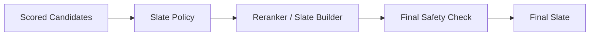

------
title: Build From Scratch Recommendations System - Part 043
description: Mendesain reranking dan slate construction production-grade: dari scored candidates menjadi final slate dengan constraints, diversity, dedup, frequency, source mix, business rules, exploration, safety checks, dan diagnostics.
series: learn-build-from-scratch-recommendations-system
seriesTitle: Build From Scratch: Enterprise Recommendations System
order: 43
partTitle: Reranking and Slate Construction
tags:
  - recommendation-system
  - recsys
  - reranking
  - slate-optimization
  - decision-policy
  - system-design
  - series
date: 2026-07-02
---

# Part 043 — Reranking and Slate Construction

Ranking service menghasilkan scored candidates.

Tetapi user tidak melihat “score”. User melihat **slate**: daftar final item/action/document dalam urutan tertentu, dengan slot, layout, constraint, diversity, frequency, policy, dan business rules.

Jika kita hanya mengambil top score:

```text
take top N by rank_score
```

kita sering mendapatkan masalah:

- item terlalu mirip,
- creator sama berulang,
- kategori sempit,
- item yang baru saja dilihat muncul lagi,
- source tertentu mendominasi,
- sponsored item terlalu banyak,
- exploration tidak terjadi,
- policy-required item tidak muncul,
- user fatigue meningkat,
- marketplace exposure tidak sehat,
- slate terasa monoton.

Reranking dan slate construction adalah lapisan yang mengubah score individual menjadi keputusan final yang layak ditampilkan.

Part ini membahas reranking/slate construction production-grade: constraints, greedy construction, score adjustment, dedup, diversity, frequency, source mix, exploration, business rules, final safety check, observability, dan failure modes.

---

## 1. Mental Model: Ranking Scores Items, Reranking Builds Experience

Ranking:

```text
candidate -> score
```

Reranking:

```text
scored candidates -> final slate
```

Slate is not just top-K.

Slate has structure:

```text
slot 1
slot 2
slot 3
...
```

and constraints:

```text
max same creator
min diversity
frequency cap
business rule
policy requirement
exploration slot
sponsored limit
dedup group
```

Diagram:



Reranking is where recommendation becomes product decision.

---

## 2. Why Reranking Exists

A pointwise ranker scores candidates independently.

It may not know:

- item A and B are duplicates,
- top 10 all same category,
- user has seen creator X too often,
- final slate needs one exploration item,
- slot 1 has special business constraint,
- sponsored disclosure limit,
- enterprise action checklist must include required step,
- final layout has carousel grouping.

Reranking handles list-level and policy-level considerations.

---

## 3. Slate-Level Objective

Final slate objective:

```text
maximize slate utility
subject to constraints
```

Not:

```text
maximize sum of individual scores blindly
```

Example:

```text
slate_utility =
  sum(item_utility)
  + diversity_bonus
  + novelty_bonus
  - repetition_penalty
  - fatigue_penalty
  + required_item_bonus
```

subject to:

```text
no invalid candidates
max same creator <= 2
sponsored <= 2
dedup group unique
policy required items included
```

Some constraints are hard; some are soft.

---

## 4. Slate Policy

Slate policy defines construction rules.

Example:

```yaml
surface: home_feed
slate_policy_version: home-slate-v7
final_size: 20
constraints:
  max_same_creator: 2
  max_same_category: 6
  max_sponsored: 2
  max_seen_recently: 3
  exact_dedup: true
  dedup_group_unique: true
diversity:
  category_diversity_weight: 0.15
  creator_diversity_weight: 0.10
exploration:
  min_new_item_slots_if_available: 1
  max_exploration_slots: 2
final_checks:
  eligibility_recheck: true
```

Policy should be versioned and logged.

---

## 5. Candidate Input to Reranker

Reranker input:

```json
{
  "item_id": "item_123",
  "rank_score": 0.214,
  "predictions": {
    "p_click": 0.071,
    "p_purchase": 0.004,
    "p_hide": 0.012
  },
  "metadata": {
    "category": "camera",
    "creator_id": "creator_9",
    "dedup_group_id": "family_123",
    "source_flags": ["two_tower", "content_based"],
    "is_sponsored": false,
    "is_exploration": false,
    "seen_count_7d": 1
  }
}
```

Reranker needs:

- score,
- item metadata,
- source/provenance,
- dedup group,
- category/creator,
- exposure/frequency,
- policy flags,
- exploration/sponsored indicators.

If metadata missing, reranker cannot enforce constraints.

---

## 6. Hard Constraints vs Soft Constraints

### Hard Constraints

Must not be violated.

Examples:

```text
no banned item
no unauthorized item
no duplicate item
max sponsored legal limit
required disclosure
tenant boundary
valid action only
```

If hard constraints fail, candidate is removed or slate invalid.

### Soft Constraints

Prefer but can trade off.

Examples:

```text
category diversity
novelty
freshness
long-tail exposure
source mix
visual variety
```

Soft constraints can be encoded as penalties/bonuses.

Do not treat legal/safety as soft.

---

## 7. Greedy Slate Construction

Common approach: greedy select one item at a time.

Algorithm:

```text
slate = []
while slate not full:
    choose candidate with best adjusted score
    if hard constraints pass:
        add to slate
    update slate state
```

Adjusted score depends on already selected items.

```text
adjusted_score(candidate, slate) =
  base_score
  + diversity_bonus(candidate, slate)
  - repetition_penalty(candidate, slate)
  - frequency_penalty(candidate)
```

Greedy is simple, fast, and effective.

---

## 8. Greedy Reranker Pseudocode

```java
public final class GreedySlateBuilder {
    public Slate build(List<ScoredCandidate> candidates, SlateContext context, SlatePolicy policy) {
        List<ScoredCandidate> remaining = new ArrayList<>(candidates);
        List<SlateItem> slate = new ArrayList<>();
        SlateState state = SlateState.empty();

        while (slate.size() < policy.finalSize() && !remaining.isEmpty()) {
            ScoredCandidate best = null;
            double bestScore = Double.NEGATIVE_INFINITY;

            for (ScoredCandidate candidate : remaining) {
                if (!policy.hardConstraintsPass(candidate, state, context)) {
                    continue;
                }

                double adjusted = policy.adjustedScore(candidate, state, context);
                if (adjusted > bestScore) {
                    best = candidate;
                    bestScore = adjusted;
                }
            }

            if (best == null) {
                break;
            }

            slate.add(SlateItem.from(best, slate.size(), bestScore));
            state = state.afterAdding(best);
            remaining.remove(best);
        }

        return new Slate(slate, state.diagnostics());
    }
}
```

This is not globally optimal, but often production-practical.

---

## 9. Score Adjustment

Adjusted score example:

```text
adjusted_score =
  rank_score
  - same_creator_penalty
  - same_category_penalty
  - seen_recently_penalty
  + novelty_bonus
  + exploration_bonus
  + required_business_bonus
```

Each component should be bounded.

Example:

```yaml
penalties:
  same_creator_after_first: 0.05
  same_category_after_3: 0.03
  seen_recently: 0.10
bonuses:
  fresh_item: 0.02
  exploration: 0.03
max_adjustment_abs: 0.20
```

Do not let arbitrary boosts dominate relevance unless explicitly intended.

---

## 10. Dedup in Slate Construction

Reranker should enforce:

```text
no same item_id
no same dedup_group_id if policy says unique
no same canonical document
no same video reupload
no same product family
```

Example:

```text
candidate A: sku_red_42 -> family_shoe_123
candidate B: sku_blue_43 -> family_shoe_123
```

If slate policy says family unique, choose one.

Selection of representative can happen before ranking, after ranking, or during reranking.

---

## 11. Category Diversity

If top scores all same category, slate can feel repetitive.

Constraint examples:

```text
max 5 items from same category in final 20
max 2 consecutive items from same category
min 3 distinct categories if available
```

Soft penalty:

```text
penalty = category_count_in_slate * category_penalty_weight
```

Hierarchy matters.

```text
camera/lens/tripod
```

may be same parent category but complementary.

Use taxonomy carefully.

---

## 12. Creator/Seller Diversity

Avoid overexposing one creator/seller.

Rules:

```text
max 2 items per creator
max 3 items per seller
max 1 sponsored item per campaign
max 2 articles per author
```

Marketplace health and user experience both benefit.

For enterprise:

```text
max repeated document owner
```

may be less relevant than policy validity.

Surface-specific rules.

---

## 13. Source Diversity

Candidate source dominance can make slate brittle.

Example:

```text
top 20 all from two_tower
```

Maybe good, maybe narrow.

Slate policy can enforce:

```text
at least 1 editorial if available
at least 1 exploration if eligible
max sponsored 2
max one source contributes 80%
```

Use source constraints cautiously. Source is not user-facing category; relevance should still matter.

---

## 14. Exploration Slots

Exploration is usually implemented in reranking/slate policy.

Example:

```yaml
exploration:
  min_slots_if_available: 1
  max_slots: 2
  eligible_positions:
    - 5
    - 10
```

Exploration candidate must pass:

- eligibility,
- quality,
- relevance floor,
- exposure cap,
- safety.

Exploration slot should log propensity.

---

## 15. Sponsored / Promoted Items

Sponsored/promoted items require:

- disclosure,
- frequency cap,
- relevance floor,
- policy compliance,
- max count,
- campaign budget,
- placement rules.

Example:

```yaml
sponsored:
  max_per_slate: 2
  allowed_positions: [2, 6, 10]
  relevance_floor: 0.01
  disclosure_required: true
```

Do not let sponsored source bypass normal safety/eligibility.

---

## 16. Frequency and Fatigue

Reranker can enforce:

```text
not seen item too recently
not too many from same creator
cooldown after no-click impressions
suppress already purchased/consumed
max repeated topic in week
```

Some are hard filters; some are penalties.

Example:

```text
if seen_count_7d >= 5:
    hard reject
else:
    penalty = seen_count_7d * 0.02
```

Fatigue control is critical for feed/email/push surfaces.

---

## 17. Position-Specific Rules

Some slots have special meaning.

Examples:

- first slot must be high confidence,
- top slot cannot be exploration,
- sponsored only in certain slots,
- policy-required action must appear above optional action,
- first item in email should be safe/high quality,
- hero card requires image.

Policy:

```yaml
slot_rules:
  1:
    min_quality: 0.8
    disallow_sources: [exploration]
  5:
    allow_exploration: true
```

Slot-aware reranking is often needed.

---

## 18. Layout-Aware Slate Construction

UI layout affects recommendation.

Examples:

- carousel,
- grid,
- hero card,
- mixed media modules,
- grouped sections,
- mobile vs desktop,
- email digest.

Slate construction may need:

```text
item must have image for hero
video duration constraints for row
product card price available
article card summary available
```

Ranking score alone does not know layout requirements.

---

## 19. Sectioned Slate

Some surfaces show sections:

```text
Recommended for you
Trending now
Because you viewed X
New arrivals
Required actions
```

Slate construction becomes module selection + item selection.

Options:

- rank modules first,
- fill each module with own reranker,
- global dedup across modules,
- enforce cross-module diversity.

Track module-level metrics.

---

## 20. Enterprise Slate Construction

Enterprise final slate might include:

```text
required actions
recommended actions
relevant articles
similar cases
warnings
```

Rules:

- policy-required actions first,
- invalid actions excluded,
- high-risk warnings prioritized,
- role permissions enforced,
- audit reason included,
- no duplicate policy article version.

Slate construction is part workflow assistant, not just ranking.

---

## 21. Required Items

Some items/actions are mandatory.

Examples:

```text
policy-required checklist action
legal disclosure
urgent safety notice
critical document
campaign obligation
```

Reranker must include them if eligible.

But mandatory does not mean unsafe/invalid.

Required item must still pass hard filters.

Slate policy:

```yaml
required_sources:
  - policy_required_actions
required_position:
  policy_required_actions: top
```

---

## 22. Relevance Floor

Reranking boosts should not promote irrelevant candidates.

Use:

```text
minimum_rank_score
minimum_p_relevance
minimum_quality
```

Example:

```text
exploration candidate must have p_click >= 0.005 and quality >= 0.8
```

This prevents exploration/business/diversity from becoming random.

---

## 23. Final Safety Check

Before returning final slate, run final checks.

```text
eligibility still valid
policy allowed
permission valid
dedup constraints satisfied
required disclosure present
slate size valid
no null item
```

Why?

State can change between candidate filtering and response.

For high-stakes domains, final check is mandatory.

---

## 24. Reranking Diagnostics

Log:

```text
input candidate count
selected slate size
rejected by hard constraints
diversity penalties applied
frequency penalties applied
exploration slots filled
sponsored count
source distribution
category distribution
dedup removals
required item inclusion
final safety check result
```

Per final item:

```text
base rank score
adjusted score
position
penalties/bonuses
constraint reason
```

This makes slate behavior debuggable.

---

## 25. Slate-Level Metrics

Evaluate not only item-level metrics.

Metrics:

```text
slate CTR
slate conversion
diversity
coverage
novelty
repetition rate
source mix
category entropy
creator concentration
sponsored count
exploration exposure
hide/report rate
```

User experiences slate, not independent candidates.

---

## 26. Diversity Metrics

Examples:

```text
distinct_categories_per_slate
category_entropy
distinct_creators_per_slate
intra-list similarity
max_same_category_count
max_same_creator_count
```

Diversity metric depends on domain.

For checkout complements, too much diversity can be bad.  
For home feed, diversity often valuable.

---

## 27. Novelty Metrics

Novelty measures how new/unfamiliar recommendations are.

Examples:

```text
not_seen_before_rate
long_tail_item_share
new_item_share
creator_not_seen_30d
topic_not_seen_30d
```

Novelty should not mean irrelevant.

Novel but low quality harms trust.

---

## 28. Slate A/B Testing

Reranking policy changes should be A/B tested.

Metrics:

- primary objective,
- negative feedback,
- diversity/novelty,
- latency,
- source mix,
- segment effects,
- long-term retention if possible.

Reranking changes can improve diversity but reduce short-term click. Decide with product objectives.

---

## 29. Offline Simulation for Reranking

Use logged scored candidates.

Simulate:

```text
policy A vs policy B
```

Compare:

- selected items,
- score loss,
- diversity gain,
- source distribution,
- category mix,
- exposure distribution,
- predicted utility.

Offline simulation helps tune constraints before A/B.

But online validation required.

---

## 30. Reranking and Calibration

If reranker uses score differences, calibration matters.

Example:

```text
rank_score gap small -> diversity penalty can change order
rank_score gap huge -> do not override
```

Uncalibrated scores make penalty magnitudes hard to set.

Normalize or use score percentiles if needed.

---

## 31. Constraint Satisfaction vs Optimization

Slate construction can be framed as constrained optimization.

Exact optimization may be expensive.

Options:

- greedy heuristics,
- beam search,
- integer programming for small slates,
- dynamic programming for specific constraints,
- learned reranker,
- bandit/slate optimizer.

Production often starts greedy.

Use more complex optimization when constraints/value justify.

---

## 32. Beam Search Slate Construction

Beam search keeps multiple partial slates.

Pros:

- better than greedy,
- handles interactions.

Cons:

- more expensive,
- more complex.

Useful when:

- slate size moderate,
- constraints complex,
- item interactions strong.

Greedy is often enough for first version.

---

## 33. Learned Reranker

A learned reranker can model slate-level context.

Inputs:

```text
ranked candidates
candidate features
slate position
selected previous items
```

Outputs:

```text
next item score or full slate score
```

Risks:

- training data hard,
- exploration needed,
- bias,
- latency,
- debugging.

Use after rule/heuristic reranking foundation is mature.

---

## 34. Reranking and Long-Term Value

Pure short-term score often narrows slate.

Reranking can protect long-term value via:

- diversity,
- novelty,
- exploration,
- frequency cap,
- creator/category exposure,
- negative feedback avoidance.

Long-term value is often slate-level and repeated over time.

Reranking is one of the best places to encode it explicitly.

---

## 35. Reranking and User Controls

User controls:

```text
hide
less like this
more like this
block creator
filter category
language preference
```

Reranking must respect them.

If user says “less like this”, final slate should visibly change quickly.

This requires suppression/fatigue and source/rerank logic.

---

## 36. Reranking Failure Modes

### 36.1 Top-K Only

Duplicates and monotony.

### 36.2 Over-Diversity

Relevant cluster broken; user sees random items.

### 36.3 Boosts Too Strong

Exploration/business overrides relevance.

### 36.4 No Final Safety Check

Race condition leaks invalid candidate.

### 36.5 Source Quota Too Rigid

Good candidates suppressed.

### 36.6 No Diagnostics

Cannot explain why item moved.

### 36.7 Slot Rule Conflicts

Slate builder fails to fill slate.

### 36.8 Sponsored Overexposure

Trust/regulatory issue.

### 36.9 Enterprise Required Action Missing

Compliance issue.

### 36.10 Reranker Changes Not A/B Tested

Product behavior shifts unexpectedly.

---

## 37. Implementation Sketch: Slate Policy

```java
public record SlatePolicy(
    String policyName,
    String policyVersion,
    int finalSize,
    int maxSameCreator,
    int maxSameCategory,
    int maxSponsored,
    boolean uniqueDedupGroup,
    double sameCreatorPenalty,
    double sameCategoryPenalty,
    double seenRecentlyPenalty,
    double explorationBonus,
    double relevanceFloor
) {}
```

A real policy will be richer, but this is enough to express basic constraints.

---

## 38. Implementation Sketch: Slate State

```java
public final class SlateState {
    private final Map<String, Integer> categoryCounts = new HashMap<>();
    private final Map<String, Integer> creatorCounts = new HashMap<>();
    private final Set<String> dedupGroups = new HashSet<>();
    private int sponsoredCount = 0;
    private int explorationCount = 0;

    public boolean canAdd(ScoredCandidate c, SlatePolicy policy) {
        if (c.rankScore() < policy.relevanceFloor()) return false;

        if (policy.uniqueDedupGroup() && dedupGroups.contains(c.dedupGroupId())) return false;

        if (categoryCounts.getOrDefault(c.categoryId(), 0) >= policy.maxSameCategory()) return false;
        if (creatorCounts.getOrDefault(c.creatorId(), 0) >= policy.maxSameCreator()) return false;
        if (c.isSponsored() && sponsoredCount >= policy.maxSponsored()) return false;

        return true;
    }

    public void add(ScoredCandidate c) {
        categoryCounts.merge(c.categoryId(), 1, Integer::sum);
        creatorCounts.merge(c.creatorId(), 1, Integer::sum);
        dedupGroups.add(c.dedupGroupId());
        if (c.isSponsored()) sponsoredCount++;
        if (c.isExploration()) explorationCount++;
    }
}
```

---

## 39. Implementation Sketch: Adjusted Score

```java
public double adjustedScore(ScoredCandidate c, SlateState state, SlatePolicy policy) {
    double score = c.rankScore();

    score -= state.creatorCount(c.creatorId()) * policy.sameCreatorPenalty();
    score -= state.categoryCount(c.categoryId()) * policy.sameCategoryPenalty();

    if (c.seenRecently()) {
        score -= policy.seenRecentlyPenalty();
    }

    if (c.isExploration()) {
        score += policy.explorationBonus();
    }

    return score;
}
```

All adjustments should be logged.

---

## 40. Minimal Production Reranking Plan

Start with:

```yaml
reranking:
  algorithm: greedy
  final_size: surface_specific
hard_constraints:
  - exact_dedup
  - dedup_group_unique
  - max_sponsored
  - final_eligibility_check
soft_constraints:
  - same_creator_penalty
  - same_category_penalty
  - seen_recently_penalty
  - exploration_bonus_capped
metrics:
  - category_entropy
  - creator_concentration
  - repeat_impression_rate
  - exploration_slot_fill_rate
  - slate_ctr
  - hide_report_rate
debug:
  - base_score
  - adjusted_score
  - penalties
  - final_position
```

Then add diversity/novelty/fairness policies incrementally.

---

## 41. Checklist Reranking and Slate Construction Readiness

```text
[ ] Slate policy is versioned.
[ ] Reranker receives score, metadata, provenance, dedup group.
[ ] Hard constraints are separated from soft adjustments.
[ ] Exact and group dedup are enforced.
[ ] Category/creator/source constraints are defined if needed.
[ ] Sponsored/promoted limits are enforced.
[ ] Exploration slots use relevance floor and propensity logging.
[ ] Frequency/fatigue rules exist.
[ ] Position/layout-specific rules are supported if needed.
[ ] Required items/actions are handled.
[ ] Final safety/eligibility check exists.
[ ] Reranking diagnostics are logged.
[ ] Slate-level metrics are monitored.
[ ] Offline simulation exists for policy changes.
[ ] A/B test process exists for major slate changes.
[ ] Fallback behavior exists if constraints cannot fill slate.
```

---

## 42. Kesimpulan

Reranking dan slate construction adalah lapisan yang mengubah skor individual menjadi pengalaman final yang sehat, aman, dan sesuai tujuan produk.

Prinsip utama:

1. Ranking scores candidates; reranking builds the user-facing slate.
2. Top-K by score is rarely enough in production.
3. Hard constraints must never be violated.
4. Soft constraints should be bounded and observable.
5. Dedup, diversity, frequency, source mix, exploration, and business rules belong here.
6. Final safety check protects against race conditions.
7. Slate policy should be versioned and experimentable.
8. Diagnostics must show why items moved or were removed.
9. Slate-level metrics matter as much as item-level metrics.
10. Start with greedy construction and evolve as constraints mature.

Di Part 044, kita akan membahas **Diversity, Novelty, and Serendipity** secara lebih dalam: bagaimana mengukur, merancang, dan mengoptimalkan variasi rekomendasi tanpa menghancurkan relevance.
