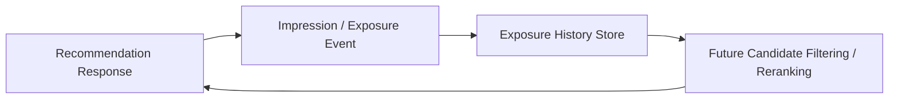

------
title: Build From Scratch Recommendations System - Part 045
description: Mendesain frequency capping, fatigue, dan repetition control production-grade: exposure history, impression cooldown, creator/topic fatigue, purchased/consumed suppression, recency decay, caps by surface, real-time suppression, diagnostics, dan guardrails.
series: learn-build-from-scratch-recommendations-system
seriesTitle: Build From Scratch: Enterprise Recommendations System
order: 45
partTitle: Frequency Capping, Fatigue, and Repetition Control
tags:
  - recommendation-system
  - recsys
  - reranking
  - frequency-capping
  - fatigue
  - exposure
  - series
date: 2026-07-02
---

# Part 045 — Frequency Capping, Fatigue, and Repetition Control

Recommendation system tidak hanya memilih “apa yang relevan sekarang”.

Ia juga harus mengingat:

```text
Apa yang sudah terlalu sering ditampilkan?
Apa yang user sembunyikan?
Apa yang sudah dibeli/dikonsumsi?
Apa yang baru saja ditolak?
Creator/topic mana yang membuat user lelah?
Berapa kali item ini muncul di surface berbeda?
```

Jika sistem tidak punya repetition control, user experience cepat memburuk:

- item sama muncul terus,
- creator sama mendominasi,
- produk yang sudah dibeli tetap direkomendasikan,
- artikel yang sudah dibaca muncul lagi,
- user menyembunyikan item tetapi melihat item serupa berulang,
- email/push terlalu sering,
- enterprise action yang sudah selesai masih muncul,
- recommendation terasa tidak mendengarkan user.

Part ini membahas frequency capping, fatigue, dan repetition control secara production-grade: exposure history, impression windows, cooldown, suppression, user controls, cross-surface repetition, purchased/consumed logic, metrics, storage, latency, dan failure modes.

---

## 1. Mental Model: Recommendation Is a Repeated Interaction

User tidak melihat satu slate. User melihat banyak slate sepanjang waktu.

```text
home feed pagi
search siang
product detail sore
email besok
push minggu depan
```

Setiap exposure memengaruhi exposure berikutnya.

Jika sistem hanya melihat request saat ini, ia bisa terus memilih item yang sama karena item itu selalu punya score tinggi.

Fatigue control menambahkan memory lintas waktu.



---

## 2. Definitions

### Exposure

Candidate benar-benar ditampilkan atau setidaknya eligible untuk dilihat user.

### Impression

Logged event that item was rendered/shown. Ideally includes visibility quality.

### Frequency Cap

Limit on how often entity can be shown.

```text
max 3 impressions per item per user per 7d
```

### Fatigue

Reduced user willingness to engage after repeated exposure.

### Repetition Control

Mechanisms to avoid over-showing same item/entity/topic.

### Suppression

Hard removal from candidate pool due to explicit or rule-based reason.

---

## 3. Why Repetition Happens

Repetition appears because:

- high-score items remain high-score,
- candidate sources return same popular items,
- ranker optimizes short-term score,
- no exposure memory,
- no dedup across surfaces,
- item variants bypass item-level cap,
- user profile too narrow,
- negative feedback delayed,
- fallback uses same list repeatedly,
- batch cache stale.

If top score is stable and there is no fatigue penalty, repetition is natural.

---

## 4. Entity Levels for Capping

Frequency cap can apply at multiple entity levels.

```text
item_id
dedup_group_id
product_family_id
creator_id
seller_id
brand_id
category_id
topic_id
source_id
campaign_id
document_id
policy_version_id
action_type
module_id
surface
```

Example:

```text
max item_123 3 times / 7d
max creator_9 10 times / 7d
max campaign_abc 2 times / 1d
max same policy article version 1 time / case
```

Choose entity level by domain.

---

## 5. Exposure Windows

Caps use time windows.

Common windows:

```text
session
1 hour
1 day
7 days
30 days
lifetime
case lifecycle
campaign period
```

Examples:

```text
item: max 3 impressions / 7d
creator: max 5 impressions / 1d
email: max 1 send / day
push: max 2 / week
case action: suppress after completion
article: max 1 impression / case unless reopened
```

Use rolling windows or fixed windows.

Rolling windows are more precise; fixed windows easier.

---

## 6. Exposure Quality

Not every impression means user saw the item.

Impression quality:

```text
rendered
in viewport
viewable duration
position
screen size
scroll depth
email opened
push delivered
push seen
```

Capping should consider visibility.

Example:

```text
do not count below-fold item as full impression
```

But if logging cannot reliably detect visibility, use conservative logic.

Exposure semantics must be defined.

---

## 7. Impression Event Contract

Impression event should include:

```json
{
  "event_type": "impression",
  "request_id": "req_001",
  "slate_id": "slate_123",
  "impression_id": "imp_456",
  "user_id": "u123",
  "surface": "home_feed",
  "item_id": "item_789",
  "dedup_group_id": "family_789",
  "creator_id": "creator_9",
  "category_id": "camera",
  "position": 4,
  "visible": true,
  "viewable_ms": 1200,
  "event_time": "2026-07-02T10:05:00Z"
}
```

Without reliable impression data, fatigue control is weak.

---

## 8. Exposure History Store

Serving needs low-latency exposure history.

Record examples:

```text
user_id:item_id -> impressions in 7d
user_id:creator_id -> impressions in 1d/7d
user_id:topic_id -> impressions in 7d
user_id:campaign_id -> impressions in 1d
```

Storage patterns:

- key-value store with counters and TTL,
- time-bucketed counters,
- streaming aggregation store,
- event log + nearline materialized views.

Must support batch checks for many candidates.

---

## 9. Batch Frequency Check

Ranking/reranking may evaluate hundreds of candidates.

Bad:

```text
for candidate:
  get item impression count
```

Good:

```text
batchGetFrequency(subject, item_ids, creator_ids, category_ids)
```

Response:

```json
{
  "item_counts_7d": {
    "item_1": 2,
    "item_2": 0
  },
  "creator_counts_1d": {
    "creator_9": 4
  }
}
```

Batch APIs prevent latency explosion.

---

## 10. Hard Caps

Hard cap removes candidate.

Examples:

```text
if user_item_impressions_7d >= 3: reject
if user_creator_impressions_1d >= 10: reject
if campaign_impressions_1d >= 2: reject
if action_completed: reject
```

Hard caps are simple and predictable.

Use for:

- explicit user controls,
- legal/business frequency limits,
- completed/consumed one-time items,
- high-fatigue surfaces like push/email,
- sponsored frequency limits.

---

## 11. Soft Fatigue Penalty

Soft penalty reduces score.

Example:

```text
adjusted_score = rank_score - seen_count_7d * penalty
```

or:

```text
fatigue_penalty = alpha * log1p(impression_count_7d)
```

Soft penalty allows high-value candidate to still appear.

Use for:

- home feed repetition,
- creator/category fatigue,
- non-final no-click impressions,
- mild repetition.

---

## 12. Cooldown

Cooldown blocks item for a short time after exposure/action.

Examples:

```text
after item impression: cooldown 1h
after no-click impressions >= 3: cooldown 7d
after hide: suppress 90d
after purchase durable good: suppress 180d
after article read: suppress 30d
after case action completed: suppress for case lifecycle
```

Cooldown is easier to reason about than raw count sometimes.

---

## 13. Purchased and Consumed Suppression

Purchased/consumed logic is domain-specific.

### Durable Goods

```text
user buys laptop -> suppress same laptop and similar laptop for months
```

### Consumables

```text
user buys coffee -> recommend again after expected replenishment window
```

### Content

```text
user completed video/article -> suppress same content
```

### Music

```text
user may replay song -> no permanent suppression
```

### Enterprise

```text
completed action -> suppress unless case reopens
```

Do not use one universal purchased suppression rule.

---

## 14. Replenishment Logic

For repeat-purchase items:

```text
expected_replenishment_days
```

Example:

```text
toothpaste: 30d
coffee: 21d
laptop: 730d
```

Suppression:

```text
if days_since_purchase < replenishment_window:
    suppress or downrank
else:
    allow/recommend
```

Use category/item-specific replenishment priors.

---

## 15. Creator and Topic Fatigue

User may like a creator/topic but not want every item from them.

Features:

```text
creator_impressions_1d
creator_click_rate_after_recent_impressions
topic_impressions_7d
topic_hide_rate
category_entropy_recent_slates
```

Policy:

```text
max 2 same creator per slate
max 5 same creator per day
topic fatigue penalty after repeated no-click
```

This protects diversity and trust.

---

## 16. Cross-Surface Repetition

User sees item on:

```text
home feed
email
push
PDP
search
```

Should exposures share frequency history?

Often yes, but weights differ.

Example:

```text
push impression has high fatigue weight
below-fold feed impression has low weight
email opened impression has medium/high weight
```

Exposure weight by surface:

```yaml
surface_exposure_weight:
  home_feed_viewable: 1.0
  email_opened: 2.0
  push_seen: 3.0
  below_fold_render: 0.3
```

Cross-surface cap prevents spam.

---

## 17. Channel Frequency

For email/push, frequency capping is critical.

Examples:

```text
max 1 promotional email/day
max 3 recommendation emails/week
max 2 push notifications/week
quiet hours
do not send if recent negative feedback
```

Channel fatigue can harm retention.

Recommendation content ranking must integrate with communication policy.

---

## 18. User Controls

User explicit controls:

```text
hide item
not interested in topic
show less like this
block creator/seller
mute category
do not recommend after purchase
```

These should apply fast.

Control mapping:

```text
hide item -> hard suppress item
block creator -> hard suppress creator
not interested topic -> topic penalty/suppression
show less like this -> reduce similar category/embedding cluster
```

User feedback should be respected visibly.

---

## 19. Similar-Item Suppression

If user hides one item, should similar items be suppressed?

Depends on feedback.

```text
hide exact item
not interested in this topic
not interested in creator
not interested in product family
```

Need reason granularity.

If user hides one red shoe, do not necessarily suppress all shoes.

Feedback UI should capture scope if possible.

---

## 20. Negative Feedback Propagation

Negative feedback can propagate through:

- item,
- dedup group,
- creator,
- category,
- topic,
- embedding cluster,
- source,
- campaign.

Example:

```text
not interested in crypto news
```

Suppression:

```text
topic=crypto_news penalty/suppression
```

Propagation should be bounded. Over-propagation can erase useful recommendations.

---

## 21. Frequency Features for Ranker

Even if reranker enforces caps, ranker benefits from features.

```text
item_impressions_1d
item_impressions_7d
creator_impressions_7d
time_since_last_item_impression
seen_without_click_count
purchased_same_category_recently
consumed_same_series_recently
```

Ranker can learn fatigue beyond hard rules.

---

## 22. Reranking Rules

Reranker uses frequency state:

```text
if item seen too often: reject
if creator count high: penalize
if category count high in slate: penalize
if item recently seen: cooldown reject
```

Example adjusted score:

```text
score =
  rank_score
  - 0.05 * log1p(item_impressions_7d)
  - 0.02 * creator_impressions_1d
```

Cap penalties to avoid randomization.

---

## 23. Frequency Capping and Exploration

Exploration should also respect frequency caps.

Do not repeatedly explore same item.

Track:

```text
exploration_impressions
exploration_outcomes
exploration_cap
```

If new item gets enough exposure without positive signal, reduce exploration.

If positive signal appears, move to normal serving.

---

## 24. Frequency Capping and Sponsored

Sponsored content needs strict caps:

```text
max impressions per campaign per user
max impressions per advertiser per user
max sponsored per slate
cooldown after no-click
```

Also:

- disclosure,
- relevance floor,
- policy compliance.

Sponsored overexposure damages trust and can create compliance problems.

---

## 25. Enterprise Repetition Control

Enterprise examples:

```text
do not recommend completed action again
do not repeat same knowledge article after marked not useful
do not show outdated policy version
do not repeatedly warn about acknowledged issue
repeat critical required action until completed
```

Important nuance:

Some items should repeat until resolved.

Example:

```text
required compliance action
```

Frequency policy:

```text
repeat but not spam
```

Use SLA/stage-aware reminders.

---

## 26. Required Repetition

Some recommendations should repeat.

Examples:

- critical security update,
- compliance required action,
- expiring document,
- unfinished task,
- restock reminder requested by user.

Frequency cap should not suppress critical required items blindly.

Policy:

```yaml
required_action:
  repeat_until_completed: true
  min_cooldown: 4h
  max_impressions_per_day: 3
```

Repetition can be correct if user needs reminder.

---

## 27. Exposure History Accuracy

Challenges:

- duplicate impression events,
- missing impressions,
- delayed events,
- multi-device user,
- anonymous-to-logged-in merge,
- viewability uncertainty,
- event replay,
- bot/internal traffic.

Use:

- event_id idempotency,
- dedup,
- identity resolution,
- event-time windows,
- bot filtering,
- reconciliation.

Bad exposure data causes bad capping.

---

## 28. Identity and Frequency

If anonymous user logs in, should exposure history merge?

Usually yes if allowed by privacy/consent and identity confidence.

Risks:

- shared device,
- wrong merge,
- privacy.

Maintain:

```text
user_id exposure
anonymous_id exposure
session exposure
device exposure
```

Serving can combine according to identity policy.

---

## 29. Privacy and Retention

Exposure history is behavioral data.

Controls:

- purpose limitation,
- retention policy,
- consent,
- deletion,
- access control,
- aggregation where possible.

Example retention:

```text
item impression history: 90d
creator frequency: 30d
campaign frequency: campaign + 30d
session exposure: TTL 2h
```

Do not keep detailed exposure forever without purpose.

---

## 30. Metrics

Monitor:

```text
repeat_item_rate
repeat_creator_rate
repeat_topic_rate
impressions_per_user_item_7d
hide_after_repeat_rate
click_after_repeat_rate
fatigue_penalty_applied_rate
frequency_cap_rejection_count
cooldown_rejection_count
suppression_hit_rate
pool_too_small_due_to_caps
```

By:

- surface,
- category,
- creator,
- source,
- user segment,
- item type.

---

## 31. Fatigue Curves

Measure engagement vs exposure count.

Example:

| Exposure Count 7d | CTR |
|---:|---:|
| 1 | 5.0% |
| 2 | 3.8% |
| 3 | 2.5% |
| 4+ | 1.2% |

If CTR drops with repeats, add stronger penalty/cap.

But some categories may repeat well.

Measure by domain.

---

## 32. Repetition and Negative Feedback

Repeat exposure often increases negative feedback.

Track:

```text
hide_rate_by_seen_count
not_interested_by_topic_repeat
unsubscribe_after_email_frequency
report_rate_by_repeat
```

If negative feedback spikes after repeated exposures, cap earlier.

---

## 33. Offline Simulation

Use historical slates.

Simulate caps:

```text
max item impressions 3/7d
max creator 5/1d
cooldown 24h after no-click
```

Measure:

- how many candidates removed,
- predicted utility loss,
- diversity gain,
- repeat reduction,
- replacement quality.

Then A/B test.

---

## 34. A/B Testing Caps

Frequency caps affect long-term user experience.

Metrics:

- CTR/CVR,
- hide/not interested,
- retention,
- session depth,
- email unsubscribe,
- repeat exposure,
- diversity,
- fallback usage.

Short-term CTR may drop if caps replace high-score repeated items. Long-term trust may improve.

Test sufficiently long.

---

## 35. Storage Design: Time Buckets

One implementation:

```text
key: user_id:item_id:day
value: impression_count
TTL: 30d
```

For query:

```text
sum counts over last 7 buckets
```

Pros:

- simple,
- TTL cleanup.

Cons:

- multiple reads,
- approximate rolling window.

Alternative: sorted timestamps per key, but heavier.

---

## 36. Storage Design: Aggregated Counters

Maintain rolling counters:

```text
user_item_impressions_1d
user_item_impressions_7d
user_creator_impressions_1d
```

Updated by stream.

Pros:

- fast lookup.

Cons:

- stream correctness,
- window expiration complexity,
- reconciliation needed.

Choose based on scale/accuracy needs.

---

## 37. Real-Time Suppression Store

Explicit feedback should be real-time.

```text
hide item
block creator
not interested topic
```

Use low-latency store with TTL.

Suppression record:

```json
{
  "subject_id": "u123",
  "scope": "creator",
  "target_id": "creator_9",
  "reason": "blocked",
  "created_at": "2026-07-02T10:00:00Z",
  "expires_at": null
}
```

Serving checks it before final slate.

---

## 38. Failure Modes

### 38.1 No Exposure Memory

Same item repeats.

### 38.2 Too Aggressive Caps

Relevant items suppressed; slate quality drops.

### 38.3 Wrong Entity Level

SKU variants bypass cap.

### 38.4 Suppression Lag

User hides item but keeps seeing it.

### 38.5 Cross-Surface Spam

Email/push/feed repeat same campaign.

### 38.6 Exposure Event Duplicates

Caps trigger too early.

### 38.7 Below-Fold Counted as Full Impression

Useful items suppressed unfairly.

### 38.8 Purchased Consumables Suppressed Forever

Repeat purchase opportunity lost.

### 38.9 Critical Enterprise Action Suppressed

Compliance issue.

### 38.10 No Diagnostics

Cannot explain why candidate disappeared.

---

## 39. Implementation Sketch: Frequency Service

```java
public interface FrequencyService {
    FrequencyResult batchGet(FrequencyRequest request);
}

public record FrequencyRequest(
    String subjectId,
    String surface,
    List<String> itemIds,
    List<String> dedupGroupIds,
    List<String> creatorIds,
    List<String> categoryIds,
    Instant requestTime
) {}

public record FrequencyResult(
    Map<String, Integer> itemImpressions7d,
    Map<String, Integer> creatorImpressions1d,
    Map<String, Instant> lastItemImpressionAt,
    Map<String, Boolean> suppressedItems,
    Map<String, Boolean> suppressedCreators
) {}
```

Batch response supports reranking/eligibility efficiently.

---

## 40. Implementation Sketch: Frequency Policy

```java
public record FrequencyPolicy(
    int maxItemImpressions7d,
    int maxCreatorImpressions1d,
    Duration itemCooldownAfterImpression,
    Duration itemCooldownAfterNoClick,
    boolean suppressPurchasedDurables,
    double repeatPenaltyPerImpression
) {}
```

Evaluation:

```java
public final class FrequencyEvaluator {
    public FrequencyDecision evaluate(Candidate c, FrequencyResult f, FrequencyPolicy p) {
        if (f.suppressedItems().getOrDefault(c.itemId(), false)) {
            return FrequencyDecision.reject("user_suppressed_item");
        }

        if (f.itemImpressions7d().getOrDefault(c.itemId(), 0) >= p.maxItemImpressions7d()) {
            return FrequencyDecision.reject("item_frequency_cap");
        }

        if (f.creatorImpressions1d().getOrDefault(c.creatorId(), 0) >= p.maxCreatorImpressions1d()) {
            return FrequencyDecision.reject("creator_frequency_cap");
        }

        int seen = f.itemImpressions7d().getOrDefault(c.itemId(), 0);
        double penalty = seen * p.repeatPenaltyPerImpression();

        return FrequencyDecision.acceptWithPenalty(penalty);
    }
}
```

---

## 41. Minimal Production Frequency Plan

Start with:

```yaml
exposure_tracking:
  impression_event: required
  viewability: if_available
  dedup_event_id: true
frequency_caps:
  item:
    max_impressions_7d: 3
    cooldown_after_impression: 6h
  creator:
    max_impressions_1d: 5
  sponsored_campaign:
    max_impressions_1d: 2
suppression:
  hide_item: immediate
  block_creator: immediate
  purchased_durable: category_specific_window
fatigue_features:
  - item_impressions_7d
  - creator_impressions_1d
  - time_since_last_impression
monitoring:
  - repeat_item_rate
  - hide_after_repeat
  - cap_rejection_rate
  - pool_too_small_due_to_caps
```

Then add topic/category fatigue and cross-surface weighting.

---

## 42. Checklist Frequency Capping Readiness

```text
[ ] Impression/exposure event contract exists.
[ ] Viewability semantics are defined.
[ ] Exposure history store exists.
[ ] Batch frequency lookup exists.
[ ] Item-level caps exist.
[ ] Dedup-group/product-family caps exist where needed.
[ ] Creator/seller/topic caps exist where needed.
[ ] Explicit suppression is real-time or nearline.
[ ] Purchased/consumed suppression is domain-specific.
[ ] Replenishment logic exists for consumables.
[ ] Cross-surface exposure policy exists.
[ ] Sponsored/channel frequency caps exist if applicable.
[ ] Enterprise required-action repetition policy exists if applicable.
[ ] Frequency features are available to ranker/reranker.
[ ] Metrics track repeat and fatigue.
[ ] Offline simulation and A/B test process exist.
[ ] Privacy/retention policy covers exposure history.
```

---

## 43. Kesimpulan

Frequency capping, fatigue, dan repetition control membuat recommendation system terasa “mendengarkan” user.

Prinsip utama:

1. Recommendation is repeated interaction, not one request.
2. Exposure history is core serving state.
3. Caps apply at multiple entity levels: item, group, creator, topic, campaign.
4. Hard caps and soft penalties serve different purposes.
5. Purchased/consumed suppression must be domain-specific.
6. Explicit user controls must apply fast.
7. Cross-surface repetition matters, especially email/push.
8. Required enterprise actions may need controlled repetition, not suppression.
9. Exposure data quality determines cap quality.
10. Monitor fatigue curves and negative feedback by exposure count.

Di Part 046, kita akan membahas **Fairness, Exposure, and Marketplace Health**: bagaimana mengelola distribusi exposure, popularitas, cold-start opportunity, creator/seller health, dan constraint fairness tanpa merusak relevance.
