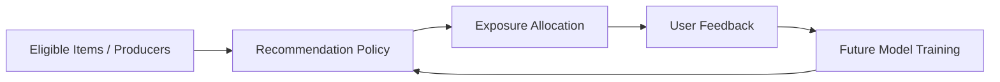

------
title: Build From Scratch Recommendations System - Part 046
description: Mendesain fairness, exposure, dan marketplace health untuk recommendation system production-grade: exposure allocation, popularity bias, long-tail, creator/seller health, cold-start opportunity, fairness constraints, monitoring, governance, dan trade-offs.
series: learn-build-from-scratch-recommendations-system
seriesTitle: Build From Scratch: Enterprise Recommendations System
order: 46
partTitle: Fairness, Exposure, and Marketplace Health
tags:
  - recommendation-system
  - recsys
  - fairness
  - exposure
  - marketplace
  - governance
  - series
date: 2026-07-02
---

# Part 046 — Fairness, Exposure, and Marketplace Health

Recommendation system bukan hanya memprediksi preferensi user.

Ia juga mendistribusikan **exposure**.

Setiap posisi dalam slate memberi kesempatan pada item, creator, seller, document, action, atau policy untuk dilihat, diklik, dibeli, digunakan, atau dipercaya.

Jika sistem terus mempromosikan yang sudah populer, maka:

- item populer makin populer,
- creator besar makin dominan,
- seller baru tidak punya kesempatan,
- cold-start item tidak mendapat data,
- user melihat variasi semakin sempit,
- marketplace menjadi winner-take-all,
- kualitas jangka panjang bisa turun,
- feedback loop menjadi semakin bias.

Fairness, exposure, dan marketplace health adalah cara mengelola dampak sistem rekomendasi terhadap ekosistem.

Part ini membahas exposure allocation, popularity bias, long-tail, cold-start opportunity, producer fairness, user fairness, marketplace metrics, constraints, governance, dan production trade-offs.

---

## 1. Mental Model: Recommendation Allocates Attention

Ranking tidak hanya mengurutkan item.

Ranking mengalokasikan perhatian user.

```text
position 1 receives more attention than position 10
home feed receives more exposure than deep page
push notification receives more attention than below-fold card
```

Exposure adalah resource terbatas.

Recommendation system memutuskan siapa/apa yang mendapat resource itu.



Feedback loop dapat memperkuat bias exposure.

---

## 2. Fairness Types

Fairness in recommender systems can mean different things.

### User Fairness

Different user groups receive equally good recommendations.

Examples:

```text
new users not worse than old users
users in small regions not ignored
low-activity users get useful recommendations
```

### Producer Fairness

Items/creators/sellers get fair opportunity for exposure.

Examples:

```text
new sellers can be discovered
long-tail creators not completely starved
quality creators not buried by popularity
```

### Item Fairness

Certain item groups receive exposure aligned with quality/relevance.

Examples:

```text
new documents, small categories, low-volume SKUs
```

### Marketplace Health

Long-term ecosystem remains diverse, high-quality, and sustainable.

Do not use one fairness definition for all contexts.

---

## 3. Fairness Is Not Equal Exposure to Everyone

Equal exposure is usually wrong.

Bad:

```text
every item gets same exposure regardless of quality/relevance
```

Fairness is more often:

```text
similarly qualified items/producers get comparable opportunity
```

or:

```text
new/underexposed high-quality candidates get enough exploration to prove value
```

Quality, eligibility, user relevance, and safety still matter.

Fairness without relevance can harm users.  
Relevance without fairness can harm ecosystem.

---

## 4. Popularity Bias

Popularity bias is natural.

Popular items:

- have more interactions,
- get better model estimates,
- appear in more training data,
- rank higher,
- get more exposure,
- get more interactions.

Loop:


This can be good if popularity reflects quality, but dangerous if it blocks discovery.

---

## 5. Rich-Get-Richer Feedback Loop

Even small initial advantage can compound.

Examples:

- item featured editorially gets early clicks,
- model learns it is good,
- item receives more exposure,
- similar items lose opportunity.

If uncorrected, model learns historical exposure, not true utility.

Mitigations:

- exploration,
- exposure caps,
- long-tail sources,
- cold-start priors,
- fairness-aware reranking,
- counterfactual evaluation,
- source diversity.

---

## 6. Exposure vs Engagement

Exposure is opportunity. Engagement is outcome.

A producer may have low engagement because:

- low quality,
- wrong audience,
- poor presentation,
- insufficient exposure,
- bad initial ranking,
- cold-start uncertainty.

Fairness analysis should separate:

```text
was it shown?
to whom?
in what position?
what happened after exposure?
```

Without exposure logs, fairness cannot be measured.

---

## 7. Position-Weighted Exposure

Position matters.

Exposure weight:

```text
position 1 > position 2 > position 10
```

Example weights:

```text
w_position = 1 / log2(position + 1)
```

Or use observed examination probability.

Exposure metric:

```text
weighted_exposure(item) = sum(position_weight * impression_visibility)
```

This is better than raw impression count.

---

## 8. Exposure Share

Measure exposure by group.

Examples:

```text
exposure_share_by_creator
exposure_share_by_seller
exposure_share_by_category
exposure_share_by_popularity_bucket
exposure_share_by_item_age
exposure_share_by_region
```

Compare with:

- eligible catalog share,
- quality-adjusted eligible share,
- demand/relevance share,
- business target.

No single comparison is perfect.

---

## 9. Popularity Buckets

Bucket items:

```text
head
torso
tail
cold-start
```

Example:

```text
head: top 1% by historical exposure
torso: next 19%
tail: bottom 80%
cold: insufficient exposure
```

Monitor:

```text
exposure by bucket
click/conversion by bucket
negative feedback by bucket
coverage by bucket
```

If head receives 95% exposure, ecosystem may be narrow.

---

## 10. Gini / Concentration Metrics

Exposure concentration metrics:

```text
Gini coefficient
Herfindahl-Hirschman Index
top 1% exposure share
top 10 creators share
entropy
```

Use to detect winner-take-all dynamics.

But do not optimize concentration blindly. Some concentration may be quality-driven.

Pair with quality/relevance metrics.

---

## 11. Long-Tail Coverage

Long-tail coverage:

```text
unique tail items exposed
tail exposure share
tail positive engagement rate
tail quality-adjusted exposure
```

Good long-tail strategy exposes quality tail items to relevant users, not random tail items.

Candidate generation must include long-tail candidates.

Reranking can reserve small opportunities.

---

## 12. New Item Opportunity

Cold-start items need exposure to gather evidence.

Metrics:

```text
time_to_first_impression
time_to_100_impressions
time_to_first_click
time_to_confidence
new_item_exposure_share
new_item_success_rate
```

Policy:

```text
new items with metadata_quality >= threshold get exploration budget
```

Exposure should be capped and monitored.

---

## 13. Creator/Seller Health

Marketplace health metrics:

```text
active_creator_count
active_seller_count
creator_exposure_distribution
seller_exposure_distribution
new_creator_time_to_first_exposure
quality_adjusted_creator_opportunity
seller_return_rate
creator_report_rate
repeat buyer/user satisfaction
```

Healthy marketplace balances:

- user satisfaction,
- producer opportunity,
- quality,
- trust,
- supply diversity.

---

## 14. Quality-Adjusted Fairness

Fairness should account for quality.

Example:

```text
high-quality new seller deserves opportunity
low-quality spam seller should not
```

Quality signals:

```text
metadata quality
policy approval
creator trust
seller reliability
return/refund rate
report rate
expert verification
content quality
```

Use quality floors and quality-adjusted exposure metrics.

---

## 15. Fairness Constraints in Reranking

Examples:

```yaml
marketplace_policy:
  min_new_item_slots_if_available: 1
  max_head_item_share_per_slate: 0.7
  max_same_creator: 2
  min_long_tail_if_relevance_floor: 1
  creator_exposure_penalty_weight: 0.05
```

Constraints must be bounded.

Fairness constraints should not force unsafe/irrelevant items into slate.

Use relevance/quality floors.

---

## 16. Exposure-Aware Penalty

If producer already received high exposure, apply penalty.

```text
adjusted_score =
  rank_score - alpha * exposure_saturation(producer)
```

Exposure saturation:

```text
exposure_saturation = current_exposure / target_exposure
```

If exposure above target, penalty increases.

Requires careful target definition.

---

## 17. Underexposure Bonus

If high-quality candidate group underexposed, apply small boost.

```text
adjusted_score =
  rank_score + beta * underexposure_bonus
```

Use caps and relevance floor.

Underexposure bonus should not promote low-quality or irrelevant items.

---

## 18. Fairness as Exploration

Producer fairness often requires exploration.

For uncertain items/producers:

```text
allocate small controlled exposure
log propensity
measure outcome
increase/decrease future exposure based on feedback
```

This is better than permanent arbitrary boost.

Exploration gives opportunity and learns true utility.

---

## 19. Fairness and User Segments

User fairness asks:

```text
Are some user groups receiving worse recommendations?
```

Segments:

```text
new users
low-activity users
regions/locales
device types
accessibility modes
enterprise roles
small tenants
```

Metrics:

- CTR/CVR/satisfaction,
- coverage,
- latency,
- fallback rate,
- empty slate rate,
- policy blocks,
- recommendation diversity.

If small region gets stale/global content, user fairness issue.

---

## 20. Regional/Locale Fairness

Recommendation quality can vary by region/language.

Problems:

- less local content,
- poorer text embeddings for language,
- global popularity dominates,
- catalog availability sparse,
- labels sparse,
- UI/localization differences.

Mitigations:

- locale-specific evaluation,
- multilingual embeddings,
- regional priors,
- local editorial,
- similar-region transfer,
- region-specific exploration.

Monitor by locale/region.

---

## 21. Tenant Fairness in Enterprise

In multi-tenant enterprise, fairness can mean:

- small tenants get useful model quality,
- tenant data not dominated by large tenants,
- shared model not biased to one industry,
- tenant-specific policies respected.

Metrics:

```text
quality by tenant
fallback rate by tenant
coverage by tenant
case action success by tenant
document recommendation usefulness by tenant
```

Sometimes need tenant-specific calibration or model adaptation.

---

## 22. Fairness and Privacy

Fairness analysis may require grouping, but sensitive attributes may be unavailable or restricted.

Use governed process.

Principles:

- minimize sensitive data,
- use approved fairness dimensions,
- aggregate reporting,
- access control,
- purpose limitation,
- legal/compliance review if needed.

Do not invent protected-class features casually.

---

## 23. Fairness and Safety

Fairness does not override safety.

Never expose:

- unsafe content,
- unauthorized documents,
- policy-banned items,
- fraudulent sellers,
- invalid enterprise actions,

for fairness reasons.

Fairness applies within eligible/safe candidate universe.

---

## 24. Marketplace Policy Spec

Example:

```yaml
marketplace_health_policy: marketplace-v4
quality_floor:
  item_quality_min: 0.75
  policy_state: approved
exposure_constraints:
  max_same_creator_per_slate: 2
  max_head_bucket_share_per_slate: 0.8
  min_new_item_slots_if_available: 1
long_tail:
  relevance_floor: 0.01
  max_slots: 2
monitoring:
  - creator_exposure_gini
  - new_item_time_to_first_impression
  - tail_engagement_rate
  - report_rate_by_bucket
owner: marketplace-platform
```

Policy should be reviewed by product, ML, safety, and marketplace stakeholders.

---

## 25. Fairness Metrics by Stage

Measure at multiple stages:

### Candidate Pool

```text
pool exposure opportunity
source contribution
long-tail availability
```

### After Ranking

```text
top-N distribution
score distribution by group
```

### Final Slate

```text
actual user-facing exposure
position-weighted exposure
```

### Outcome

```text
engagement/conversion/negative feedback by group
```

If long-tail absent in candidate pool, reranking cannot fix.

---

## 26. Exposure Attribution

Exposure attribution needs:

```text
request_id
slate_id
item_id
position
surface
visibility
source
ranker version
reranker policy
user segment
item group
creator/seller
```

Without this, marketplace health analysis is guesswork.

Exposure logs are core governance data.

---

## 27. Fairness and Counterfactuals

Observed engagement is biased by exposure.

If item never shown, we don't know if it would perform.

Use:

- exploration,
- propensity logging,
- randomized buckets,
- off-policy evaluation,
- careful causal analysis.

Do not conclude “tail items are bad” simply because they were never exposed.

---

## 28. Fairness Trade-Offs

Trade-offs:

- short-term CTR vs long-term ecosystem,
- head item certainty vs tail exploration,
- user personalization vs producer diversity,
- marketplace fairness vs business revenue,
- global model efficiency vs tenant-specific quality.

These are product/governance decisions.

ML should make trade-offs visible, not hide them.

---

## 29. Governance

Fairness/exposure policies require governance.

Questions:

```text
Who defines fairness objective?
Who approves exposure constraints?
How are trade-offs reviewed?
What metrics are monitored?
What are unacceptable regressions?
How are incidents handled?
```

Fairness is not purely model tuning.

It is product policy + system design + monitoring.

---

## 30. User Transparency and Controls

User controls can improve fairness/relevance:

```text
show more diverse results
show more from this creator
show less from this topic
hide seller
reset recommendations
```

Transparency:

```text
Why am I seeing this?
```

Internal fairness constraints should not be misleading in explanation.

---

## 31. Fairness-Aware Candidate Generation

Candidate generation must include diverse/underexposed candidates.

Sources:

```text
long_tail_quality_source
new_item_exploration
creator_diversity_source
category_expansion_source
local_content_source
tenant_specific_source
```

If retrieval only returns head items, final fairness is limited.

---

## 32. Fairness-Aware Ranking Features

Features:

```text
item_popularity_bucket
creator_exposure_7d
seller_exposure_30d
new_item_flag
item_age
long_tail_bucket
creator_quality_score
exposure_saturation
user_novelty_affinity
```

Ranker/reranker can use these.

But be cautious: historical exposure features can reinforce bias if used naively.

---

## 33. Reranking for Exposure

Reranking can enforce exposure constraints.

Example adjusted score:

```text
adjusted_score =
  rank_score
  - alpha * head_bucket_penalty
  + beta * quality_tail_bonus
```

Constraints:

```text
max head bucket items
min distinct creators
max same seller
new item slot
```

Use relevance and quality floors.

---

## 34. Monitoring Dashboard

Minimum dashboard:

```text
position-weighted exposure by popularity bucket
position-weighted exposure by creator/seller
top 1% exposure share
creator/seller Gini
new item time-to-first-impression
long-tail exposure and engagement
new creator exposure
quality-adjusted exposure
hide/report by exposure bucket
user metric by region/tenant/user tenure
fallback rate by segment
```

By surface and time.

---

## 35. Alerts

Alert examples:

```text
top 1% items exposure share increases > threshold
new item time-to-first-impression exceeds SLO
creator exposure Gini spikes
tail exposure drops sharply
small region fallback rate spikes
report rate for new creators rises
long-tail quality guardrail fails
```

Marketplace health failures are often slow-burn. Alerts help detect early.

---

## 36. Long-Term Metrics

Short-term metrics may not capture ecosystem health.

Long-term metrics:

```text
active creators/sellers over time
new creator retention
catalog freshness
user retention
repeat purchase diversity
creator churn
seller churn
content supply diversity
tenant adoption
```

These are affected by recommendation exposure.

Harder to attribute, but important.

---

## 37. Fairness Offline Simulation

Simulate reranking policies on logged candidates.

Compare:

- predicted utility,
- exposure distribution,
- long-tail share,
- creator concentration,
- new item exposure,
- guardrail predictions.

Use to select candidate policies for A/B.

Offline simulation cannot fully solve counterfactual bias, but it is useful.

---

## 38. A/B Testing Fairness Policies

A/B test with:

- user metrics,
- producer exposure metrics,
- marketplace health metrics,
- negative feedback,
- long-term retention if possible.

Test duration may need to be longer than relevance changes.

If fairness policy improves long-tail exposure but harms user trust, revise.

---

## 39. Fairness in High-Stakes Domains

For domains like hiring, lending, healthcare, legal, or regulated enterprise workflows, fairness can have legal/ethical implications.

Requirements may include:

- formal fairness review,
- auditability,
- explainability,
- documentation,
- constraint validation,
- human oversight,
- compliance sign-off.

Do not improvise fairness metrics without domain/legal governance.

---

## 40. Enterprise Example: Knowledge Article Exposure

Problem:

```text
same popular article always recommended
new updated policy article never used
```

Policy:

- policy-required article gets priority if applicable,
- latest valid policy version required,
- old version suppressed,
- new article exploration for relevant cases,
- expert-verified quality floor,
- track article usefulness and rework.

Metrics:

```text
article exposure by policy version
usefulness rate
case resolution impact
stale article exposure
```

---

## 41. Enterprise Example: Next Action Fairness

Possible issue:

```text
model recommends easiest actions, not actions that improve outcome
```

Fairness/health dimension:

- action type coverage,
- required vs optional actions,
- high-risk case support,
- low-frequency but critical action exposure.

Policy:

```text
required actions included
critical actions not starved
action usefulness measured by outcome, not acceptance only
```

---

## 42. Failure Modes

### 42.1 Equal Exposure Misapplied

Low-quality items get exposure.

### 42.2 Fairness Without Relevance Floor

User trust drops.

### 42.3 Popularity Bias Ignored

Head dominates ecosystem.

### 42.4 Long-Tail Random Injection

Novelty/fairness becomes noise.

### 42.5 No Position Weighting

Exposure measurement inaccurate.

### 42.6 Candidate Pool Too Narrow

Reranker cannot improve exposure.

### 42.7 Global Fairness Hides Segment Harm

Small region/tenant suffers.

### 42.8 Underexposure Bonus Overused

Manipulated/low-quality producers benefit.

### 42.9 No Governance

Weights/constraints become arbitrary.

### 42.10 Safety Overridden by Fairness

Serious policy violation.

---

## 43. Implementation Sketch: Exposure Metrics

```java
public record ExposureEvent(
    String requestId,
    String slateId,
    String itemId,
    String creatorId,
    String sellerId,
    String categoryId,
    String popularityBucket,
    int position,
    double positionWeight,
    String surface,
    Instant eventTime
) {}
```

Aggregation:

```java
weightedExposureByCreator.merge(
    event.creatorId(),
    event.positionWeight(),
    Double::sum
);
```

Use viewability multiplier if available.

---

## 44. Implementation Sketch: Exposure-Aware Rerank Penalty

```java
public final class ExposureAwarePolicy {
    private final ExposureTargetStore targetStore;

    public double exposureAdjustment(Candidate c, RequestContext ctx) {
        ExposureStats stats = targetStore.getStats(c.creatorId(), ctx.surface());
        double saturation = stats.actualExposure() / Math.max(stats.targetExposure(), 1.0);

        if (saturation <= 1.0) {
            return 0.0;
        }

        return -Math.min(0.10, 0.02 * Math.log(saturation));
    }
}
```

Penalty capped to avoid overcorrection.

---

## 45. Minimal Production Marketplace Health Plan

Start with:

```yaml
measurement:
  position_weighted_exposure: true
  exposure_by_popularity_bucket: true
  exposure_by_creator_seller: true
  new_item_time_to_first_impression: true
candidate_generation:
  new_item_exploration_source: true
  long_tail_quality_source: true
reranking:
  max_same_creator: 2
  new_item_slot_if_quality_and_relevant: 1
  head_bucket_soft_penalty: small
guardrails:
  relevance_floor: true
  quality_floor: true
  report_hide_monitoring: true
governance:
  policy_versioned: true
  owner: marketplace/recsys
```

Then evolve toward exposure targets and more formal fairness constraints.

---

## 46. Checklist Fairness, Exposure, Marketplace Health Readiness

```text
[ ] Fairness definition is explicit for the product/domain.
[ ] Exposure is logged with position and visibility.
[ ] Position-weighted exposure metric exists.
[ ] Exposure is monitored by item/creator/seller/category/popularity bucket.
[ ] User fairness segments are monitored.
[ ] New item time-to-first-exposure is tracked.
[ ] Long-tail exposure and quality are tracked.
[ ] Candidate pool diversity is measured.
[ ] Reranking has bounded exposure/diversity constraints.
[ ] Relevance and quality floors exist.
[ ] Safety/policy constraints cannot be overridden.
[ ] Exploration logs propensity.
[ ] Marketplace health dashboard exists.
[ ] Governance owner approves fairness/exposure policy.
[ ] A/B tests include user metrics and producer/ecosystem metrics.
[ ] Sensitive/high-stakes fairness analysis has appropriate review.
```

---

## 47. Kesimpulan

Fairness, exposure, dan marketplace health mengingatkan kita bahwa recommendation system adalah allocator of attention, bukan hanya predictor of clicks.

Prinsip utama:

1. Recommendation allocates exposure.
2. Exposure creates feedback loops.
3. Fairness can refer to users, producers, items, tenants, or marketplace health.
4. Fairness is not equal exposure to all items.
5. Popularity bias and rich-get-richer loops must be measured.
6. Position-weighted exposure is more meaningful than raw impression count.
7. Long-tail and new-item opportunity require exploration and quality floors.
8. Reranking can enforce bounded exposure constraints.
9. Safety and eligibility always override fairness objectives.
10. Fairness/exposure policy needs governance, monitoring, and experiments.

Di Part 047, kita akan membahas **Business Rules and Policy Constraints**: bagaimana memasukkan rules, compliance, campaigns, contractual obligations, and product policy ke recommendation decisioning tanpa menghancurkan ranking quality atau membuat sistem tidak bisa dimaintain.
