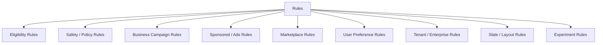
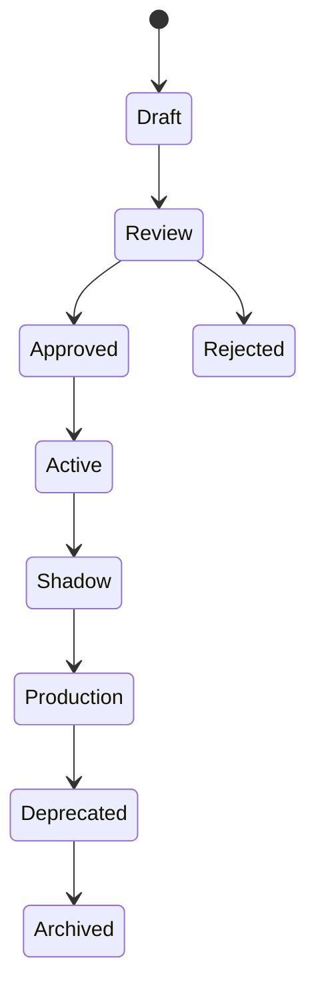

------
title: Build From Scratch Recommendations System - Part 047
description: Mendesain business rules dan policy constraints production-grade: hard/soft rules, campaigns, compliance, sponsored constraints, eligibility, rule engine, conflict resolution, versioning, audit, experimentation, observability, dan governance.
series: learn-build-from-scratch-recommendations-system
seriesTitle: Build From Scratch: Enterprise Recommendations System
order: 47
partTitle: Business Rules and Policy Constraints
tags:
  - recommendation-system
  - recsys
  - business-rules
  - policy
  - constraints
  - governance
  - series
date: 2026-07-02
---

# Part 047 — Business Rules and Policy Constraints

Production recommendation system tidak hidup dalam vacuum ML.

Ia harus mengikuti:

- legal policy,
- product policy,
- business campaigns,
- contractual obligations,
- sponsored placement rules,
- compliance requirements,
- inventory constraints,
- marketplace rules,
- tenant configuration,
- enterprise workflow state,
- user privacy choices,
- safety decisions,
- editorial requirements.

Jika semua aturan ini disisipkan sembarangan ke ranking model atau tersebar di banyak service, sistem menjadi rapuh:

- sulit diaudit,
- sulit di-debug,
- aturan saling konflik,
- model belajar bias aneh,
- campaign melewati safety,
- policy change butuh redeploy,
- eksperimen tidak reproducible,
- tenant A terkena rule tenant B,
- tim tidak tahu kenapa item muncul/hilang.

Part ini membahas bagaimana mendesain business rules dan policy constraints sebagai layer production-grade: hard/soft rules, rule taxonomy, rule engine, conflict resolution, versioning, audit, observability, testing, governance, dan integration dengan ranking/reranking.

---

## 1. Mental Model: Rules Are Decision Constraints, Not Random If-Else

Business/policy rule adalah constraint atau adjustment yang mengubah candidate/slate berdasarkan aturan eksplisit.

```text
if condition then decision
```

Contoh:

```text
if item.policy_state != APPROVED then reject
if surface == checkout and item.out_of_stock then reject
if campaign_id == X then max 2 impressions/user/day
if tenant == bank_001 then use policy_version >= 2026-06
if action requires supervisor and actor_role != supervisor then reject
```

Rule harus:

- terdefinisi,
- versioned,
- testable,
- observable,
- auditable,
- scoped,
- memiliki owner.

Rule bukan “tambahan kecil” di kode. Rule adalah bagian decisioning.

---

## 2. Why Rules Exist

Rules exist because ML score cannot encode everything safely.

Examples:

### Legal / Compliance

```text
do not show restricted item in prohibited jurisdiction
```

### Safety

```text
remove policy-banned content
```

### Product

```text
do not show already completed action
```

### Business

```text
campaign can appear only within valid dates
```

### Marketplace

```text
max sponsored items per slate
```

### Enterprise

```text
only recommend actions valid for case state and actor role
```

ML ranker predicts utility. Rules enforce constraints and explicit policies.

---

## 3. Rule Taxonomy



Each type has different severity and failure mode.

---

## 4. Hard Rules

Hard rule means candidate/slate must comply.

Examples:

```text
policy banned -> reject
tenant mismatch -> reject
actor lacks permission -> reject
out of stock on checkout -> reject
age restricted mismatch -> reject
invalid case action -> reject
expired campaign -> reject sponsored candidate
```

Hard rules should be enforced before final response.

No model score should override hard rules.

---

## 5. Soft Rules

Soft rule adjusts score or priority.

Examples:

```text
boost fresh campaign slightly
penalize low inventory if not purchase-critical
prefer local content
prefer higher-margin among similarly relevant items
boost new item exploration within cap
```

Soft rules must be bounded.

Bad:

```text
business_boost = +999
```

unless it is actually a hard requirement and should be modeled as required placement with governance.

---

## 6. Required Rules

Some rules require inclusion.

Examples:

```text
show required compliance action if valid
show recall notice
show mandatory safety warning
include legally required disclosure
include tenant-required onboarding document
```

Required does not mean unconstrained.

Required candidate still must pass:

```text
validity
permission
surface compatibility
time validity
policy state
```

---

## 7. Rule Severity

Classify rule severity.

```yaml
severity:
  critical:
    failure_mode: fail_closed
    examples:
      - permission
      - policy_banned
      - legal_region
  high:
    failure_mode: fail_closed_or_safe_fallback
    examples:
      - out_of_stock_checkout
      - sponsored_disclosure
  medium:
    failure_mode: use_last_known_or_soft_penalty
    examples:
      - inventory_pressure
      - campaign_priority
  low:
    failure_mode: ignore_if_unavailable
    examples:
      - minor freshness boost
```

Severity drives fallback behavior.

---

## 8. Rule Scope

Every rule needs scope.

Scope dimensions:

```text
surface
region
locale
tenant
item_type
category
user segment
privacy mode
campaign
experiment
time window
workflow state
```

Example:

```yaml
rule_id: no_out_of_stock_checkout
scope:
  surface: checkout_upsell
  item_type: product
decision: reject
```

Avoid global rules unless truly global.

---

## 9. Rule Lifecycle

Rule lifecycle:



For simple config rules, lifecycle can be lightweight. For safety/compliance, review is mandatory.

---

## 10. Rule Versioning

Rule set should be versioned.

```yaml
rule_set: home-feed-policy-rules
version: 20260702_001
rules:
  - rule_id: region_allowed
    version: v3
  - rule_id: campaign_active_window
    version: v2
```

Log rule set version for every response.

Without version, incident replay is impossible.

---

## 11. Rule Engine vs Code

Options:

### Hardcoded Rules

Pros:

- fast,
- type-safe,
- simple for core invariants.

Cons:

- redeploy required,
- scattered logic risk.

### Config-Driven Rules

Pros:

- change without deploy,
- business controllable,
- versioned.

Cons:

- validation needed,
- complexity,
- runtime errors.

### Rule Engine / Policy Engine

Pros:

- expressive,
- auditable,
- centralized.

Cons:

- latency,
- complexity,
- operational overhead.

Recommendation: hardcode critical low-level invariants as tested code; use config/policy engine for dynamic business rules.

---

## 12. Rule Evaluation Stages

Rules can apply at different stages.

```text
candidate source
candidate aggregation
eligibility filtering
ranking utility composition
reranking/slate construction
final safety check
```

Examples:

- region eligibility before ranking,
- campaign boost in score composition,
- max sponsored in reranking,
- permission final check before response.

Do not evaluate all rules at one layer blindly.

---

## 13. Stage Placement

Rule placement:

| Rule | Stage |
|---|---|
| item deleted | eligibility + final check |
| policy banned | eligibility + final check |
| source quota | candidate generation/reranking |
| sponsored max per slate | reranking |
| campaign date | eligibility for campaign candidate |
| business boost | score composition/reranking |
| user block creator | eligibility/suppression |
| required action | slate construction |
| disclosure | final response validation |

Stage placement affects correctness and performance.

---

## 14. Rule Evaluation Result

Rule result should be structured.

```json
{
  "rule_id": "region_allowed",
  "rule_version": "v3",
  "decision": "reject",
  "reason_code": "item_not_available_in_region",
  "severity": "critical",
  "target": {
    "item_id": "item_123"
  }
}
```

Possible decisions:

```text
pass
reject
boost
penalize
require
cap
defer
not_applicable
error
```

Structured decisions enable diagnostics.

---

## 15. Conflict Resolution

Rules can conflict.

Example:

```text
campaign wants item boosted
policy says item restricted
```

Policy wins.

Priority order:

```text
safety/legal/access
> explicit user controls
> product validity
> tenant/workflow constraints
> business/sponsored
> diversity/exploration
> soft boosts
```

Define priority explicitly.

Never rely on order in random config file.

---

## 16. Conflict Example

Candidate:

```text
sponsored campaign active
but user blocked seller
```

Decision:

```text
reject due to user_blocked_seller
```

Not:

```text
boost due to sponsored campaign
```

Debug trace:

```text
campaign_boost: applicable
user_blocked_seller: reject
final_decision: reject
winning_rule: user_blocked_seller
```

---

## 17. Business Campaign Rules

Campaign rules:

```text
campaign active date
target audience
eligible item set
max impressions
required disclosure
budget
priority
surface placement
relevance floor
frequency cap
```

Campaign candidate should still pass normal eligibility.

Campaign rule should not be hidden boost.

Example:

```yaml
campaign_id: summer_camera_2026
active_from: 2026-07-01
active_until: 2026-07-15
eligible_surfaces:
  - home_feed
  - search_recommendations
max_impressions_per_user_7d: 3
relevance_floor: 0.01
boost: 0.03
```

---

## 18. Sponsored Rules

Sponsored recommendations need stricter governance.

Rules:

```text
disclosure required
campaign active
budget available
advertiser eligible
item eligible
user targeting allowed
frequency cap
max sponsored per slate
relevance floor
no sensitive targeting unless allowed
```

Sponsored should never bypass:

- policy,
- safety,
- availability,
- user suppression,
- legal region,
- privacy mode.

---

## 19. Compliance Rules

Compliance examples:

```text
do not recommend financial product to ineligible user
do not show region-restricted content
do not recommend expired legal document
do not recommend action without required permission
do not expose tenant data cross-tenant
```

Compliance rules usually fail closed.

They need:

- audit logs,
- versioning,
- tests,
- owner,
- incident process.

---

## 20. Enterprise Policy Constraints

Enterprise rule dimensions:

```text
tenant
actor role
case state
jurisdiction
policy version
SLA state
document classification
approval workflow
department
```

Examples:

```text
if case_state != NEEDS_REVIEW then action ESCALATE not eligible
if actor_role != SUPERVISOR then action APPROVE not eligible
if document.jurisdiction != case.jurisdiction then reject
```

These rules often come from state machine/policy engine.

---

## 21. Tenant Configuration

Multi-tenant systems need tenant-specific rules.

Example:

```yaml
tenant: bank_001
rules:
  required_policy_version: aml-policy-2026-06
  allowed_action_types:
    - REVIEW
    - ESCALATE
  disabled_sources:
    - cross_tenant_similarity
```

Tenant rules must be isolated.

No tenant should accidentally inherit another tenant's compliance config.

---

## 22. User Preference Rules

Explicit user controls:

```text
hide item
block creator
less like this
language preference
do not personalize
reset profile
```

These are rules.

User controls should generally outrank business objectives.

If user blocks creator, campaign from that creator should not appear.

---

## 23. Privacy Rules

Privacy mode affects features and decisioning.

Examples:

```text
if no personalization consent:
  disable user behavior features
  disable user embedding sources
  use contextual ranker
```

Rules:

```yaml
privacy_mode: non_personalized
disabled_candidate_sources:
  - user_cf
  - user_two_tower
disabled_features:
  - user_long_term_embedding
  - user_category_affinity
```

Privacy should be enforced in feature assembly and candidate source routing, not just final ranking.

---

## 24. Rule Testing

Test rules like code.

Types:

### Unit Tests

```text
given candidate/context -> expected decision
```

### Conflict Tests

```text
campaign boost + policy reject -> reject
```

### Regression Tests

Known historical cases.

### Property Tests

```text
policy_banned item never passes
```

### Shadow Tests

Run new rule on live traffic without effect.

Rule without tests is production risk.

---

## 25. Golden Test Examples

```text
banned item is rejected even with high score
blocked creator is rejected even if sponsored
expired campaign candidate is rejected
out-of-stock checkout item rejected
new item campaign respects exposure cap
tenant A document not visible to tenant B
actor without permission cannot receive action
required action appears if valid
required action does not appear if invalid
```

Golden tests should run in CI.

---

## 26. Rule Observability

Metrics:

```text
rule_evaluation_count
rule_reject_count
rule_boost_count
rule_error_count
rule_latency
candidate_removed_by_rule
slate_modified_by_rule
rule_conflict_count
fallback_due_to_rule_dependency
```

By:

- rule_id,
- version,
- surface,
- tenant,
- category,
- experiment.

Rule impact should be visible.

---

## 27. Rule Debug Trace

Debug trace:

```json
{
  "item_id": "item_123",
  "rules": [
    {
      "rule_id": "campaign_active",
      "decision": "pass"
    },
    {
      "rule_id": "user_blocked_seller",
      "decision": "reject",
      "reason": "blocked_seller"
    }
  ],
  "final_rule_decision": "reject"
}
```

For slate-level:

```json
{
  "rule_id": "max_sponsored_per_slate",
  "decision": "cap",
  "allowed": 2,
  "candidate_count": 5,
  "selected": 2
}
```

Debug access must be controlled.

---

## 28. Rule Change Management

Before activating rule:

1. Write spec.
2. Assign owner.
3. Add tests.
4. Run offline simulation.
5. Shadow on live traffic.
6. Review impact.
7. Canary.
8. Roll out.
9. Monitor.
10. Document.

For critical policy, include compliance/safety approval.

---

## 29. Rule Shadow Mode

Shadow mode evaluates rule but does not enforce.

Log:

```text
would_reject
would_boost
would_change_slate
```

Use to estimate impact.

Example:

```text
new region restriction would remove 2.3% candidates in ID
```

Shadow prevents surprise.

---

## 30. Rule Canary

Canary rule to small traffic/tenant/surface.

Monitor:

- primary metric,
- rule rejection rate,
- empty slate rate,
- fallback rate,
- latency,
- guardrails,
- complaints/incidents.

Canary is useful even for “simple” rules.

---

## 31. Rule Rollback

Rules need rollback.

If rule config causes:

- empty slates,
- latency spike,
- wrong tenant behavior,
- over-filtering,
- compliance false positives,

rollback quickly.

Rule config should be immutable and versioned so previous version is available.

---

## 32. Rule Dependencies

Rules may depend on services:

- catalog,
- policy service,
- inventory,
- permission,
- campaign service,
- user preference store,
- tenant config.

Each dependency needs timeout and failure mode.

Example:

```yaml
permission_rule:
  dependency: permission_service
  timeout_ms: 20
  failure_mode: fail_closed
```

Soft campaign boost can fail-open by ignoring boost. Permission cannot.

---

## 33. Rule Latency

Rule evaluation can be expensive.

Use:

- precomputed eligibility,
- batch checks,
- caches,
- local compiled configs,
- short-circuit evaluation,
- stage placement,
- avoid per-candidate remote calls.

Critical rules should be fast and reliable.

---

## 34. Caching Rules

Rule configs can be cached.

But:

- use version,
- support atomic refresh,
- validate before loading,
- rollback,
- expose loaded version.

Do not serve half-updated rule config.

Use config bundle.

---

## 35. Rule Bundle

Rule bundle:

```yaml
bundle_id: rec-policy-rules-20260702_001
rules:
  - id: region_allowed
    version: v3
  - id: sponsored_max_per_slate
    version: v5
  - id: tenant_action_permission
    version: v2
compiled_at: 2026-07-02T02:00:00Z
checksum: abc123
status: production
```

Serving logs `bundle_id`.

---

## 36. Rules and Training Data

If rules affect serving candidate universe, training data should reflect them.

Example:

- policy-banned items should be excluded from training examples after ban effective time,
- campaign exposure should be logged,
- business boosts should be logged as treatment,
- tenant rules should be part of features/context.

Otherwise model learns from impossible or biased actions.

---

## 37. Business Rules vs Model Features

Some business signals belong as features; some as rules.

### Feature

```text
margin
inventory pressure
campaign priority
```

Model can learn effect.

### Rule

```text
campaign active window
max sponsored count
legal eligibility
```

Hard validity should be rule. Trade-off signal can be feature/utility.

---

## 38. Avoid Rule Explosion

Danger:

```text
thousands of ad hoc rules
```

Symptoms:

- no one understands behavior,
- rules conflict,
- latency high,
- ML value destroyed,
- product teams add hacks,
- impossible to debug.

Mitigations:

- rule taxonomy,
- owners,
- expiry dates,
- review process,
- rule impact dashboards,
- deprecation,
- prefer general policies over one-off exceptions.

---

## 39. Rule Expiration

Temporary rules need expiration.

Example:

```yaml
expires_at: 2026-07-15T23:59:59Z
```

Expired rule should not linger.

Campaigns, incidents, launch boosts, and emergency blocks need lifecycle management.

---

## 40. Emergency Rules

Sometimes need emergency rule:

```text
block unsafe item/category
disable source
suppress campaign
remove seller
force safe fallback
```

Emergency path should be:

- fast,
- audited,
- limited scope,
- reviewed after,
- versioned,
- reversible.

Do not rely on code deploy for urgent safety block.

---

## 41. Governance

Governance asks:

```text
Who can create rules?
Who approves critical rules?
How are conflicts resolved?
How are impacts reviewed?
How are emergency rules audited?
How are rules deprecated?
```

For enterprise/compliance, governance is mandatory.

Rule system without governance becomes uncontrolled decision layer.

---

## 42. Common Failure Modes

### 42.1 Rule Hidden in Code

No audit/debug.

### 42.2 Business Boost Overrides Safety

Serious policy issue.

### 42.3 Rule Conflict Undefined

Random result depends on evaluation order.

### 42.4 Rule Explosion

System becomes unmaintainable.

### 42.5 No Shadow/Canary

Rule breaks slate.

### 42.6 Rule Dependency Fails Open Incorrectly

Unauthorized item appears.

### 42.7 Rule Not Logged

Cannot explain decision.

### 42.8 Tenant Scope Bug

Wrong tenant policy applied.

### 42.9 Expired Campaign Still Active

Bad business behavior.

### 42.10 Training Ignores Rule Effects

Model learns impossible world.

---

## 43. Implementation Sketch: Rule Interface

```java
public interface RecommendationRule {
    RuleMetadata metadata();

    RuleEvaluation evaluate(RuleContext context, RuleTarget target);
}

public record RuleMetadata(
    String ruleId,
    String ruleVersion,
    RuleStage stage,
    RuleSeverity severity,
    RuleScope scope
) {}

public record RuleEvaluation(
    RuleDecision decision,
    String reasonCode,
    double scoreAdjustment,
    Map<String, Object> diagnostics
) {}
```

Target can be candidate or slate.

---

## 44. Implementation Sketch: Rule Orchestrator

```java
public final class RuleOrchestrator {
    private final List<RecommendationRule> rules;
    private final ConflictResolver conflictResolver;

    public RuleResult evaluateCandidate(RuleContext context, Candidate candidate) {
        List<RuleEvaluation> evaluations = new ArrayList<>();

        for (RecommendationRule rule : rules) {
            if (!rule.metadata().scope().matches(context, candidate)) {
                continue;
            }

            evaluations.add(rule.evaluate(context, RuleTarget.candidate(candidate)));

            if (conflictResolver.hasTerminalReject(evaluations)) {
                break;
            }
        }

        return conflictResolver.resolve(evaluations);
    }
}
```

Ordering/priority should come from conflict resolver, not accidental list order.

---

## 45. Minimal Production Rule Plan

Start with:

```yaml
rule_system:
  rule_bundle_versioned: true
  stage_support:
    - eligibility
    - reranking
    - final_check
  rule_types:
    - hard_reject
    - soft_boost
    - soft_penalty
    - slate_cap
    - required_item
  governance:
    owner_required: true
    expiry_required_for_campaigns: true
    approval_required_for_critical: true
  observability:
    rule_decision_logs: true
    rule_metrics_by_id: true
  rollout:
    shadow: true
    canary: true
    rollback: true
```

Keep rule language small at first. Expressiveness can grow after governance is solid.

---

## 46. Checklist Business Rules and Policy Constraints Readiness

```text
[ ] Rule taxonomy is defined.
[ ] Hard vs soft rules are separated.
[ ] Rule severity and failure mode are defined.
[ ] Rule scope is explicit.
[ ] Rule bundles are versioned.
[ ] Rule evaluation results have reason codes.
[ ] Conflict resolution priority is explicit.
[ ] Safety/legal/access outrank business rules.
[ ] Campaign/sponsored rules have caps and expiry.
[ ] Tenant-specific rules are isolated.
[ ] Privacy rules disable sources/features as needed.
[ ] Rules have tests and golden cases.
[ ] Shadow mode exists.
[ ] Canary rollout exists.
[ ] Rollback exists.
[ ] Rule metrics and debug traces exist.
[ ] Rule dependencies have timeouts/failure modes.
[ ] Expiry/deprecation process exists.
[ ] Governance owner/approval is defined.
```

---

## 47. Kesimpulan

Business rules dan policy constraints adalah bagian inti dari recommendation decisioning.

Prinsip utama:

1. Rules are decision constraints, not random if-else.
2. Hard rules must never be overridden by model score.
3. Soft rules must be bounded and observable.
4. Rule scope, severity, owner, and failure mode must be explicit.
5. Conflict resolution priority should be deterministic.
6. Safety/legal/access rules outrank business rules.
7. Campaign and sponsored rules require caps, disclosure, expiry, and governance.
8. Rule bundles must be versioned and logged.
9. Rules need tests, shadow, canary, rollback, and observability.
10. Too many unmanaged rules destroy maintainability and trust.

Di Part 048, kita akan membahas **Contextual Bandits and Exploration**: bagaimana sistem secara aman mengeksplorasi kandidat baru/uncertain, mencatat propensity, dan belajar dari feedback tanpa merusak user experience.
