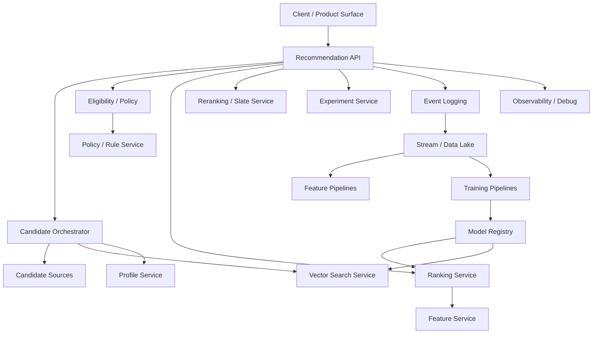
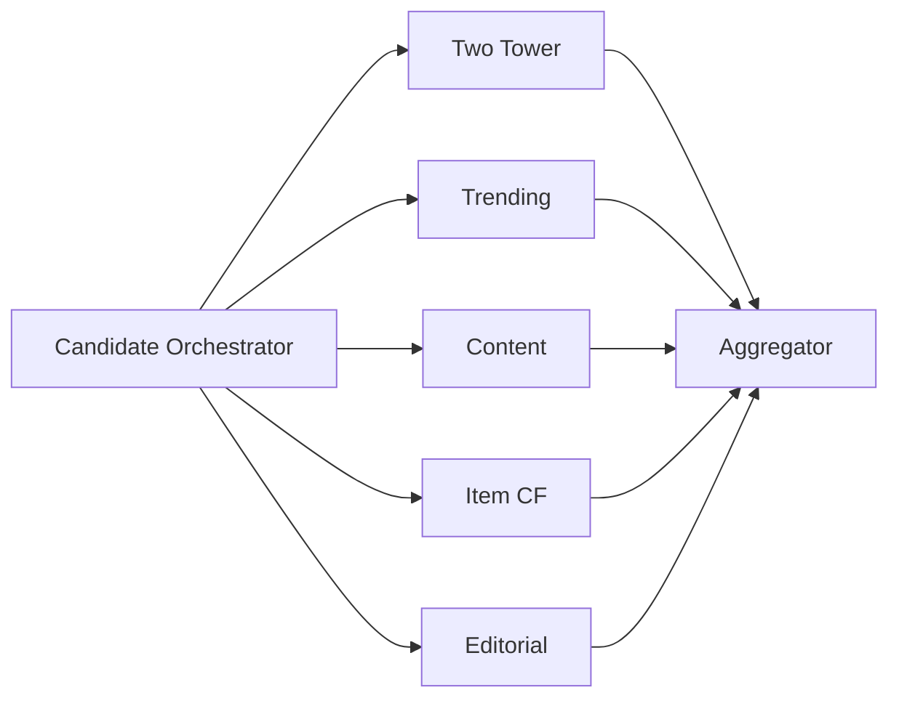

------
title: Build From Scratch Recommendations System - Part 051
description: Mendesain service decomposition untuk recommendation platform production-grade: online serving, candidate, ranking, feature, profile, vector, experiment, policy, event, training, model registry, observability, ownership, boundaries, dan failure isolation.
series: learn-build-from-scratch-recommendations-system
seriesTitle: Build From Scratch: Enterprise Recommendations System
order: 51
partTitle: Service Decomposition
tags:
  - recommendation-system
  - recsys
  - service-decomposition
  - microservices
  - system-design
  - java
  - series
date: 2026-07-02
---

# Part 051 — Service Decomposition

Mulai Part 051, kita masuk Module 7: **Production Platform Architecture**.

Sampai Part 050, kita sudah membangun mental model, data foundation, candidate generation, ranking, reranking, decision policy, dan LLM augmentation.

Sekarang pertanyaan besarnya:

> Bagaimana semua komponen itu dipecah menjadi platform production yang bisa di-scale, dioperasikan, di-debug, dan dikembangkan oleh banyak tim?

Recommendation system production-grade bukan satu service besar bernama `RecommendationService`.

Ia adalah kumpulan service dan pipeline yang bekerja bersama:

- online serving,
- candidate generation,
- ranking,
- reranking,
- feature serving,
- profile serving,
- vector serving,
- policy/rule evaluation,
- experiment assignment,
- event collection,
- offline pipelines,
- training,
- model registry,
- observability,
- governance,
- admin/config tooling.

Part ini membahas service decomposition untuk recommendation platform production-grade: boundary, ownership, online/offline split, failure isolation, service contracts, data ownership, deployment strategy, dan anti-patterns.

---

## 1. Mental Model: Recommendation Platform Is a Decision System

Platform recommendation bukan hanya “ML model serving”.

Ia adalah decision system dengan loop:

```text
collect events
build data
train/update models
serve recommendations
observe outcomes
experiment
govern policies
```

High-level architecture:



Service decomposition should reflect system responsibilities, not organization chart alone.

---

## 2. Why Decomposition Matters

Bad decomposition causes:

- one giant service with everything,
- latency chains impossible to reason about,
- no clear owners,
- deployment fear,
- model changes require product deploy,
- policy change requires code change,
- feature bugs hard to trace,
- offline/online skew,
- duplicated logic,
- impossible debugging,
- no graceful degradation.

Good decomposition provides:

- clear boundaries,
- independent scaling,
- isolated failures,
- ownership,
- reusable platform components,
- schema contracts,
- observability,
- safer experimentation.

---

## 3. Online vs Offline Systems

Recommendation platform has two worlds.

### Online Serving

Latency-critical.

```text
request -> candidates -> rank -> rerank -> response
```

Needs:

- low latency,
- high availability,
- graceful degradation,
- deterministic contracts,
- real-time context.

### Offline / Nearline Learning

Throughput/data correctness critical.

```text
events -> features -> datasets -> models -> indexes
```

Needs:

- reproducibility,
- data quality,
- lineage,
- backfill,
- validation,
- scheduling.

Do not force online and offline concerns into same service.

---

## 4. Core Online Services

Minimum online services:

```text
Recommendation API / Orchestrator
Candidate Generation Service
Ranking Service
Reranking / Slate Service
Feature Serving Service
Profile / User State Service
Vector Search Service
Policy / Eligibility Service
Experiment Assignment Service
Event Logging Gateway
```

For smaller systems, some can be libraries/modules first. But boundaries should be conceptually clear.

---

## 5. Recommendation API / Orchestrator

This is entry point from product surfaces.

Responsibilities:

- receive recommendation request,
- validate request,
- resolve surface configuration,
- call experiment assignment,
- orchestrate candidate generation,
- call eligibility/filtering,
- call ranking,
- call reranking/slate construction,
- produce response,
- log decision,
- handle fallback.

It should not:

- own all model logic,
- implement all candidate algorithms,
- run heavy offline jobs,
- contain every business rule inline.

Recommendation API is the online conductor.

---

## 6. Candidate Generation Service

Responsibilities:

- execute candidate source portfolio,
- call candidate sources in parallel,
- merge source outputs,
- preserve provenance,
- enforce source quotas/timeouts,
- return candidate pool.

Candidate sources may be sub-services:

```text
two_tower_source
item_cf_source
content_based_source
trending_source
editorial_source
new_item_exploration_source
graph_source
```

Candidate service owns retrieval recall and candidate evidence.

---

## 7. Candidate Source Boundary

A candidate source should answer:

```text
Given request context, return candidates from one retrieval strategy.
```

Candidate source should include:

- source name/version,
- candidate IDs,
- source score,
- source rank,
- provenance,
- diagnostics,
- timeout/failure status.

It should not final-rank or final-filter everything.

Output is evidence, not final decision.

---

## 8. Ranking Service

Responsibilities:

- resolve ranking model/policy,
- assemble features or call feature assembler,
- batch score candidates,
- calibrate predictions,
- compose utility,
- return scored candidates and diagnostics.

Ranking service owns:

- model serving,
- feature schema compatibility,
- model bundle,
- score semantics,
- model-level fallback.

It should not own final slate diversity/frequency constraints entirely.

---

## 9. Reranking / Slate Service

Responsibilities:

- build final slate from scored candidates,
- enforce slate constraints,
- apply diversity/novelty/frequency/source mix,
- handle sponsored/exploration slots,
- include required items,
- final safety check,
- return final ordered items.

In many systems reranking starts inside Recommendation API as a library. As complexity grows, it becomes service/library with versioned policy.

---

## 10. Feature Serving Service

Responsibilities:

- serve online features,
- batch feature lookup,
- expose freshness,
- return missing/default indicators,
- enforce feature access controls,
- provide feature schemas,
- support online/offline parity checks.

Feature service should not be a generic ungoverned key-value dump.

Feature semantics matter.

---

## 11. Profile / User State Service

Responsibilities:

- user preference aggregates,
- recent profile,
- session state,
- anonymous state,
- suppression state,
- exposure/frequency state,
- consent-aware access.

Some teams split:

```text
Profile Service
Session State Service
Suppression Service
Frequency Service
```

But conceptually they manage user/subject state used by recommendations.

---

## 12. Vector Search Service

Responsibilities:

- ANN index serving,
- vector search,
- embedding lookup,
- index version routing,
- compatibility checks,
- vector search diagnostics,
- fallback if index unavailable.

It should not know product business logic deeply.

It provides vector retrieval primitive with metadata.

---

## 13. Embedding / Vector Store Service

Sometimes separate from ANN search.

Responsibilities:

- get embedding by entity,
- batch get vectors,
- expose embedding metadata,
- route versions,
- support freshness/coverage monitoring,
- enforce access control.

ANN service searches; vector store looks up. They may share infrastructure but have different contracts.

---

## 14. Policy / Rule / Eligibility Service

Responsibilities:

- hard eligibility rules,
- policy constraints,
- business rule evaluation,
- tenant rules,
- user suppression interpretation,
- permission checks,
- reason codes,
- rule versioning/audit.

This service may integrate with external policy/inventory/catalog/permission systems.

Critical rule dependencies should fail safe.

---

## 15. Experiment Assignment Service

Responsibilities:

- assign users/requests to experiments,
- return variant/config,
- ensure deterministic assignment,
- avoid conflict between experiments,
- log exposure to variants,
- provide config to orchestrator/ranking/reranking.

Recommendation stack uses experiments for:

- candidate source,
- ranking model,
- utility weights,
- slate policy,
- exploration policy,
- LLM explanation.

Experiment assignment must be consistent across services.

---

## 16. Event Logging Gateway

Responsibilities:

- receive impression/click/action events,
- validate schema,
- deduplicate,
- enrich envelope,
- route to stream/data lake,
- provide ack/diagnostics,
- protect against schema drift.

Event logging is product-critical.

If events are wrong, training and evaluation become wrong.

---

## 17. Debug / Trace Service

Production RecSys needs debug.

Responsibilities:

- request trace retrieval,
- candidate source diagnostics,
- filter decisions,
- model scores,
- feature values,
- rule decisions,
- final slate reasons,
- replay support,
- access control/redaction.

This may be an internal tool/service built over logs and trace stores.

Without debug tooling, incidents take too long.

---

## 18. Offline Platform Services

Offline/nearline components:

```text
Event Stream Processing
Data Quality Service
Feature Pipeline
Training Dataset Builder
Model Training Orchestrator
Model Registry
Embedding Pipeline
Index Builder
Batch Scoring Pipeline
Experiment Analysis Pipeline
Observability / Metrics Pipeline
```

These may not be synchronous services, but they are platform components with owners/contracts.

---

## 19. Feature Pipeline

Responsibilities:

- compute batch/nearline features,
- maintain feature definitions,
- produce offline/online features,
- support backfill,
- validate feature quality,
- publish to feature store,
- monitor drift.

Feature pipeline owns feature correctness.

---

## 20. Training Dataset Builder

Responsibilities:

- build point-in-time training examples,
- join labels/features/candidates,
- handle negative sampling,
- temporal splits,
- leakage checks,
- dataset versioning,
- quality gates,
- lineage.

This is a platform component, not a one-off notebook.

---

## 21. Model Training Orchestrator

Responsibilities:

- run training jobs,
- track parameters,
- evaluate models,
- produce artifacts,
- calibrate,
- validate,
- register candidate models,
- schedule retraining.

Could integrate with workflow orchestration.

Important: training should be reproducible.

---

## 22. Model Registry

Responsibilities:

- store model metadata,
- artifact location,
- feature set version,
- dataset version,
- evaluation metrics,
- approval status,
- deployment status,
- rollback history.

Online ranking/vector services load approved artifacts from registry.

---

## 23. Embedding Pipeline and Index Builder

Responsibilities:

- generate embeddings,
- validate vector quality,
- publish embedding versions,
- build ANN indexes,
- benchmark recall/latency,
- atomic index publish,
- rollback.

Candidate retrieval depends on this pipeline.

---

## 24. Batch Scoring Pipeline

Some recommendations are precomputed.

Responsibilities:

- score users/items offline,
- generate recommendation lists,
- write to serving store,
- validate coverage,
- refresh on schedule,
- fallback online if stale.

Useful for email, push, low-latency surfaces, cold-start fallback.

---

## 25. Service Boundary Principles

Use these principles:

### Single Primary Responsibility

Each service owns one domain.

### Clear Contracts

Input/output schemas versioned.

### Data Ownership

Service owns specific data views.

### Failure Isolation

Service can fail without crashing whole stack.

### Latency Awareness

Online services have strict budgets.

### Observability

Every service emits metrics/traces.

### Evolvability

Model/policy/config can change without redeploying unrelated services.

---

## 26. Ownership Boundaries

Example ownership:

| Component | Owner |
|---|---|
| Recommendation API | RecSys Serving Team |
| Candidate Sources | Retrieval Team |
| Ranking Service | Ranking ML Team |
| Feature Store | ML Platform |
| Profile Store | Personalization Platform |
| Policy Rules | Product/Policy Platform |
| Experiment Service | Experimentation Platform |
| Event Logging | Data Platform |
| Training Pipeline | RecSys ML |
| Model Registry | ML Platform |
| Debug Tools | RecSys Platform |

Actual org varies, but ownership must be explicit.

---

## 27. Service Granularity

Too coarse:

```text
one monolith does everything
```

Too fine:

```text
50 microservices in request path
```

Aim for:

- clear boundaries,
- minimal request-path hops,
- reusable components,
- low operational overhead.

Start modular monolith or few services if team small. Split when scale/ownership/failure isolation requires.

Architecture should evolve.

---

## 28. Request Path Latency

Each service call adds latency and failure risk.

Hot path should be lean:

```text
Rec API
-> Candidate Orchestrator
-> Feature/Ranking
-> Reranking
```

Candidate sources can run in parallel.

Avoid serial chain:

```text
A -> B -> C -> D -> E
```

if each adds network latency.

Use parallelism, batching, and timeouts.

---

## 29. Parallel Candidate Generation

Candidate sources should run in parallel.



Each source has timeout and optional/required status.

If optional source fails, continue with fallback.

---

## 30. Failure Isolation

Define degradation:

```text
two_tower source timeout -> use content/trending
ranking service timeout -> fallback ranker
feature store timeout -> defaults/stale features
policy service unavailable -> fail closed or safe fallback
event logging degraded -> buffer/async but monitor
```

Not all failures equal.

Critical policy/access failure should not fail open.

---

## 31. Synchronous vs Asynchronous

Online serving uses synchronous calls.

Offline/nearline uses asynchronous events/jobs.

Examples asynchronous:

- event ingestion,
- feature updates,
- embedding generation,
- index build,
- model training,
- batch scoring.

Do not make request wait for training/embedding generation.

For fresh updates, use nearline state and delta indexes.

---

## 32. Data Contracts Between Online and Offline

Online logs decisions/events. Offline consumes them.

Offline produces:

- features,
- embeddings,
- models,
- indexes,
- configs.

Contracts:

```text
event schemas
feature schemas
model bundle schemas
embedding metadata
index metadata
candidate log schemas
```

Schema evolution must be managed.

---

## 33. Multi-Surface Support

Recommendation platform serves many surfaces:

```text
home
PDP
cart
search
email
push
enterprise case panel
knowledge article panel
```

Avoid one-off service per surface unless needed.

Use:

- shared platform,
- surface config,
- surface-specific candidate policies,
- surface-specific rankers,
- shared contracts.

Recommendation API can route by surface.

---

## 34. Multi-Tenant Support

For enterprise:

- tenant config,
- tenant feature isolation,
- tenant policy,
- tenant model/calibration if needed,
- tenant data access,
- tenant observability.

Services must carry `tenant_id` through request context and logs.

Never assume global data is allowed.

---

## 35. Config and Control Plane

Recommendation behavior is driven by config:

```text
candidate source mix
ranker route
utility weights
slate policy
rule bundle
exploration policy
fallback policy
surface config
tenant config
```

Need control plane:

- validation,
- versioning,
- rollout,
- rollback,
- approval,
- audit.

Config changes can be as impactful as code deploys.

---

## 36. Data Plane vs Control Plane

Data plane:

```text
serves online requests
```

Control plane:

```text
manages configs/models/policies/experiments
```

Separate concerns.

Data plane should read validated immutable configs.

Control plane handles editing/review/deployment.

---

## 37. Observability Across Services

Use distributed tracing.

Trace should show:

```text
request_id
candidate source latencies
candidate counts
filter counts
feature fetch latency
model version
ranking latency
reranking decisions
fallback used
event logging status
```

Every response should have trace ID.

Without cross-service trace, debugging is guesswork.

---

## 38. Decision Logging

Recommendation response should log decision:

```text
request context
candidate pool sampled/full
scores
rules
final slate
model versions
policy versions
experiment variants
propensity if exploration
```

Decision log bridges online/offline.

It is essential for training, analysis, and audit.

---

## 39. Security Boundaries

Services need:

- service-to-service auth,
- tenant isolation,
- least privilege,
- access control for debug,
- encryption in transit,
- redaction of sensitive fields,
- audit logs.

Recommendation stack handles behavioral data and possibly sensitive enterprise data.

Security is not optional.

---

## 40. Java Service Implementation Considerations

For Java production stack:

- use schema-first APIs,
- strong typed DTOs,
- explicit timeouts,
- bulk endpoints,
- circuit breakers,
- structured logs,
- metrics per dependency,
- immutable config snapshots,
- dependency injection for model/client routing,
- testcontainers for integration tests,
- contract tests for service boundaries.

Avoid:

- unbounded maps everywhere,
- hidden static config,
- per-candidate remote calls,
- blocking on slow optional sources.

---

## 41. Modular Monolith First?

If team small, start with modular monolith:

```text
rec-api module
candidate module
ranking module
feature client module
policy module
slate module
logging module
```

Use clear internal interfaces.

Split into services when:

- independent scaling needed,
- owner boundary clear,
- deployment cadence differs,
- latency/failure isolation needed,
- reuse across products.

Premature microservices create overhead.

---

## 42. Service Decomposition Anti-Patterns

### 42.1 Mega Recommendation Service

Everything in one deploy.

### 42.2 Microservice Explosion

Too many network hops.

### 42.3 No Owner for Feature Logic

Feature bugs everywhere.

### 42.4 Candidate Source Does Ranking

Boundary confusion.

### 42.5 Ranking Service Does Policy Access

Safety duplication.

### 42.6 Config Without Versioning

Cannot replay decisions.

### 42.7 Offline Pipeline in Online Service

Latency and reliability issue.

### 42.8 No Debug Service

Incidents slow.

### 42.9 Shared Database Ownership

Services mutate each other's data.

### 42.10 No Fallback Strategy

One dependency outage kills all recommendations.

---

## 43. Reference Service Map

```text
Online:
  rec-api
  candidate-orchestrator
  candidate-source-two-tower
  candidate-source-trending
  vector-search
  feature-service
  profile-service
  policy-service
  ranking-service
  slate-service
  experiment-service
  event-gateway

Offline/Nearline:
  stream-processor
  feature-pipeline
  embedding-pipeline
  index-builder
  dataset-builder
  training-orchestrator
  model-registry
  batch-scoring
  experiment-analysis
  observability-pipeline

Control Plane:
  surface-config-admin
  model-deployment-admin
  rule-policy-admin
  experiment-admin
  feature-registry
```

This is reference, not mandatory starting shape.

---

## 44. Minimal Production Decomposition Plan

Phase 1:

```text
Rec API modular service
Candidate sources as internal modules
Ranking as internal module or separate service
Feature/Profile clients
Event logging
Basic model registry/config
```

Phase 2:

```text
Separate ranking service
Separate candidate orchestrator
Vector search service
Feature service
Policy service
Experiment service
```

Phase 3:

```text
Control plane
Model deployment automation
Replay/debug tooling
Batch scoring
Advanced observability
Tenant-specific routing
```

Evolve by pain and scale.

---

## 45. Checklist Service Decomposition Readiness

```text
[ ] Online and offline responsibilities are separated.
[ ] Recommendation API orchestration boundary is clear.
[ ] Candidate source contract is clear.
[ ] Ranking service boundary is clear.
[ ] Reranking/slate policy boundary is clear.
[ ] Feature/profile/vector/policy services have owners.
[ ] Experiment assignment is centralized/consistent.
[ ] Event logging gateway validates schemas.
[ ] Model registry/control plane exists or is planned.
[ ] Configs/models/rules are versioned.
[ ] Request-path services have timeouts and fallbacks.
[ ] Candidate sources can run in parallel.
[ ] Debug/trace tooling is planned.
[ ] Tenant/privacy/security context flows through services.
[ ] Decision logs connect online serving to offline learning.
[ ] Service ownership is documented.
```

---

## 46. Kesimpulan

Service decomposition mengubah recommendation system dari proyek ML menjadi platform production.

Prinsip utama:

1. Recommendation platform is a decision system, not just model serving.
2. Online serving and offline learning have different requirements.
3. Recommendation API orchestrates; candidate/ranking/slate/policy services own specialized responsibilities.
4. Candidate sources provide evidence, not final decisions.
5. Ranking scores candidates; reranking builds final slate.
6. Feature/profile/vector services are platform primitives.
7. Policies, experiments, and configs need versioned control plane.
8. Failure isolation and graceful degradation must be designed upfront.
9. Observability and decision logging connect all services.
10. Start modular, split services when scale/ownership/failure isolation justifies it.

Di Part 052, kita akan membahas **API Contracts and Schema-First Design**: bagaimana mendesain kontrak antar-service agar recommendation platform stabil, evolvable, testable, dan aman untuk banyak tim.
