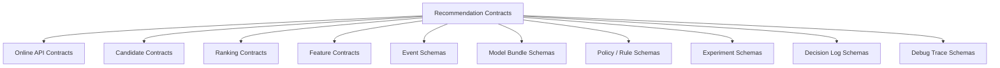

------
title: Build From Scratch Recommendations System - Part 052
description: Mendesain API contracts dan schema-first design untuk recommendation platform production-grade: request/response schemas, event schemas, candidate contracts, feature contracts, model contracts, versioning, compatibility, validation, contract tests, and schema evolution.
series: learn-build-from-scratch-recommendations-system
seriesTitle: Build From Scratch: Enterprise Recommendations System
order: 52
partTitle: API Contracts and Schema-First Design
tags:
  - recommendation-system
  - recsys
  - api-design
  - schema-first
  - contracts
  - openapi
  - java
  - series
date: 2026-07-02
---

# Part 052 — API Contracts and Schema-First Design

Recommendation platform production-grade terdiri dari banyak service dan pipeline.

Agar semua bagian bisa berkembang tanpa saling merusak, kita membutuhkan kontrak yang jelas:

- request/response API,
- candidate contract,
- ranking contract,
- feature contract,
- event schema,
- model bundle schema,
- rule policy schema,
- experiment assignment schema,
- debug trace schema,
- decision log schema.

Tanpa schema-first design, sistem akan penuh `Map<String, Object>`, field tidak jelas, perubahan diam-diam, backward compatibility rusak, training data tidak konsisten, dan incident sulit direplay.

Part ini membahas API contracts dan schema-first design untuk recommendation platform: prinsip, schema boundaries, versioning, validation, compatibility, contract testing, schema evolution, Java implementation, dan anti-patterns.

---

## 1. Mental Model: Contract Is the Boundary of Trust

Service A memanggil Service B.

Kontrak menjawab:

```text
Apa input valid?
Apa output valid?
Field apa yang wajib?
Field apa yang optional?
Apa semantics setiap field?
Apa version?
Bagaimana error direpresentasikan?
Bagaimana backward compatibility dijaga?
```

Kontrak bukan hanya dokumentasi. Kontrak adalah executable agreement.

Schema-first means:

```text
design schema first
generate/validate code from schema
test compatibility
then implement
```

---

## 2. Why Schema-First Matters for RecSys

Recommendation platform punya banyak moving parts:

- models change,
- features change,
- events evolve,
- candidate sources added,
- rules change,
- surfaces added,
- tenants differ,
- experiments modify behavior.

Schema-first helps:

- avoid silent contract drift,
- enable multi-team development,
- support replay,
- validate data quality,
- generate clients,
- document APIs,
- test compatibility,
- govern changes.

In RecSys, bad schema often becomes bad model.

---

## 3. Contract Types



Each contract has different compatibility needs.

---

## 4. Recommendation Request Schema

Core request:

```yaml
RecommendationRequest:
  type: object
  required:
    - request_id
    - surface
    - subject
    - context
  properties:
    request_id:
      type: string
    surface:
      type: string
    subject:
      $ref: '#/components/schemas/Subject'
    context:
      $ref: '#/components/schemas/RequestContext'
    constraints:
      $ref: '#/components/schemas/RequestConstraints'
    debug:
      $ref: '#/components/schemas/DebugOptions'
```

Avoid ambiguous request fields.

Bad:

```json
{"type": "home", "uid": "123", "data": {...}}
```

Good:

```json
{"surface": "home_feed", "subject": {"user_id": "u123"}}
```

---

## 5. Subject Schema

Subject identifies who/what receives recommendation.

```yaml
Subject:
  type: object
  properties:
    user_id:
      type: string
    anonymous_id:
      type: string
    session_id:
      type: string
    tenant_id:
      type: string
    actor_id:
      type: string
    account_id:
      type: string
```

Rules:

- support anonymous and logged-in,
- include tenant for enterprise,
- include session,
- do not require user_id for all requests,
- privacy/consent must be explicit elsewhere.

---

## 6. Request Context Schema

Context:

```yaml
RequestContext:
  type: object
  required:
    - request_time
    - region
    - locale
  properties:
    request_time:
      type: string
      format: date-time
    region:
      type: string
    locale:
      type: string
    device_type:
      type: string
    privacy_mode:
      type: string
      enum: [personalized, contextual_only, non_personalized]
    surface_context:
      type: object
      additionalProperties: true
```

Be careful with `additionalProperties`.

Core fields should be typed. Surface-specific fields can be typed per surface schema.

---

## 7. Candidate Contract

Candidate source output:

```yaml
Candidate:
  type: object
  required:
    - item_id
    - item_type
    - source
    - source_version
  properties:
    item_id:
      type: string
    item_type:
      type: string
    source:
      type: string
    source_version:
      type: string
    source_score:
      type: number
    source_score_type:
      type: string
    source_rank:
      type: integer
    generated_at:
      type: string
      format: date-time
    provenance:
      type: object
```

Candidate contract preserves retrieval evidence.

---

## 8. Aggregated Candidate Contract

After merging sources:

```yaml
AggregatedCandidate:
  type: object
  required:
    - item_id
    - item_type
    - sources
  properties:
    item_id:
      type: string
    item_type:
      type: string
    dedup_group_id:
      type: string
    sources:
      type: array
      items:
        $ref: '#/components/schemas/CandidateSourceEvidence'
    metadata:
      type: object
```

Candidate can have multiple source evidence records.

Do not lose source info during dedup.

---

## 9. Candidate Source Evidence

```yaml
CandidateSourceEvidence:
  type: object
  required:
    - source
    - source_version
  properties:
    source:
      type: string
    source_version:
      type: string
    raw_score:
      type: number
    normalized_score:
      type: number
    score_type:
      type: string
    rank:
      type: integer
    reason:
      type: string
    generated_at:
      type: string
      format: date-time
```

Score type semantics should be documented.

---

## 10. Ranking Request Contract

Ranking request:

```yaml
RankingRequest:
  type: object
  required:
    - request_id
    - surface
    - subject
    - context
    - candidates
  properties:
    request_id:
      type: string
    surface:
      type: string
    subject:
      $ref: '#/components/schemas/Subject'
    context:
      $ref: '#/components/schemas/RequestContext'
    candidates:
      type: array
      items:
        $ref: '#/components/schemas/AggregatedCandidate'
    model_route_hint:
      type: string
    debug:
      $ref: '#/components/schemas/DebugOptions'
```

Ranking service should not accept raw unknown candidate blobs.

---

## 11. Ranking Response Contract

```yaml
RankingResponse:
  type: object
  required:
    - request_id
    - model_metadata
    - scored_candidates
  properties:
    request_id:
      type: string
    model_metadata:
      $ref: '#/components/schemas/RankingModelMetadata'
    scored_candidates:
      type: array
      items:
        $ref: '#/components/schemas/ScoredCandidate'
    diagnostics:
      $ref: '#/components/schemas/RankingDiagnostics'
```

Scored candidate:

```yaml
ScoredCandidate:
  type: object
  required:
    - item_id
    - rank_score
  properties:
    item_id:
      type: string
    rank_score:
      type: number
    predictions:
      type: object
      additionalProperties:
        type: number
    score_components:
      type: object
      additionalProperties:
        type: number
    feature_missing_count:
      type: integer
```

---

## 12. Slate Response Contract

Final response to client:

```yaml
RecommendationResponse:
  type: object
  required:
    - request_id
    - slate_id
    - items
  properties:
    request_id:
      type: string
    slate_id:
      type: string
    items:
      type: array
      items:
        $ref: '#/components/schemas/RecommendationItem'
    metadata:
      $ref: '#/components/schemas/ResponseMetadata'
```

Recommendation item:

```yaml
RecommendationItem:
  type: object
  required:
    - item_id
    - position
  properties:
    item_id:
      type: string
    item_type:
      type: string
    position:
      type: integer
    reason_codes:
      type: array
      items:
        type: string
    disclosure:
      $ref: '#/components/schemas/Disclosure'
    tracking:
      $ref: '#/components/schemas/TrackingToken'
```

Client needs tracking token for events.

---

## 13. Tracking Token Contract

Tracking token links response to events.

```yaml
TrackingToken:
  type: object
  required:
    - request_id
    - slate_id
    - impression_id
    - item_id
    - position
  properties:
    request_id:
      type: string
    slate_id:
      type: string
    impression_id:
      type: string
    item_id:
      type: string
    position:
      type: integer
    experiment_assignments:
      type: array
      items:
        type: string
```

Tracking token may be encoded/signed.

Events should include it.

---

## 14. Event Schema

Impression event:

```yaml
ImpressionEvent:
  type: object
  required:
    - event_id
    - event_time
    - request_id
    - slate_id
    - impression_id
    - item_id
    - position
    - surface
  properties:
    event_id:
      type: string
    event_time:
      type: string
      format: date-time
    request_id:
      type: string
    slate_id:
      type: string
    impression_id:
      type: string
    item_id:
      type: string
    position:
      type: integer
    surface:
      type: string
    visible:
      type: boolean
    viewable_ms:
      type: integer
```

Event schemas are critical for training.

---

## 15. Action Event Schema

Click/purchase/hide/action:

```yaml
EngagementEvent:
  type: object
  required:
    - event_id
    - event_time
    - event_type
    - subject
    - item_id
  properties:
    event_id:
      type: string
    event_time:
      type: string
      format: date-time
    event_type:
      type: string
      enum: [click, save, hide, report, add_to_cart, purchase, action_accept, action_complete]
    request_id:
      type: string
    impression_id:
      type: string
    item_id:
      type: string
    subject:
      $ref: '#/components/schemas/Subject'
    value:
      type: number
    metadata:
      type: object
```

Linking to impression is important for attribution.

---

## 16. Feature Contract

Feature definition:

```yaml
FeatureDefinition:
  type: object
  required:
    - name
    - version
    - dtype
    - owner
    - timestamp_semantics
  properties:
    name:
      type: string
    version:
      type: string
    dtype:
      type: string
    entity:
      type: string
    freshness_sla:
      type: string
    default_policy:
      type: string
    privacy_class:
      type: string
    timestamp_semantics:
      type: string
```

Feature values should include freshness/missing semantics if needed.

---

## 17. Feature Value Contract

```yaml
FeatureValue:
  type: object
  required:
    - name
    - value
  properties:
    name:
      type: string
    value: {}
    feature_version:
      type: string
    generated_at:
      type: string
      format: date-time
    is_missing:
      type: boolean
    missing_reason:
      type: string
```

For high-throughput, online service may use compact tensor format, but schema metadata still matters.

---

## 18. Model Bundle Schema

```yaml
ModelBundle:
  type: object
  required:
    - model_name
    - model_version
    - artifact_uri
    - feature_set_version
    - status
  properties:
    model_name:
      type: string
    model_version:
      type: string
    artifact_uri:
      type: string
    feature_set_version:
      type: string
    calibration_version:
      type: string
    utility_policy_version:
      type: string
    training_dataset_version:
      type: string
    status:
      type: string
      enum: [candidate, shadow, canary, production, archived]
```

Model bundle schema ensures compatibility.

---

## 19. Policy Rule Schema

```yaml
RecommendationRule:
  type: object
  required:
    - rule_id
    - version
    - stage
    - decision_type
    - severity
    - scope
  properties:
    rule_id:
      type: string
    version:
      type: string
    stage:
      type: string
    decision_type:
      type: string
      enum: [reject, boost, penalize, require, cap]
    severity:
      type: string
      enum: [critical, high, medium, low]
    scope:
      type: object
    condition:
      type: object
    action:
      type: object
    expires_at:
      type: string
      format: date-time
```

Rule configs need schema validation before deployment.

---

## 20. Experiment Assignment Schema

```yaml
ExperimentAssignment:
  type: object
  required:
    - experiment_id
    - variant
    - assignment_unit
  properties:
    experiment_id:
      type: string
    variant:
      type: string
    assignment_unit:
      type: string
    assigned_at:
      type: string
      format: date-time
    config_overrides:
      type: object
```

Assignments should be logged in recommendation response and events.

---

## 21. Decision Log Schema

Decision log links all parts.

```yaml
DecisionLog:
  type: object
  required:
    - request_id
    - slate_id
    - decision_time
    - surface
    - model_versions
    - policy_versions
    - final_items
  properties:
    request_id:
      type: string
    slate_id:
      type: string
    decision_time:
      type: string
      format: date-time
    surface:
      type: string
    candidate_count:
      type: integer
    model_versions:
      type: object
    policy_versions:
      type: object
    experiment_assignments:
      type: array
    final_items:
      type: array
      items:
        $ref: '#/components/schemas/LoggedSlateItem'
```

Decision log schema is essential for replay and training.

---

## 22. Error Contract

Do not return random error strings.

```yaml
ErrorResponse:
  type: object
  required:
    - error_code
    - message
    - retryable
  properties:
    error_code:
      type: string
    message:
      type: string
    retryable:
      type: boolean
    details:
      type: object
```

Common error codes:

```text
INVALID_REQUEST
SURFACE_NOT_SUPPORTED
NO_ELIGIBLE_CANDIDATES
DEPENDENCY_TIMEOUT
MODEL_UNAVAILABLE
POLICY_FAILURE
TENANT_NOT_AUTHORIZED
```

---

## 23. Versioning Strategy

Use:

```text
API version
schema version
field version if needed
model/feature/rule version
```

Example API:

```text
/recommendations/v1
/ranking/v1
```

Schema evolution should be backward compatible when possible.

Rule:

```text
add optional fields safely
do not remove/rename required fields without new version
do not change semantics silently
```

---

## 24. Backward-Compatible Changes

Usually safe:

- add optional field,
- add enum value if clients handle unknown,
- add metadata object,
- add diagnostics field.

Risky:

- change field semantics,
- change units,
- make optional field required,
- remove field,
- rename field,
- change enum behavior,
- change default.

Example semantic break:

```text
score field used to mean raw logit, now means calibrated probability
```

This must be new field/version.

---

## 25. Enum Evolution

Enums are dangerous.

If client does not handle unknown enum, new value breaks it.

Guideline:

- clients should handle `UNKNOWN`,
- servers should document enum additions,
- major enum semantic changes need version.

Example:

```text
privacy_mode: contextual_only
```

If old client only knows personalized/non_personalized, what happens?

Test it.

---

## 26. Null and Missing Semantics

Define null.

Possible meanings:

- unknown,
- not applicable,
- unavailable,
- no consent,
- timeout,
- not computed,
- defaulted.

Prefer explicit missing reason.

```json
{
  "feature": "user_category_affinity",
  "value": null,
  "is_missing": true,
  "missing_reason": "no_user_history"
}
```

Silent nulls cause model bugs.

---

## 27. Units and Time Semantics

Always specify units.

Bad:

```json
{"duration": 10}
```

Good:

```json
{"duration_ms": 10000}
```

Timestamps:

- event_time,
- ingestion_time,
- generated_at,
- valid_from,
- valid_until.

Do not mix event time and processing time.

---

## 28. ID Semantics

Define ID types.

```text
user_id
anonymous_id
session_id
item_id
sku_id
product_id
dedup_group_id
creator_id
tenant_id
request_id
slate_id
impression_id
event_id
```

Do not use one field `id` everywhere.

ID confusion creates dedup/training/security issues.

---

## 29. OpenAPI for Synchronous APIs

Use OpenAPI for HTTP APIs.

Benefits:

- documentation,
- client generation,
- request validation,
- contract testing,
- examples,
- schema review.

Services:

```text
Recommendation API
Ranking Service
Candidate Service
Feature Service
Policy Service
Experiment Service
Debug Service
```

For Java, generate DTOs or use schema validation against POJOs.

---

## 30. Async/Event Schemas

For Kafka/event streams, use schema registry pattern.

Schemas:

- impression event,
- engagement event,
- decision log,
- feature update,
- item update,
- user suppression update,
- model deployment event.

Use compatibility rules.

```text
backward
forward
full
```

Schema changes should be reviewed.

---

## 31. Avro/Protobuf/JSON Schema

Options:

### JSON Schema

Human-friendly, web-friendly.

### Avro

Common in data pipelines/Kafka.

### Protobuf

Compact, strongly typed, good for RPC.

### OpenAPI

HTTP API contract.

Choice matters less than discipline.

Do not mix ungoverned ad hoc JSON everywhere.

---

## 32. Contract Tests

Contract tests verify provider and consumer compatibility.

Examples:

- Candidate service response validates schema.
- Ranking service accepts candidate contract.
- Client can parse new optional fields.
- Event producer emits valid schema.
- Dataset builder can read event schema version.
- Policy rule config validates before publish.

Run in CI.

---

## 33. Consumer-Driven Contracts

Consumer specifies expectations.

Example ranking service expects candidate fields:

```text
item_id
item_type
source
source_version
source_score_type
```

Candidate service cannot remove them.

Consumer-driven tests catch breaking changes.

---

## 34. Schema Validation in Production

Validate:

- incoming requests,
- candidate source outputs,
- events,
- configs,
- model bundles.

For high-QPS, validation can be sampled or optimized, but critical boundaries should validate.

Invalid schema should produce metrics and clear errors.

---

## 35. Data Quality Rules from Schema

Schema can enforce:

- required fields,
- type,
- enum,
- range,
- format,
- max length.

But semantic validation needs additional rules.

Example:

```text
position >= 0
event_time not too far in future
source_score_type compatible with source
tenant_id required for enterprise surface
```

Schema + semantic validation.

---

## 36. Schema Evolution Workflow

Workflow:

1. propose schema change,
2. check compatibility,
3. update examples/docs,
4. run contract tests,
5. deploy producer supporting old/new if needed,
6. deploy consumers,
7. monitor,
8. deprecate old field,
9. remove in major version.

Never change schema semantics silently.

---

## 37. Deprecation

Deprecate fields with:

```yaml
deprecated: true
x-deprecation-date: 2026-10-01
x-replacement: new_field
```

Track consumers.

Do not remove until consumers migrated.

In event streams, old fields can persist for long time because historical data exists.

---

## 38. Schema Examples

Every schema should include examples.

Example request/response/event helps:

- developers,
- tests,
- docs,
- debugging.

Examples should be realistic and cover:

- personalized,
- anonymous,
- enterprise tenant,
- debug,
- fallback,
- error.

---

## 39. Documentation

For each contract document:

```text
purpose
owner
version
field semantics
required/optional
compatibility rules
examples
error codes
privacy considerations
deprecation policy
```

Documentation belongs near schema, not hidden in wiki only.

---

## 40. Java Implementation Pattern

Recommended:

- define OpenAPI/Protobuf/Avro schemas,
- generate DTOs,
- map DTOs to domain objects,
- validate at boundary,
- keep business logic using domain types,
- avoid leaking generated classes everywhere if they are awkward,
- write contract tests.

Example boundary:

```text
HTTP JSON -> Generated DTO -> Validator -> Domain Request
```

Domain model remains clean.

---

## 41. Schema-First with JAX-RS/Jersey

For Java JAX-RS/Jersey:

- define OpenAPI first,
- generate interfaces/DTOs or validate annotations,
- implement resource classes,
- use request validators,
- return structured error responses,
- publish OpenAPI docs,
- run contract tests.

Even if not generating server stubs, OpenAPI should be source of truth.

---

## 42. Strong Types over Generic Maps

Generic maps are tempting:

```java
Map<String, Object> context;
```

Use them only at extension boundaries.

Core fields should be typed:

```java
record RequestContext(
    Instant requestTime,
    String region,
    Locale locale,
    PrivacyMode privacyMode,
    DeviceType deviceType
) {}
```

For feature values, maps may be unavoidable, but schema registry should define feature names/types.

---

## 43. Extension Fields

Sometimes surfaces need custom fields.

Use namespaced extensions:

```json
{
  "surface_context": {
    "pdp.seed_item_id": "item_123",
    "checkout.cart_id": "cart_456"
  }
}
```

or typed oneof/discriminator.

Do not let arbitrary extension fields become undocumented core dependencies.

---

## 44. Compatibility Between Model and Feature Schema

Model expects feature set.

Contract:

```text
model.feature_set_version == feature_assembler.output_version
```

Validate before serving.

Feature schema mismatch is a severe bug.

Model bundle should declare required features and types.

---

## 45. Contract for Debug Traces

Debug trace schema should be explicit.

Fields:

```text
candidate source diagnostics
filter decisions
feature values
model scores
rule decisions
reranking adjustments
final reasons
```

But debug output may contain sensitive data. Schema should mark sensitivity.

Example:

```yaml
field: user_category_affinity
privacy_class: behavioral
debug_visibility: internal_only
```

---

## 46. Privacy in Schemas

Schemas should mark privacy class.

Examples:

```yaml
x-privacy-class: behavioral
x-retention-days: 90
x-debug-redaction: hash
```

This helps governance.

For enterprise:

```text
tenant_confidential
case_sensitive
personal_data
```

Schema metadata informs logging/redaction.

---

## 47. Schema Anti-Patterns

### 47.1 `Map<String,Object>` Everywhere

No contract.

### 47.2 Field Semantics Change Silently

Training/serving break.

### 47.3 No Event Schema Registry

Data lake chaos.

### 47.4 No Required Field Discipline

Consumers guess.

### 47.5 Enum Breakage

New enum crashes old clients.

### 47.6 Score Field Ambiguous

Raw? normalized? calibrated?

### 47.7 ID Confusion

item vs SKU vs product.

### 47.8 No Decision Log Schema

Replay impossible.

### 47.9 Schema Not Tested

Docs lie.

### 47.10 Generated DTOs Used as Domain Logic Everywhere

Code becomes schema-coupled mess.

---

## 48. Implementation Sketch: Java DTO to Domain

```java
public final class RecommendationRequestMapper {
    public RecommendationRequest toDomain(RecommendationRequestDto dto) {
        validate(dto);

        return new RecommendationRequest(
            RequestId.of(dto.getRequestId()),
            Surface.of(dto.getSurface()),
            new Subject(
                UserId.optional(dto.getSubject().getUserId()),
                AnonymousId.optional(dto.getSubject().getAnonymousId()),
                SessionId.optional(dto.getSubject().getSessionId()),
                TenantId.optional(dto.getSubject().getTenantId())
            ),
            mapContext(dto.getContext())
        );
    }
}
```

Boundary validation and mapping prevent schema leakage into core domain.

---

## 49. Implementation Sketch: Contract Test

```java
@Test
void rankingResponse_shouldMatchOpenApiSchema() {
    RankingResponse response = sampleRankingResponse();

    String json = objectMapper.writeValueAsString(response);

    SchemaValidationResult result = openApiValidator.validateResponse(
        "/ranking/v1/score",
        200,
        json
    );

    assertTrue(result.isValid(), result.errors().toString());
}
```

Run tests for all critical APIs.

---

## 50. Minimal Production Schema-First Plan

Start with schemas for:

```yaml
online_apis:
  - RecommendationRequest
  - RecommendationResponse
  - RankingRequest
  - RankingResponse
  - CandidateSourceResponse
events:
  - DecisionLog
  - ImpressionEvent
  - EngagementEvent
configs:
  - ModelBundle
  - SlatePolicy
  - RuleBundle
  - ExperimentAssignment
features:
  - FeatureDefinition
  - FeatureSet
validation:
  - CI schema compatibility
  - runtime boundary validation
  - contract tests
```

Keep schemas small but strict.

---

## 51. Checklist API Contracts and Schema-First Readiness

```text
[ ] OpenAPI/IDL exists for synchronous APIs.
[ ] Event schemas exist for all tracking events.
[ ] Candidate contract preserves source provenance.
[ ] Ranking contract includes model/feature/policy versions.
[ ] Decision log schema exists.
[ ] Feature definitions include type, version, freshness, owner.
[ ] Model bundle schema includes feature/calibration/utility versions.
[ ] Rule/policy config schema is validated.
[ ] Error contract is standardized.
[ ] API/schema versions are explicit.
[ ] Backward compatibility rules are defined.
[ ] Contract tests run in CI.
[ ] Runtime validation exists at critical boundaries.
[ ] Field semantics/units/time semantics are documented.
[ ] Privacy classification is included in schema metadata.
[ ] Deprecation workflow exists.
```

---

## 52. Kesimpulan

Schema-first design membuat recommendation platform bisa berkembang tanpa saling merusak.

Prinsip utama:

1. Contract is the boundary of trust.
2. Schema-first beats ad hoc JSON for multi-team systems.
3. Candidate, ranking, event, feature, model, policy, and decision log contracts are all important.
4. Field semantics matter as much as field type.
5. Score fields must declare meaning, type, and calibration status.
6. Event schemas determine training data quality.
7. Backward compatibility must be designed, not hoped for.
8. Contract tests catch breaking changes before production.
9. Privacy and retention metadata should be part of schema governance.
10. Strong typed contracts plus domain mapping produce maintainable Java services.

Di Part 053, kita akan membahas **Online Serving Path**: bagaimana request online berjalan end-to-end dari client ke Rec API, candidate generation, filtering, ranking, reranking, response, logging, timeout, fallback, dan observability.
