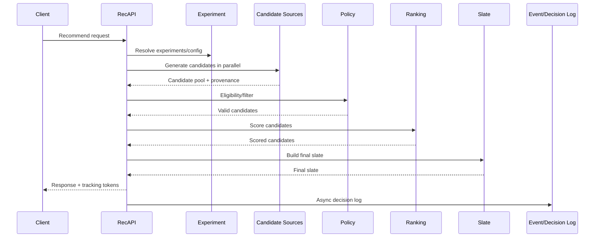
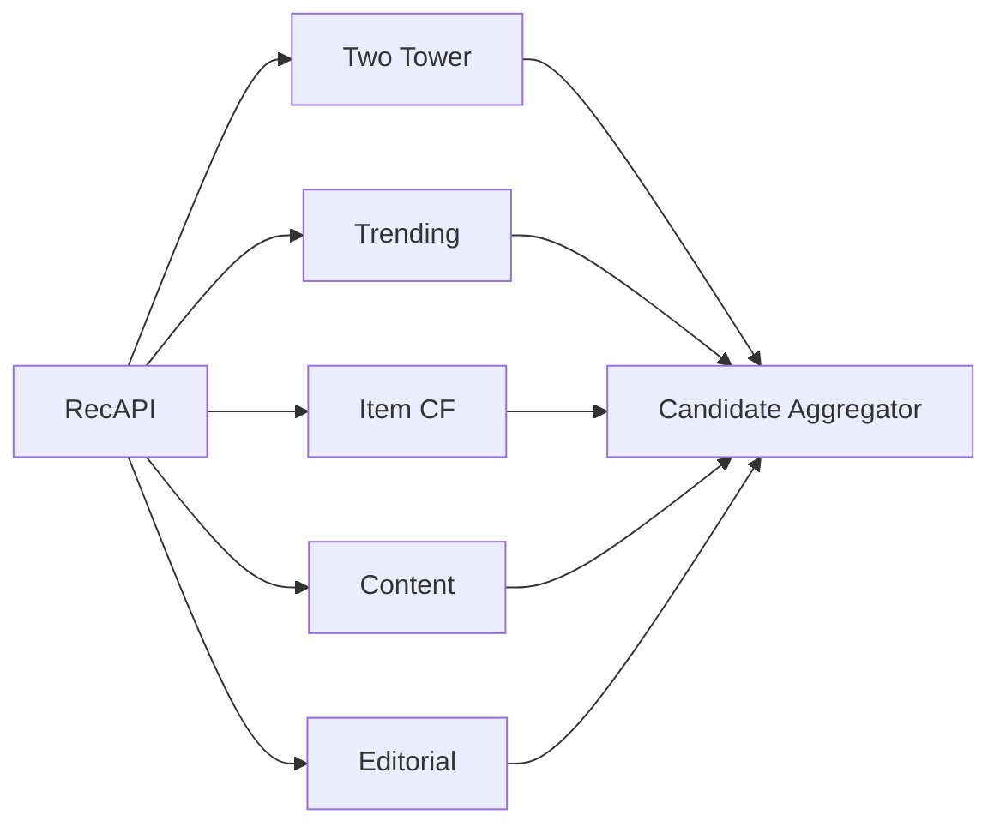

------
title: Build From Scratch Recommendations System - Part 053
description: Mendesain online serving path production-grade: request lifecycle, orchestration, candidate generation, eligibility, feature fetch, ranking, reranking, response assembly, decision logging, latency budget, fallback, resilience, tracing, dan Java implementation patterns.
series: learn-build-from-scratch-recommendations-system
seriesTitle: Build From Scratch: Enterprise Recommendations System
order: 53
partTitle: Online Serving Path
tags:
  - recommendation-system
  - recsys
  - online-serving
  - low-latency
  - system-design
  - java
  - series
date: 2026-07-02
---

# Part 053 — Online Serving Path

Online serving path adalah jalur paling kritikal dalam recommendation system.

Ketika client meminta rekomendasi, sistem harus:

- menerima request,
- memahami surface/context,
- menentukan experiment/config,
- menghasilkan candidate,
- memfilter eligibility,
- mengambil feature,
- scoring/ranking,
- reranking/slate construction,
- assembling response,
- logging decision,
- memenuhi latency SLO,
- dan fallback jika dependency gagal.

Semua terjadi dalam puluhan sampai ratusan milidetik.

Part ini membahas online serving path production-grade: request lifecycle, orchestration, latency budget, parallelism, timeouts, degradation, decision logging, tracing, cache, idempotency, error handling, dan Java implementation patterns.

---

## 1. Mental Model: Online Serving Is a Deadline-Driven Decision Pipeline

Online request punya deadline.

```text
client waits
product surface needs response
user experience depends on latency
```

Recommendation pipeline tidak boleh berpikir seperti batch job.

Online serving is:

```text
best safe decision within latency budget
```

Bukan:

```text
perfect recommendation at any cost
```

Diagram:



---

## 2. Request Lifecycle

End-to-end lifecycle:

1. Receive request.
2. Validate schema.
3. Normalize context.
4. Resolve surface config.
5. Resolve user/session/tenant/privacy context.
6. Resolve experiment assignment.
7. Generate candidates.
8. Deduplicate candidates.
9. Apply hard eligibility/policy.
10. Fetch/assemble features.
11. Rank candidates.
12. Rerank/build slate.
13. Final validation.
14. Assemble response.
15. Emit decision log.
16. Client logs impressions/actions later.

Each stage must have timeout, metrics, and debug trace.

---

## 3. Request Contract Example

```json
{
  "request_id": "req_001",
  "surface": "home_feed",
  "subject": {
    "user_id": "u123",
    "session_id": "sess_456"
  },
  "context": {
    "request_time": "2026-07-02T10:00:00Z",
    "region": "ID",
    "locale": "id-ID",
    "device_type": "mobile",
    "privacy_mode": "personalized"
  },
  "constraints": {
    "limit": 20
  },
  "debug": {
    "enabled": false
  }
}
```

Request should be explicit. Missing subject/context should lead to defined fallback, not undefined behavior.

---

## 4. Surface Configuration

Surface config controls pipeline.

Example:

```yaml
surface: home_feed
limit: 20
candidate_policy: home-candidates-v8
ranking_route: home-ranker-v12
slate_policy: home-slate-v7
utility_policy: home-utility-v5
latency_budget_ms: 180
fallback_policy: home-fallback-v3
debug_sampling_rate: 0.001
```

Surface config determines:

- candidate sources,
- ranker,
- filters,
- reranker,
- fallback,
- logging.

Avoid hardcoding surface behavior in code.

---

## 5. Latency Budget

Example:

```text
Total SLO: 200ms p95

Request validation:       2ms
Experiment/config:        5ms
Candidate generation:    60ms
Eligibility/filtering:   25ms
Ranking:                 55ms
Reranking/slate:         20ms
Response assembly:        5ms
Logging enqueue:          3ms
Buffer:                  25ms
```

The budget is not theoretical. It should be measured.

Each dependency gets timeout less than total budget.

---

## 6. Deadline Propagation

Pass deadline through services.

```java
public record RequestDeadline(Instant startedAt, Duration totalBudget) {
    public Duration remaining() {
        Duration elapsed = Duration.between(startedAt, Instant.now());
        return totalBudget.minus(elapsed);
    }
}
```

Each downstream call should respect remaining time.

Do not let a slow optional source consume entire request budget.

---

## 7. Parallel Candidate Generation

Candidate sources should run in parallel.

```text
two_tower: 50ms timeout
trending: 15ms timeout
content: 30ms timeout
editorial: 10ms timeout
item_cf: 40ms timeout
```

If optional source fails, continue.

If all sources fail, use fallback candidates.

Parallelism:



---

## 8. Candidate Source Criticality

Classify sources:

```yaml
sources:
  two_tower:
    criticality: preferred
    timeout_ms: 50
  trending:
    criticality: fallback
    timeout_ms: 15
  editorial:
    criticality: optional
    timeout_ms: 10
```

Criticality drives fallback.

- required: if fails, maybe fallback whole pipeline,
- preferred: use if available, continue if not,
- optional: skip on timeout,
- fallback: used when others fail.

Most candidate sources should not be required.

---

## 9. Candidate Aggregation

Aggregator responsibilities:

- merge source candidates,
- preserve provenance,
- dedup exact item,
- collect source diagnostics,
- enforce source quota,
- cap candidate count,
- produce candidate pool.

Example:

```text
two_tower: 500 candidates
item_cf: 300
content: 300
trending: 100
editorial: 20
merged unique: 870
cap before ranking: 800
```

Diagnostics are important.

---

## 10. Dedup Before Ranking

Dedup before ranking reduces cost.

Stages:

1. exact item ID dedup,
2. canonical item dedup,
3. product family/document version dedup,
4. near-duplicate optional.

If duplicates preserve multiple source evidence:

```text
item A from two_tower and content
```

Do not drop source provenance.

---

## 11. Eligibility and Filtering

Eligibility before ranking removes invalid candidates.

Checks:

- item exists,
- item active,
- available in region,
- policy approved,
- user has permission,
- not blocked/suppressed,
- not already completed/purchased if applicable,
- tenant matches,
- campaign active.

Filtering should return reason codes.

Example:

```json
{
  "item_id": "item_123",
  "decision": "reject",
  "reason_code": "not_available_region"
}
```

---

## 12. Eligibility Latency

Eligibility can be expensive.

Optimize:

- batch check item IDs,
- precompute eligibility snapshot,
- cache catalog states,
- use fast policy bitsets,
- perform coarse filtering early,
- final check for critical rules.

Avoid per-candidate remote checks.

---

## 13. Feature Fetch and Assembly

Ranking needs features.

Feature fetch sources:

- user profile,
- session store,
- item feature store,
- exposure/frequency store,
- candidate provenance,
- context,
- embedding store.

Feature assembly should be batched.

```text
fetch all item features in one call
fetch all exposure counts in one call
build matrix candidates x features
```

Feature fetch often dominates ranking latency.

---

## 14. Feature Fetch Failures

Feature failure modes:

- timeout,
- missing user profile,
- stale item features,
- embedding missing,
- session unavailable,
- partial batch failure.

Policy:

```text
critical feature missing -> fallback model
non-critical feature missing -> default + missing indicator
feature store down -> cached/stale/default or fallback ranker
```

Never silently put zero without missing indicator.

---

## 15. Ranking Call

Ranking service receives valid candidates + context.

It returns:

- model version,
- feature set version,
- predictions,
- rank score,
- diagnostics.

Batch scoring is mandatory.

Bad:

```text
call ranker 800 times
```

Good:

```text
call ranker once with 800 candidates
```

---

## 16. Ranking Candidate Cap

Set max candidates to rank.

Example:

```yaml
max_candidates_to_rank: 800
pre_rank_if_above: 2000
```

If candidate pool too large:

- pre-rank with source scores,
- quota per source,
- random sample exploration within policy,
- keep high-quality candidates.

Ranking every possible candidate is not always feasible.

---

## 17. Reranking / Slate Construction

Reranker:

- selects final N,
- enforces diversity,
- frequency cap,
- sponsored cap,
- exploration slot,
- final dedup,
- required items,
- layout constraints.

Reranking should have enough candidate pool after ranking.

If ranker returns only 20 for slate size 20, reranker cannot diversify.

Return top 100/500 depending surface.

---

## 18. Final Validation

Before response:

```text
no duplicate final items
positions contiguous
tracking tokens generated
disclosures present
required constraints satisfied
policy final check passed
slate size acceptable
```

If final slate too small:

- use fallback candidates,
- relax soft constraints,
- return smaller slate if allowed,
- safe empty response if necessary.

Never return invalid item to fill quota.

---

## 19. Response Assembly

Response should include:

- item IDs or hydrated display data depending architecture,
- position,
- tracking token,
- reason codes,
- disclosure,
- optional explanation metadata,
- response metadata.

Two options:

### Thin Response

Return item IDs and tracking. Client fetches display data.

### Hydrated Response

Return item cards/details.

Hydrated response increases latency/coupling. Thin response requires client/catalog integration.

Choose per product.

---

## 20. Tracking Tokens

Each item needs tracking token linking:

```text
request_id
slate_id
impression_id
item_id
position
model/policy/experiment
```

Token can be opaque/signed.

Client sends token in impression/click events.

Without tracking, training attribution breaks.

---

## 21. Decision Logging

Decision log should be emitted asynchronously.

Include:

- request,
- context,
- candidate counts,
- source diagnostics,
- filter counts/reasons,
- model versions,
- final slate,
- scores/components sampled,
- experiment variants,
- policy versions,
- fallback status.

If logging blocks response, latency suffers. Use async enqueue with monitoring.

But do not ignore logging failures.

---

## 22. Impression Logging

Client logs impression after render/viewability.

Decision log says what system decided.  
Impression event says what user actually saw.

Both are needed.

```text
decision log != impression log
```

If client fails to log impressions, training denominator is wrong.

---

## 23. Idempotency

Request may retry.

Use:

```text
request_id
slate_id
impression_id
event_id
```

Deduplicate events.

If same request retried, response may be same or regenerated depending policy.

For deterministic replay/debug, record random seeds and versions.

---

## 24. Randomness Control

Exploration/reranking may use randomness.

Use deterministic seed:

```text
seed = hash(request_id, experiment_id, policy_version)
```

Log seed.

This allows replay.

Do not use uncontrolled random in request path.

---

## 25. Timeout Strategy

Timeout hierarchy:

```text
candidate source timeout < candidate stage budget
ranking timeout < ranking budget
feature fetch timeout < ranking timeout
policy timeout depends severity
```

Example:

```yaml
two_tower_timeout_ms: 45
feature_store_timeout_ms: 25
ranker_timeout_ms: 55
policy_service_timeout_ms: 20
```

Timeout should cause graceful degradation.

---

## 26. Circuit Breakers

If dependency unhealthy, avoid hammering it.

Circuit breaker states:

```text
closed
open
half-open
```

For optional candidate source, open breaker skips calls and uses alternatives.

For critical policy service, open breaker may trigger safe fallback/fail closed.

---

## 27. Bulkheads

Isolate resources.

Examples:

- separate thread pool for candidate sources,
- separate pool for feature store,
- separate pool for logging,
- separate pool for debug requests,
- separate traffic class for expensive surfaces.

Bulkheads prevent one slow dependency from exhausting entire service.

---

## 28. Backpressure and Load Shedding

If overloaded:

- reduce candidate count,
- skip optional sources,
- skip shadow models,
- use cached fallback,
- disable expensive feature groups,
- reduce debug sampling,
- shed low-priority traffic.

Define degradation order.

Do not wait until JVM thread pool collapses.

---

## 29. Caching in Online Path

Caches:

- surface config,
- experiment config,
- item static features,
- user profile snapshot,
- embeddings,
- candidate source results for anonymous/trending,
- fallback lists,
- model artifacts.

Caution:

- personalization cache can stale,
- privacy changes must invalidate,
- suppression/hide must apply immediately,
- experiment assignment consistency.

Cache with explicit TTL and version.

---

## 30. Fallback Hierarchy

Fallback examples:

```text
normal personalized pipeline
-> personalized candidates + fallback ranker
-> non-personalized trending/editorial
-> cached popular by region/category
-> empty safe response
```

Each fallback should be safe and logged.

Fallback is not failure if expected and controlled.

Monitor fallback rate.

---

## 31. Fallback Candidate List

Maintain safe fallback lists:

```text
popular_by_region
editorial_safe
new_user_onboarding
tenant_default_actions
knowledge_base_top_useful
```

Fallback list must still respect:

- region,
- policy,
- tenant,
- availability,
- privacy.

Do not serve stale banned items from fallback cache.

---

## 32. Empty Slate Handling

Empty slate can happen due to filters/caps/policy.

Options:

- relax soft constraints,
- use fallback candidates,
- broaden candidate sources,
- return empty with reason,
- show generic content outside recsys.

For enterprise required actions, empty may be valid if no action exists.

Do not force invalid items.

---

## 33. Observability

Metrics:

```text
request qps
latency p50/p95/p99
candidate count by stage
source latency/error
filter rejection rates
ranking latency/error
feature missing rates
reranking constraint rates
fallback rate
empty slate rate
decision logging success
```

By:

- surface,
- region,
- tenant,
- model version,
- experiment,
- privacy mode.

---

## 34. Distributed Tracing

Trace spans:

```text
RecAPI.validate
Config.resolve
Experiment.assign
Candidate.two_tower
Candidate.trending
Candidate.aggregate
Policy.filter
Ranking.feature_fetch
Ranking.inference
Slate.rerank
Response.assemble
DecisionLog.enqueue
```

Trace lets engineers see where latency/errors occur.

Use request_id/trace_id consistently.

---

## 35. Debug Trace

Debug mode should include:

- candidates by source,
- filter reasons,
- feature summary,
- model scores,
- score components,
- reranking penalties,
- final reasons,
- fallback decisions,
- latency breakdown.

Access-controlled.

Debug trace is for internal users, not public clients.

---

## 36. Replay

Replay request with:

- same candidate set,
- same features or snapshots,
- same model/policy versions,
- same random seed.

Replay helps:

- investigate bad recommendation,
- compare new model,
- verify bug fix,
- audit enterprise decision.

Replay requires decision logs and versioned artifacts.

---

## 37. Online Serving Java Pattern

Core orchestrator:

```java
public final class RecommendationOrchestrator {
    public RecommendationResponse recommend(RecommendationRequest request) {
        RequestContext context = requestContextFactory.from(request);
        SurfaceConfig config = configResolver.resolve(request.surface(), context);
        RequestDeadline deadline = RequestDeadline.start(config.latencyBudget());

        ExperimentAssignments experiments = experimentService.assign(context, deadline);

        CandidatePool candidates = candidateOrchestrator.generate(context, config, experiments, deadline);

        CandidatePool eligible = policyService.filter(candidates, context, deadline);

        RankingResult ranked = rankingService.rank(eligible, context, config, experiments, deadline);

        Slate slate = slateService.build(ranked, context, config, experiments, deadline);

        RecommendationResponse response = responseAssembler.assemble(slate, context, config);

        decisionLogger.logAsync(response, context, candidates, ranked);

        return response;
    }
}
```

Real implementation needs fallbacks around each stage.

---

## 38. Stage Result Wrapper

Use explicit stage result.

```java
public record StageResult<T>(
    T value,
    boolean fallbackUsed,
    String fallbackReason,
    Duration latency,
    Map<String, Object> diagnostics
) {}
```

This makes fallback observable.

---

## 39. Graceful Degradation Example

```java
CandidatePool candidates;
try {
    candidates = candidateOrchestrator.generate(context, config, deadline).value();
} catch (CandidateGenerationException ex) {
    candidates = fallbackCandidateProvider.get(context, config);
    diagnostics.markFallback("candidate_generation_failed", ex);
}
```

But for critical policy failure:

```java
catch (PolicyServiceUnavailable ex) {
    if (config.policyFailureMode() == FAIL_CLOSED) {
        return safeEmptyResponse(...);
    }
}
```

Failure mode depends on stage.

---

## 40. Testing Online Serving

Tests:

- request validation,
- surface config resolution,
- candidate source timeout,
- partial source failure,
- policy filter reason,
- ranking fallback,
- reranking constraints,
- tracking token generation,
- decision log emitted,
- privacy mode disables personalization,
- tenant boundary enforced,
- empty slate behavior,
- deterministic random seed.

Use integration tests with fake dependencies.

---

## 41. Load Testing

Load test with realistic:

- QPS,
- candidate counts,
- feature sizes,
- source latencies,
- timeout rates,
- payload sizes,
- debug sampling,
- shadow model traffic.

Measure:

- p95/p99 latency,
- error rates,
- thread pool saturation,
- GC,
- CPU,
- memory,
- downstream pressure.

Recommendation systems can fail under candidate explosion.

---

## 42. Capacity Formula

Estimate candidate scoring load:

```text
candidate_scores_per_sec = QPS * candidates_ranked_per_request
```

If:

```text
QPS = 2000
candidates = 800
```

Then:

```text
1.6 million candidate scores/sec
```

This is more meaningful than request QPS alone.

---

## 43. Security and Privacy in Online Path

Ensure:

- service auth,
- tenant auth,
- user consent enforced,
- privacy mode affects sources/features,
- debug redaction,
- tracking token not leaking sensitive data,
- logs controlled,
- no cross-tenant cache leak.

Online path handles behavioral/personal data.

---

## 44. Common Failure Modes

### 44.1 Serial Dependency Chain

Latency too high.

### 44.2 Optional Source Blocks Request

Timeout misconfigured.

### 44.3 Per-Candidate Remote Calls

Latency explosion.

### 44.4 No Deadline Propagation

Downstream exceeds budget.

### 44.5 Logging Blocks Response

Latency spikes.

### 44.6 Fallback Unsafe/Stale

Banned items served.

### 44.7 No Tracking Token

Events cannot be attributed.

### 44.8 No Final Check

Race condition leaks invalid item.

### 44.9 Debug Mode Leaks Data

Security incident.

### 44.10 No Replay

Bad recommendation cannot be reproduced.

---

## 45. Minimal Production Online Path Plan

Start with:

```yaml
request_path:
  rec_api: orchestrator
  candidate_sources_parallel: true
  eligibility_filter: batch
  ranking: batch
  reranking: greedy
  decision_logging: async
latency:
  total_budget_ms: 200
  source_timeouts: configured
  ranker_timeout: configured
fallbacks:
  candidate_fallback: trending/editorial
  ranking_fallback: source_score
  policy_failure: fail_closed_for_critical
observability:
  tracing: true
  stage_latency: true
  candidate_counts: true
  fallback_rate: true
  empty_slate_rate: true
testing:
  timeout_tests: true
  fallback_tests: true
  contract_tests: true
```

---

## 46. Checklist Online Serving Path Readiness

```text
[ ] Request schema is validated.
[ ] Surface config is versioned.
[ ] Deadline is propagated.
[ ] Candidate sources run in parallel.
[ ] Candidate source timeouts are configured.
[ ] Candidate provenance is preserved.
[ ] Eligibility filtering is batched.
[ ] Feature fetching is batched.
[ ] Ranking is batch scoring.
[ ] Reranking has slate policy.
[ ] Final validation exists.
[ ] Tracking tokens are generated.
[ ] Decision logging is async and monitored.
[ ] Impression logging contract exists.
[ ] Fallback hierarchy is defined.
[ ] Circuit breakers/bulkheads exist.
[ ] Observability shows latency/counts/errors by stage.
[ ] Debug trace is access-controlled.
[ ] Replay strategy exists.
[ ] Privacy/tenant context is enforced.
```

---

## 47. Kesimpulan

Online serving path adalah real-time decision pipeline dengan deadline.

Prinsip utama:

1. Online serving optimizes best safe decision within latency budget.
2. Each stage needs timeout, diagnostics, and fallback.
3. Candidate sources should run in parallel.
4. Batch operations are mandatory for eligibility, feature fetch, and ranking.
5. Ranking and reranking need enough candidate pool but bounded cost.
6. Final validation prevents invalid slate.
7. Decision logging and impression logging are both necessary.
8. Fallbacks must be safe, versioned, and monitored.
9. Distributed tracing and debug replay are production necessities.
10. Privacy, tenant, and policy constraints must flow through the entire path.

Di Part 054, kita akan membahas **Offline and Nearline Pipelines**: bagaimana events diubah menjadi features, training datasets, embeddings, indexes, batch scores, metrics, dan model artifacts yang mendukung online serving.
