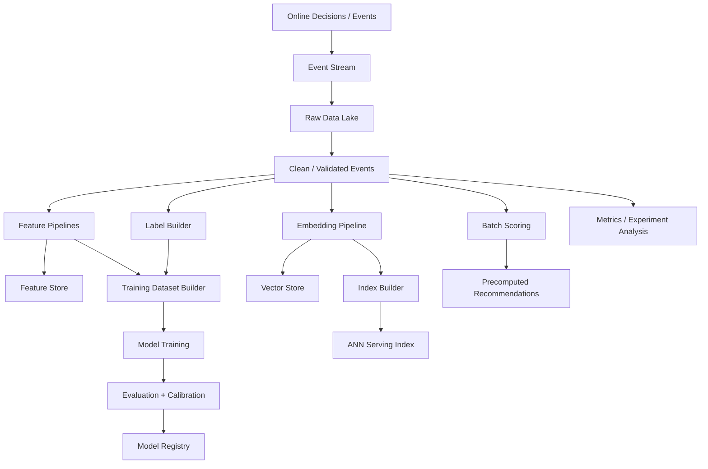

------
title: Build From Scratch Recommendations System - Part 054
description: Mendesain offline dan nearline pipelines untuk recommendation platform production-grade: event streams, data lake, feature pipelines, dataset builder, embedding/index pipelines, batch scoring, retraining, data quality, lineage, orchestration, backfill, and SLAs.
series: learn-build-from-scratch-recommendations-system
seriesTitle: Build From Scratch: Enterprise Recommendations System
order: 54
partTitle: Offline and Nearline Pipelines
tags:
  - recommendation-system
  - recsys
  - offline-pipeline
  - nearline
  - data-engineering
  - mlops
  - series
date: 2026-07-02
---

# Part 054 — Offline and Nearline Pipelines

Online serving path membuat keputusan dalam milidetik.

Tetapi kualitas keputusan online bergantung pada pipeline offline dan nearline yang membangun:

- event datasets,
- user/item/context features,
- labels,
- training examples,
- embeddings,
- ANN indexes,
- batch recommendations,
- model artifacts,
- calibration artifacts,
- metrics dashboards,
- experiment analysis,
- monitoring signals.

Jika pipeline offline salah, online model belajar hal yang salah.  
Jika nearline state terlambat, online system terasa tidak responsif.  
Jika lineage tidak jelas, model tidak bisa direproduksi.  
Jika data quality lemah, recommendation system rusak diam-diam.

Part ini membahas offline dan nearline pipelines production-grade: event streams, data lake, feature generation, dataset builder, embedding/index pipelines, batch scoring, orchestration, data quality, backfill, lineage, freshness SLAs, and failure modes.

---

## 1. Mental Model: Offline/Nearline Is the Learning Factory

Online serving:

```text
serve decision now
```

Offline/nearline:

```text
learn from past and prepare future serving artifacts
```

Pipeline flow:



Offline/nearline systems are part of production system, not separate “analytics only”.

---

## 2. Offline vs Nearline vs Online

### Offline

Batch, minutes/hours/days.

Examples:

- daily training dataset,
- weekly model training,
- batch feature aggregates,
- index build,
- experiment analysis.

### Nearline

Streaming or micro-batch, seconds/minutes.

Examples:

- session profile update,
- trending aggregates,
- exposure counters,
- suppression updates,
- hot item stats,
- incremental embeddings/delta index.

### Online

Request-time, milliseconds.

Examples:

- current request context,
- final eligibility check,
- feature fetch,
- ranking.

Each layer has different freshness/cost/correctness trade-off.

---

## 3. Event Stream Foundation

Everything starts from events:

```text
decision logs
impressions
clicks
engagements
conversions
negative feedback
catalog updates
user preference updates
policy changes
experiment assignments
```

Events should be:

- schema-validated,
- timestamped,
- idempotent,
- immutable,
- partitioned,
- stored raw,
- enriched carefully,
- monitored.

Bad events create bad models.

---

## 4. Raw, Clean, Curated Layers

Data lake layers:

### Raw

Original events as received.

```text
append-only
minimal transformation
for audit/replay
```

### Clean

Validated, deduplicated, normalized.

```text
schema checked
bot/internal removed
timestamp normalized
PII handled
```

### Curated

Domain tables/features/labels.

```text
impressions
engagements
training examples
feature aggregates
```

Do not overwrite raw events. Build clean/curated reproducibly.

---

## 5. Event-Time vs Processing-Time

Event-time:

```text
when event happened
```

Processing-time:

```text
when pipeline processed it
```

Recommendation labels/features should usually use event-time.

Late events happen.

Pipeline must handle:

- watermarks,
- lateness windows,
- reprocessing,
- correction jobs.

Do not ignore late purchases/returns.

---

## 6. Data Quality Gates

Quality checks:

```text
schema validity
required field presence
event duplication rate
event volume anomaly
timestamp skew
null rate
unknown enum values
bot/internal traffic
request_id/impression_id linkage
label rate drift
source distribution drift
```

Quality gate can:

- alert,
- quarantine data,
- block model training,
- mark dataset invalid.

Training on bad data is worse than delayed training.

---

## 7. Decision Logs as Offline Source

Decision logs include:

- candidate set,
- final slate,
- scores,
- model versions,
- policy versions,
- experiment assignments,
- exploration propensity.

They are needed for:

- training,
- off-policy evaluation,
- debugging,
- replay,
- exposure analysis.

If decision logging is incomplete, offline learning loses context.

---

## 8. Impression and Outcome Joins

Training labels often join:

```text
impression -> click/purchase/hide/report
```

Using:

```text
request_id
impression_id
user_id
item_id
time window
```

Need attribution rules.

Example:

```text
click within 30m after impression
purchase within 7d after impression
```

Avoid duplicate attribution unless defined.

---

## 9. Feature Pipelines

Feature pipelines compute:

```text
user aggregates
item aggregates
context aggregates
cross features
source statistics
exposure counts
quality scores
embedding features
graph features
```

They publish to:

- offline feature tables,
- online feature store,
- monitoring tables.

Feature definition must be versioned.

---

## 10. Batch Feature Example

Daily item CTR:

```text
item_ctr_7d =
  clicks_7d / impressions_7d
```

Production version:

```text
smoothed ctr
bot filtered
event-time window
minimum support
category prior
generated_at
feature_version
```

Feature table:

| item_id | item_ctr_7d | support | generated_at | version |
|---|---:|---:|---|---|
| item_1 | 0.042 | 1200 | 2026-07-02T01:00Z | v3 |

---

## 11. Nearline Feature Example

Trending score updated every 5 minutes.

Input:

```text
recent impressions/clicks/purchases
```

Output:

```text
trending_score_15m
trending_score_1h
category_trending_rank
```

Use:

- event-time windows,
- decay,
- bot filtering,
- smoothing,
- hot-key handling.

Nearline features need freshness SLO.

---

## 12. Feature Publishing

Feature pipeline writes to:

### Offline Store

For training point-in-time joins.

### Online Store

For serving low-latency fetch.

Need consistency.

Feature publishing metadata:

```text
feature_name
version
generated_at
valid_from
valid_until
source_data_version
quality_status
```

Online serving should know feature freshness.

---

## 13. Offline-Online Parity

Same feature should mean same thing offline and online.

Common bugs:

- offline uses different window,
- online default differs,
- timezone mismatch,
- late events included offline but not online,
- transformation mismatch,
- missing reason differs.

Parity test:

```text
sample online feature values
recompute offline as-of same time
compare
```

Parity is continuous process.

---

## 14. Training Dataset Builder

Dataset builder compiles:

```text
base examples
prediction time
features as-of time
labels after prediction time
negative samples
weights
splits
metadata
```

It should produce versioned dataset artifact.

Dataset spec:

```yaml
dataset: home_ranker_ds_v12
base: impressions
prediction_time: impression_time
labels:
  click_30m
  purchase_7d
  hide_7d
features:
  feature_set: home_features_v18
split: temporal
```

---

## 15. Point-in-Time Joins

For each example:

```text
feature_timestamp <= prediction_time
```

Do not join future aggregates.

If impression at July 2 10:00:

```text
item_ctr_7d must be computed using data before July 2 10:00
```

Point-in-time join infrastructure is essential.

---

## 16. Label Builder

Label builder creates target labels.

Responsibilities:

- attribution,
- label window,
- maturity,
- exclusions,
- multi-label output,
- negative handling,
- delayed correction.

Example:

```yaml
click_30m:
  positive_event: click
  window: 30m
  maturity: 30m
purchase_7d:
  positive_event: purchase
  window: 7d
  maturity: 7d
```

Labels should be versioned.

---

## 17. Negative Sampling Pipeline

For retrieval/ranking training:

- exposed no-click negatives,
- generated-not-shown sampled negatives,
- hard negatives,
- in-batch negatives,
- category-balanced negatives.

Sampling policy must be versioned.

Store:

```text
negative_sampling_policy_version
sampling_probability
weight
```

This is important for unbiased training/evaluation.

---

## 18. Temporal Splits

Dataset should use time-based split:

```text
train: older
validation: newer
test: newest
```

Avoid random split leakage.

For model monitoring, use rolling evaluation windows.

Temporal split better approximates future serving.

---

## 19. Embedding Pipeline

Embedding pipeline:

1. read item/user/content data,
2. compute embeddings,
3. validate coverage/quality,
4. publish embedding version,
5. write vector store,
6. trigger index build.

Embedding metadata:

```text
embedding_family
entity_type
dimension
model_version
generated_at
coverage
normalization
```

Embedding changes affect retrieval/ranking.

---

## 20. ANN Index Build Pipeline

Index build steps:

```text
read embeddings
filter eligible items
build ANN index
benchmark recall/latency
validate metadata
publish index atomically
monitor serving
```

Index artifact metadata:

```text
index_version
embedding_version
algorithm
parameters
item_count
build_time
recall_benchmark
status
```

Never partially publish index.

---

## 21. Delta Index / Nearline Updates

Full index rebuild may be daily. New items need faster availability.

Use:

- delta index,
- hot item overlay,
- direct candidate source,
- nearline mini-index.

Serving merges:

```text
main_index + delta_index
```

Need dedup and eventual consistency.

---

## 22. Batch Scoring Pipeline

Batch scoring generates precomputed recommendations.

Use cases:

- email,
- push,
- low-latency home fallback,
- cold-start/non-personalized lists,
- enterprise daily digest.

Pipeline:

```text
select subjects
generate candidates
score/rerank offline
write top-N lists
validate coverage
publish serving table
```

Batch recommendations need freshness and invalidation.

---

## 23. Precomputed Recommendation Store

Serving table:

```text
key: subject_id + surface
value: ranked item list + generated_at + model_version + policy_version
```

Need:

- TTL,
- eligibility final check online,
- fallback if stale,
- refresh monitoring.

Precomputed lists can contain stale/banned/out-of-stock items. Online final check remains required.

---

## 24. Model Training Pipeline

Steps:

1. load dataset spec,
2. materialize dataset,
3. train model,
4. evaluate,
5. calibrate,
6. run validation gates,
7. generate model card/metadata,
8. register model,
9. shadow/canary,
10. promote.

Training pipeline should be reproducible.

Log:

```text
code version
dataset version
feature set version
label version
hyperparameters
random seed
metrics
```

---

## 25. Model Validation Gates

Gates:

```text
offline metric >= baseline
guardrail metrics not worse
calibration acceptable
segment metrics acceptable
model size within limit
inference latency estimate within budget
feature compatibility valid
no leakage test failures
```

If gates fail, model not promoted.

---

## 26. Calibration Pipeline

After training:

- fit calibration on validation window,
- evaluate on test window,
- produce calibration artifact,
- register calibration version.

Calibration artifact must be tied to model version and segment scope.

Online ranking loads model + calibration together.

---

## 27. Experiment Analysis Pipeline

Consumes:

- decision logs,
- assignment logs,
- impression events,
- outcome events.

Produces:

- metric estimates,
- confidence intervals,
- guardrails,
- segment reports,
- long-term readouts.

Experiment pipeline should use consistent metric definitions.

Do not compute A/B metrics ad hoc in notebooks only.

---

## 28. Metrics Pipeline

Metrics:

- online serving metrics,
- product metrics,
- model quality metrics,
- feature quality metrics,
- data quality metrics,
- exposure/fairness metrics,
- experiment metrics.

Metrics definitions should be versioned.

Same metric name should mean same calculation.

---

## 29. Orchestration

Pipeline orchestration needs:

- DAGs,
- dependencies,
- retries,
- backfills,
- data quality gates,
- SLAs,
- alerts,
- lineage.

Example dependency:

```text
training_dataset depends on clean_events, labels, feature snapshots
model_training depends on training_dataset
index_build depends on embeddings
```

Use workflow orchestration appropriate to stack.

---

## 30. Backfill

Backfill reprocesses historical data.

Reasons:

- feature definition changed,
- bug fixed,
- new label added,
- taxonomy updated,
- identity merge improved,
- event schema correction.

Backfill requirements:

- version outputs,
- avoid overwriting production blindly,
- validate quality,
- track lineage,
- communicate downstream effects.

Backfill can change model behavior.

---

## 31. Reprocessing and Idempotency

Pipelines should be idempotent.

Given same input version and code version, output should be same.

Use output paths by version/date.

Avoid:

```text
overwrite latest table without version
```

Prefer:

```text
feature_table/date=2026-07-02/version=v3
```

Then publish pointer to active version.

---

## 32. Data Lineage

Track:

```text
model -> dataset -> features -> raw events -> code versions
index -> embeddings -> content snapshot -> model version
batch list -> ranker -> candidate sources -> feature versions
```

Lineage allows:

- reproduce,
- audit,
- rollback,
- incident analysis.

Without lineage, production ML is fragile.

---

## 33. Freshness SLAs

Define freshness per artifact.

Examples:

```text
session features: < 5s
trending score: < 10m
item quality: < 24h
ranker model: retrain daily/weekly
ANN index: < 24h + delta < 10m
batch recommendations: < 6h
```

Monitor freshness.

If artifact stale, online serving may fallback or mark degraded.

---

## 34. Data Quality Incident Handling

If event pipeline broken:

- stop affected training,
- mark data invalid,
- fallback to previous model,
- replay after fix,
- annotate metrics,
- notify stakeholders.

Do not train new model on broken period.

Maintain data incident log.

---

## 35. Pipeline Observability

Metrics:

```text
pipeline success/failure
runtime
input row count
output row count
null rate
duplicate rate
late event rate
feature freshness
label rate
embedding coverage
index item count
model training metrics
batch scoring coverage
```

Alerts:

- missing partition,
- volume anomaly,
- quality gate fail,
- SLA miss,
- output not published.

---

## 36. Nearline Stream Processing

Nearline jobs compute:

- session state,
- exposure counters,
- trending,
- hot items,
- suppression propagation,
- real-time profile updates.

Needs:

- exactly-once or idempotent updates,
- event-time windows,
- state TTL,
- late event handling,
- monitoring lag.

Serving depends on stream freshness.

---

## 37. Stream Lag

Monitor:

```text
consumer lag
event processing delay
state update delay
watermark delay
output freshness
```

If stream lag high:

- session recommendations stale,
- suppression delayed,
- trending stale,
- frequency caps wrong.

Online system should detect stale nearline state.

---

## 38. Catalog and Policy Change Pipelines

Catalog changes affect eligibility/features.

Events:

```text
item created
item updated
item deleted
stock changed
price changed
policy state changed
document version updated
tenant config changed
```

Pipeline updates:

- catalog serving store,
- feature store,
- embeddings if content changed,
- ANN index,
- eligibility cache.

Policy state changes may require immediate suppression.

---

## 39. Privacy Deletion Pipelines

User deletion/consent changes require:

- remove/disable user profile,
- delete personal features,
- remove from training if required,
- update embeddings,
- stop personalization,
- update logs according to retention policy.

Privacy operations must be auditable.

---

## 40. Model/Index Promotion Pipeline

Promotion should be controlled.

Steps:

```text
candidate artifact
validation
shadow
canary
production
rollback pointer
```

For index:

```text
build new index
benchmark
load in standby
health check
switch pointer
monitor
rollback if needed
```

Atomic pointer switch is common.

---

## 41. Artifact Registry

Artifacts:

```text
dataset
feature set
model
calibration
embedding
index
batch recommendation list
rule bundle
slate policy
utility policy
```

Each artifact:

- version,
- owner,
- created_at,
- status,
- dependencies,
- metrics,
- checksum.

Registry enables governance.

---

## 42. Offline Security

Data pipelines handle sensitive data.

Controls:

- access control,
- encryption,
- PII minimization,
- tenant isolation,
- audit logs,
- secure temp storage,
- retention,
- redaction in logs,
- data sharing policies.

ML pipelines often create copies of sensitive data. Govern them.

---

## 43. Common Failure Modes

### 43.1 Bad Events Train Bad Model

Schema/volume bug ignored.

### 43.2 Future Leakage in Features

Offline metrics inflated.

### 43.3 Training Dataset Not Versioned

Cannot reproduce model.

### 43.4 Embedding Version Changed Silently

Index/ranker mismatch.

### 43.5 Index Partially Published

Serving errors.

### 43.6 Late Events Ignored

Labels incomplete.

### 43.7 Backfill Overwrites Production

Unexpected model/data shift.

### 43.8 Batch Recommendations Stale

Invalid items served.

### 43.9 Stream Lag Unmonitored

Real-time personalization stale.

### 43.10 No Lineage

Incident root cause impossible.

---

## 44. Implementation Sketch: Dataset Spec

```yaml
dataset: home_ranker_dataset
version: 20260702_001
base_examples:
  table: clean_impressions
  filters:
    surface: home_feed
    bot: false
prediction_time: impression_time
features:
  feature_set: home_ranker_features_v18
labels:
  - click_30m_v3
  - purchase_7d_v2
  - hide_7d_v1
negative_sampling:
  policy: exposed_no_click_v4
split:
  type: temporal
  train_until: 2026-06-25
  validation_until: 2026-06-29
  test_until: 2026-07-01
quality_gates:
  max_null_rate: 0.05
  min_examples: 1000000
```

Dataset spec should be committed/versioned.

---

## 45. Implementation Sketch: Pipeline Artifact Metadata

```java
public record PipelineArtifact(
    String artifactType,
    String artifactName,
    String artifactVersion,
    Instant createdAt,
    String owner,
    Map<String, String> dependencies,
    Map<String, Double> qualityMetrics,
    String status,
    String checksum
) {}
```

Use for feature/model/index/batch artifacts.

---

## 46. Implementation Sketch: Quality Gate

```java
public interface QualityGate {
    QualityGateResult evaluate(PipelineOutput output);
}

public record QualityGateResult(
    boolean passed,
    List<String> failures,
    Map<String, Double> metrics
) {}
```

Example:

```java
if (metrics.nullRate("item_id") > 0.001) {
    failures.add("item_id_null_rate_too_high");
}
```

Quality gates should block downstream publish when critical.

---

## 47. Minimal Production Offline/Nearline Plan

Start with:

```yaml
data_layers:
  - raw_events
  - clean_events
  - curated_training_tables
pipelines:
  event_validation: true
  feature_batch_daily: true
  trending_nearline: true
  dataset_builder: versioned
  model_training: reproducible
  embedding_pipeline: versioned
  index_builder: atomic_publish
  batch_scoring: fallback_lists
quality:
  schema_checks: true
  volume_anomaly_checks: true
  label_rate_checks: true
  feature_null_checks: true
lineage:
  artifact_registry: true
freshness:
  nearline_lag_monitoring: true
  batch_sla_monitoring: true
```

Do not wait until models fail to build pipeline discipline.

---

## 48. Checklist Offline and Nearline Pipeline Readiness

```text
[ ] Raw, clean, curated layers are separated.
[ ] Event schemas are validated.
[ ] Decision logs are available.
[ ] Impression/outcome joins are reliable.
[ ] Feature pipelines are versioned.
[ ] Offline-online parity is tested.
[ ] Dataset builder uses point-in-time joins.
[ ] Label windows and maturity are handled.
[ ] Negative sampling policy is versioned.
[ ] Temporal splits are used.
[ ] Embedding versions are tracked.
[ ] ANN index build has validation and atomic publish.
[ ] Batch scoring output has TTL and final online check.
[ ] Data quality gates can block training/publish.
[ ] Pipeline orchestration supports retries/backfill.
[ ] Lineage tracks artifacts and dependencies.
[ ] Freshness SLAs are monitored.
[ ] Nearline stream lag is monitored.
[ ] Privacy deletion/consent pipelines exist if needed.
```

---

## 49. Kesimpulan

Offline dan nearline pipelines adalah learning factory yang menentukan kualitas online recommendation.

Prinsip utama:

1. Online serving quality depends on offline/nearline correctness.
2. Raw, clean, and curated data layers should be separated.
3. Event quality is model quality.
4. Feature pipelines need versioning, freshness, and parity.
5. Training dataset builder must be point-in-time safe.
6. Labels need maturity windows and attribution rules.
7. Embedding and index pipelines need versioned atomic publish.
8. Batch recommendations require TTL and final online validation.
9. Data quality gates should block bad artifacts.
10. Lineage, backfill, and freshness monitoring are production requirements.

Di Part 055, kita akan membahas **Feature Store From Scratch**: bagaimana mendesain feature registry, offline/online store, point-in-time joins, serving APIs, freshness, ownership, monitoring, dan feature lifecycle untuk RecSys production-grade.
