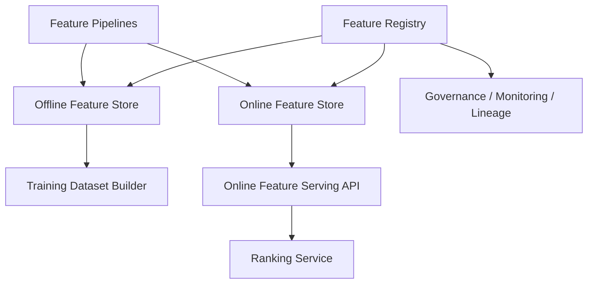

------
title: Build From Scratch Recommendations System - Part 055
description: Mendesain feature store from scratch untuk recommendation system production-grade: feature registry, offline store, online store, point-in-time joins, feature serving API, freshness, lineage, ownership, privacy, monitoring, and lifecycle.
series: learn-build-from-scratch-recommendations-system
seriesTitle: Build From Scratch: Enterprise Recommendations System
order: 55
partTitle: Feature Store From Scratch
tags:
  - recommendation-system
  - recsys
  - feature-store
  - mlops
  - data-engineering
  - online-serving
  - series
date: 2026-07-02
---

# Part 055 — Feature Store From Scratch

Ranking model tidak langsung membaca raw events.

Ia membaca **features**.

Feature seperti:

```text
user_category_affinity_30d
item_ctr_7d_smoothed
user_item_seen_count_7d
item_quality_score
session_depth
two_tower_score
creator_report_rate_30d
```

Feature ini harus tersedia di dua dunia:

1. **Offline** untuk training dataset.
2. **Online** untuk serving request real-time.

Jika offline dan online feature berbeda, model akan dilatih pada dunia yang tidak sama dengan dunia production. Ini disebut training-serving skew.

Feature store adalah platform untuk mendefinisikan, menyimpan, menyajikan, memonitor, dan mengelola lifecycle feature.

Part ini membahas cara membangun feature store from scratch untuk recommendation system production-grade: feature registry, offline store, online store, point-in-time joins, feature serving API, freshness, lineage, monitoring, privacy, ownership, dan anti-patterns.

---

## 1. Mental Model: Feature Store Is a Contracted Feature Platform

Feature store bukan hanya database key-value.

Feature store adalah sistem yang menjawab:

```text
Feature apa yang tersedia?
Apa definisinya?
Siapa owner-nya?
Bagaimana dihitung?
Dari data apa?
Seberapa fresh?
Apakah aman digunakan online?
Bagaimana join point-in-time?
Bagaimana default/missing?
Model mana yang memakai feature ini?
```

Diagram:



Feature store menghubungkan data engineering, ML training, dan online serving.

---

## 2. Why Feature Store Matters for RecSys

Recommendation ranking sangat bergantung pada feature.

Tanpa feature store:

- feature dihitung ulang di banyak tempat,
- offline-online mismatch,
- feature definition tidak jelas,
- training dataset sulit direproduksi,
- serving latency buruk,
- missing/default tidak konsisten,
- feature owner tidak ada,
- privacy tidak terkelola,
- model break saat feature berubah,
- debugging ranking sulit.

Feature store membuat feature menjadi production asset.

---

## 3. Feature Store Responsibilities

Core responsibilities:

1. Feature registry.
2. Offline feature storage.
3. Online feature serving.
4. Point-in-time joins.
5. Feature materialization.
6. Feature schema/version management.
7. Freshness tracking.
8. Missing/default handling.
9. Access control/privacy.
10. Monitoring/drift.
11. Lineage/model dependency.
12. Feature lifecycle/deprecation.

Non-responsibilities:

- define all business objective,
- train model,
- serve full recommendation response,
- replace data lake,
- replace model registry.

---

## 4. Feature Taxonomy for RecSys

Feature groups:

```text
user features
item features
context features
user-item cross features
source features
sequence/session features
graph features
embedding features
quality/safety features
business features
exposure/frequency features
```

Feature store may not store all equally.

Examples:

- `item_ctr_7d` stored in feature store.
- `current_device_type` from request context, not store.
- `two_tower_score` from candidate source, not feature store.
- `user_item_seen_count_7d` maybe frequency/profile store.
- `candidate_query_similarity` computed at request time.

Classify each feature by source and serving mode.

---

## 5. Feature Entity

Feature belongs to entity.

Common entities:

```text
user
anonymous_user
session
item
creator
seller
category
query
tenant
case
user_item
user_creator
user_category
item_category
```

Feature key:

```text
entity_type + entity_id + feature_name + feature_version
```

Examples:

```text
item:item_123:item_ctr_7d:v3
user:u456:user_category_affinity_30d:v2
creator:creator_9:creator_report_rate_30d:v1
```

Cross features can be expensive because entity key is pair.

---

## 6. Feature Definition

Feature definition should include:

```yaml
name: item_ctr_7d_smoothed
version: v3
entity: item
dtype: double
description: Smoothed click-through rate over previous 7 days.
owner: recsys-feature-team
source_tables:
  - clean_impressions
  - clean_clicks
timestamp_semantics: computed using events before feature_timestamp
freshness_sla: 24h
online_available: true
offline_available: true
default_policy: category_prior_ctr
privacy_class: non_personal_aggregate
```

Without definition, feature is tribal knowledge.

---

## 7. Feature Registry

Registry stores metadata.

Capabilities:

- search feature by name/entity/owner,
- view definition,
- see versions,
- see data sources,
- see models using it,
- see freshness/quality,
- see deprecation status,
- see privacy class.

Feature registry is control plane.

It does not necessarily store feature values.

---

## 8. Feature Versioning

Feature changes require versioning if semantics change.

Examples requiring new version:

```text
window changes 7d -> 14d
smoothing formula changes
bot filtering added
timezone changes
source table changes
normalization changes
missing default changes
```

Do not silently change `item_ctr_7d`.

Use:

```text
item_ctr_7d_smoothed:v3
```

Model bundle references feature versions.

---

## 9. Offline Feature Store

Offline store supports training.

Requirements:

- historical feature values,
- point-in-time queries,
- large scans,
- partitioning by date/time,
- batch joins,
- reproducibility,
- backfill.

Typical table:

| entity_id | feature_timestamp | feature_name | value | version |
|---|---|---|---|---|

Or wide table per entity/date:

| item_id | feature_timestamp | item_ctr_7d | item_cvr_30d | item_quality |
|---|---|---:|---:|---:|

Wide tables are efficient for training. Long format is flexible.

---

## 10. Online Feature Store

Online store supports low-latency serving.

Requirements:

- get feature values by entity ID,
- batch lookup,
- low latency p95,
- freshness metadata,
- high availability,
- TTL,
- partial failure handling,
- access control.

Typical online key:

```text
feature_group:item:item_123
```

Value:

```json
{
  "item_ctr_7d_smoothed": 0.043,
  "item_cvr_30d_smoothed": 0.012,
  "item_quality_score": 0.88,
  "generated_at": "2026-07-02T01:00:00Z",
  "feature_set_version": "item_features_v12"
}
```

---

## 11. Offline-Online Consistency

Same feature definition should feed both offline and online.

Pattern:

```text
feature pipeline computes feature once
writes offline table
materializes latest values to online store
```

Avoid separate offline and online implementations if possible.

If online computes feature differently, document and test parity.

---

## 12. Point-in-Time Join

Training example at time `T` should use feature values known at or before `T`.

```text
feature_timestamp <= prediction_time
```

Example:

```text
impression_time = 2026-07-02 10:00
use latest item_ctr_7d generated before 10:00
```

Point-in-time join prevents future leakage.

Feature store should support this natively or through dataset builder.

---

## 13. Point-in-Time Join Example

Feature table:

| item_id | feature_timestamp | item_ctr_7d |
|---|---|---:|
| item_1 | 2026-07-01 00:00 | 0.04 |
| item_1 | 2026-07-02 00:00 | 0.05 |
| item_1 | 2026-07-03 00:00 | 0.06 |

Training row:

```text
item_1 impression at 2026-07-02 10:00
```

Join result:

```text
0.05
```

Not `0.06`.

---

## 14. Feature Timestamp Semantics

Important timestamps:

```text
event_time: source event happened
feature_timestamp: feature is valid as-of time
generated_at: pipeline generated value
published_at: value published online
```

Do not confuse them.

For training leakage, `feature_timestamp` matters.

For serving freshness, `published_at/generated_at` matters.

---

## 15. Freshness

Feature freshness:

```text
now - generated_at
```

or:

```text
request_time - feature_timestamp
```

Feature definition includes SLA:

```text
item_quality_score <= 24h
trending_score <= 10m
session_depth <= 5s
```

Online feature response should include freshness or staleness status.

---

## 16. Freshness Policy

If feature stale:

```text
accept stale
use default
fallback feature group
fallback model
fail request
```

Depends on feature criticality.

Example:

- `item_category`: stale okay if rarely changes.
- `stock_available`: stale dangerous for checkout.
- `session_depth`: stale reduces personalization but safe.
- `policy_state`: stale can be critical.

Feature contract should specify.

---

## 17. Feature Groups

Group features by entity and freshness.

Example:

```yaml
item_static_features:
  entity: item
  features:
    - category_id
    - brand_id
    - language
  freshness_sla: 24h

item_behavior_features:
  entity: item
  features:
    - ctr_7d
    - cvr_30d
    - hide_rate_7d
  freshness_sla: 6h

user_profile_features:
  entity: user
  features:
    - category_affinity_30d
    - price_preference
  freshness_sla: 1h
```

Feature groups improve batch fetch and materialization.

---

## 18. Feature Serving API

Example request:

```json
{
  "request_id": "req_001",
  "feature_set": "home_ranker_features_v18",
  "entities": {
    "user": ["u123"],
    "item": ["item_1", "item_2", "item_3"],
    "creator": ["creator_9"]
  },
  "request_time": "2026-07-02T10:00:00Z"
}
```

Response:

```json
{
  "feature_set": "home_ranker_features_v18",
  "features": {
    "item:item_1": {
      "item_ctr_7d": 0.041,
      "item_quality_score": 0.87
    }
  },
  "diagnostics": {
    "missing_count": 2,
    "stale_count": 0,
    "latency_ms": 12
  }
}
```

Feature set resolves required feature groups.

---

## 19. Batch Lookup

Online ranking scores many candidates.

Feature store must support batch lookup.

Bad:

```text
get item features one by one
```

Good:

```text
batchGet item features for 800 item IDs
```

Batch API should preserve order or return map.

Optimize for candidate matrix construction.

---

## 20. Feature Set

Feature set defines model input.

```yaml
feature_set: home_ranker_features_v18
features:
  - user_category_affinity_30d:v4
  - item_ctr_7d_smoothed:v3
  - item_quality_score:v2
  - user_item_seen_count_7d:v1
  - source_two_tower_rank_inverse:v1
```

Model bundle references feature set.

Feature assembler uses feature set to fetch/compute values.

---

## 21. Request-Time Features

Some features are not stored.

Examples:

```text
device_type
surface
local_hour
candidate_source_rank
current_query_embedding
cart_total
```

Feature assembler combines:

```text
stored features + request context + candidate provenance + computed cross features
```

Feature store should not force every feature into storage.

---

## 22. Cross Features

Cross features:

```text
user_item_category_match
user_item_embedding_similarity
user_item_seen_count_7d
query_item_similarity
cart_item_complement_score
```

Options:

1. precompute cross features,
2. compute at request time,
3. store in profile/frequency store,
4. use model interactions instead.

Precomputing all user-item pairs is often impossible.

Compute only high-value cross features for candidate set.

---

## 23. Feature Assembler

Feature assembler builds model input.

Responsibilities:

- call feature store,
- read request context,
- incorporate candidate source evidence,
- compute cross features,
- apply defaults/missing indicators,
- output feature matrix/tensor matching schema.

It may live in Ranking Service or shared library/service.

Feature store provides values; assembler shapes them.

---

## 24. Missing Values

Feature response must distinguish:

```text
no history
not applicable
timeout
feature not computed
privacy disabled
entity not found
```

Example:

```json
{
  "name": "user_category_affinity_30d",
  "value": null,
  "is_missing": true,
  "missing_reason": "no_user_history"
}
```

Missing reason can be feature itself.

---

## 25. Defaults

Default policy in feature definition.

Examples:

```yaml
default_policy:
  no_history: 0.0
  entity_not_found: global_prior
  timeout: use_stale_if_available
  privacy_disabled: null_with_indicator
```

Default must be same offline and online.

Default drift creates skew.

---

## 26. Online Store Materialization

Feature pipeline writes online values.

Patterns:

### Push

Pipeline pushes latest features to online store.

### Pull

Online store reads from batch output periodically.

### Stream Update

Nearline stream updates online store continuously.

### Hybrid

Batch base + stream deltas.

Choose based on freshness.

---

## 27. Backfill and Feature Store

When feature version changes, backfill offline history.

Example:

```text
item_ctr_7d_smoothed:v4
```

Backfill needed for training.

Online only needs latest value, but offline needs historical point-in-time values.

Do not overwrite old version if models depend on it.

---

## 28. Feature Lineage

Lineage:

```text
feature -> source tables/events -> code version -> pipeline run -> output artifact
```

Feature registry should show:

- raw sources,
- transformation,
- owner,
- pipeline,
- downstream models,
- quality metrics.

Lineage helps incident analysis.

---

## 29. Feature Quality Monitoring

Monitor:

```text
null rate
missing reason distribution
staleness
value distribution
outliers
cardinality
top values
drift
correlation with label
online-offline parity
serving latency
```

By:

- feature,
- entity,
- surface,
- model,
- segment.

Feature degradation often precedes model degradation.

---

## 30. Feature Drift

Feature drift examples:

- item CTR distribution shifts after event bug,
- category IDs changed,
- embedding norm changed,
- user affinity all zero due to profile pipeline failure,
- region missing after client release.

Detect distribution shift.

Alert on critical features.

---

## 31. Feature Importance Monitoring

If model depends heavily on feature, monitor it more strictly.

Model registry can expose feature importance.

Feature store can map:

```text
feature -> models -> importance
```

Critical feature outage can trigger model fallback.

---

## 32. Feature Access Control

Not every service/model can use every feature.

Feature privacy classes:

```text
public_catalog
business_confidential
behavioral
personal_data
sensitive_inferred
tenant_confidential
```

Access rules:

- privacy mode,
- consent,
- tenant boundary,
- service identity,
- purpose.

Feature store should enforce access where possible.

---

## 33. Privacy Mode Enforcement

If request is non-personalized:

```text
do not fetch user behavioral features
```

Feature serving can reject disallowed features.

Feature assembler should route to non-personalized feature set.

Do not fetch then ignore sensitive features.

---

## 34. Feature Deletion and User Rights

For user deletion/consent changes:

- remove user features,
- remove embeddings if personal,
- stop serving behavioral features,
- exclude from future training if required,
- track deletion completion.

Feature store must support deletion workflows for personal features.

---

## 35. Multi-Tenant Feature Store

Tenant-aware keys:

```text
tenant_id + entity_type + entity_id
```

Avoid cross-tenant contamination.

Options:

- shared store with tenant partition,
- separate namespace per tenant,
- separate physical store for high isolation.

Feature registry should mark tenant scope.

---

## 36. Feature Store Storage Choices

Online store can use:

- Redis-like key-value,
- Cassandra/Scylla,
- DynamoDB-like KV,
- RocksDB-backed service,
- relational store for small scale,
- custom feature serving cache.

Offline store can use:

- data lake tables,
- warehouse,
- columnar files,
- lakehouse tables.

Choice depends on scale, latency, ops.

Architecture principles matter more than vendor.

---

## 37. Online Feature Store Data Model

Example key:

```text
tenant_id:entity_type:entity_id:feature_group
```

Value:

```json
{
  "version": "item_behavior_v12",
  "generated_at": "2026-07-02T01:00:00Z",
  "features": {
    "ctr_7d": 0.042,
    "cvr_30d": 0.011,
    "hide_rate_7d": 0.003
  }
}
```

Include group version and timestamp.

---

## 38. Feature Serving Latency

Feature serving in hot path must be fast.

Strategies:

- batch gets,
- colocated cache,
- feature groups,
- prefetch,
- local cache for static item features,
- avoid huge payloads,
- use compact encoding,
- cap candidate count,
- avoid cross-feature remote fanout.

Measure p95/p99.

---

## 39. Feature Store SLA

Define:

```text
availability
latency p95/p99
freshness
correctness
backfill support
retention
data quality alerting
```

Example:

```yaml
online_get_p95_ms: 15
batch_get_p95_ms: 25
availability: 99.9%
freshness_item_behavior: 6h
freshness_trending: 10m
```

Ranking service depends on this SLA.

---

## 40. Feature Store and Model Registry Integration

Model registry declares:

```text
model -> feature_set_version
```

Feature store validates feature set availability.

Before model deploy:

```text
all required features online available
types match
freshness SLA met
defaults defined
privacy allowed
```

This prevents model serving failure.

---

## 41. Feature Lifecycle

Stages:

```text
proposed
experimental
production
deprecated
archived
```

Process:

1. define feature,
2. implement pipeline,
3. validate offline,
4. publish online if needed,
5. use in model experiment,
6. monitor,
7. promote,
8. deprecate if unused.

Feature debt is real. Archive unused features.

---

## 42. Feature Deprecation

Before removing feature:

- find models using it,
- stop new usage,
- deploy models without it,
- remove from online feature set,
- stop materialization,
- archive offline history if retention allows.

Do not delete feature because one dashboard says unused.

Use registry dependency graph.

---

## 43. Feature Store Anti-Patterns

### 43.1 Key-Value Store Without Registry

No semantics.

### 43.2 Offline and Online Implemented Separately

Skew.

### 43.3 No Point-in-Time Joins

Leakage.

### 43.4 No Missing Reason

Model confusion.

### 43.5 No Freshness Metadata

Stale features invisible.

### 43.6 No Feature Versioning

Silent behavior change.

### 43.7 No Access Control

Privacy risk.

### 43.8 Per-Candidate Feature Calls

Latency explosion.

### 43.9 No Feature Ownership

Broken features linger.

### 43.10 No Model Dependency Tracking

Feature deletion breaks model.

---

## 44. Implementation Sketch: Feature Definition

```java
public record FeatureDefinition(
    String name,
    String version,
    EntityType entityType,
    FeatureDType dtype,
    String description,
    String owner,
    Duration freshnessSla,
    boolean onlineAvailable,
    boolean offlineAvailable,
    PrivacyClass privacyClass,
    MissingValuePolicy missingValuePolicy
) {}
```

Registry stores these definitions.

---

## 45. Implementation Sketch: Feature Serving API

```java
public interface FeatureServingClient {
    FeatureBatchResponse getFeatures(FeatureBatchRequest request);
}

public record FeatureBatchRequest(
    String requestId,
    String featureSetVersion,
    Map<EntityType, List<String>> entityIds,
    Instant requestTime,
    PrivacyMode privacyMode,
    String tenantId
) {}

public record FeatureBatchResponse(
    String featureSetVersion,
    Map<FeatureEntityKey, Map<String, FeatureValue>> values,
    FeatureDiagnostics diagnostics
) {}
```

---

## 46. Implementation Sketch: Feature Value

```java
public record FeatureValue(
    String name,
    String version,
    Object value,
    Instant featureTimestamp,
    Instant generatedAt,
    boolean missing,
    String missingReason
) {}
```

In high-performance path, use typed/compact values, but concept remains.

---

## 47. Minimal Production Feature Store Plan

Start with:

```yaml
registry:
  feature_definitions: true
  owner: required
  version: required
offline_store:
  point_in_time_tables: true
  historical_retention: true
online_store:
  batch_get: true
  feature_groups: true
  freshness_metadata: true
feature_sets:
  model_feature_sets_versioned: true
validation:
  type_check: true
  missing_default_policy: true
monitoring:
  null_rate: true
  staleness: true
  drift: true
  latency: true
governance:
  privacy_class: true
  model_dependency_tracking: true
```

Do not start with every advanced capability. Start with correctness and contracts.

---

## 48. Checklist Feature Store Readiness

```text
[ ] Feature registry exists.
[ ] Feature definitions include owner/version/entity/dtype/freshness.
[ ] Offline store supports historical values.
[ ] Online store supports low-latency batch lookup.
[ ] Point-in-time joins are supported.
[ ] Feature sets are versioned.
[ ] Model bundle references feature set version.
[ ] Offline-online parity tests exist.
[ ] Missing/default policy is explicit.
[ ] Freshness metadata is served/monitored.
[ ] Feature quality metrics exist.
[ ] Feature access control/privacy classification exists.
[ ] Tenant isolation exists if needed.
[ ] Backfill strategy exists.
[ ] Feature lifecycle/deprecation exists.
[ ] Model dependency tracking exists.
```

---

## 49. Kesimpulan

Feature store adalah fondasi yang membuat ranking model bisa dilatih dan disajikan secara konsisten.

Prinsip utama:

1. Feature store is a contracted feature platform, not just KV storage.
2. Feature registry defines semantics, owner, version, freshness, privacy.
3. Offline store supports historical point-in-time training.
4. Online store supports low-latency serving.
5. Offline-online parity prevents training-serving skew.
6. Missing values need reason and consistent defaults.
7. Feature freshness must be visible.
8. Feature sets bind models to exact input contracts.
9. Privacy, tenant, and access control belong in feature governance.
10. Feature lifecycle and dependency tracking prevent production entropy.

Di Part 056, kita akan membahas **Profile Store and User State**: bagaimana menyimpan preference, session state, exposure history, suppression, consent, identity-aware state, dan real-time user memory untuk recommendation serving.
