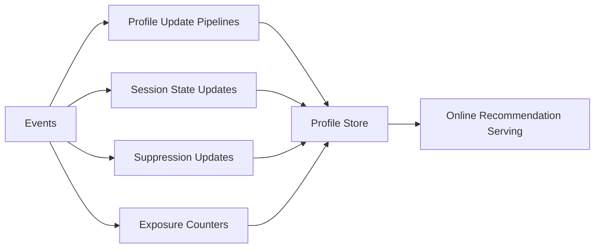

------
title: Build From Scratch Recommendations System - Part 056
description: Mendesain profile store dan user state production-grade: long-term profile, short-term session, anonymous state, identity merge, suppression, exposure/frequency, consent, TTL, real-time updates, consistency, privacy, and serving APIs.
series: learn-build-from-scratch-recommendations-system
seriesTitle: Build From Scratch: Enterprise Recommendations System
order: 56
partTitle: Profile Store and User State
tags:
  - recommendation-system
  - recsys
  - profile-store
  - user-state
  - personalization
  - online-serving
  - series
date: 2026-07-02
---

# Part 056 — Profile Store and User State

Recommendation system yang personal membutuhkan memory.

Memory itu tidak hanya:

```text
user liked category X
```

Ia mencakup:

- long-term preferences,
- short-term session intent,
- recent behavior,
- exposure history,
- frequency counters,
- suppression/hide/block,
- consent/privacy mode,
- anonymous state,
- device/session state,
- identity merge,
- purchased/consumed state,
- enterprise actor/case state,
- tenant-scoped state.

Profile store dan user state store adalah sistem yang menyajikan memory ini ke online serving path.

Part ini membahas desain profile store dan user state production-grade: state taxonomy, long-term vs short-term, anonymous/logged-in identity, session state, suppression, exposure/frequency, consent, merge/split, TTL, consistency, privacy, serving API, and failure modes.

---

## 1. Mental Model: User State Is Online Memory for Decisions

Recommendation decision uses context:

```text
who is the subject?
what do we know about them?
what are they doing now?
what should we avoid showing?
what did they already see?
what are they allowed/consented to?
```

Profile store provides online memory.



Without profile/user state, recommendation becomes stateless and repetitive.

---

## 2. State Taxonomy

User state categories:

```text
identity state
consent/privacy state
long-term preference profile
short-term/session state
recent behavior state
exposure/frequency state
suppression/negative preference state
purchase/consumption state
experiment assignment state
enterprise actor/workflow state
```

Not all belong in one physical store, but online serving needs unified access.

---

## 3. Long-Term Profile

Long-term profile captures stable preference.

Examples:

```text
category_affinity_90d
brand_affinity_180d
creator_affinity_30d
price_bucket_preference
language_preference
content_topic_embedding
visual_style_embedding
purchase_frequency
user_lifecycle_stage
```

Update cadence:

- hourly,
- daily,
- nearline depending domain.

Long-term profile should not overreact to one session.

---

## 4. Short-Term Session State

Session state captures current intent.

Examples:

```text
recent_item_ids
recent_event_types
last_query
current_cart
session_category_counts
session_embedding
session_depth
time_since_last_event
negative_events_this_session
```

Update cadence:

- seconds,
- event-driven,
- request-time.

Session state should be fresh.

A stale session state makes recommender feel slow.

---

## 5. Recent Behavior State

Recent behavior spans beyond session but shorter than long-term.

Examples:

```text
clicked_items_1d
viewed_categories_7d
hidden_topics_30d
recent_search_queries_7d
recent_purchases_30d
recently_consumed_articles_7d
```

Useful for:

- freshness,
- fatigue,
- near-term intent,
- suppression,
- recommendations.

---

## 6. Exposure / Frequency State

Exposure state:

```text
item_impressions_7d
creator_impressions_1d
topic_impressions_7d
campaign_impressions_1d
last_item_impression_at
```

Used for:

- frequency caps,
- fatigue penalties,
- repetition control,
- sponsored limits,
- exploration caps.

This state must update from impression events, not just decision logs.

---

## 7. Suppression State

Suppression state stores explicit or derived blocks.

Examples:

```text
hidden_item
blocked_creator
not_interested_topic
suppressed_product_family
purchased_durable_suppression
completed_action
invalid_after_case_transition
```

Suppression has:

- scope,
- reason,
- created_at,
- expires_at,
- source,
- strength.

Explicit user controls should be near-real-time.

---

## 8. Consent and Privacy State

Personalization must respect consent/privacy.

State:

```text
personalization_allowed
ads_personalization_allowed
behavioral_features_allowed
sensitive_topic_allowed
data_retention_policy
do_not_profile
user_deleted
```

Serving should check before fetching/using personal features.

Do not fetch personal profile if privacy mode disallows it.

---

## 9. Identity State

User can be:

```text
anonymous
logged-in
device-linked
account-linked
household/shared
enterprise actor
```

Identity state maps:

```text
anonymous_id -> user_id
device_id -> anonymous_id
user_id -> account_id
actor_id -> tenant_id
```

Profile store must handle identity merge/split carefully.

Wrong identity merge causes privacy and relevance issues.

---

## 10. Anonymous State

Anonymous users still have session/device state.

Examples:

```text
anonymous recent views
session intent
frequency caps
suppression within session/device
contextual preferences
```

If user logs in, anonymous state may merge into user profile if allowed.

Before merge:

- check consent,
- confidence,
- shared device risk,
- TTL.

---

## 11. Identity Merge

When anonymous becomes logged-in:

```text
anon_123 -> user_456
```

Merge candidates:

- session state,
- recent events,
- suppression,
- cart,
- exposure counts,
- preferences.

Not all state should merge permanently.

Example:

```text
gift-shopping session should not permanently alter long-term profile too much
```

Use weighted/temporary merge.

---

## 12. Identity Split

If identity was wrong/shared device:

- separate profiles,
- remove events from wrong user if needed,
- update suppression/exposure,
- handle privacy deletion.

Identity split is hard. Avoid overconfident merges.

Profile store should preserve provenance of state updates.

---

## 13. Enterprise Actor State

Enterprise recommendations often depend on:

```text
actor_id
role
team
permission set
tenant_id
case assignment
workflow state
recent actions
expertise level
```

This is not the same as consumer personalization.

Actor state must respect tenant and access control.

Case-specific state may be stored separately but accessed with profile/user state.

---

## 14. State Freshness Requirements

Different state freshness:

| State | Freshness |
|---|---|
| consent/privacy | immediate/strong |
| suppression hide/block | seconds |
| session state | seconds |
| exposure counters | seconds/minutes |
| long-term affinity | hours/days |
| purchased durable suppression | minutes/hours |
| enterprise permission | immediate/strong |
| case state | immediate/strong |

Critical state may need synchronous source-of-truth check.

---

## 15. Physical Store Decomposition

Possible stores:

```text
profile_store
session_store
suppression_store
frequency_store
consent_store
identity_store
enterprise_permission_store
```

Online serving may use a facade:

```text
UserStateService
```

that aggregates.

Do not force all state into one database if requirements differ.

---

## 16. User State Service Facade

API:

```text
getUserState(subject, context, requested_state_groups)
```

Returns:

- profile,
- session,
- suppression,
- frequency,
- consent,
- identity info,
- diagnostics.

Facade hides store decomposition from Rec API/ranking.

But it must preserve freshness and critical failure behavior.

---

## 17. User State Request

```json
{
  "request_id": "req_001",
  "subject": {
    "user_id": "u123",
    "anonymous_id": "anon_456",
    "session_id": "sess_789",
    "tenant_id": "tenant_1"
  },
  "context": {
    "surface": "home_feed",
    "privacy_mode": "personalized",
    "request_time": "2026-07-02T10:00:00Z"
  },
  "state_groups": [
    "consent",
    "long_term_profile",
    "session",
    "suppression",
    "frequency"
  ]
}
```

State groups avoid overfetch.

---

## 18. User State Response

```json
{
  "subject_resolution": {
    "effective_user_id": "u123",
    "identity_confidence": 0.98
  },
  "consent": {
    "personalization_allowed": true
  },
  "profile": {
    "category_affinity_30d": {
      "camera": 0.82,
      "laptop": 0.43
    },
    "price_bucket_preference": "mid"
  },
  "session": {
    "recent_item_ids": ["item_a", "item_b"],
    "last_query": "mirrorless camera",
    "session_depth": 6
  },
  "suppression": {
    "blocked_creators": ["creator_9"],
    "hidden_items": ["item_x"]
  },
  "frequency": {
    "item_impressions_7d": {
      "item_a": 2
    }
  },
  "diagnostics": {
    "stale_groups": [],
    "missing_groups": [],
    "latency_ms": 14
  }
}
```

Response should include staleness/missing diagnostics.

---

## 19. State Update Sources

State updates from:

```text
impression events
click events
purchase events
hide/block events
query events
cart events
session events
consent changes
identity login/logout
catalog events
case workflow events
```

Update mode:

- streaming,
- synchronous write,
- nearline aggregation,
- batch recomputation.

Critical explicit feedback may require synchronous or near-real-time write.

---

## 20. Session Store

Session store requirements:

- low latency,
- high write rate,
- TTL,
- append/update recent events,
- ordered sequence,
- race tolerance,
- privacy-aware.

Key:

```text
session_id
```

Value:

```json
{
  "recent_events": [...],
  "session_embedding": [...],
  "last_query": "...",
  "updated_at": "..."
}
```

TTL could be hours/days depending domain.

---

## 21. Session Event Ordering

Events can arrive out of order.

Session state should use event_time and sequence number if available.

If event order uncertain:

- append with timestamp,
- sort on read for small recent sequence,
- tolerate minor disorder,
- avoid using future event in training.

Online serving wants fast approximate session state. Offline training should reconstruct precisely.

---

## 22. Profile Update Strategies

### Batch

Daily/hourly rebuild from events.

Pros:

- stable,
- reproducible.

Cons:

- stale.

### Streaming Incremental

Update profile as events arrive.

Pros:

- fresh.

Cons:

- complex,
- noise,
- state correctness.

### Hybrid

Batch base profile + streaming delta.

Recommended:

```text
long-term batch base
nearline recent overlay
session real-time state
```

---

## 23. Hybrid Profile

Profile:

```text
effective_profile =
  long_term_profile
  + recent_delta
  + session_state
```

Example:

```text
user generally likes backend books
current session shopping for camera
```

Ranking sees both and can choose.

Do not overwrite long-term profile with one session.

---

## 24. Profile Feature Confidence

Store confidence/support.

```json
{
  "category": "camera",
  "affinity": 0.82,
  "support": 14,
  "last_event_at": "2026-07-02T09:55:00Z"
}
```

Low support means uncertain.

Ranker can use support/confidence.

---

## 25. Profile Decay

User interests change.

Use decay:

```text
weight = exp(-lambda * age)
```

Profile aggregates should decay old behavior.

Different domains:

- news interests decay fast,
- durable preferences decay slowly,
- enterprise role changes when assignment changes.

Do not let ancient behavior dominate forever.

---

## 26. Negative Profile

Maintain negative preference separately.

Examples:

```text
hidden categories
blocked creators
not interested topics
disliked item embeddings
negative session embedding
```

Positive and negative should not just cancel in one vector.

Negative feedback often deserves stronger suppression.

---

## 27. Purchase/Consumption State

State:

```text
purchased_item_ids
purchased_category_recent
consumed_content_ids
completed_course_ids
completed_action_ids
```

Used for:

- suppression,
- replenishment,
- next-step recommendations,
- complements,
- progress tracking.

Store with domain semantics.

Purchased durable vs consumable differs.

---

## 28. Suppression TTL

Suppression can expire.

Examples:

```text
hide item: 90d
block creator: indefinite
not interested topic: 30d or until reset
purchased durable: category-specific 180d+
completed enterprise action: case lifecycle
```

Suppression record should include `expires_at`.

Expired suppressions should not linger.

---

## 29. Strong vs Eventual Consistency

Some state needs strong consistency:

```text
consent revoked
user deleted
permission removed
tenant access revoked
explicit block
```

Other state can be eventual:

```text
category affinity
item CTR
session embedding
frequency count
```

Design per state group.

Do not treat permission/consent like soft eventual feature.

---

## 30. State Read Consistency

Serving may read multiple stores.

Need consistency approach:

- read at request time,
- tolerate eventual for non-critical,
- use source-of-truth for critical,
- include version/timestamp,
- final check critical constraints.

Example:

```text
profile says item okay
policy final check says now banned
```

Final check wins.

---

## 31. Hot Users and Hot Keys

Some users/items have huge activity.

Profile store must handle hot keys.

Strategies:

- sharding,
- write coalescing,
- stream aggregation,
- rate limiting,
- approximate counters,
- separate hot-key path.

Celebrity/large enterprise tenants can create hot state keys.

---

## 32. Batch Get for Candidate-Related State

Frequency/suppression often candidate-dependent.

Need batch query:

```text
for user u and item IDs [1..800], get seen/suppressed counts
```

Avoid one call per candidate.

State service should support bulk operations.

---

## 33. Privacy and Retention

User state is sensitive.

Controls:

- consent enforcement,
- data minimization,
- TTL,
- deletion,
- encryption,
- access control,
- audit,
- no cross-tenant leakage,
- no debug exposure without permission.

Profile store should not become uncontrolled behavioral warehouse.

---

## 34. User Reset / Controls

Users may reset recommendations.

Effect:

- clear long-term behavioral profile,
- keep necessary compliance state,
- keep explicit preferences if user wants,
- clear derived affinities,
- clear session maybe.

Define reset semantics.

Do not delete event logs if not required, but stop using previous profile if reset means so.

---

## 35. Profile Store Observability

Metrics:

```text
read latency p95/p99
write latency
state group hit rate
staleness
missing rate
suppression update lag
session update lag
consent check failures
identity merge count
profile size
hot key metrics
error rate
```

By:

- surface,
- region,
- tenant,
- state group.

---

## 36. State Quality Monitoring

Quality metrics:

```text
profile coverage
average profile age
affinity distribution
zero profile rate
anonymous profile merge rate
negative feedback application lag
frequency counter accuracy
session depth distribution
```

A profile pipeline bug can silently ruin personalization.

---

## 37. State Debugging

Debug should show:

- effective identity,
- consent mode,
- long-term profile summary,
- session events,
- suppression records,
- exposure counts,
- state timestamps,
- missing/stale groups.

Access-controlled and redacted.

For enterprise, show tenant/role permissions carefully.

---

## 38. Profile Store and Feature Store Relationship

Profile store often provides user features.

Options:

- profile store is source; feature store materializes user features,
- feature store calls profile store,
- profile store exposes feature groups directly.

Keep boundaries clear:

- profile store owns user state,
- feature store owns feature contract and serving for models.

They can integrate.

---

## 39. Profile Store and Ranking

Ranking uses profile state as features.

Examples:

```text
user_category_affinity
session_embedding
blocked_creator_flag
seen_item_count
purchased_recently
```

Feature assembler can combine profile store response into model features.

For non-personalized mode, skip user profile features.

---

## 40. Multi-Device State

User may use multiple devices.

State levels:

```text
session
device
anonymous
logged-in user
account/household
tenant actor
```

Some state should be shared after login, some should not.

Example:

- explicit block should follow user,
- current session intent may be device/session-specific,
- household/shared profile risky.

Use identity graph confidence.

---

## 41. Enterprise Case State

For case-based recommendations:

State can be keyed by:

```text
tenant_id + case_id + actor_id
```

Includes:

- case state,
- recent actions,
- completed checklist,
- open tasks,
- evidence uploaded,
- policy applicable,
- SLA state.

Some belongs to workflow system, not profile store. User state service may fetch it.

Do not duplicate source-of-truth incorrectly.

---

## 42. State Store Anti-Patterns

### 42.1 One Giant User Blob

Hard to update, debug, and expire.

### 42.2 No Consent Enforcement

Privacy risk.

### 42.3 Session State Used as Long-Term Profile

Overreaction.

### 42.4 Explicit Hide Delayed

User trust breaks.

### 42.5 No TTL

Ancient behavior persists.

### 42.6 No Missing/Stale Diagnostics

Serving silently degrades.

### 42.7 Cross-Tenant State Leak

Severe security issue.

### 42.8 Per-Candidate State Calls

Latency explosion.

### 42.9 Wrong Identity Merge

Privacy/relevance damage.

### 42.10 No State Provenance

Cannot debug why profile says something.

---

## 43. Implementation Sketch: User State API

```java
public interface UserStateService {
    UserStateResponse getUserState(UserStateRequest request);
}

public record UserStateRequest(
    String requestId,
    Subject subject,
    RequestContext context,
    Set<StateGroup> requestedGroups
) {}

public enum StateGroup {
    CONSENT,
    LONG_TERM_PROFILE,
    SESSION,
    SUPPRESSION,
    FREQUENCY,
    PURCHASE_CONSUMPTION,
    ENTERPRISE_CONTEXT
}
```

---

## 44. Implementation Sketch: User State Response

```java
public record UserStateResponse(
    SubjectResolution subjectResolution,
    ConsentState consent,
    LongTermProfile profile,
    SessionState session,
    SuppressionState suppression,
    FrequencyState frequency,
    PurchaseConsumptionState purchaseConsumption,
    UserStateDiagnostics diagnostics
) {}
```

Keep groups optional/null-safe.

---

## 45. Implementation Sketch: Suppression Record

```java
public record SuppressionRecord(
    String subjectId,
    SuppressionScope scope,
    String targetId,
    String reasonCode,
    Instant createdAt,
    Optional<Instant> expiresAt,
    String source
) {}

public enum SuppressionScope {
    ITEM,
    DEDUP_GROUP,
    CREATOR,
    SELLER,
    CATEGORY,
    TOPIC,
    CAMPAIGN,
    ACTION_TYPE
}
```

Suppression is auditable state.

---

## 46. Implementation Sketch: Effective Profile

```java
public final class EffectiveProfileBuilder {
    public EffectiveProfile build(
        LongTermProfile longTerm,
        RecentProfileDelta recent,
        SessionState session,
        ConsentState consent
    ) {
        if (!consent.personalizationAllowed()) {
            return EffectiveProfile.contextualOnly();
        }

        return EffectiveProfile.combine(longTerm, recent, session);
    }
}
```

Consent is checked before combining.

---

## 47. Minimal Production Profile/User State Plan

Start with:

```yaml
state_groups:
  consent:
    freshness: immediate
    source: consent_service
  long_term_profile:
    freshness: hourly_or_daily
    source: profile_pipeline
  session:
    freshness: seconds
    ttl: 2h
  suppression:
    freshness: seconds
    source: explicit_feedback_stream
  frequency:
    freshness: minutes
    source: impression_stream
api:
  batch_candidate_state: true
  state_group_selection: true
  diagnostics: true
privacy:
  non_personalized_mode: enforced
  deletion_workflow: true
monitoring:
  latency: true
  staleness: true
  suppression_lag: true
  session_hit_rate: true
```

Then add identity merge, enterprise state, and advanced profiles.

---

## 48. Checklist Profile Store and User State Readiness

```text
[ ] State taxonomy is defined.
[ ] Long-term profile and session state are separated.
[ ] Consent/privacy state is enforced before personalization.
[ ] Anonymous state is supported.
[ ] Identity merge/split policy exists.
[ ] Suppression state supports scope/reason/TTL.
[ ] Exposure/frequency state supports batch lookup.
[ ] Purchased/consumed state is domain-specific.
[ ] Session state has TTL and freshness monitoring.
[ ] Critical state has strong/fail-safe behavior.
[ ] State response includes missing/stale diagnostics.
[ ] Privacy deletion/reset workflows exist.
[ ] Tenant isolation exists for enterprise.
[ ] Batch candidate-related state API exists.
[ ] State quality and latency monitoring exist.
[ ] Debug view is access-controlled.
```

---

## 49. Kesimpulan

Profile store dan user state memberi recommendation system memory yang dibutuhkan untuk personalization, session intent, suppression, frequency, dan privacy-aware decisions.

Prinsip utama:

1. User state is online memory for decisioning.
2. Long-term profile, short-term session, suppression, frequency, and consent are different state types.
3. Session state should be fresh but not permanently overwrite long-term profile.
4. Explicit user controls must apply quickly.
5. Consent/privacy state must be enforced before feature/profile use.
6. Identity merge is powerful but risky.
7. Frequency and suppression need batch candidate lookup.
8. Some state can be eventual; consent/permission may require strong checks.
9. Profile/user state needs TTL, provenance, monitoring, and deletion workflows.
10. Enterprise user state is actor/role/tenant/workflow-aware, not just consumer preference.

Di Part 057, kita akan membahas **Embedding Pipeline and Index Versioning**: bagaimana menghasilkan embedding, membangun ANN index, mengelola versi, delta index, atomic publish, rollback, dan compatibility antara embedding/model/index.
