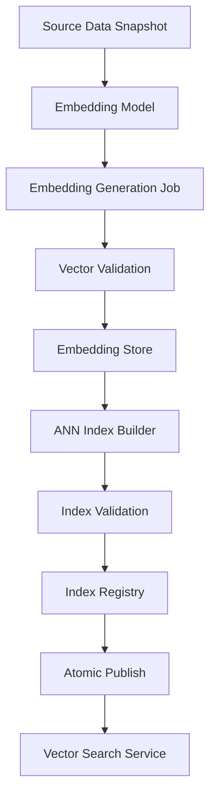

------
title: Build From Scratch Recommendations System - Part 057
description: Mendesain embedding pipeline dan index versioning production-grade: embedding generation, vector validation, ANN index build, index metadata, delta index, atomic publish, compatibility, rollback, monitoring, freshness, dan serving integration.
series: learn-build-from-scratch-recommendations-system
seriesTitle: Build From Scratch: Enterprise Recommendations System
order: 57
partTitle: Embedding Pipeline and Index Versioning
tags:
  - recommendation-system
  - recsys
  - embeddings
  - vector-search
  - ann
  - mlops
  - series
date: 2026-07-02
---

# Part 057 — Embedding Pipeline and Index Versioning

Modern recommendation system hampir pasti menggunakan embeddings.

Embedding dipakai untuk:

- two-tower retrieval,
- content-based retrieval,
- semantic document matching,
- similar item,
- user/session representation,
- graph embedding,
- multimodal matching,
- query understanding,
- cold-start item representation,
- enterprise case-to-document/action matching.

Namun embedding production bukan hanya file vector.

Kita butuh pipeline yang:

- menghasilkan embedding secara reproducible,
- menjaga compatibility antara query vector dan item vector,
- memvalidasi coverage/quality,
- membangun ANN index,
- mengelola index version,
- mendukung atomic publish,
- menangani delta/new items,
- rollback,
- monitor drift/freshness/recall/latency,
- dan terintegrasi dengan online serving.

Part ini membahas embedding pipeline dan index versioning production-grade.

---

## 1. Mental Model: Embedding Is a Serving Artifact, Not Just Model Output

Embedding adalah artifact yang dipakai online.

```text
model training -> embedding generation -> vector store -> ANN index -> candidate retrieval
```

Jika salah satu versi tidak compatible, retrieval rusak.

Example:

```text
query_embedding_model_v5
item_embedding_model_v4
```

Jika query dan item embedding berasal dari ruang vector berbeda, dot product tidak bermakna.

Embedding harus dikelola seperti model artifact.

---

## 2. Embedding Family

Embedding family mendefinisikan ruang vector.

Contoh:

```yaml
embedding_family: ecommerce_two_tower_v7
entity_types:
  query: user_context
  document: item
dimension: 128
similarity: dot_product
normalization: none
compatible_query_model: user_tower_v7
compatible_item_model: item_tower_v7
```

Embedding family menentukan:

- dimension,
- similarity function,
- normalization,
- training objective,
- compatible tower/model,
- intended use case.

Jangan campur embedding family tanpa contract.

---

## 3. Embedding Types

Common embedding types:

```text
item embedding
user embedding
session embedding
query embedding
content/text embedding
image embedding
multimodal embedding
graph embedding
case embedding
action/document embedding
```

Each has different generation cadence and serving mode.

| Embedding | Cadence | Use |
|---|---|---|
| item two-tower | batch/nearline | ANN candidate retrieval |
| user query tower | request-time/nearline | ANN query vector |
| session embedding | real-time/nearline | session retrieval/ranking |
| content text embedding | offline | cold-start/content search |
| graph embedding | batch | graph-based candidates/features |
| case embedding | request-time/nearline | enterprise document/action matching |

---

## 4. Embedding Pipeline Overview



Each stage creates metadata and quality metrics.

---

## 5. Source Data Snapshot

Embedding generation starts from a source snapshot.

Examples:

```text
eligible item catalog snapshot
item metadata snapshot
text/content snapshot
image feature snapshot
user profile snapshot
graph snapshot
case/document snapshot
```

Snapshot metadata:

```yaml
source_snapshot_id: item_catalog_20260702_0000
item_count: 12000000
policy_filter: recommendable_items_v5
created_at: 2026-07-02T00:00:00Z
```

Without snapshot ID, embedding cannot be reproduced.

---

## 6. Embedding Model Metadata

Embedding model metadata:

```yaml
model_name: item_tower
model_version: item_tower_20260702_001
embedding_family: ecommerce_two_tower_v7
dimension: 128
similarity: dot_product
normalization: none
training_dataset: retrieval_dataset_20260701_001
feature_set: item_tower_features_v9
```

Model version and embedding family must be tied.

---

## 7. Embedding Record Schema

Embedding record:

```json
{
  "entity_type": "item",
  "entity_id": "item_123",
  "embedding_family": "ecommerce_two_tower_v7",
  "embedding_version": "item_embedding_20260702_001",
  "dimension": 128,
  "vector": [0.12, -0.03, 0.44],
  "generated_at": "2026-07-02T01:00:00Z",
  "source_snapshot_id": "catalog_20260702_0000",
  "model_version": "item_tower_20260702_001"
}
```

Do not store vector without metadata.

---

## 8. Vector Validation

Before publishing, validate:

```text
dimension correct
no NaN/Inf
norm distribution sane
zero vector rate
duplicate vector rate
coverage
missing entity rate
embedding distribution drift
outlier vectors
entity count
model/version consistency
```

Example checks:

```text
zero_vector_rate < 0.1%
nan_count == 0
coverage > 99% for eligible warm items
dimension == expected
```

Bad vectors can destroy retrieval.

---

## 9. Embedding Coverage

Coverage:

```text
entities with valid embedding / eligible entities
```

Monitor by segment:

- category,
- region,
- item age,
- language,
- tenant,
- item type,
- policy state.

Example:

```text
overall coverage 98%
new item coverage 40%
```

Overall looks okay, cold-start broken.

---

## 10. Norm Distribution

For dot product embeddings, vector norm affects score.

Monitor:

```text
mean norm
p50/p95/p99 norm
zero norm
norm by category
norm by item age
```

If norm drifts, retrieval changes.

For cosine similarity, embeddings usually normalized.

Do not mix normalized and unnormalized vectors accidentally.

---

## 11. Similarity Function Compatibility

Index and model must agree.

```yaml
similarity: dot_product
```

or:

```yaml
similarity: cosine
normalization: l2
```

If model trained for dot product but index uses cosine, retrieval can degrade.

If using cosine, ensure all item/query vectors normalized consistently.

---

## 12. ANN Index Artifact

Index artifact metadata:

```yaml
index_name: item_retrieval_home
index_version: item_index_20260702_001
embedding_family: ecommerce_two_tower_v7
embedding_version: item_embedding_20260702_001
algorithm: hnsw
metric: inner_product
dimension: 128
item_count: 11850000
build_started_at: 2026-07-02T02:00:00Z
build_finished_at: 2026-07-02T03:20:00Z
status: candidate
```

Index version is separate from embedding version.

One embedding version can have multiple index configs.

---

## 13. Index Build Pipeline

Steps:

1. Load validated embeddings.
2. Apply eligibility/indexable filters.
3. Build index with parameters.
4. Run recall benchmark.
5. Run latency benchmark.
6. Validate metadata.
7. Publish to index registry as candidate.
8. Load in serving shadow.
9. Promote atomically.

Do not publish index immediately after build without validation.

---

## 14. Indexable Filter

Not all items with embeddings should be indexed.

Filter:

```text
item active
policy approved
recommendable
available in target region if index region-specific
not deleted
not expired
tenant-specific allowed
```

Some filters happen at query time, but index should not include obviously invalid entities if avoidable.

Index filter version should be recorded.

---

## 15. Global vs Partitioned Index

Options:

### Global Index

One large index.

Pros:

- simpler,
- broad recall.

Cons:

- filter heavy,
- tenant/region constraints harder,
- larger latency/memory.

### Partitioned Index

By:

```text
region
tenant
language
item type
category
surface
```

Pros:

- faster filtered search,
- isolation.

Cons:

- many indexes,
- operational complexity,
- lower recall across partitions.

Choose based on filtering requirements and scale.

---

## 16. Multi-Tenant Indexing

Enterprise options:

1. separate index per tenant,
2. shared index with tenant filter,
3. hybrid by tenant size/sensitivity.

For strict isolation, separate index is safer.

Shared index requires strong metadata filtering and access control.

Never leak cross-tenant items.

---

## 17. Index Validation: Recall Benchmark

ANN is approximate. Validate recall vs exact search.

Process:

```text
sample query vectors
run exact top-K over subset/full if possible
run ANN top-K
compute recall@K
```

Metrics:

```text
recall@50
recall@100
latency p95
query failure rate
filter success rate
```

Index should meet threshold before publish.

---

## 18. Index Validation: Business Smoke Test

Run known queries.

Examples:

```text
camera user vector returns camera-related items
Java query returns Java docs
tenant A query returns only tenant A documents
new item appears in delta index
restricted item absent
```

Smoke tests catch severe mistakes.

---

## 19. Atomic Publish

Index publish should be atomic.

Bad:

```text
replace files while service reads them
```

Good:

```text
build index_20260702
load into standby
health check
switch active pointer
old index remains for rollback
```

Active pointer:

```yaml
index_alias: home_item_index
active_version: item_index_20260702_001
previous_version: item_index_20260701_001
```

Serving reads alias.

---

## 20. Index Registry

Index registry stores:

- index version,
- embedding version,
- build metadata,
- validation metrics,
- status,
- serving aliases,
- rollback info,
- owner,
- artifact location,
- checksum.

Statuses:

```text
built
validated
shadow
canary
production
deprecated
archived
failed
```

Index registry is like model registry for retrieval indexes.

---

## 21. Shadow Index

Before production, query shadow index with live traffic.

Compare:

- latency,
- candidate overlap,
- score distribution,
- category distribution,
- source contribution,
- filter rate,
- errors.

Shadow index does not affect response.

Useful for new embedding/index changes.

---

## 22. Canary Index

Route small traffic to new index.

Monitor:

- primary metrics,
- candidate recall proxy,
- candidate diversity,
- ranking outcomes,
- latency,
- empty result rate,
- filter rate,
- segment metrics.

Rollback if anomalies.

Index changes can alter candidate universe dramatically.

---

## 23. Rollback

Rollback should switch alias back.

```text
home_item_index -> item_index_20260701_001
```

Keep previous index loaded or quickly loadable.

Rollback must also consider query embedding version.

If query tower was changed with item index, rollback both as compatible bundle.

---

## 24. Query and Item Compatibility

Two-tower retrieval has two sides:

```text
query/user tower
item tower/index
```

Compatibility bundle:

```yaml
retrieval_bundle:
  query_model_version: user_tower_20260702_001
  item_embedding_version: item_embedding_20260702_001
  index_version: item_index_20260702_001
  embedding_family: ecommerce_two_tower_v7
```

Online serving should route query model and index together.

Do not update only one side.

---

## 25. Retrieval Bundle

Bundle includes:

- query model,
- item embedding version,
- index version,
- similarity metric,
- feature schema,
- normalization,
- filters,
- fallback index.

Candidate source loads retrieval bundle.

This prevents mismatched deployments.

---

## 26. Delta Index

Full index may update daily. New/updated items need faster retrieval.

Delta index:

```text
small nearline index of recently created/updated items
```

Serving searches:

```text
main_index + delta_index
```

Merge/dedup results.

Delta index can be rebuilt every few minutes.

---

## 27. Delta Index Lifecycle

Events:

```text
item created
item updated
item approved
item deleted
item policy changed
```

Pipeline:

```text
generate embedding
validate
add/update delta index
remove deleted/invalid items
periodically merge into full index
```

Need deletion handling.

---

## 28. Delete and Tombstone

If item becomes invalid:

- remove from online index if possible,
- add tombstone filter,
- final eligibility check rejects,
- rebuild full index later.

ANN indexes may not support efficient delete.

Use tombstone/denylist at query result filtering as safety.

Critical policy deletion should apply immediately.

---

## 29. Index Freshness

Freshness metrics:

```text
main_index_age
delta_index_age
embedding_age
new_item_time_to_index
delete_propagation_lag
policy_change_propagation_lag
```

Example SLO:

```text
new approved item searchable within 10 minutes
deleted/banned item suppressed within 1 minute
full index age < 24h
```

---

## 30. Embedding Drift

Embedding distribution can drift due to:

- model retrain,
- catalog change,
- language mix,
- feature pipeline change,
- normalization bug,
- content extraction bug.

Monitor:

- vector norm,
- dimension distribution,
- nearest neighbor quality,
- cluster distribution,
- retrieval category distribution.

Drift can degrade candidate retrieval silently.

---

## 31. Query Drift

Query/user embeddings can drift too.

Monitor:

```text
query vector norm
zero query vector rate
fallback query vector rate
session embedding missing
query model latency
OOV/missing feature rate
```

If query tower input features fail, retrieval returns poor candidates.

---

## 32. Multi-Embedding Strategy

A platform may have multiple embedding families:

```text
home_two_tower
search_text_embedding
image_similarity
graph_embedding
enterprise_case_doc
```

Each has own index and compatibility.

Candidate orchestrator can query multiple vector indexes.

Do not collapse all use cases into one universal embedding without evaluation.

---

## 33. Hybrid Retrieval

Vector search often combines with metadata/filter retrieval.

Example:

```text
ANN top 1000
filter eligible
join metadata
rerank by hybrid score
```

Hybrid candidate source may also combine:

```text
BM25 + vector
content embedding + popularity
case semantic + policy validity
```

Index versioning must include filters and metadata version.

---

## 34. Embedding Store vs Index Store

Embedding store:

```text
lookup vector for entity
```

Index store:

```text
nearest neighbor search
```

They can be separate.

Ranking may need item embeddings for similarity features even if candidate generation uses index.

Ensure embedding version used by ranking is compatible and available.

---

## 35. Serving API for Vector Search

Request:

```json
{
  "request_id": "req_001",
  "index_alias": "home_item_index",
  "query_vector": [0.1, -0.2],
  "top_k": 500,
  "filters": {
    "region": "ID",
    "item_type": "product"
  },
  "embedding_family": "ecommerce_two_tower_v7"
}
```

Response:

```json
{
  "index_version": "item_index_20260702_001",
  "embedding_version": "item_embedding_20260702_001",
  "results": [
    {
      "item_id": "item_123",
      "score": 8.42,
      "rank": 1
    }
  ],
  "diagnostics": {
    "latency_ms": 12,
    "filtered_count": 30
  }
}
```

Return version metadata.

---

## 36. Score Semantics

Vector score semantics depend on metric.

```text
inner_product
cosine
l2_distance
```

Candidate source should return:

```text
score_type
higher_is_better
normalization
index_version
```

Ranker should not treat all vector scores as probabilities.

---

## 37. Filtering Strategy

Filtering can happen:

1. pre-filter in index,
2. post-filter after ANN,
3. overfetch then filter,
4. partitioned indexes,
5. hybrid.

Post-filter can hurt recall if many results removed.

If 90% results filtered by region, use partition or pre-filter.

---

## 38. Overfetch

If final needs 500 valid candidates, search more.

```text
ann_top_k = desired_k * overfetch_factor
```

Example:

```text
desired 500
filter rate 50%
overfetch 1200
```

Tune per surface/filter.

Monitor valid results after filtering.

---

## 39. Vector Search Latency

Latency depends on:

- index size,
- algorithm,
- top_k,
- filters,
- hardware,
- memory,
- concurrent queries,
- vector dimension,
- overfetch,
- partition count.

Monitor p95/p99 by index version and query type.

---

## 40. Cost and Capacity

Index memory can be large.

Capacity factors:

```text
item_count
dimension
algorithm overhead
replication
partitions
delta indexes
shadow/canary indexes
```

Index changes can double memory during rollout.

Plan capacity for side-by-side old/new indexes.

---

## 41. Index Build Cost

Full index build can be expensive.

Optimize:

- incremental/delta updates,
- partitioned builds,
- parallel build,
- reuse unchanged partitions,
- build during off-peak,
- compress/PQ if acceptable,
- archive old indexes.

But do not sacrifice recall without measurement.

---

## 42. Reproducibility

Given:

```text
source snapshot
embedding model version
embedding generation code
index algorithm/config
```

we should rebuild same or equivalent index.

Store:

- code version,
- container image,
- parameters,
- random seed,
- source data version,
- dependency versions.

Index builds can be nondeterministic; still track enough for audit.

---

## 43. Security and Privacy

Embeddings can encode sensitive data.

Controls:

- tenant isolation,
- access control,
- encryption,
- retention,
- deletion,
- privacy classification,
- no cross-tenant vector search,
- remove user embeddings on deletion,
- avoid exposing raw embeddings externally.

For enterprise documents, embedding may leak content. Treat as sensitive.

---

## 44. User Embedding Deletion

If user requests deletion:

- delete user embedding,
- remove from vector store,
- stop serving personalization,
- update downstream indexes if user embeddings indexed,
- exclude from future training if required.

Item/content embeddings may also be sensitive if document deleted.

---

## 45. Monitoring Dashboard

Minimum:

```text
embedding coverage
embedding norm distribution
embedding generation failures
new item time-to-embedding
index build status
index recall benchmark
index latency p95/p99
index result count
filter rate
empty result rate
active index version
delta index age
delete propagation lag
candidate quality metrics
```

By:

- index,
- embedding family,
- region,
- tenant,
- item type,
- category.

---

## 46. Common Failure Modes

### 46.1 Query/Item Version Mismatch

Vector search meaningless.

### 46.2 Wrong Similarity Metric

Recall/quality drops.

### 46.3 NaN/Zero Vectors Published

Bad retrieval.

### 46.4 Partial Index Publish

Serving errors/incomplete results.

### 46.5 Deleted/Banned Item Still in Index

Safety incident.

### 46.6 Delta Index Missing

New items invisible.

### 46.7 No Recall Benchmark

ANN tuning unknowable.

### 46.8 No Segment Coverage Monitoring

New category/language broken.

### 46.9 Shadow Index Not Tested

Candidate universe shifts unexpectedly.

### 46.10 Raw Embeddings Exposed

Privacy/security risk.

---

## 47. Implementation Sketch: Embedding Metadata

```java
public record EmbeddingMetadata(
    String embeddingFamily,
    String embeddingVersion,
    String entityType,
    int dimension,
    String similarity,
    String normalization,
    String modelVersion,
    String sourceSnapshotId,
    Instant generatedAt
) {}
```

Every vector store record should be traceable to this metadata.

---

## 48. Implementation Sketch: Index Metadata

```java
public record VectorIndexMetadata(
    String indexName,
    String indexVersion,
    String embeddingFamily,
    String embeddingVersion,
    String algorithm,
    String metric,
    int dimension,
    long entityCount,
    Instant builtAt,
    Map<String, Double> validationMetrics,
    IndexStatus status
) {}

public enum IndexStatus {
    BUILT,
    VALIDATED,
    SHADOW,
    CANARY,
    PRODUCTION,
    DEPRECATED,
    FAILED
}
```

Index registry stores this.

---

## 49. Implementation Sketch: Retrieval Bundle

```java
public record RetrievalBundle(
    String bundleName,
    String bundleVersion,
    String queryModelVersion,
    String queryFeatureSetVersion,
    String itemEmbeddingVersion,
    String indexAlias,
    String activeIndexVersion,
    String embeddingFamily,
    String similarity,
    Instant activatedAt
) {}
```

Candidate source should load retrieval bundle, not arbitrary model/index independently.

---

## 50. Minimal Production Embedding/Index Plan

Start with:

```yaml
embedding:
  family_versioned: true
  source_snapshot_id: required
  vector_validation:
    - dimension
    - nan_inf
    - norm_distribution
    - coverage
index:
  registry: true
  index_metadata: true
  recall_benchmark: true
  latency_benchmark: true
  atomic_alias_publish: true
  rollback_previous_index: true
serving:
  return_index_version: true
  overfetch_and_filter: true
  tombstone_filter: true
freshness:
  full_index_daily: true
  delta_index_nearline: planned
monitoring:
  coverage: true
  index_latency: true
  empty_results: true
  delete_lag: true
```

Then add shadow/canary and more advanced delta updates.

---

## 51. Checklist Embedding Pipeline and Index Versioning Readiness

```text
[ ] Embedding families are defined.
[ ] Embedding records include version/model/source metadata.
[ ] Query and item embeddings have compatibility contract.
[ ] Vector validation runs before publish.
[ ] Coverage is monitored by segment.
[ ] ANN index metadata is registered.
[ ] Index build uses explicit algorithm/metric/parameters.
[ ] Recall and latency benchmarks exist.
[ ] Index publish is atomic via alias/pointer.
[ ] Previous index remains available for rollback.
[ ] Retrieval bundle ties query model + item embedding + index.
[ ] Delta index or new-item path exists if freshness requires.
[ ] Deletes/policy changes propagate quickly via tombstone/final filter.
[ ] Serving API returns index/embedding version.
[ ] Shadow/canary process exists for major changes.
[ ] Privacy/tenant isolation is enforced.
```

---

## 52. Kesimpulan

Embedding dan index adalah production artifacts yang harus dikelola dengan disiplin yang sama seperti model.

Prinsip utama:

1. Embedding is a serving artifact, not just a vector file.
2. Embedding family defines vector space compatibility.
3. Query tower, item tower, embedding version, and ANN index must be deployed as compatible bundle.
4. Vector validation prevents catastrophic retrieval bugs.
5. ANN index needs version, metadata, recall benchmark, latency benchmark, and atomic publish.
6. Delta index or nearline path is needed for fresh items.
7. Deletion/policy changes require tombstones/final filtering.
8. Shadow/canary index rollout catches candidate universe shifts.
9. Monitoring must cover coverage, norm, recall, latency, freshness, and empty results.
10. Embeddings can contain sensitive information; treat them as governed data.

Di Part 058, kita akan membahas **Model Registry and Model Lifecycle**: bagaimana model artifact, feature set, dataset, metrics, approval, deployment, shadow, canary, rollback, and retirement dikelola secara production-grade.
