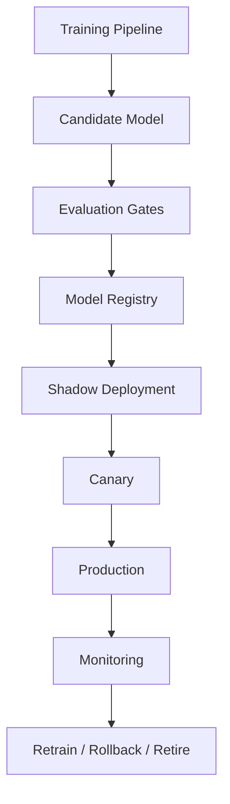
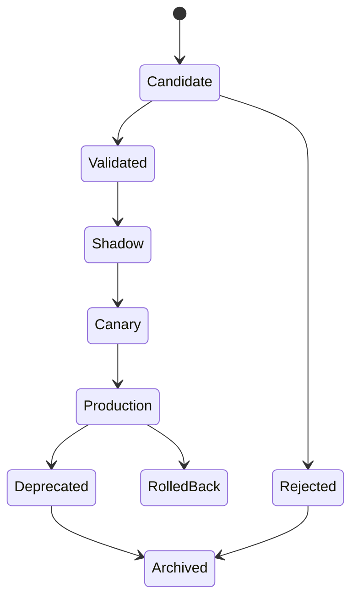

------
title: Build From Scratch Recommendations System - Part 058
description: Mendesain model registry dan model lifecycle production-grade untuk recommendation system: artifact metadata, model bundle, dataset/feature lineage, evaluation gates, approval, shadow, canary, deployment, rollback, monitoring, retraining, retirement, dan governance.
series: learn-build-from-scratch-recommendations-system
seriesTitle: Build From Scratch: Enterprise Recommendations System
order: 58
partTitle: Model Registry and Model Lifecycle
tags:
  - recommendation-system
  - recsys
  - model-registry
  - mlops
  - model-lifecycle
  - deployment
  - series
date: 2026-07-02
---

# Part 058 — Model Registry and Model Lifecycle

Recommendation system production-grade tidak cukup dengan model file seperti:

```text
ranker.pkl
model.bin
model.onnx
```

Kita butuh tahu:

- model ini dilatih dari dataset apa,
- feature set apa,
- label version apa,
- code version apa,
- metrics apa,
- calibration artifact apa,
- utility policy apa,
- siapa owner,
- status approval,
- apakah sedang shadow/canary/production,
- bagaimana rollback,
- model apa yang digantikan,
- kapan harus retrain,
- apakah masih dipakai.

Model registry dan model lifecycle menjadikan model sebagai artifact yang governed, reproducible, deployable, and auditable.

Part ini membahas desain model registry dan lifecycle production-grade untuk recommendation system: metadata, model bundle, lineage, evaluation gates, approval, deployment stages, shadow/canary, rollback, monitoring, retraining, retirement, and governance.

---

## 1. Mental Model: Model Is a Versioned Decision Artifact

Model bukan hanya weight.

Model untuk serving membutuhkan bundle:

```text
model artifact
feature set
feature schema
normalization stats
categorical vocab
calibration
utility policy
runtime
metadata
```

Jika salah satu mismatch, prediction bisa salah.

Model registry adalah source of truth untuk model artifacts and lifecycle state.



---

## 2. Model Registry Responsibilities

Registry stores:

- model metadata,
- artifact URI,
- model version,
- feature set version,
- training dataset version,
- label version,
- code/container version,
- hyperparameters,
- evaluation metrics,
- calibration artifact,
- serving runtime,
- approval status,
- deployment status,
- owner,
- lineage,
- rollback relationship,
- retirement state.

Registry should not necessarily store raw model bytes; it can store artifact references.

---

## 3. Model Versioning

Use immutable model version.

Example:

```text
home_ranker_20260702_001
```

Do not overwrite model version.

Bad:

```text
latest_model.bin
```

Good:

```text
model_name: home_ranker
model_version: home_ranker_20260702_001
artifact_uri: s3://models/home_ranker/20260702_001/model.onnx
```

Serving route can point to latest production, but artifact version immutable.

---

## 4. Model Name vs Model Version vs Route

Distinguish:

```text
model_name: home_ranker
model_version: home_ranker_20260702_001
route: home_feed_ranker_production
```

Route points to version.

```yaml
route: home_feed_ranker_production
active_model_version: home_ranker_20260702_001
```

Rollback changes route pointer, not model file.

---

## 5. Model Bundle

Model bundle includes everything needed to serve.

```yaml
model_bundle:
  model_name: home_ranker
  model_version: home_ranker_20260702_001
  artifact_uri: ...
  runtime: gbdt_runtime_v3
  feature_set_version: home_features_v18
  feature_schema_version: home_feature_schema_v18
  calibration_version: home_click_purchase_hide_cal_v5
  utility_policy_version: home_utility_v7
  categorical_vocab_versions:
    category_id: category_vocab_v6
  normalization_stats_version: dense_norm_v4
  training_dataset_version: home_ranker_ds_20260701_001
```

Deploy bundle atomically.

---

## 6. Artifact Metadata

Metadata example:

```yaml
model_name: home_ranker
model_version: home_ranker_20260702_001
model_type: gbdt_pointwise
objective: multi_task_utility_components
owner: recsys-ranking
created_at: 2026-07-02T03:00:00Z
training_job_id: train_abc123
code_version: git_sha_...
container_image: recsys-train:20260702
random_seed: 42
status: candidate
```

This enables reproducibility.

---

## 7. Lineage Metadata

Lineage:

```yaml
training_dataset_version: home_ranker_ds_20260701_001
feature_set_version: home_features_v18
label_versions:
  click_30m: v3
  purchase_7d: v2
  hide_7d: v1
negative_sampling_policy: exposed_no_click_v4
source_data:
  clean_events: 20260701
  decision_logs: 20260701
```

Lineage allows root cause analysis.

---

## 8. Hyperparameters

Store hyperparameters.

For GBDT:

```yaml
num_trees: 800
learning_rate: 0.05
max_depth: 8
min_data_in_leaf: 100
subsample: 0.8
```

For deep model:

```yaml
embedding_dim: 128
layers: [512, 256, 128]
dropout: 0.1
batch_size: 4096
optimizer: Adam
learning_rate: 0.0005
```

Hyperparameters are part of reproducibility.

---

## 9. Evaluation Metrics

Registry should store metrics.

Examples:

```yaml
offline_metrics:
  ndcg_at_20: 0.412
  auc_click: 0.781
  logloss_click: 0.221
  calibration_ece_click: 0.012
guardrail_metrics:
  predicted_hide_rate: 0.019
  cold_item_ndcg_at_20: 0.301
  new_user_ndcg_at_20: 0.287
latency_estimate_ms:
  p95: 14
```

Metrics should include segment metrics, not only global.

---

## 10. Segment Metrics

Store metrics by:

- surface,
- category,
- region,
- user tenure,
- item age,
- candidate source,
- tenant,
- privacy mode.

Example:

```yaml
segments:
  new_user:
    ndcg_at_20: 0.29
  warm_user:
    ndcg_at_20: 0.44
  new_item:
    coverage: 0.72
```

Global metrics can hide regressions.

---

## 11. Evaluation Gates

Model promotion gate:

```yaml
gates:
  ndcg_at_20:
    min_relative_improvement: 0.005
  calibration_ece_click:
    max: 0.02
  latency_p95_ms:
    max: 20
  new_user_ndcg:
    max_relative_regression: 0.01
  hide_rate_prediction:
    max_relative_increase: 0.02
  feature_compatibility:
    required: pass
```

If gate fails, model remains candidate.

Automate gates.

---

## 12. Compatibility Gates

Before serving, validate:

```text
feature set exists online
feature types match
all required features available
vocab versions present
normalization stats present
calibration compatible
runtime supports artifact
model input dimension matches
privacy class allowed
```

Compatibility failure should block deployment.

---

## 13. Model Status Lifecycle

Statuses:

```text
created
candidate
validated
rejected
shadow
canary
production
rolled_back
deprecated
archived
```

State machine:



Transitions should be audited.

---

## 14. Approval Workflow

Approval may require:

- ML owner,
- product owner,
- data quality,
- safety/policy,
- platform/serving,
- enterprise tenant owner.

Approval metadata:

```yaml
approved_by:
  - user: ml_lead
    time: 2026-07-02T04:00:00Z
  - user: product_owner
    time: 2026-07-02T04:10:00Z
approval_notes: "Passes offline gates; shadow 24h planned."
```

Critical systems need governance.

---

## 15. Shadow Deployment

Shadow model scores live traffic but does not affect users.

Registry stores:

```yaml
deployment_stage: shadow
traffic_sample: 5%
started_at: ...
comparison_baseline: home_ranker_20260701_001
```

Shadow metrics:

- latency,
- error rate,
- feature missing,
- score distribution,
- top-K overlap,
- segment score drift.

Shadow catches serving bugs.

---

## 16. Canary Deployment

Canary affects small traffic.

Example:

```yaml
stage: canary
traffic: 1%
assignment_unit: user
guardrails:
  hide_rate: no_increase
  latency_p95: < 200ms
rollback_on_alert: true
```

Canary should use experiment assignment/logging.

Registry tracks canary status and metrics.

---

## 17. Production Promotion

Production promotion updates route pointer.

```yaml
route: home_feed_ranker_production
old_model: home_ranker_20260701_001
new_model: home_ranker_20260702_001
activated_at: 2026-07-02T08:00:00Z
```

Keep old model available for rollback.

Do not delete old model immediately.

---

## 18. Rollback

Rollback:

```text
route pointer back to previous model bundle
```

Must include:

- model artifact,
- feature set,
- calibration,
- vocab,
- normalization,
- utility policy.

If rollback only changes model but leaves incompatible feature schema, rollback fails.

Rollback uses bundle.

---

## 19. Rollback Triggers

Triggers:

- latency spike,
- error rate,
- feature missing,
- score distribution anomaly,
- online metric regression,
- guardrail violation,
- policy incident,
- model server crash,
- calibration drift severe.

Rollback should be fast and safe.

Manual or automated depending maturity.

---

## 20. Model Runtime Metadata

Registry should know runtime.

Examples:

```text
gbdt_runtime_v3
onnx_runtime_v1
tensorflow_serving
torchserve
custom_java_runtime
```

Runtime compatibility:

- model format,
- Java client,
- CPU/GPU,
- memory,
- batch size,
- latency.

Serving cannot load arbitrary model artifact.

---

## 21. Model Artifact Validation

Before registry accepts artifact:

- checksum,
- format valid,
- can load runtime,
- sample inference passes,
- input/output schema correct,
- no malware/untrusted binary,
- artifact size within limit.

For enterprise, artifact provenance matters.

---

## 22. Model Card / Documentation

Model registry should include model card-like info:

```text
purpose
intended surfaces
training data period
features used
objectives
known limitations
segments evaluated
privacy considerations
safety considerations
owner
rollback plan
```

This is useful for governance and onboarding.

---

## 23. Model Dependency Graph

Track dependencies:

```text
model -> feature set
model -> calibration artifact
model -> utility policy
model -> vocab
model -> normalization stats
model -> dataset
model -> code version
```

Dependency graph helps:

- feature deprecation,
- incident blast radius,
- reproducibility,
- compliance.

---

## 24. Model Registry API

Core operations:

```text
registerModel
getModelVersion
listModels
updateStatus
promoteModel
rollbackRoute
getActiveModelForRoute
getModelLineage
getModelsUsingFeature
```

Serving path mostly calls:

```text
getActiveModelForRoute
```

Control plane calls promotion/status operations.

---

## 25. Serving Integration

Ranking service startup:

1. Resolve active model route.
2. Fetch model bundle metadata.
3. Download/load artifact.
4. Load calibration/vocab/norm stats.
5. Validate feature schema.
6. Run warmup inference.
7. Mark ready.

Runtime refresh:

- periodically poll route pointer,
- or receive deployment event,
- load new model side-by-side,
- switch after health check.

---

## 26. Model Warmup

Warmup:

```text
load artifact
initialize runtime
run sample batch
check latency
validate outputs finite
check feature schema
```

Do not send first live request to cold model.

Deep models may need GPU warmup.

---

## 27. Side-by-Side Loading

For safe switch:

```text
old model remains loaded
new model loaded and warmed
traffic switch
old model kept for rollback window
```

Memory planning must account for side-by-side.

---

## 28. Model Monitoring

Monitor online:

```text
prediction distribution
score distribution
feature missing
latency
error rate
calibration proxy
top item/category distribution
source contribution
fallback rate
business metrics
guardrails
```

By model version.

Registry should link production metrics back to model version.

---

## 29. Model Drift

Drift types:

- feature drift,
- prediction drift,
- label drift,
- calibration drift,
- candidate distribution drift,
- segment drift.

When drift exceeds threshold:

- alert,
- recalibrate,
- retrain,
- rollback if severe,
- investigate data pipeline.

Drift monitoring is lifecycle trigger.

---

## 30. Retraining Triggers

Retrain when:

```text
scheduled cadence
data drift
model quality regression
new features available
new candidate source launched
catalog distribution changed
seasonality
policy/objective changed
new surface/region/tenant
calibration drift
```

Not every retrain should auto-promote.

Retrained model must pass gates.

---

## 31. Scheduled Retraining

Cadence examples:

```text
ranking model: daily/weekly
retrieval model: daily/weekly
content embeddings: on content change/daily
calibration: daily/weekly
cold-start priors: daily
```

Choose based on data velocity and operational cost.

---

## 32. Continuous Training Risk

Continuous training without gates can ship bad models.

Risks:

- event bug trains bad model,
- label delay incomplete,
- feature drift,
- data poisoning,
- seasonal anomaly,
- training instability.

Automated retraining should still require validation gates and canary.

---

## 33. Champion-Challenger

Champion:

```text
current production model
```

Challenger:

```text
candidate new model
```

Compare:

- offline metrics,
- shadow metrics,
- canary metrics,
- business metrics.

Only promote challenger if it beats champion within guardrails.

---

## 34. Multiple Models per Surface

One surface may use multiple models:

```text
retrieval two-tower
pre-ranker
ranker
hide risk model
calibration model
reranker policy
```

Registry should handle different artifact types.

Do not assume only one model.

---

## 35. Multi-Tenant Models

Options:

- global model,
- tenant-specific calibration,
- tenant-specific model,
- tenant-specific route.

Registry route can include tenant:

```text
route: tenant_123_case_action_ranker
```

Need governance and fallback.

Small tenants may not have enough data for own model.

---

## 36. Privacy and Compliance in Registry

Registry metadata should include:

- training data privacy class,
- personal data usage,
- sensitive features,
- tenant data scope,
- retention,
- deletion compliance,
- approval status.

For regulated domains, model lineage and data usage matter.

---

## 37. Model Retirement

Retire model when:

- no route uses it,
- rollback window expired,
- compliance retention satisfied,
- artifacts archived,
- metadata retained.

Do not delete metadata. Archive it.

Model may be needed for audit/replay.

---

## 38. Artifact Retention

Keep:

```text
production models
recent rollback candidates
models used in experiments
models needed for audit
```

Archive:

```text
failed candidates
old experiment models
deprecated artifacts
```

Balance storage cost and audit/replay requirements.

---

## 39. Model Incident Response

Incident:

```text
bad recommendations after model deploy
```

Steps:

1. identify active model route/version,
2. inspect deployment time,
3. compare previous model,
4. check feature/policy versions,
5. rollback if needed,
6. preserve logs,
7. root cause,
8. update gates/tests.

Registry makes step 1-4 fast.

---

## 40. Model Registry Anti-Patterns

### 40.1 Artifact Without Metadata

Cannot reproduce.

### 40.2 Mutable Latest Model

Rollback impossible.

### 40.3 Feature Set Not Tracked

Serving mismatch.

### 40.4 No Approval Status

Unreviewed model ships.

### 40.5 No Shadow/Canary State

Deployment process invisible.

### 40.6 Model and Calibration Separate Untracked

Wrong calibration used.

### 40.7 No Segment Metrics

Global improvement hides harm.

### 40.8 No Rollback Bundle

Rollback incomplete.

### 40.9 No Dependency Graph

Feature deletion breaks model.

### 40.10 No Retirement Process

Registry becomes graveyard.

---

## 41. Implementation Sketch: Model Metadata

```java
public record ModelMetadata(
    String modelName,
    String modelVersion,
    String modelType,
    String artifactUri,
    String runtime,
    String owner,
    Instant createdAt,
    String trainingDatasetVersion,
    String featureSetVersion,
    String calibrationVersion,
    String utilityPolicyVersion,
    String codeVersion,
    ModelStatus status,
    Map<String, Double> offlineMetrics,
    Map<String, String> dependencies
) {}
```

This is registry core.

---

## 42. Implementation Sketch: Model Status

```java
public enum ModelStatus {
    CANDIDATE,
    VALIDATED,
    REJECTED,
    SHADOW,
    CANARY,
    PRODUCTION,
    ROLLED_BACK,
    DEPRECATED,
    ARCHIVED
}
```

Transitions should be controlled.

---

## 43. Implementation Sketch: Model Route

```java
public record ModelRoute(
    String routeName,
    String activeModelVersion,
    Optional<String> previousModelVersion,
    String surface,
    Optional<String> tenantId,
    Instant activatedAt,
    String activatedBy
) {}
```

Serving resolves model by route.

---

## 44. Implementation Sketch: Registry Interface

```java
public interface ModelRegistry {
    ModelMetadata register(ModelRegistrationRequest request);

    ModelMetadata getModel(String modelVersion);

    ModelRoute getRoute(String routeName);

    ModelRoute promote(String routeName, String modelVersion, PromotionRequest request);

    ModelRoute rollback(String routeName, RollbackRequest request);

    List<ModelMetadata> findModelsUsingFeature(String featureName, String featureVersion);
}
```

Control plane uses this interface; serving mainly reads route/model.

---

## 45. Implementation Sketch: Evaluation Gate

```java
public interface EvaluationGate {
    GateResult evaluate(ModelMetadata candidate, ModelMetadata champion);
}

public record GateResult(
    boolean passed,
    String gateName,
    String message,
    Map<String, Double> metrics
) {}
```

Example:

```java
if (candidate.offlineMetrics().get("ndcg_at_20")
    < champion.offlineMetrics().get("ndcg_at_20") * 1.005) {
    return GateResult.fail("ndcg_improvement", "NDCG improvement too small");
}
```

Gates should be configurable.

---

## 46. Minimal Production Model Registry Plan

Start with:

```yaml
registry:
  immutable_model_versions: true
  artifact_uri: required
  model_status_lifecycle: true
  route_pointer: true
metadata:
  training_dataset_version: required
  feature_set_version: required
  label_versions: required
  code_version: required
  metrics: required
deployment:
  shadow_status: true
  canary_status: true
  production_status: true
  rollback_previous: true
validation:
  feature_compatibility_gate: true
  offline_metric_gate: true
  latency_gate: true
monitoring:
  model_version_metrics: true
  drift_alerts: true
governance:
  owner: required
  approval: required_for_production
```

This is enough to prevent most model lifecycle chaos.

---

## 47. Checklist Model Registry and Lifecycle Readiness

```text
[ ] Model versions are immutable.
[ ] Model route points to active version.
[ ] Model bundle includes feature/calibration/vocab/norm/runtime.
[ ] Training dataset version is recorded.
[ ] Feature set version is recorded.
[ ] Label and negative sampling versions are recorded.
[ ] Code/container version is recorded.
[ ] Offline and segment metrics are stored.
[ ] Evaluation gates are automated.
[ ] Compatibility gates run before deploy.
[ ] Approval workflow exists.
[ ] Shadow stage exists.
[ ] Canary stage exists.
[ ] Production promotion updates route atomically.
[ ] Rollback uses previous compatible bundle.
[ ] Online monitoring is by model version.
[ ] Drift triggers retrain/recalibration/investigation.
[ ] Model dependency graph exists.
[ ] Retirement/archive process exists.
```

---

## 48. Kesimpulan

Model registry dan lifecycle management membuat model recommendation bisa dioperasikan sebagai production artifact yang aman, reproducible, dan governed.

Prinsip utama:

1. Model is a versioned decision artifact, not just weights.
2. Serving requires model bundle, not single file.
3. Feature set, dataset, labels, calibration, vocab, and runtime must be tracked.
4. Model versions should be immutable.
5. Routes point to active production versions.
6. Evaluation and compatibility gates block bad models.
7. Shadow and canary reduce deployment risk.
8. Rollback must restore compatible bundle.
9. Monitoring and drift are lifecycle triggers.
10. Retirement keeps registry clean while preserving auditability.

Di Part 059, kita akan membahas **Training Orchestration and Reproducibility**: bagaimana training jobs, dataset specs, feature snapshots, random seeds, environments, metrics, artifacts, and reruns dikelola agar model bisa direproduksi dan dipercaya.
