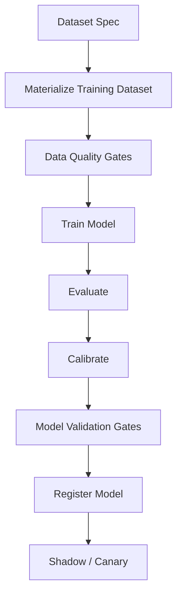
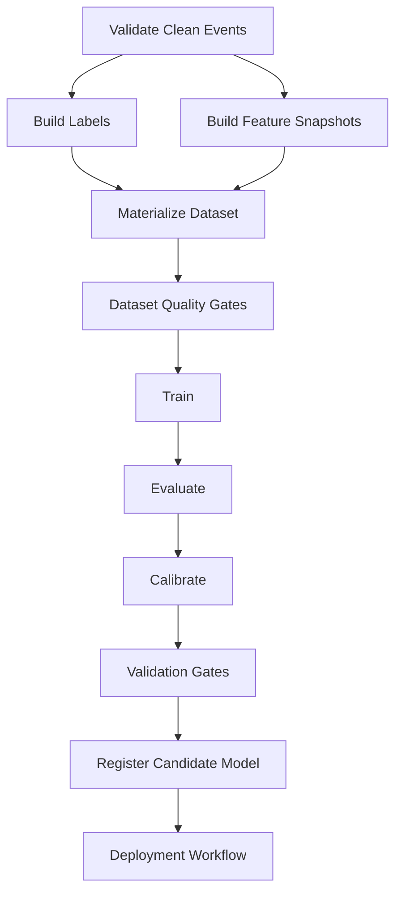

------
title: Build From Scratch Recommendations System - Part 059
description: Mendesain training orchestration dan reproducibility production-grade untuk recommendation system: dataset specs, pipeline DAG, feature snapshots, deterministic runs, experiment tracking, artifacts, metrics, validation gates, reruns, lineage, dan incident recovery.
series: learn-build-from-scratch-recommendations-system
seriesTitle: Build From Scratch: Enterprise Recommendations System
order: 59
partTitle: Training Orchestration and Reproducibility
tags:
  - recommendation-system
  - recsys
  - training-orchestration
  - reproducibility
  - mlops
  - data-engineering
  - series
date: 2026-07-02
---

# Part 059 — Training Orchestration and Reproducibility

Model recommendation yang bagus tidak cukup hanya “berhasil dilatih”.

Production-grade training harus bisa menjawab:

```text
Dataset apa yang dipakai?
Feature versi berapa?
Label definition mana?
Negative sampling policy apa?
Code commit apa?
Container image apa?
Random seed apa?
Hyperparameter apa?
Metric apa?
Kenapa model ini dipromosikan?
Bisakah model ini dilatih ulang?
Apa bedanya dengan model sebelumnya?
Jika ada incident, bisa rollback atau reproduce?
```

Jika jawaban atas pertanyaan tersebut tidak jelas, maka model belum production-ready.

Training orchestration dan reproducibility adalah disiplin untuk membuat training pipeline menjadi reliable, traceable, repeatable, debuggable, dan governed.

Part ini membahas training orchestration dan reproducibility untuk recommendation system production-grade: DAG, dataset specs, feature snapshots, random seed, environment, experiment tracking, artifact lineage, validation gates, reruns, backfills, and incident recovery.

---

## 1. Mental Model: Training Is a Production Pipeline, Not a Notebook

Notebook bagus untuk eksplorasi, tetapi production model harus lahir dari pipeline.

Pipeline training:



Setiap tahap harus:

- versioned,
- logged,
- reproducible,
- observable,
- restartable,
- auditable.

Training pipeline adalah bagian dari production system.

---

## 2. Why Reproducibility Matters

Reproducibility dibutuhkan untuk:

- debugging model regression,
- comparing model versions,
- audit/compliance,
- incident response,
- rollback reasoning,
- scientific iteration,
- onboarding engineer baru,
- validating improvement,
- retraining after data fix.

Tanpa reproducibility:

```text
model improved because why?
model failed because why?
can we rerun it?
which data changed?
```

jawabannya sering “tidak tahu”.

---

## 3. Levels of Reproducibility

### Weak Reproducibility

Bisa melatih model mirip dengan data mirip.

### Strong Reproducibility

Given same code/data/config, output metrics/model sangat mirip atau sama.

### Audit Reproducibility

Bisa menjelaskan lineage dan keputusan promosi meski exact bit-level model tidak identik.

Untuk ML, bit-perfect reproducibility kadang sulit, terutama deep learning/distributed training. Tetapi lineage, config, dataset, environment, dan metric harus reproducible.

---

## 4. Training Orchestrator Responsibilities

Training orchestrator mengelola:

- job scheduling,
- dependency DAG,
- dataset materialization,
- resource allocation,
- retries,
- parameter passing,
- artifact registration,
- metrics collection,
- validation gates,
- notifications,
- reruns/backfills,
- lineage.

It should not hide logic in manual steps.

A human should approve production promotion, but pipeline should compute evidence automatically.

---

## 5. Training DAG

Typical DAG:

```text
validate input data
build labels
build features
materialize dataset
split dataset
train model
evaluate model
calibrate predictions
run validation gates
register model
publish report
```

Mermaid:



---

## 6. Dataset Spec as Source of Truth

Dataset spec defines training data.

Example:

```yaml
dataset_name: home_ranker_dataset
dataset_version: 20260702_001
base_examples:
  source: clean_impressions
  surface: home_feed
  date_range:
    start: 2026-06-01
    end: 2026-07-01
prediction_time: impression_time
feature_set_version: home_ranker_features_v18
labels:
  - click_30m_v3
  - purchase_7d_v2
  - hide_7d_v1
negative_sampling_policy: exposed_no_click_v4
split:
  type: temporal
  train_until: 2026-06-24
  validation_until: 2026-06-28
  test_until: 2026-07-01
```

The dataset spec should be committed/versioned.

---

## 7. Training Config

Training config defines model run.

Example:

```yaml
training_run: home_ranker_train_20260702_001
model_name: home_ranker
model_type: gbdt_pointwise_multi_task
dataset_version: home_ranker_dataset_20260702_001
hyperparameters:
  num_trees: 800
  learning_rate: 0.05
  max_depth: 8
  min_data_in_leaf: 100
random_seed: 42
runtime:
  container_image: recsys-training:20260702
  code_version: git_sha_abc123
resources:
  cpu: 32
  memory_gb: 128
```

Config should be enough to rerun.

---

## 8. Data Snapshot Pinning

Training must pin input data versions.

Bad:

```text
read table latest
```

Good:

```text
read clean_events partition 2026-06-01..2026-07-01 version v5
read feature table snapshot home_features_v18 run 20260702_0000
```

If “latest” changes, rerun changes.

Pin:

- event table versions,
- feature snapshots,
- label versions,
- catalog snapshot,
- identity snapshot,
- policy snapshot,
- negative sampling config.

---

## 9. Feature Snapshot

Feature snapshot metadata:

```yaml
feature_snapshot_id: home_features_v18_20260702_0000
feature_set_version: home_features_v18
generated_at: 2026-07-02T00:00:00Z
source_data:
  clean_events: 20260701_v5
  catalog: catalog_snapshot_20260701
quality_status: passed
```

Dataset builder uses feature snapshot for point-in-time joins.

---

## 10. Label Snapshot

Label snapshot metadata:

```yaml
label_snapshot_id: ranker_labels_20260702_001
labels:
  click_30m: v3
  purchase_7d: v2
  hide_7d: v1
maturity_cutoff: 2026-07-01T00:00:00Z
source_events:
  - clean_clicks_20260701
  - clean_purchases_20260701
quality_status: passed
```

Labels are not “just columns”. They are artifacts.

---

## 11. Negative Sampling Reproducibility

Negative sampling can introduce randomness.

Need record:

- sampling policy version,
- random seed,
- sampling probability,
- candidate universe,
- hard negative source,
- weights.

Example:

```yaml
negative_sampling:
  policy: exposed_no_click_v4
  seed: 20260702
  negatives_per_positive: 5
  hard_negative_sources:
    - generated_not_clicked
    - same_category_unpurchased
```

Without this, training data cannot be reproduced.

---

## 12. Temporal Reproducibility

Temporal split must be deterministic.

Avoid:

```text
random 80/10/10 split
```

Use:

```text
train window
validation window
test window
```

Store boundaries.

Temporal reproducibility lets you compare future model versions against similar recent windows.

---

## 13. Environment Reproducibility

Record environment:

```text
container image
dependency versions
Java/Python versions
native library versions
GPU/CPU type if relevant
distributed training framework version
OS base image
```

For Java-based training/inference:

- JVM version,
- library versions,
- model runtime version,
- serialization format.

Containerize training jobs.

---

## 14. Random Seeds

Record random seeds for:

- data sampling,
- train/validation subsampling,
- model initialization,
- mini-batch ordering,
- negative sampling,
- hyperparameter search.

Example:

```yaml
seeds:
  dataset_sampling: 123
  negative_sampling: 456
  model_init: 789
```

Deep/distributed systems may still be nondeterministic, but seeds reduce variance.

---

## 15. Determinism in Distributed Training

Distributed training may be nondeterministic due to:

- parallel floating-point reduction,
- asynchronous updates,
- non-deterministic GPU kernels,
- data shuffling,
- race conditions.

Set deterministic options where possible, but also track acceptable metric variance.

Reproducibility goal:

```text
same config should produce same quality band
```

not always identical bytes.

---

## 16. Experiment Tracking

Track every training run.

Metadata:

```text
run_id
model_name
dataset_version
feature_set_version
label_versions
code_version
hyperparameters
seeds
start/end time
resources
metrics
artifacts
status
owner
notes
```

Experiment tracker can be custom or platform-based.

The key is discipline.

---

## 17. Hyperparameter Search

Hyperparameter search must be tracked.

For each trial:

- trial ID,
- parameter values,
- dataset version,
- metrics,
- seed,
- artifact if retained.

Avoid selecting best trial from validation and reporting validation as test. Use held-out test.

---

## 18. Model Evaluation Report

Each candidate model should produce report:

```text
global metrics
segment metrics
calibration
feature importance
data quality summary
comparison with champion
latency estimate
model size
known risks
recommendation
```

Report should be attached to model registry.

Promotion should not rely on memory or Slack messages.

---

## 19. Segment Evaluation

Evaluate by:

- new user,
- returning user,
- new item,
- warm item,
- category,
- region,
- device,
- source,
- user activity,
- tenant,
- privacy mode.

Store segment metrics in registry.

A model that improves global metric but hurts new users may be rejected.

---

## 20. Calibration Reproducibility

Calibration artifact must be reproducible.

Record:

```text
calibration method
calibration data window
raw score source
segment scope
parameters
metrics
```

Example:

```yaml
calibration:
  method: platt
  data_window: 2026-06-25..2026-06-28
  segments:
    - surface
    - major_category
  artifact_version: home_calibration_v5
```

---

## 21. Validation Gates

Gates should run automatically.

Examples:

```text
dataset quality gate
feature compatibility gate
metric improvement gate
segment regression gate
calibration gate
latency/model size gate
fairness/exposure gate
privacy gate
```

Gate result should be stored.

Promotion blocked if critical gate fails.

---

## 22. Dataset Quality Gates

Examples:

```text
row_count >= expected_min
label_rate within range
feature_null_rate below threshold
duplicate_rate below threshold
event volume anomaly not severe
train/validation/test time ranges valid
no future feature timestamp
```

Dataset quality failures should prevent training or mark model invalid.

---

## 23. Leakage Tests

Automated leakage checks:

```text
feature_timestamp <= prediction_time
label_time > prediction_time
no post-treatment features
no future catalog state
no random split when temporal required
target leakage feature correlation suspicious
```

Leakage bugs produce models that look amazing offline and fail online.

---

## 24. Feature Compatibility Gates

Before model can register:

```text
all required features defined
all online required features available
types match
defaults defined
privacy class allowed
serving feature assembler supports feature set
```

Feature compatibility gate prevents serving incident.

---

## 25. Latency and Size Gates

Model must fit serving budget.

Check:

```text
artifact size
memory footprint
batch inference latency
feature count
embedding table size
CPU/GPU requirement
startup time
```

A model with great offline NDCG but impossible latency is not production-ready.

---

## 26. Artifact Outputs

Training produces artifacts:

```text
model artifact
feature importance
calibration artifact
metrics report
evaluation report
model card
training logs
prediction samples
schema metadata
```

Each artifact has URI, checksum, version.

Store artifacts immutably.

---

## 27. Checksums

Use checksums for artifact integrity.

```yaml
artifact_uri: ...
sha256: ...
```

Serving should validate checksum before loading if possible.

This helps detect corrupted/incomplete artifacts.

---

## 28. Re-run Policy

When can we rerun same training?

Cases:

- transient infrastructure failure,
- data bug fixed,
- dependency patch,
- audit reproduction,
- model comparison.

Rerun should use same config and pinned inputs unless intentionally changed.

If inputs changed, version must change.

---

## 29. Backfill Training

When feature/label bug fixed, backfill dataset and retrain.

Procedure:

1. identify affected time range,
2. create new feature/label version,
3. backfill historical values,
4. materialize new dataset version,
5. retrain,
6. compare with previous,
7. decide promotion,
8. annotate incident.

Do not silently overwrite old training dataset.

---

## 30. Reproducible Model Comparison

Compare candidate to champion with:

- same test window,
- same metric definitions,
- same candidate universe if possible,
- same evaluation code version.

If test data differs, comparison is less clear.

Store champion baseline metrics in report.

---

## 31. Evaluation Code Versioning

Metric code changes can alter results.

Record:

```text
evaluation_code_version
metric_definition_version
```

Example:

```text
NDCG implementation changed tie handling
```

This can change reported metric.

Metric definitions are artifacts too.

---

## 32. Training Data Access and Security

Training data may contain sensitive behavior.

Controls:

- access control,
- tenant isolation,
- encrypted storage,
- limited retention,
- PII minimization,
- audit logs,
- approved training purposes.

Training orchestration should not dump sensitive data into unrestricted temp paths.

---

## 33. Privacy-Aware Training

If user opts out/deleted:

- exclude from future training if required,
- remove personal features,
- handle deletion requests,
- log compliance.

Dataset builder should implement privacy filters as versioned rules.

Privacy violations can be hidden in offline pipelines; monitor.

---

## 34. Multi-Tenant Training

Options:

- global shared model,
- tenant-specific model,
- tenant-specific calibration,
- federated/isolated training if needed.

Training config must specify tenant scope:

```yaml
tenant_scope:
  mode: shared
  excluded_tenants: [...]
```

or:

```yaml
tenant_scope:
  mode: single_tenant
  tenant_id: tenant_123
```

Avoid accidental cross-tenant data usage.

---

## 35. Training Resource Management

Training jobs can be expensive.

Manage:

- CPU/GPU,
- memory,
- cluster quota,
- priority,
- retry policy,
- checkpointing,
- cost reporting.

Recommendation training can involve billions of examples.

Resource planning is part of MLOps.

---

## 36. Checkpointing

For long training jobs, checkpoint:

```text
model state
optimizer state
epoch/step
random state
metrics so far
```

Checkpoint enables resume after failure.

Checkpoint metadata should include config and dataset version.

---

## 37. Retry Semantics

Retries can cause duplicate artifacts if not designed.

Use:

```text
run_id
attempt_id
artifact path includes attempt
final publish only after success
```

Avoid partial failed artifacts becoming registered model.

---

## 38. Job Idempotency

If same DAG step reruns, output should be deterministic or versioned.

Example:

```text
dataset materialization output path includes dataset_version
```

If output exists and checksum matches, skip or reuse.

If output differs, fail or create new version.

---

## 39. Promotion Is Separate from Training

Training creates candidate model.

Promotion is separate workflow.

Why?

- training may be automated,
- promotion requires gates/approval,
- shadow/canary needed,
- product timing matters.

Do not auto-promote every successful training run.

---

## 40. Training Schedule

Schedule based on:

- data freshness,
- model drift,
- business cycle,
- cost,
- label maturity,
- deployment capacity.

Examples:

```text
ranker training daily with 7d purchase maturity
retrieval model weekly
calibration daily
item embeddings daily + delta nearline
```

Schedule must respect label maturity.

---

## 41. Incident Recovery

If production model bad:

1. identify model version.
2. get training run metadata.
3. inspect dataset/feature/label versions.
4. compare metrics/gates.
5. rollback route if needed.
6. reproduce training/evaluation.
7. find data/model/pipeline issue.
8. add new gate/test.

Training reproducibility makes this possible.

---

## 42. Training Observability

Monitor:

```text
DAG success/failure
step runtime
data volume
quality gate failures
training duration
resource usage
metric trends
artifact registration failures
retrain freshness
```

Alerts:

- scheduled training missed,
- dataset quality failed,
- metric regression,
- model registry update failed,
- calibration failed.

---

## 43. Model Quality Trend

Track metrics over training runs.

Examples:

```text
NDCG over time
AUC over time
calibration ECE over time
new_user segment over time
feature null rate over time
training data row count
```

Sudden jump/drop needs investigation.

---

## 44. Human Review

For important models, review:

- report,
- segment metrics,
- guardrails,
- known risks,
- diff vs champion,
- deployment plan.

Review decision should be recorded.

This is especially important for enterprise/high-stakes domains.

---

## 45. Common Failure Modes

### 45.1 Notebook Model Shipped

No lineage or reproducibility.

### 45.2 Dataset Reads Latest

Rerun changes unexpectedly.

### 45.3 Feature Leakage

Offline metrics inflated.

### 45.4 Label Maturity Ignored

Delayed outcomes mislabeled.

### 45.5 Negative Sampling Not Versioned

Training irreproducible.

### 45.6 Evaluation Code Changed Silently

Metric comparison invalid.

### 45.7 No Segment Gates

Global improvement hides harm.

### 45.8 Auto-Promote After Training

Bad model ships.

### 45.9 Retry Publishes Partial Artifact

Serving loads corrupted model.

### 45.10 No Incident Lineage

Root cause impossible.

---

## 46. Implementation Sketch: Training Run Metadata

```java
public record TrainingRunMetadata(
    String runId,
    String modelName,
    String datasetVersion,
    String featureSetVersion,
    Map<String, String> labelVersions,
    String negativeSamplingPolicyVersion,
    String codeVersion,
    String containerImage,
    Map<String, Object> hyperparameters,
    Map<String, Long> randomSeeds,
    Instant startedAt,
    Instant finishedAt,
    TrainingStatus status
) {}
```

This should be emitted automatically.

---

## 47. Implementation Sketch: Dataset Spec

```java
public record DatasetSpec(
    String datasetName,
    String datasetVersion,
    String baseTable,
    Instant startTime,
    Instant endTime,
    String predictionTimeColumn,
    String featureSetVersion,
    List<String> labelVersions,
    String negativeSamplingPolicyVersion,
    TemporalSplit split
) {}
```

Dataset spec should be serialized and stored with output artifact.

---

## 48. Implementation Sketch: Validation Gate Runner

```java
public final class ValidationGateRunner {
    private final List<ValidationGate> gates;

    public ValidationReport run(TrainingArtifact artifact) {
        List<GateResult> results = new ArrayList<>();

        for (ValidationGate gate : gates) {
            results.add(gate.evaluate(artifact));
        }

        boolean passed = results.stream().allMatch(GateResult::passed);
        return new ValidationReport(passed, results);
    }
}
```

Gate results go to model registry.

---

## 49. Minimal Production Training Orchestration Plan

Start with:

```yaml
orchestration:
  dag: dataset -> train -> evaluate -> calibrate -> register
dataset:
  spec_versioned: true
  point_in_time_join: true
  quality_gates: true
training:
  config_versioned: true
  container_image_pinned: true
  code_version_recorded: true
  random_seeds_recorded: true
tracking:
  run_metadata: true
  metrics: true
  artifacts: immutable
validation:
  offline_metric_gate: true
  segment_gate: true
  feature_compatibility_gate: true
  latency_gate: true
promotion:
  separate_from_training: true
  approval_required: true
```

This is enough to move from notebook ML to production ML.

---

## 50. Checklist Training Orchestration and Reproducibility Readiness

```text
[ ] Training runs are orchestrated, not manual notebooks.
[ ] Dataset spec is versioned.
[ ] Input data snapshots are pinned.
[ ] Feature snapshot/version is recorded.
[ ] Label versions and maturity windows are recorded.
[ ] Negative sampling policy and seed are recorded.
[ ] Temporal split is deterministic.
[ ] Code/container/dependencies are recorded.
[ ] Random seeds are recorded.
[ ] Experiment tracking stores metrics/artifacts.
[ ] Evaluation code version is recorded.
[ ] Data quality gates exist.
[ ] Leakage tests exist.
[ ] Segment evaluation gates exist.
[ ] Calibration artifact is versioned.
[ ] Model artifact has checksum.
[ ] Training and promotion are separate workflows.
[ ] Rerun/backfill policy exists.
[ ] Privacy/tenant scope is explicit.
[ ] Incident recovery can trace model lineage.
```

---

## 51. Kesimpulan

Training orchestration dan reproducibility membuat model recommendation bisa dipercaya, diulang, dibandingkan, dan diaudit.

Prinsip utama:

1. Training is a production pipeline, not a notebook.
2. Dataset spec is the source of truth.
3. Pin input data, feature snapshots, labels, and code versions.
4. Negative sampling and random seeds must be recorded.
5. Point-in-time joins and leakage tests are mandatory.
6. Evaluation reports need global and segment metrics.
7. Validation gates should block bad models.
8. Training output artifacts should be immutable and checksummed.
9. Promotion is separate from successful training.
10. Reproducibility is essential for incident response and governance.

Di Part 060, kita akan membahas **Batch Scoring and Precomputed Recommendations**: bagaimana menghasilkan recommendation lists offline untuk email, push, low-latency fallback, digest, and enterprise workflows tanpa mengorbankan freshness, safety, dan observability.
