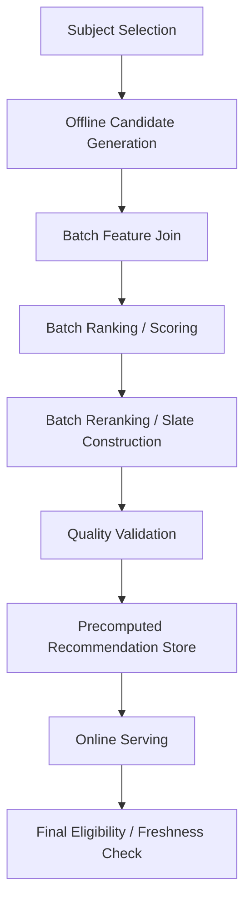
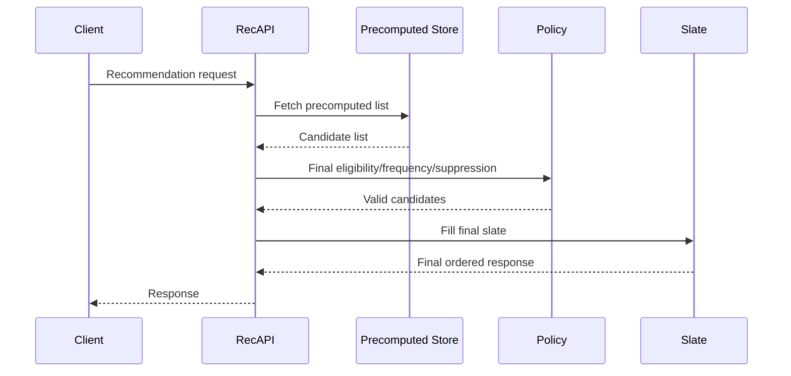

------
title: Build From Scratch Recommendations System - Part 060
description: Mendesain batch scoring dan precomputed recommendations production-grade: offline candidate generation, batch ranking, slate generation, serving store, TTL, freshness, invalidation, final online checks, email/push/digest, fallback lists, metrics, dan operational trade-offs.
series: learn-build-from-scratch-recommendations-system
seriesTitle: Build From Scratch: Enterprise Recommendations System
order: 60
partTitle: Batch Scoring and Precomputed Recommendations
tags:
  - recommendation-system
  - recsys
  - batch-scoring
  - precomputed-recommendations
  - offline-pipeline
  - serving
  - series
date: 2026-07-02
---

# Part 060 — Batch Scoring and Precomputed Recommendations

Tidak semua rekomendasi harus dihitung real-time.

Banyak use case lebih cocok dihitung batch/offline:

- email recommendations,
- push notifications,
- daily/weekly digest,
- home feed fallback,
- onboarding list,
- low-latency surfaces,
- enterprise daily action queue,
- cached recommendations for high-QPS users,
- recommendations for anonymous/general traffic,
- expensive deep model scoring,
- offline re-ranking with heavy features.

Batch scoring menghasilkan **precomputed recommendations**: daftar item/action/document yang sudah diranking sebelumnya dan disimpan untuk serving cepat.

Namun precomputed lists punya risiko:

- stale,
- item sudah tidak eligible,
- stock/policy berubah,
- user sudah melihat/membeli item,
- suppression belum diterapkan,
- model/policy version outdated,
- tidak responsif terhadap session intent,
- sulit di-debug jika tidak ada lineage.

Part ini membahas batch scoring dan precomputed recommendations production-grade: pipeline, serving store, TTL, freshness, invalidation, final online checks, email/push/digest, fallback lists, metrics, and operational trade-offs.

---

## 1. Mental Model: Batch Scoring Trades Freshness for Cost and Latency

Online scoring:

```text
fresh context, higher latency/cost
```

Batch scoring:

```text
precomputed, low latency, potentially stale
```

Precomputed recommendations are useful when:

- recommendation can be computed ahead of time,
- latency budget tight,
- scoring expensive,
- surface is scheduled,
- user context changes slowly,
- fallback needed,
- same list reused.

But final online validation remains necessary.

---

## 2. Batch Scoring Use Cases

### Email

Daily/weekly personalized recommendations.

### Push

Candidate selection for notification.

### Digest

Top items/actions/documents summarized periodically.

### Fallback

If online personalized pipeline fails.

### Low-Latency Home

Serve cached top-N then online rerank/validate.

### Enterprise Queue

Daily prioritized actions/documents per actor/team.

### Expensive Model

Run deep ranker offline for large candidate set.

### Non-Personalized Lists

Popular/trending/editorial by region/category.

---

## 3. Batch Scoring Architecture



Batch pipeline should resemble online pipeline conceptually, but use offline data and higher compute budget.

---

## 4. Subject Selection

First decide who/what to score.

Subjects:

```text
user_id
anonymous segment
tenant actor
account
case_id
region/category segment
email subscriber
push-eligible user
```

Selection criteria:

```text
active users
users with consent
users not unsubscribed
users with enough profile
enterprise actors assigned to cases
segments needing fallback lists
```

Do not score users who cannot receive recommendations due to consent/policy.

---

## 5. Batch Candidate Generation

Offline candidate generation can be richer.

Sources:

```text
two_tower retrieval
item-to-item
content-based
trending
editorial
new item exploration
graph neighbors
long-tail quality
enterprise policy/action candidates
```

Because batch is not strict milliseconds, it can:

- generate more candidates,
- run expensive sources,
- use broader retrieval,
- dedup thoroughly,
- compute additional features.

Still preserve provenance.

---

## 6. Batch Candidate Count

Batch can score thousands per subject.

Example:

```text
candidate pool per user: 5000
batch rank top 500
store top 100
online serve top 20 after final check
```

Be mindful:

```text
subjects * candidates
```

If 10 million users × 5000 candidates = 50 billion candidate rows.

Use budgets and segmentation.

---

## 7. Batch Feature Join

Batch scoring uses offline feature store.

Features should be as-of scoring time:

```text
score_time
feature_timestamp <= score_time
```

Need:

- user features,
- item features,
- cross features,
- source features,
- frequency/exposure features,
- suppression/purchase state,
- context/surface features.

For email/push, context may include scheduled send time.

---

## 8. Batch Ranking

Use same model bundle as online when possible.

Inputs:

```text
candidate rows
feature set
model version
calibration
utility policy
```

Output:

```text
scored candidates
predictions
score components
```

Record:

```text
model_version
feature_set_version
utility_policy_version
score_time
```

Batch scoring should not be an untracked separate model world.

---

## 9. Batch Reranking / Slate Construction

Batch pipeline can apply slate policy.

Examples:

- max same category,
- no duplicates,
- max same creator,
- exploration slots,
- sponsored caps,
- email layout constraints,
- enterprise required actions.

But online final slate may need additional validation.

Store more than final visible count.

Example:

```text
store top 100 so online can replace stale/invalid items
```

---

## 10. Precomputed Store

Key design:

```text
subject_id + surface + context_key
```

Value:

```json
{
  "list_id": "precomp_home_u123_20260702",
  "subject_id": "u123",
  "surface": "home_feed",
  "generated_at": "2026-07-02T01:00:00Z",
  "expires_at": "2026-07-02T07:00:00Z",
  "model_version": "home_ranker_20260702_001",
  "policy_version": "home_slate_v7",
  "items": [
    {
      "item_id": "item_1",
      "score": 0.83,
      "position": 1,
      "reason_codes": ["category_affinity"],
      "source_provenance": ["two_tower"]
    }
  ]
}
```

Store metadata with list.

---

## 11. Store Top More Than Needed

If online response needs 20, store maybe 100.

Why?

At serving time some items may be:

- out of stock,
- deleted,
- hidden,
- already seen,
- not available in region,
- policy-banned,
- frequency-capped.

Online can skip invalid and fill from deeper list.

If stored list too short, stale items cause empty slate.

---

## 12. TTL and Freshness

Precomputed list needs TTL.

Example:

```yaml
home_feed_precompute:
  ttl: 6h
email_daily:
  ttl: 24h
push_candidate:
  ttl: 2h
enterprise_action_queue:
  ttl: 1h
fallback_popular:
  ttl: 30m
```

TTL depends on:

- catalog volatility,
- user behavior volatility,
- surface risk,
- send schedule,
- policy freshness.

Serving should check `expires_at`.

---

## 13. Final Online Eligibility Check

Precomputed recommendations are never blindly served.

Before response:

```text
item active?
policy approved?
region available?
tenant allowed?
not blocked?
not purchased/consumed?
frequency cap ok?
stock ok if relevant?
sponsored/campaign still active?
```

Final online check prevents stale bad recommendations.

For critical surfaces, final check is mandatory.

---

## 14. Invalidation

Some changes should invalidate precomputed lists.

Triggers:

```text
item deleted/banned
policy state changed
stock unavailable
price changed significantly
user hides item/creator
consent revoked
tenant permission changed
campaign expired
case state changed
```

Invalidation approaches:

- full list TTL only,
- item tombstone at serving,
- per-subject invalidation,
- event-driven recompute,
- background cleanup.

For critical policy, use tombstone/final filter immediately.

---

## 15. Stale List Degradation

If list expired:

Options:

```text
serve stale with final check if allowed
fallback to fresh non-personalized
trigger async refresh
run online scoring
return empty safe response
```

Policy by surface.

Email/push should usually not send stale high-risk content.

Home feed fallback may serve slightly stale safe popular list.

---

## 16. Batch + Online Hybrid

Hybrid pattern:

```text
batch precompute candidate shortlist
online rerank with fresh context
```

Flow:

1. batch stores top 500 candidates per user.
2. online fetches shortlist.
3. online filters/fetches fresh features.
4. online reranks final 20.

This reduces candidate generation cost while preserving freshness.

---

## 17. Precomputed Candidate Pool vs Precomputed Final Slate

Two storage modes:

### Candidate Pool

Stores candidate IDs, not final order.

Online ranks/reranks.

Pros:

- more fresh.
- flexible.

Cons:

- online ranking cost remains.

### Final Slate

Stores ordered list.

Pros:

- very low latency.

Cons:

- stale and less contextual.

Choose per surface.

---

## 18. Email Recommendations

Email is naturally batch.

Pipeline:

```text
select eligible subscribers
generate candidates
rank/rerank for email layout
apply frequency/channel policy
render or store item IDs
send at scheduled time
log email decision
log opens/clicks
```

Special rules:

- unsubscribe,
- quiet hours,
- send frequency cap,
- content freshness,
- no sold-out items,
- high confidence first item.

Email can harm trust if stale/irrelevant.

---

## 19. Push Recommendations

Push is higher risk.

Requirements:

- strong relevance,
- strict frequency cap,
- time sensitivity,
- current eligibility,
- user notification preference,
- quiet hours,
- no sensitive content if policy disallows.

Batch can generate push candidates, but final send should validate context and timing.

Do not send push solely because batch list exists.

---

## 20. Daily/Weekly Digest

Digest recommendations may include:

- top content,
- new items,
- required enterprise tasks,
- summary of activity,
- recommended documents.

Batch pipeline can generate and summarize.

For LLM-generated digest summaries:

- use grounded items,
- validate,
- avoid hallucination,
- log prompt/model versions.

Digest is a good LLM augmentation use case if controlled.

---

## 21. Enterprise Batch Scoring

Enterprise examples:

```text
daily prioritized case actions per analyst
recommended policy documents per team
weekly knowledge digest
SLA risk action list
```

Must respect:

- tenant,
- role,
- permission,
- case state,
- policy version,
- auditability,
- final validation at open time.

Case state can change quickly. Final online check is essential.

---

## 22. Fallback Lists

Fallback lists:

```text
popular_by_region
trending_by_category
editorial_safe
new_user_default
tenant_default_actions
safe_knowledge_docs
```

Generated batch/nearline.

Fallback list should include:

- generated_at,
- policy version,
- eligibility scope,
- TTL,
- reason.

Fallback is production feature, not afterthought.

---

## 23. Non-Personalized Precomputed Lists

For privacy/contextual-only mode:

```text
popular/trending by region/category/surface
editorial lists
fresh high-quality items
tenant-approved defaults
```

Do not include user behavior.

Useful for:

- anonymous users,
- no consent users,
- fallback,
- cold-start.

---

## 24. Batch Scoring and Exploration

Batch can precompute exploration candidates.

But exploration selection needs propensity if randomized.

Options:

- precompute exploration pool, randomize online,
- precompute sampled exploration with logged policy,
- allocate exposure budget in batch.

If batch selects random candidate, log seed and propensity.

---

## 25. Batch Scoring and Frequency

Batch list may become invalid due to frequency caps.

Example:

```text
item in precomputed top 10 already shown twice today
```

Online serving should apply frequency state.

Batch can include exposure features as-of generation time, but online exposure changes afterward.

---

## 26. Batch Scoring and User Controls

If user hides item after list generated, online serving must suppress it.

Explicit user controls should override precomputed list.

This requires:

- final suppression check,
- list filtering,
- maybe async recompute.

User should not keep seeing hidden items because list is cached.

---

## 27. Batch Scoring Lineage

Each list should know:

```text
pipeline_run_id
model_version
feature_set_version
candidate_policy_version
slate_policy_version
generated_at
source_data_snapshot
```

Lineage helps debug:

```text
why did user receive this email item?
```

---

## 28. Batch Decision Log

Batch scoring should emit decision logs too.

For email/push/digest:

```text
subject
candidate set
selected items
model/policy versions
scheduled send time
actual send time
tracking tokens
```

When user clicks email later, you need attribution.

---

## 29. Serving Precomputed Lists

Online flow:



Even precomputed serving has policy/final validation.

---

## 30. Online Fill from Precomputed List

Algorithm:

```text
fetch list top 100
iterate in order
skip invalid/stale/suppressed
add until final size
if insufficient:
  append fallback list or online candidates
```

This is simple and robust.

---

## 31. Store Schema

Example table:

```text
subject_id
surface
context_key
list_version
generated_at
expires_at
model_version
policy_version
items_json_or_array
status
```

For large scale, items may be stored separately/compressed.

Key should support fast lookup.

---

## 32. Context Key

Precomputed list can depend on context.

Examples:

```text
surface
region
locale
tenant
category
case_id
email_campaign
device_class
```

Key:

```text
user_id:home_feed:region_ID
```

For enterprise:

```text
tenant_id:actor_id:case_id:next_actions
```

Do not use one generic list for incompatible contexts.

---

## 33. List Versioning

List version changes when regenerated.

```text
list_id: home_u123_20260702_0600
```

Response logs list ID.

If user complains, you can inspect exact list.

---

## 34. Precomputed Store Latency

Serving store should be low latency.

Requirements:

- key lookup p95,
- high availability,
- TTL support,
- batch fetch if multiple modules,
- compression/decompression efficient,
- regionally replicated if needed.

If store fails, fallback to online or default lists.

---

## 35. Batch Scoring Scale

Compute size:

```text
subjects * candidates per subject
```

Example:

```text
5M users * 2000 candidates = 10B candidate rows
```

Strategies:

- segment users,
- score active users only,
- candidate cap,
- approximate prefilter,
- distributed processing,
- incremental scoring,
- reuse candidate pools,
- only score surfaces needing batch.

Batch scoring can be expensive.

---

## 36. Incremental Batch Scoring

Instead of recomputing all lists:

- score active users,
- score changed users/items,
- score users with expired lists,
- update lists affected by item/policy change,
- prioritize high-traffic users.

Need dependency tracking:

```text
which lists contain item X?
```

or use online tombstone and periodic refresh.

---

## 37. Batch Scoring Freshness Strategy

Options:

### Full Refresh

All lists regenerated periodically.

### Incremental Refresh

Only changed subjects/items.

### Hybrid

Daily full + hourly incremental.

Example:

```yaml
home_precompute:
  full_refresh: daily
  incremental_refresh: hourly_for_active_users
  online_final_check: always
```

---

## 38. Quality Validation for Batch Lists

Before publishing:

```text
coverage
list length
invalid item rate
duplicate rate
policy violation rate
score distribution
category/source distribution
freshness
empty list rate
```

If validation fails, do not publish new batch. Keep previous safe version if still valid.

---

## 39. Publishing Precomputed Lists

Use atomic publish.

Bad:

```text
overwrite serving store while pipeline still writing
```

Good:

```text
write new version
validate
switch active pointer/partition
keep previous
```

For per-user key-value stores, atomicity can be per list, but pipeline-level status still matters.

---

## 40. Rollback

If batch lists bad:

- switch to previous list version if not expired/unsafe,
- use fallback lists,
- disable affected campaign/surface,
- force online scoring if available,
- mark bad run invalid.

Batch run should be versioned to rollback.

---

## 41. Metrics

Monitor:

```text
batch run success/failure
subjects scored
average list length
empty list rate
invalid item rate
duplicate rate
precomputed store hit rate
stale list rate
online final filter rejection rate
fallback after precompute rate
email/push CTR/CVR/unsubscribe
latency
```

By surface, region, tenant, model version.

---

## 42. Online Filter Rejection Rate

Important metric:

```text
how many precomputed items were removed at serving time?
```

High rejection means batch stale or poor.

Reasons:

- out of stock,
- seen recently,
- suppressed,
- policy changed,
- tenant permission,
- expired campaign.

Track rejection by reason.

---

## 43. Precomputed vs Online A/B

Compare:

- fully online,
- precomputed final slate,
- precomputed candidate pool + online rerank,
- fallback list.

Metrics:

- latency,
- cost,
- relevance,
- freshness,
- negative feedback,
- conversion,
- empty slate.

Hybrid often wins.

---

## 44. Batch Scoring for Expensive Deep Models

If deep ranker too expensive online:

```text
batch score large candidate set daily
online rerank/final-check using cheap model/features
```

Caution:

- user session intent missing,
- fresh item changes missing,
- online context ignored.

Use for surfaces where context stable.

---

## 45. Batch Scoring with Fresh Overlays

Combine precomputed list with fresh sources.

Example:

```text
80% precomputed personalized
20% fresh trending/session candidates
```

Online reranker merges:

- precomputed candidates,
- session candidates,
- fresh new items,
- required actions.

This balances latency and freshness.

---

## 46. Common Failure Modes

### 46.1 Serving Stale Invalid Items

No final check.

### 46.2 List Too Short

Final filters empty the slate.

### 46.3 No TTL

Old recommendations persist.

### 46.4 User Hide Ignored

Cached list does not respect controls.

### 46.5 Campaign Expired But Still Sent

Business/policy issue.

### 46.6 Batch Run Overwrites Good Lists

No validation/atomic publish.

### 46.7 No Lineage

Cannot explain email recommendation.

### 46.8 Batch Score Uses Different Model Semantics

Online/offline mismatch.

### 46.9 Cost Explosion

Too many users × candidates.

### 46.10 Precompute Over-Personalizes Slowly Changing User

Session intent ignored.

---

## 47. Implementation Sketch: Precomputed List

```java
public record PrecomputedRecommendationList(
    String listId,
    String subjectId,
    String surface,
    String contextKey,
    Instant generatedAt,
    Instant expiresAt,
    String modelVersion,
    String featureSetVersion,
    String candidatePolicyVersion,
    String slatePolicyVersion,
    List<PrecomputedRecommendationItem> items
) {}

public record PrecomputedRecommendationItem(
    String itemId,
    String itemType,
    double score,
    int originalPosition,
    List<String> sourceProvenance,
    List<String> reasonCodes
) {}
```

Store metadata with items.

---

## 48. Implementation Sketch: Serving from Precomputed List

```java
public final class PrecomputedRecommendationProvider {
    private final PrecomputedStore store;
    private final EligibilityService eligibilityService;
    private final FallbackProvider fallbackProvider;

    public List<RecommendationItem> get(
        Subject subject,
        RequestContext context,
        int limit
    ) {
        Optional<PrecomputedRecommendationList> list = store.get(subject, context.surface());

        if (list.isEmpty() || list.get().expiresAt().isBefore(context.requestTime())) {
            return fallbackProvider.get(context, limit);
        }

        List<String> candidateIds = list.get().items().stream()
            .map(PrecomputedRecommendationItem::itemId)
            .toList();

        EligibilityResult eligibility = eligibilityService.batchCheck(subject, context, candidateIds);

        List<RecommendationItem> result = new ArrayList<>();
        for (PrecomputedRecommendationItem item : list.get().items()) {
            if (eligibility.isEligible(item.itemId())) {
                result.add(RecommendationItem.from(item));
            }
            if (result.size() == limit) {
                break;
            }
        }

        if (result.size() < limit) {
            result.addAll(fallbackProvider.get(context, limit - result.size()));
        }

        return result;
    }
}
```

Real implementation should preserve tracking and diagnostics.

---

## 49. Minimal Production Batch Scoring Plan

Start with:

```yaml
batch_surfaces:
  - email_daily
  - home_fallback
  - non_personalized_popular
pipeline:
  subject_selection: consent_filtered
  candidate_generation: multi_source
  batch_ranking: model_bundle_versioned
  batch_reranking: slate_policy_versioned
  validation: required
  atomic_publish: true
store:
  top_items_stored: 100
  final_online_check: true
  ttl: surface_specific
observability:
  store_hit_rate: true
  stale_rate: true
  final_filter_rejection_rate: true
  empty_list_rate: true
  lineage: true
fallback:
  safe_default_lists: true
```

Then evolve to hybrid online reranking and incremental refresh.

---

## 50. Checklist Batch Scoring and Precomputed Recommendations Readiness

```text
[ ] Batch use case is justified by latency/cost/schedule.
[ ] Subject selection respects consent and eligibility.
[ ] Candidate generation preserves provenance.
[ ] Batch model bundle is versioned.
[ ] Feature snapshot and score time are recorded.
[ ] Slate policy is versioned.
[ ] Stored list includes generated_at/expires_at.
[ ] Stored list includes model/policy/feature versions.
[ ] More items are stored than final display count.
[ ] Final online eligibility/suppression/frequency check exists.
[ ] TTL policy exists by surface.
[ ] Invalidation/tombstone strategy exists.
[ ] Atomic publish or safe rollout exists.
[ ] Rollback/fallback list exists.
[ ] Decision logs exist for batch-generated recommendations.
[ ] Store hit/stale/rejection/empty metrics are monitored.
[ ] Email/push channel policies are enforced.
[ ] Enterprise tenant/permission final checks exist if applicable.
```

---

## 51. Kesimpulan

Batch scoring dan precomputed recommendations adalah alat penting untuk mengurangi latency/cost dan mendukung scheduled surfaces seperti email, push, digest, fallback, and enterprise queues.

Prinsip utama:

1. Batch scoring trades freshness for cost and latency.
2. Precomputed lists must carry lineage: model, feature, policy, generated time.
3. Store more items than final slate needs.
4. TTL is mandatory.
5. Final online eligibility/suppression/frequency check is mandatory.
6. User controls and policy changes must override cached lists.
7. Batch pipelines need validation and atomic publish.
8. Fallback lists are production artifacts, not emergency hacks.
9. Hybrid precomputed candidate pool + online rerank often balances quality and latency.
10. Monitor stale rate, final filter rejection, empty list, and batch lineage.

Di Part 061, kita akan membahas **Low-Latency Serving and Cache Strategy**: bagaimana mendesain caching, batching, request collapsing, prefetch, local cache, distributed cache, timeout, and degradation untuk memenuhi latency SLO recommendation serving.
