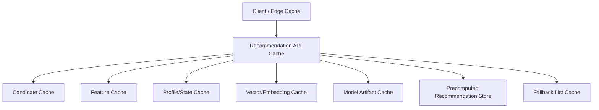

------
title: Build From Scratch Recommendations System - Part 061
description: Mendesain low-latency serving dan cache strategy production-grade untuk recommendation system: latency budget, cache layers, local/distributed cache, feature cache, candidate cache, model cache, prefetch, request collapsing, batching, invalidation, TTL, consistency, and observability.
series: learn-build-from-scratch-recommendations-system
seriesTitle: Build From Scratch: Enterprise Recommendations System
order: 61
partTitle: Low-Latency Serving and Cache Strategy
tags:
  - recommendation-system
  - recsys
  - low-latency
  - caching
  - serving
  - performance
  - series
date: 2026-07-02
---

# Part 061 — Low-Latency Serving and Cache Strategy

Recommendation system production-grade harus memberi rekomendasi yang baik **dan** cepat.

Sistem yang sangat akurat tetapi lambat akan merusak product experience.  
Sistem yang cepat tetapi stale/invalid akan merusak trust.  
Sistem yang cache-heavy tetapi tidak punya invalidation akan menampilkan item yang sudah out-of-stock, banned, blocked, atau sudah dibeli.  
Sistem yang tidak cache sama sekali akan mahal dan sulit memenuhi SLO.

Low-latency serving adalah seni mengatur trade-off antara:

```text
freshness
quality
cost
latency
consistency
safety
availability
```

Part ini membahas strategi low-latency serving dan caching untuk recommendation system production-grade: latency budget, cache layers, local/distributed cache, feature cache, candidate cache, precomputed recommendations, request collapsing, batching, invalidation, TTL, consistency, warmup, observability, dan failure modes.

---

## 1. Mental Model: Latency Is a Product Feature

Recommendation latency memengaruhi:

- page load,
- feed scroll,
- conversion,
- user trust,
- service cost,
- timeout rate,
- fallback rate.

A recommendation system is useful only if it responds within product deadline.

```text
best safe recommendation within budget
```

Bukan:

```text
best theoretical recommendation regardless of latency
```

Latency harus didesain, bukan dioptimalkan belakangan.

---

## 2. Latency Budget

Example budget:

```text
Total p95 target: 200ms

API validation/config:         5ms
Experiment assignment:         5ms
Candidate generation:         55ms
Eligibility/filtering:        25ms
Feature fetch/assembly:       35ms
Model inference:              25ms
Reranking/slate:              15ms
Response assembly:             5ms
Logging enqueue:               5ms
Buffer:                       25ms
```

Budget harus dipecah per stage.

Kalau tidak, semua dependency akan menganggap dirinya boleh memakai seluruh 200ms.

---

## 3. p50 vs p95 vs p99

Mean latency tidak cukup.

Metrics:

```text
p50: normal experience
p95: common tail
p99: severe tail
max: incident clue
```

Recommendation systems sering gagal di p95/p99 karena:

- candidate source timeout,
- feature store hot key,
- model inference spike,
- cache miss burst,
- GC pause,
- network dependency,
- large candidate pool,
- debug/shadow overload.

Optimize tail latency.

---

## 4. Cache Layers

Cache can exist at many layers:



Different layer has different TTL and invalidation rules.

Do not use one cache policy for all data.

---

## 5. What Can Be Cached?

Common cacheable data:

```text
surface config
experiment config
model route
model artifact
rule bundle
slate policy
item static metadata
item features
creator/seller features
popular/trending lists
candidate source results
precomputed recommendation lists
fallback lists
embeddings
ANN search results for common queries
non-personalized results
```

Harder to cache:

```text
current session intent
explicit suppression
permission/consent
stock for checkout
case state
real-time frequency
```

Critical state may need fresh lookup.

---

## 6. Cache Safety Classification

Classify cached data by risk.

### Low-Risk Cache

```text
surface config
model metadata
static item category
editorial fallback list with final check
```

### Medium-Risk Cache

```text
item quality score
popular list
user profile snapshot
candidate source result
```

### High-Risk Cache

```text
permission
consent
policy state
stock/availability
user block/suppression
enterprise case state
```

High-risk cached values require short TTL, final check, or source-of-truth validation.

---

## 7. Cache Key Design

Cache key must include all dimensions that affect value.

Example candidate cache key:

```text
surface:user_id:region:locale:privacy_mode:candidate_policy_version
```

If missing region, user may see unavailable items.

If missing policy version, old behavior persists.

If missing privacy mode, non-personalized user may get personalized result.

Cache key correctness is more important than cache hit rate.

---

## 8. Cache Versioning

Include versions in cache key.

Examples:

```text
model_route_version
feature_set_version
candidate_policy_version
rule_bundle_version
slate_policy_version
embedding_version
index_version
```

When version changes, old cache naturally misses.

This avoids complex invalidation for config/model changes.

---

## 9. TTL Strategy

TTL depends on data volatility and risk.

Examples:

```yaml
surface_config: 5m
experiment_config: 1m
model_route: 30s
item_static_metadata: 6h
item_behavior_features: 30m
trending_list: 5m
candidate_cache_personalized: 1m
non_personalized_popular: 5m
fallback_list: 10m
suppression_state: no_cache_or_seconds
consent_state: no_cache_or_strong
```

Short TTL reduces staleness but increases load.

---

## 10. Local Cache vs Distributed Cache

### Local Cache

In process memory.

Pros:

- very fast,
- no network,
- good for config/model metadata/static items.

Cons:

- per-instance inconsistency,
- memory pressure,
- invalidation harder.

### Distributed Cache

Redis/Memcached/managed KV.

Pros:

- shared across instances,
- larger,
- centralized TTL.

Cons:

- network latency,
- extra dependency,
- hot keys.

Often use both.

---

## 11. Cache Aside Pattern

Common pattern:

```text
read cache
if miss:
  read source
  write cache
return
```

Pseudocode:

```java
Value value = cache.get(key);
if (value == null) {
    value = source.load(key);
    cache.put(key, value, ttl);
}
return value;
```

Need protection against cache stampede.

---

## 12. Read-Through / Write-Through

Alternative:

- read-through: cache automatically loads from source,
- write-through: writes update cache and source.

For RecSys, many features are materialized by pipelines, so cache-aside or preloaded cache is common.

Explicit feedback/suppression may use write-through to ensure immediate effect.

---

## 13. Cache Stampede

If hot key expires, many requests reload at once.

Mitigation:

- jitter TTL,
- request coalescing,
- stale-while-revalidate,
- background refresh,
- per-key lock,
- probabilistic early refresh.

Stampede can take down feature/candidate services.

---

## 14. Stale-While-Revalidate

Pattern:

```text
serve stale value if within soft TTL
refresh asynchronously
fail if beyond hard TTL
```

Example:

```yaml
soft_ttl: 5m
hard_ttl: 30m
```

Useful for:

- popular lists,
- config,
- item features,
- fallback lists.

Not suitable for critical permission/consent.

---

## 15. Request Collapsing

If many identical requests arrive, collapse.

Example:

```text
100 requests for popular_by_region:ID
```

Only one loads source; others wait or receive stale.

Implementation:

```text
inflight map key -> future
```

Useful for fallback/trending/config/metadata.

---

## 16. Batching

Batching reduces per-request overhead.

Needed for:

- feature lookup,
- item metadata,
- eligibility,
- vector lookup,
- model inference,
- frequency state.

Bad:

```text
for each candidate call feature service
```

Good:

```text
batchGetFeatures(800 item IDs)
```

Batching often gives bigger latency improvement than caching.

---

## 17. Micro-Batching Model Inference

If model serving receives high QPS, micro-batch across requests.

Pros:

- better CPU/GPU utilization,
- lower cost.

Cons:

- adds queue delay,
- tail latency risk,
- complex deadline handling.

Use only if inference runtime benefits.

Set max wait:

```text
2-5ms
```

for latency-sensitive systems.

---

## 18. Candidate Cache

Candidate generation can be expensive.

Cache candidates for:

- non-personalized popular/trending,
- anonymous region lists,
- user precomputed candidate pools,
- item-to-item similar items,
- content-based similar items,
- graph neighbors,
- editorial lists.

Personalized candidate cache TTL should be short.

Candidate cache should store provenance.

---

## 19. Similar-Item Cache

Item-to-item recommendations are good cache candidates.

Key:

```text
item_id:surface:similarity_policy_version
```

TTL:

- hours/days if item catalog stable,
- shorter if availability/policy changes.

Final eligibility check still required.

---

## 20. User Candidate Cache

Personalized candidate list cache:

```text
user_id:surface:candidate_policy_version
```

Risk:

- user session intent changes,
- item already seen,
- suppression/hide,
- privacy changes.

Use:

- short TTL,
- final filtering,
- merge with fresh session candidates,
- do not cache for high-risk privacy mode changes.

---

## 21. Feature Cache

Feature store may cache:

- item static features,
- item behavior aggregates,
- creator/seller stats,
- user long-term profile,
- embeddings.

Feature cache must include:

- feature version,
- generated_at,
- freshness,
- missing reason.

Do not cache feature without metadata.

---

## 22. Item Metadata Cache

Item metadata cache is common.

Fields:

```text
category
brand
creator
availability status
policy state
image URL
language
dedup group
```

Be careful:

- availability/policy can change quickly,
- static metadata can be long TTL,
- critical states need final check or short TTL.

Split static vs dynamic metadata.

---

## 23. Profile Cache

Profile cache:

```text
long-term profile snapshot
```

Can have TTL minutes/hours.

But explicit suppression/consent should not rely on stale profile cache.

Use separate stores:

```text
profile cache: okay stale
suppression/consent: fresh/strong
```

---

## 24. Session Cache

Session state is itself a cache-like store.

Requirements:

- fresh,
- TTL,
- high write rate,
- fast read.

Use in-memory/distributed store with event-driven updates.

Avoid writing huge session blobs.

---

## 25. Model Cache

Model artifacts should be loaded and cached in memory.

Serving should not download model per request.

Model cache includes:

- model object,
- calibration,
- vocab,
- normalization,
- feature schema.

Support side-by-side old/new model during rollout.

Warm models before traffic.

---

## 26. Config Cache

Config:

```text
surface config
candidate policy
slate policy
rule bundle
utility policy
experiment config
```

Cache locally with version.

Need:

- validation before activation,
- atomic refresh,
- fallback to last known good,
- metrics for config age.

Bad config can break recommendations.

---

## 27. Precomputed Recommendation Cache

Precomputed lists are essentially cache with lineage.

Use:

- TTL,
- final online validation,
- list version,
- generated_at,
- model/policy version.

See Part 060.

---

## 28. Edge/CDN Cache

For non-personalized recommendations:

```text
popular in region/category
editorial modules
public trending
```

Edge cache can reduce backend load.

But personalized data should not be cached at shared edge unless carefully scoped/private.

Never leak personalized recommendations through public cache.

---

## 29. Cache Invalidation

Hard problem.

Invalidation triggers:

```text
item deleted
policy banned
stock unavailable
user hides item
consent revoked
profile reset
campaign expired
tenant permission changed
model/policy version changed
```

Strategies:

- TTL,
- versioned keys,
- explicit invalidation,
- tombstone filters,
- final eligibility check,
- event-driven cache update.

Use multiple strategies.

---

## 30. Tombstone Filter

For critical invalidation:

```text
banned_item_ids
deleted_item_ids
blocked_creator_ids
expired_campaign_ids
```

Keep fast denylist/tombstone checked at serving time.

Even if cached list contains banned item, final tombstone removes it.

Tombstone TTL depends on entity lifecycle.

---

## 31. Cache and Privacy

Privacy hazards:

- user A sees user B recommendations due to wrong key,
- personalized data cached in public layer,
- consent revoked but cached profile still used,
- tenant data cross-contaminates,
- debug cache leaks sensitive features.

Cache key must include tenant/user/privacy. Critical privacy state must be fresh.

Prefer fail-safe behavior.

---

## 32. Cache and Experiments

Experiments affect results.

Cache key should include:

```text
experiment variants
model route
candidate policy
slate policy
utility policy
```

Otherwise treatment may receive control recommendations.

For high-cardinality experiment keys, consider caching lower-level reusable components, not final response.

---

## 33. Cache and Frequency Caps

Frequency caps depend on recent impressions.

If cached final response reused, it may repeat same items.

Strategies:

- cache candidate pool, not final slate,
- apply online frequency filter,
- generate fresh tracking tokens,
- short TTL,
- update exposure state after response/impression.

Do not serve identical cached final slate repeatedly without fatigue handling.

---

## 34. Cache and Tracking Tokens

Even if item list cached, tracking tokens should be generated per response.

Why?

- unique request/slate/impression IDs,
- experiment assignment,
- position,
- attribution.

Do not cache opaque tracking token from old response and reuse.

---

## 35. Cache Warmup

Warm caches before traffic:

- model artifacts,
- config bundles,
- popular item metadata,
- fallback lists,
- active indexes,
- common non-personalized lists.

Warmup prevents cold-start latency spikes after deploy/restart.

---

## 36. Cold Cache Strategy

When cache cold:

- use fallback value,
- load asynchronously,
- degrade optional feature,
- request coalescing,
- lower candidate count temporarily.

Cold cache after deploy can create cascading dependency load.

Plan rollout gradually.

---

## 37. Hot Key Management

Hot keys:

```text
popular_region_ID
trending_global
item_very_popular
tenant_large
```

Mitigation:

- local cache,
- key sharding,
- replication,
- request collapsing,
- precompute,
- CDN for public data,
- rate limits.

Hot key can bottleneck distributed cache.

---

## 38. Payload Size

Large cache values hurt latency.

Examples:

- storing top 10,000 items per user,
- huge profile blobs,
- full feature maps,
- large embeddings.

Optimize:

- store top N needed,
- compress carefully,
- split feature groups,
- store references,
- avoid unnecessary fields,
- compact binary encoding for hot path.

Payload size is latency.

---

## 39. Cache Observability

Metrics:

```text
hit rate
miss rate
stale serve rate
load latency
cache error rate
eviction rate
key cardinality
hot key distribution
payload size
TTL expiration rate
stampede count
refresh failures
```

By cache type:

- config,
- feature,
- candidate,
- profile,
- precomputed,
- fallback.

High hit rate is not enough; stale/invalid rate matters.

---

## 40. Cache Correctness Metrics

Monitor:

```text
final filter rejection from cached lists
stale item served attempts
policy tombstone hits
suppression hits after cache
cache key mismatch incidents
experiment contamination
privacy cache errors
```

Cache correctness is more important than hit rate.

---

## 41. Latency Observability

Measure stage latency with cache status.

Example:

```text
feature_fetch_latency cache_hit=true
feature_fetch_latency cache_hit=false
candidate_generation cache_hit=true
```

This reveals cache miss impact.

Also monitor p99 for misses.

---

## 42. Load Testing Cache Behavior

Test:

- cold cache,
- warm cache,
- cache outage,
- cache high latency,
- hot key traffic,
- stampede on TTL expiry,
- large payloads,
- rolling deploy,
- experiment key explosion.

Do not load test only ideal warm cache.

---

## 43. Cache Outage Behavior

If cache unavailable:

- fall back to source if safe and affordable,
- use local stale cache,
- degrade optional sources,
- reduce candidate count,
- use fallback list,
- fail closed for critical privacy/policy if needed.

Cache should improve performance, not become single point of catastrophic failure.

---

## 44. Java Cache Implementation Considerations

For Java:

- use local cache with max size and TTL,
- avoid unbounded maps,
- async refresh carefully,
- separate caches by data type,
- include metrics per cache,
- use typed keys/values,
- serialize safely,
- guard against huge values,
- handle null/missing explicitly,
- use executor pools for reloads.

Never block request threads indefinitely on cache refresh.

---

## 45. Implementation Sketch: Typed Cache Key

```java
public record CandidateCacheKey(
    String surface,
    String userId,
    String region,
    String privacyMode,
    String candidatePolicyVersion,
    String experimentBucket
) {}
```

Use typed keys instead of string concatenation when possible.

---

## 46. Implementation Sketch: Stale-While-Revalidate Entry

```java
public record CacheEntry<T>(
    T value,
    Instant loadedAt,
    Instant softExpiresAt,
    Instant hardExpiresAt,
    String version
) {
    public boolean isFresh(Instant now) {
        return now.isBefore(softExpiresAt);
    }

    public boolean isUsableStale(Instant now) {
        return now.isBefore(hardExpiresAt);
    }
}
```

Serving can return stale while refreshing asynchronously.

---

## 47. Implementation Sketch: Request Collapser

```java
public final class RequestCollapser<K, V> {
    private final ConcurrentHashMap<K, CompletableFuture<V>> inFlight = new ConcurrentHashMap<>();

    public CompletableFuture<V> getOrStart(K key, Supplier<CompletableFuture<V>> loader) {
        return inFlight.computeIfAbsent(key, k ->
            loader.get().whenComplete((v, ex) -> inFlight.remove(k))
        );
    }
}
```

Use for expensive shared cache misses.

---

## 48. Minimal Production Cache Plan

Start with:

```yaml
cache_layers:
  local:
    - surface_config
    - model_route
    - rule_bundle
    - item_static_metadata
  distributed:
    - item_features
    - non_personalized_candidate_lists
    - precomputed_recommendations
    - fallback_lists
  state_store:
    - session
    - frequency
    - suppression
safety:
  final_eligibility_check: true
  tombstone_filter: true
  tracking_tokens_per_response: true
observability:
  hit_miss_by_cache: true
  stale_rate: true
  final_filter_rejection_rate: true
  cache_latency: true
resilience:
  request_collapsing: true
  ttl_jitter: true
  stale_while_revalidate_for_safe_data: true
```

Then add advanced prefetch and micro-batching based on measured bottlenecks.

---

## 49. Checklist Low-Latency Serving and Cache Readiness

```text
[ ] Latency budget is defined by stage.
[ ] p95/p99 are monitored, not only average.
[ ] Cacheable data is classified by safety/freshness risk.
[ ] Cache keys include context, privacy, tenant, and versions.
[ ] TTL policy exists per data type.
[ ] Local and distributed cache roles are clear.
[ ] Batch fetch exists for feature/metadata/state.
[ ] Candidate cache preserves provenance.
[ ] Final eligibility/tombstone check exists.
[ ] Explicit suppression/consent are not hidden behind stale cache.
[ ] Tracking tokens are generated per response.
[ ] Cache stampede mitigation exists.
[ ] Request collapsing exists for hot misses.
[ ] Warmup strategy exists for model/config/fallback.
[ ] Cache observability includes hit/miss/stale/error/payload.
[ ] Cache outage behavior is tested.
[ ] Privacy and experiment contamination risks are tested.
```

---

## 50. Kesimpulan

Low-latency serving dan cache strategy memungkinkan recommendation system memenuhi SLO tanpa mengorbankan safety dan freshness.

Prinsip utama:

1. Latency is a product feature.
2. Cache strategy must be per data type, not universal.
3. Cache key correctness matters more than hit rate.
4. Versioned keys reduce invalidation complexity.
5. Critical state like consent, permission, suppression, and policy needs fresh or fail-safe handling.
6. Final eligibility/tombstone checks protect against stale cached lists.
7. Batching and request collapsing often beat naive caching.
8. Tracking tokens should not be reused from cached responses.
9. Observe cache correctness, not only performance.
10. Test cold cache, cache outage, stampede, hot keys, and privacy/experiment isolation.

Di Part 062, kita akan membahas **Fault Tolerance and Graceful Degradation**: bagaimana recommendation platform tetap aman dan berguna saat candidate source, feature store, ranker, index, policy service, event logging, atau model artifact bermasalah.
