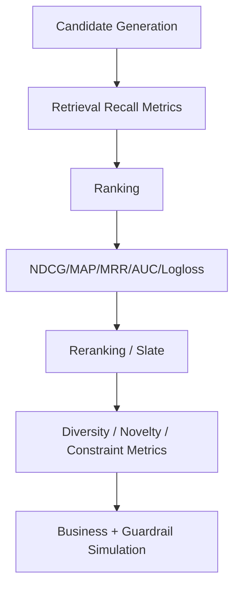

------
title: Build From Scratch Recommendations System - Part 063
description: Mendesain offline evaluation metrics untuk recommendation system production-grade: retrieval recall, ranking metrics, NDCG/MAP/MRR, calibration, diversity, novelty, coverage, counterfactual limitations, segment analysis, leakage checks, and metric governance.
series: learn-build-from-scratch-recommendations-system
seriesTitle: Build From Scratch: Enterprise Recommendations System
order: 63
partTitle: Offline Evaluation Metrics
tags:
  - recommendation-system
  - recsys
  - offline-evaluation
  - metrics
  - ranking
  - experimentation
  - series
date: 2026-07-02
---

# Part 063 — Offline Evaluation Metrics

Mulai Part 063, kita masuk Module 8: **Evaluation, Experimentation, dan Observability**.

Recommendation system tidak boleh hanya “kelihatannya bekerja”.

Kita harus mampu menjawab:

```text
Apakah retrieval source punya recall cukup?
Apakah ranker mengurutkan item yang benar?
Apakah model calibrated?
Apakah slate terlalu repetitif?
Apakah cold-start membaik?
Apakah segment tertentu memburuk?
Apakah offline metric benar-benar berkorelasi dengan online outcome?
Apakah data evaluation bebas leakage?
```

Offline evaluation adalah filter awal sebelum model/policy diuji online.

Tetapi offline evaluation juga penuh jebakan:

- historical bias,
- missing counterfactual,
- exposure bias,
- random split leakage,
- proxy metric,
- candidate set mismatch,
- label maturity,
- metric overfitting,
- segment harm hidden by global average.

Part ini membahas offline evaluation metrics production-grade untuk recommendation system: retrieval, ranking, calibration, slate-level quality, diversity/novelty, coverage, segment analysis, evaluation dataset, leakage control, and metric governance.

---

## 1. Mental Model: Offline Evaluation Is a Safety Gate, Not Final Truth

Offline evaluation menjawab:

```text
Based on historical logged data, is this model/policy promising and safe enough to test online?
```

Ia tidak menjawab sepenuhnya:

```text
Will this improve product metrics in production?
```

Kenapa?

Karena historical data berasal dari policy lama.

Jika item tidak pernah ditampilkan, kita tidak tahu user akan bereaksi bagaimana.

Offline metric adalah necessary gate, not sufficient proof.

---

## 2. Evaluation Levels

Recommendation evaluation punya beberapa level:

```text
candidate generation
ranking
reranking/slate
calibration
business utility
fairness/exposure
latency/cost
segment robustness
```

Each level needs different metric.



Do not use one metric for all layers.

---

## 3. Evaluation Dataset Design

Evaluation dataset defines truth boundary.

It should specify:

```text
prediction time
candidate universe
labels
label windows
exposure policy
negative examples
temporal split
segment definitions
eligibility snapshot
```

Bad evaluation data creates misleading metrics.

Example dataset spec:

```yaml
evaluation_dataset: home_ranker_eval_20260702
base: logged_impressions
surface: home_feed
prediction_time: impression_time
labels:
  click_30m: v3
  purchase_7d: v2
  hide_7d: v1
split:
  type: temporal
  test_window: 2026-06-29..2026-07-01
candidate_set:
  source: logged_candidate_pool_sample
```

---

## 4. Temporal Evaluation

Use temporal splits.

```text
train: older data
validation: newer data
test: newest data
```

Why?

Production predicts future behavior.

Random split leaks:

- user behavior,
- item popularity,
- session duplicates,
- future catalog state,
- future labels.

Offline metric from random split often too optimistic.

---

## 5. Candidate Set for Offline Ranking Evaluation

Ranker evaluation needs candidate set.

Options:

### Logged Impressions Only

Evaluate among items actually shown.

Pros:

- labels available.

Cons:

- limited to old policy.

### Logged Candidate Pool

Evaluate candidates generated during serving, shown or not.

Pros:

- closer to ranker decision.

Cons:

- labels missing for unshown candidates.

### Reconstructed Candidate Pool

Run candidate generation offline.

Pros:

- evaluate new candidate sources.

Cons:

- labels/counterfactual missing.

Be explicit which one is used.

---

## 6. Retrieval Evaluation

Candidate generation goal:

```text
include relevant items in candidate pool
```

Metric:

```text
recall@K
```

Example:

```text
Did candidate source retrieve item user clicked/purchased?
```

If positive item is not in candidate pool, ranker cannot rank it.

Retrieval recall is upper bound for ranking.

---

## 7. Retrieval Recall@K

For each query/user/context with known positive item:

```text
recall@K = 1 if positive item in top K candidates else 0
```

Aggregate average.

Example:

```text
Recall@100 = 0.72
Recall@500 = 0.88
Recall@1000 = 0.93
```

Choose K based on downstream ranker capacity.

---

## 8. Retrieval Recall by Source

Evaluate source contribution.

Metrics:

```text
recall@K by source
marginal recall by source
source overlap
unique positives found
source latency/cost
```

Example:

```text
two_tower recall@500: 0.62
item_cf recall@500: 0.31
content recall@500: 0.22
combined recall@500: 0.81
```

Combined recall matters, but marginal recall tells which source adds unique value.

---

## 9. Candidate Pool Diagnostics

Measure:

```text
candidate_count
unique_candidate_count
duplicate_rate
eligible_after_filter_rate
source_distribution
category_distribution
new_item_share
long_tail_share
empty_pool_rate
```

Candidate source may have good recall but bad diversity or high invalid rate.

---

## 10. Ranking Metrics Overview

Common ranking metrics:

```text
NDCG@K
MAP@K
MRR@K
Recall@K
Precision@K
HitRate@K
AUC
Logloss
Calibration metrics
```

Choose by task.

- NDCG for graded relevance and top-heavy ranking.
- MRR for first relevant item.
- MAP for multiple relevant items.
- AUC/logloss for pointwise binary prediction.
- Calibration for probability quality.

---

## 11. Precision@K

```text
Precision@K = relevant items in top K / K
```

Good when:

- multiple relevant items,
- fixed slate size,
- relevance labels available.

Weakness:

- ignores order within top K,
- binary relevance,
- sensitive to incomplete labels.

For RecSys, labels are often incomplete because unshown items unknown.

---

## 12. Recall@K for Ranking

```text
Recall@K = relevant items in top K / all relevant items
```

Useful when relevant set known.

Examples:

- next-item prediction,
- held-out purchases,
- known consumed items.

But “all relevant items” often unknown.

Use carefully.

---

## 13. HitRate@K

```text
HitRate@K = 1 if any relevant item in top K
```

Common for next-item evaluation.

Example:

```text
Did held-out next item appear in top 20?
```

Simple but loses nuance.

If user has multiple valid outcomes, HitRate can underrepresent quality.

---

## 14. MRR@K

Mean Reciprocal Rank:

```text
MRR = 1 / rank_of_first_relevant_item
```

Good for tasks where first relevant result matters:

- search,
- support article lookup,
- enterprise case recommendation,
- “next best action” if one correct action.

Less useful when slate has many relevant items.

---

## 15. MAP@K

Mean Average Precision:

```text
average precision over relevant items in top K
```

Good when multiple relevant items and order matters.

Needs reliable relevant set.

In recommendation, labels incomplete; MAP can be biased.

---

## 16. DCG and NDCG

DCG:

```text
DCG@K = sum((2^rel_i - 1) / log2(i + 1))
```

NDCG normalizes by ideal ranking.

```text
NDCG@K = DCG@K / IDCG@K
```

NDCG handles graded relevance and top-heavy value.

Very common for learning-to-rank.

---

## 17. Graded Relevance

Instead of binary label:

```text
hide/report: negative
impression no action: 0
click: 1
save/cart: 2
purchase/complete: 3
```

Example:

```yaml
relevance_grade:
  report: -3
  hide: -1
  click: 1
  add_to_cart: 2
  purchase: 3
```

NDCG can use graded relevance.

Be careful mixing actions with different business meaning.

---

## 18. NDCG Caveats

NDCG can mislead if:

- labels are biased by old positions,
- unshown candidates treated as irrelevant,
- relevance grades arbitrary,
- evaluation set lacks hard negatives,
- popularity dominates,
- segment metrics ignored.

NDCG is useful but not truth.

---

## 19. AUC

AUC measures pairwise ordering of positives above negatives.

Useful for binary classifiers.

But:

- not top-K specific,
- can improve while top positions don't,
- insensitive to calibration,
- large easy negatives can inflate AUC.

For recommender ranking, AUC alone is insufficient.

---

## 20. Logloss

Logloss evaluates probability prediction.

Good for:

- click probability,
- conversion probability,
- hide/report risk.

If model outputs probabilities, logloss matters.

But lower logloss does not always mean better ranking/slate.

Use with ranking metrics.

---

## 21. Calibration Metrics

Calibration asks:

```text
When model predicts 10% click probability, does click happen around 10%?
```

Metrics:

- calibration curve,
- expected calibration error,
- Brier score,
- reliability diagram.

Calibration is important for:

- utility composition,
- multi-objective ranking,
- thresholds,
- business trade-offs.

---

## 22. Brier Score

For probability prediction:

```text
Brier = mean((p - y)^2)
```

Lower is better.

It combines calibration and discrimination.

Useful for probability outputs but less top-K focused.

---

## 23. Multi-Task Evaluation

If model predicts multiple tasks:

```text
p_click
p_purchase
p_hide
p_report
p_satisfaction
```

Evaluate each:

- AUC/logloss/calibration per task,
- segment metrics,
- utility simulation.

Do not only evaluate final composed score.

A model with good click and terrible hide risk can be dangerous.

---

## 24. Utility Simulation

If ranking uses utility:

```text
utility = 1*click + 5*purchase - 3*hide - 50*report
```

Offline simulate expected utility.

But utility weights are product policy.

Need:

- sensitivity analysis,
- guardrails,
- segment checks.

Utility simulation is only as good as prediction/label quality.

---

## 25. Slate-Level Offline Metrics

Reranking/slate evaluation includes:

```text
slate predicted utility
category diversity
creator diversity
intra-list similarity
novelty
coverage
source mix
frequency cap violations
policy violations
sponsored count
repetition
```

User sees slate, not item scores.

Evaluate final slate after reranker.

---

## 26. Diversity Metrics

Metrics:

```text
category_entropy
distinct_categories@K
distinct_creators@K
intra_list_similarity
max_same_creator_count
max_same_category_count
```

Evaluate by surface.

Search may need lower diversity than home feed.

Diversity without relevance is not success.

---

## 27. Novelty Metrics

Metrics:

```text
new_to_user_rate
not_seen_30d_rate
long_tail_share
new_item_share
topic_distance_from_profile
creator_not_seen_30d
```

Pair with relevance/engagement guardrails.

Novelty can degrade quality if unbounded.

---

## 28. Coverage Metrics

Coverage:

```text
catalog_coverage
creator_coverage
seller_coverage
category_coverage
new_item_coverage
tenant_document_coverage
```

Use exposure-weighted coverage for offline slate simulation.

Coverage helps monitor ecosystem, but not optimize blindly.

---

## 29. Constraint Metrics

For reranking/policy:

```text
hard_constraint_violation_count
soft_constraint_satisfaction_rate
dedup_violation_rate
max_sponsored_violation
frequency_cap_violation
policy_required_inclusion_rate
empty_slate_rate
```

Hard violation should be zero.

Constraint metrics are release gates.

---

## 30. Offline Latency/Cost Metrics

Evaluation should include serving feasibility.

Metrics:

```text
candidate_count
feature_count
model_size
inference_latency_estimate
memory footprint
ANN query latency benchmark
cache payload size
```

Offline quality improvement that cannot serve within budget is not production-ready.

---

## 31. Segment Evaluation

Always slice metrics.

Segments:

```text
new users
anonymous users
heavy users
new items
long-tail items
regions
languages
device types
surfaces
candidate sources
tenants
categories
privacy modes
```

Global NDCG can improve while important segment degrades.

Segment gates catch this.

---

## 32. Cold-Start Evaluation

For new items/users:

```text
new_user_recall@K
new_user_ndcg@K
new_item_exposure_simulation
new_item_retrieval_recall
content-only performance
anonymous performance
```

Cold-start often hidden by warm-user metrics.

Evaluate separately.

---

## 33. Negative Feedback Metrics

Track:

```text
hide@K
report@K
predicted_negative_utility
negative_rate_by_segment
negative in top positions
```

A model that improves CTR by showing controversial content may be bad.

Negative feedback should be first-class.

---

## 34. Offline Evaluation for Candidate Sources

For each source:

- recall,
- marginal recall,
- latency,
- cost,
- freshness,
- coverage,
- invalid rate,
- diversity,
- cold-start contribution.

Source evaluation table:

| Source | Recall@500 | Marginal Recall | Invalid Rate | p95 Latency |
|---|---:|---:|---:|---:|
| two_tower | 0.62 | 0.39 | 3% | 30ms |
| item_cf | 0.31 | 0.11 | 5% | 25ms |
| trending | 0.18 | 0.07 | 1% | 5ms |

---

## 35. Offline Evaluation for Ranking Models

Compare model versions:

```text
champion vs challenger
```

Metrics:

- NDCG@K,
- AUC/logloss per task,
- calibration,
- utility simulation,
- segment metrics,
- feature missing sensitivity,
- latency/model size.

Use same evaluation dataset.

---

## 36. Offline Evaluation for Reranking Policies

Compare:

```text
topK baseline
diversity policy A
diversity policy B
frequency policy C
exploration policy D
```

Metrics:

- predicted utility loss/gain,
- diversity gain,
- novelty gain,
- constraint violations,
- source/category distribution,
- empty slate rate.

Reranking changes often trade relevance for diversity/fairness. Make trade-off explicit.

---

## 37. Offline Evaluation for Business Rules

Simulate rule impact:

```text
candidate rejection rate
slate change rate
affected users
affected categories
empty slate rate
primary metric proxy impact
hard violation prevention
```

For new rule, shadow evaluation before production.

Rule that rejects 40% candidates may need fallback/source changes.

---

## 38. Offline Evaluation for LLM-Augmented Components

Metrics by use case:

### Intent Parser

```text
schema validity
constraint extraction accuracy
clarification precision
```

### Metadata Enrichment

```text
taxonomy precision/recall
human agreement
invalid output rate
```

### Explanation

```text
faithfulness
unsupported claim rate
policy violation rate
```

LLM components need their own evaluation, not only RecSys metric.

---

## 39. Counterfactual Limitation

Offline data is biased because old policy chose what users saw.

If model A would show items never shown before, offline labels cannot evaluate them.

This affects:

- long-tail,
- new source,
- exploration,
- diversity,
- serendipity.

Use offline evaluation to screen, then online experiment.

---

## 40. Position Bias

Items in higher position get more clicks.

Offline labels reflect position.

Mitigations:

- position features,
- debiasing,
- propensity weighting,
- randomized exploration data,
- evaluate within comparable positions,
- click models.

Do not treat click as pure relevance.

---

## 41. Selection Bias

Logged examples are selected by old candidate generation/ranking.

Unshown items lack labels.

If new ranker changes candidate distribution, offline metric may not predict online effect.

Record candidate generation policy and candidate sets.

Use exploration to improve support.

---

## 42. Label Incompleteness

No click does not mean irrelevant.

User may not see item, be busy, already know it, or convert later.

Labels are weak signals.

Use:

- viewability,
- dwell,
- delayed windows,
- negative feedback,
- multiple labels,
- uncertainty/weights.

---

## 43. Metric Correlation with Online

Track whether offline metric changes predict online metrics.

Example:

```text
+1% NDCG@20 historically correlates with +0.2% CTR
```

If offline metric stops predicting online, revisit metric/dataset.

Metric governance includes metric validity.

---

## 44. Offline Metric Overfitting

Teams can overfit to offline benchmark.

Symptoms:

- offline improves, online flat/worse,
- model exploits label artifact,
- segment harm,
- metric gaming.

Mitigate:

- holdout test,
- rolling windows,
- online validation,
- multiple metrics,
- causal experiments,
- periodic metric review.

---

## 45. Metric Governance

For each metric define:

```text
name
formula
owner
dataset
label version
window
segments
known limitations
use in gates
last reviewed
```

Metric definitions should be versioned.

Do not let every team compute “NDCG” differently.

---

## 46. Evaluation Report Template

Candidate model/policy report:

```text
summary
candidate/champion versions
evaluation dataset version
global metrics
segment metrics
calibration
retrieval/ranking/slate metrics
guardrails
latency/cost
known risks
recommendation
next online test plan
```

Attach to model/policy registry.

---

## 47. Common Failure Modes

### 47.1 Random Split Leakage

Offline inflated.

### 47.2 Treating Unshown Items as Negative

Bias.

### 47.3 Only Global Metric

Segment regressions hidden.

### 47.4 NDCG Without Label Quality

Metric meaningless.

### 47.5 Candidate Set Mismatch

Offline ranker evaluated on unrealistic pool.

### 47.6 No Calibration Evaluation

Utility composition unreliable.

### 47.7 Diversity Metric Optimized Alone

Randomness increases.

### 47.8 Offline Metric Treated as Final Proof

Online fails.

### 47.9 Metric Definition Drift

Comparisons invalid.

### 47.10 No Negative Feedback Metric

Trust degradation missed.

---

## 48. Implementation Sketch: Metric Interface

```java
public interface OfflineMetric {
    String name();

    MetricResult compute(EvaluationDataset dataset, RankingOutput output);
}

public record MetricResult(
    String metricName,
    double value,
    Map<String, Double> segmentValues,
    Map<String, Object> diagnostics
) {}
```

Metric computation should be versioned and tested.

---

## 49. Implementation Sketch: NDCG@K

```java
public final class NdcgAtK implements OfflineMetric {
    private final int k;

    @Override
    public String name() {
        return "ndcg_at_" + k;
    }

    @Override
    public MetricResult compute(EvaluationDataset dataset, RankingOutput output) {
        double sum = 0.0;
        int groups = 0;

        for (EvaluationGroup group : dataset.groups()) {
            List<ScoredItem> ranked = output.rankedItems(group.groupId());
            double dcg = dcg(ranked.subList(0, Math.min(k, ranked.size())), group.relevance());
            double idcg = idealDcg(group.relevance(), k);

            if (idcg > 0.0) {
                sum += dcg / idcg;
                groups++;
            }
        }

        return new MetricResult(name(), sum / Math.max(groups, 1), Map.of(), Map.of("groups", groups));
    }

    private double dcg(List<ScoredItem> ranked, Map<String, Integer> rel) {
        double value = 0.0;
        for (int i = 0; i < ranked.size(); i++) {
            int grade = rel.getOrDefault(ranked.get(i).itemId(), 0);
            value += (Math.pow(2, grade) - 1.0) / (Math.log(i + 2) / Math.log(2));
        }
        return value;
    }
}
```

Production implementation must handle ties, negatives, missing labels, and segments.

---

## 50. Minimal Production Offline Evaluation Plan

Start with:

```yaml
evaluation_dataset:
  temporal_split: true
  label_versions: explicit
  candidate_set: logged_candidate_pool
retrieval_metrics:
  - recall_at_100
  - recall_at_500
  - marginal_recall_by_source
ranking_metrics:
  - ndcg_at_20
  - mrr_at_20
  - auc_click
  - logloss_click
  - calibration_ece
slate_metrics:
  - category_entropy
  - distinct_creators
  - duplicate_rate
  - constraint_violation_rate
guardrails:
  - hide_rate_proxy
  - report_rate_proxy
  - cold_start_segment
  - latency_estimate
segments:
  - new_user
  - new_item
  - region
  - category
  - privacy_mode
governance:
  metric_definitions_versioned: true
  evaluation_report_required: true
```

---

## 51. Checklist Offline Evaluation Readiness

```text
[ ] Evaluation dataset is versioned.
[ ] Temporal split is used.
[ ] Label definitions and maturity windows are explicit.
[ ] Candidate set definition is explicit.
[ ] Retrieval recall is measured.
[ ] Ranking metrics include NDCG/MRR/AUC/logloss as appropriate.
[ ] Calibration is evaluated for probability outputs.
[ ] Slate metrics include diversity/novelty/constraint metrics.
[ ] Negative feedback metrics are included.
[ ] Segment metrics are mandatory.
[ ] Cold-start metrics are separate.
[ ] Latency/cost feasibility is measured.
[ ] Counterfactual limitations are documented.
[ ] Metric definitions are versioned.
[ ] Evaluation reports compare champion vs challenger.
[ ] Offline metrics are validated against online outcomes over time.
```

---

## 52. Kesimpulan

Offline evaluation adalah gate penting untuk mencegah model/policy buruk masuk online experiment.

Prinsip utama:

1. Offline evaluation is a safety gate, not final truth.
2. Candidate generation, ranking, reranking, calibration, and slate need different metrics.
3. Temporal split and point-in-time safety are mandatory.
4. Retrieval recall limits downstream ranking quality.
5. NDCG/MAP/MRR are useful only with clear labels and candidate sets.
6. Calibration matters for utility composition.
7. Diversity/novelty/coverage metrics must be paired with relevance/guardrails.
8. Segment metrics are mandatory.
9. Historical logs are biased by old policy.
10. Online experiments are still required for causal product validation.

Di Part 064, kita akan membahas **Online Experimentation and A/B Testing**: bagaimana menjalankan eksperimen recommendation system secara benar, aman, statistically valid, dan operable di production.
